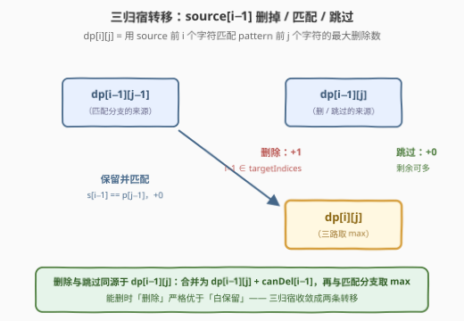
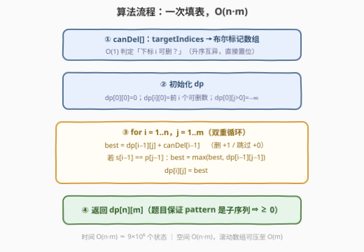
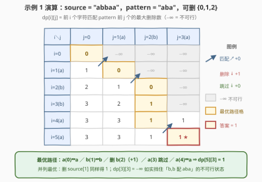

# 从原字符串里进行删除操作的最多次数

- **题目名称**：从原字符串里进行删除操作的最多次数
- **链接**：[3316. 从原字符串里进行删除操作的最多次数](https://leetcode.cn/problems/find-maximum-removals-from-source-string/)
- **难度**：中等
- **标签**：数组、哈希表、双指针、字符串、动态规划
- **关联**：与 [1143. 最长公共子序列](https://leetcode.cn/problems/longest-common-subsequence/)（[站内题解](../1101-1200/1143_最长公共子序列.md)）同属双序列 DP 家族——把「删除计数」嫁接到 LCS 式转移上；官方 hints 只有两条：用 DP、在每个可删下标处做删/不删决策

## 1. 题目概述

给你一个长度为 $n$ 的字符串 `source`，一个字符串 `pattern` 且它是 `source` 的**子序列**，和一个**有序**整数数组 `targetIndices`，数组中的元素是 $[0, n-1]$ 中**互不相同**的数字。

定义一次**操作**为删除 `source` 中下标为 $idx$ 的一个字符，且需要满足：

- $idx$ 是 `targetIndices` 中的一个元素；
- 删除字符后，`pattern` **仍然是** `source` 的一个子序列。

执行操作后**不会**改变字符在 `source` 中的下标位置（比如从 `"acb"` 中删除 `'c'`，下标为 2 的字符仍然是 `'b'`）。

返回**最多**可以执行多少次删除操作。

**示例 1**：

```text
输入：source = "abbaa", pattern = "aba", targetIndices = [0,1,2]
输出：1
解释：不能删除 source[0]，但可以删除 source[1]（变为 "a_baa"）或 source[2]（变为 "ab_aa"）。
```

**示例 2**：

```text
输入：source = "bcda", pattern = "d", targetIndices = [0,3]
输出：2
解释：删除 source[0] 和 source[3] 后，原下标体系下幸存的字符是 source[1]='c'、source[2]='d'，
      即剩余字符串 "cd"，"d" 仍是它的子序列。
```

> 💡 判定的对象永远是**原串中未被删除的幸存字符**：删除不引起下标重排，删掉 `source[3]` 之后 `source[2]` 依然叫 `source[2]`。本题删除的两个位置（0 和 3）都不参与匹配——`pattern` 的 `'d'` 由幸存的 `source[2]` 兜底，这正是「匹配字符」与「删除字符」可以**不是同一批**的直观体现。

**示例 3**：

```text
输入：source = "dda", pattern = "dda", targetIndices = [0,1,2]
输出：0
解释：pattern 恰好用满整个 source，删任何一个都破坏匹配。
```

**示例 4**：

```text
输入：source = "yeyeykyded", pattern = "yeyyd", targetIndices = [0,2,3,4]
输出：2
解释：删除 source[2] 和 source[3]，剩余 "yeykyded"，其中 y(0) e(1) y(4) d(7) 依序匹配 "yeyyd" ✓。
```

**约束条件**：

- $1 \le n = \text{source.length} \le 3 \times 10^3$
- $1 \le \text{pattern.length} \le n$
- $1 \le \text{targetIndices.length} \le n$，且**升序**、互不相同
- `source` 和 `pattern` 只包含小写英文字母
- 输入保证 `pattern` 是 `source` 的一个子序列

> 💡 **读题关键**：① **下标不重排**——删除 `source[i]` 后，其余字符仍按原下标识别，`targetIndices` 永远指原串位置；② `pattern` 只需是**剩余字符的子序列**，不要求删完恰好剩下 `pattern`——source 可以保留比 pattern 多的字符，这是后文「保留但跳过」转移合法的根源；③ `targetIndices` 升序互异，用一个布尔数组即可 $O(1)$ 判定「该下标可删」。

---

## 2. 解题思路

### 2.1 暴力思路：子集枚举，以及两个「看起来对」的贪心为何都错

最直接的翻译：枚举 `targetIndices` 的每个子集 $S$，删掉 $S$ 中的字符后用双指针检查 `pattern` 是否仍为剩余字符的子序列，取可行的最大 $|S|$。

$$\text{复杂度} = O\big(2^k \cdot n\big),\qquad k = |\text{targetIndices}| \le n = 3000$$

指数级，$k=30$ 时就已经 $10^9$ 步，完全不可行。

比复杂度更值得警惕的是：**两类「直觉贪心」都会翻车**，它们恰好从两个方向说明本题为什么必须 DP。

**贪心 A（能删就删，顺序处理）**：`source = "abab"`, `pattern = "aab"`, `targetIndices = [0,2]`。先删 `source[0]='a'` → 剩 `"bab"`，只剩一个 `a`，凑不出两个 `a` 开头的 `"aab"`，**死局**；而正确答案恰是 $0$（谁也不能删：单独删 0 或 2 剩 `"bab"`/`"abb"` 都只有一个 `a`）。局部「可删」≠ 全局「该删」。

**贪心 B（最早匹配，匹配置于删除之前）**：`source = "aaaa"`, `pattern = "aa"`, `targetIndices = [0,1]`。双指针贪心用 `a(0), a(1)` 匹配 `pattern`，于是前两个 `a` 被占用，一个都删不掉，得 $0$；但最优解是**删掉 `a(0)` 和 `a(1)`**，让 `a(2), a(3)` 完成匹配，答案 $2$。

两个反例的共同根源：**「哪些字符用于匹配」与「哪些字符用于删除」在争抢同一批字符**，任何一类决策先行都会改变另一类的全局可行性。局部决策无法刻画这种纠缠，必须把两类决策放进同一个状态里**联立求解**——这正是动态规划的用武之地。

### 2.2 核心观察：把「删除」和「匹配」塞进同一张双序列 DP

DP 能成立的前提是**无后效性**。它从哪来？子序列匹配天然具有**前缀性**：

> `pattern[j..]` 能否匹配完成，只取决于 `source[i..]` 中还剩哪些字符，与 `source[0..i)` 里删了谁、怎么匹配的**毫无关系**。

因此「历史」被状态 $(i, j)$ 完全吸收，删除决策与匹配决策可以在同一张表里共存。这正是 LCS（[1143](../1101-1200/1143_最长公共子序列.md)）一族的标准舞台，只不过这次格子里存的是**最大删除数**。

**状态定义**：

$$dp[i][j] = \text{只考虑 source 前 } i \text{ 个字符、pattern 前 } j \text{ 个字符已全部匹配为子序列时的最大删除数}$$

不可达状态记 $-\infty$。转移时看 `source[i-1]` 的**三种归宿**：

| 归宿 | 前置条件 | 转移 | 增量 |
|------|----------|------|------|
| **删除** | $i-1 \in \text{targetIndices}$ | $dp[i-1][j] + 1$ | $+1$ |
| **保留并匹配** | $source[i-1] = pattern[j-1]$ | $dp[i-1][j-1]$ | $+0$ |
| **保留但跳过** | 无（剩余字符可以比 pattern 多） | $dp[i-1][j]$ | $+0$ |



一个漂亮的化简：**删除与跳过同源于 $dp[i-1][j]$**——能删时「删除」严格优于「白保留」，二者合并为一条转移 $dp[i-1][j] + \text{canDel}[i-1]$；匹配分支独立取 $\max$。三归宿收敛成两行代码。

**初始化**：

- $dp[0][0] = 0$：空前缀匹配空前缀，删 $0$ 个；
- $dp[i][0] = dp[i-1][0] + \text{canDel}[i-1]$：`pattern` 为空串时永远是子序列，前 $i$ 个字符里可删的**全删**；
- $dp[0][j>0] = -\infty$：没有字符可用，无法匹配非空前缀。

**答案**：$dp[n][m]$。题目保证 `pattern` 是 `source` 的子序列 ⇒「一个不删」这条路径恒可行 ⇒ $dp[n][m] \ge 0$，无需特判不可行。

### 2.3 算法流程



流程汇总：

1. 把 `targetIndices` 转成布尔数组 `canDel[]`（$O(1)$ 查询，对应标签里的「哈希表」）；
2. 初始化 $dp$：$dp[0][0]=0$、首列、$-\infty$ 哨兵；
3. 双层循环 $i = 1..n$、$j = 1..m$，每格取「删/跳过」与「匹配」两路的 $\max$；
4. 返回 $dp[n][m]$。

### 2.4 示例演算

拿示例 1（`source = "abbaa"`, `pattern = "aba"`, 可删下标 $\{0,1,2\}$）填一遍整张表，并回溯出最优路径：



表格逐格读法（第 $i$ 行对应 `source[i-1]`，第 $j$ 列对应 `pattern[j-1]`）：

- $dp[3][0] = 3$：前三个字符全在可删集里，`pattern` 空串怎么删都成立；
- $dp[2][2] = 0$：`a(0)` 匹配 `p0`、`b(1)` 匹配 `p1`，一个没删；
- $dp[3][2] = 1$：在上一状态基础上**删除 `b(2)`**（$+1$），`p2='a'` 留给后面；
- $dp[4][2] = 1$：`a(3)` 保留但跳过（不可删，$+0$）；
- $dp[5][3] = 1$：`a(4)` 匹配 `p2`，收尾。

最优路径即「`a(0)↔a`、`b(1)↔b`、**删 `b(2)`**、`a(3)` 跳过、`a(4)↔a`」，共删 $1$ 次，与官方解释一致（删 `source[1]` 是另一条并列最优路径）。注意 $dp[3][3] = -\infty$ 这格：前三个字符里 `b,b` 无法匹配 `"aba"` 的前三个字符，不可行状态被 $-\infty$ 忠实挡住。

---

## 3. 参考代码

### C++

```cpp
class Solution {
  public:
    int maxRemovals(string source, string pattern, vector<int>& targetIndices) {
        int n = source.size(), m = pattern.size();
        vector<char> canDel(n, 0);                 // canDel[i]=1 ⇔ i ∈ targetIndices
        for (int idx : targetIndices) canDel[idx] = 1;

        const int NEG = INT_MIN / 2;               // -∞：状态不可行（留余量防 +1 溢出）
        vector<vector<int>> dp(n + 1, vector<int>(m + 1, NEG));
        dp[0][0] = 0;
        for (int i = 1; i <= n; ++i)               // 首列：pattern 为空，可删的全删
            dp[i][0] = dp[i - 1][0] + canDel[i - 1];

        for (int i = 1; i <= n; ++i)
            for (int j = 1; j <= m; ++j) {
                int best = dp[i - 1][j] + canDel[i - 1];        // 删除(+1) / 保留跳过(+0)
                if (source[i - 1] == pattern[j - 1])
                    best = max(best, dp[i - 1][j - 1]);         // 保留并匹配
                dp[i][j] = best;
            }
        return dp[n][m];
    }
};
```

### Python

```python
class Solution:
    def maxRemovals(self, source: str, pattern: str, targetIndices: List[int]) -> int:
        n, m = len(source), len(pattern)
        can_del = [0] * n                          # can_del[i]=1 ⇔ i ∈ targetIndices
        for idx in targetIndices:
            can_del[idx] = 1

        NEG = float('-inf')                        # -∞：状态不可行
        dp = [[NEG] * (m + 1) for _ in range(n + 1)]
        dp[0][0] = 0
        for i in range(1, n + 1):                  # 首列：pattern 为空，可删的全删
            dp[i][0] = dp[i - 1][0] + can_del[i - 1]

        for i in range(1, n + 1):
            for j in range(1, m + 1):
                best = dp[i - 1][j] + can_del[i - 1]      # 删除(+1) / 保留跳过(+0)
                if source[i - 1] == pattern[j - 1]:
                    best = max(best, dp[i - 1][j - 1])    # 保留并匹配
                dp[i][j] = best
        return dp[n][m]
```

> 💡 **实现细节**：① `canDel` 用 `vector<char>` / `list[int]` 平铺布尔数组而非 `set`，$O(1)$ 判定且缓存友好（这就是官方标签「哈希表」的落点）；② $-\infty$ 在 C++ 里取 `INT_MIN / 2`——转移每次至多 $+1$、全程至多加 $n = 3000$ 次，永远醒着当负数，不会溢出也不会翻身变成「可行」；Python 的 `float('-inf')` 加法天然安全；③ 「删除 / 跳过」合并成 `dp[i-1][j] + canDel[i-1]` 一条转移后，整个循环体只剩一次比较和一次 `max`，$9 \times 10^6$ 格轻松跑完。

---

## 4. 复杂度分析

| 维度 | 复杂度 | 说明 |
|------|--------|------|
| 时间复杂度 | $O(n \cdot m)$ | $(n+1) \times (m+1)$ 个状态，每状态 $O(1)$ 转移；$n, m \le 3 \times 10^3$，约 $9 \times 10^6$ 步 |
| 空间复杂度 | $O(n \cdot m)$ | 二维 DP 表；滚动数组可压至 $O(m)$（见第 5 节） |
| 暴力对照 | $O(2^k \cdot n)$ | $k = \lvert\text{targetIndices}\rvert \le 3000$，指数级爆炸；两个方向的单步贪心则各有专门反例（2.1 节） |

实测：四组官方样例分别得 $1 / 2 / 0 / 2$ ✓；与「子集枚举 + 双指针判定」暴力对拍随机数据（$n \le 8$）3000 组全部一致；贪心反例 `abab/aab/[0,2] → 0`、`aaaa/aa/[0,1] → 2` 均正确。

---

## 5. 扩展：滚动数组与「不可行」语义

**滚动数组**：$dp[i][\cdot]$ 只依赖 $dp[i-1][\cdot]$，把外层维度滚掉即可降到 $O(m)$ 空间。由于匹配分支要读「上一行的 $j-1$ 列」，滚动时需**倒序遍历 $j$**（同 0-1 背包的读旧写新技巧），或在更新前暂存左上旧值：

```cpp
vector<int> dp(m + 1, NEG);
dp[0] = 0;                                // 首列的滚动维护放在外层循环里
for (int i = 1; i <= n; ++i) {
    dp[0] += canDel[i - 1];               // pattern 空串：可删全删
    for (int j = m; j >= 1; --j) {        // 倒序：保住上一行的 j-1
        int best = dp[j] + canDel[i - 1];
        if (source[i - 1] == pattern[j - 1])
            best = max(best, dp[j - 1]);
        dp[j] = best;
    }
}
return dp[m];
```

**「不可行」语义的一个变体**：本题输入保证 `pattern` 是 `source` 的子序列，$dp[n][m]$ 必然非负。若去掉这个保证（比如允许随意输入），$dp[n][m] = -\infty$ 就表示「无论怎么删都配不出 `pattern`」，此时应返回 $0$（一次操作也做不了）或按题意特判——$-\infty$ 哨兵让这类变体**零成本**获得语义支持，这正是双序列 DP 里统一用「不可行 = $-\infty$」而非「不可行 = 特殊返回值」的好处。

---

## 6. 面试要点

1. **为什么贪心不行？能举出反例吗？**

   - 两个方向都有：「能删就删」死在 `abab/aab/[0,2]`（先删 `a(0)` 后凑不出两个 `a`，答案实为 $0$）；「最早匹配」死在 `aaaa/aa/[0,1]`（占用了本该删的字符，答案应是 $2$ 而非 $0$）。根源是匹配与删除**争抢同一批字符**，局部决策改变全局可行性。

2. **状态为什么无后效性？**

   - 子序列匹配的前缀性：`pattern[j..]` 的可行性只取决于 `source[i..]` 中剩余的字符，与前面删了谁无关。$(i, j)$ 把全部历史吸收干净，两类决策得以在同一张表联立。

3. **「保留但跳过」这条转移为什么合法、又为什么可以和删除合并？**

   - 合法：`pattern` 只需是剩余字符的子序列，剩余字符可以比 `pattern` 长，未被匹配的保留字符天经地义。合并：跳过与删除都从 $dp[i-1][j]$ 出发，到达同一状态 $(i,j)$ 后后续完全相同，而删除多 $+1$——能删时删除**严格支配**跳过，于是写成 $dp[i-1][j] + \text{canDel}[i-1]$ 一条。

4. **初始化为什么这样设？$-\infty$ 有什么用？**

   - $dp[i][0]$ 是「前 $i$ 个字符里可删的个数」：空 `pattern` 恒为子序列，能删全删。$dp[0][j>0] = -\infty$：无字符可配。$-\infty$ 让「不可行」参与 $\max$ 运算而不污染结果（负数加有限次 $1$ 仍是负数），还顺带支持了第 5 节的变体。

5. **空间怎么优化？倒序遍历是为了什么？**

   - 滚动一维 $O(m)$。匹配分支要读上一行的 $j-1$ 列，正序更新会先把 $dp[j-1]$ 覆盖成当前行——倒序遍历 $j$ 保证「读旧写新」，与 0-1 背包同源。

---

## 7. 同类练习题

- [1143. 最长公共子序列](https://leetcode.cn/problems/longest-common-subsequence/)（[站内题解](../1101-1200/1143_最长公共子序列.md)）：双序列 DP 母题，本题的「匹配」分支就是它的对角转移，格子里存的量不同而已
- [115. 不同的子序列](https://leetcode.cn/problems/distinct-subsequences/)：同一套 $(i,j)$ 状态设计改数「匹配方案数」，与本题「最大化删除数」互为双序列 DP 的计数/最值两面
- [392. 判断子序列](https://leetcode.cn/problems/is-subsequence/)（[站内题解](../0301-0400/392_判断子序列.md)）：本题暴力枚举里的判定子程序——双指针贪心判定单个子序列，$O(n)$
- [524. 通过删除字母匹配到字典里最长单词](https://leetcode.cn/problems/longest-word-in-dictionary-through-deleting/)：同样活在「删掉若干字符后是否仍是子序列」的判定框架里，只是它判定的对象是一整个字典
- [2486. 追加字符以获得子序列](https://leetcode.cn/problems/append-characters-to-string-to-make-subsequence/)：子序列匹配的贪心视角（双指针扫到哪算哪），可对比体会「本题为什么贪心失效」——它没有删除与匹配的资源争抢
