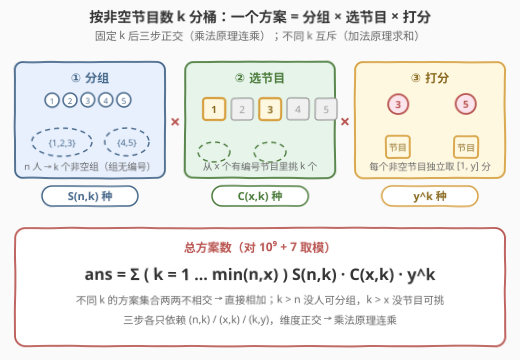
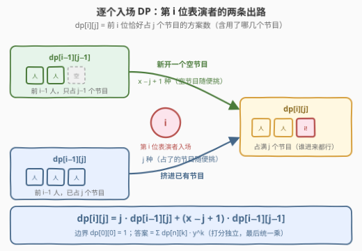
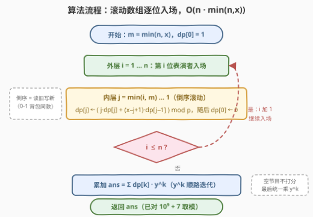
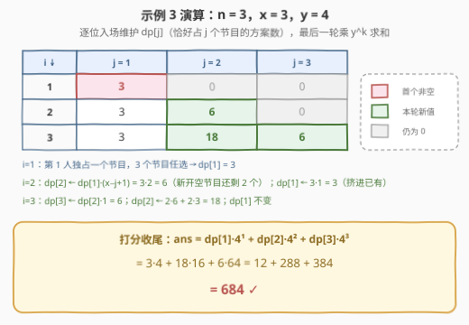

# 安排活动的方案数

- **题目名称**：安排活动的方案数
- **链接**：[3317. 安排活动的方案数](https://leetcode.cn/problems/find-the-number-of-possible-ways-for-an-event/)
- **难度**：困难
- **标签**：数学、动态规划、组合数学
- **关联**：与 [920. 播放列表的数量](https://leetcode.cn/problems/number-of-music-playlists/)（[站内题解](../0901-1000/920_播放列表的数量.md)）同属「逐个入场、两分支计数」DP——两题转移骨架完全同形，920 的重播系数是 $j-k$，本题是完整的 $j$

## 1. 题目概述

给你三个整数 $n$、$x$ 和 $y$。

一个活动总共有 $n$ 位表演者。每一位表演者会被安排到 $x$ 个节目之一，有可能有节目**没有任何表演者**。

所有节目都安排完毕后，评委会给每一个**有表演者的**节目打分，分数是一个 $[1, y]$ 之间的整数。

请你返回**总**的活动方案数。答案可能很大，请你将它对 $10^9 + 7$ 取余后返回。

**注意**，如果两个活动满足以下条件**之一**，那么它们被视为**不同**的活动：

- 存在一个表演者在不同的节目中表演；
- 存在一个节目的分数不同。

**示例 1**：

```text
输入：n = 1, x = 2, y = 3
输出：6
解释：表演者可以在节目 1 或者节目 2 中表演。
      评委可以给这唯一一个有表演者的节目打分 1、2 或者 3。
```

**示例 2**：

```text
输入：n = 5, x = 2, y = 1
输出：32
解释：每一位表演者被安排到节目 1 或者节目 2。
      所有的节目分数都为 1。
```

**示例 3**：

```text
输入：n = 3, x = 3, y = 4
输出：684
```

**约束条件**：

- $1 \le n, x, y \le 1000$

> 💡 **读题关键**：① 一个方案 = 「每位表演者去哪个节目」+「每个**非空**节目的分数」——空节目可以存在但**不打分**，正是这一点把题目与「满射计数」区分开；② 「不同」的判据说明节目位置是**有编号**的：节目 1 分 3 分、节目 2 空，与节目 1 空、节目 2 分 3 分是两个方案；③ 三个参数都 $\le 1000$，暗示 $O(n \cdot \min(n,x))$ 级别的 DP 是预期解；④ 示例 2 的 $32 = 2^5$ 不是巧合——$y=1$ 时打分唯一，答案退化为每人独立选节目的 $x^n$，可作为公式的 sanity check（见第 5 节）。

---

## 2. 解题思路

### 2.1 暴力思路：枚举每人的去向

最直白的翻译：枚举每位表演者去哪个节目，共 $x^n$ 种分配，每种分配下非空节目各自独立打分。$n = x = 1000$ 时 $x^n$ 是一个三千位的数字，枚举彻底没戏。

换个思路按「每个节目的人数向量」$(c_1, \dots, c_x)$ 聚合？人数向量的个数仍是指数级，且同一向量内部还得纠缠「具体是哪些人」的组合数。**计数题的正路从来不是枚举方案，而是找一个互斥且完备的切分维度**，让每一桶内部都能用乘法原理闭式算出。

本题最自然的切分维度就是——**非空节目的个数 $k$**。

### 2.2 核心观察一：按非空节目数 $k$ 分桶，三步独立计数

固定非空节目数 $k$（$1 \le k \le \min(n, x)$），一个方案被无重不漏地拆成三个**互相正交**的决策，乘法原理连乘：

| 步骤 | 问题 | 方案数 |
|------|------|--------|
| ① 分组 | 把 $n$ 位**有编号**的表演者分成 $k$ 个非空组（组与组不区分） | 第二类斯特林数 $S(n, k)$ |
| ② 选节目 | 从 $x$ 个**有编号**的节目里选 $k$ 个来承载这些组 | $\binom{x}{k}$ |
| ③ 打分 | 每个非空节目独立取 $[1, y]$ 的整数分 | $y^k$ |

$$\text{ans} = \sum_{k=1}^{\min(n,x)} S(n, k) \cdot \binom{x}{k} \cdot y^k$$



> 💡 **为什么 ② 不用再乘 $k!$**：$S(n,k)$ 里的组是**无编号**的（只看「谁和谁同组」），而 $\binom{x}{k}$ 恰好负责把 $k$ 个组一一对应地「贴」到 $k$ 个有编号的节目上——无编号的组 + 选位置，排列因子正好消掉。等价写法是把 ①② 合并成满射数 $k!\,S(n,k)$（把人直接打进**指定的** $k$ 个节目且每个非空），再乘 $\binom{x}{k}$ 前除回 $k!$，殊途同归。编号是否对齐，是组合计数最容易被 $k!$ 翻倍或漏除的地方。

### 2.3 核心观察二：不背斯特林数——「逐个入场」DP 一步到位

$S(n,k)$ 当然也能现场递推，但有一个更直接的状态能把「分组」与「选节目」合并：设

$$dp[i][j] = \text{前 } i \text{ 位表演者恰好占用 } j \text{ 个节目的方案数（含用了哪几个节目）}$$

让表演者按编号顺序入场，考察第 $i$ 位的两条出路：

- **挤进已有节目**：前 $i-1$ 人已占 $j$ 个节目（$dp[i-1][j]$ 种），新人从这 $j$ 个节目里挑一个 → 系数 $j$；
- **新开一个节目**：前 $i-1$ 人只占 $j-1$ 个节目（$dp[i-1][j-1]$ 种），新人从剩下 $x - (j-1)$ 个**空**节目里挑一个 → 系数 $x - j + 1$。

$$dp[i][j] = j \cdot dp[i-1][j] + (x - j + 1) \cdot dp[i-1][j-1]$$

边界 $dp[0][0] = 1$，最终答案 $\sum_k dp[n][k] \cdot y^k$（打分与分组完全独立，留到最后统一乘，$y^k$ 顺手迭代）。



> 💡 **和 920 播放列表对照**：[920](https://leetcode.cn/problems/number-of-music-playlists/) 的转移是 $dp[i][j] = (n-j+1)\,dp[i-1][j-1] + (j-k)\,dp[i-1][j]$——「放新歌」的系数同为「还没用上的个数」，区别只在「重入旧位置」：920 因冷却窗口只剩 $j-k$ 个可选项，本题任何已占节目都能再进，系数是完整的 $j$。两题并排看，「逐个入场 + 两分支计数」的骨架一目了然。

### 2.4 算法流程



1. $m \leftarrow \min(n, x)$，开长度 $m + 1$ 的滚动数组，$dp[0] = 1$，其余为 $0$；
2. 外层 $i = 1 \dots n$：第 $i$ 位表演者入场；
3. 内层 $j = \min(i, m) \dots 1$ **倒序**更新 $dp[j] = \big(j \cdot dp[j] + (x - j + 1) \cdot dp[j-1]\big) \bmod p$，随后 $dp[0] = 0$；
4. $k = 1 \dots m$ 累加 $dp[k] \cdot y^k$（$y^k$ 一路乘上去），全程取模，返回答案。

### 2.5 示例演算

拿示例 3（$n = 3,\ x = 3,\ y = 4$）把 DP 表走一遍：



- $i=1$：第一位独占一个节目，$dp[1] = 3$（三个节目任选其一）；
- $i=2$：$dp[2] = dp[1] \cdot (3 - 2 + 1) = 6$（新开节目时还剩 2 个空节目），$dp[1] = 3 \cdot 1 = 3$（挤进已有节目）；
- $i=3$：$dp[3] = dp[2] \cdot 1 = 6$，$dp[2] = 2 \cdot 6 + 2 \cdot 3 = 18$，$dp[1] = 3$；
- 打分收尾：$\text{ans} = 3 \cdot 4 + 18 \cdot 4^2 + 6 \cdot 4^3 = 12 + 288 + 384 = 684$ ✓。

---

## 3. 参考代码

### C++

```cpp
class Solution {
  public:
    int numberOfWays(int n, int x, int y) {
        constexpr long long MOD = 1'000'000'007;
        int m = min(n, x);
        vector<long long> dp(m + 1);              // dp[j]：当前已入场的表演者恰好占 j 个节目
        dp[0] = 1;                                // 0 位表演者 → 0 个非空节目
        for (int i = 1; i <= n; ++i) {
            for (int j = min(i, m); j >= 1; --j)  // 倒序滚动：dp[j-1] 读到的还是上一轮旧值
                dp[j] = (dp[j] * j + dp[j - 1] * (x - j + 1)) % MOD;
            dp[0] = 0;                            // 只要有人入场，就不可能一个节目都不占
        }
        long long ans = 0, pw = 1;                // pw = y^k
        for (int k = 1; k <= m; ++k) {
            pw = pw * y % MOD;
            ans = (ans + dp[k] * pw) % MOD;
        }
        return (int)ans;
    }
};
```

### Python

```python
class Solution:
    def numberOfWays(self, n: int, x: int, y: int) -> int:
        MOD = 1_000_000_007
        m = min(n, x)
        dp = [0] * (m + 1)                        # dp[j]：当前已入场的表演者恰好占 j 个节目
        dp[0] = 1                                 # 0 位表演者 → 0 个非空节目
        for i in range(1, n + 1):
            for j in range(min(i, m), 0, -1):     # 倒序滚动：dp[j-1] 读到的还是上一轮旧值
                dp[j] = (dp[j] * j + dp[j - 1] * (x - j + 1)) % MOD
            dp[0] = 0                             # 只要有人入场，就不可能一个节目都不占
        ans, pw = 0, 1                            # pw = y^k
        for k in range(1, m + 1):
            pw = pw * y % MOD
            ans = (ans + dp[k] * pw) % MOD
        return ans
```

> 💡 **实现细节**：① 滚动数组必须**倒序**枚举 $j$：$dp[i][j]$ 依赖上一轮的 $dp[i-1][j]$ 与 $dp[i-1][j-1]$，倒序保证「读旧写新」，与 0-1 背包内层同款；② 内层上界取 $\min(i, m)$——前 $i$ 人至多占 $\min(i, x)$ 个节目，超出部分恒为 0，直接不遍历；③ 系数 $x - j + 1$ 是「尚未占用的节目数」，手滑写成 $x - j$ 会少算一整列；④ C++ 中间乘积用 `long long` 存，两个 $10^9$ 级的数相乘在 `int` 里必溢出。

---

## 4. 复杂度分析

| 维度 | 复杂度 | 说明 |
|------|--------|------|
| 时间复杂度 | $O(n \cdot \min(n, x))$ | 双层循环逐位入场，$n = x = 1000$ 时约 $10^6$ 次常数转移；打分累加另花 $O(\min(n, x))$ |
| 空间复杂度 | $O(\min(n, x))$ | 一维滚动数组 |
| 暴力对照 | $O(x^n)$ 时间 | 枚举每位表演者的去向再逐个打分，$x = n = 1000$ 时是天文数字，完全不可行 |

实测：三组官方样例分别得 $6 / 32 / 684$ ✓；与「枚举全部 $x^n$ 种分配、对每种分配数非空节目并乘 $y^{\text{非空数}}$」的暴力对拍随机数据（$n, x \le 6$）500 组全部一致；$n = x = y = 1000$ 的压力用例毫秒级通过。

---

## 5. 扩展：容斥视角与两个变体

**容斥求满射**。2.2 节的 $k!\,S(n,k)$（把 $n$ 位表演者打进**指定**的 $k$ 个节目且每个非空）有经典闭式——正难则反，从「无限制」里刨掉「至少一个节目空着」，空集交集用容斥展开：

$$k!\,S(n, k) = \sum_{i=0}^{k} (-1)^i \binom{k}{i} (k-i)^n$$

整题因此可以一行公式收工：$\text{ans} = \sum_{k} \binom{x}{k} y^k \sum_{i=0}^{k} (-1)^i \binom{k}{i} (k-i)^n$，复杂度 $O(m^2 \log n)$（$m = \min(n, x)$，幂用快速幂）。DP 与容斥互相印证，是组合计数题最踏实的双重验算。

**变体一：所有节目都必须有人**。若题面改成「每个节目至少一位表演者」，DP 一字不改，只是答案压缩为 $dp[n][x] \cdot y^x$ 单项（$n < x$ 时为 0），对应满射数 $x!\,S(n,x)$——$j$ 被逼着一路涨到 $x$ 而已。

**变体二：$y = 1$ 的退化解**。打分只有一种取法时，答案应恰好是「每人独立选节目」的 $x^n$。由恒等式 $\sum_{k} S(n,k) \binom{x}{k} k! = x^n$（全体函数按像集大小分类求和）可见公式自洽——示例 2 的 $32 = 2^5$ 正是这个退化。**拿特殊值反推公式**是白板上最快的自查手段：$y=1$ 退化为 $x^n$、$n=1$ 时答案 $xy$，都能秒验。

---

## 6. 面试要点

1. **为什么按 $k$（非空节目数）分桶后就能用乘法原理？**

   - 固定 $k$ 后，「谁和谁同组」「哪些节目被占用」「各节目打几分」是三个互不干扰的维度：分组数只依赖 $(n,k)$、选节目只依赖 $(x,k)$、打分只依赖 $(k,y)$，维度的**正交性**是乘法原理成立的依据；而不同 $k$ 对应的方案集合两两不相交，最后用加法原理合并。

2. **$S(n,k) \cdot \binom{x}{k}$ 为什么不用补乘 $k!$？**

   - 斯特林数里的组是**无编号**的（划分的等价类），$\binom{x}{k}$ 恰好把组贴到有编号的节目上，一一配对不多不少。若改用满射数 $k!S(n,k)$（节目编号指定），外层就要除回 $k!$。「编号对齐」是组合计数里最隐蔽的 $\times k!$ 事故源，能主动讲清是加分项。

3. **滚动数组为什么倒序枚举 $j$？**

   - $dp[i][j]$ 依赖上一轮同列 $dp[i-1][j]$ 与左列 $dp[i-1][j-1]$；若正序更新，算 $dp[j]$ 时 $dp[j-1]$ 已被本轮覆盖，相当于这位表演者入场了两次。倒序先算大 $j$，读到的 $dp[j-1]$ 还是旧值——与 0-1 背包内层倒序同源。

4. **每轮把 $dp[0]$ 清零、内层上界取 $\min(i, m)$，分别是在剪什么？**

   - 只要有人入场就至少占一个节目，「占 0 个节目」自此非法，清零防止该非法态继续向后传染；前 $i$ 人至多占 $\min(i, x)$ 个节目，超出该上界的列恒为 0，不遍历既省时间也免维护。

5. **复杂度怎么算？这个量级为什么够？**

   - 双层循环 $O(n \cdot \min(n,x))$，上界 $1000 \times 1000 = 10^6$ 次常数级转移，取模乘法用 `long long` 中转防溢出；空间一维滚动 $O(\min(n,x))$。若把 $n, x$ 放大到 $10^5$，就得改用 2.2 的闭式 + 预处理阶乘/逆元把复杂度压到 $O(m \log n)$ 级别。

---

## 7. 同类练习题

- [920. 播放列表的数量](https://leetcode.cn/problems/number-of-music-playlists/)（[站内题解](../0901-1000/920_播放列表的数量.md)）：本题的「带冷却窗口版」——转移同为「新人入场 + 旧位重入」两分支，重入系数从 $j$ 收紧为 $j-k$
- [1735. 生成乘积数组的方案数](https://leetcode.cn/problems/count-ways-to-make-array-with-product/)（[站内题解](../1701-1800/1735_生成乘积数组的方案数.md)）：把质因子分组后乘组合数，「分组计数 × 选位置」乘法原理的综合运用
- [2842. 统计一个字符串的 k 子序列美丽值最大的数目](https://leetcode.cn/problems/count-k-subsequences-of-a-string-with-maximum-beauty/)（[站内题解](../2801-2900/2842_统计一个字符串的k子序列美丽值最大的数目.md)）：贪心选定 $k$ 种字母后组合数连乘取模，与本题打分步的 $y^k$ 异曲同工
- [1359. 有效快递配送数目](https://leetcode.cn/problems/count-all-valid-pickup-and-delivery-options/)（[站内题解](../1301-1400/1359_有效快递配送数目.md)）：逐单插入的 $O(n)$ 计数 DP，同为「新开一个槽位 × 挤进已有结构」的乘法计数
- [2338. 统计理想数组的数目](https://leetcode.cn/problems/count-the-number-of-ideal-arrays/)（[站内题解](../2301-2400/2338_统计理想数组的数目.md)）：值域分解 + 隔板法组合数，「按桶分类再相乘」的又一范本
