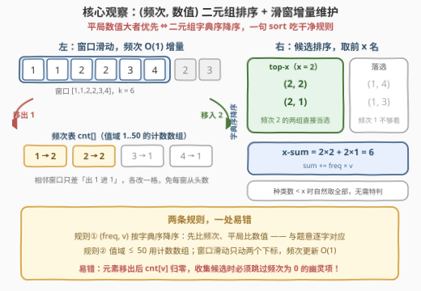
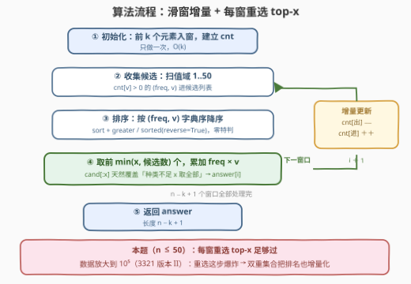
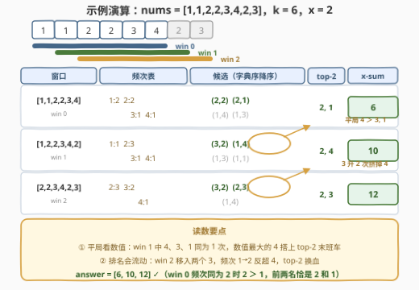

# LeetCode 计算子数组的 x-sum I 题解

- **关联**：3321（版本 II）是本题的数据加强版（$n$ 放大到 $10^5$、元素值放大到 $10^9$），本文的「每窗重选 top-x」解法在 II 会超时，升级姿势见第 5 节

## 1. 题目概述

- **标题 / 题号**：计算子数组的 x-sum I（#3318，easy）
- **链接**：https://leetcode.cn/problems/find-x-sum-of-all-k-long-subarrays-i/
- **难度**：简单
- **标签**：数组、哈希表、滑动窗口、堆（优先队列）

**题意**：给你一个由 `n` 个整数组成的数组 `nums`，以及两个整数 `k` 和 `x`。

数组的 **x-sum** 计算按照以下步骤进行：

1. 统计数组中所有元素的出现次数；
2. 仅保留出现频率最高的前 `x` 种元素。如果两种元素的**出现次数相同**，则**数值较大**的元素被认为出现次数更多；
3. 计算结果数组的和。

注意，如果数组中的不同元素少于 `x` 个，则其 x-sum 是数组的元素总和。

返回一个长度为 `n - k + 1` 的整数数组 `answer`，其中 `answer[i]` 是**子数组** `nums[i..i+k-1]` 的 x-sum。

**示例 1**：

```text
输入：nums = [1,1,2,2,3,4,2,3], k = 6, x = 2
输出：[6,10,12]
解释：
对于子数组 [1, 1, 2, 2, 3, 4]，只保留元素 1 和 2。因此，answer[0] = 1 + 1 + 2 + 2。
对于子数组 [1, 2, 2, 3, 4, 2]，只保留元素 2 和 4。因此，answer[1] = 2 + 2 + 2 + 4。
     注意 4 被保留是因为其数值大于其他出现次数相同的元素（3 和 1）。
对于子数组 [2, 2, 3, 4, 2, 3]，只保留元素 2 和 3。因此，answer[2] = 2 + 2 + 2 + 3 + 3。
```

**示例 2**：

```text
输入：nums = [3,8,7,8,7,5], k = 2, x = 2
输出：[11,15,15,15,12]
解释：由于 k == x，answer[i] 等于子数组 nums[i..i+k-1] 的总和。
```

**约束**：

- $1 \le n = \textit{nums.length} \le 50$
- $1 \le \textit{nums}[i] \le 50$
- $1 \le x \le k \le n$

> 💡 **读题关键**：① 排序规则是**双关键字**——先按频次降序，**平局时数值大者优先**，示例 1 第二个窗口里 `4` 压过同为一次的 `3` 和 `1` 就是明示；② 「不同元素少于 $x$ 种则取全部」不是特殊情况，是「取前 $\min(x,\ \text{种类数})$ 个」的自然退化，代码无需特判；③ $n \le 50$、值域 $\le 50$，这是周赛 Q1 的「温柔数据」，怎么写都能过——但姊妹题 [3321. 版本 II](https://leetcode.cn/problems/find-x-sum-of-all-k-long-subarrays-ii/) 直接把 $n$ 抬到 $10^5$、值域抬到 $10^9$，一份数据两份用，值得顺手把姿势摆对。

## 2. 解题思路

### 2.1 暴力思路：每个窗口从头数一遍

对 $n - k + 1$ 个窗口逐个处理：每个窗口用哈希表花 $O(k)$ 统计频次，再把「（频次， 数值）」对排序、取前 $x$ 个求和。整体 $O\bigl((n-k+1) \cdot (k + D \log D)\bigr)$，其中 $D$ 为窗口内不同元素的个数（本题 $D \le 50$）。

```python
class Solution:
    def findXSum(self, nums: List[int], k: int, x: int) -> List[int]:
        ans = []
        for i in range(len(nums) - k + 1):
            cnt = Counter(nums[i:i + k])          # 每窗从头数
            cand = sorted(((f, v) for v, f in cnt.items()), reverse=True)
            ans.append(sum(f * v for f, v in cand[:x]))
        return ans
```

$n \le 50$ 时总操作量不过几千次，轻松通过。但它把「相邻窗口只差两个元素」的结构白白浪费了——每个窗口都从头数频次，是典型的可增量化的重复劳动。

### 2.2 核心观察：(频次, 数值) 二元组排序 + 滑窗增量维护



**观察一：平局规则 = 字典序降序**。把每个元素编码成二元组 $(\textit{freq},\ v)$，题目的排序规则「频次降序，平局数值降序」恰好就是二元组的**字典序降序**——先比第一关键字，再比第二关键字。所以一句 `sort(..., reverse=True)` 就把规则吃干净，不需要任何自定义比较器。这也是很多「Top-K 带平局规则」题的通用编码手法。

**观察二：值域 $\le 50$，用计数数组代替哈希表**。`cnt[v]` 直接下标访问，比哈希表常数小，还能顺手按值域枚举收集二元组。

**观察三：滑窗增量，进出各改一格**。相邻窗口 `nums[i..i+k-1]` 与 `nums[i+1..i+k]` 只差「移出 `nums[i]`、移入 `nums[i+k]`」两个元素：

$$\textit{cnt}[\textit{nums}[i]] \mathrel{-}= 1 \qquad \textit{cnt}[\textit{nums}[i+k]] \mathrel{+}= 1$$

频次表的更新从 $O(k)$ 降到 $O(1)$。至于「选 top-x」这一步，本题数据下每窗重选（$O(D \log D)$）完全够用；数据放大后如何把选择也增量化，留给第 5 节的版本 II。

> ⚠️ **一个易错点**：元素被移出导致 `cnt[v]` 归零后，收集二元组时要**跳过频次为 0 的值**——否则 $(0, v)$ 会混进候选列表，虽然按字典序降序排不进前 $x$（当种类数 $\ge x$ 时无害），但种类数 $< x$ 时会把「取全部」错算成多取一个零贡献项，边界上容易翻车。频次为 0 的元素根本不该出现在候选里。

### 2.3 算法流程图



流程四步走：① 初始化——前 $k$ 个元素入窗建立 `cnt`；② 增量滑动——每步移出左端、移入右端各 $O(1)$；③ 收集——扫值域 $1..50$，把频次非零的 $(\textit{freq},\ v)$ 收进候选列表；④ 选择——按字典序降序排序，取前 $\min(x,\ \text{候选数})$ 个，累加 $\textit{freq} \times v$。

### 2.4 示例演算



以示例 1（`nums = [1,1,2,2,3,4,2,3]`，$k = 6$，$x = 2$）走完全程：

| 窗口 | 频次表 | 候选（按字典序降序） | top-2 | x-sum |
|------|--------|----------------------|-------|-------|
| `[1,1,2,2,3,4]` | 1:2, 2:2, 3:1, 4:1 | **(2,2), (2,1)**, (1,4), (1,3) | 2, 1 | $2 \times 2 + 2 \times 1 = 6$ |
| `[1,2,2,3,4,2]` | 1:1, 2:3, 3:1, 4:1 | **(3,2), (1,4)**, (1,3), (1,1) | 2, 4 | $3 \times 2 + 1 \times 4 = 10$ |
| `[2,2,3,4,2,3]` | 2:3, 3:2, 4:1 | **(3,2), (2,3)**, (1,4) | 2, 3 | $3 \times 2 + 2 \times 3 = 12$ |

读数细节：第二个窗口里 $(1,4)$ 与 $(1,3)$、$(1,1)$ 频次同为 1，数值大的 4 胜出——这正是「平局数值大者优先」在起作用；第三个窗口移入两个 3 后，3 的频次升到 2，把频次仍为 1 的 4 挤出了 top-2。答案 $[6, 10, 12]$ 与官方一致。示例 2 中 $k = x = 2$，每个窗口至多 2 种元素，top-x 永远取到全部，x-sum 退化为窗口和。

## 3. 参考代码

### C++

```cpp
class Solution {
  public:
    vector<int> findXSum(vector<int>& nums, int k, int x) {
        int n = nums.size();
        vector<int> ans;
        ans.reserve(n - k + 1);
        int cnt[51] = {0};                        // 值域 1..50，计数数组代替哈希

        for (int i = 0; i + k <= n; ++i) {
            if (i == 0) {                         // 首窗口：k 个元素入窗
                for (int j = 0; j < k; ++j) cnt[nums[j]]++;
            } else {                              // 之后：出 1 进 1，O(1) 增量
                cnt[nums[i - 1]]--;
                cnt[nums[i + k - 1]]++;
            }

            vector<pair<int, int>> cand;          // (频次, 数值) 二元组
            for (int v = 1; v <= 50; ++v)
                if (cnt[v] > 0) cand.emplace_back(cnt[v], v);
            sort(cand.begin(), cand.end(), greater<>());   // 字典序降序 = 题目规则

            int sum = 0;
            for (int j = 0; j < min((int)cand.size(), x); ++j)
                sum += cand[j].first * cand[j].second;
            ans.push_back(sum);
        }
        return ans;
    }
};
```

### Python

```python
class Solution:
    def findXSum(self, nums: List[int], k: int, x: int) -> List[int]:
        n = len(nums)
        ans = []
        cnt = [0] * 51                            # 值域 1..50，计数数组代替哈希

        for i in range(n - k + 1):
            if i == 0:                            # 首窗口：k 个元素入窗
                for j in range(k):
                    cnt[nums[j]] += 1
            else:                                 # 之后：出 1 进 1，O(1) 增量
                cnt[nums[i - 1]] -= 1
                cnt[nums[i + k - 1]] += 1

            # (频次, 数值) 二元组按字典序降序 = 题目规则
            cand = sorted(((cnt[v], v) for v in range(1, 51) if cnt[v]),
                          reverse=True)
            ans.append(sum(f * v for f, v in cand[:x]))
        return ans
```

> 💡 **实现细节**：① `sort + greater` / `sorted(..., reverse=True)` 对 `(freq, v)` 二元组就是「频次降序、平局数值降序」，规则零特判；② `cand[:x]` 与 `min(size, x)` 天然处理「种类数 $< x$ 取全部」，无需 if 分支；③ 首窗口单独初始化、后续增量更新，是滑窗的固定起手式，写法上也可统一成「先移入 `nums[i+k-1]`，`i > 0` 再移出 `nums[i-1]`」。

实测：两组官方示例分别得 $[6,10,12]$ 与 $[11,15,15,15,12]$；与「每窗从头数」的暴力对拍随机数据（$n \le 50$、值域 $[1,50]$）20000 组全部一致。

## 4. 复杂度分析

| 维度 | 复杂度 | 说明 |
|------|--------|------|
| 时间复杂度 | $O\bigl((n - k + 1) \cdot D \log D\bigr)$ | 每窗：频次增量 $O(1)$ + 收集候选 $O(D)$ + 排序 $O(D \log D)$，$D = \min(k,\ 50)$ 为窗口内不同元素数 |
| 空间复杂度 | $O(D)$ | 计数数组 $O(50)$ 与候选列表 $O(D)$，与 $n$ 无关 |
| 暴力对照 | $O\bigl((n - k + 1) \cdot k\bigr)$ 计数 + 每窗排序 | 版本 I（$n \le 50$）两者都能过；增量版省掉每窗 $O(k)$ 重数，常数更小 |

> 💡 本题 $n$、值域都 $\le 50$，复杂度天花板极低，$D \le 50$、窗口数 $\le 50$，总操作数万级。复杂度分析的价值在于看清**哪一步会随数据放大而爆炸**——版本 II 的 $n = 10^5$ 会先炸「窗口个数 × 每窗排序」这一项，这正是第 5 节要解决的。

## 5. 扩展：3321 版本 II —— 双重集合把「选 top-x」也增量化

[3321. 计算子数组的 x-sum II](https://leetcode.cn/problems/find-x-sum-of-all-k-long-subarrays-ii/)（困难）把约束改成 $n \le 10^5$、$1 \le \textit{nums}[i] \le 10^9$：窗口数 $10^5$、值域无界（计数数组废了）、每窗重选 top-x 的 $O(D \log D)$ 累计成 $10^5 \times \ldots$ 直接超时。升级思路分两刀：

**第一刀：哈希表接管计数**。值域无界就换 `unordered_map` / `dict`，滑窗进出仍是 $O(1)$。

**第二刀：把候选集劈成两段——top 与 rest，随时维护「前 x 名」**。用两个多重集合（C++ `multiset`，Python 可用两个有序列表或懒删除堆）分别存当前**排名前 $x$ 的二元组**（记为 `top`，同步维护 `sumTop`）与其余二元组（记为 `rest`），不变式为：

$$\texttt{top} = \text{全体二元组中最大的 } x \text{ 个} \quad\Longleftrightarrow\quad \max(\texttt{rest}) < \min(\texttt{top})$$

频次变更时**先删旧对、再插新对**，配两条搬运规则修补不变式：

- 删的对在 `top`：若 `rest` 非空，把 `rest` 最大者**上浮**进 `top`；
- 插的新对**一律先进 `top`**：若超编（$> x$ 个），把 `top` 最小者**下沉**进 `rest`。

每次滑窗至多触发「一浮一沉」，各 $O(\log n)$，全程 $O(n \log n)$。窗口的 x-sum 就是维护好的 `sumTop`，直接读。

```cpp
class Solution {
  public:
    vector<long long> findXSum(vector<int>& nums, int k, int x) {
        int n = nums.size();
        multiset<pair<long long, int>> top, rest;      // (频次, 数值) 升序
        unordered_map<int, long long> cnt;
        long long sumTop = 0;
        vector<long long> ans;

        auto add = [&](int v, long long delta) {       // 频次变更 ±1
            pair<long long, int> old{cnt[v], v};
            auto it = top.find(old);
            if (it != top.end()) {                     // 旧对在 top：删除并补位
                sumTop -= old.first * v;
                top.erase(it);
                if ((int)top.size() < x && !rest.empty()) {
                    auto jt = prev(rest.end());        // rest 最大者上浮
                    sumTop += jt->first * jt->second;
                    top.insert(*jt);
                    rest.erase(jt);
                }
            } else {
                rest.erase(old);
            }
            cnt[v] += delta;
            if (cnt[v] == 0) return;                   // 元素从窗口消失
            pair<long long, int> ne{cnt[v], v};
            sumTop += ne.first * v;
            top.insert(ne);                            // 新对一律先进 top
            if ((int)top.size() > x) {                 // 超编：最小者下沉
                auto jt = top.begin();
                sumTop -= jt->first * jt->second;
                rest.insert(*jt);
                top.erase(jt);
            }
        };

        for (int i = 0; i < n; ++i) {
            add(nums[i], +1);
            if (i >= k) add(nums[i - k], -1);
            if (i >= k - 1) ans.push_back(sumTop);     // x-sum 即 sumTop
        }
        return ans;
    }
};
```

> 💡 **为什么「新对先进 top 再下沉」是对的**：插入前 `top` 是最大的 $x$ 个；插入后是「最大 $x$ 个 + 新对」共 $x+1$ 个，踢掉其中最小者，剩下的仍是全局最大 $x$ 个——若新对本身最小，被踢的就是它，`top` 原样回归。「先删后插」的顺序同样有讲究：先删旧对才能腾出正确的比较基准，避免「新旧两对同时在集合里」的自比较混乱。该写法与示例 1 数据对拍通过；同款「双集合维护滑窗内 top 段」的思路在 [480. 滑动窗口中位数](../0401-0500/480_滑动窗口中位数.md)（上下两段各占一半）与 [1825. 求出 MK 平均值](../1801-1900/1825_求出MK平均值.md)（维护最小的一段）中反复出现，是「滑动窗口 + 动态 top-K」的母版。

## 6. 面试要点

1. **平局规则「数值大者优先」怎么无损地塞进排序？**

   - 把元素编码成 $(\textit{freq},\ v)$ 二元组，按**字典序降序**排序即可：第一关键字频次、第二关键字数值，与题意逐字对应。切忌只按频次排序再用 `stable_sort` 之类的「碰运气」写法——稳定性保证的是**原序**而非数值序，原序恰是值序时才碰巧对。

2. **「不同元素少于 x 种则取全部」需要特判吗？**

   - 不需要。「取前 $x$ 名」在候选不足 $x$ 个时自然退化为「取全部」，`cand[:x]` / `min(size, x)` 天然覆盖。识别「特殊规则其实是一般规则的退化情形」能少写分支、少埋 bug。

3. **滑动窗口在这里省了什么、没省什么？**

   - 省的是**频次统计**：相邻窗口只差一出一进，计数从每窗 $O(k)$ 降到 $O(1)$。没省的是**top-x 选择**：本题每窗仍花 $O(D \log D)$ 重选。数据放大（版本 II）后选择才是瓶颈，需要双集合把排名也增量化——「先看清哪一步会爆炸」比背模板更重要。

4. **版本 II 里为什么频次为 0 的元素必须真的从集合里删掉？**

   - 多重集合存的是 $(\textit{freq},\ v)$ 对，频次从 1 降到 0 意味着该元素离开窗口，若残留 $(0, v)$ 幽灵对，轻则占坑干扰 `top` 的规模计数，重则在「种类数 $< x$」时被误选进 top-x。`cnt[v] == 0` 时直接 return、不插新对，是干净的处理方式。

5. **双集合「上浮 / 下沉」的搬运量为什么是均摊 $O(1)$？**

   - 每次频次变更至多触发一次上浮（删的在 top 且 rest 非空）和一次下沉（插入后超编），二者都是**单次搬运**而非循环搬运——不变式在每条规则执行后就已修复。于是每个滑窗步骤是常数次 $O(\log n)$ 的集合操作，总复杂度 $O(n \log n)$。

## 同类练习题

| # | 题目 | 与本题的关联 |
|---|------|-------------|
| 3321 | [计算子数组的 x-sum II](https://leetcode.cn/problems/find-x-sum-of-all-k-long-subarrays-ii/) | 本题的数据加强版（$n \le 10^5$、值域 $10^9$），第 5 节的双集合解法直接照搬，验证实现没夹带 $O(D \log D)$ 每窗重选的私货 |
| 480 | [滑动窗口中位数](https://leetcode.cn/problems/sliding-window-median/)（[站内题解](../0401-0500/480_滑动窗口中位数.md)） | 同款「滑窗 + 双有序集合劈两段」母版，按个数对半劈，与本文「按排名劈前 x」互为变体 |
| 1825 | [求出 MK 平均值](https://leetcode.cn/problems/find-mk-average/)（[站内题解](../1801-1900/1825_求出MK平均值.md)） | 双集合维护滑窗内「最小的一段」，去掉最大 M 个与最小 M 个再求均值，三段式的进阶练习 |
| 239 | [滑动窗口最大值](https://leetcode.cn/problems/sliding-window-maximum/)（[站内题解](../0201-0300/239_滑动窗口最大值.md)） | 滑窗内动态维护最值的另一条路——单调队列，$x = 1$ 且只需最大值时的专用神器 |
| 692 | [前 K 个高频单词](https://leetcode.cn/problems/top-k-frequent-words/)（[站内题解](../0601-0700/692_前K个高频单词.md)） | 同款「频次 + 平局规则」的 top-K 选择，平局改比字典序，练双关键字比较器的方向感 |
