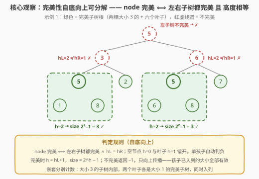
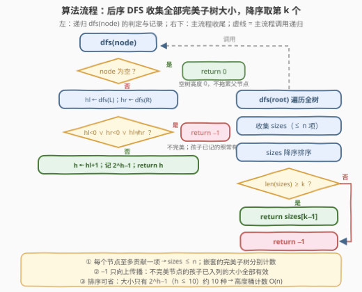
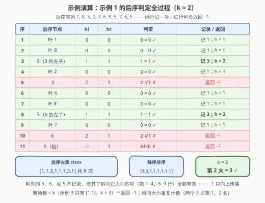

# 第K大的完美二叉子树的大小

- **题目名称**：第K大的完美二叉子树的大小
- **链接**：[3319. 第 K 大的完美二叉子树的大小](https://leetcode.cn/problems/k-th-largest-perfect-subtree-size-in-binary-tree/)
- **难度**：中等
- **标签**：树、深度优先搜索、二叉树、排序
- **关联**：与 [250. 统计同值子树](https://leetcode.cn/problems/count-univalue-subtrees/)（[站内题解](../0201-0300/250_统计同值子树.md)）同属「后序遍历 + 返回值向上传递子结构结论」家族——250 传布尔（是否同值），本题传整数（完美子树高度，`-1` 表示不完美）

## 1. 题目概述

给你一棵**二叉树**的根节点 `root` 和一个整数 `k`，返回第 `k` 大的**完美二叉子树**的大小；如果不存在，返回 `-1`。

> **完美二叉树**（perfect binary tree）：所有叶子节点都在**同一层级**，且每个父节点**恰好有两个**子节点。

**示例 1**：

```text
输入：root = [5,3,6,5,2,5,7,1,8,null,null,6,8], k = 2
输出：3

            5
          /   \
         3     6
        / \   / \
       5   2 5   7
      / \   / \
     1  8  6   8
```

完美二叉子树的大小按非递增顺序排列为 `[3, 3, 1, 1, 1, 1, 1, 1]`（两棵大小 3 的：左下 `5` 与中部 `5`；六个叶子各计 1）。第 `2` 大的是 `3`。

**示例 2**：

```text
输入：root = [1,2,3,4,5,6,7], k = 1
输出：7
```

整棵树就是完美二叉树，大小序列 `[7, 3, 3, 1, 1, 1, 1]`，第 1 大为 `7`。

**示例 3**：

```text
输入：root = [1,2,3,null,4], k = 3
输出：-1
```

节点 `2` 只有右孩子 `4`，不完美；完美子树只有叶子 `3` 和叶子 `4`，序列 `[1, 1]` 不足 3 个，返回 `-1`。

**约束条件**：

- 树中节点数目在 `[1, 2000]` 范围内
- `1 <= Node.val <= 2000`
- `1 <= k <= 1024`

> 💡 **读题关键**：① 「子树」指**以某个节点为根的完整子结构**（该节点连同其全部后代），不是任意连通子图；② **完美子树可以嵌套**——完美树的每个节点也各自是一棵完美子树的根，所以统计对象是「每个节点为根的子树是否完美」，个数可达 $n$（示例 2 的序列有 7 项）；③ 「第 $k$ 大」按**非递增**排序后取第 $k$ 个，**相同大小重复计数**（示例 1 的两个 3）；④ $k \le 1024 < 2047 = 2^{11}-1$ 不是随便给的——节点至多 2000，完美子树的高度至多 10，这个量级暗示「值域极窄」的优化空间（见第 5 节）。

---

## 2. 解题思路

### 2.1 暴力思路：逐节点整棵复查

最直白的翻译：遍历每个节点，对它调用一次 `isPerfect(node)`——递归检查「每个内部节点是否恰有两孩子」并比较「所有叶子是否同层」（等价于左右子树高度相等）。单次检查要完整扫一遍该子树，最坏（链状树）总代价 $O(n^2)$，$n = 2000$ 时约 $4 \times 10^6$ 次节点访问，能过但没有利用任何结构。

浪费在哪？检查节点 $u$ 时已经把它的子树完整扫过、**左右子树的高度都算出来了**；等到检查 $u$ 的孩子时又把同样的子树再扫一遍。父问题的判定材料（孩子的高度与完美性）在递归回溯时**天然经过父节点手里**，白白丢掉——这正是后序遍历的用武之地。

### 2.2 核心观察：完美性自底向上可分解，后序传高度



完美二叉树的定义天然是**递归的**：

$$\text{subtree}(u) \text{ 完美} \iff \text{左子树完美} \wedge \text{右子树完美} \wedge h_L = h_R$$

三个条款逐一看：

- **叶子**：左右皆空，$h_L = h_R = 0$，两个「空树完美」自动成立 → 叶子完美，高度 1，大小 1；
- **单孩子节点**：一空一非空，空侧高度 0、非空侧高度 $\ge 1$，$h_L \ne h_R$ → 不完美，**无需特判**；
- **双子节点**：两孩子都完美且高度相等 → 完美，高度 $h_L + 1$。

于是设计 `dfs(node)` 返回**该子树的高度**，用 `-1` 作哨兵表示「不完美」：

- 空节点 → 返回 `0`（空树高度为 0，**不拖累父节点**）；
- `hl < 0` 或 `hr < 0` 或 `hl != hr` → 返回 `-1`；
- 否则 $h = h_L + 1$，子树完美，**记录大小 $2^h - 1$**，返回 $h$。

两个设计决策值得咀嚼：

> 💡 **为什么传高度而不是大小？** 完美二叉树的大小被高度唯一决定：$h$ 层完美树恰有 $2^h - 1$ 个节点（222 完全二叉树节点个数的经典公式）。判「左右等高」与判「左右等大」在本题语境下等价（两边都完美时，等大 $\iff$ 等高），但高度是递归比较中**直接可得**的量、数值更小，且把「大小」这个最终答案留到判定成功后再一次性算出，职责更清晰。

> ⚠️ **`-1` 只向上传播，不影响横向**：某节点判为不完美后，它**左右子树里已记录的完美子树全部有效**——示例 1 中节点 `3` 因左右高度不等（2 vs 1）不完美，但它的左孩子（大小 3）和右孩子（大小 1）早已各自入列。回溯顺序保证了「先孩子后父亲」，父亲失败绝不会抹掉孩子的功劳。

### 2.3 算法流程



**`dfs(node)` 完整步骤**（返回 `int` 高度）：

1. **空节点**：返回 `0`；
2. **递归左右**：`hl = dfs(node.left)`，`hr = dfs(node.right)`（后序：先算孩子）；
3. **判定**：`hl < 0 || hr < 0 || hl != hr` → 返回 `-1`；
4. **记录**：`h = hl + 1`，把 $2^h - 1$ 追加进 `sizes`，返回 `h`。

**主流程**：

1. `dfs(root)` 收集全部完美子树大小（每个节点至多贡献一个，共 $\le n$ 个）；
2. `sizes` **降序排序**；
3. 若 `len(sizes) >= k` 返回 `sizes[k-1]`，否则返回 `-1`。

### 2.4 示例演算

以示例 1 为例（后序序列 `1, 8, 5, 2, 3, 6, 8, 5, 7, 6, 5`）：



- 叶子 `1`、`8`：`hl = hr = 0` → 高度 1，各记一个大小 1；
- 节点 `5`（3 的左子）：两叶等高 → 高度 2，记 $2^2 - 1 = 3$；
- 叶 `2`：记 1；
- 节点 `3`：$h_L = 2 \ne h_R = 1$ → 返回 `-1`，不记录；
- 叶 `6`、`8`：各记 1；节点 `5`（6 的左子）：记 3；叶 `7`：记 1；
- 节点 `6`：$h_L = 2 \ne h_R = 1$ → `-1`；根 `5`：左子树已 `-1` → `-1`。

共收集 $[1,1,3,1,1,1,3,1]$ 八个大小，降序 $[3,3,1,1,1,1,1,1]$，$k = 2$ → 答案 $3$ ✓（与官方解释的序列完全一致）。

---

## 3. 参考代码

### C++

```cpp
class Solution {
  public:
    int kthLargestPerfectSubtree(TreeNode* root, int k) {
        vector<int> sizes;
        dfs(root, sizes);
        sort(sizes.begin(), sizes.end(), greater<int>());   // 降序取第 k 大
        return (int)sizes.size() >= k ? sizes[k - 1] : -1;
    }

  private:
    // 返回该子树的高度；-1 表示不是完美二叉树。空树约定高度 0
    int dfs(TreeNode* node, vector<int>& sizes) {
        if (!node) return 0;
        int hl = dfs(node->left, sizes);
        int hr = dfs(node->right, sizes);
        if (hl < 0 || hr < 0 || hl != hr) return -1;        // 孩子不完美 / 高度不等
        sizes.push_back((1 << (hl + 1)) - 1);               // 高度 h=hl+1 → 大小 2^h − 1
        return hl + 1;
    }
};
```

### Python

```python
class Solution:
    def kthLargestPerfectSubtree(self, root: Optional[TreeNode], k: int) -> int:
        sizes = []

        def dfs(node: Optional[TreeNode]) -> int:      # 返回高度；-1 表示不完美
            if not node:
                return 0                               # 空树约定高度 0，不拖累父节点
            hl = dfs(node.left)
            hr = dfs(node.right)
            if hl < 0 or hr < 0 or hl != hr:
                return -1                              # 孩子不完美 / 高度不等
            sizes.append((1 << (hl + 1)) - 1)          # 高度 h=hl+1 → 大小 2^h − 1
            return hl + 1

        dfs(root)
        sizes.sort(reverse=True)                       # 降序取第 k 大
        return sizes[k - 1] if len(sizes) >= k else -1
```

> 💡 **实现细节**：① 空节点返回 `0` 而非 `-1`——空树「高度 0」与叶子「高度 1」**错开一格**，单孩子节点自然被 $h_L \ne h_R$ 淘汰，省掉一整段「孩子存在性」特判；② `-1` 哨兵与合法高度 `0,1,2,…` 不冲突，向上传播时父节点用 `hl < 0` 一步识别；③ `sizes` 里每个节点至多贡献一项（自己为根的完美子树），**嵌套的完美子树由内部节点各自贡献**——示例 1 里大小 3 的子树与它内部两个大小 1 的叶子同时入列；④ Python 递归深度最坏为链状树的 $n = 2000$，若评测环境栈紧可加 `sys.setrecursionlimit(5000)`，C++ 无此顾虑。

---

## 4. 复杂度分析

| 维度 | 复杂度 | 说明 |
|------|--------|------|
| 时间复杂度 | $O(n \log n)$ | DFS 每节点 $O(1)$ 共 $O(n)$；排序 $m \le n$ 个大小为 $O(n \log n)$，$n = 2000$ 时毫秒级 |
| 空间复杂度 | $O(n)$ | 递归栈最坏 $O(n)$（链状树）+ `sizes` 至多 $n$ 项 |
| 暴力对照 | $O(n^2)$ 时间 | 逐节点整棵复查，链状树时每次检查都白扫一整段子树 |

实测：三组官方样例分别得 $3 / 7 / -1$ ✓；与「逐节点调用 `isPerfect` 整棵复查」的暴力对拍随机树（节点数 $\le 30$）2000 组全部一致；$2047$ 节点满树（每节点都是完美子树根，`sizes` 恰有 2047 项）与 $2000$ 节点单侧链（最坏递归深度）两类压力用例均瞬时通过。

---

## 5. 扩展：值域只有 10 种——计数代替排序

完美子树的大小必为 $2^h - 1$（$h$ 为高度），而 $n \le 2000 \le 2^{11} - 1$ 把高度限制在 $h \in [1, 10]$——**不同的取值至多 10 种**，但同一大小可重复出现（示例 1 的两个 3，满树的 1024 个 1）。排序 $n$ 个只有 $O(\log n)$ 种取值的数是杀鸡用牛刀，开一个高度桶直接计数：

```python
class Solution:
    def kthLargestPerfectSubtree(self, root: Optional[TreeNode], k: int) -> int:
        cnt = [0] * 32                                # cnt[h]：高度为 h 的完美子树根的个数

        def dfs(node: Optional[TreeNode]) -> int:
            if not node:
                return 0
            hl, hr = dfs(node.left), dfs(node.right)
            if hl < 0 or hr < 0 or hl != hr:
                return -1
            cnt[hl + 1] += 1
            return hl + 1

        dfs(root)
        for h in range(31, 0, -1):                    # 从最高（最大）往下扣减 k
            k -= cnt[h]
            if k <= 0:
                return (1 << h) - 1
        return -1
```

从大到小扫高度桶、逐桶扣减 $k$，命中即返回 $2^h - 1$——排序的 $O(n \log n)$ 被压成 $O(n + \log n)$。**「第 k 大」类问题的第一步永远是问值域**：值域窄到可以开桶时，排序/堆都可以退休（对照 [75. 颜色分类](https://leetcode.cn/problems/sort-colors/) 的三桶计数）。

---

## 6. 面试要点

1. **为什么用后序遍历而不是前序或中序？**

   > 完美性的判定材料（左右子树是否完美、各自高度）只有在**递归返回后**才凑齐，「子问题结论决定父问题」的结构对应后序（左右根）。前序/中序在处理父节点时孩子信息尚不可得，只能像暴力那样另起炉灶重新扫描。这与 250 同值子树、865 最深节点最小子树是同一族模板。

2. **空节点为什么返回 0 而不是 -1？**

   > 空树约定高度 0，与叶子的 1 错开一格：单孩子节点空侧 0、实侧 $\ge 1$，$h_L \ne h_R$ 自动判负，无需任何存在性特判。若空节点返回 -1，则叶子（一侧空一侧也空）反而要特判，且「孩子不完美」与「孩子为空」两种语义会搅在一起。与 250「空节点返回 true 不拖累父节点」的设计思想一脉相承。

3. **不完美节点的完美子孙会被漏统计吗？**

   > 不会。`-1` 只沿「父方向」传播；后序保证孩子的 `sizes` 记录发生在父节点判定**之前**，父亲判负不回滚任何已入列的项。示例 1 节点 `3` 不完美，但它的左子（大小 3）早已入列——统计单位是「每个节点」，不是「极大完美块」。

4. **「第 k 大」里相同大小怎么算？为什么要检查 `len(sizes) >= k`？**

   > 相同大小**重复计数**（示例 1 的两个 3 占据第 1、2 名），所以直接降序取 `sizes[k-1]`；完美子树总数 $m \le n$ 可能小于 $k$（示例 3 只有 2 个），越界即返回 -1。若题面改成「第 k 大的**不同**大小」，则需先去重再取名——语义差异是这类题最常见的澄清点。

5. **复杂度是多少？瓶颈在哪？如何优化？**

   > DFS $O(n)$ + 排序 $O(n \log n)$，$n \le 2000$ 绰绰有余。瓶颈在排序，而完美子树大小只有 $2^h - 1$（$h \le 10$）共约 10 种取值，用高度桶计数可把总复杂度压到 $O(n)$（第 5 节）。「先看值域再选排序/堆/桶」是 Top-K 问题的通用决策顺序。

---

## 7. 同类练习题

- [250. 统计同值子树](https://leetcode.cn/problems/count-univalue-subtrees/)（[站内题解](../0201-0300/250_统计同值子树.md)）：同款「后序 + 返回值传递子结构结论」的布尔版——把「传高度判完美」换成「传布尔判同值」，骨架逐行同形
- [222. 完全二叉树的节点个数](https://leetcode.cn/problems/count-complete-tree-nodes/)（[站内题解](../0201-0300/222_完全二叉树的节点个数.md)）：$2^h - 1$ 公式的出处——本题记录大小时的核心恒等式，另加「左右深度比较二分」的利用结构技巧
- [958. 二叉树的完全性检验](https://leetcode.cn/problems/check-completeness-of-a-binary-tree/)（[站内题解](../0901-1000/958_二叉树的完全性检验.md)）：另一种「结构性完整」判定——完全性用 BFS 层序「遇空后不得再遇非空」，与完美性的自底向上分解互为对照
- [865. 具有所有最深节点的最小子树](https://leetcode.cn/problems/smallest-subtree-with-all-the-deepest-nodes/)（[站内题解](../0801-0900/865_具有所有最深节点的最小子树.md)）：后序返回 `(深度, 节点)` 复合值并在父处聚合——「返回值不够用就返回元组」的进阶模板
- [104. 二叉树的最大深度](https://leetcode.cn/problems/maximum-depth-of-binary-tree/)（[站内题解](../0101-0200/104_二叉树的最大深度.md)）：后序返回高度的最初级形态，本题 `dfs` 去掉完美判定后的裸模板
