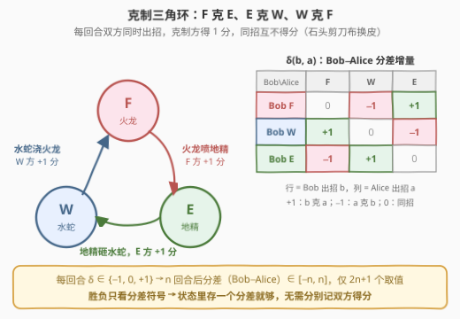
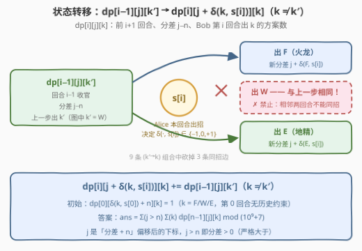
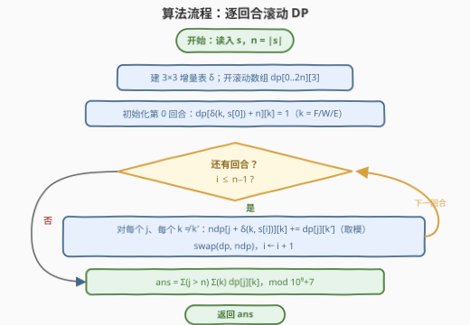
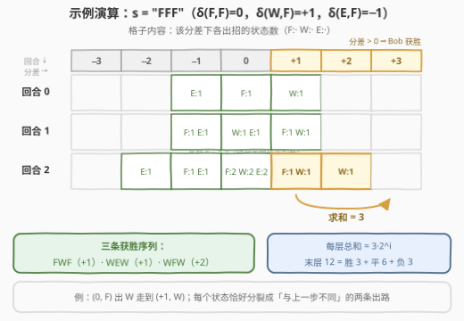

# 统计能获胜的出招序列数

- **题目名称**：统计能获胜的出招序列数
- **链接**：[3320. 统计能获胜的出招序列数](https://leetcode.cn/problems/count-the-number-of-winning-sequences/)
- **难度**：困难
- **标签**：字符串、动态规划
- **关联**：与 [2318. 不同骰子序列的数目](https://leetcode.cn/problems/number-of-distinct-roll-sequences/)（[站内题解](../2301-2400/2318_不同骰子序列的数目.md)）同属「相邻约束下的序列计数 DP」——状态里都得带一个「上一步出了什么」；本题再叠加一维「分差」，相当于 2318 的计分升级版

## 1. 题目概述

Alice 和 Bob 正在玩一个幻想战斗游戏，共 $n$ 回合。每回合双方**同时**召唤一只魔法生物：**火龙（F）**、**水蛇（W）** 或 **地精（E）**，并按以下规则得分：

- 一方出**火龙**、另一方出**地精** → 出火龙的一方得 $1$ 分；
- 一方出**水蛇**、另一方出**火龙** → 出水蛇的一方得 $1$ 分；
- 一方出**地精**、另一方出**水蛇** → 出地精的一方得 $1$ 分；
- 双方召唤**相同**生物 → 均不得分。

给定字符串 $s$（Alice 的出招序列）。Bob 的出招序列未知，但保证 **Bob 不会在连续两个回合中召唤相同的生物**。若 $n$ 轮后 Bob 的总分**严格大于** Alice 的总分，则 Bob 获胜。返回 Bob 能用来战胜 Alice 的不同出招序列数量，对 $10^9 + 7$ 取余后返回。

**示例 1**：

```text
输入：s = "FFF"
输出：3
解释：Bob 可用 "WFW"、"FWF"、"WEW" 三种出招序列获胜。
      注意 "WWE"、"EWW" 等序列无效——Bob 不能连续两回合召唤同一只生物。
```

**示例 2**：

```text
输入：s = "FWEFW"
输出：18
```

**约束条件**：

- $1 \le s.length \le 1000$
- $s[i]$ 是 'F'、'W'、'E' 之一

> 💡 **读题关键**：① 克制关系是一个**三角环**：F 克 E、E 克 W、W 克 F——本质是石头剪刀布的换皮，每回合结局只有「Bob 得 1 / 互不得分 / Alice 得 1」三种；② Bob 的硬约束只有一条「**相邻两回合不同**」，这是一个只牵扯**上一步**的局部约束；③ 胜负判据是总分的比较，而双方得分此消彼长，所以只需维护**分差**一个数；④ $n \le 1000$ 暗示 $O(n^2)$：分差范围 $[-n, n]$ 恰好 $2n+1$ 个值。

---

## 2. 解题思路

### 2.1 暴力思路：枚举 Bob 的全部出招

Bob 每回合 3 种选择，全长 $3^n$ 种序列；即便带上「相邻不同」剪枝也有 $3 \cdot 2^{n-1}$ 种，$n = 1000$ 时仍是天文数字。**计数题的正路从来不是枚举方案，而是找一组互斥完备的状态，让「未来只依赖状态、不依赖历史」**。

逐条审视题面，真正需要带在身上的信息只有两个：

| 信息 | 取值范围 | 为什么必须且只需它 |
|------|----------|--------------------|
| 当前**分差**（Bob − Alice） | $[-n, n]$，共 $2n+1$ 个整数 | 胜负只看分差符号；每回合分差增量 $\delta \in \{-1, 0, +1\}$ |
| Bob **上一步**的出招 | F / W / E，共 3 种 | 「相邻不同」的合法性判定只用到上一步 |

其余的一切——双方各自的总分、更早的出招历史——都是**冗余信息**。这两条直接拼出了状态设计。

### 2.2 核心观察：「分差 × 上一步」三维计数 DP

先把每回合的得分影响写成矩阵。记 $\delta(b, a)$ 为「Bob 出 $b$、Alice 出 $a$」时分差（Bob − Alice）的增量：

| Bob \ Alice | F | W | E |
|-------------|---|---|---|
| **F** | $0$ | $-1$ | $+1$ |
| **W** | $+1$ | $0$ | $-1$ |
| **E** | $-1$ | $+1$ | $0$ |



> 💡 **为什么分差一个数就够**：得分规则是**零和**的——每回合要么 Bob 得 1 分、要么 Alice 得 1 分、要么都不得分。因此「Bob 总分 > Alice 总分」等价于「分差 > 0」，分别记两个总分是白白多背一维状态。这也是一类通用的「**比较型计数**」压缩：凡判据是比较两个累计量，先看它们的差是否范围有限。

定义

$$dp[i][j][k] = \text{前 } i+1 \text{ 回合（下标 } 0..i\text{）、分差为 } j-n\text{、Bob 第 } i \text{ 回合出 } k \text{ 的方案数}$$

其中 $j$ 是**加了 $n$ 偏移**后的数组下标（分差可能为负，平移到 $[0, 2n]$），$k \in \{F, W, E\}$。

**转移**：第 $i$ 回合 Alice 出 $s[i]$，Bob 从上一步的 $k'$ 换成 $k$（$k \ne k'$，不许连出同一只），分差随之平移 $\delta(k, s[i])$：

$$dp[i][j + \delta(k, s[i])][k] \mathrel{+}= dp[i-1][j][k'] \qquad (k \ne k')$$

**边界**：第 0 回合没有历史约束，$dp[0][\delta(k, s[0]) + n][k] = 1$（$k$ 各三种）。

**答案**：分差**严格大于** 0，即偏移下标 $j \ge n + 1$：

$$\text{ans} = \sum_{j = n+1}^{2n} \sum_{k} dp[n-1][j][k] \bmod (10^9 + 7)$$



> 💡 **无后效性自查**：第 $i+1$ 回合的合法性（不与第 $i$ 回合重复）与得分增量（只依赖本回合双方出招）都只由「当前分差 + 上一步出招」决定，与更早的历史无关——状态 $(i, j, k)$ 是充分统计量。这套「**末步入状态**」的设计与 [2318. 不同骰子序列的数目](https://leetcode.cn/problems/number-of-distinct-roll-sequences/)完全同骨架：2318 把骰子上一步的点数带进状态以处理相邻约束，本题的 $k$ 维如出一辙。

### 2.3 算法流程



1. 预处理 $3 \times 3$ 增量矩阵 $\delta$，开两层 $dp[0..2n][3]$ 滚动数组；
2. 初始化第 0 回合的三个状态：三种开招各落在一个分差上；
3. $i = 1 \dots n-1$：对每个分差 $j$、上一招 $k'$、当前招 $k \ne k'$，把方案数平移累加到新层；
4. 汇总所有 $j > n$ 的状态，取模返回。

### 2.4 示例演算

拿示例 1（$s = $ "FFF"）把三层 DP 表走一遍。Alice 三回合全出火龙，故每回合 $\delta(\cdot, F)$：出 F 得 $0$、出 W 得 $+1$、出 E 得 $-1$：



- **回合 0**：三种开招各 1 种方案——出 F 落在分差 $0$，出 W 落在 $+1$，出 E 落在 $-1$；
- **回合 1**：每个状态分裂成「与上一步不同」的两条出路，例如 $(0, F)$ 出 W 走到 $(+1, W)$、出 E 走到 $(-1, E)$，共 $3 \cdot 2 = 6$ 个状态；
- **回合 2**：再分裂成 $12$ 个状态（$3 \cdot 2^2$，与「相邻不同」的闭式计数吻合），其中分差 $> 0$ 的恰好 $3$ 个：$(+1, F), (+1, W), (+2, W)$——对应获胜序列 **FWF、WEW、WFW** ✓。

> 💡 **层内总和自查**：第 $i$ 层所有状态之和应恒等于 $3 \cdot 2^{i}$（相邻不同约束下的序列计数闭式），示例 1 最后一层 $12 = 3 \cdot 2^2$，胜 / 平 / 负 = $3 / 6 / 3$。每层顺手验一次总和，是调试计数 DP 最快的报警器——某一层总和突然不是 $3 \cdot 2^i$，多半是转移里漏剪或多剪了同招边。

---

## 3. 参考代码

### C++

```cpp
class Solution {
  public:
    int countWinningSequences(string s) {
        constexpr long long MOD = 1'000'000'007;
        int n = s.size();
        auto idx = [](char c) { return c == 'F' ? 0 : c == 'W' ? 1 : 2; };
        // delta[Bob][Alice]：Bob 克 Alice 记 +1，被克记 −1，同招记 0（F=0,W=1,E=2）
        static const int delta[3][3] = {{0, -1, 1}, {1, 0, -1}, {-1, 1, 0}};
        int m = 2 * n;                            // 分差 + n ∈ [0, 2n]
        vector<array<long long, 3>> dp(m + 1), ndp(m + 1);
        int a = idx(s[0]);
        for (int k = 0; k < 3; ++k)               // 第 0 回合：三种开招各 1 种方案
            dp[delta[k][a] + n][k] = 1;
        for (int i = 1; i < n; ++i) {
            a = idx(s[i]);
            for (auto &row : ndp) row.fill(0);
            for (int j = 0; j <= m; ++j)
                for (int k = 0; k < 3; ++k) {
                    long long v = dp[j][k];       // 上一层：分差 j−n、出招 k
                    if (v == 0) continue;
                    for (int kk = 0; kk < 3; ++kk) {  // 本层出 kk ≠ k
                        if (kk == k) continue;
                        ndp[j + delta[kk][a]][kk] = (ndp[j + delta[kk][a]][kk] + v) % MOD;
                    }
                }
            swap(dp, ndp);
        }
        long long ans = 0;
        for (int j = n + 1; j <= m; ++j)          // 分差 > 0：严格大于才算赢
            for (int k = 0; k < 3; ++k) ans = (ans + dp[j][k]) % MOD;
        return (int)ans;
    }
};
```

### Python

```python
class Solution:
    def countWinningSequences(self, s: str) -> int:
        MOD = 1_000_000_007
        n = len(s)
        # delta[Bob][Alice]：Bob 克 Alice 记 +1，被克记 −1，同招记 0（F=0,W=1,E=2）
        delta = [[0, -1, 1], [1, 0, -1], [-1, 1, 0]]
        idx = {'F': 0, 'W': 1, 'E': 2}
        m = 2 * n                                  # 分差 + n ∈ [0, 2n]
        dp = [[0] * (m + 1) for _ in range(3)]
        a = idx[s[0]]
        for k in range(3):                         # 第 0 回合：三种开招各 1 种方案
            dp[k][delta[k][a] + n] = 1
        for ch in s[1:]:
            a = idx[ch]
            # g[j]：分差下标 j 处不分出招的总方案数
            g = [dp[0][j] + dp[1][j] + dp[2][j] for j in range(m + 1)]
            ndp = [[0] * (m + 1) for _ in range(3)]
            for k in range(3):
                d = delta[k][a]
                for j in range(m + 1):
                    pj = j - d                     # 上一层的分差下标
                    if 0 <= pj <= m:
                        # 出 k 的全部来源 = 总和 −「上一层也出 k」这一非法来源
                        ndp[k][j] = (g[pj] - dp[k][pj]) % MOD
            dp = ndp
        return sum(dp[k][j] for k in range(3) for j in range(n + 1, m + 1)) % MOD
```

> 💡 **实现细节**：① **偏移防负下标**：分差 $\in [-n, n]$，统一加 $n$ 存进 $[0, 2n]$；又因 $i$ 回合内 $|\text{分差}| \le i < n$，非零状态天然碰不到数组两端，无需越界判断；② Python 版用了**总和减自身**的化简：出 $k$ 的合法来源数 = $g[j-\delta(k, s[i])] - dp_k[j-\delta(k, s[i])]$——9 条转移边里被禁的恰只有「上一步同招」这一条，先求总再减掉它，比双重枚举 $k' \ne k$ 快约三倍；Python 的 `%` 对负数返回非负值，直接取模安全，C++ 若照抄此技巧须记得补 `+ MOD`；③ 两层 `swap` 滚动，空间 $O(n)$。

---

## 4. 复杂度分析

| 维度 | 复杂度 | 说明 |
|------|--------|------|
| 时间复杂度 | $O(n^2)$ | 状态 $n \times (2n+1) \times 3$，每个状态向 2 个合法后继转移；$n = 1000$ 时约 $2 \times 10^7$ 次取模加法 |
| 空间复杂度 | $O(n)$ | 两层滚动数组，每层 $(2n+1) \times 3$ |
| 暴力对照 | $O(3^n)$ 时间 | 全枚举出招序列；带相邻剪枝也有 $3 \cdot 2^{n-1}$ 种，$n = 1000$ 完全不可行 |

实测：两组官方样例分别得 $3 / 18$ ✓；与「枚举全部 $3^n$ 序列、过滤相邻重复、逐回合计分」的暴力对拍随机数据（$n \le 8$）300 组全部一致；$n = 1000$ 的随机用例 C++ 毫秒级、Python 约 1 秒通过。

---

## 5. 扩展：两个变体

**变体一：改问「不输」的方案数**。把求和下界从 $j \ge n+1$ 放宽到 $j \ge n$（分差 $\ge 0$）即可，一行改动。示例 1 的答案会从 3 变成 9——把 6 个平局序列也吃了进来。「**严格**」二字在计数题里永远值一个边界下标，写代码前先口算一遍示例能防住这类手滑。

**变体二：去掉「相邻不同」约束的三项式闭式**。若无相邻约束，观察 $\delta$ 矩阵的每一列：对固定的 Alice 出招 $a$，Bob 的三种出招恰好把 $\{-1, 0, +1\}$ 各取一次——**分差取值与出招一一对应**。于是分差就是 $n$ 步独立的 $\{-1, 0, +1\}$ 游动，方案数由三项式系数给出：

$$\text{ans} = \sum_{j > 0} [x^{j}]\left(x + 1 + x^{-1}\right)^{n}$$

拿 $n = 1$ 验证：$[x^1](x + 1 + x^{-1}) = 1$，与「Bob 唯一克制招胜出」一致；$n = 2$、$s=$ "FF" 时闭式给 $1 + 2 = 3$，逐枚举 Bob 的 9 种序列也得 3 ✓。这也反向解释了**为什么约束版必须 DP**：相邻约束把每回合的选项从 3 个压到 2 个，且「哪 2 个」随上一步变化，回合间的独立性被破坏，组合恒等式无处安放——只能老老实实把「上一步」请进状态。

---

## 6. 面试要点

1. **为什么「上一步出招」必须进状态？**

   - 「不能连续出同一只」是**相邻约束**，判定当前步的合法性需要且只需要知道前一步；把 $k$ 写进状态后，历史信息被充分概括，无后效性成立。若不带 $k$，就无法区分「这招能不能出」，转移根本写不出来。与 2318 骰子序列、2222 选建筑的状态设计同源。

2. **为什么不用分别记双方的总得分？**

   - 得分规则零和：每回合要么 Bob +1、要么 Alice +1、要么都 0，「Bob 总分 > Alice 总分」等价于「分差 > 0」。分差范围 $[-n, n]$，加 $n$ 偏移即可入数组。少一维状态、少一倍空间，且这正是「比较型计数先看差值」的通用压缩。

3. **转移一共多少条边？怎么砍？**

   - $(k' \to k)$ 全组合 $3 \times 3 = 9$ 条，其中 $k = k'$ 的 3 条违反相邻约束，剩 6 条合法边，每条把分差平移 $\delta(k, s[i]) \in \{-1, 0, +1\}$。也可以反向算：出 $k$ 的来源 = 该分差总方案数 −「上一步也出 $k$」这一条非法来源，把 9 条边压成 3 次平移。

4. **「严格大于」错写成「大于等于」会怎样？**

   - 以示例 1 为例会把 6 个平局序列算进来，答案从 3 变 9。求和区间是 $[n+1, 2n]$ 还是 $[n, 2n]$，对应分差 $> 0$ 与 $\ge 0$，边界差一个下标，务必过一遍脑子。

5. **复杂度多少？$n$ 放大到 $10^5$ 怎么办？**

   - 时间 $O(n^2)$（分差维度 $O(n)$ × 回合 $O(n)$ × 常数 6），$n = 1000$ 约 $2 \times 10^7$ 次转移；空间滚动到 $O(n)$。若 $n$ 到 $10^5$，分差维度本身 $O(n)$ 就已经 $10^{10}$ 状态——注意每层的平移量 $\delta(k, s[i])$ 依赖当前回合的 $s[i]$，逐层变化，构不成固定卷积，FFT 类技巧压不动；除非题面给出额外结构（如 $s$ 周期性），平方复杂度基本是维度决定的。

---

## 7. 同类练习题

- [2318. 不同骰子序列的数目](https://leetcode.cn/problems/number-of-distinct-roll-sequences/)（[站内题解](../2301-2400/2318_不同骰子序列的数目.md)）：把「上一步出招」维度从 3 只生物换成 6 面骰子（外加相邻互质、隔一位不同两条约束），状态机骨架完全一致
- [2222. 选择建筑的方案数](https://leetcode.cn/problems/number-of-ways-to-select-buildings/)（[站内题解](../2201-2300/2222_选择建筑的方案数.md)）：字符串上按「末尾字符」分类的计数 DP，末态维度同为常数个，只是把「分差」换成了「已选 0/1 个数」
- [1269. 停在原地的方案数](https://leetcode.cn/problems/number-of-ways-to-stay-in-the-same-place-after-some-steps/)（[站内题解](../1201-1300/1269_停在原地的方案数.md)）：位置有界的 $\pm1$ 游走计数，同款「坐标偏移入数组 + 越界即 0」的处理
- [2400. 恰好移动 k 步到达某一位置的方法数目](https://leetcode.cn/problems/number-of-ways-to-reach-a-position-after-exactly-k-steps/)（[站内题解](../2301-2400/2400_恰好移动k步到达某一位置的方法数目.md)）：无依赖的 $\pm1$ 游走组合计数，可看作本题分差维度去掉相邻约束后的纯组合版
- [576. 出界的路径数](https://leetcode.cn/problems/out-of-boundary-paths/)（[站内题解](../0501-0600/576_出界的路径数.md)）：步数 × 位置的计数 DP，滚动数组与「每步平移一格」的转移手感同款
