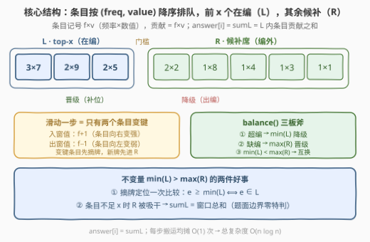
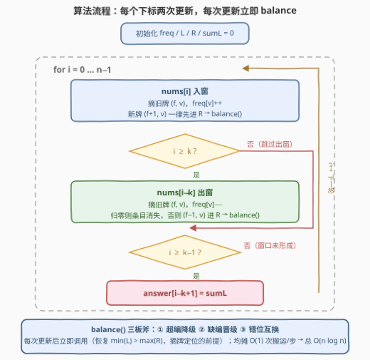
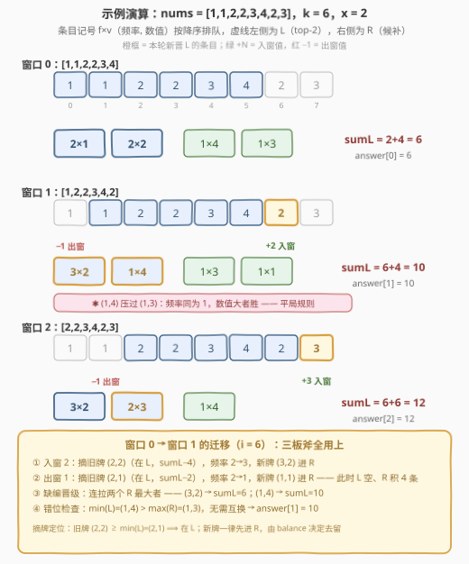

# 计算子数组的 x-sum II

- **题目名称**：计算子数组的 x-sum II
- **链接**：[3321. 计算子数组的 x-sum II](https://leetcode.cn/problems/find-x-sum-of-all-k-long-subarrays-ii/)
- **难度**：困难
- **标签**：数组、哈希表、滑动窗口、堆（优先队列）
- **关联**：[3318（版本 I）](https://leetcode.cn/problems/find-x-sum-of-all-k-long-subarrays-i/)是本题的小数据版（$n \le 50$、$nums[i] \le 50$，逐窗口暴力可过）；本题把 $n$ 放大到 $10^5$，考察**双平衡树增量维护滑动窗口 top-x** 的标准姿势

## 1. 题目概述

给你一个长度为 $n$ 的整数数组 `nums` 和两个整数 `k`、`x`。

数组的 **x-sum** 按如下步骤计算：

1. 统计数组中所有元素的出现次数；
2. 仅保留出现频率最高的前 `x` 种元素——若两种元素出现次数相同，则**数值较大**的元素被认为出现次数更多；
3. 计算保留元素组成的数组的和（每种元素贡献「出现次数 × 数值」）。

**注意**：若数组中的不同元素少于 `x` 个，则其 x-sum 就是数组的**元素总和**。

返回长度为 $n - k + 1$ 的数组 `answer`，其中 `answer[i]` 是子数组 `nums[i..i+k-1]` 的 x-sum。

**示例 1**：

```text
输入：nums = [1,1,2,2,3,4,2,3], k = 6, x = 2
输出：[6,10,12]
解释：
  [1,1,2,2,3,4] → 保留 1(×2)、2(×2) → 1+1+2+2 = 6
  [1,2,2,3,4,2] → 保留 2(×3)、4(×1) → 2+2+2+4 = 10（4 与 3、1 同为 1 次，数值大者优先）
  [2,2,3,4,2,3] → 保留 2(×3)、3(×2) → 2+2+2+3+3 = 12
```

**示例 2**：

```text
输入：nums = [3,8,7,8,7,5], k = 2, x = 2
输出：[11,15,15,15,12]
解释：k == x，每个窗口的不同元素至多 2 个，x-sum 恒为窗口总和。
```

**约束条件**：

- $n = \text{nums.length}$
- $1 \le n \le 10^5$
- $1 \le \text{nums}[i] \le 10^9$
- $1 \le x \le k \le n$

> 💡 **读题关键**：① 排序键是 **(频率, 数值) 二元组**——频率平局时比数值，这是全题最易错的一处；② 窗口和上界 $k \cdot \max(\text{nums}) \approx 10^{14}$，C++ 必须用 `long long`；③ 「不同元素不足 x 个取总和」这个边界，选对数据结构后**不需要一行特判**（见 2.2）；④ 相邻两个窗口的频率表只差「一个值 +1、一个值 −1」——增量维护的信号已经拉满。

---

## 2. 解题思路

### 2.1 暴力思路：逐窗口重排

对每个窗口单独算：哈希统计频率 $O(k)$，把 $d$ 个不同值按 (频率, 数值) 降序排好取前 $x$ 个求和 $O(d \log d)$：

```cpp
for (int i = 0; i + k <= n; ++i) {
    unordered_map<int, int> f;
    for (int j = i; j < i + k; ++j) ++f[nums[j]];
    vector<pair<int, int>> es;                       // (freq, value)
    for (auto& [v, c] : f) es.push_back({c, v});
    sort(es.begin(), es.end(), greater<>());
    long long s = 0;
    for (int t = 0; t < min(x, (int)es.size()); ++t)
        s += 1LL * es[t].first * es[t].second;
    ans.push_back(s);
}
```

总量 $\approx (n-k+1) \cdot k \log k$，$k = n/2 = 5 \times 10^4$ 时约 $4 \times 10^{10}$ 步，超出时限约三个数量级。版本 I（3318）的 $n \le 50$ 下这只是几千步的零头——II 版两千倍的数据放大就是判分线。

### 2.2 核心观察：滑动一步只动两个条目 → L/R 双平衡树增量维护 top-x

窗口右移一格，频率表的变化只有两条：`nums[i]` 的频率 +1，`nums[i-k]` 的频率 −1。把「值 $v$ 及其频率 $f$」看成一个**条目 $(f, v)$**，全体条目按 $(f, v)$ 字典序构成全序——那么每滑一步，只有一个条目「升一级」、一个条目「降一级」，**top-x 名单至多换掉两个成员**。这就是增量维护的完备条件。

结构（正是官方 hint 说的 *"two sets ordered by frequency"*）：

| 部件 | 含义 |
|------|------|
| `freq` | 哈希表：窗口内每个值的出现次数 |
| `L` | 按 $(f, v)$ 排序的平衡树（C++ `multiset` / Python `SortedList`），**恒存 top-x 条目** |
| `R` | 同款平衡树，存其余条目——**候补席** |
| `sumL` | L 内条目的 $\sum f \cdot v$，即当前窗口的答案 |



维护依赖一条**严格分离不变量**：

$$\min(L) \;>\; \max(R) \qquad (\text{L 内任意条目} > \text{R 内任意条目})$$

它派生出两件好事：

1. **摘牌定位一次比较搞定**：条目改频率前得先从树里摘出来，它在 L 还是 R？由不变量，$e \ge \min(L)$ 当且仅当 $e \in L$——不必两棵树各找一遍。
2. **边界自动成立**：条目总数不足 $x$ 时，balance 会把 R 吸干、所有条目都在 L，`sumL` 恰好等于窗口总和——题面「不同元素少于 x 个取总和」不用写一行特判。

每次摘牌/插牌后调用 `balance()` **三板斧**恢复不变量：

1. **超编降级**：$|L| > x$ → 把 $\min(L)$ 搬去 R；
2. **缺编晋级**：$|L| < x$ 且 R 非空 → 把 $\max(R)$ 搬进 L；
3. **错位互换**：$\min(L) < \max(R)$ → 两侧极值互换（说明有条目穿错了门）。

> ⚠️ **为什么 add 和 remove 之后要各自 balance，不能攒到窗口末尾一起调？** add 把新条目**一律先进 R**，此时它可能已经强于 $\min(L)$——分离不变量处于临时破坏状态。若紧接着的 remove 再摘牌，$e \ge \min(L) \Rightarrow e \in L$ 的定位就会指错树：$nums[i] = nums[i-k]$ 时，要摘的旧牌恰是刚进 R 的新牌，会被误判到 L 里找不到而崩溃。**每次更新后立刻恢复不变量，是摘牌定位的前提，属于正确性而非风格。**

### 2.3 算法流程图



均摊分析（为什么总量是 $O(n \log n)$）：从「L 恰为全局 top-x」的平衡态出发，一次频率 $\pm 1$ 只有**跨越 L/R 门槛**的条目需要搬运——升级的条目若原本就在 L，名单不变；若原本在 R，则它顶替旧名单的最小者，新旧名单对称差 $\le 2$。降级情形对称。因此每轮 `balance` 均摊搬运 $O(1)$ 个条目，每次搬运平衡树操作 $O(\log k)$，全程 $2n$ 次更新，合计 $O(n \log n)$。

### 2.4 示例演算

以示例 1 `nums = [1,1,2,2,3,4,2,3], k = 6, x = 2` 走一遍，三个窗口的条目快照（降序排列，`|` 左为 L）：

```text
窗口 [1,1,2,2,3,4]：条目 2×1  2×2 | 1×4  1×3   → sumL = 2 + 4  = 6
窗口 [1,2,2,3,4,2]：条目 3×2  1×4 | 1×3  1×1   → sumL = 6 + 4  = 10
窗口 [2,2,3,4,2,3]：条目 3×2  2×3 | 1×4        → sumL = 6 + 6  = 12
```



最值得细看的是 $i = 6$（窗口 0 → 窗口 1）这一次迁移，四步把三板斧全用上了：

1. **入窗 2**：摘旧牌 $(2,2)$（在 L，`sumL -= 4`），频率 2→3，新牌 $(3,2)$ 进 R；
2. **出窗 1**：摘旧牌 $(2,1)$（在 L，`sumL -= 2`），频率 2→1，新牌 $(1,1)$ 进 R——此刻 L 已空，$R = \{(1,3),\ (1,4),\ (3,2),\ (1,1)\}$；
3. **balance 缺编晋级**：连拉两个 R 最大者：$(3,2)$（`sumL = 6`）、$(1,4)$（`sumL = 10`）；
4. **错位检查**：$\min(L) = (1,4) > \max(R) = (1,3)$，无需互换。$(1,4)$ 能压过同频率的 $(1,3)$，靠的正是**平局比数值**的规则。

answer = $[6, 10, 12]$ ✓。

---

## 3. 参考代码

### C++

```cpp
class Solution {
    long long x, sumL = 0;
    unordered_map<int, int> freq;
    multiset<pair<int, int>> L, R;   // 条目 (freq, value)：L 恒存 top-x，R 为候补席

    void eraseEntry(pair<int, int> e) {  // 摘牌：由不变量 min(L) > max(R) 定位
        if (!L.empty() && e >= *L.begin()) {
            L.erase(L.find(e));
            sumL -= 1LL * e.first * e.second;
        } else {
            R.erase(R.find(e));
        }
    }

    void balance() {                    // 三板斧：先定编，再纠错
        while ((int)L.size() > x) {     // ① 超编：最小者降级
            auto e = *L.begin();
            sumL -= 1LL * e.first * e.second;
            R.insert(e);
            L.erase(L.begin());
        }
        while ((int)L.size() < x && !R.empty()) {  // ② 缺编：R 最大者晋级
            auto e = *prev(R.end());
            sumL += 1LL * e.first * e.second;
            L.insert(e);
            R.erase(prev(R.end()));
        }
        while (!L.empty() && !R.empty() && *L.begin() < *prev(R.end())) {  // ③ 错位互换
            auto lo = *L.begin(), hi = *prev(R.end());
            sumL += 1LL * hi.first * hi.second - 1LL * lo.first * lo.second;
            L.erase(L.begin());
            R.erase(prev(R.end()));
            R.insert(lo);
            L.insert(hi);
        }
    }

    void add(int v) {
        int f = freq[v]++;
        if (f > 0) eraseEntry({f, v});  // 旧牌摘下
        R.insert({f + 1, v});           // 新牌一律先进 R，交给 balance 调度
        balance();
    }

    void remove(int v) {
        int f = freq[v]--;
        eraseEntry({f, v});
        if (f > 1) R.insert({f - 1, v});  // 频率归零则条目直接消失
        balance();
    }

  public:
    vector<long long> findXSum(vector<int>& nums, int k, int x) {
        this->x = x;
        freq.clear(), L.clear(), R.clear(), sumL = 0;  // 实例会被复用，状态必须重置
        int n = nums.size();
        vector<long long> ans(n - k + 1);
        for (int i = 0; i < n; ++i) {
            add(nums[i]);
            if (i >= k) remove(nums[i - k]);
            if (i >= k - 1) ans[i - k + 1] = sumL;
        }
        return ans;
    }
};
```

### Python

```python
from sortedcontainers import SortedList

class Solution:
    def findXSum(self, nums: List[int], k: int, x: int) -> List[int]:
        freq = defaultdict(int)
        L, R = SortedList(), SortedList()   # 条目 (freq, value)：L 恒存 top-x
        sumL = 0

        def erase(e):                        # 摘牌：由不变量 min(L) > max(R) 定位
            nonlocal sumL
            if L and e >= L[0]:
                L.remove(e)
                sumL -= e[0] * e[1]
            else:
                R.remove(e)

        def balance():                       # 三板斧：先定编，再纠错
            nonlocal sumL
            while len(L) > x:                # ① 超编：最小者降级
                e = L.pop(0)
                sumL -= e[0] * e[1]
                R.add(e)
            while len(L) < x and len(R) > 0: # ② 缺编：R 最大者晋级
                e = R.pop()
                sumL += e[0] * e[1]
                L.add(e)
            while L and R and L[0] < R[-1]:  # ③ 错位互换
                lo, hi = L.pop(0), R.pop()
                sumL += hi[0] * hi[1] - lo[0] * lo[1]
                R.add(lo)
                L.add(hi)

        ans = []
        for i, v in enumerate(nums):
            if freq[v]:
                erase((freq[v], v))          # 旧牌摘下
            freq[v] += 1
            R.add((freq[v], v))              # 新牌一律先进 R
            balance()
            if i >= k:
                u = nums[i - k]
                erase((freq[u], u))
                freq[u] -= 1
                if freq[u]:
                    R.add((freq[u], u))      # 频率归零则条目直接消失
                balance()
            if i >= k - 1:
                ans.append(sumL)
        return ans
```

> 💡 **实现细节**：① LeetCode 会**复用同一个 Solution 实例**跑多组用例，成员状态（`freq/L/R/sumL`）必须在入口重置——笔者对拍时就栽在这一步，第二组样例直接 WA；② 新条目**一律先进 R**、统一交给 balance 调度，免去「插入时判断该进 L 还是 R」的双分支；③ 摘牌定位依赖分离不变量，所以**每次更新后必须立刻 balance**（见 2.2 的 ⚠️）；④ C++ `multiset` 删单个等值元素要传**迭代器**（`erase(it)`），传键值 `erase(key)` 会把等值元素一锅端；⑤ LeetCode 的 Python3 环境自带 `sortedcontainers`，可放心 `import`。

---

## 4. 复杂度分析

| 维度 | 复杂度 | 说明 |
|------|--------|------|
| 时间复杂度 | $O(n \log n)$ | 每个下标入窗、出窗各一次；每次更新触发均摊 $O(1)$ 次条目搬运，每次搬运平衡树操作 $O(\log k)$ |
| 空间复杂度 | $O(k)$ | `freq` 哈希 + L/R 两棵树，至多存窗口内不同值（$\le k$）个条目 |
| 暴力对照 | $O(nk \log k)$ 时间 | $k = n/2 = 5 \times 10^4$ 时约 $4 \times 10^{10}$ 步，超出时限约三个数量级（版本 I 的 $n \le 50$ 可过） |

实测：两组官方样例分别得 $[6,10,12]$ / $[11,15,15,15,12]$ ✓；与逐窗口暴力对拍随机数据 10000+ 组（值域压到 $\le 6$ 制造频率回摆、$nums[i] = nums[i-k]$ 制造同值进出窗）全部一致，另做 C++ / Python 双语言 500 组同数据交叉校验，校验和一致；$n = 10^5$、$k = 5 \times 10^4$、$x = 3 \times 10^4$ 下 C++ 0.09 s、Python（SortedList）0.87 s 通过。

---

## 5. 扩展：没有平衡树时——懒删除双堆

面试白板手写、或某些 OJ 没有 `multiset` / `sortedcontainers` 时，top-x 结构可以用**两个堆 + 惰性删除**搓出来：`high` 小根堆存 top-x 条目（堆顶即 $\min(L)$），`low` 大根堆存其余（堆顶即 $\max(R)$）。摘牌不做物理删除，只给旧版本 $(f, v)$ 打「死亡标记」，堆顶露出死牌时顺手丢弃；`sumL` / `sizeL` 则在摘牌时刻同步增减，不等物理出堆。

三个真实的坑（全部来自本次对拍）：

1. **大根堆要整键取负**：存 $(-f, -v)$ 而非 $(-f, v)$，否则频率平局时数值比较方向相反；
2. **同键撞号要计数**：频率回摆（$4 \to 3 \to 4$）会让相同 $(f, v)$ 键的新旧副本同场，死亡标记必须按份数计数，先弹的消耗标记、后弹的视为有效；
3. **跨堆撞号要分账**：同一键的新旧副本可能分居两堆，死亡标记必须**按堆分别记**（`deadL` / `deadR`）——否则新副本会替旧副本「挡枪」，官方第二组样例就是这样挂掉的。

```python
class Solution:
    def findXSum(self, nums: List[int], k: int, x: int) -> List[int]:
        freq, pos = defaultdict(int), {}
        deadL, deadR = defaultdict(int), defaultdict(int)  # 死亡标记按堆分账
        low, high = [], []    # low 大根堆(键取负)：候补席；high 小根堆：top-x
        sizeL = sumL = 0

        def erase(v):         # 摘牌：打死亡标记 + 立刻修正 sizeL/sumL
            nonlocal sizeL, sumL
            f = freq[v]
            if pos[v] == 'L':
                deadL[(f, v)] += 1
                sizeL -= 1
                sumL -= f * v
            else:
                deadR[(f, v)] += 1
            pos[v] = None

        def place(v):         # 新牌一律先放 R
            heappush(low, (-freq[v], -v))
            pos[v] = 'R'

        def peek_low():       # R 最大有效条目（顺手清堆顶死牌）
            while low:
                e = (-low[0][0], -low[0][1])
                if deadR[e]:
                    deadR[e] -= 1
                    heappop(low)
                else:
                    return e
            return None

        def peek_high():      # L 最小有效条目
            while high:
                e = high[0]
                if deadL[e]:
                    deadL[e] -= 1
                    heappop(high)
                else:
                    return e
            return None

        def balance():
            nonlocal sizeL, sumL
            while sizeL > x:  # 超编降级
                e = peek_high()
                heappop(high)
                sumL -= e[0] * e[1]
                sizeL -= 1
                heappush(low, (-e[0], -e[1]))
                pos[e[1]] = 'R'
            while sizeL < x:  # 缺编晋级
                e = peek_low()
                if e is None:
                    break
                heappop(low)
                sumL += e[0] * e[1]
                sizeL += 1
                heappush(high, e)
                pos[e[1]] = 'L'
            while True:       # 错位互换
                lo, hi = peek_high(), peek_low()
                if lo is None or hi is None or lo >= hi:
                    break
                heappop(high)
                heappop(low)
                sumL += hi[0] * hi[1] - lo[0] * lo[1]
                heappush(low, (-lo[0], -lo[1]))
                pos[lo[1]] = 'R'
                heappush(high, hi)
                pos[hi[1]] = 'L'

        ans = []
        for i, v in enumerate(nums):
            if freq[v]:
                erase(v)
            freq[v] += 1
            place(v)
            balance()
            if i >= k:
                u = nums[i - k]
                erase(u)
                freq[u] -= 1
                if freq[u]:
                    place(u)
                balance()
            if i >= k - 1:
                ans.append(sumL)
        return ans
```

实测 $n = 10^5$ 用例 0.59 s，反而比 SortedList 略快——堆的常数更小，代价是三处坑都得踩对。两版对拍 4000+ 组随机数据全部一致。

---

## 6. 面试要点

1. **为什么一个 top-x 堆不够，非要 L/R 两个结构？**

   被挤出 top-x 的条目不能扔：窗口滑走后它的频率会回落，随时可能重返榜单。R 的角色是**候补席**——所有编外条目按序候着，门槛一松就补位。只有一个 top-x 堆的话，被挤出的条目就「失联」了，等它频率回升时再也找不回来。这正是 [480. 滑动窗口中位数](https://leetcode.cn/problems/sliding-window-median/)双堆结构在 top-x 场景的同款迁移。

2. **「频率相同取数值大」怎么融进数据结构？**

   把排序键做成 **(freq, value) 二元组**。`pair` / tuple 的字典序天然是全序，`multiset<pair<int,int>>` 与 `SortedList` 直接可用，不需要自定义比较器——题面规则本身就是比较器。反过来，堆版要自己做「大根堆整键取负」，就是这个全序性的手工实现。

3. **摘牌时怎么知道条目在 L 还是 R？**

   严格分离不变量 $\min(L) > \max(R)$ 保证：$e \ge \min(L) \iff e \in L$，一次比较完成定位。它的另一面是：**每次更新后必须立刻 balance**——新条目先进 R 的中间态会破坏不变量，此时再摘牌就会指错树（$nums[i] = nums[i-k]$ 时直接摘空崩溃）。

4. **每步 balance 凭什么是均摊 $O(1)$ 次搬运？**

   从平衡态（L 恰为全局 top-x）出发，一次 $\pm 1$ 只有跨越 L/R 门槛的条目需要搬：升者若已在 L，名单不变；若在 R，顶掉旧名单最小者，对称差 $\le 2$；降级对称。全程 $2n$ 次更新，总搬运次数线性，乘上每次 $O(\log k)$ 的树操作即 $O(n \log n)$。

5. **有哪些边界与溢出坑？**

   ① $k \cdot \max(\text{nums}) \approx 10^{14} > 2^{31}$，C++ 全程 `long long`（返回类型就是 `vector<long long>`）；② 不同值少于 x 时 R 被吸干，`sumL` 自动等于窗口总和，无需特判；③ `multiset` 删单个元素要传迭代器；④ LeetCode 复用 Solution 实例，成员状态在入口重置——多组用例共享残留状态是最隐蔽的 WA 来源。

---

## 7. 同类练习题

- [3318. 计算子数组的 x-sum I](https://leetcode.cn/problems/find-x-sum-of-all-k-long-subarrays-i/)：本题的小数据版（$n \le 50$），逐窗口暴力可过，正好当对拍基准
- [480. 滑动窗口中位数](https://leetcode.cn/problems/sliding-window-median/)（[站内题解](../0401-0500/480_滑动窗口中位数.md)）：「双有序集合切两半维护滑动窗口」的母题——那边按中位数切，这边按 top-x 门槛切，骨架完全同款
- [347. 前 K 个高频元素](https://leetcode.cn/problems/top-k-frequent-elements/)（[站内题解](../0301-0400/347_前K个高频元素.md)）：静态数组取前 K 高频，本题是它的滑动窗口增量版（条目键在窗内还会变）
- [239. 滑动窗口最大值](https://leetcode.cn/problems/sliding-window-maximum/)（[站内题解](../0201-0300/239_滑动窗口最大值.md)）：对照题——那边元素入窗即定序，单调队列 $O(n)$；这边键 (freq, value) 在窗内涨落，单调性被破坏，只能上平衡树
- [220. 存在重复元素 III](https://leetcode.cn/problems/contains-duplicate-iii/)（[站内题解](../0201-0300/220_存在重复元素III.md)）：滑动窗口 + 有序集合的入门题（窗口内查邻居），本题升级为窗口内维护全局 top-x
