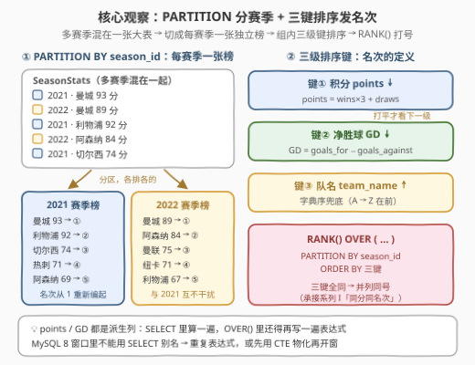
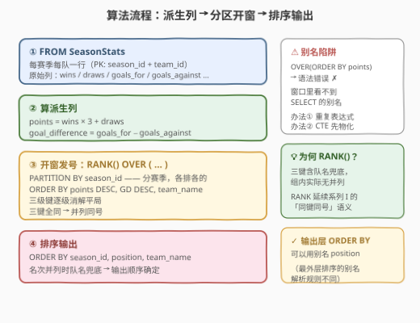
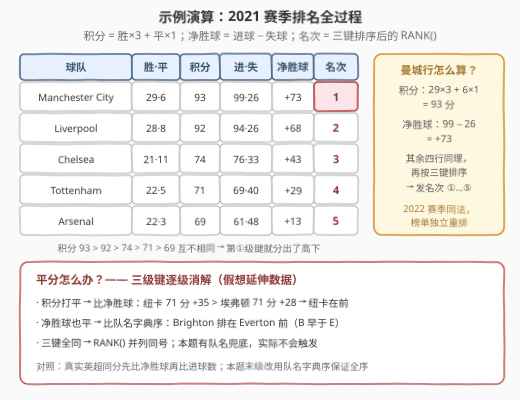

# 英超积分榜排名 III

- **题目名称**：英超积分榜排名 III
- **链接**：[3322. 英超积分榜排名 III](https://leetcode.cn/problems/premier-league-table-ranking-iii/)
- **难度**：中等
- **标签**：SQL、窗口函数、RANK、PARTITION BY、多级排序、相关子查询
- **关联**：3246（系列 I）、3252（系列 II）——「英超积分榜」系列第三作：I 引入同分并列，II 加三档分层，III 升级为**多赛季分区 + 净胜球/队名逐级平局判定**

## 1. 题目概述

> ⚠️ 本题为 LeetCode 付费题，题意描述根据官方示例用例与公开镜像数据重建，可能与官方题面有出入。

表：`SeasonStats`

```text
+------------------+---------+
| Column Name      | Type    |
+------------------+---------+
| season_id        | int     |
| team_id          | int     |
| team_name        | varchar |
| matches_played   | int     |
| wins             | int     |
| draws            | int     |
| losses           | int     |
| goals_for        | int     |
| goals_against    | int     |
+------------------+---------+
(season_id, team_id) 是这张表的唯一主键。
每一行是「某赛季的某支球队」：赛季 id、队伍 id、队伍名、比赛场次、
胜场、平局、输场、进球数 (goals_for)、失球数 (goals_against)。
```

编写一个解决方案，计算**每个赛季每支球队的积分、净胜球和排名**。排名规则：

- 球队首先按**总积分**排名（从高到低）；
- 积分持平，按**净胜球**排名（从高到低）；
- 净胜球也持平，按**球队名称的字典序**排名。

积分计算：胜一场 `3` 分，平一场 `1` 分，负一场 `0` 分；净胜球 = `goals_for - goals_against`。

返回结果按 `season_id` **升序**、`position` **升序**、`team_name` **升序**排序，格式如下例。

**示例**：

```text
输入：SeasonStats 表
+-----------+---------+-------------------+----------------+------+-------+--------+-----------+---------------+
| season_id | team_id | team_name         | matches_played | wins | draws | losses | goals_for | goals_against |
+-----------+---------+-------------------+----------------+------+-------+--------+-----------+---------------+
| 2021      | 1       | Manchester City   | 38             | 29   | 6     | 3      | 99        | 26            |
| 2021      | 2       | Liverpool         | 38             | 28   | 8     | 2      | 94        | 26            |
| 2021      | 3       | Chelsea           | 38             | 21   | 11    | 6      | 76        | 33            |
| 2021      | 4       | Tottenham         | 38             | 22   | 5     | 11     | 69        | 40            |
| 2021      | 5       | Arsenal           | 38             | 22   | 3     | 13     | 61        | 48            |
| 2022      | 1       | Manchester City   | 38             | 28   | 5     | 5      | 94        | 33            |
| 2022      | 2       | Arsenal           | 38             | 26   | 6     | 6      | 88        | 43            |
| 2022      | 3       | Manchester United | 38             | 23   | 6     | 9      | 58        | 43            |
| 2022      | 4       | Newcastle         | 38             | 19   | 14    | 5      | 68        | 33            |
| 2022      | 5       | Liverpool         | 38             | 19   | 10    | 9      | 75        | 47            |
+-----------+---------+-------------------+----------------+------+-------+--------+-----------+---------------+

输出：
+-----------+---------+-------------------+--------+-----------------+----------+
| season_id | team_id | team_name         | points | goal_difference | position |
+-----------+---------+-------------------+--------+-----------------+----------+
| 2021      | 1       | Manchester City   | 93     | 73              | 1        |
| 2021      | 2       | Liverpool         | 92     | 68              | 2        |
| 2021      | 3       | Chelsea           | 74     | 43              | 3        |
| 2021      | 4       | Tottenham         | 71     | 29              | 4        |
| 2021      | 5       | Arsenal           | 69     | 13              | 5        |
| 2022      | 1       | Manchester City   | 89     | 61              | 1        |
| 2022      | 2       | Arsenal           | 84     | 45              | 2        |
| 2022      | 3       | Manchester United | 75     | 15              | 3        |
| 2022      | 4       | Newcastle         | 71     | 35              | 4        |
| 2022      | 5       | Liverpool         | 67     | 28              | 5        |
+-----------+---------+-------------------+--------+-----------------+----------+
```

解释：2021 赛季曼城 $29 \times 3 + 6 \times 1 = 93$ 分、净胜球 $99 - 26 = 73$，居首；2022 赛季榜单**独立重排**，曼城 89 分再次列第一——每个赛季是一张独立的积分榜。

> 💡 **读题关键**：① 多赛季混在一张表——排名必须**按 `season_id` 分区**，否则 2021 的 93 分和 2022 的 89 分会排进同一张榜；② 三级排序键「积分 ↓ → 净胜球 ↓ → 队名 ↑」把「同分并列」**逐级消解**成全序，这是系列 I/II 都没有的新要求；③ `points` 与 `goal_difference` 都是**派生列**，`SELECT` 与窗口 `ORDER BY` 里要各写一遍表达式；④ 输出的排序键（`season_id, position, team_name`）与窗口的排序键（`points, GD, team_name`）**不是同一组**——前者定义「呈现顺序」，后者定义「名次本身」。

---

## 2. 解题思路

### 2.1 老式思路：相关子查询数「严格排在我前面的球队」

窗口函数出现之前（MySQL 5.7 及更早），这类排名题的标准写法是：对每一行，名次 = 同赛季中「**严格更优**」的行数 + 1。「更优」要把三级排序键写全：

$$\text{better}(A, B) \iff p_A > p_B \;\lor\; (p_A = p_B \land d_A > d_B) \;\lor\; (p_A = p_B \land d_A = d_B \land \text{name}_A < \text{name}_B)$$

其中 $p$ 是积分、$d$ 是净胜球。完整 SQL 见第 3 节解法 B。两个命门：

- **比较器必须覆盖三级键的全部分支**——漏掉净胜球或队名任一级，平局行之间就分不出先后，名次退化为取决于物理存储顺序（结果不稳定）；
- **必须用严格比较**（`>` / `<`）——用 `>=` 会把「与我同键的行」也数进「更优」，名次全体虚低。

代价：每行触发一次同赛季扫描，$O(n^2)$；且排序键是表达式，索引难以利用。这是没有窗口函数时代的固有代价。

### 2.2 核心观察：窗口函数一句话完成「分区 + 排序 + 发号」

2.1 的本质是：**每个分区各自按三级键排序，然后发名次**。这正是窗口函数的存在意义——`RANK() OVER (PARTITION BY … ORDER BY …)` 一句话把三件事全说了：

```sql
RANK() OVER (
    PARTITION BY season_id          -- 每赛季一张独立榜
    ORDER BY points DESC,           -- 键①：积分
             goal_difference DESC,  -- 键②：净胜球
             team_name              -- 键③：队名字典序兜底
)
```

三个部件与题意逐字对应：

- `PARTITION BY season_id`：**组间隔离**——2021 与 2022 的名次各自从 1 编起，互不挤占；
- `ORDER BY 三键`：**组内全序**——三级键依次消解平局，积分打平看净胜球，净胜球也平比队名；
- `RANK()`：三键全同的行**并列同号**——延续系列 I「同分同名次」的约定（本题有队名兜底，实际不会触发）。

代价从 2.1 的「每行一次子查询」变成「每个分区一次排序」：$O(n^2) \to O(n \log n)$。



> ⚠️ **派生列的别名陷阱**：MySQL 8 的 `OVER(...)` 里**不能引用同级 `SELECT` 的输出别名**——`RANK() OVER (ORDER BY points DESC)` 会报「Unknown column」。两个办法：① 像解法 A 那样在窗口里**重复表达式**；② 先用 CTE / 派生表把 `points`、`goal_difference` 物化成真列，再在外层开窗（解法 A′）。注意：最外层输出的 `ORDER BY season_id, position, team_name` **可以**用别名——输出排序的别名解析规则与窗口定义不同。

### 2.3 算法流程：派生列 → 分区开窗 → 排序输出



一句话：`FROM` 原表 → `SELECT` 里算出两个派生列并同步开窗发号 → 输出层按 `season_id, position, team_name` 排序。整个过程**无需 JOIN、无需 GROUP BY 聚合**——所有信息都在一张宽表里，纯粹是「分区排序打号」。

### 2.4 示例演算

以 2021 赛季五支球队走一遍（2022 赛季同法、榜单独立）：



1. **派生列**：曼城 $29 \times 3 + 6 = 93$ 分、净胜球 $99 - 26 = +73$；利物浦 $92$、$+68$；切尔西 $74$、$+43$；热刺 $71$、$+29$；阿森纳 $69$、$+13$；
2. **排序发号**：积分 $93 > 92 > 74 > 71 > 69$ 互不相同——**三级键里第①级就分出了高下**，名次 ①—⑤；
3. **2022 赛季**：独立重排——曼城 89 ①、阿森纳 84 ②、曼联 75 ③、纽卡 71 ④、利物浦 67 ⑤；
4. **输出**：`season_id` 升序（2021 全部在前），组内 `position` 升序，`team_name` 兜底。

注意示例数据刻意避开了平分；若 2022 赛季再添一支 71 分的球队（如埃弗顿，净胜球 $+28$），则与纽卡（71 分、$+35$）在键①打平、由键②净胜球分出高下——见上图底部面板。

---

## 3. 参考代码

### SQL（解法 A：RANK() 窗口函数，推荐）

```sql
SELECT
    season_id,
    team_id,
    team_name,
    wins * 3 + draws                    AS points,
    goals_for - goals_against           AS goal_difference,
    RANK() OVER (
        PARTITION BY season_id
        ORDER BY wins * 3 + draws DESC,
                 goals_for - goals_against DESC,
                 team_name ASC
    )                                   AS position
FROM SeasonStats
ORDER BY season_id, position, team_name;
```

> 💡 **写法要点**：
> - `PARTITION BY season_id` 对应「每个赛季一张独立榜」；窗口 `ORDER BY` 的三键对应题面的三级排名规则——`team_name` 不写 `ASC` 也一样（缺省即升序），显式写出是为了和题面「字母顺序」逐字对齐。
> - 窗口 `ORDER BY` 里**重复**了 `wins * 3 + draws` 等表达式而非引用别名——`OVER()` 里看不到 `SELECT` 别名（见 2.2 的陷阱说明）。
> - 输出层的 `ORDER BY season_id, position, team_name` 可以引用别名：`position` 是 `SELECT` 的输出列，最外层排序认它。
> - `position` 在 MySQL 里是函数名（`POSITION(substr IN str)`），作列别名可用；若环境较真，加反引号 `` `position` `` 即可。

### SQL（解法 A′：CTE 物化派生列，可读性更好）

```sql
WITH stats AS (
    SELECT season_id, team_id, team_name,
           wins * 3 + draws          AS points,
           goals_for - goals_against AS goal_difference
    FROM SeasonStats
)
SELECT season_id, team_id, team_name, points, goal_difference,
       RANK() OVER (
           PARTITION BY season_id
           ORDER BY points DESC, goal_difference DESC, team_name
       ) AS position
FROM stats
ORDER BY season_id, position, team_name;
```

> 💡 **与解法 A 的区别仅是「派生列先物化」**：`points` / `goal_difference` 成为 CTE 的真列，窗口 `ORDER BY` 直接引用列名——表达式只写一遍，键的含义一眼可读。两版执行计划通常一致（优化器会做表达式归并），按团队口味选择。

### SQL（解法 B：相关子查询，MySQL 5.7 兼容）

```sql
SELECT
    s1.season_id,
    s1.team_id,
    s1.team_name,
    s1.wins * 3 + s1.draws          AS points,
    s1.goals_for - s1.goals_against AS goal_difference,
    1 + (SELECT COUNT(*)
         FROM SeasonStats s2
         WHERE s2.season_id = s1.season_id
           AND (s2.wins * 3 + s2.draws > s1.wins * 3 + s1.draws
             OR (s2.wins * 3 + s2.draws = s1.wins * 3 + s1.draws
                 AND s2.goals_for - s2.goals_against > s1.goals_for - s1.goals_against)
             OR (s2.wins * 3 + s2.draws = s1.wins * 3 + s1.draws
                 AND s2.goals_for - s2.goals_against = s1.goals_for - s1.goals_against
                 AND s2.team_name < s1.team_name))) AS position
FROM SeasonStats s1
ORDER BY season_id, position, team_name;
```

> 💡 **写法要点**：
> - 名次 = 1 + 「同赛季中**严格更优**的行数」，这恰是 `RANK()` 的定义——并列的双方互不「严格更优」，于是同号。
> - 比较器必须覆盖三级键的**全部分支**（见 2.1 的两个命门）；三级 OR 的顺序即键的优先级。
> - 这里用 `COUNT(*)`（数行）而非 `COUNT(DISTINCT …)`（数不同值）——前者对应 `RANK`，后者对应 `DENSE_RANK`，本题要前者。
> - 每行触发一次同赛季扫描，$O(n^2)$，且排序键是表达式、索引难利用——5.7 时代写法的固有代价，8.0+ 请用解法 A。

### Python（pandas）

```python
import pandas as pd


def process_team_standings(season_stats: pd.DataFrame) -> pd.DataFrame:
    df = season_stats
    df['points'] = df['wins'] * 3 + df['draws']
    df['goal_difference'] = df['goals_for'] - df['goals_against']

    df = df.sort_values(
        ['season_id', 'points', 'goal_difference', 'team_name'],
        ascending=[True, False, False, True],
    )
    df['position'] = df.groupby('season_id').cumcount() + 1

    return df[['season_id', 'team_id', 'team_name',
               'points', 'goal_difference', 'position']]
```

> 💡 **pandas 对照**：`sort_values` 的四键排序 = 窗口 `ORDER BY`（外加分区键 `season_id` 在最前兜底）；`groupby('season_id').cumcount() + 1` = 每分区独立从 1 编号。
> - ⚠️ `cumcount()` 是 `ROW_NUMBER` 语义（强行唯一定号）。本题三键含队名兜底、组内实际互异，与 `RANK()` 结果一致；若要严格复刻 `RANK`，需对三键组合用 `rank(method='min')`。
> - 与 [185 题解](../0101-0200/185_部门工资前三高的所有员工.md)的单键 `rank(method='dense')` 对照：多键排名在 pandas 里没有直接 API，**先排序再 cumcount** 是惯用法。

---

## 4. 复杂度分析

| 维度 | 复杂度 | 说明 |
|------|--------|------|
| **时间（解法 A/A′）** | $O(n \log n)$ | 窗口函数对每个 `season_id` 分区排序，各区排序之和不超过全局一次排序；输出排序 $O(n \log n)$。$n$ = `SeasonStats` 行数 |
| **时间（解法 B）** | $O(n^2)$ | 每行触发一次同赛季子查询扫描；排序键是派生表达式，索引难以利用，实际常退化为重复全扫 |
| **空间** | $O(n)$ | 窗口函数物化「分区 + 排序」的中间结果；pandas 版 `sort_values` 产生新 DataFrame 同为 $O(n)$ |
| **对照** | 窗口函数 ≫ 子查询 | 系列三作（I/II/III）的官方考点都是窗口函数；5.7 兼容写法仅作面试备选 |

> ⚠️ SQL 的实际耗时取决于执行计划：`(season_id, wins, draws)` 之类的复合索引难以覆盖**表达式**排序，优化器一般直接选择分区排序（内存不够时 spill 到磁盘临时表）。面试中说明「窗口函数一次分区排序 $O(n\log n)$，替代相关子查询的 $O(n^2)$」即可。

---

## 5. 扩展：「英超积分榜」三部曲与三种排名函数

**系列演进**——三作共享「积分 = 胜×3 + 平」的骨架，考点逐级加码：

| 题号 | 新增考点 | 核心语句 |
|------|----------|----------|
| [3246. 英超积分榜排名 I](https://leetcode.cn/problems/premier-league-table-ranking/)（简单） | 单赛季、同分并列同名次 | `RANK() OVER (ORDER BY points DESC)` |
| [3252. 英超积分榜排名 II](https://leetcode.cn/problems/premier-league-table-ranking-ii/)（中等） | 并列之上再加三档分层（前 33% / 中 33% / 后 34%，边界并列取高档） | `RANK() + COUNT(*) OVER() + CASE WHEN` |
| 3322. 英超积分榜排名 III（中等，本题） | **多赛季分区** + **净胜球/队名逐级消解平局** | `RANK() OVER (PARTITION BY season_id ORDER BY 三键)` |

从 I 到 III 正好是窗口函数的三个学习台阶：**全局排名 → 全局排名 + 全局聚合 → 分区排名 + 多级键**。

**为何本题是 `RANK` 而非 `DENSE_RANK` / `ROW_NUMBER`？** 三键兜底后组内名次实际唯一，三种函数在本题数据上**输出相同**；选 `RANK()` 是语义延续——系列 I 明文规定「积分相同的球队必须分配相同的排名」，III 把「相同」扩展为「三键全同」。三函数的分野只在并列出现时显形：`RANK` 并列后跳号、`DENSE_RANK` 不跳号、`ROW_NUMBER` 强行唯一定号。[185 题解](../0101-0200/185_部门工资前三高的所有员工.md)在 Top-K 场景下对三者的分歧有严格证明——`RANK` 跳号会漏档、`ROW_NUMBER` 会砍并列，只有 `DENSE_RANK` 恰当。**函数选型永远由「并列怎么处理」决定，先读题再选刀**。

**与真实英超规则对照**：现实中的英超积分榜同分时依次比较**净胜球、进球数**，仍平且涉及冠亚军/升降级时加赛；本题把末级简化为**队名字典序**——对数据库题而言，一条确定性的全序规则比「加赛」更容易判定与验证。

---

## 6. 面试要点

1. **为什么必须 `PARTITION BY season_id`？去掉会怎样？**

   - 去掉后所有赛季挤进同一排名序列：2021 曼城的 93 分与 2022 曼城的 89 分会同榜竞争，2021 的阿森纳（69 分、该季第 5）会排到 2022 的利物浦（67 分）之后——跨赛季比积分没有意义。**分区 = 「每组各自排名」的 SQL 表达**，与 [185](../0101-0200/185_部门工资前三高的所有员工.md) 的 `PARTITION BY departmentId` 同构。

2. **窗口的 `ORDER BY` 和输出的 `ORDER BY` 为什么不是同一组键？**

   - 窗口 `ORDER BY points DESC, GD DESC, team_name` **定义名次**；输出 `ORDER BY season_id, position, team_name` **定义呈现顺序**。由于 `position` 由前三者派生，组内按 `position` 排 ≡ 按 `(points, GD, name)` 排，两种输出写法等价。末尾的 `team_name` 兜底保证名次并列时输出顺序确定——SQL 不写 `ORDER BY` 时行序无保证。

3. **`OVER(...)` 里能写 `ORDER BY points DESC`（复用别名）吗？**

   - 不能。MySQL 8 的窗口定义看不到同级 `SELECT` 的输出别名，会报「Unknown column 'points'」。出路：重复表达式（解法 A）或 CTE 先物化（解法 A′）。**最外层输出的 `ORDER BY` 则可以用别名**——两处别名解析规则不同，是窗口函数题的高频坑。

4. **不用窗口函数怎么写？最容易错在哪？**

   - 相关子查询数「同赛季严格更优的行数」+ 1，即解法 B。两个命门：① 比较器必须写全三级键的分支，漏掉任何一级，平局行的名次就取决于物理顺序；② 必须严格比较（`>` / `<`），`>=` 会把同键行（含并列对手）数进「更优」，名次全体虚低。另注意 `COUNT(*)` 对应 `RANK`、`COUNT(DISTINCT)` 对应 `DENSE_RANK`。

5. **本题的「三键全序」和系列 I 的「同分同名次」矛盾吗？**

   - 不矛盾，是**泛化**：I 的排名键只有积分，同分即同键 → 并列；III 的排名键扩成三元组 `(points, GD, name)`，**三键全同才并列**——「同键同名次」的规则没变，变的是「键」的组成。真出现三键全同的两行（`team_id` 不同），`RANK()` 恰好让它们并列同号，规则闭环。

> 💡 **一句话总结**：3322 = 「**分区 + 多级键 + RANK**」的窗口函数三板斧——`PARTITION BY season_id` 切榜单、三级 `ORDER BY` 逐级消解平局、`RANK()` 发号。考点不在算积分（小学数学），而在三处：① 分区意识（多赛季独立）；② 派生列在窗口里的别名陷阱（重复表达式或 CTE 物化）；③ 输出排序与窗口排序的键分离。记住这条公式，所有「每组按多级规则排名」的 SQL 题都能套用。

---

## 7. 同类练习题

- [3246. 英超积分榜排名](https://leetcode.cn/problems/premier-league-table-ranking/)：系列第一作——无分区单赛季 `RANK()` 入门版，同分并列不消解，做完再回看 III 能体会「分区 + 多级键」各自砍掉了什么歧义
- [3252. 英超积分榜排名 II](https://leetcode.cn/problems/premier-league-table-ranking-ii/)：系列第二作——`RANK()` + `COUNT(*) OVER()` 总数 + `CASE WHEN` 三档分层，练「排名函数 + 全局聚合」组合拳
- [178. 分数排名](https://leetcode.cn/problems/rank-scores/)：`RANK` 与 `DENSE_RANK` 语义差异的定义题——同分同号后跳不跳号，本题选型的理论根基
- [185. 部门工资前三高的所有员工](https://leetcode.cn/problems/department-top-three-salaries/)（[站内题解](../0101-0200/185_部门工资前三高的所有员工.md)）：`PARTITION BY` + 排名函数 + 外层过滤的分组 Top-K 母题，与本题共享「分区发号」骨架
- [569. 员工薪水中位数](https://leetcode.cn/problems/median-employee-salary/)（[站内题解](../0501-0600/569_员工薪水中位数.md)）：组内 `ROW_NUMBER` 定位中位行——分区行号的另一种用法，与排名语义互补
