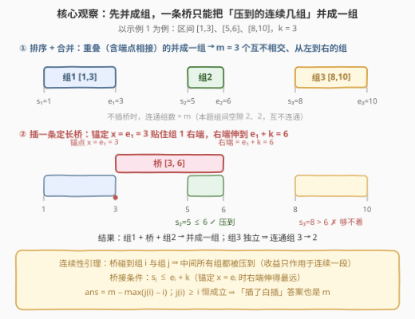
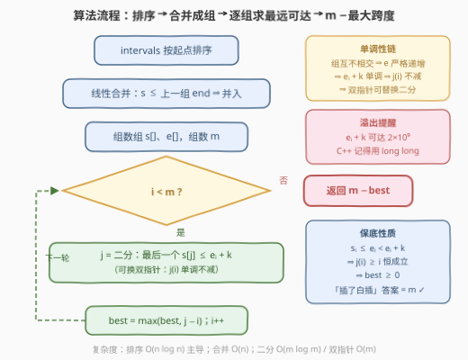
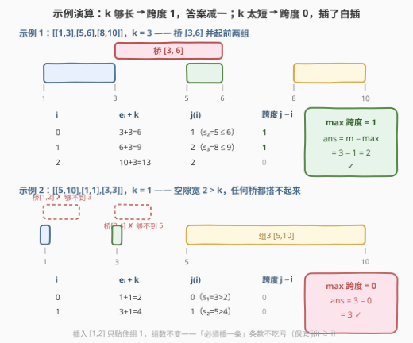

# LeetCode 通过插入区间最小化连通组 题解

- **关联**：与 [56. 合并区间](https://leetcode.cn/problems/merge-intervals/)（[站内题解](../0001-0100/56_合并区间.md)）、[57. 插入区间](https://leetcode.cn/problems/insert-interval/)（[站内题解](../0001-0100/57_插入区间.md)）同属「区间三件套」：56 是「把重叠的并起来」，57 是「插一条再并」，本题是「只许插一条**定长**区间，问最少剩几组」——把 57 的插入模拟升级为「这条桥该**桥接哪些组**」的组合决策

## 1. 题目概述

- **标题 / 题号**：通过插入区间最小化连通组（#3323，medium）
- **链接**：https://leetcode.cn/problems/minimize-connected-groups-by-inserting-interval/
- **难度**：中等
- **标签**：数组、排序、二分查找、滑动窗口、区间

> ⚠️ 本题为 LeetCode 付费题，题意描述根据官方示例用例与 hints 重建，可能与官方题面有出入。

**题意**：给你一个二维整数数组 `intervals`，其中 `intervals[i] = [start_i, end_i]` 表示第 $i$ 个区间的起点和终点。

- 两个区间若**重叠**（至少共享一个公共点，端点相等也算），称它们是**连通**的；
- **连通组**是一个极大的区间集合：组内任意两个区间直接或间接连通。

再给定一个整数 $k$。你必须**恰好插入一个**长度为 $k$ 的新区间 $[x,\, x+k]$（$x$ 任选）。返回插入后连通组数目的**最小可能值**。

**示例 1**：

```text
输入：intervals = [[1,3],[5,6],[8,10]], k = 3
输出：2
解释：插入 [3,6]：与 [1,3] 共享点 3、与 [5,6] 重叠 → 前两组并成一组；
      [8,10] 仍独立 → 共 2 组。
      一条桥连不起三组：要从 ≤3 的位置伸到 ≥8，长度至少 5 > 3。
```

**示例 2**：

```text
输入：intervals = [[5,10],[1,1],[3,3]], k = 1
输出：3
解释：排序合并后为 [1,1]、[3,3]、[5,10] 三组，组间空隙分别为 2 和 2，
      长度 1 的区间哪两个组都搭不起来；把桥贴进某个已有组（如插 [1,2]），
      组数不变 → 仍为 3 组。
```

**约束条件**（按惯例重建）：

- $1 \le intervals.length \le 10^5$
- $intervals[i] = [start_i,\, end_i]$
- $0 \le start_i \le end_i \le 10^9$
- $1 \le k \le 10^9$

> 💡 **读题关键**：①「**共享一个点就算连通**」——$[1,3]$ 与 $[3,5]$ 属于同一组，端点相接**不**隔开；② 桥的长度固定为 $k$、位置任选，它的全部作用是把「直接压到的**连续若干组**」并成一组；③「必须恰好插入一条」并不会让答案变差：把桥完全贴在某个已有组上组数不变，所以答案恒 $\le m$（原组数）。

## 2. 解题思路

### 2.1 暴力思路：枚举桥的位置，重新数一遍

最直接的做法：枚举桥的左端点 $x$ 的每个候选值（每个关键坐标都试一遍），插入后完整地重跑一次「排序 + 合并」数出组数。候选位置有 $O(n)$ 个，每次重数 $O(n \log n)$，总计 $O(n^2 \log n)$；$n = 10^5$ 时约 $10^{10}$ 级操作，不可行。

暴力low效的根源：**每次都从头模拟，没有把「插一条桥」的收益公式化**。真正该问的是——插入一条桥，到底能减少多少组？把这个量算清楚，就不需要真的重新合并。

### 2.2 核心观察：桥压到哪些组，只看「$e_i + k$ 够不够到 $s_j$」

三步观察（正好对应官方 hints 的三连提示）。

**第一步：排序 + 合并成组。** 套用 [56. 合并区间](https://leetcode.cn/problems/merge-intervals/)（[站内题解](../0001-0100/56_合并区间.md)）的模板：按起点排序，线性扫一遍，把互相重叠（含端点相接）的区间并成若干个**互不相交、从左到右排列**的组。设得到 $m$ 组，第 $i$ 组的起点、终点为 $s_i$、$e_i$。不插桥时答案就是 $m$。

**第二步：桥的形态——压到的组必是连续一段。** 插入 $[x,\, x+k]$ 后，连通组只发生一种变化：**桥直接压到的那些组**（连同桥本身）并成一个大组，没压到的组原样保留。而且这一个关键引理：

> 💡 **连续性引理**：若桥与组 $i$、组 $j$（$i < j$）都相交，则它与 $i, j$ 之间的**每一个**组都相交。
>
> 证明：组从左到右互不相交且有序，故 $x \le e_i < s_{i+1} \le s_\ell \le e_\ell < s_j \le x + k$（$\ell$ 为中间任一组）。于是 $s_\ell \in [x,\, x+k] \cap \text{组}\ell$，桥压到了组 $\ell$。∎

直觉版本：中间的组整段「堵」在 $i$ 和 $j$ 之间，桥要从 $i$ 伸到 $j$ 就必须从它身上碾过去。所以「桥压到的组」永远是**连续区间** $[i..j]$，组数减少量（收益）$= (j - i + 1) - 1 = j - i$。

**第三步：桥接条件与最优锚点。** 桥与组 $i$、组 $j$ 都相交 $\iff$ 存在 $x$ 使 $x \le e_i$ 且 $x + k \ge s_j$，即：

$$\text{一条桥可把组 } i..j \text{ 连起来} \iff s_j \le e_i + k$$

而给定左端组 $i$，桥要碰到组 $i$ 就必须 $x \le e_i$，于是右端点至多伸到 $e_i + k$——**锚定 $x = e_i$（贴着组 $i$ 的右端）永远不劣**。整道题收敛为一个公式：

$$\text{ans} = m - \max_{0 \le i < m}\big(j(i) - i\big), \qquad j(i) = \max\{\, j : s_j \le e_i + k \,\}$$

$s$ 数组有序 $\Rightarrow$ $j(i)$ 一次**二分**（`upper_bound`）即可求出；又因组互不相交 $\Rightarrow e_i$ 严格递增 $\Rightarrow e_i + k$ 单调 $\Rightarrow j(i)$ 单调不减 $\Rightarrow$ 也可用**滑动窗口双指针** $O(m)$ 求出（这正是题目标签里 Binary Search 与 Sliding Window 双标签的由来）。

$\max$ 至少为 $0$：因为 $s_i \le e_i < e_i + k$，恒有 $j(i) \ge i$——桥至少能贴住组 $i$ 自己。这对应「插了白插」的情形（示例 2），答案 $= m$，也说明「必须插入」的条款永远不会把答案顶到 $m + 1$。



### 2.3 算法流程



1. `intervals` 按起点排序，$O(n \log n)$；
2. 线性扫描合并重叠区间，得到组列表（起点数组 $s[]$、终点数组 $e[]$）与组数 $m$；
3. 对每个 $i \in [0, m)$，在 $s[]$ 中二分找**最后一个** $\le e_i + k$ 的位置 $j(i)$（或双指针滑动）；
4. 答案 $= m - \max\big(j(i) - i\big)$。

### 2.4 示例演算



**示例 1**（$intervals = [[1,3],[5,6],[8,10]]$，$k=3$）：

- 排序合并：三段互不重叠 → $m = 3$，$s = [1, 5, 8]$，$e = [3, 6, 10]$；
- 逐组找最远可达：

| $i$ | $e_i + k$ | $j(i)$（最后一个 $s_j \le e_i + k$） | 跨度 $j - i$ |
|-----|-----------|--------------------------------------|--------------|
| 0 | $3 + 3 = 6$ | $1$（$s_2 = 5 \le 6$，$s_3 = 8 > 6$） | $1$ |
| 1 | $6 + 3 = 9$ | $2$（$s_3 = 8 \le 9$） | $1$ |
| 2 | $10 + 3 = 13$ | $2$ | $0$ |

- $\max$ 跨度 $= 1$，答案 $= 3 - 1 = \mathbf{2}$ ✓（最优桥即 $[e_1,\, e_1 + k] = [3, 6]$，把组 1、2 并成一组）

**示例 2**（$intervals = [[5,10],[1,1],[3,3]]$，$k=1$）：

- 排序合并：$[1,1],\, [3,3],\, [5,10]$ 互不重叠 → $m = 3$，$s = [1, 3, 5]$，$e = [1, 3, 10]$；
- 逐组找最远可达：$i=0$：$1 + 1 = 2 < s_1 = 3$ → $j = 0$；$i=1$：$3 + 1 = 4 < s_2 = 5$ → $j = 1$；$i=2$：$j = 2$。所有跨度都是 $0$；
- 答案 $= 3 - 0 = \mathbf{3}$ ✓（$k=1$ 太短，哪两个组都搭不起来；桥贴进任意已有组，组数不变）

> 💡 **自检口径**：写完代码后用「跨度全 0 → 答案 $= m$」和「$k$ 巨大 → 答案 $= 1$」两个极端各测一发，能拦住绝大多数边界错误（桥条件写反、二分开闭区间写错都会在这两发里现形）。

## 3. 参考代码

### C++（二分版，对齐官方 hint 3）

```cpp
class Solution {
public:
    int minConnectedGroups(vector<vector<int>>& intervals, int k) {
        sort(intervals.begin(), intervals.end());

        // 第一步：排序 + 线性合并，得到互不相交、有序的连通组
        vector<pair<long long, long long>> g;   // (s_i, e_i)
        for (const auto& it : intervals) {
            if (!g.empty() && it[0] <= g.back().second) {          // 共享一点即连通
                g.back().second = max(g.back().second, (long long)it[1]);
            } else {
                g.push_back({it[0], it[1]});
            }
        }

        int m = g.size();
        vector<long long> s(m);                  // 组起点数组（有序，供二分）
        for (int i = 0; i < m; ++i) s[i] = g[i].first;

        // 第二步：对每组 i 二分找最后一个 s[j] <= e_i + k
        int best = 0;
        for (int i = 0; i < m; ++i) {
            int j = upper_bound(s.begin(), s.end(), g[i].second + k) - s.begin() - 1;
            best = max(best, j - i);
        }
        return m - best;                         // m - 最大跨度
    }
};
```

> 💡 **写法要点**：
> - 合并条件是 `it[0] <= g.back().second`——**端点相接也算连通**，等号不能丢；丢了会把 $[1,3]$ 与 $[3,5]$ 错拆成两组。
> - `upper_bound(...) - 1` 取的是「最后一个 $\le$ 目标值」的下标（右界），目标值相等时也会被跳过再退一格，语义恰好是我们要的 $s_j \le e_i + k$。
> - $e_i + k$ 上界 $2 \times 10^9$，用 `long long` 存组端点防溢出；$j \ge i$ 恒成立，`best` 初值 0 安全。

### Python（双指针版，对齐滑动窗口标签）

```python
class Solution:
    def minConnectedGroups(self, intervals: List[List[int]], k: int) -> int:
        intervals.sort()

        # 第一步：排序 + 线性合并成互不相交、有序的连通组
        groups = []
        for s, e in intervals:
            if groups and s <= groups[-1][1]:        # 共享一点即连通
                groups[-1][1] = max(groups[-1][1], e)
            else:
                groups.append([s, e])

        m = len(groups)
        # 第二步：e 严格递增 => e_i + k 单调 => j(i) 单调不减，双指针 O(m)
        best = 0
        j = 0
        for i in range(m):
            if j < i:                                 # 保底：桥至少贴得住组 i 自己
                j = i
            while j + 1 < m and groups[j + 1][0] <= groups[i][1] + k:
                j += 1
            best = max(best, j - i)
        return m - best
```

> 💡 **两版怎么选**：二分版思路直白（每组独立查询，不依赖单调性），双指针版少一个 $\log$ 且更贴「滑动窗口」标签。若想用 Python 写二分版，把内层循环换成 `j = bisect.bisect_right(starts, groups[i][1] + k) - 1` 即可（`starts = [g[0] for g in groups]`）。

## 4. 复杂度分析

| 维度 | 复杂度 | 说明 |
|------|--------|------|
| **时间（二分版）** | $O(n \log n)$ | 排序 $O(n \log n)$ 主导；合并 $O(n)$；$m$ 组每组二分 $O(\log m)$，合计 $O(n \log n)$ |
| **时间（双指针版）** | $O(n \log n)$ | 排序主导；合并与双指针均为线性 $O(n + m)$，$m \le n$ |
| **空间** | $O(n)$ | 排序递归栈 + 组列表 $s[],\, e[]$ |

> 💡 两版时间复杂度同阶——瓶颈都在排序。双指针省掉的 $\log$ 只在「输入已有序、跳过排序」时才真正兑现为线性。

## 5. 扩展：双指针的正确性从哪来 + 三个变体思考

**单调性链条**：组互不相交 $\Rightarrow e_i < s_{i+1} \le e_{i+1} \Rightarrow e$ **严格递增** $\Rightarrow e_i + k$ 单调不减 $\Rightarrow j(i)$ 单调不减 $\Rightarrow$ 指针 $j$ 全程只前进不回退，均摊 $O(1)$。这是「有序结构上的双指针」的标准出场方式——先证明「窗口边界随扫描指针单调」，再放心地写 `while` 前进，与 [986. 区间列表的交集](https://leetcode.cn/problems/interval-list-intersections/)（[站内题解](../0901-1000/986_区间列表的交集.md)）的归并双指针同族。

**变体一：「必须恰好插一条」vs「至多插一条」**。答案相同：插桥的最坏情况是「贴住某一组」（跨度 0，组数不变），永远可以避免「悬空成新组」。真正会区分两种问法的是输出方案而非数值。

**变体二：$k = 0$ 的退化**。桥退化为单点 $[x, x]$。由于相邻组严格分离（$e_i < s_{i+1}$，合并阶段已把端点相接的都并掉了），一个点不可能同时碰到两个组 → 答案恒为 $m$。题目约束 $k \ge 1$ 正是为了避开这个没有决策空间的退化情形。

**变体三：允许插 $t$ 条桥**。一条桥的收益只作用于**连续一段组**，多条桥收益要想相加，各段必须不重叠；但桥还可以**首尾接力**（桥 A 与桥 B 相交则同组）跨过更大的空隙——这就不再是一遍二分能解决的了，需要按「每段空隙长度 $\lceil gap / k \rceil$ 条桥」做预算分配，退化为经典的区间覆盖计数问题。面试中点到这一层即可，不必展开。

## 6. 面试要点

1. **为什么桥压到的组一定是连续的一段？**

   - 连续性引理：桥 $[x, x+k]$ 若与组 $i$、组 $j$（$i<j$）都相交，则 $x \le e_i < s_{i+1} \le \cdots \le s_j \le x+k$，中间任一组 $\ell$ 的起点 $s_\ell$ 落在桥内，必被压到。组互不相交且有序是前提——这就是为什么必须**先合并再谈桥**。

2. **为什么不枚举所有 $x$？锚定 $x = e_i$ 为什么不劣？**

   - 桥要碰到左端组 $i$ 必须 $x \le e_i$，右端点至多 $e_i + k$，在 $x = e_i$ 时取到；再往左伸不会压到更多组（左边的组要么已经压到、要么由「枚举每个 $i$」的那一轮负责）。最优桥压到 $[i..j]$ 时，第 $i$ 轮的二分必然给出 $j(i) \ge j$，跨度不会漏算。

3. **「必须恰好插入一条」会不会让答案变成 $m + 1$？**

   - 不会。$s_i \le e_i < e_i + k$ 保证 $j(i) \ge i$，即桥总能贴住至少一个组；把桥放进任何已有组的范围内，组数不变。所以答案 $\le m$ 恒成立，公式 $m - \max(j(i) - i)$ 的 $\max$ 下界 0 正对应这个保底。

4. **端点相接算不算连通？合并和桥接的条件分别怎么写？**

   - 算。「共享至少一个公共点」：合并阶段写 `s <= 上一组 end`；桥接阶段写 `s_j <= e_i + k`——两处的等号都是题意的一部分，丢掉等号会把 $[1,3]$、$[3,5]$ 错拆两组、把恰好够到的桥错判为够不到（示例 1 的最优桥 $[3,6]$ 正是贴着端点搭起来的）。

5. **二分版与双指针版各自依赖什么性质？**

   - 二分版只依赖 $s[]$ 有序，每组独立查询；双指针版额外依赖 $e$ 严格递增（组互不相交）带来的 $j(i)$ 单调性。写双指针时注意 `j` 的保底推进（`if j < i: j = i`），否则间隔较大时会出现 $j < i$、跨度算成负数的低级错误（虽然 `max` 兜住了结果，逻辑上已是错的）。

> 💡 **一句话总结**：3323 = 「**合并成组 → 一条定长桥只能并起连续一段 → $s_j \le e_i + k$ 判可达 → $m - $ 最大跨度**」。排序合并把无序的原始区间规整成有序的组序列，是整道题的地基；「连续性引理」把桥的形态压缩成一个下标对；剩下的一切（二分/双指针）都只是在有序数组上找一个下标。

## 同类练习题

| # | 题目 | 与本题的关联 |
|---|------|-------------|
| 56 | [合并区间](https://leetcode.cn/problems/merge-intervals/)（[站内题解](../0001-0100/56_合并区间.md)） | 本题第一步的母题——排序 + 线性合并，把「共享一点即连通」的实现细节练熟 |
| 57 | [插入区间](https://leetcode.cn/problems/insert-interval/)（[站内题解](../0001-0100/57_插入区间.md)） | 插入单条区间的三阶段扫描模拟；对照本题看「插入」如何从模拟细节抽象为「桥接哪些组」的决策 |
| 435 | [无重叠区间](https://leetcode.cn/problems/non-overlapping-intervals/)（[站内题解](../0401-0500/435_无重叠区间.md)） | 同样「排序后只看相邻关系」的区间贪心，练有序区间上的局部观察 |
| 986 | [区间列表的交集](https://leetcode.cn/problems/interval-list-intersections/)（[站内题解](../0901-1000/986_区间列表的交集.md)） | 有序区间上的双指针归并，与本题双指针共享「边界单调 ⇒ 指针不回退」的正确性论证 |
| 1288 | [删除被覆盖区间](https://leetcode.cn/problems/remove-covered-intervals/)（[站内题解](../1201-1300/1288_删除被覆盖区间.md)） | 区间包含关系的排序判定，区间家族的基本功补充 |
