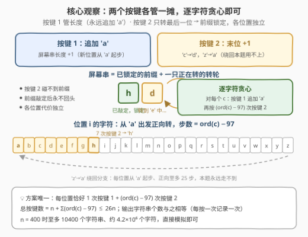
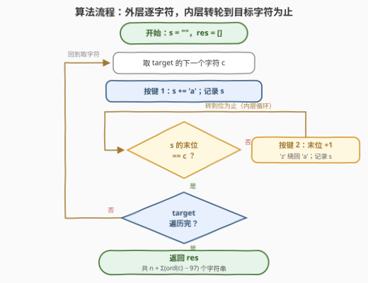
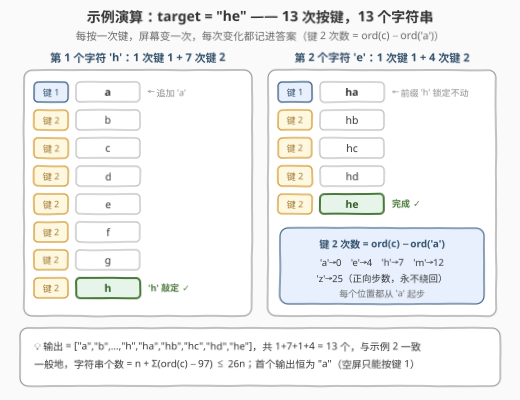

# 出现在屏幕上的字符串序列

- **题目名称**：出现在屏幕上的字符串序列
- **链接**：[3324. 出现在屏幕上的字符串序列](https://leetcode.cn/problems/find-the-sequence-of-strings-appeared-on-the-screen/)
- **难度**：中等
- **标签**：字符串、模拟、贪心
- **关联**：3304 / 3307 同属「Alice 特殊键盘」宇宙（按键只做「追加 / 进位」两件事），本题是其中最直接的「正向全模拟」款

## 1. 题目概述

Alice 要用一块**只有两个按键**的特殊键盘在电脑上输入字符串 `target`：

- **按键 1**：在屏幕上的字符串末尾追加字符 `'a'`（屏幕为空时得到 `"a"`）；
- **按键 2**：把屏幕上字符串的**最后一个**字符改成英文字母表中的**下一个**字符，例如 `'c'` 变为 `'d'`、`'z'` 变为 `'a'`（会绕回）。

最初屏幕是空字符串 `""`——**没有「最后一位」可改，所以第一次只能按按键 1**。

在**按键次数最少**的前提下，按字符串出现顺序，返回 Alice 输入 `target` 过程中屏幕上**出现过的所有字符串**。

**示例 1**：

```text
输入：target = "abc"
输出：["a","aa","ab","aba","abb","abc"]
解释：按键 1 → "a"；按键 1 → "aa"；按键 2 → "ab"；
     按键 1 → "aba"；按键 2 → "abb"；按键 2 → "abc"。
```

**示例 2**：

```text
输入：target = "he"
输出：["a","b","c","d","e","f","g","h","ha","hb","hc","hd","he"]
```

**约束条件**：

- $1 \le \text{target.length} \le 400$
- `target` 仅由小写英文字母组成

> 💡 **读题关键**：① 答案要的是「屏幕快照序列」——**每按一次键**就把当前屏幕记下来；②「按键次数最少」听起来像最优化问题，其实最优方案是**唯一**的（2.2 给出证明），不存在「选哪条路」的问题；③ `'z' → 'a'` 的绕回分支看着唬人，实际**一次也不会触发**。

---

## 2. 解题思路

### 2.1 暴力思路：BFS 最短路

把「每个可能的屏幕状态」看作节点、两种按键各看作一条单位边，从空串出发做 BFS，第一次到达 `target` 时的路径就是最少按键序列，沿途记录快照即为答案。正确性没有问题，但状态空间随按键次数指数膨胀（每步两种后继、串长不断增长），$n = 400$ 时是天文数字，完全不可行。

> ⚠️ 这个方向本身就值得反思：**会搜索，先问有没有选择**。本题两个按键的分工决定了整个过程完全确定，根本没有分支需要搜索——直接分析「每一步该按什么」即可。

### 2.2 核心观察：两个按键各管一摊，逐字符贪心



三条观察环环相扣：

**观察一：按键 1 只会追加 `'a'`。** 位置 $i$ 上无论要写什么字符，都只能「先按一次按键 1 得到 `'a'`，再用按键 2 一步步转上去」——不存在第二种产生方式。

**观察二：按键 2 只作用于最后一位。** 一旦位置 $i$ 敲定、按键 1 把位置 $i+1$ 的 `'a'` 追加进来，位置 $i$ 就**永远不会再被修改**。前缀逐位锁定，各位置的代价**互相独立**——问题天然可以逐字符处理。

**观察三：绕回分支永远用不上。** 每个位置都从 `'a'` 起步，正向转到任意目标字符 $c$ 至多 $\operatorname{ord}(c) - 97 \le 25$ 步，中途不会越过 `'z'`。题面里「`'z'` 变为 `'a'`」只是按键 2 的语义补全，与最优解无关。

于是算法可以**照抄贪心**：对 `target` 的每个字符 $c$——按一次按键 1（追加 `'a'`，记录快照），再按 $\operatorname{ord}(c) - 97$ 次按键 2（每按一次记录一次快照），直到末位等于 $c$。

**最少性与唯一性证明**（面试加分项）。对**任意**合法输入过程：

- 长度只能靠按键 1 增加，终长为 $n$ ⇒ 按键 1 **恰好** $n$ 次，每个位置各一次；
- 位置 $i$ 的 `'a'` 落地之后、位置 $i+1$ 追加之前，其间按下的按键 2 全部作用在位置 $i$（此后再也碰不到它）⇒ 位置 $i$ 消耗的按键 2 次数 $k_i$ 必须满足 $\text{'a'} + k_i \equiv c_i \pmod{26}$，最小取 $k_i = \operatorname{ord}(c_i) - 97$；
- 各 $k_i$ 独立达到下界 ⇒ 总按键数 $n + \sum_i \big(\operatorname{ord}(c_i) - 97\big)$ 是全局下界，而贪心恰好取到。

进一步，达到下界的方案**唯一**：$k_i$ 次按键 2 必须全部塞进「追加 $i$ 之后、追加 $i+1$ 之前」这个唯一窗口，窗口内动作又全是「+1」，没有任何排列自由度。所以最少按键方案只有一种，题目要返回的序列也随之唯一。

**输出规模**（打消超时疑虑）：字符串个数 $= n + \sum_i (\operatorname{ord}(c_i) - 97) \le 26n \le 10400$；总字符数 $\le 26n \cdot n \approx 4.2 \times 10^6$（$n = 400$）。直接模拟毫无压力。

### 2.3 算法流程图



外层 `for` 逐字符，内层 `while` 把末位转到位为止；**每次按键后立即**把当前串快照进答案——「先按键、后记录」的顺序别写反。

### 2.4 示例演算



以 `target = "he"` 完整走一遍：敲 `'h'` 花 $1 + 7 = 8$ 次按键，敲 `'e'` 花 $1 + 4 = 5$ 次，共 **13 次按键 → 13 个字符串**，与示例 2 完全一致。注意两个细节：第一个输出**恒为 `"a"`**（空屏只能按按键 1）；进入第二个字符后，前缀 `"h"` 从此纹丝不动。

---

## 3. 参考代码

### C++

```cpp
class Solution {
  public:
    // 写法一：while 转轮模拟（与题面动作一一对应）
    vector<string> stringSequence(string target) {
        vector<string> res;
        string s;
        for (char c : target) {
            s += 'a';                       // 按键 1：追加 'a'
            res.push_back(s);
            while (s.back() != c) {         // 按键 2：末位转到 c 为止
                s.back()++;                 // 不会越过 'z'（见 2.2 观察三）
                res.push_back(s);
            }
        }
        return res;
    }
};

// 写法二：区间生成——位置 i 的快照恰是 前缀+'a', 前缀+'b', …, 前缀+c
vector<string> stringSequence(string target) {
    vector<string> res;
    string s;
    for (char c : target) {
        s += 'a';
        res.push_back(s);
        for (char x = 'a' + 1; x <= c; ++x) {  // c == 'a' 时一次都不转
            s.back() = x;
            res.push_back(s);
        }
    }
    return res;
}
```

### Python

```python
class Solution:
    def stringSequence(self, target: str) -> List[str]:
        res, s = [], []
        for c in target:
            s.append('a')                    # 按键 1
            res.append(''.join(s))
            while s[-1] != c:                # 按键 2：转轮到 c
                s[-1] = chr(ord(s[-1]) + 1)  # 循环必在 'z' 前停下
                res.append(''.join(s))
        return res


class Solution:
    def stringSequence(self, target: str) -> List[str]:
        # 区间生成：每个 c 产生 前缀+'a' … 前缀+c 共 ord(c) - 96 个快照
        res, pre = [], ''
        for c in target:
            res += [pre + chr(x) for x in range(97, ord(c) + 1)]
            pre += c
        return res
```

> 💡 **实现细节**：① 用 list / string 维护当前串、只改末位，每次快照 $O(\text{len})$，总时间 = 输出总字符数；② `s.back()++` / `chr(ord(s[-1]) + 1)` **不取模也安全**：内层循环在末位等于 $c \le \text{'z'}$ 时停下，+1 永远不会越过 `'z'`；③ 若写成 `(x - 'a' + 1) % 26 + 'a'` 的防御版当然也能过，但会掩盖「绕回不触发」这一关键观察——面试里前者是加分项。

---

## 4. 复杂度分析

| 维度 | 复杂度 | 说明 |
|------|--------|------|
| 时间 | $O(26 n^2)$ | 输出 $\le 26n$ 个字符串、每个长 $\le n$；每次按键做一次 $O(n)$ 快照，总时间 = 输出总字符数（$n = 400$ 时约 $4.2 \times 10^6$） |
| 空间 | $O(26 n^2)$ | 答案本身的大小；若不计输出，辅助空间仅 $O(n)$ |
| 按键次数 | $n + \sum_i (\operatorname{ord}(c_i) - 97)$ | 每位置 1 次按键 1 + 正向转轮步数，既是下界也是贪心达到的值 |

实测：`"abc"` → 6 个字符串、`"he"` → 13 个，均与官方示例一致；按键次数公式 $n + \sum(\operatorname{ord}(c_i) - 97)$ 与模拟结果逐例吻合。

---

## 5. 扩展：'z'→'a' 绕回什么时候才轮得到出场？

本题里绕回分支纯属「语义摆设」。想让它真正参与最优化，得先改掉「每个位置从 `'a'` 起步」这个前提，比如：

1. **按键 1 追加的固定字符改成 `'m'`**：要到 `'a'` 就得正向 $(0 - 12) \bmod 26 = 14$ 步，途中越过 `'z'` 绕回——绕回第一次「有用」；
2. **按键 2 改成「回退一位」（−1）**：从 `'a'` 到 `'z'` 需要倒着绕一整圈。

另一个常被追问的点：**不模拟能否直接算输出规模？** 能——字符串个数 $= n + \sum_i (\operatorname{ord}(c_i) - 97)$，与按键次数相等；再配合「首个输出恒为 `"a"`」「最后一个恰为 `target` 本身」两条不变量，可以 $O(n)$ 自检答案的外壳。

最后把宇宙观收拢：3304 / 3307 里那块键盘的按键做的是「整体复制 / 整体 +1」，本题的按键做的是「追加 `'a'` / 末位 +1」——同一族「按键语义极简、问你能推出什么」的题，模拟与数学两手都要过硬。

---

## 6. 面试要点

1. **为什么不需要 BFS / DP？最优方案为什么唯一？**

   按键 1 恰 $n$ 次（长度只增不改）；位置 $i$ 的按键 2 必须全部落在「追加 $i$ 之后、追加 $i+1$ 之前」的窗口内（此后碰不到该位置），次数下界为 $\operatorname{ord}(c_i) - 97$；窗口内动作全是 +1，无排列自由度 ⇒ 唯一最短方案就是贪心。

2. **`'z' → 'a'` 绕回什么时候触发？**

   本题永不触发：每个位置都从 `'a'` 起步，正向至多 25 步即达任意字母。它只是按键 2 语义的完备定义，不是需要权衡的分支。

3. **输出规模多大？会不会超时？**

   字符串个数 $\le 26n = 10400$，总字符数 $\le 26n^2 \approx 4.2 \times 10^6$；用可变串维护、每次 $O(\text{len})$ 快照即可，代价线性于输出规模。

4. **`target[i] == 'a'` 时流程是什么样？**

   按一次按键 1 直接到位，内层转轮零次。如 `"aaa"` → `["a","aa","aaa"]`，输出个数 $= n + 0$。

5. **若按键 2 能改「任意一位」而非最后一位，会怎样？**

   最少总次数不变（每位置仍需 $\operatorname{ord}(c) - 97$ 次 +1），但各位置的敲定**顺序**自由，「屏幕快照序列」不再唯一——题目将失去良定义，需追加「字典序最小快照序列」之类的约束才可解。

---

## 7. 同类练习题

- [3304. 找出第 K 个字符 I](https://leetcode.cn/problems/find-the-k-th-character-in-string-game-i/)（[站内题解](../3301-3400/3304_找出第K个字符I.md)）：同一块「Alice 特殊键盘」宇宙，按键做整体复制 / +1，问第 $k$ 个字符
- [3307. 找出第 K 个字符 II](https://leetcode.cn/problems/find-the-k-th-character-in-string-game-ii/)（[站内题解](../3301-3400/3307_找出第K个字符II.md)）：3304 的操作数组升级版，逆向下落定位，$k$ 高达 $10^{14}$
- [38. 外观数列](https://leetcode.cn/problems/count-and-say/)（[站内题解](../0001-0100/38_外观数列.md)）：同为「按规则逐步生成字符串序列」的模拟，只是规则换成「读上一次」
- [415. 字符串相加](https://leetcode.cn/problems/add-strings/)（[站内题解](../0401-0500/415_字符串相加.md)）：逐位 +1 进位——本题的按键 2 就是单格「转轮」，415 是它的进位链版
- [989. 数组形式的整数加法](https://leetcode.cn/problems/add-to-array-form-of-integer/)（[站内题解](../0901-1000/989_数组形式的整数加法.md)）：低位加法逐位进位模拟，与按键 2 的「末位 +1」同构
