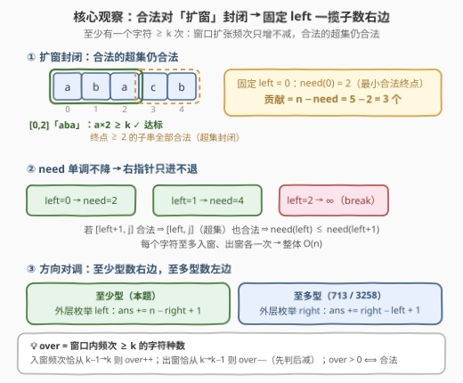
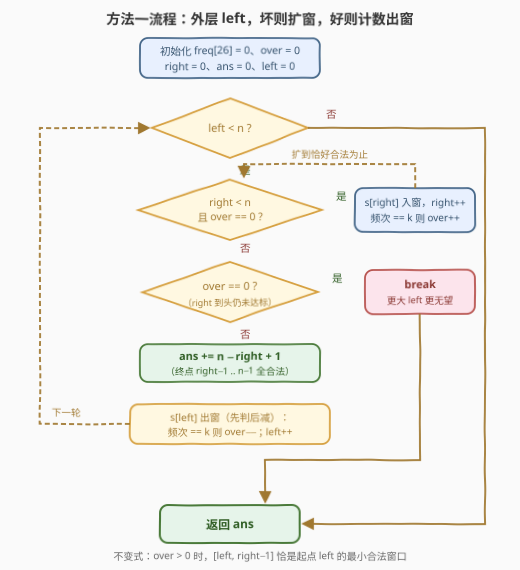
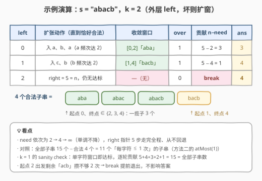
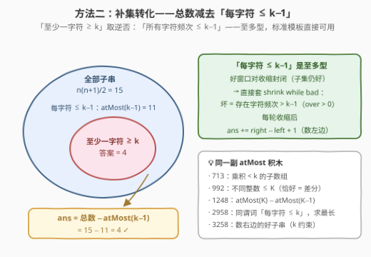

# LeetCode 字符至少出现 K 次的子字符串 I 题解

## 1. 题目概述

- **标题 / 题号**：字符至少出现 K 次的子字符串 I（#3325，medium）
- **链接**：https://leetcode.cn/problems/count-substrings-with-k-frequency-characters-i/
- **难度**：中等
- **标签**：哈希表、字符串、滑动窗口

**题意**：给你一个字符串 $s$ 和一个整数 $k$，在 $s$ 的所有子字符串中，请你统计并返回**至少有一个**字符**至少出现** $k$ 次的子字符串总数。

**子字符串**是字符串中的一个连续、**非空**的字符序列。

**示例 1**：

```text
输入：s = "abacb", k = 2
输出：4
解释：符合条件的子字符串如下：
     "aba"（字符 'a' 出现 2 次）
     "abac"（字符 'a' 出现 2 次）
     "abacb"（字符 'a' 出现 2 次）
     "bacb"（字符 'b' 出现 2 次）
```

**示例 2**：

```text
输入：s = "abcde", k = 1
输出：15
解释：所有子字符串都有效，因为每个字符至少出现一次。
```

**约束**：

- $1 \le s.length \le 3000$
- $1 \le k \le s.length$
- $s$ 仅由小写英文字母组成

> 💡 读题关键：① 条件是「**存在**一个字符频次 $\ge k$」，不是「恰好 $k$ 次」——「至少型」条件对窗口**扩张**单调，这决定了滑窗的计数方向（见 2.2）；② $n \le 3000$ 意味着 $O(n^2)$ 暴力可过，但姊妹题 [3329. II 版](https://leetcode.cn/problems/count-substrings-with-k-frequency-characters-ii/)（Hard）把数据范围放大，$O(n)$ 滑窗才是正解；③ 答案上界 $\frac{3000 \times 3001}{2} \approx 4.5 \times 10^6$，`int` 足够，II 版需换 64 位整数。

## 2. 解题思路

### 2.1 暴力思路

枚举每个起点 $left$，向右延伸终点并**增量**维护 26 个频次：一旦窗口内出现频次达到 $k$ 的字符，则由封闭性（见 2.2），终点继续右移的所有子串必然合法，直接累加 $n - right$ 并跳出内层循环；若延伸到 $n - 1$ 始终无字符达标，该起点贡献为 $0$。每步用「达标字符种数」判断可做到 $O(1)$，总体 $O(n^2)$——$n = 3000$ 约 $4.5 \times 10^6$ 次操作，可以通过。

问题在于**扫描的浪费**：$need(left)$（起点 $left$ 的最小合法终点）随 $left$ 单调不降，但暴力为每个起点都从 $left$ 重新向右扫，同一段右部被反复扫描——全相同字符、$k = 2$ 时总步数 $\Theta(n^2)$，II 版数据范围下直接爆炸。

### 2.2 核心观察：合法对「扩窗」封闭 → 固定左端点一揽子计数



**第一步：单调性方向**。窗口扩大只会让字符频次**不减**，因此：

- 若 $[i,\ j]$ 合法（某字符频次 $\ge k$），则它的任何**超集** $[i',\ j'] \supseteq [i,\ j]$ 仍合法——**合法对扩窗封闭**；
- 等价地，坏窗口（所有字符频次都 $< k$）的任何**子集**仍坏——**坏对缩窗封闭**。

**第二步：固定 $left$，合法终点是一段后缀**。由扩窗封闭性，对每个起点 $i$ 存在阈值 $need(i)$：终点 $j \ge need(i)$ 的子串 $[i,\ j]$ **全部**合法、$j < need(i)$ 的**全部**不合法（$need(i) = \infty$ 表示该起点无合法子串）。于是：

$$ans = \sum_{i=0}^{n-1} \bigl(n - need(i)\bigr)$$

**第三步：$need$ 单调不降 → 双指针**。若 $[i+1,\ j]$ 合法，则其超集 $[i,\ j]$ 也合法，故 $need(i) \le need(i+1)$——**右指针整体只进不退**，每个字符至多入窗、出窗各一次，总复杂度 $O(n)$。

> 💡 **方向对调**：经典计数滑窗（[713. 乘积小于 K 的子数组](https://leetcode.cn/problems/subarray-product-less-than-k/)、[3258. 统计满足 K 约束的子字符串数量 I](../3201-3300/3258_统计满足K约束的子字符串数量I.md)）处理的是「**至多型**」条件——好窗口对**收缩**封闭，于是外层枚举 `right`、内层 `shrink while bad`、`ans += right − left + 1` **数左边**；本题是「**至少型**」——好窗口对**扩张**封闭，必须**外层枚举 `left`**、内层 `while 坏扩窗`、`ans += n − right + 1` **数右边**。照抄模板把收缩循环搬过来会数错集合（收缩到「恰好合法」时，左边更长的窗口同样合法，而 `right − left + 1` 数的是更短的子串）。另有一条等价路线：外层 `right` + `while 好收缩` + `ans += left`（[1358. 包含所有三种字符的子字符串数目](https://leetcode.cn/problems/number-of-substrings-containing-all-three-characters/) 的姿势），或干脆取补集转化回「至多型」（见 3.2 方法二）。

**用「达标字符种数」代替 max**：记 `over` 为窗口内频次 $\ge k$ 的字符**种数**。入窗时某字符频次恰好从 $k-1$ 变 $k$ 则 `over++`；出窗时恰好从 $k$ 变 $k-1$ 则 `over--`。于是 `over > 0` $\iff$ 窗口合法，判断 $O(1)$，无需每步扫 26 个频次找最大值。

### 2.3 算法流程图



代码采用**左闭右开**窗口 $[left,\ right)$：`right` 是「下一个待入窗位置」。当 `over > 0` 时，窗口 $[left,\ right-1]$ 恰是起点 $left$ 的**最小**合法窗口（不变式：窗口恰被最后入窗的字符推到达标），贡献 $n - (right - 1) = n - right + 1$。

1. 初始化 `freq[26] = 0`、`over = 0`、`right = 0`、`ans = 0`
2. 外层 `left` 从 $0$ 到 $n-1$：
   - **当** `right < n` 且 `over == 0`：`s[right]` 入窗（频次恰达 $k$ 则 `over++`），`right++`
   - 若 `over == 0`：**break**（`right` 已到头仍无达标字符；更大的 `left` 窗口只会更小，更无望）
   - `ans += n - right + 1`（终点可取 $right-1$ 到 $n-1$）
   - `s[left]` 出窗（频次恰从 $k$ 降则 `over--`）
3. 返回 `ans`

### 2.4 示例演算



以 `s = "abacb"`、$k = 2$ 走一遍：

| $left$ | 扩张动作（直到恰好合法） | 收敛窗口 | over | 贡献 $n - need$ | $ans$ |
|--------|--------------------------|----------|------|-----------------|-------|
| 0 | 依次入 `a, b, a` → `a` 频次达 2 | $[0,2]$「aba」 | 1 | $5 - 2 = 3$ | 3 |
| 1 | 依次入 `c, b` → `b` 频次达 2 | $[1,4]$「bacb」 | 1 | $5 - 4 = 1$ | 4 |
| 2 | `right = 5 = n` 且 `over = 0` | — | 0 | break | 4 |

结果 $4$ ✓。对照合法子串清单：「aba」「abac」「abacb」正是起点 0、终点 $\ge 2$ 的**全部**子串（3 个），「bacb」是起点 1、终点 $\ge 4$ 的全部子串（1 个）；起点 2 出发剩余字符「acb」中任何字符都攒不够 2 次，`break` 提前退出。另验证示例 2：$k = 1$ 时单字符窗口即达标，逐轮贡献 $5, 4, 3, 2, 1$，合计 $15$ ✓。

## 3. 参考代码

### 方法一：固定左端点 + 单调右端点（主推，与官方提示一致）

#### C++

```cpp
class Solution {
  public:
    int numberOfSubstrings(string s, int k) {
        int n = s.size();
        vector<int> freq(26, 0);
        int over = 0, right = 0;              // over: 频次 >= k 的字符种数
        long long ans = 0;
        for (int left = 0; left < n; ++left) {
            while (right < n && over == 0)    // 坏则扩窗，直到恰好合法
                if (++freq[s[right++] - 'a'] == k) ++over;
            if (over == 0) break;             // 到头仍无达标: 更大的 left 无望
            ans += n - right + 1;             // 终点可取 right-1 .. n-1
            if (freq[s[left] - 'a'] == k) --over;  // 左端出窗
            --freq[s[left] - 'a'];
        }
        return ans;
    }
};
```

#### Python

```python
class Solution:
    def numberOfSubstrings(self, s: str, k: int) -> int:
        n = len(s)
        freq = [0] * 26
        over = right = 0          # over: 频次 >= k 的字符种数
        ans = 0
        for left in range(n):
            while right < n and over == 0:    # 坏则扩窗，直到恰好合法
                c = ord(s[right]) - 97
                right += 1
                freq[c] += 1
                if freq[c] == k:
                    over += 1
            if over == 0:                     # 到头仍无达标: 更大的 left 无望
                break
            ans += n - right + 1              # 终点可取 right-1 .. n-1
            c = ord(s[left]) - 97
            if freq[c] == k:
                over -= 1                     # 左端出窗
            freq[c] -= 1
        return ans
```

> ⚠️ 出窗时必须**先判断再减**：`freq[c] == k` 成立才 `over--`，然后才 `freq[c]--`；顺序写反会把「频次从 $k$ 降到 $k-1$」漏判，`over` 失真。

### 方法二：补集转化——总数减去「每字符至多 k−1 次」



把「至少一个字符 $\ge k$ 次」取逆否：「**所有**字符频次 $\le k-1$」。这是**至多型**条件——好窗口对**收缩**封闭，标准 `shrink while bad` 模板直接可用，按右端点累加 `right − left + 1`。于是：

$$ans = \frac{n(n+1)}{2} - \text{atMost}(k-1)$$

#### C++

```cpp
class Solution {
  public:
    int numberOfSubstrings(string s, int k) {
        int n = s.size();
        long long total = 1LL * n * (n + 1) / 2;
        return total - atMost(s, k - 1);
    }
  private:
    long long atMost(const string& s, int t) {   // 每字符频次 <= t 的子串数
        if (t < 0) return 0;
        int n = s.size(), left = 0, over = 0;    // over: 频次 > t 的字符种数
        vector<int> freq(26, 0);
        long long res = 0;
        for (int right = 0; right < n; ++right) {
            if (++freq[s[right] - 'a'] == t + 1) ++over;
            while (over > 0) {                   // 坏: 存在字符频次 > t
                if (freq[s[left] - 'a'] == t + 1) --over;
                --freq[s[left] - 'a'];
                ++left;
            }
            res += right - left + 1;             // 以 right 结尾的合法子串数
        }
        return res;
    }
};
```

#### Python

```python
class Solution:
    def numberOfSubstrings(self, s: str, k: int) -> int:
        def at_most(t: int) -> int:              # 每字符频次 <= t 的子串数
            if t < 0:
                return 0
            freq = [0] * 26
            left = over = 0                      # over: 频次 > t 的字符种数
            res = 0
            for right, ch in enumerate(s):
                c = ord(ch) - 97
                freq[c] += 1
                if freq[c] == t + 1:
                    over += 1
                while over > 0:                  # 坏: 存在字符频次 > t
                    c2 = ord(s[left]) - 97
                    if freq[c2] == t + 1:
                        over -= 1
                    freq[c2] -= 1
                    left += 1
                res += right - left + 1          # 以 right 结尾的合法子串数
            return res

        n = len(s)
        return n * (n + 1) // 2 - at_most(k - 1)
```

> 💡 两个方法的自检锚点：$k = 1$ 时任何非空子串都合法，方法一逐轮贡献 $n, n-1, \dots, 1$；方法二 $\text{atMost}(0) = 0$（非空子串不可能所有字符频次为 0），两法都得 $\frac{n(n+1)}{2}$，与示例 2 吻合。$s$ 全为同一字符、$k = 2$ 时合法子串是所有长度 $\ge 2$ 的子串，共 $\frac{(n-1)n}{2}$ 个。

## 4. 复杂度分析

| 维度 | 复杂度 | 说明 |
|------|--------|------|
| 时间复杂度 | $O(n)$ | 方法一：`right` 只进不退、`left` 逐轮右移，每个字符至多入窗出窗各一次（摊还分析）；方法二：标准计数滑窗，同理 $O(n)$ |
| 空间复杂度 | $O(26) = O(1)$ | 频次数组大小固定为 26（小写字母），与 $n$ 无关 |
| 暴力对照 | $O(n^2)$ | 本题 $n \le 3000$ 可过；II 版 3329 数据范围放大后不可行 |

实测：两组官方示例分别得 $4 / 15$；另与 $O(n^2)$ 暴力对拍随机数据（$n \le 12$、$k \in [1,\ n]$ 随机、字母表 $\{a,b,c,d\}$）30000 组，方法一、方法二及「外层 right + shrink while valid」第三种等价姿势全部一致。

## 5. 扩展：II 版（3329）与「至少型」计数家族

**[3329. 字符至少出现 K 次的子字符串 II](https://leetcode.cn/problems/count-substrings-with-k-frequency-characters-ii/)**（Hard，付费题）是本题的强化版，官方提示与本题思路完全一致（固定一端、滑窗或二分找另一端），核心差别只在数据范围：规模放大后 $O(n^2)$ 暴力彻底出局，$\frac{n(n+1)}{2}$ 量级的答案也必须换 `long long`（Python 天然大整数无虞）。

「至少型」正向计数的通用骨架是：**合法性对扩窗封闭 ⟹ 固定一端，另一端存在单调阈值，一揽子计数**。按「固定哪端」分两支：

1. **固定左端点数右边**（本文方法一）：$ans \mathrel{+}= n - need(left)$，`right` 只进不退；
2. **固定右端点数左边**：合法性同样使固定 $right$ 的合法左端点构成前缀 $[0,\ R(right)]$，且 $R$ 单调不降——`while 合法: 收缩` 结束后 $ans \mathrel{+}= left$。[1358](https://leetcode.cn/problems/number-of-substrings-containing-all-three-characters/)（每种字符至少 1 次）就是这支的代表。

两支等价，选哪支看题给的单调方向与个人模板习惯；若嫌「至少型」的收缩方向别扭，永远可以走方法二的补集，转化回最熟悉的 `shrink while bad` + `right − left + 1`。

## 6. 面试要点

1. **为什么不能照抄「外层 right + shrink while bad + `ans += right − left + 1`」的标准模板？**

   - 那套模板依赖「至多型」条件的好窗口对**收缩**封闭（子集仍好）。本题「至少型」恰好相反：好窗口的**超集**才仍好。照抄模板收缩到「恰好合法」时，`right − left + 1` 数的是以 `right` 结尾、起点 $\ge left$ 的**更短**子串——对至少型条件恰恰**更不**合法，计数集合整个数错。正确做法是方向对调（外层 left 数右边 / 外层 right 但 while 合法才收缩并数左边），或取补集转化回至多型。

2. **`over` 计数器为什么能把合法性判断做成 $O(1)$？入窗/出窗的更新规则是什么？**

   - `over` 维护「频次 $\ge k$ 的字符种数」。入窗字符频次恰从 $k-1 \to k$ 时 `over++`；出窗字符频次恰从 $k \to k-1$ 时 `over--`；其余频次变化不触碰 `over`。`over > 0` $\iff$ 窗口合法。避免每步扫 26 个频次取 max。易错点：出窗必须**先判后减**。

3. **`ans += n − right + 1` 为什么不重不漏？`break` 为什么安全？**

   - 不重：子串按**起点**归类，各类互斥；不漏：循环不变式保证 $right - 1$ 是当前 $left$ 的**最小**合法终点——扩张循环恰在最后一个入窗字符把 `over` 推到 1 时停下，此前 $[left,\ right-2]$ 必不合法，且更短的是其子集、更不合法。`break`：`right` 到头仍 `over == 0` 说明 $[left,\ n-1]$ 无达标字符，更大的 `left` 对应窗口是其子集，频次只会更低，永远无望。

4. **两种方法怎么选？**

   - 都是 $O(n)$ / $O(1)$。方法一与官方提示一致、正向直观，且顺手产出 $need$ 数组（若追问区间查询可留作后手，参见 [3258 的扩展](../3201-3300/3258_统计满足K约束的子字符串数量I.md)）；方法二完全复用至多型模板，与 [1248](../1201-1300/1248_统计优美子数组.md)、[992](https://leetcode.cn/problems/subarrays-with-k-different-integers/) 一脉相承，迁移成本最低。面试先说清单调性方向，再任选其一实现即可。

5. **$k = 1$ 时两种方法分别发生什么？**

   - 任何非空子串都合法，答案 $= \frac{n(n+1)}{2}$。方法一：单字符窗口即达标，逐轮贡献 $n, n-1, \dots, 1$；方法二：$\text{atMost}(0) = 0$（非空子串不可能所有字符频次 $\le 0$），总数减零。可用作快速 sanity check。

## 同类练习题

| # | 题目 | 与本题的关联 |
|---|------|-------------|
| 3329 | [字符至少出现 K 次的子字符串 II](https://leetcode.cn/problems/count-substrings-with-k-frequency-characters-ii/)（付费） | 同题强化版（Hard），官方提示同样指向滑窗；数据范围放大，答案需 64 位整数 |
| 2958 | [最多 K 个重复元素的最长子数组](https://leetcode.cn/problems/length-of-longest-subarray-with-at-most-k-frequency/) | 谓词与方法二补集完全相同（每字符频次 $\le k$），但求「最长」而非「计数」——同一副骨架换产出方向 |
| 1358 | [包含所有三种字符的子字符串数目](https://leetcode.cn/problems/number-of-substrings-containing-all-three-characters/) | 同为「至少型」正向计数（每种字符 $\ge 1$ 次），固定右端点数左边的代表，与本文方法一互为镜像 |
| 3258 | [统计满足 K 约束的子字符串数量 I](https://leetcode.cn/problems/count-substrings-that-satisfy-k-constraint-i/)（[站内题解](../3201-3300/3258_统计满足K约束的子字符串数量I.md)） | `shrink while bad` + 按右端点计数的至多型模板，与方法二同骨架 |
| 1248 | [统计「优美子数组」](https://leetcode.cn/problems/count-number-of-nice-subarrays/)（[站内题解](../1201-1300/1248_统计优美子数组.md)） | 恰好型用 $\text{atMost}(K) - \text{atMost}(K-1)$ 差分拼装，方法二的 `atMost` 正是那套积木 |
