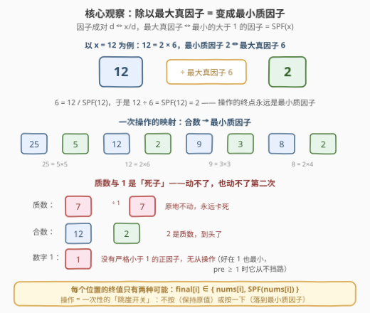
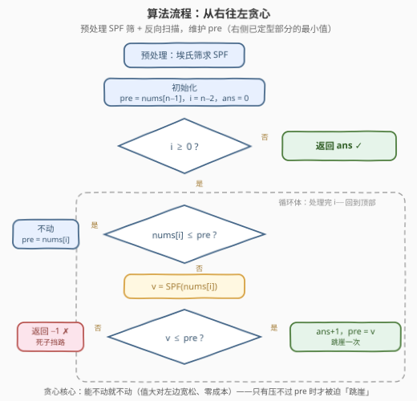
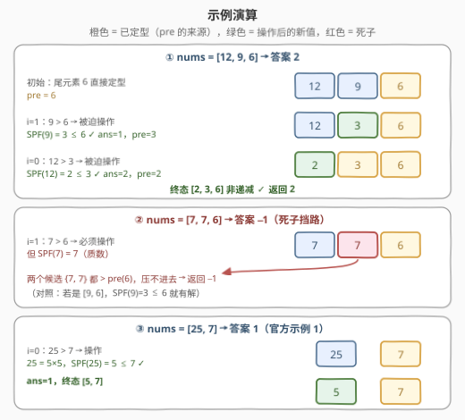

# LeetCode 使数组非递减的最少除法操作次数 题解

## 1. 题目概述

- **标题 / 题号**：使数组非递减的最少除法操作次数（#3326，medium）
- **链接**：https://leetcode.cn/problems/minimum-division-operations-to-make-array-non-decreasing/
- **难度**：中等
- **标签**：贪心、数论、数组、埃氏筛、最小质因子

**题意**：给你一个整数数组 `nums`。

一个正整数 $x$ 的任何一个**严格小于** $x$ 的**正**因子都被称为 $x$ 的**真因子**。比方说 2 是 4 的真因子，但 6 不是 6 的真因子。

你可以对 `nums` 的任何数字做任意次**操作**，一次**操作**中，你可以选择 `nums` 中的任意一个元素，将它除以它的**最大真因子**。

你的目标是使数组变为**非递减**的（即 $\text{nums}[0] \le \text{nums}[1] \le \cdots \le \text{nums}[n-1]$），请你返回达成这一目标需要的**最少操作**次数。如果**无法**将数组变成非递减的，请你返回 `-1`。

**示例 1**：

```text
输入：nums = [25,7]
输出：1
解释：通过一次操作，25 除以 5，nums 变为 [5,7]。
```

**示例 2**：

```text
输入：nums = [7,7,6]
输出：-1
```

**示例 3**：

```text
输入：nums = [1,1,1,1]
输出：0
```

**约束**：

- $1 \le \text{nums.length} \le 10^5$
- $1 \le \text{nums}[i] \le 10^6$

> 💡 **读题关键**：① 操作的效果是**确定的**——「除以最大真因子」不是让你任选因子，除谁、除多少都被定死，这题的杠杆全在「何时出手」；② 质数与 1 是**死子**：质数的最大真因子是 1（除以 1 原地不动），1 根本没有真因子，它们一旦挡路就是 `-1`；③ 值域 $10^6$ + 数论标签，明示**预处理最小质因子（SPF）筛**。

## 2. 解题思路

### 2.1 直觉思路：从左往右模拟为什么走不通

拿到题最容易想到的是**从左往右扫**，遇到 $\text{nums}[i] > \text{nums}[i+1]$ 的逆序对时「把大的压下去」。但立刻撞上两个问题：

- **压谁不确定**：逆序对 $(i, i+1)$ 中，把 $\text{nums}[i]$ 压小可能影响更左边的合法位置；升 $\text{nums}[i+1]$ 又不可能——操作只能让数**变小**，右边是升不动的；
- **压下去的幅度不可控**：一次操作直接把数打到它的最小质因子，可能是「跳崖式」下降（如 $100 \to 2$），压过头同样会破坏左侧已排好的关系。

退一步想暴力：每个位置如果最终值只有少数几种可能，就可以枚举所有组合、过滤合法、取操作数最少的——$O(2^n)$，$n \le 10^5$ 不可行。但这个思路指对了方向：**先搞清楚「一个数到底能变成什么」**，问题就坍缩成一个离散决策问题。

### 2.2 核心观察：除以最大真因子 = 变成最小质因子

设 $p$ 是 $x$ 的**最小质因子**（Smallest Prime Factor, SPF）。因子总是成对出现：$d$ 与 $x/d$。真因子 $d < x$ 意味着 $x/d > 1$，所以**最大的真因子**对应**最小的大于 1 的因子**——恰好就是 $p$：

$$\text{最大真因子} = \frac{x}{\mathrm{SPF}(x)}, \qquad x \div \frac{x}{\mathrm{SPF}(x)} = \mathrm{SPF}(x)$$

一句话：**一次操作把 $x$ 变成 $\mathrm{SPF}(x)$**。验算：$12 = 2 \times 6$，最大真因子 6，$12 \div 6 = 2 = \mathrm{SPF}(12)$；$25 = 5 \times 5$，$25 \div 5 = 5$；$30 = 2 \times 15$，$30 \div 15 = 2$。✓



由此得到本题的**命门**——每个数至多一次有效操作：

- **合数** $x$：操作一次变成质数 $\mathrm{SPF}(x)$；质数再操作是除以 1，原地不动。想继续往下压？没有下文了；
- **质数** $p$：最大真因子是 1，$p \div 1 = p$，**永远动不了**；
- **1**：没有严格小于 1 的正因子，**无从操作**。

所以每个位置的最终值只有**两种可能**：

$$\text{final}[i] \in \{\, \text{nums}[i],\; \mathrm{SPF}(\text{nums}[i]) \,\}$$

（质数与 1 的两个选项重合为它本身。）操作只减不增、一步到底、不可叠加——这是一次性的「跳崖开关」。

### 2.3 从右往左贪心：能不动就不动

明确了「二选一」结构，方向就清楚了。操作只能让数变小，右侧的值是**天花板**：右边先定型，左边才有确定的约束可依。于是**从右往左**扫描，维护 `pre` = 右侧已定型部分的最小值（由于构造保证非递减，`pre` 恰好就是紧邻右侧那个位置的最终值）：

- 若 $\text{nums}[i] \le pre$：**不动**。保持原值（两个选项中更大的那个）对左侧的约束最宽松，且不花操作次数；
- 若 $\text{nums}[i] > pre$：不动必然违反非递减，**必须操作**，变成 $\mathrm{SPF}(\text{nums}[i])$。若连 $\mathrm{SPF}(\text{nums}[i]) > pre$（典型情形：$\text{nums}[i]$ 是质数，撞墙了），直接返回 `-1`。

**贪心正确性（交换论证）**：设某最优解中位置 $i$ 的最终值为 $\text{final}[i]$。从右往左归纳：位置 $i$ 在合法前提下取两个候选中的**最大值**，既不增加操作次数（取 $\text{nums}[i]$ 花费 0），又让 $\text{final}[i-1]$ 面对的约束 `pre` 尽可能大——任何其他选择只会让左边更难合法，绝不会更优。若最大候选都压不进 `pre` 之下，则该位置两个候选全数超标，**任何解都不存在**，`-1` 判定正确。



### 2.4 示例演算

用 $[12, 9, 6]$ 走一遍完整流程，再看 $[7,7,6]$ 的无解情形：



1. **[12, 9, 6]**：`pre = 6`（尾元素定型）。$9 > 6$ → 操作，$\mathrm{SPF}(9) = 3 \le 6$ ✓，`ans=1`，`pre=3`；$12 > 3$ → 操作，$\mathrm{SPF}(12) = 2 \le 3$ ✓，`ans=2`，`pre=2`。终态 $[2,3,6]$，答案 **2**；
2. **[7, 7, 6]**：`pre = 6`。$7 > 6$ → 必须操作，但 $\mathrm{SPF}(7) = 7 > 6$——质数 7 是死子，原地卡死，返回 **-1**；
3. **[25, 7]**：`pre = 7`。$25 > 7$ → 操作，$\mathrm{SPF}(25) = 5 \le 7$ ✓，答案 **1**，终态 $[5,7]$；
4. **[1,1,1,1]**：天然非递减，一个不用动，答案 **0**。

## 3. 参考代码

### C++

```cpp
class Solution {
public:
    int minOperations(vector<int>& nums) {
        const int V = 1'000'000;
        // 埃氏筛变体：spf[x] = x 的最小质因子（多测试用例间只建一次）
        static vector<int> spf(V + 1, 0);
        static bool inited = false;
        if (!inited) {
            for (int i = 2; i <= V; ++i) {
                if (spf[i] == 0) {                 // i 是质数
                    for (int j = i; j <= V; j += i)
                        if (spf[j] == 0) spf[j] = i;
                }
            }
            inited = true;
        }

        int ans = 0;
        int pre = nums.back();                     // 右侧已定型的最小值（约束）
        for (int i = (int)nums.size() - 2; i >= 0; --i) {
            if (nums[i] <= pre) {
                pre = nums[i];                     // 能不动就不动：值大对左边宽松
            } else {
                int v = spf[nums[i]];              // 唯一可能的新值：最小质因子
                if (v > pre) return -1;            // 质数/1 撞墙，无解
                ++ans;
                pre = v;
            }
        }
        return ans;
    }
};
```

> 💡 **写法要点**：
> - 筛子从小到大扫，`spf[j] == 0` 才填——保证每个合数记录的是**最小**质因子（最先碰到它的那个质数）；
> - `spf[1]` 保持 0 不影响正确性：`pre >= 1` 恒成立，`1 <= pre` 走「不动」分支，永远查不到 `spf[1]`；
> - `static` 局部缓存让 LeetCode 的多测试用例共享同一张筛表，摊销后建筛开销可忽略。

### Python

```python
class Solution:
    def minOperations(self, nums: List[int]) -> int:
        V = max(nums)                              # 只筛到实际用到的值域
        spf = list(range(V + 1))                   # spf[x] 初始为 x 本身
        for i in range(2, int(V ** 0.5) + 1):
            if spf[i] == i:                        # i 是质数（未被更小质数标记）
                for j in range(i * i, V + 1, i):
                    if spf[j] == j:
                        spf[j] = i

        ans, pre = 0, nums[-1]
        for i in range(len(nums) - 2, -1, -1):
            if nums[i] <= pre:
                pre = nums[i]                      # 不动：保持大值，约束宽松
            else:
                v = spf[nums[i]]                   # 唯一的新值：最小质因子
                if v > pre:
                    return -1                      # 死子挡路，无解
                ans += 1
                pre = v
        return ans
```

> 💡 **写法要点**：
> - `spf` 初始化为 `range(V+1)`、只从 $i^2$ 起标记且 `spf[j] == j` 才覆盖——每个合数被**最小**质因子最先命中，等价于埃氏筛的正确性条件；
> - `V = max(nums)` 而非固定 $10^6$：单用例值域小则筛得快；`nums = [1]` 时 $V = 1$，内外循环全空转，主循环也只剩尾元素，直接返回 0；
> - Python 无 C++ 的 `static` 机制，若追求极致可把筛表提升为模块级变量跨用例复用。

## 4. 复杂度分析

| 维度 | 复杂度 | 说明 |
|------|--------|------|
| **时间** | $O(V \log\log V + n)$ | 埃氏筛求 SPF：$V = 10^6$（C++ 固定值域）或 $\max(\text{nums})$（Python 按需）；反向扫描一遍 $O(n)$，$n \le 10^5$ 只占零头 |
| **空间** | $O(V)$ | SPF 数组是唯一的大头；主扫描只需 $O(1)$ 附加变量（`pre`、`ans`） |
| **对照** | 筛法预处理 ≫ 逐个分解 | 若不预筛、对每个超标的 $\text{nums}[i]$ 现场试除分解，单次 $O(\sqrt{x})$，最坏 $10^5 \times 10^3 = 10^8$；预筛把质因子信息一次性摊销到值域上 |

> ⚠️ 时间复杂度对 $V$ 的依赖是「一次付清」的：C++ `static` 版多个测试用例共享一次建筛，Python 版每个用例重建但值域自适应。两种取舍在 $n \ll V$ 或值域稀疏时各有胜负，面试中说明白权衡即可。

## 5. 扩展：方向选择与筛法变体

**从左往右到底错在哪？** 拿 $[25, 7]$ 做反例：从左往右维护「前缀最大值」`mx = 25`，走到 7 时发现 $7 < 25$，想操作 7——可 7 是质数，死子；想回头压 25，但 25 已经「定型」在前缀里了。**从左往右的本质缺陷是：操作只能变小，而逆序冲突的修复责任落在「左边的大数」身上，从左往右扫却在「右边的小数」发现问题——责任方在已扫过的区域里**。从右往左扫描恰好让「发现问题」与「承担责任」发生在同一时刻、同一位置。这是所有「单向操作 + 相邻约束」类问题的通用方向判据：**让约束的提供方先定型**（对照 [2439. 最小化数组中的最大值](https://leetcode.cn/problems/minimize-maximum-of-array/)：只能向左挪值，于是从左往右扫——方向恰好相反，道理完全一致）。

**线性筛替代埃氏筛**：若追求理论 $O(V)$，可用线性筛（每个合数只被其最小质因子标记一次）：

```cpp
vector<int> spf(V + 1, 0);
vector<int> primes;
for (int i = 2; i <= V; ++i) {
    if (spf[i] == 0) { spf[i] = i; primes.push_back(i); }
    for (int p : primes) {
        if (p > spf[i] || (long long)p * i > V) break;
        spf[p * i] = p;
    }
}
```

实践中 $V = 10^6$ 时埃氏筛已足够快（$\log\log V \approx 3$），线性筛的优势要在 $V \ge 10^8$ 或需要顺便拿到质数表时才明显。

## 6. 面试要点

1. **为什么「除以最大真因子」恰好等于「变成最小质因子」？**

   - 因子成对：$d \leftrightarrow x/d$。真因子 $d < x$ 等价于 $x/d > 1$，所以最大真因子对应最小的大于 1 的因子。大于 1 的最小因子必是质数（否则其更小因子也大于 1 且更小，矛盾），它就是 $\mathrm{SPF}(x)$。于是 $x \div (x / \mathrm{SPF}(x)) = \mathrm{SPF}(x)$。

2. **为什么每个数至多一次有效操作？操作能不能叠加？**

   - 合数操作一次后变成 $\mathrm{SPF}(x)$，是质数；质数的最大真因子是 1，再操作除以 1 原地不动；1 没有真因子。所以每个位置的最终值只有 $\{\text{nums}[i], \mathrm{SPF}(\text{nums}[i])\}$ 两选项，操作没有「分步下降」的余地——这不是连续调节，是一次性的跳崖开关。

3. **为什么必须从右往左扫？从左往右会输出什么错误答案？**

   - 反例 $[25,7]$：从左往右发现 $7 < 25$ 时想压 7，但 7 是质数动不了，误判 `-1`；正确做法是压 25 成 5，答案 1。操作只能变小，修复逆序的责任永远在**左边的大数**，从右往左才能在发现冲突的当场就地解决；从左往右会让责任方停留在已扫过的区域。

4. **什么时候返回 -1？判定条件是什么？**

   - 扫描中遇到 $\text{nums}[i] > pre$ 且 $\mathrm{SPF}(\text{nums}[i]) > pre$ 即无解：该位置两个候选值都压不进右侧约束之下（典型如质数或「最小质因子仍然太大」，如 $[9,4]$ 中 $\mathrm{SPF}(9)=3 > 4$？不，$3 \le 4$ 有解——真正卡死的是类似 $[6,4]$：$\mathrm{SPF}(6) = 2 \le 4$ 有解；$[5,4]$：$\mathrm{SPF}(5)=5 > 4$ 无解）。反过来，只要每个位置都过关，构造出的解就是可行解，返回计数即可。

5. **SPF 预处理怎么写？和普通埃氏筛的区别在哪？**

   - 区别一：标记对象从布尔「是否合数」升级为「最小质因子是谁」；区别二：已填的位置不能覆盖（`spf[j] == 0` / `spf[j] == j` 才填），保证记录的是**最先**碰到 $j$ 的（即最小的）质因子。复杂度不变仍是 $O(V \log \log V)$，理论极致是线性筛 $O(V)$。

> 💡 **一句话总结**：3326 = 「**SPF 筛 + 从右往左贪心**」——数论部分一句恒等式（除以最大真因子 = 变最小质因子）把操作坍缩成二选一开关；贪心部分一个方向判据（操作只能变小 → 右侧先定型 → 能不动就不动）。识别出「质数是死子」与「责任在左」这两点，题目就从模拟题变成了五分钟的白板题。

## 同类练习题

| # | 题目 | 与本题的关联 |
|---|------|-------------|
| 665 | [非递减数列](https://leetcode.cn/problems/non-decreasing-array/) | 同题材「使数组非递减」的判定版——至多改一个元素、改法自由，对比本题操作方向受限（只能变小且一步到底），体会约束强弱对贪心设计的影响 |
| 2439 | [最小化数组中的最大值](https://leetcode.cn/problems/minimize-maximum-of-array/) | 方向对偶的经典——只能「向左挪值」，于是从左往右扫；与本题「只能变小、从右往左扫」共用同一条方向判据：让约束的提供方先定型 |
| 952 | [按公因数计算最大组件大小](https://leetcode.cn/problems/largest-component-size-by-common-factor/) | 最小质因子筛的重型应用——SPF 分解质因数 + 并查集合并，巩固「值域筛表」这一预处理套路 |
| 2523 | [范围内最接近的两个质数](https://leetcode.cn/problems/closest-prime-numbers-in-range/) | 区间筛质数的直接应用，练手筛法基本功 |
| 204 | [计数质数](https://leetcode.cn/problems/count-primes/)（[站内题解](../0201-0300/204_计数质数.md)） | 埃氏筛母题——本题 SPF 筛正是它的「记录标记者」升级版 |
