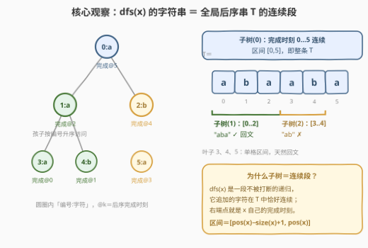
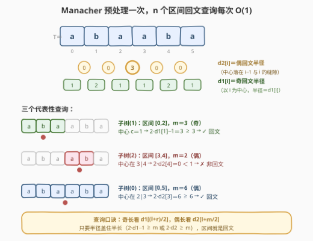
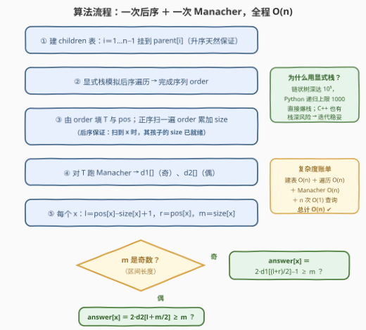
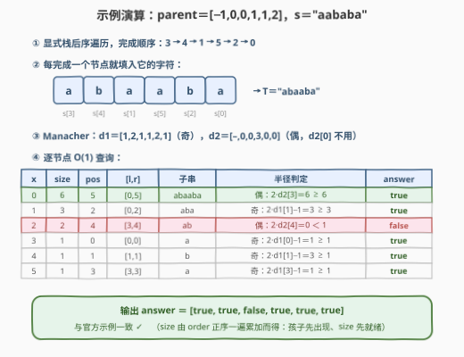

# 判断 DFS 字符串是否是回文串

- **题目名称**：判断 DFS 字符串是否是回文串
- **链接**：[3327. 判断 DFS 字符串是否是回文串](https://leetcode.cn/problems/check-if-dfs-strings-are-palindromes/)
- **难度**：困难
- **标签**：树、深度优先搜索、数组、哈希表、字符串、哈希函数

## 1. 题目概述

给你一棵 $n$ 个节点的**有根树**，根节点为 $0$，节点编号 $0 \sim n-1$。树用一个长度为 $n$ 的数组 `parent` 表示，其中 `parent[i]` 是节点 $i$ 的父节点（`parent[0] == -1`）。

再给你一个长度为 $n$ 的字符串 $s$，其中 $s[i]$ 是节点 $i$ 对应的字符。

初始时有一个空字符串 `dfsStr`，递归函数 `dfs(x)` 依次执行：

1. 按**节点编号升序**遍历 $x$ 的所有孩子节点 $y$，依次调用 `dfs(y)`；
2. 将字符 $s[x]$ **追加**到 `dfsStr` 末尾（所有递归共享全局 `dfsStr`）。

你需要求出长度为 $n$ 的布尔数组 `answer`：对每个下标 $i$，清空 `dfsStr` 并调用 `dfs(i)`，若结果字符串是**回文串**则 `answer[i] = true`，否则为 `false`。

**示例 1**：

```text
输入：parent = [-1,0,0,1,1,2], s = "aababa"
输出：[true,true,false,true,true,true]
解释：
- dfs(0) → "abaaba"，是回文串；
- dfs(1) → "aba"，是回文串；
- dfs(2) → "ab"，不是回文串；
- dfs(3) → "a"，dfs(4) → "b"，dfs(5) → "a"，单字符都是回文串。
```

**示例 2**：

```text
输入：parent = [-1,0,0,0,0], s = "aabcb"
输出：[true,true,true,true,true]
```

**约束条件**：

- $n == \text{parent.length} == s.length$
- $1 \le n \le 10^5$
- 对所有 $i \ge 1$ 有 $0 \le \text{parent}[i] \le n - 1$（父节点编号**可以大于**孩子编号）
- `parent[0] == -1`，且 `parent` 表示一棵合法的树
- $s$ 只包含小写英文字母

> 💡 **读题关键**：① `dfs(i)` 生成的字符串就是**以 $i$ 为根的子树的后序遍历**（孩子按编号升序，自己殿后）——「树上问题」立刻可以降维成「序列问题」；② 朴素做法对每个 $i$ 都要跑一遍 $O(\text{size}(i))$ 的递归再加一次回文判断，链状树下总代价 $O(n^2)$，$n = 10^5$ 必须想线性办法；③ 标签里的「哈希函数」暗示了官方预期的 O(1) 回文判定武器（字符串哈希），下文用**确定性的 Manacher** 替代，免去被 hack 的烦恼。

---

## 2. 解题思路

### 2.1 暴力思路：逐点跑 dfs，O(n²)

按题面直译：对每个 $i$ 清空 `dfsStr`，调用 `dfs(i)`，再判断整串是否回文：

```cpp
for (int i = 0; i < n; ++i) {
    dfsStr = "";
    dfs(i);                       // O(size(i))：整棵子树每个节点贡献一个字符
    answer[i] = isPalindrome(dfsStr);   // O(size(i))
}
```

单个查询 $O(\text{size}(i))$，总计 $\sum_i \text{size}(i)$。对一条链（每个节点只有一个孩子），$\sum_i \text{size}(i) = n + (n-1) + \cdots + 1 = \frac{n(n+1)}{2}$——$n = 10^5$ 时约 $5 \times 10^9$，超时约两个数量级。更深层的浪费在于：**$n$ 次查询重复计算了大量重叠的子树串**（节点 $x$ 的串是它祖先串的子串），必须把「树的形状」压缩成一维坐标，让所有查询共享一次预处理。

### 2.2 核心观察：后序连续段 + Manacher 半径

整份题解由三个环环相扣的观察构成：**树上问题 → 序列区间 → O(1) 回文查询**。

**观察一：`dfs(i)` 的串 = 子树(i) 的后序遍历。**

把 `dfs(x)` 的两条规则展开：孩子（按编号升序）的串依次拼接，最后接上 $s[x]$ 自己——这正是以 $x$ 为根的子树的**后序遍历**（左右孩子先、根最后；本题是通用树，「左右」换成「编号升序的孩子序列」）。子树每个节点恰好贡献一个字符，故 $\text{len} = \text{size}(i)$。

**观察二（欧拉段性质）：所有查询的串，都是同一条全局串 T 的连续区间。**

只从根跑一次 `dfs(0)`，把每个节点**完成递归的时刻**（第几个被追加字符）记为 $\text{pos}(x)$，便得到全局后序串 $T$。关键在于 `dfs(x)` 是一段**不被打断的递归子过程**：它内部产生的所有字符在 $T$ 中恰好构成一个连续段，且右端点正是 $x$ 自己的完成时刻。于是

$$\text{dfs}(i) \;=\; T\big[\text{pos}(i) - \text{size}(i) + 1,\ \text{pos}(i)\big]$$

一次后序遍历，同时拿到了全部 $n$ 个查询的「坐标」$(\text{pos}(i), \text{size}(i))$——树上问题就此坍缩成 $n$ 个**区间回文判定**。



**观察三：Manacher 半径数组让任意区间的回文判定变成 O(1)。**

对 $T$ 跑一遍 Manacher，得到两个数组：

- $d_1[c]$：以 $c$ 为中心的**最长奇回文半径**（对应回文长度 $2d_1[c] - 1$）；
- $d_2[c]$：中心落在 $c-1$ 与 $c$ **缝隙**处的最长偶回文半径（对应长度 $2d_2[c]$）。

对区间 $[l, r]$（长度 $m = r - l + 1$）：

$$\text{isPalindrome}(l, r) = \begin{cases} 2 \cdot d_1\big[\frac{l+r}{2}\big] - 1 \ge m, & m \text{ 为奇数} \\[4pt] 2 \cdot d_2\big[l + m/2\big] \ge m, & m \text{ 为偶数} \end{cases}$$

直觉：回文由**中心 + 半径**唯一确定，Manacher 已经把每个中心能向两侧展开的最大半径算好了；查询时只需看「该中心的半径是否盖住区间半长」。偶数长度的中心落在两字符之间的缝隙上，所以查的是 $d_2[l + m/2]$（即 $l + m/2 - 1$ 与 $l + m/2$ 之间的那条缝）。



### 2.3 算法流程



1. 由 `parent` 建 `children` 表：$i$ 从 $1$ 到 $n-1$ 依次 `children[parent[i]].append(i)`——**按编号升序 append，天然满足题目的升序访问规则**；
2. **显式栈**模拟后序遍历（栈存「节点 + 下一个待访问孩子的下标」），得到完成序列 `order`；
3. 由 `order` 一遍填出 $T$（$T[j] = s[\text{order}[j]]$）与 $\text{pos}$；再**正序**扫 `order` 累加 `size`：$\text{size}[\text{parent}[x]] \mathrel{+}= \text{size}[x]$——后序保证孩子先出现，扫到 $x$ 时它的 `size` 已被所有后代累加完毕；
4. 对 $T$ 跑 Manacher，得 $d_1$、$d_2$；
5. 每个节点 $x$：$l = \text{pos}[x] - \text{size}[x] + 1$，$r = \text{pos}[x]$，$m = \text{size}[x]$，按 $m$ 奇偶套观察三的公式得 `answer[x]`。

> 💡 **为什么全程迭代**：$n = 10^5$ 的链状树递归深度达 $10^5$——Python 默认递归上限 1000 直接爆栈，C++ 也面临栈溢出风险（默认栈约 1 MB）。显式栈 + 线性扫描的实现完全没有这层顾虑。

### 2.4 示例演算

以示例 1 `parent = [-1,0,0,1,1,2]`，`s = "aababa"` 走完全流程：



1. **后序遍历**：完成顺序 $3 \to 4 \to 1 \to 5 \to 2 \to 0$（节点 1 的孩子 3、4 先完成，然后 1 自己；节点 2 的孩子 5 先完成……）；
2. **填 T**：$T = s_3\,s_4\,s_1\,s_5\,s_2\,s_0 = $ `"abaaba"`；
3. **size / pos**：正序扫 `order` 累加，得 $\text{size} = [6,3,2,1,1,1]$、$\text{pos} = [5,2,4,0,1,3]$；
4. **Manacher**：$d_1 = [1,2,1,1,2,1]$，$d_2 = [-,0,0,3,0,0]$；
5. **逐点查询**：见上表——节点 2 的区间 $[3,4]$ 偶长，缝隙 $3|4$ 处 $d_2[4] = 0$，盖不住半长 1，判 `false`；其余皆回文。

输出 `[true, true, false, true, true, true]`，与官方一致 ✓。

---

## 3. 参考代码

### C++

```cpp
class Solution {
  public:
    vector<bool> findAnswer(vector<int>& parent, string s) {
        int n = parent.size();
        vector<vector<int>> children(n);
        for (int i = 1; i < n; i++) children[parent[i]].push_back(i); // 升序天然保证

        // ① 显式栈模拟后序遍历（栈存：节点 + 下一个待访问孩子的下标）
        vector<int> order;
        order.reserve(n);
        vector<pair<int,int>> st;
        st.push_back({0, 0});
        while (!st.empty()) {
            auto [x, idx] = st.back();
            if (idx < (int)children[x].size()) {
                st.back().second = idx + 1;
                st.push_back({children[x][idx], 0});   // 深入下一个孩子
            } else {
                order.push_back(x);                    // 孩子全部完成，x 出炉
                st.pop_back();
            }
        }

        // ② 由 order 填 T 与 pos；正序扫 order 累加 size（孩子先出现）
        string t(n, ' ');
        vector<int> pos(n), sz(n, 1);
        for (int j = 0; j < n; j++) {
            t[j] = s[order[j]];
            pos[order[j]] = j;
        }
        for (int x : order)
            if (x != 0) sz[parent[x]] += sz[x];

        // ③ Manacher：d1 奇回文半径，d2 偶回文半径（中心在 i-1 与 i 的缝隙）
        vector<int> d1(n), d2(n);
        for (int i = 0, l = 0, r = -1; i < n; i++) {
            int k = (i > r) ? 1 : min(d1[l + r - i], r - i + 1);
            while (i - k >= 0 && i + k < n && t[i - k] == t[i + k]) k++;
            d1[i] = k;
            if (i + k - 1 > r) { l = i - k + 1; r = i + k - 1; }
        }
        for (int i = 0, l = 0, r = -1; i < n; i++) {
            int k = (i > r) ? 0 : min(d2[l + r - i + 1], r - i + 1);
            while (i + k < n && i - k - 1 >= 0 && t[i + k] == t[i - k - 1]) k++;
            d2[i] = k;
            if (i + k - 1 > r) { l = i - k; r = i + k - 1; }
        }

        // ④ 每个节点 O(1) 查询
        vector<bool> ans(n);
        for (int x = 0; x < n; x++) {
            int l = pos[x] - sz[x] + 1, r = pos[x], m = sz[x];
            if (m & 1) ans[x] = 2 * d1[(l + r) / 2] - 1 >= m;  // 奇长：中心半径
            else       ans[x] = 2 * d2[l + m / 2] >= m;        // 偶长：缝隙半径
        }
        return ans;
    }
};
```

### Python

```python
class Solution:
    def findAnswer(self, parent: List[int], s: str) -> List[bool]:
        n = len(parent)
        children = [[] for _ in range(n)]
        for i in range(1, n):
            children[parent[i]].append(i)          # 升序天然保证

        # ① 显式栈模拟后序遍历
        order = []
        stack = [(0, 0)]
        while stack:
            x, idx = stack.pop()
            if idx < len(children[x]):
                stack.append((x, idx + 1))         # 记住回溯位置
                stack.append((children[x][idx], 0))  # 深入下一个孩子
            else:
                order.append(x)                    # 孩子全部完成，x 出炉

        # ② 由 order 填 T 与 pos；正序扫 order 累加 size
        t = [''] * n
        pos = [0] * n
        sz = [1] * n
        for j, x in enumerate(order):
            t[j] = s[x]
            pos[x] = j
        for x in order:
            if x:
                sz[parent[x]] += sz[x]
        t = ''.join(t)

        # ③ Manacher：d1 奇回文半径，d2 偶回文半径
        d1 = [0] * n
        l, r = 0, -1
        for i in range(n):
            k = 1 if i > r else min(d1[l + r - i], r - i + 1)
            while i - k >= 0 and i + k < n and t[i - k] == t[i + k]:
                k += 1
            d1[i] = k
            if i + k - 1 > r:
                l, r = i - k + 1, i + k - 1

        d2 = [0] * n
        l, r = 0, -1
        for i in range(n):
            k = 0 if i > r else min(d2[l + r - i + 1], r - i + 1)
            while i + k < n and i - k - 1 >= 0 and t[i + k] == t[i - k - 1]:
                k += 1
            d2[i] = k
            if i + k - 1 > r:
                l, r = i - k, i + k - 1

        # ④ 每个节点 O(1) 查询
        ans = [False] * n
        for x in range(n):
            left, m = pos[x] - sz[x] + 1, sz[x]
            if m % 2:
                ans[x] = 2 * d1[(left + pos[x]) // 2] - 1 >= m   # 奇长
            else:
                ans[x] = 2 * d2[left + m // 2] >= m              # 偶长
        return ans
```

> 💡 **实现细节**：① `children[parent[i]].append(i)` 按 $i$ 升序循环，天然满足「编号升序访问」——不需要排序；② 显式栈里存 `(节点, 下一个孩子下标)`，回溯不需要重新找位置，每个节点进出栈各一次，总操作 $O(n)$；③ `size` 的累加方向是**正序**扫 `order`（后序序列中孩子必在父亲之前出现），一遍完成，连第二次 DFS 都省了；④ Manacher 两个循环各自维护当前覆盖最右的回文框 $[l, r]$，均摊线性。

---

## 4. 复杂度分析

| 维度 | 复杂度 | 说明 |
|------|--------|------|
| 时间复杂度 | $O(n)$ | 建 `children` 表 $O(n)$ + 显式栈后序 $O(n)$ + `size`/`pos`/`T` 线性填写 + 两遍 Manacher $O(n)$ + $n$ 次 O(1) 查询；$n = 10^5$ 时 Python 实测约 0.2 s |
| 空间复杂度 | $O(n)$ | `children` 邻接表（$n-1$ 条边）+ `order`/`pos`/`sz`/`T`/`d1`/`d2` 各一个长度 $n$ 的数组 + 显式栈最深 $O(n)$（链状树） |
| 暴力对照 | $O(n^2)$ 时间 | $\sum_i \text{size}(i)$ 在链状树下达 $\frac{n(n+1)}{2} \approx 5 \times 10^9$，超时约两个数量级 |

实测：两组官方样例 `[true,true,false,true,true,true]` / `[true,true,true,true,true]` ✓；与「逐点真跑 dfs + 整串反转比较」的暴力对拍随机数据（$n \le 12$，二进制字符集）各 3000 组（Python 与 C++ 双语言）全部一致；满规模（$n = 10^5$，链状树与随机树）Python 约 0.2 s。

---

## 5. 扩展：字符串哈希做法与确定性之辩

**哈希版 O(1) 判定。** 官方标签里的 *Hash Function* 指向另一条路线：预处理 $T$ 的**正向前缀哈希** $H_f[i] = H_f[i-1] \cdot B + T_i$ 与**反向前缀哈希** $H_b[i] = H_b[i-1] \cdot B + T_{n-1-i}$（模一个大质数 $P$）。区间 $[l, r]$ 是回文，等价于「正着读的哈希 = 倒着读的哈希」：

$$\text{hash}\big(T[l..r]\big) = \text{hash}\big(T[r], T[r-1], \ldots, T[l]\big)$$

两者都能从各自前缀数组 $O(1)$ 组合出来（减去凑整幂次），查询复杂度与 Manacher 版相同。整套代码比 Manacher 短，是竞赛里的常见选择。

**但哈希是「概率正确」。** 多项式哈希存在**碰撞**可能：构造性 Hack（对固定 $B, P$ 预先算出碰撞串）在 Codeforces 这类有 Hack 环节的赛场是真实威胁；LeetCode 虽无人 Hack，单模单底的哈希仍可能被特殊数据撞上。防御手段按代价递增：**随机底数** $B$（运行期 `random` 选取，攻击者无法预构造）、**双哈希**（两组 $(B, P)$ 同时相等才判回文，碰撞概率平方级衰减）、或干脆换 Manacher——它输出**确定性**答案，零碰撞风险。本题解选 Manacher 的原因即在于此：代码只长十来行，换来「永远不用解释为什么 WA」。

**同一招式的谱系。** 「子树 = DFS 序上的连续区间」是树上询问降维的万能桥梁：子树和/子树更新用入序时间戳 + 树状数组；LCA 用欧拉序 + ST 表 $O(1)$ 查询；本题则是「后序串 + Manacher」。遇到「对每个节点问它子树的某种整体性质」，第一反应就应该是：**先把树拍平成序列，再看性质能不能 O(1) 查**。

---

## 6. 面试要点

1. **为什么 `dfs(i)` 的串是全局后序串 T 的连续段？**

   - `dfs(x)` 是一段不被打断的递归子过程：从进入到返回，它追加的所有字符在 `dfsStr` 中连续；而这些字符恰好来自子树(x) 的全部节点（后序：孩子先、自己最后）。所以子树(x) 的完成时刻构成连续区间 $[\text{pos}(x) - \text{size}(x) + 1,\ \text{pos}(x)]$，右端点是 $x$ 自己。

2. **size 为什么正序扫一遍 order 就能累加出来？**

   - 后序序列中，$x$ 的所有后代必然排在 $x$ 之前；顺序扫描时，处理到 $x$ 之前它的所有孩子都已把 `size` 加给了它，因此扫到 $x$ 时 `size[x]` 已是终值，再加给父亲即可。一次线性扫描替代第二次 DFS。

3. **Manacher 的查询公式为什么是那两个？**

   - 回文 = 中心 + 对称半径。奇数长 $m$ 的区间中心是下标 $\frac{l+r}{2}$，最长奇回文长度 $2d_1[c]-1$，盖住 $m$ 即回文；偶数长的中心落在 $l + m/2 - 1$ 与 $l + m/2$ 之间的缝隙，对应 $d_2[l+m/2]$，长度 $2d_2$，盖住 $m$ 即回文。两个数组把所有中心一次算完，查询只做一次比较。

4. **和「每个节点单独判回文」相比，优化的本质是什么？**

   - 单独判是 $O(\sum \text{size}(i)) = O(n^2)$：重叠子串被反复扫描。优化在于把 $n$ 个查询的**公共结构**——整条 $T$ 的回文性——一次性预处理（Manacher 或哈希），之后每次查询降为 $O(1)$。与线段树/ST 表「预处理换查询」是同一思想。

5. **实现上有哪些坑？**

   - ① 链状树递归深 $10^5$：Python 爆默认递归上限、C++ 栈溢出风险 → 显式栈迭代；② 孩子必须**编号升序**访问（影响串内容）：升序循环 `append` 天然保证，别手滑排序成按字符；③ `parent[i]` 可以大于 $i$，不能按编号正序当拓扑序用，必须真的遍历；④ Manacher 的 $d_2$ 中心在「缝隙」上，下标平移（$l + m/2$ 而非 $\frac{l+r}{2}$）是最常见的 off-by-one。

---

## 7. 同类练习题

- [5. 最长回文子串](https://leetcode.cn/problems/longest-palindromic-substring/)（[站内题解](../0001-0100/5_最长回文子串.md)）：Manacher 母题，$d_1/d_2$ 两个半径数组正是本题的预处理目标
- [1745. 分割回文串 IV](https://leetcode.cn/problems/palindrome-partitioning-iv/)（[站内题解](../1701-1800/1745_分割回文串IV.md)）：同样需要「任意子串是否回文」的 O(1) 判定 + DP 组合，练预处理与查询的衔接
- [132. 分割回文串 II](https://leetcode.cn/problems/palindrome-partitioning-ii/)（[站内题解](../0101-0200/132_分割回文串II.md)）：回文判定预处理的两阶段 DP 套路，可与哈希/Manacher 任一武器搭配
- [331. 验证二叉树的前序序列化](https://leetcode.cn/problems/verify-preorder-serialization-of-a-binary-tree/)：换一个方向玩 DFS 序——用槽位计数验证先序遍历序列的合法性
- [236. 二叉树的最近公共祖先](https://leetcode.cn/problems/lowest-common-ancestor-of-a-binary-tree/)（[站内题解](../0201-0300/236_二叉树的最近公共祖先.md)）：欧拉序 + ST 表做 O(1) LCA 的基础，与本题同属「树拍平成序列」的谱系
