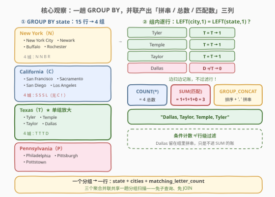
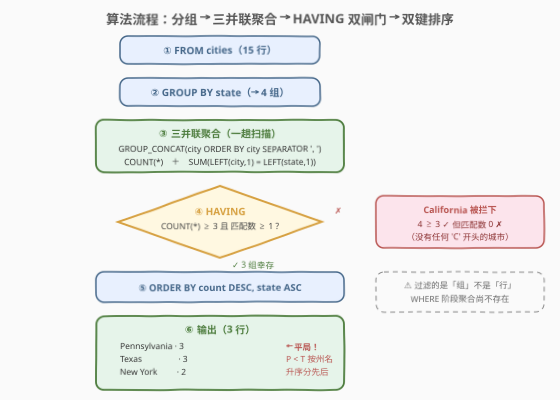
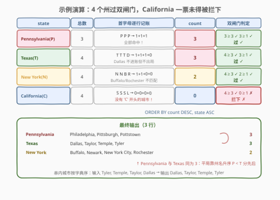

# LeetCode 查找每个州的城市 II 题解

## 1. 题目概述

- **标题 / 题号**：查找每个州的城市 II（#3328，medium）
- **链接**：https://leetcode.cn/problems/find-cities-in-each-state-ii/
- **难度**：中等
- **标签**：数据库、SQL、GROUP BY、GROUP_CONCAT、条件聚合、`SUM(IF)`、`LEFT()`、HAVING、LeetCode 锁题

> ⚠️ 本题为 LeetCode 付费题（锁题），题意描述根据官方示例用例与外部资料重建，可能与官方题面有出入。（题面已与社区镜像的官方中文翻译交叉核对，示例输入输出与 GraphQL 接口返回一致，出入风险较低。）

**表结构**：`cities`

| 列名 | 类型 |
|------|------|
| state | varchar |
| city | varchar |

- `(state, city)` 是这张表中值互不相同的列组合，每行包含一个州名与该州的一个城市名。

**目标**：编写一个解决方案，找到**每个州**的**所有城市**，并按下列条件分析它们：

1. 用**逗号分隔**的字符串组合每一个州的所有城市（组内城市按字母序）；
2. 只显示有**至少 3 个**城市的州；
3. 只显示**至少有一个城市**以与**州名相同的字母开头**的州。

返回 `state`、`cities`、`matching_letter_count` 三列，按 `matching_letter_count` **降序**、州名**升序**排序。其中 `matching_letter_count` 为该州中以与州名相同字母开头的城市数量。

**示例 1**：

```text
输入：cities 表
+--------------+---------------+
| state        | city          |
+--------------+---------------+
| New York     | New York City |
| New York     | Newark        |
| New York     | Buffalo       |
| New York     | Rochester     |
| California   | San Francisco |
| California   | Sacramento    |
| California   | San Diego     |
| California   | Los Angeles   |
| Texas        | Tyler         |
| Texas        | Temple        |
| Texas        | Taylor        |
| Texas        | Dallas        |
| Pennsylvania | Philadelphia  |
| Pennsylvania | Pittsburgh    |
| Pennsylvania | Pottstown     |
+--------------+---------------+

输出：
+--------------+-------------------------------------------+-----------------------+
| state        | cities                                    | matching_letter_count |
+--------------+-------------------------------------------+-----------------------+
| Pennsylvania | Philadelphia, Pittsburgh, Pottstown       | 3                     |
| Texas        | Dallas, Taylor, Temple, Tyler             | 3                     |
| New York     | Buffalo, Newark, New York City, Rochester | 2                     |
+--------------+-------------------------------------------+-----------------------+
```

**解释**：

- `Pennsylvania`：3 个城市（满足 ≥3），且 Philadelphia / Pittsburgh / Pottstown **全部**以 'P' 开头（与州名相同），`matching_letter_count = 3`；
- `Texas`：4 个城市（满足 ≥3），其中 Taylor / Temple / Tyler 以 'T' 开头（Dallas 以 'D' 开头不计），`matching_letter_count = 3`；
- `New York`：4 个城市（满足 ≥3），其中 Newark / New York City 以 'N' 开头，`matching_letter_count = 2`；
- `California` **不在输出中**：虽有 4 个城市（满足 ≥3），但没有城市以 'C' 开头（San×3 以 'S'、Los Angeles 以 'L'），不满足字母匹配条件。

**约束条件**（依据表结构与示例重建推测）：

- `(state, city)` 组合唯一——同一州内城市不重复，拼串无需 `DISTINCT`；
- `cities` 列组内按 `city` **字典序**排列，分隔符为「逗号 + 空格」`', '`——Texas 的输入序 Tyler → Temple → Taylor → Dallas，输出却是 `Dallas, Taylor, Temple, Tyler`，排序不可省；
- 判题数据规模小。

> 💡 **审题关键**：① 三个输出列 = 一个分组键（`state`）+ 两个聚合量（拼串 `cities`、条件计数 `matching_letter_count`）；② 两个过滤条件（≥3 个城市、≥1 个匹配）都是**组级**条件——单个行上问不出「这个州有几个城市」，必须聚合之后再筛 → `HAVING`；③ 匹配的判定是**行级谓词** `LEFT(city,1) = LEFT(state,1)`，`state` 是分组键、组内恒定，逐行判定后 `SUM` 起来即条件计数；④ 输出双键排序 `count DESC → state ASC`——Pennsylvania 与 Texas 同为 3，靠州名升序分出先后。

## 2. 解题思路

### 2.1 暴力思路：两个聚合子查询分别算、再 JOIN

社区流传的写法把两件事拆成两个独立查询：`t1` 按州分组做 `GROUP_CONCAT` 拼串并 `COUNT` 总数；`t2` 先 `WHERE LEFT(city,1) = LEFT(state,1)` 过滤出匹配行、再按州 `COUNT`；最后两表按 `state` 连接，补上 `cnt1 >= 3 AND cnt2 >= 1` 与排序。

```sql
SELECT t1.state, t1.cities, t2.cnt2 AS matching_letter_count
FROM (SELECT state, GROUP_CONCAT(city ORDER BY city SEPARATOR ', ') AS cities,
             COUNT(*) AS cnt1
      FROM cities GROUP BY state) t1
JOIN (SELECT state, COUNT(*) AS cnt2
      FROM cities
      WHERE LEFT(city, 1) = LEFT(state, 1)
      GROUP BY state) t2
  ON t1.state = t2.state
WHERE cnt1 >= 3 AND cnt2 >= 1
ORDER BY matching_letter_count DESC, t1.state;
```

它完全正确——但 `cities` 表被**分组扫描了两遍**，再用一次连接把同一州的两份统计缝回去。更直觉的「应用层暴力」（全表拉回程序里分桶、过滤、排序）则把声明式一条 `SELECT` 就能说清的事搬出数据库。

> ⚠️ 暴力的启示：拼串、总数、匹配数三件事**共享同一个分组**（`GROUP BY state`），完全可以在**一趟**分组里并联求值——尤其「匹配数」不需要先 `WHERE` 再分组：**条件聚合**让「先过滤再数」退化为「边扫边按条件记账」。另外 `t2` 是内连接，天然把 `cnt2 >= 1`（存在匹配城市）做了大半——这个隐式语义在单趟写法里要显式写出来，别丢。

### 2.2 核心观察：单趟分组的「三并联聚合」+ 条件聚合计数



三个观察把问题坍缩成「一次分组 + 一层过滤 + 一层排序」：

| 观察 | 内容 | 带来的做法 |
|------|------|-----------|
| **三列共享同一分组** | 拼串（`cities`）、总数（`COUNT(*)`）、匹配数都是**州级**统计量，分组键都是 `state` | 一个 `GROUP BY` 里并联三个聚合，共享同一趟分组扫描，无需子查询与 JOIN |
| **匹配数 = 行级谓词的组内求和** | `LEFT(city,1) = LEFT(state,1)` 逐行判定（`state` 是分组键，组内恒定），MySQL 布尔表达式返回 1/0 | `SUM(LEFT(city,1) = LEFT(state,1))` 边扫边记账——**条件聚合**替代「先 WHERE 再分组」 |
| **两个过滤都是组级谓词** | 「至少 3 个城市」比较的是 `COUNT(*)`，「至少 1 个匹配」比较的是匹配数——聚合值在 `WHERE` 阶段尚不存在 | 过滤写进 `HAVING`（或先 CTE 物化再 `WHERE`，见解法 B） |

两个容易踩的细节先钉死：

- **`cities` 串的组内排序不可省**：输入序 Tyler, Temple, Taylor, Dallas 拼出来不是字典序；必须 `GROUP_CONCAT(city ORDER BY city SEPARATOR ', ')`——这是 3198（[站内题解](../3101-3200/3198_查找每个州的城市.md)）立好的规矩，分隔符 `', '` 同样要显式覆盖默认裸逗号；
- **「≥1 个匹配」的等价改写**：匹配数 ≥1 ⇔ 存在匹配城市 ⇔ `MAX(LEFT(city,1) = LEFT(state,1)) = 1`（存在量词用 `MAX` 表达）。反过来用 `MIN(...) = 1`（全部匹配）就错了——那是另一个语义。

> 💡 **为什么匹配数不能 `COUNT(*)`？** `COUNT(*)` 数的是组内**全部**行（总城市数），匹配数只要数「首字母相同」的那部分——差一个条件，就是 `SUM(条件)` 与 `COUNT(*)` 的区别。条件聚合的通用范式：`SUM(cond)`（MySQL 布尔简写）、`SUM(CASE WHEN cond THEN 1 ELSE 0 END)`（标准）、`COUNT(IF(cond, 1, NULL))`（借 `COUNT` 跳过 NULL 的脾气），详见 5.1。

### 2.3 算法流程图



| 步骤 | SQL 片段 | 作用 | 示例数据流 |
|------|----------|------|-----------|
| ① 行源 | `FROM cities` | 逐行读入 `(state, city)` | 15 行 |
| ② 分组 | `GROUP BY state` | 同州归一组 | 4 组：New York / California / Texas / Pennsylvania |
| ③ 三并联聚合 | `GROUP_CONCAT(city ORDER BY city SEPARATOR ', ')`、`COUNT(*)`、`SUM(LEFT(city,1) = LEFT(state,1))` | 一趟扫描同时产出三列 | Texas 组 → `Dallas, Taylor, Temple, Tyler` / 4 / 3 |
| ④ 双闸门 | `HAVING COUNT(*) >= 3 AND 匹配数 >= 1` | 组级过滤 | California 被拦（匹配数 0）；其余 3 组放行 |
| ⑤ 双键排序 | `ORDER BY matching_letter_count DESC, state` | count 降序、州名升序 | Pennsylvania(3) → Texas(3) → New York(2) |

> 💡 **三处排序互不相同**：`GROUP_CONCAT` **函数体内**的 `ORDER BY city` 管**串内城市顺序**；外层 `ORDER BY` 的第一个键管**行间**按匹配数排；第二个键在匹配数持平时按**州名**排。三个排序各管一层，少一个都不对。

### 2.4 示例演算



| state | 组内城市（首字母） | total | 匹配明细 | matching_letter_count | 闸门判定 |
|-------|------------------|-------|----------|----------------------|----------|
| **Pennsylvania** (P) | Philadelphia (P) / Pittsburgh (P) / Pottstown (P) | 3 | P, P, P → 1+1+1 | **3** | 3≥3 ✓ 且 3≥1 ✓ → **过** |
| **Texas** (T) | Tyler (T) / Temple (T) / Taylor (T) / Dallas (D) | 4 | T, T, T, D → 1+1+1+0 | **3** | 4≥3 ✓ 且 3≥1 ✓ → **过** |
| **New York** (N) | New York City (N) / Newark (N) / Buffalo (B) / Rochester (R) | 4 | N, N, B, R → 1+1+0+0 | **2** | 4≥3 ✓ 且 2≥1 ✓ → **过** |
| **California** (C) | San Francisco (S) / Sacramento (S) / San Diego (S) / Los Angeles (L) | 4 | S, S, S, L → 0+0+0+0 | 0 | 4≥3 ✓ 但 0≥1 ✗ → **拦** |

三步收尾：

- **第 ① 步**（HAVING）：California 是唯一的「幸存失败者」——城市数量达标（4≥3）却在字母匹配上一票未得，被第二个闸门拦下；
- **第 ② 步**（ORDER BY 第一键）：Pennsylvania(3) 与 Texas(3) 并列榜首，New York(2) 殿后；
- **第 ③ 步**（ORDER BY 第二键）：Pennsylvania < Texas（P < T），平局按州名升序分出先后。

> 💡 **交换验证**：若把第二键删掉只按 `count DESC` 排，Pennsylvania 与 Texas 的先后就交给聚合输出的不确定顺序——结果「碰巧对」但语义无保证。排序键与平局打破键必须整体写进 `ORDER BY`，与 3308 的三级平局链同一条铁律。

## 3. 参考代码

### SQL（解法 A：单趟分组 + 三并联聚合 + HAVING，推荐）

```sql
# Write your MySQL query statement below
SELECT state,
       GROUP_CONCAT(city ORDER BY city SEPARATOR ', ') AS cities,
       SUM(LEFT(city, 1) = LEFT(state, 1))             AS matching_letter_count
FROM cities
GROUP BY state
HAVING COUNT(*) >= 3
   AND matching_letter_count >= 1
ORDER BY matching_letter_count DESC, state;
```

> 💡 **写法要点**：
> - **三个聚合并联在同一 `GROUP BY`**：拼串、总数、匹配数共享一趟分组扫描——2.1 的双子查询 + JOIN 被压扁成一层 SELECT；
> - **条件聚合 `SUM(LEFT(city,1) = LEFT(state,1))`**：行级布尔判定逐行返回 1/0，`SUM` 即「满足条件的行数」。`state` 是分组键、组内恒定，直接参与聚合表达式合法且无歧义；
> - **`HAVING` 里第二个条件引用了别名** `matching_letter_count`：MySQL 允许 `HAVING`/`ORDER BY` 引用 `SELECT` 别名（扩展特性，判题可用）；跨库更稳的写法是重复完整表达式，或见解法 B；
> - **无 `DISTINCT`、无 `WHERE`**：`(state, city)` 唯一保证组内无重复；两个过滤都是组级，行级 `WHERE` 里写不出 `COUNT(*)`。

### SQL（解法 B：CTE 物化聚合表 + 外层 WHERE）

```sql
# Write your MySQL query statement below
WITH t AS (
    SELECT state,
           GROUP_CONCAT(city ORDER BY city SEPARATOR ', ') AS cities,
           COUNT(*)                                       AS total_cnt,
           SUM(LEFT(city, 1) = LEFT(state, 1))            AS match_cnt
    FROM cities
    GROUP BY state
)
SELECT state,
       cities,
       match_cnt AS matching_letter_count
FROM t
WHERE total_cnt >= 3
  AND match_cnt >= 1
ORDER BY matching_letter_count DESC, state;
```

> 💡 **解法 B 的取舍**：
> - 套路是「**先聚合、再过滤**」：CTE 把组级统计物化成普通列（`total_cnt` / `match_cnt`），过滤就落回普适的 `WHERE`——不依赖 `HAVING` 引用别名的 MySQL 扩展，PostgreSQL 等只须把 `GROUP_CONCAT` 换成 `STRING_AGG` 即可平移（见 5.1/5.2）；
> - 外层 `ORDER BY matching_letter_count` 引用别名在任何实现都合法（`ORDER BY` 是别名的天然辖区）；写 `match_cnt DESC` 同义；
> - 与解法 A 语义完全等价，代价是多一层 CTE 样板；两解都是单趟分组，无 2.1 的重复扫描。

### Python（pandas）

```python
import pandas as pd


def find_cities(cities: pd.DataFrame) -> pd.DataFrame:
    stats = (
        cities.assign(match=cities["city"].str[0] == cities["state"].str[0])
        .groupby("state")
        .agg(
            total=("city", "size"),
            matching_letter_count=("match", "sum"),
            cities=("city", lambda x: ", ".join(sorted(x))),
        )
        .reset_index()
    )
    res = stats[(stats["total"] >= 3) & (stats["matching_letter_count"] >= 1)]
    return (
        res[["state", "cities", "matching_letter_count"]]
        .sort_values(["matching_letter_count", "state"], ascending=[False, True])
        .reset_index(drop=True)
    )
```

> 💡 **pandas 对照**（付费题无官方函数签名，函数名沿用 3198 的 `find_cities` 约定）：
> - `assign(match=...)` 在分组**前**算好行级布尔列——对应 `SUM(LEFT(city,1) = LEFT(state,1))` 的逐行判定；`("match", "sum")` 对布尔列求和即条件计数，对应 `SUM(条件)`；
> - `("city", "size")` 对应 `COUNT(*)`；`lambda x: ", ".join(sorted(x))` 对应 `GROUP_CONCAT(city ORDER BY city SEPARATOR ', ')`；
> - 过滤在聚合之后用布尔索引做——对应 `HAVING`，顺序反了（先筛行再分组）就把 California 的 San 系城市全砍了，语义直接崩掉；
> - `sort_values` 双键 `ascending=[False, True]` 一比一对应 `ORDER BY matching_letter_count DESC, state`。

## 4. 复杂度分析

设 $n$ 为 `cities` 行数，$d$ 为不同州数，$k_i$ 为第 $i$ 州城市数，$\ell$ 为每州拼接串平均长度。

| 维度 | 复杂度 | 说明 |
|------|--------|------|
| **时间（分组 + 聚合）** | $O(n \log n)$ | 分组 $O(n)$；`GROUP_CONCAT` 组内排序合计 $\sum_i k_i \log k_i \le n \log n$；条件计数与 `COUNT` 均为组内线性 |
| **时间（输出排序）** | $O(d \log d)$ | 仅对 $d$ 个幸存州排双键序，远小于 $n\log n$ |
| **空间** | $O(d \cdot \ell)$ | 中间结果每州一行（拼串 + 两个整数），即答案本身规模 |
| **扫描次数** | 1 次 | 解法 A/B 单趟分组；2.1 暴力为 2 次分组 + 1 次连接 |

> ⚠️ SQL 复杂度取决于执行计划：无索引时分组走临时表/排序；`(state, city)` 若有联合索引，分组甚至可以借索引序免排序。面试中说明「代价集中在组内排序 $\sum k_i \log k_i$ 与聚合本身线性扫描」即可。另记 `GROUP_CONCAT` 的 `group_concat_max_len` 默认 1024 字节截断坑（3198 的 5.1 有展开），本题数据小不触发。

## 5. 扩展：条件聚合一族与过滤的位置

### 5.1 「数满足条件的行」的五种写法

`matching_letter_count` 的核心是**条件聚合**——同一个模式在 SQL 里有五张面孔：

| 写法 | 语义 | 可移植性 |
|------|------|----------|
| `SUM(cond)` | 布尔表达式返回 1/0，直接求和 | MySQL 便捷简写 |
| `SUM(CASE WHEN cond THEN 1 ELSE 0 END)` | 显式映射再求和 | 全平台标准 |
| `SUM(IF(cond, 1, 0))` | `CASE` 的 MySQL 方言速记 | MySQL 系 |
| `COUNT(IF(cond, 1, NULL))` | 借 `COUNT(expr)` **跳过 NULL** 的脾气数非空 | MySQL 系；标准写法是 `COUNT(*) FILTER (WHERE cond)`（SQL:2003，PostgreSQL/SQLite 支持，MySQL 8 不支持） |
| `MAX(cond)` | 存在量词——组内**任意**一行满足即为 1 | 全平台（配 `= 1` 使用） |

> 💡 **`SUM` 数量、`MAX` 数存在**是条件聚合的两句口诀：`SUM(cond) >= m`（至少 m 个）、`MAX(cond) = 1`（至少一个）、`MIN(cond) = 1`（全部）。本题「≥1 个匹配城市」既可写 `SUM(...) >= 1` 也可写 `MAX(...) = 1`，同范式题见 [3052. 最大化商品](../3001-3100/3052_最大化商品.md)（`SUM(IF(...))` 多统计量并联）与 [3051. 寻找数据科学家职位的候选人](../3001-3100/3051_寻找数据科学家职位的候选人.md)（`SUM(skill = '...') > 0` 技能点名）。

### 5.2 WHERE 与 HAVING 的分工：过滤发生在聚合的哪一侧

SQL 的逻辑执行顺序是：

```text
FROM → WHERE → GROUP BY → HAVING → SELECT → ORDER BY
```

两个过滤器的本质区别是**站在聚合的哪一侧**：

| | `WHERE` | `HAVING` |
|---|---------|----------|
| 过滤对象 | **行**（聚合前的原始行） | **组**（聚合后的统计行） |
| 能否用聚合函数 | ✗（`WHERE COUNT(*) >= 3` 直接语法错误） | ✓ |
| 能否引用 `SELECT` 别名 | ✗（`SELECT` 在其后执行） | ✓（MySQL 扩展；标准 SQL 亦不允许） |

本题两个条件都以聚合值为比较对象——「这个州**有几个**城市」在单行上问不出来，必须等分组完成，所以只能 `HAVING`（解法 A）或先物化再 `WHERE`（解法 B）。若把 `WHERE LEFT(city,1) = LEFT(state,1)` 写进解法 A 试图「顺手过滤」，会把不匹配的城市从**拼串和总数里也剔掉**——Texas 将拼成 `Taylor, Temple, Tyler`（丢 Dallas）、总数变 3，语义全错。这正是 2.1 暴力解法里 `t2` 必须独立成查询的原因：它的 `WHERE` 只服务匹配计数这一列，不能殃及同组其他聚合。

### 5.3 首字母匹配的写法与大小写

「city 与 state 同首字母」的几种等价表达：

- `LEFT(city, 1) = LEFT(state, 1)`——`LEFT(str, n)` 从左取 n 字符，最直白；
- `SUBSTRING(city, 1, 1) = SUBSTRING(state, 1, 1)`——同义，`SUBSTRING` 是更通用的子串函数；
- `city LIKE CONCAT(LEFT(state, 1), '%')`——前缀匹配形态（1527 的 `LIKE 'DI\_%'` 是其字面量特例）。

> ⚠️ **大小写与 collation**：MySQL 常见排序规则以 `_ci` 结尾（大小写不敏感），`'n' = 'N'` 判真。本题州名与城市名均为首字母大写的标题体，任何 collation 结论一致；但生产数据若混入 `newark` 这类小写城市，`_ci` 下仍判匹配、`_bin`/`BINARY` 下不匹配——跨库或跨表比较时 collation 不一致甚至会直接报错。首字母比较前统一 `UPPER()`/`LOWER()` 是零成本的防御写法。

## 6. 面试要点

1. **为什么两个过滤条件必须写 `HAVING` 而不是 `WHERE`？**

   > 因为它们都是**组级**条件——比较对象是聚合值（`COUNT(*)`、匹配数），而 `WHERE` 执行在 `GROUP BY` 之前，彼时聚合尚不存在（`WHERE COUNT(*) >= 3` 是语法错误）。SQL 逻辑顺序 `FROM → WHERE → GROUP BY → HAVING → SELECT → ORDER BY` 决定了「过滤组」只能交给 `HAVING`（或先 CTE 物化聚合列再 `WHERE`，见解法 B）。

2. **`matching_letter_count` 怎么在一趟聚合里算出来？为什么不能用 `COUNT(*)`？**

   > 条件聚合：`SUM(LEFT(city,1) = LEFT(state,1))`——行级布尔判定返回 1/0，`SUM` 即满足条件的行数。`COUNT(*)` 数的是组内全部行（总城市数），差一个条件。标准写法是 `SUM(CASE WHEN ... THEN 1 ELSE 0 END)`；「存在至少一个」还可用存在量词 `MAX(cond) = 1`。

3. **把 `WHERE LEFT(city,1) = LEFT(state,1)` 加进解法 A 会怎样？**

   > 语义崩坏：`WHERE` 会把不匹配城市从组里整行剔掉，殃及**同组的所有聚合**——Texas 的 `cities` 串丢掉 Dallas（只剩 `Taylor, Temple, Tyler`）、`COUNT(*)` 变 3。「按条件计数」要的是**某一列**的统计，必须用条件聚合在聚合内部记账，而不是行级过滤。

4. **解法 A 比社区流传的「两个子查询 + JOIN」好在哪？**

   > 拼串、总数、匹配数共享同一分组键 `state`，单趟分组可并联求值；双子查询版把 `cities` 表分组扫了两遍、再用一次连接缝回两份统计，多一趟扫描多一个连接还多两个 CTE 样板。语义等价时，「**一个分组 + 并联聚合**」是首选形态——与 1484 的「拼串 + 计数」双聚合同范式。

5. **输出排序键少写第二个会怎样？示例里 Pennsylvania 为什么排在 Texas 前面？**

   > 两者 `matching_letter_count` 同为 3，靠第二键 `state` 升序分出先后（Pennsylvania < Texas）。若只写 `count DESC`，平局行的输出顺序交由聚合产出的不确定顺序，结果「碰巧对」但无保证。组内串序（`ORDER BY city`）、行间 count 序、平局州名序是**三处不同的排序**，各自的子句载体不能混。

> 💡 **一句话总结**：3328 = 3198 的 GROUP_CONCAT 三件套（分组 / 组内排序 / `', '` 分隔）+ 两件新装备——**条件聚合** `SUM(LEFT(city,1) = LEFT(state,1))` 一趟算出匹配数，**组级过滤** `HAVING COUNT(*) >= 3 AND 匹配数 >= 1` 把 California 拦在门外；输出按 count 降序、州名升序双键落座。

## 同类练习题

| # | 题目 | 与本题的关联 |
|---|------|-------------|
| 3198 | [查找每个州的城市](https://leetcode.cn/problems/find-cities-in-each-state/)（[站内题解](../3101-3200/3198_查找每个州的城市.md)） | 本题前作——同一张表的纯 `GROUP_CONCAT` 拼接，无过滤无计数；本题在其上叠加组级双过滤与条件计数列 |
| 1484 | [按日期分组销售产品](https://leetcode.cn/problems/group-sold-products-by-the-date/)（[站内题解](../1401-1500/1484_按日期分组销售产品.md)） | `GROUP_CONCAT` 拼串 + `COUNT(DISTINCT)` 计数并联——「同一分组的字符串聚合 + 数值聚合」双列输出的另一个实例 |
| 596 | [超过 5 名学生的课](https://leetcode.cn/problems/classes-more-than-5-students/)（[站内题解](../0501-0600/596_超过5名学生的课.md)） | `HAVING COUNT(*) >= 5` 组级过滤的原型题——本题第一个闸门的极简版 |
| 1527 | [患某种疾病的患者](https://leetcode.cn/problems/patients-with-a-condition/)（[站内题解](../1401-1500/1527_患某种疾病的患者.md)） | `LIKE 'DI\_%'` 按开头字母筛选——本题「首字母匹配」的行级版对照 |
| 3051 | [寻找数据科学家职位的候选人](https://leetcode.cn/problems/find-candidates-for-data-scientist-position/)（[站内题解](../3001-3100/3051_寻找数据科学家职位的候选人.md)） | `SUM(skill = '...')` 布尔求和逐项点名——条件聚合在多条件交集场景的推广 |
