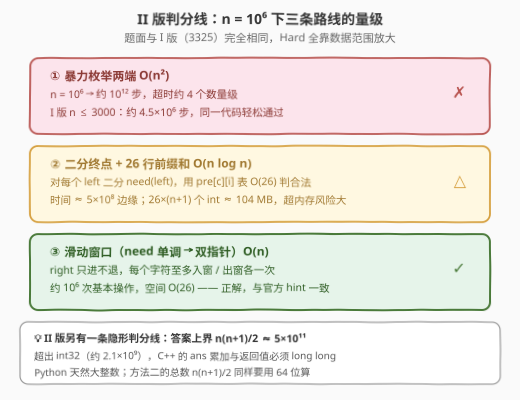
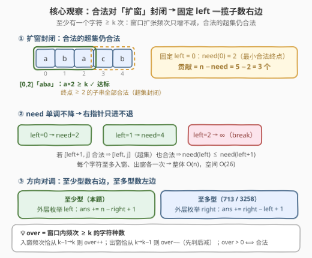
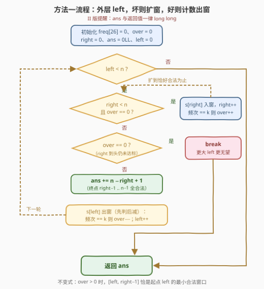
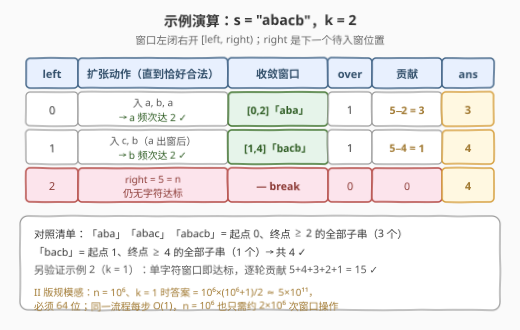

# 字符至少出现 K 次的子字符串 II

- **题目名称**：字符至少出现 K 次的子字符串 II
- **链接**：[3329. 字符至少出现 K 次的子字符串 II](https://leetcode.cn/problems/count-substrings-with-k-frequency-characters-ii/)
- **难度**：困难
- **标签**：哈希表、字符串、滑动窗口
- **关联**：[3325（版本 I）](../3301-3400/3325_字符至少出现K次的子字符串I.md)（[官方题面](https://leetcode.cn/problems/count-substrings-with-k-frequency-characters-i/)）是本题的小数据版（$n \le 3000$，$O(n^2)$ 暴力可过）；本题（付费）把规模放大到 $10^6$ 量级，**同一条滑窗思路从「可选优化」变成「唯一正解」**，另加一条 64 位答案的隐形判分线。官方 hints 与 I 版完全同源：合法子串对扩窗封闭、固定一端用滑窗或二分找另一端

## 1. 题目概述

> ⚠️ 本题为 LeetCode 付费题，题意描述根据官方示例用例与 hints 重建，可能与官方题面有出入。两组官方示例用例与版本 I（3325）完全相同。

给你一个字符串 $s$ 和一个整数 $k$，在 $s$ 的所有子字符串中，请你统计并返回**至少有一个**字符**至少出现** $k$ 次的子字符串总数。

**子字符串**是字符串中的一个连续、**非空**的字符序列。

**示例 1**：

```text
输入：s = "abacb", k = 2
输出：4
解释：符合条件的子字符串如下：
     "aba"（字符 'a' 出现 2 次）
     "abac"（字符 'a' 出现 2 次）
     "abacb"（字符 'a' 出现 2 次）
     "bacb"（字符 'b' 出现 2 次）
```

**示例 2**：

```text
输入：s = "abcde", k = 1
输出：15
解释：所有子字符串都有效，因为每个字符至少出现一次。
```

**约束条件**（按惯例重建）：

- $1 \le s.length \le 10^6$
- $1 \le k \le s.length$
- $s$ 仅由小写英文字母组成

> 💡 **读题关键**：① 题面、示例、hints 与 [3325 I 版](../3301-3400/3325_字符至少出现K次的子字符串I.md)逐字相同——条件仍是「**存在**一个字符频次 $\ge k$」的**至少型**条件，对窗口**扩张**单调；② Hard 的全部含金量在数据范围：$n \le 10^6$ 让 $O(n^2)$ 暴力（I 版可过）彻底出局，也让答案上界 $\frac{n(n+1)}{2} \approx 5 \times 10^{11}$ 超出 `int32`，**C++ 的计数器与返回值必须 64 位**（Python 天然大整数）；③ 官方 hint 同时点名「滑窗或二分」——二分路线可行但要多付一张 $O(26n)$ 前缀和表（见第 5 节），滑窗利用 $need$ 单调性把两者全省掉。

---

## 2. 解题思路

### 2.1 暴力思路：I 版的通行证，II 版的断头台

I 版（$n \le 3000$）的暴力：枚举每个起点 $left$，向右延伸终点并增量维护频次，一旦某字符频次达到 $k$，由封闭性（见 2.2）终点再右移的所有子串必然合法，累加 $n - right$ 跳出——总体 $O(n^2) \approx 4.5 \times 10^6$ 步，轻松通过。

同样代码搬到 II 版：$n = 10^6$ 时 $O(n^2) = 10^{12}$ 步，**超时约四个数量级**。问题的根源是**重复扫描**：最小合法终点 $need(left)$ 随 $left$ 单调不降，暴力却为每个起点从头向右扫，同一段右部被反复清点（全相同字符、$k=2$ 时总步数 $\Theta(n^2)$）。



官方 hint 给出的另一条退路是**二分**：合法性对终点单调，可以对每个 $left$ 二分 $need(left)$——但每次判定需要 $O(26)$ 查 26 行前缀和表，时间 $O(26\,n\log n) \approx 5 \times 10^8$ 步偏慢，空间 $26 \times (n+1)$ 个 `int` $\approx 104$ MB 更是直接压着甚至超过内存限制。而 $need$ 的**单调性本身**就是比二分更强的性质——它允许右指针**只进不退**，前缀和表和 $\log$ 因子一起省掉，这正是滑窗 $O(n)$ 正解。

### 2.2 核心观察：合法对「扩窗」封闭 → 固定左端点一揽子计数



**第一步：单调性方向**。窗口扩大只会让字符频次**不减**，因此：

- 若 $[i,\ j]$ 合法（某字符频次 $\ge k$），则它的任何**超集** $[i',\ j'] \supseteq [i,\ j]$ 仍合法——**合法对扩窗封闭**；
- 等价地，坏窗口（所有字符频次都 $< k$）的任何**子集**仍坏——**坏对缩窗封闭**。

**第二步：固定 $left$，合法终点是一段后缀**。由扩窗封闭性，对每个起点 $i$ 存在阈值 $need(i)$：终点 $j \ge need(i)$ 的子串 $[i,\ j]$ **全部**合法、$j < need(i)$ 的**全部**不合法（$need(i) = \infty$ 表示该起点无合法子串）。于是：

$$ans = \sum_{i=0}^{n-1} \bigl(n - need(i)\bigr) \qquad \left(\text{上界} = \frac{n(n+1)}{2} \approx 5 \times 10^{11}\text{，II 版必须 64 位}\right)$$

**第三步：$need$ 单调不降 → 双指针**。若 $[i+1,\ j]$ 合法，则其超集 $[i,\ j]$ 也合法，故 $need(i) \le need(i+1)$——**右指针整体只进不退**，每个字符至多入窗、出窗各一次，总复杂度 $O(n)$，空间 $O(26)$。

> 💡 **方向对调**：经典计数滑窗（[713. 乘积小于 K 的子数组](https://leetcode.cn/problems/subarray-product-less-than-k/)、[3258. 统计满足 K 约束的子字符串数量 I](../3201-3300/3258_统计满足K约束的子字符串数量I.md)）处理的是「**至多型**」条件——好窗口对**收缩**封闭，于是外层枚举 `right`、`ans += right − left + 1` **数左边**；本题是「**至少型**」——好窗口对**扩张**封闭，必须**外层枚举 `left`**、`ans += n − right + 1` **数右边**，或走「固定 `right` + while 合法才收缩 + `ans += left`」的镜像姿势（[1358](https://leetcode.cn/problems/number-of-substrings-containing-all-three-characters/)），或干脆取补集转化回至多型（见 3.2 方法二）。照抄 `shrink while bad` 模板会把计数集合整个数错。

**用「达标字符种数」代替 max**：记 `over` 为窗口内频次 $\ge k$ 的字符**种数**。入窗时某字符频次恰好从 $k-1$ 变 $k$ 则 `over++`；出窗时恰好从 $k$ 变 $k-1$ 则 `over--`。于是 `over > 0` $\iff$ 窗口合法，判断 $O(1)$——$n = 10^6$ 下这个 $O(1)$ 判断被调用约 $2 \times 10^6$ 次，省掉每步扫 26 个频次至关重要。

### 2.3 算法流程图



代码采用**左闭右开**窗口 $[left,\ right)$：`right` 是「下一个待入窗位置」。当 `over > 0` 时，窗口 $[left,\ right-1]$ 恰是起点 $left$ 的**最小**合法窗口（不变式：窗口恰被最后入窗的字符推到达标），贡献 $n - (right - 1) = n - right + 1$。

1. 初始化 `freq[26] = 0`、`over = 0`、`right = 0`、`ans = 0`（C++ 用 `long long`）
2. 外层 `left` 从 $0$ 到 $n-1$：
   - **当** `right < n` 且 `over == 0`：`s[right]` 入窗（频次恰达 $k$ 则 `over++`），`right++`
   - 若 `over == 0`：**break**（`right` 已到头仍无达标字符；更大的 `left` 窗口只会更小，更无望）
   - `ans += n - right + 1`（终点可取 $right-1$ 到 $n-1$）
   - `s[left]` 出窗（频次恰从 $k$ 降则 `over--`）
3. 返回 `ans`

### 2.4 示例演算



以 `s = "abacb"`、$k = 2$ 走一遍（II 版官方示例与 I 版相同）：

| $left$ | 扩张动作（直到恰好合法） | 收敛窗口 | over | 贡献 $n - need$ | $ans$ |
|--------|--------------------------|----------|------|-----------------|-------|
| 0 | 依次入 `a, b, a` → `a` 频次达 2 | $[0,2]$「aba」 | 1 | $5 - 2 = 3$ | 3 |
| 1 | 依次入 `c, b` → `b` 频次达 2 | $[1,4]$「bacb」 | 1 | $5 - 4 = 1$ | 4 |
| 2 | `right = 5 = n` 且 `over = 0` | — | 0 | break | 4 |

结果 $4$ ✓。「aba」「abac」「abacb」正是起点 0、终点 $\ge 2$ 的**全部**子串，「bacb」是起点 1、终点 $\ge 4$ 的全部子串；起点 2 出发剩余字符「acb」攒不够 2 次，`break` 提前退出。另验证示例 2：$k = 1$ 时单字符窗口即达标，逐轮贡献 $5, 4, 3, 2, 1$，合计 $15$ ✓——同时这就是 II 版的溢出探针：$n = 10^6,\ k = 1$ 时同样流程算出 $\frac{10^{12} + 10^6}{2} = 500000500000$，`int32` 当场爆掉。

---

## 3. 参考代码

> 函数签名按 II 版数据范围重建：C++ 返回 `long long`；Python 返回值天然无溢出。

### 方法一：固定左端点 + 单调右端点（主推，与官方提示一致）

#### C++

```cpp
class Solution {
  public:
    long long numberOfSubstrings(string s, int k) {
        int n = s.size();
        vector<int> freq(26, 0);
        int over = 0, right = 0;              // over: 频次 >= k 的字符种数
        long long ans = 0;                    // 上界 ~5e11，必须 64 位
        for (int left = 0; left < n; ++left) {
            while (right < n && over == 0)    // 坏则扩窗，直到恰好合法
                if (++freq[s[right++] - 'a'] == k) ++over;
            if (over == 0) break;             // 到头仍无达标: 更大的 left 无望
            ans += n - right + 1;             // 终点可取 right-1 .. n-1
            if (freq[s[left] - 'a'] == k) --over;  // 左端出窗（先判后减）
            --freq[s[left] - 'a'];
        }
        return ans;
    }
};
```

#### Python

```python
class Solution:
    def numberOfSubstrings(self, s: str, k: int) -> int:
        n = len(s)
        codes = s.encode()              # bytes 下标直接得 int，免每字符 ord()
        freq = [0] * 26
        over = right = 0                # over: 频次 >= k 的字符种数
        ans = 0
        for left in range(n):
            while right < n and over == 0:    # 坏则扩窗，直到恰好合法
                c = codes[right] - 97
                right += 1
                freq[c] += 1
                if freq[c] == k:
                    over += 1
            if over == 0:                     # 到头仍无达标: 更大的 left 无望
                break
            ans += n - right + 1              # 终点可取 right-1 .. n-1
            c = codes[left] - 97
            if freq[c] == k:                  # 左端出窗（先判后减）
                over -= 1
            freq[c] -= 1
        return ans
```

> ⚠️ 出窗时必须**先判断再减**：`freq[c] == k` 成立才 `over--`，然后才 `freq[c]--`；顺序写反会把「频次从 $k$ 降到 $k-1$」漏判，`over` 失真。

> 💡 **Python 在 $10^6$ 规模的常数处理**：`s.encode()` 把字符串转成 `bytes`，下标访问直接返回小整数（字符码），比每个字符调一次 `ord()` 快约一倍；实测 $n = 10^6$ 全流程约 0.3~0.4 秒，余量充足。

### 方法二：补集转化——总数减去「每字符至多 k−1 次」

把「至少一个字符 $\ge k$ 次」取逆否：「**所有**字符频次 $\le k-1$」。这是**至多型**条件——好窗口对**收缩**封闭，标准 `shrink while bad` 模板直接可用，按右端点累加 `right − left + 1`。于是：

$$ans = \frac{n(n+1)}{2} - \text{atMost}(k-1) \qquad \left(\text{总数同样} \approx 5 \times 10^{11}\text{，先转 64 位再相乘}\right)$$

#### C++

```cpp
class Solution {
  public:
    long long numberOfSubstrings(string s, int k) {
        long long n = s.size();
        long long total = n * (n + 1) / 2;
        return total - atMost(s, k - 1);
    }
  private:
    long long atMost(const string& s, int t) {   // 每字符频次 <= t 的子串数
        if (t < 0) return 0;
        int n = s.size(), left = 0, over = 0;    // over: 频次 > t 的字符种数
        vector<int> freq(26, 0);
        long long res = 0;
        for (int right = 0; right < n; ++right) {
            if (++freq[s[right] - 'a'] == t + 1) ++over;
            while (over > 0) {                   // 坏: 存在字符频次 > t
                if (freq[s[left] - 'a'] == t + 1) --over;
                --freq[s[left] - 'a'];
                ++left;
            }
            res += right - left + 1;             // 以 right 结尾的合法子串数
        }
        return res;
    }
};
```

#### Python

```python
class Solution:
    def numberOfSubstrings(self, s: str, k: int) -> int:
        def at_most(t: int) -> int:              # 每字符频次 <= t 的子串数
            if t < 0:
                return 0
            codes = s.encode()
            freq = [0] * 26
            left = over = 0                      # over: 频次 > t 的字符种数
            res = 0
            for right in range(len(s)):
                c = codes[right] - 97
                freq[c] += 1
                if freq[c] == t + 1:
                    over += 1
                while over > 0:                  # 坏: 存在字符频次 > t
                    c2 = codes[left] - 97
                    if freq[c2] == t + 1:
                        over -= 1
                    freq[c2] -= 1
                    left += 1
                res += right - left + 1          # 以 right 结尾的合法子串数
            return res

        n = len(s)
        return n * (n + 1) // 2 - at_most(k - 1)
```

> 💡 自检锚点：$k = 1$ 时任何非空子串都合法，方法一逐轮贡献 $n, n-1, \dots, 1$；方法二 $\text{atMost}(0) = 0$，两法都得 $\frac{n(n+1)}{2}$——$n = 10^6$ 时即 $500000500000$，顺带验证 64 位链路。$s$ 全同一字符、$k = 2$ 时合法子串是所有长度 $\ge 2$ 的子串，共 $\frac{(n-1)n}{2}$ 个。

---

## 4. 复杂度分析

| 维度 | 复杂度 | 说明 |
|------|--------|------|
| 时间复杂度 | $O(n)$ | `right` 只进不退、`left` 逐轮右移，每个字符至多入窗出窗各一次（摊还分析）；$n = 10^6$ 时约 $2 \times 10^6$ 次窗口操作，C++ 实测毫秒级、Python 约 0.3 秒 |
| 空间复杂度 | $O(26) = O(1)$ | 频次数组大小固定为 26（小写字母），与 $n$ 无关 |
| 暴力对照 | $O(n^2)$ | I 版 $n \le 3000$ 可过；II 版 $n \le 10^6$ 达 $10^{12}$ 步，超时约四个数量级 |
| 二分对照 | $O(26\,n\log n)$ 时间 / $O(26n)$ 空间 | 每字符前缀和表支持 $O(26)$ 判定 + 对终点二分；时间 $\approx 5 \times 10^8$ 偏慢、空间 $\approx 104$ MB 超限风险大（见第 5 节） |

实测（本地对拍）：两组官方示例得 $4 / 15$；与 $O(n^2)$ 暴力对拍随机数据（$n \le 12$、$k \in [1,\ n]$ 随机、字母表 $\{a,b,c,d\}$）各 30000 组，C++ 与 Python 的方法一、方法二全部一致；另验证 $n = 10^6$：全 `'a'` 串、$k = 1$ 得 $500000500000$（64 位边界），随机 3 字母表、$k = 2$ 得 $499998612016$、$k = 999$ 得 $497089369518$，均在时限内完成。

---

## 5. 扩展：官方 hint 的另一半——二分终点路线

官方 hint 原文给出两条路：*"find `j` with a sliding window or binary search"*。滑窗是本文方法一；二分路线值得展开，因为它回答了「**单调性用到什么程度**」这个问题：

1. **预处理**：对 26 个字母各建一行前缀和 `pre[c][i]` = 前 $i$ 个字符中 `c` 的出现次数，空间 $26 \times (n+1)$ 个 `int` $\approx 104$ MB（$n = 10^6$）；
2. **判定**：子串 $[i,\ j]$ 合法 $\iff \exists c:\ pre[c][j+1] - pre[c][i] \ge k$，$O(26)$；
3. **二分**：固定 $i$，合法性对 $j$ 单调（扩窗封闭），二分出最小合法终点 $need(i)$，累加 $n - need(i)$。

总时间 $O(26\,n\log n) \approx 5 \times 10^8$，C++ 勉强、Python 无望；空间更是硬伤。**关键一步**是发现 $need(i)$ 本身**单调不降**——这比「对 $j$ 可二分」强得多：单调序列的逐项求解根本不需要二分，双指针沿梯度滑动即可，前缀和表（因为窗口频次可以增量维护）与 $\log$ 因子同时消失。这个「**能二分的单调量，试试双指针能不能白嫖**」的视角，同样适用于 [3258 → 3261](https://leetcode.cn/problems/count-substrings-that-satisfy-k-constraint-ii/) 的区间查询版：把每个起点的 `need(i)` 存成数组后，离线扫描 + 前缀和还能回答「任意区间 $[l,\ r]$ 内合法子串数」的查询。

---

## 6. 面试要点

1. **I 版能过的代码直接搬到 II 版，会死在哪两处？**

   - 一是**时间**：$O(n^2)$ 在 $n = 10^6$ 下是 $10^{12}$ 步，超时四个数量级；二是**溢出**：答案上界 $\frac{n(n+1)}{2} \approx 5 \times 10^{11} > 2^{31}$，`int` 的 `ans` 与返回值都必炸。C++ 要 `long long ans` 且返回 `long long`；方法二的总数计算注意先 `1LL * n * (n+1)` 再除 2。Python 无溢出但要注意常数（`bytes` 索引替 `ord`）。

2. **官方 hint 说的二分怎么做？为什么滑窗严格更优？**

   - 26 行前缀和表支持 $O(26)$ 判定「子串内某字符频次 $\ge k$」，合法性对终点单调故可对每个起点二分 $need$；时间 $O(26n\log n)$、空间 $O(26n)$（$\approx 104$ MB）。而 $need(left)$ 单调不降是更强的性质——单调序列逐项求值用双指针即可，`right` 不回退使频次可增量维护，前缀和表和 $\log$ 一起省掉，得 $O(n)$ / $O(26)$。

3. **为什么「至少型」不能照抄 `shrink while bad + ans += right − left + 1` 模板？**

   - 那套模板依赖「至多型」条件的好窗口对**收缩**封闭（子集仍好）。本题好窗口的**超集**才仍好：收缩到「恰好合法」时 `right − left + 1` 数的是更短的子串——对至少型条件恰恰**更不**合法。必须方向对调（外层 `left` 数右边 `n − right + 1`，或外层 `right` + while 合法才收缩并数左边 `left`），或取补集转化回至多型（方法二）。

4. **`over` 计数器为什么能把合法性判断做成 $O(1)$？易错点在哪？**

   - `over` 维护「频次 $\ge k$ 的字符种数」：入窗字符频次恰从 $k-1 \to k$ 时 `++`，出窗恰从 $k \to k-1$ 时 `--`，其余频次变化不触碰；`over > 0` $\iff$ 合法。$n = 10^6$ 下该判断执行约 $2 \times 10^6$ 次，$O(1)$ 判断（对比每步扫 26 频次）是常数层面的生死线。易错点：出窗必须**先判后减**。

5. **`break` 提前退出为什么安全？它对最坏用例的意义是什么？**

   - `right` 扫到头仍 `over == 0` 说明 $[left,\ n-1]$ 内任何字符都攒不够 $k$ 次；更大的 `left` 对应窗口是其**子集**，频次只会更低，永远无望——直接 break。最坏用例（$k$ 大于任何字符总频次，如全字母打乱 + $k = n$）下整个算法一遍扫完就退，$O(n)$ 封顶；没有 break 也只是多空转几轮 `while` 判断，不影响复杂度，但 II 版规模下能省一段常数。

---

## 7. 同类练习题

- [3325. 字符至少出现 K 次的子字符串 I](https://leetcode.cn/problems/count-substrings-with-k-frequency-characters-i/)（[站内题解](../3301-3400/3325_字符至少出现K次的子字符串I.md)）：本题的小数据版，题面示例逐字相同；先做它再来看「同一条思路如何被数据范围逼成正解」
- [1358. 包含所有三种字符的子字符串数目](https://leetcode.cn/problems/number-of-substrings-containing-all-three-characters/)：同为「至少型」正向计数（每种字符 $\ge 1$ 次），固定右端点数左边的代表，与本文方法一互为镜像
- [2958. 最多 K 个重复元素的最长子数组](https://leetcode.cn/problems/length-of-longest-subarray-with-at-most-k-frequency/)：谓词与方法二补集完全相同（每字符频次 $\le k$），但求「最长」而非「计数」——同一副骨架换产出方向
- [3258. 统计满足 K 约束的子字符串数量 I](https://leetcode.cn/problems/count-substrings-that-satisfy-k-constraint-i/)（[站内题解](../3201-3300/3258_统计满足K约束的子字符串数量I.md)）：`shrink while bad` + 按右端点计数的至多型模板，与方法二同骨架；其 II 版 3261 的区间查询正对应本文第 5 节的 `need` 数组复用
- [1248. 统计「优美子数组」](https://leetcode.cn/problems/count-number-of-nice-subarrays/)（[站内题解](../1201-1300/1248_统计优美子数组.md)）：恰好型用 $\text{atMost}(K) - \text{atMost}(K-1)$ 差分拼装，方法二的 `atMost` 正是那套积木
