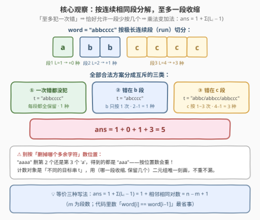
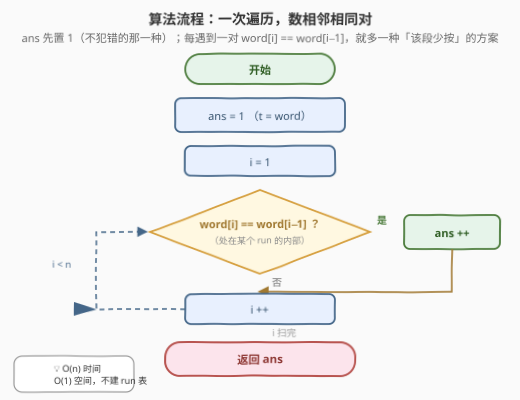
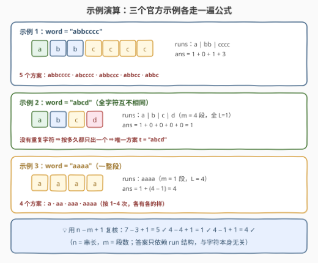

# 找到初始输入字符串 I

- **题目名称**：找到初始输入字符串 I
- **链接**：[3330. 找到初始输入字符串 I](https://leetcode.cn/problems/find-the-original-typed-string-i/)
- **难度**：简单
- **标签**：字符串、计数、一次遍历
- **关联**：与 [3333. 找到初始输入字符串 II](https://leetcode.cn/problems/find-the-original-typed-string-ii/) 同源——本题是「至多犯 1 次错」的加法计数版，3333 升级为「至多犯 t 次错」的组合计数版；3316 / 3324 同属「Alice 打字手滑」宇宙

## 1. 题目概述

Alice 正在电脑上输入一个字符串，但她打字技术比较笨拙，**可能**在一个按键上按太久，导致一个字符被输入**多次**。她**至多**犯这样的错一次。

给定最终显示在屏幕上的字符串 `word`，返回 Alice 一开始**可能想要输入**的字符串 `t` 的总方案数（不同 `t` 的个数）。

**示例 1**：

```text
输入：word = "abbcccc"
输出：5
解释：可能的字符串为 "abbcccc"、"abbccc"、"abbcc"、"abbc" 和 "abcccc"。
```

**示例 2**：

```text
输入：word = "abcd"
输出：1
解释：唯一可能的字符串是 "abcd"。
```

**示例 3**：

```text
输入：word = "aaaa"
输出：4
```

**约束条件**：

- $1 \le \text{word.length} \le 100$
- `word` 只包含小写英文字母

> 💡 **读题关键**：① 错误只有一种形态——**某个字符多按了几次**，即屏幕串 `word` 是原意串 `t` 把**某一段连续相同字符拉长**后的结果；② **至多一次**意味着要么没拉长（$t = \text{word}$），要么恰好一段被拉长；③ 数的是**不同的 $t$**，不是「错误发生的位置」——这俩不是一回事（2.2 的 ⚠️ 详述）。

---

## 2. 解题思路

### 2.1 暴力思路：每段枚举保留几个

把 `word` 切成极长连续相同段（run），第 $i$ 段长 $L_i$。原意串 $t$ 在第 $i$ 段保留 $k_i \in [1, L_i]$ 个字符——朴素地枚举所有组合 $\prod_i L_i$ 种再逐一验证，组合数是乘积级别：全 `a` 串时高达 $100!$，直接爆炸。

> ⚠️ 值得立刻反思：**方案数为什么会从乘法变加法？** 因为「至多犯一次错」——**至多一段**允许 $k_i < L_i$，其余段必须 $k_i = L_i$。选择自由度只剩「哪一段收缩 + 收缩到几个」，两个维度都是线性的，方案数自然是一次遍历可数的和。

### 2.2 核心观察：run 分解 + 加法原理



三条观察：

**观察一：合法方案按「哪一段出错」互斥分组。** 若一次错都没犯，$t = \text{word}$，贡献恰 $1$ 种；若犯了错，错误必然落在**唯一**一段 run 里——该段实际想按 $k < L$ 次、屏幕显示 $L$ 次，其余段原样照抄。

**观察二：每段贡献 $L_i - 1$ 种。** 长为 $L_i$ 的段保留 $k \in \{1, 2, \dots, L_i - 1\}$ 各产生一个不同的 $t$（保留 $L_i$ 个即「没出错」，已计入基准的 $1$）。

**观察三：不同 $(段, k)$ 组合产生不同的 $t$，不重不漏。** run 切分是**极长**切分，比较 $t$ 与 `word` 逐段扫描即可唯一还原 $(段, k)$——因为收缩只可能发生在一处，$t$ 与 `word` 在收缩段之前逐字符相同、该段处 $t$ 更短，二元组被 $t$ 唯一确定。所以按 $(段, k)$ 计数恰好等于按不同 $t$ 计数。

由加法原理：

$$
\text{ans} = 1 + \sum_i (L_i - 1) = 1 + \bigl|\{\, i : \text{word}[i] = \text{word}[i-1] \,\}\bigr| = n - m + 1
$$

其中 $n$ 为串长、$m$ 为段数。**每个相邻相同对**恰对应「该段多保留一个」的一种新方案——代码里根本不用显式建 run 表，数相邻相等对即可。

> ⚠️ **最常见的表述陷阱**：把答案说成「$1 + $ 可删除的多余字符位置数」是**错的**。以 `"aaaa"` 为例，删第 2 个或第 3 个 `a` 位置不同、得到的 $t$ 却都是 `"aaa"`——**按位置数会重复**。必须按「目标串 $t$」计数，用 $(段, 保留个数)$ 二元组刻画才不重不漏。

### 2.3 算法流程图



`ans` 初始化为 $1$（不犯错），从 $i = 1$ 扫到 $n-1$：每遇 `word[i] == word[i-1]` 就 `ans++`。一次线性扫描，无额外空间。

### 2.4 示例演算



- `"abbcccc"`：runs 为 `a | bb | cccc`，$\text{ans} = 1 + 0 + 1 + 3 = 5$，五个方案与官方解释完全一致；
- `"abcd"`：四段全 $L = 1$，没有可收缩的余量，$\text{ans} = 1$；
- `"aaaa"`：一整段 $L = 4$，$\text{ans} = 1 + 3 = 4$，即 `a / aa / aaa / aaaa`。

用 $n - m + 1$ 复核：$7-3+1=5$、$4-4+1=1$、$4-1+1=4$，全部吻合。

---

## 3. 参考代码

### C++

```cpp
class Solution {
  public:
    int possibleStringCount(string word) {
        int ans = 1;                            // 方案一：一次错都没犯，t = word
        for (int i = 1; i < (int)word.size(); ++i)
            if (word[i] == word[i - 1]) ++ans;  // 每个相邻相同对 = 某段「多按一个」的一种新方案
        return ans;
    }
};
```

### Python

```python
class Solution:
    def possibleStringCount(self, word: str) -> int:
        return 1 + sum(a == b for a, b in zip(word, word[1:]))


# 写法二：groupby 显式建 run，与推导一一对应
from itertools import groupby

class Solution:
    def possibleStringCount(self, word: str) -> int:
        return 1 + sum(len(list(g)) - 1 for _, g in groupby(word))
```

> 💡 **实现细节**：① `zip(word, word[1:])` 生成相邻对，`sum` 直接吃布尔值，一行收工；② 不需要真的切分出每段 run——「相邻相等对数」就是 $\sum (L_i - 1)$ 的逐对展开；③ 数据规模 $n \le 100$，`int` 毫无溢出压力（最坏答案 $n = 100$）。

---

## 4. 复杂度分析

| 维度 | 复杂度 | 说明 |
|------|--------|------|
| 时间 | $O(n)$ | 一次线性扫描，每个位置做一次字符比较 |
| 空间 | $O(1)$ | 只维护计数器（Python 写法二的 `groupby` 也是 $O(1)$ 惰性迭代） |
| 答案规模 | $\le n$ | $\text{ans} = n - m + 1$，全相同字符时取到上界 $n$ |

---

## 5. 扩展：3333——「至多犯 t 次错」怎么数？

把「至多一次」放宽为「至多 $t$ 次」（$t \le \text{word.length}$），即**至多 $t$ 段**可以收缩，方案数就回到乘法世界：对段集合的一个子集 $S$（$|S| \le t$），各段独立选保留个数，方案数为

$$
\prod_{i \in S} L_i
$$

再对 $|S| \le t$ 求和——直接枚举子集是指数级，需要沿段序列做背包式 DP：$f[i][j]$ 表示前 $i$ 段、已犯 $j$ 次错的方案数，转移时第 $i$ 段要么原样（不犯错），要么保留 $k \in [1, L_i - 1]$（贡献 $L_i - 1$ 种），最终 $\sum_{j \le t} f[m][j]$。答案要对 $10^9 + 7$ 取模。这正是 [3333. 找到初始输入字符串 II](https://leetcode.cn/problems/find-the-original-typed-string-ii/)（中等）——本题的单遍扫描是其 $t = 1$ 特例的退化形式。

另一个方向的变体：若错误形态改成「按太轻导致字符**丢失**」（屏幕串比原意串短），对称地就是在原意串的 run 里挑一段**拉长**来匹配屏幕，思路同构。

---

## 6. 面试要点

1. **为什么答案是「1 + 相邻相同对数」而不是「1 + 可删字符位置数」？**

   计数对象是**不同的目标串 $t$**，不是错误发生的位置。`"aaaa"` 删第 2、3 个位置的 `a` 得到的都是 `"aaa"`，按位置数会重；按 $(段, 保留个数)$ 二元组计数，每个二元组唯一对应一个 $t$，不重不漏。

2. **为什么不同的 $(段, k)$ 一定对应不同的 $t$？**

   run 是极长连续段，$t$ 与 `word` 逐段比较：收缩段之前的所有段逐字符相同，收缩段处 $t$ 短于 `word`——从 $t$ 出发能唯一还原是哪一段、收缩到几个，双射成立。

3. **「至多犯一次错」在计数结构上起了什么作用？**

   它把「每段独立选保留个数」的**乘法**计数压成「至多一段收缩」的**加法**计数——方案数从 $\prod L_i$ 降为 $1 + \sum (L_i - 1)$，也是本题只需一次扫描的根本原因。

4. **如果 `word` 全是相同字符，答案是几？为什么？**

   $n$。整串是一段 $L = n$ 的 run，$t$ 可以是 $1 \sim n$ 个该字符，各不相同；这也验证了答案上界 $n - m + 1 \le n$。

5. **不重不漏的「基准 1」是什么？什么时候答案为 1？**

   基准 $1$ 是「一次错都没犯」的 $t = \text{word}$ 本身。当所有字符互不相同（$m = n$）时没有可收缩的余量，答案恰为 $1$。

---

## 7. 同类练习题

- [3333. 找到初始输入字符串 II](https://leetcode.cn/problems/find-the-original-typed-string-ii/)：本题进阶版，「至多犯 t 次错」把加法计数升级为子集乘积求和 + 背包 DP 取模
- [1578. 使绳子变成彩色的最短时间](https://leetcode.cn/problems/minimum-time-to-make-rope-colorful/)（[站内题解](../1501-1600/1578_使绳子变成彩色的最短时间.md)）：同样按连续相同段处理——相邻同色必删一个，run 结构决定贪心
- [1446. 连续字符](https://leetcode.cn/problems/consecutive-characters/)（[站内题解](../1401-1500/1446_连续字符.md)）：最裸的 run 扫描，求最长连续段的长度
- [485. 最大连续 1 的个数](https://leetcode.cn/problems/max-consecutive-ones/)（[站内题解](../0401-0500/485_最大连续1的个数.md)）：一遍扫描维护 run 长度的基础模板
- [3316. 从原字符串里进行删除操作的最多次数](https://leetcode.cn/problems/find-maximum-removals-from-source-string/)（[站内题解](../3301-3400/3316_从原字符串里进行删除操作的最多次数.md)）：同属「Alice 打字手滑」宇宙，改成从 source 删字符保子序列，走双序列 DP
