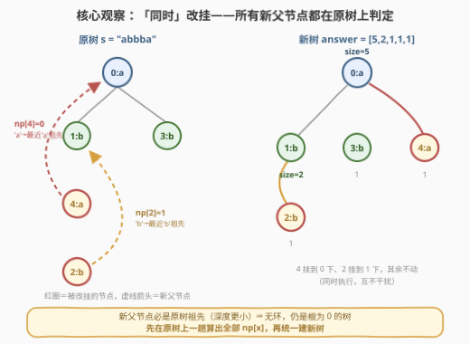
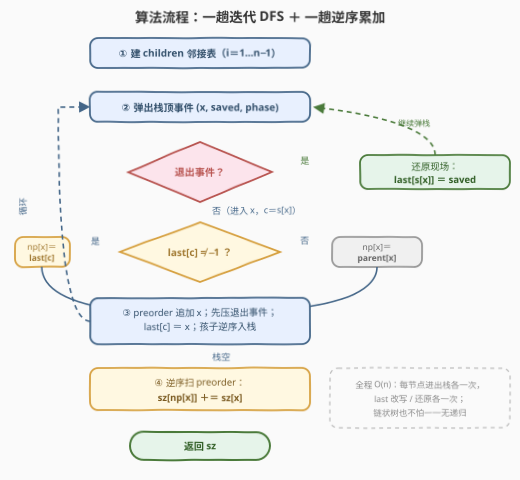
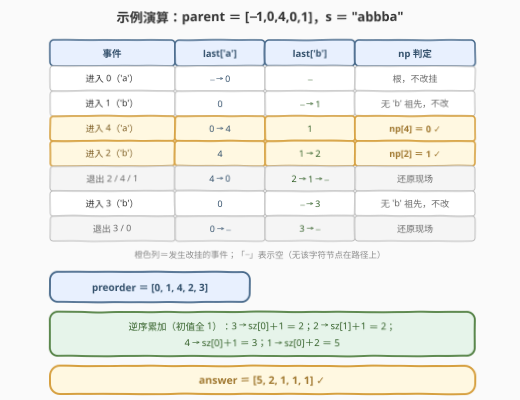

# 修改后子树的大小

- **题目名称**：修改后子树的大小
- **链接**：[3331. 修改后子树的大小](https://leetcode.cn/problems/find-subtree-sizes-after-changes/)
- **难度**：中等
- **标签**：树、深度优先搜索、数组、哈希表、字符串

## 1. 题目概述

给你一棵 $n$ 个节点、根节点编号为 $0$ 的**有根树**，节点编号 $0 \sim n-1$。树用长度为 $n$ 的数组 `parent` 表示，其中 `parent[i]` 是节点 $i$ 的父节点（`parent[0] == -1`）。

再给你一个长度为 $n$ 的字符串 $s$，其中 $s[i]$ 是节点 $i$ 对应的字符。

对于节点编号 $1$ 到 $n-1$ 的每个节点 $x$，我们**同时**执行以下操作**一次**：

1. 找到距离节点 $x$ **最近**的祖先节点 $y$，使得 $s[x] == s[y]$；
2. 如果 $y$ 不存在，不做任何修改；
3. 否则删除 $x$ 与父节点之间的边，在 $x$ 与 $y$ 之间连一条边，$y$ 成为 $x$ 新的父节点。

返回长度为 $n$ 的数组 `answer`，其中 `answer[i]` 是**最终**树中以 $i$ 为根的子树的大小。

**示例 1**：

```text
输入：parent = [-1,0,0,1,1,1], s = "abaabc"
输出：[6,3,1,1,1,1]
解释：节点 3 的父节点从节点 1 变为节点 0。
```

**示例 2**：

```text
输入：parent = [-1,0,4,0,1], s = "abbba"
输出：[5,2,1,1,1]
解释（同时发生）：节点 4 的父节点从 1 变为 0；节点 2 的父节点从 4 变为 1。
```

**约束条件**：

- $n == \text{parent.length} == s.length$
- $1 \le n \le 10^5$
- 对所有 $i \ge 1$：$0 \le \text{parent}[i] \le n - 1$（**父节点编号可以大于孩子**，如示例 2 的 `parent[2] = 4`）
- `parent[0] == -1`，`parent` 表示一棵合法的树
- $s$ 只包含小写英文字母

> 💡 **读题关键**：①「**同时**执行」——所有改挂判定都必须基于**原树**，绝不能边改边查（先改挂的节点会污染后续节点的祖先链）；② 改挂目标 $y$ 是 $x$ 的**祖先**，原树深度严格更小 ⇒ 重连之后依然无环，还是一棵根为 0 的树；③ 每个节点要找的是「最近同字符祖先」——这是典型的 **DFS 路径信息**问题，$n = 10^5$ 要求线性做法。

---

## 2. 解题思路

### 2.1 暴力思路：逐节点向上爬，O(n²)

按题面直译分两步：

1. **找新父节点**：对每个 $x$，从 $\text{parent}[x]$ 开始沿父指针一路向上，遇到的第一个满足 $s[y] == s[x]$ 的节点即为目标 $y$；爬到根都没有则不改挂。单次代价 $O(\text{depth}(x))$；
2. **建新树求子树大小**：由新父节点数组建 `children` 邻接表，一遍 DFS 累加出所有子树大小，$O(n)$。

瓶颈全在第 1 步：链状树下 $\sum_x \text{depth}(x) = \frac{n(n+1)}{2} \approx 5 \times 10^9$，超时约两个数量级。浪费在哪？向上爬的过程中，**绝大多数被扫过的祖先字符不同、纯属路过**；而这些「路过」在不同节点之间高度重复——兄弟节点、堂亲节点共享几乎整条祖先链。

### 2.2 核心观察：DFS 路径 + last[26] 速查表

线性解法由三个环环相扣的观察构成。

**观察一：DFS 进入 $x$ 的那一刻，「活动路径」恰好就是根到 $x$ 的祖先链。**

从根开始 DFS，把所有「已进入、未退出」的节点串起来，正是当前深入的那条路径。于是「$x$ 的最近同字符祖先」根本不需要向上爬——只要在**进入 $x$ 的瞬间**，维护好「当前路径上每种字符最近出现的节点」这张表。

**观察二：一张 26 格小表 `last[c]`，把「沿路径找最近同字符祖先」变成 O(1) 查表。**

`last[c]` ＝ 当前路径上最深的、字符为 $c$ 的节点。进入节点 $x$（记 $c = s[x]$）时：

- **查**：若 `last[c]` 非空，它就是 $x$ 的最近同字符祖先，$\text{np}[x] = \text{last}[c]$；否则不改挂，$\text{np}[x] = \text{parent}[x]$；
- **改**：保存旧值，令 `last[c] = x`，深入孩子；
- **还原**：退出 $x$（孩子全部处理完）时，把 `last[c]` 恢复成旧值。

「进入改写、退出还原」本质是把**递归现场**显式存进了 26 格哈希表——这正是标签 *Hash Table* 的来历（字符集任意大时把数组换成 `dict` / `unordered_map`，进入/退出均摊 $O(1)$ 不变）。

![last[c] 速查表机制](../images/p3331_dfs_last_table.svg)

**观察三：「同时改挂」不会破坏树结构，且新树的子树大小可以一遍倒序累加。**

- **无环**：无论改挂与否，$\text{np}[x]$ 总是 $x$ 的**原树祖先**（改挂目标本就落在根到 $x$ 的路径上），原树深度严格更小；沿 `np` 指针走深度严格递减，必然终止于根 0，且每个节点父唯一 ⇒ 新结构仍是以 0 为根的树；
- **一遍累加**：新树中 $x$ 的孩子都是 $x$ 的**原树后代**（它们的 `np` 都指向 $x$，而 `np` 只会指向原树祖先）。原树先序遍历中「祖先在前、后代在后」，所以**逆序扫先序序列**时，扫到 $x$ 之前它的所有新树孩子都已把 `size` 加给了它——`sz[np[x]] += sz[x]` 一遍过，连第二次 DFS 都不需要。



### 2.3 算法流程



1. 由 `parent` 建 `children` 邻接表（$i$ 从 $1$ 到 $n-1$ 依次挂到 `children[parent[i]]`）；
2. **显式栈** DFS，栈中存三元组 `(节点, 退出时待还原的旧 last 值, 事件类型)`：
   - 弹到**退出事件**：`last[s[x]] = saved`，还原现场；
   - 弹到**进入事件**：查 `last[c]` 定 `np[x]`；记录先序；**先压**自己的退出事件（LIFO 中后弹），再改写 `last[c] = x`；最后孩子逆序压栈；
3. 栈空后**逆序**扫先序序列，执行 `sz[np[x]] += sz[x]`（`sz` 初值全 1，根节点跳过）；
4. 返回 `sz`。

> 💡 **为什么全程迭代**：$n = 10^5$ 的链状树递归深度达 $10^5$——Python 默认递归上限 1000 直接爆栈，C++ 默认栈约 1 MB 同样有溢出风险。显式栈彻底消除这层顾虑。

### 2.4 示例演算

以示例 2 `parent = [-1,0,4,0,1]`，`s = "abbba"` 走完全流程：



1. **进入 0（'a'）**：`last[a]` 为空，根节点不改挂；`last[a] = 0`；
2. **进入 1（'b'）**：`last[b]` 为空，不改挂（父节点 0 是 'a'，帮不上忙）；`last[b] = 1`；
3. **进入 4（'a'）**：`last[a] = 0` ⇒ `np[4] = 0` ✓；`last[a] = 4`；
4. **进入 2（'b'）**：`last[b] = 1` ⇒ `np[2] = 1` ✓——注意 2 的**父亲** 4 就在路径上，但它是 'a'，最近的 'b' 祖先是 1；`last[b] = 2`；
5. **退出 2、4、1**：依次还原 `last[b] = 1`、`last[a] = 0`、`last[b] = -1`；
6. **进入 3（'b'）**：`last[b]` 已还原为空，不改挂；随后退出 3、0。

先序序列 `preorder = [0,1,4,2,3]`；逆序累加：3 → `sz[0]+1`、2 → `sz[1]+1`、4 → `sz[0]+1`、1 → `sz[0]+2`，得 `sz = [5,2,1,1,1]`，与官方一致 ✓。

---

## 3. 参考代码

### C++

```cpp
class Solution {
  public:
    vector<int> findSubtreeSizes(vector<int>& parent, string s) {
        int n = parent.size();
        vector<vector<int>> children(n);
        for (int i = 1; i < n; i++) children[parent[i]].push_back(i);

        // ① 显式栈 DFS：last[c] ＝ 当前路径上最近的字符 c 节点（进入改写 / 退出还原）
        vector<int> np(parent);                  // 拷贝一份：默认「不改挂」
        vector<int> last(26, -1), preorder;
        preorder.reserve(n);
        vector<array<int, 3>> st;                // (节点, 退出时还原的旧值, 0进入/1退出)
        st.push_back({0, -1, 0});
        while (!st.empty()) {
            auto [x, saved, phase] = st.back();
            st.pop_back();
            if (phase) {                         // 退出：还原现场
                last[s[x] - 'a'] = saved;
                continue;
            }
            int c = s[x] - 'a';
            if (last[c] != -1) np[x] = last[c];  // 进入：查最近同字符祖先
            preorder.push_back(x);
            st.push_back({x, last[c], 1});       // 先压退出事件（LIFO 中后弹）
            last[c] = x;                         // 再改写：自己成为路径上最近的 c
            for (int i = (int)children[x].size() - 1; i >= 0; i--)
                st.push_back({children[x][i], -1, 0});
        }

        // ② 逆先序累加：新树孩子必是原树后代、先序中排在 x 之后 ⇒ 扫到 x 时 sz[x] 已就绪
        vector<int> sz(n, 1);
        for (int i = n - 1; i >= 0; i--) {
            int x = preorder[i], p = np[x];
            if (p != -1) sz[p] += sz[x];
        }
        return sz;
    }
};
```

### Python

```python
class Solution:
    def findSubtreeSizes(self, parent: List[int], s: str) -> List[int]:
        n = len(parent)
        children = [[] for _ in range(n)]
        for i in range(1, n):
            children[parent[i]].append(i)

        # ① 显式栈 DFS：last[c] ＝ 当前路径上最近的字符 c 节点（进入改写 / 退出还原）
        np = parent[:]                          # 拷贝一份：默认「不改挂」
        last = [-1] * 26
        preorder = []
        stack = [(0, -1, 0)]                    # (节点, 退出时还原的旧值, 0进入/1退出)
        while stack:
            x, saved, phase = stack.pop()
            if phase:                           # 退出：还原现场
                last[ord(s[x]) - 97] = saved
                continue
            c = ord(s[x]) - 97
            if last[c] != -1:                   # 进入：查最近同字符祖先
                np[x] = last[c]
            preorder.append(x)
            stack.append((x, last[c], 1))       # 先压退出事件（LIFO 中后弹）
            last[c] = x                         # 再改写：自己成为路径上最近的 c
            for y in reversed(children[x]):
                stack.append((y, -1, 0))

        # ② 逆先序累加子树大小
        sz = [1] * n
        for x in reversed(preorder):
            if np[x] != -1:
                sz[np[x]] += sz[x]
        return sz
```

> 💡 **实现细节**：① 退出事件压栈时捕获的是**改写前**的 `last[c]`——即 $x$ 进入前路径上真正的旧值，退出还原后才不会串现场；② 退出事件**先压、孩子后压**，LIFO 保证孩子的整棵子树先处理完才轮到自己的退出；③ 孩子逆序压栈，弹出时即按原顺序访问（本题孩子顺序其实不影响正确性，但保持与递归版一致的好习惯）；④ `np` 初始化为 `parent` 的拷贝，「不改挂」的节点天然正确，无需分支特判。

---

## 4. 复杂度分析

| 维度 | 复杂度 | 说明 |
|------|--------|------|
| 时间复杂度 | $O(n)$ | 建邻接表 $O(n)$ + 显式栈 DFS 每节点进出各一次、`last` 改写/还原各 $O(1)$ + 逆序累加 $O(n)$；$n = 10^5$ 时 Python 实测约 0.1 s |
| 空间复杂度 | $O(n)$ | `children` 邻接表（$n-1$ 条边）+ `np`/`last`/`preorder`/`sz` 各一个长度 $n$（或 26）的数组 + 显式栈最深 $O(n)$（链状树） |
| 暴力对照 | $O(n^2)$ 时间 | 逐节点向上爬祖先链，链状树约 $\frac{n(n+1)}{2} \approx 5 \times 10^9$ 次字符比较，超时约两个数量级 |

实测：两组官方样例 `[6,3,1,1,1,1]` / `[5,2,1,1,1]` ✓；与「逐节点向上爬 + 重建树求 size」的暴力对拍随机数据（$n \le 12$，字符集 `abc`）5000 组全部一致；$n = 10^5$ 的链状树与星状树 Python 均约 0.1 s。

---

## 5. 扩展：路径信息的携带与还原

**这一招的适用边界。** 「DFS 进入改写、退出还原」能维护一切**可 $O(1)$ 撤销的路径信息**：

- **路径最值**：[1448 好节点](https://leetcode.cn/problems/count-good-nodes-in-binary-tree/) 携带路径最大值、[1026 祖先最大差值](https://leetcode.cn/problems/maximum-difference-between-node-and-ancestor/) 同时维护路径 min/max——本题 `last[26]` 只是「26 个字符各一张单值表」的泛化；
- **路径计数**：把 `last[c]` 换成 `cnt[c]`（进入 `+1`、退出 `-1`），即可回答「$x$ 到根的路径上字符 $c$ 出现多少次」这类查询；
- **字符集泛化**：字符不只是 26 个小写字母时，数组换哈希表，进入/退出均摊 $O(1)$ 不变。

**什么时候这招失效？** 当询问对象从「**路径**」变成「**子树**」、且信息不可增量撤销时（例如子树内每种字符的出现次数需要整体聚合）。路径信息随回溯天然消失，子树信息却需要「合并」——那才是 **DSU on tree（树上启发式合并）**、重链剖分或树上莫队的战场。辨析「回溯可撤销的路径信息」与「必须合并的子树信息」，是树上问题的第一道分水岭。

---

## 6. 面试要点

1. **「同时执行」意味着什么？为什么不能边改边查？**

   - 所有节点的改挂判定都基于**原树**：若边改边查，先前节点的重连会改变后续节点的祖先链（把别人改挂后的「新祖先」当成自己的祖先），答案就错了。正确姿势是先在原树上一趟算出全部 `np[x]`，再统一当作新树使用。

2. **改挂之后为什么还是一棵树（无环、根仍是 0）？**

   - 任何 `np[x]`（改挂与否）都是 $x$ 的原树祖先，原树深度严格小于 $\text{depth}(x)$；沿 `np` 指针走深度严格递减，链必终止于深度为 0 的根 0；且每个节点父节点唯一。两个条件合起来 ⇒ 仍是以 0 为根的树。

3. **`last[c]` 的「退出还原」能省掉吗？**

   - 不能。不还原的话，回溯之后 $x$ 仍占据 `last[c]`，但它已不在任何后续节点的「根到节点」路径上；之后进入旁支节点时会把这棵**兄弟子树**里的节点错认成祖先。「祖先」必须是当前活动路径上的节点，这正是退出还原所维持的不变式。

4. **子树大小为什么不用再跑一次 DFS？**

   - 新树中 $x$ 的孩子必是 $x$ 的原树后代（`np` 只指向原树祖先），而原树先序遍历中后代必排在 $x$ 之后；逆序扫先序时，$x$ 的新树孩子们先于 $x$ 被处理，`sz[x]` 在加给父亲之前已累加完毕。一遍线性扫描替代第二次 DFS。

5. **实现上有哪些坑？**

   - ① 链状深度 $10^5$：Python 爆默认递归上限、C++ 栈溢出风险 ⇒ 显式栈迭代；② `parent[i]` 可以大于 $i$（示例 2 的 `parent[2] = 4`），**编号顺序不是拓扑序**，必须真的遍历；③ 退出事件先压、孩子后压，顺序反了会「先还原再访问孩子」，`last` 全乱；④ 根节点 `np[0] = -1`，累加时记得跳过。

---

## 7. 同类练习题

- [1448. 统计二叉树中好节点的数目](https://leetcode.cn/problems/count-good-nodes-in-binary-tree/)（[站内题解](../1401-1500/1448_统计二叉树中好节点的数目.md)）：DFS 携带「路径最大值」的单值版，本题 `last[26]` 是它的 26 值泛化
- [1026. 节点与其祖先之间的最大差值](https://leetcode.cn/problems/maximum-difference-between-node-and-ancestor/)（[站内题解](../1001-1100/1026_节点与其祖先之间的最大差值.md)）：DFS 维护路径 min/max 的进入更新，与本题同一套「路径信息栈」
- [1123. 最深叶节点的最近公共祖先](https://leetcode.cn/problems/lowest-common-ancestor-of-deepest-leaves/)（[站内题解](../1101-1200/1123_最深叶节点的最近公共祖先.md)）：后序自底向上聚合子树信息，对照本题「逆先序累加」的倒序聚合技巧
- [2196. 根据描述创建二叉树](https://leetcode.cn/problems/create-binary-tree-from-descriptions/)（[站内题解](../2101-2200/2196_根据描述创建二叉树.md)）：同是「由 parent/边描述重构树 + 子树统计」，练建树基本功
- [834. 树中距离之和](https://leetcode.cn/problems/sum-of-distances-in-tree/)（[站内题解](../0801-0900/834_树中距离之和.md)）：树上两遍 DFS（换根 DP）进阶，其第一步的子树 size 正是本题的输出
