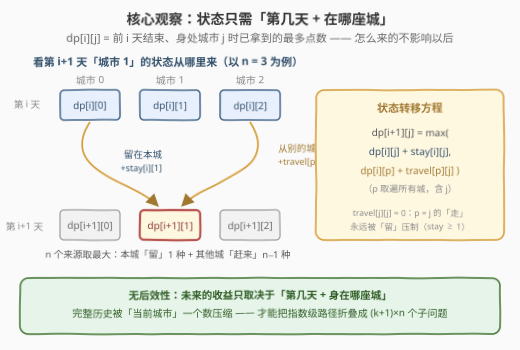
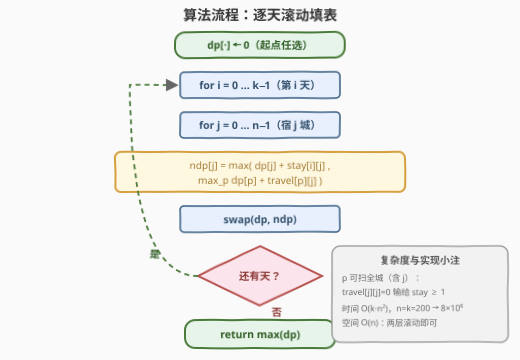
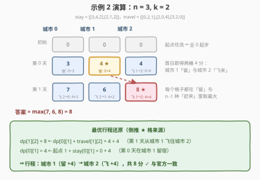

# LeetCode 旅客可以得到的最多点数 题解

## 1. 题目概述

- **标题 / 题号**：旅客可以得到的最多点数（#3332，medium）
- **链接**：https://leetcode.cn/problems/maximum-points-tourist-can-earn/
- **难度**：中等
- **标签**：数组、动态规划、矩阵

**题意**：给你两个整数 $n$ 和 $k$，以及两个二维整数数组 `stayScore` 和 `travelScore`。

一位旅客正在一个有 $n$ 座城市的国家旅游，每座城市都**直接**与其他所有城市相连（完全图）。旅客会旅游**恰好** $k$ 天（下标从 $0$ 开始），且可以**任选**城市作为起点。每一天，旅客都有两个选择：

1. **留在当前城市**：第 $i$ 天停留在前一天所在的城市 `curr`，获得 `stayScore[i][curr]` 点数；
2. **前往另一座城市**：从城市 `curr` 前往城市 `dest`（$\text{dest} \ne \text{curr}$），获得 `travelScore[curr][dest]` 点数。

返回旅客能获得的**最多**点数。

**示例 1**：

```text
输入：n = 2, k = 1, stayScore = [[2,3]], travelScore = [[0,2],[1,0]]
输出：3
解释：旅客从城市 1 出发并停留在城市 1 可以得到最多点数。
```

**示例 2**：

```text
输入：n = 3, k = 2, stayScore = [[3,4,2],[2,1,2]], travelScore = [[0,2,1],[2,0,4],[3,2,0]]
输出：8
解释：旅客从城市 1 出发，第 0 天停留在城市 1，第 1 天前往城市 2，得到 4 + 4 = 8 分。
```

**约束**：

- $1 \le n \le 200$，$1 \le k \le 200$
- $n = \text{travelScore.length} = \text{travelScore[i].length} = \text{stayScore[i].length}$
- $k = \text{stayScore.length}$
- $1 \le \text{stayScore[i][j]} \le 100$，$0 \le \text{travelScore[i][j]} \le 100$
- $\text{travelScore[i][i]} = 0$

> 💡 **读题关键**：① **起点任选且不加分**——等价于「第 0 天开始前身处任意城市、得分均为 0」，无需为起点多设一维状态；② 两种得分绑定关系不同：`stayScore` **按天给出**（第 $i$ 天留城的收益与天数绑定），`travelScore` **与天数无关**（只由 `curr→dest` 决定）；③ 完全图，任意 `curr→dest` 一步可达，不存在中转问题。

## 2. 解题思路

### 2.1 暴力思路：枚举完整行程，O(n^(k+1))

按题面直译：枚举起点（$n$ 种），再枚举每一天的选择——「留城」1 种或「去其余 $n-1$ 座城」$n-1$ 种，合计每天 $n$ 种。总路径数 $n \cdot n^k = n^{k+1}$；$n = k = 200$ 时是 $200^{201}$ 量级，天文数字。

浪费在哪？**不同行程殊途同归**：只要第 $i$ 天结束时身处同一座城市，之后能拿多少分与「之前怎么走的」完全无关——却把整条路径重复展开了 $n^i$ 遍。把「行程」压缩成「(第几天， 在哪座城)」的状态，就是 DP。

### 2.2 核心观察：无后效性——「第几天 + 身在哪座城」

**状态定义**：$dp[i][j]$ = 前 $i+1$ 天（下标 $0 \sim i$）结束、**身处城市 $j$** 时已拿到的最多点数。

**转移方程**（第 $i$ 天结束时人在 $j$，只有两种来历）：

$$
dp[i][j] = \max\Big(\underbrace{dp[i-1][j] + \text{stay}[i][j]}_{\text{留在本城}},\ \ \max_{p \ne j}\underbrace{dp[i-1][p] + \text{travel}[p][j]}_{\text{从 } p \text{ 城赶来}}\Big)
$$

**边界**：$dp[-1][j] = 0$（起点任选、不加分）。**答案**：$\max_j dp[k-1][j]$（终点城市任取）。



三个要点：

- **无后效性是压缩的合法性来源**：未来的收益只由「当前天数 + 当前城市」决定，完整历史被一个城市编号压缩，指数级的路径才折叠成 $(k+1) \times n$ 个子问题——这正是线性 DP 的标准立项依据；
- **$p$ 扫全城（含 $j$）也无妨**：$\text{travel}[j][j] = 0$ 而 $\text{stay} \ge 1$，「走回本城」永远被「留城」压制，代码里不必特判 $p \ne j$；
- **正着推、反着推等价**：官方 hint 给的是反向定义「$dp[i][j]$ = 还剩 $i$ 步、从城市 $j$ 出发的最大得分」——两者互为镜像，本题天数逐天推进、正向填表最顺手的。

### 2.3 算法流程



1. 初始化一维数组 `dp[·] = 0`（第 0 天开始前的状态）；
2. 外层枚举天 $i = 0 \dots k-1$，内层枚举当天归宿 $j = 0 \dots n-1$：`ndp[j] = max(dp[j] + stay[i][j], max_p dp[p] + travel[p][j])`；
3. `swap(dp, ndp)`——**滚动数组**，只保留相邻两层，空间 $O(n)$；
4. $k$ 天结束后返回 `max(dp)`。

### 2.4 示例演算

以示例 2 `n = 3, k = 2` 走完全流程：



1. **初始**：$dp = [0, 0, 0]$；
2. **第 0 天**：$dp \to [3, 4, 4]$——城市 0 留城 $0+3$；城市 1 留城 $0+4$；城市 2 由「城市 1 飞来」$0 + \text{travel}[1][2] = 4$，压过留城的 $0+2$；
3. **第 1 天**：$dp \to [7, 6, 8]$——城市 0 由 2 号城飞来 $4+3=7$；城市 1 由 2 号城飞来 $4+2=6$；城市 2 由 1 号城飞来 $4+4=8$；
4. **答案**：$\max(7,6,8) = 8$ ✓。倒推 ★ 格：第 1 天的 8 来自第 0 天的城市 1，而那个 4 来自留城 ⇒ 行程「城市 1（留）→ 城市 2（飞）」，与官方解释一致。

## 3. 参考代码

### C++

```cpp
class Solution {
  public:
    int maxScore(int n, int k, vector<vector<int>>& stayScore,
                 vector<vector<int>>& travelScore) {
        vector<int> dp(n, 0), ndp(n);                    // dp[-1][·] = 0：起点任选
        for (int i = 0; i < k; i++) {                    // 第 i 天
            for (int j = 0; j < n; j++) {                // 当天结束身在 j 城
                int best = dp[j] + stayScore[i][j];      // 选择一：留在本城
                for (int p = 0; p < n; p++)              // 选择二：从 p 城赶来
                    best = max(best, dp[p] + travelScore[p][j]);
                ndp[j] = best;
            }
            dp.swap(ndp);                                // 滚动一层
        }
        return *max_element(dp.begin(), dp.end());       // 终点任取
    }
};
```

### Python

```python
class Solution:
    def maxScore(self, n: int, k: int, stayScore: List[List[int]], travelScore: List[List[int]]) -> int:
        dp = [0] * n                                     # dp[-1][·] = 0：起点任选
        for i in range(k):                               # 第 i 天
            ndp = [0] * n
            for j in range(n):                           # 当天结束身在 j 城
                best = dp[j] + stayScore[i][j]           # 选择一：留在本城
                for p in range(n):                       # 选择二：从 p 城赶来
                    best = max(best, dp[p] + travelScore[p][j])
                ndp[j] = best
            dp = ndp                                     # 滚动一层
        return max(dp)                                    # 终点任取
```

> 💡 **实现细节**：① $p$ 的循环**不必跳过 $j$**——$\text{travel}[j][j]=0$ 恒小于 $\text{stay} \ge 1$，多算一项不影响正确性；② 滚动数组只留两层，若要**还原具体行程**则需保留整张 $k \times n$ 表并额外记录 `argmax` 前驱；③ 最大总分 $\le k \times 100 = 2 \times 10^4$，`int` 无溢出之虞。

## 4. 复杂度分析

| 维度 | 复杂度 | 说明 |
|------|--------|------|
| 时间复杂度 | $O(k \cdot n^2)$ | 每天每城扫一遍全部 $n$ 个来源；$n = k = 200$ 时约 $8 \times 10^6$ 次基本运算，C++ 毫秒级、Python 约一两秒可通过 |
| 空间复杂度 | $O(n)$ | 滚动数组只保留相邻两层；若保留整表 $O(k \cdot n)$ 用于还原路径 |
| 暴力对照 | $O(n^{k+1})$ 时间 | 枚举全部行程，$n = k = 200$ 时为 $200^{201}$ 量级，完全不可行 |

实测：两组官方样例输出 `3` / `8` ✓；与「DFS 枚举全部行程」的暴力对拍随机数据（$n, k \le 5$、得分 $\le 10$）2000 组全部一致；$n = k = 200$ 的全 100 分矩阵（总分恰为 $20000$）纯 Python 约 1.8 s，C++ 毫秒级。

## 5. 扩展：这一族「逐天选状态」DP 的优化边界

本题是「**阶段 × 状态 + 稠密转移**」DP 的最小完整样本：阶段是天、状态是城、转移代价是一张任意矩阵 `travel[p][j]`。围绕它有三层延伸：

- **还原具体行程**：转移时记 `pre[i][j] = argmax`，结束格倒着回溯到起点，$O(k + n)$ 输出整条路径（滚动数组需改为整表）；
- **转移能否降到 O(n)/天？** 当移动代价**可分解**时可以——如 [1289 下降路径最小和 II](https://leetcode.cn/problems/minimum-falling-path-sum-ii/)（来源无限制⇒直接取上一层最大）、[1937 扣分后的最大得分](https://leetcode.cn/problems/maximum-number-of-points-with-cost/)（代价 $= |p - j|$ 可拆 ⇒ 前缀/后缀 max 预处理）。本题 `travelScore` 是**任意稠密矩阵**，$p \to j$ 的代价两两不同且无结构，$O(n^2)$/天的枚举**不可省**——辨清「代价可分解与否」正是这类题的优化分水岭；
- **状态加约束**：若规定「不能连续两天留城」「每座城至多住一次」等，把该信息并进状态维（如 $dp[i][j][\text{昨天是否留城}]$），套路不变、状态空间膨胀。

## 6. 面试要点

1. **状态为什么是「天 × 城市」两维？依据是什么？**

   - 无后效性：第 $i$ 天之后的收益只依赖「第几天 + 身在哪座城」，与此前路径细节无关；完整历史可被当前城市编号压缩。反过来说，凡是有未来约束（如「每城只住一次」）都会破坏这一表述，需要加维。

2. **起点任选，为什么不需要枚举或加一维状态？**

   - 起点不产生得分，且第 0 天前身处哪座城对转移的影响完全体现在初值里：$dp[-1][j] = 0$ 对所有 $j$ 成立，即「免费站在任意城市」，枚举已被初值吸收。

3. **内层 $p$ 的循环能否跳过 $j$？能否像 1289 那样优化掉？**

   - 跳不跳都对：$\text{travel}[j][j] = 0 < \text{stay} \ge 1$，「走回本城」分支必被留城压制，写不写特判只是常数差异。但 1289/1937 的前缀后缀 max 优化**不适用**：本题转移代价是任意稠密矩阵 `travel[p][j]`，不可按 $|p-j|$ 分解，$O(n^2)$/天已是信息论下界（每对 $(p,j)$ 代价都得看一眼）。

4. **要求输出得分最高的具体行程，怎么改？**

   - 转移时记录 `pre[i][j]`（取到 max 的来源城市），空间退滚动为整表 $O(k \cdot n)$；从 $k-1$ 天的答案格倒序回溯 $k$ 步即得行程，时间不变。

5. **和 931 / 1289 / 1937 / 2304 这一族题的关系？**

   - 同属「逐行（阶段）选列（状态）、行间按代价矩阵转移」的 DP 母题：931 限制只能走相邻列、1289 来源无限制（退化为取上层最大）、1937/2304 代价可分解或稠密——本题是「稠密代价 + max + 起终点均自由」的标准型，$n, k \le 200$ 的数据范围本身就是 $O(k n^2)$ 的提示。

## 同类练习题

| # | 题目 | 与本题的关联 |
|---|------|-------------|
| 931 | [下降路径最小和](https://leetcode.cn/problems/minimum-falling-path-sum/)（[站内题解](../0901-1000/931_下降路径最小和.md)） | 同一母题的 min 版，转移限制在相邻列——先做它建立「逐行填表」直觉 |
| 1289 | [下降路径最小和 II](https://leetcode.cn/problems/minimum-falling-path-sum-ii/)（[站内题解](../1201-1300/1289_下降路径最小和II.md)） | 来源列无限制 ⇒ 前缀/后缀 max 把 $O(n^2)$/行降到 $O(n)$，对照本题理解「可优化」与「不可优化」的分界 |
| 1937 | [扣分后的最大得分](https://leetcode.cn/problems/maximum-number-of-points-with-cost/)（[站内题解](../1901-2000/1937_扣分后的最大得分.md)） | 移动代价 $\|p-j\|$ 可分解的前后缀 max 标准应用，本题的「可分解」镜像 |
| 2304 | [网格中的最小路径代价](https://leetcode.cn/problems/minimum-path-cost-in-a-grid/)（[站内题解](../2301-2400/2304_网格中的最小路径代价.md)） | 稠密转移代价矩阵 `cost[prev][cur]`，与本题 `travelScore` 结构完全同型的 min 版 |
