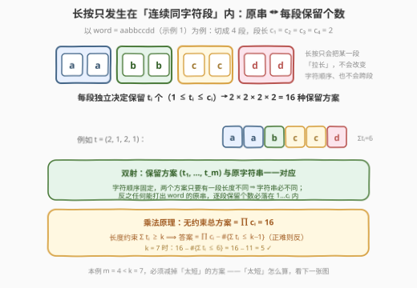
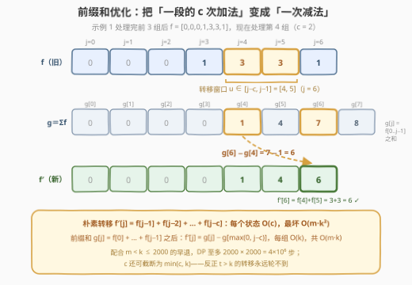
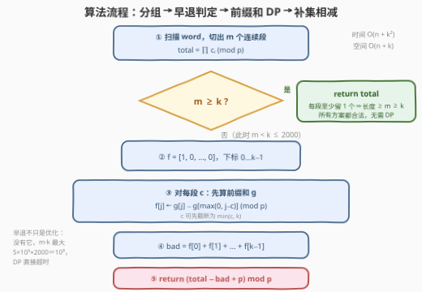
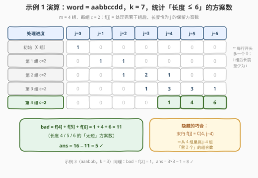

# LeetCode 找到初始输入字符串 II 题解

- **关联**：[3330. 找到初始输入字符串 I](https://leetcode.cn/problems/find-the-original-typed-string-i/) 是本题去掉长度下界 $k$ 的版本（答案就是 $\prod_i c_i$）；计数 DP 的骨架（有界背包 + 前缀和优化）与 [2585. 获得分数的方法数](https://leetcode.cn/problems/number-of-ways-to-earn-points/)（[站内题解](../2501-2600/2585_获得分数的方法数.md)）同形

## 1. 题目概述

- **标题 / 题号**：找到初始输入字符串 II（#3333，hard）
- **链接**：https://leetcode.cn/problems/find-the-original-typed-string-ii/
- **难度**：困难
- **标签**：字符串、动态规划、前缀和

**题意**：Alice 正在电脑上输入一个字符串，但她打字技术比较笨拙，**可能**在一个按键上按太久，导致一个字符被输入**多次**。

给你字符串 `word`，表示**最终**显示在 Alice 屏幕上的结果；再给一个**正**整数 $k$，表示 Alice 一开始输入字符串的长度**至少**为 $k$。返回 Alice 一开始可能想要输入字符串的总方案数，对 $10^9 + 7$ 取余。

**示例 1**：

```text
输入：word = "aabbccdd", k = 7
输出：5
解释：可能的字符串包括 "aabbccdd"、"aabbccd"、"aabbcdd"、"aabccdd" 和 "abbccdd"。
```

**示例 2**：

```text
输入：word = "aabbccdd", k = 8
输出：1
解释：唯一可能的字符串是 "aabbccdd"。
```

**示例 3**：

```text
输入：word = "aaabbb", k = 3
输出：8
```

**约束**：

- $1 \le \text{word.length} \le 5 \times 10^5$
- `word` 只包含小写英文字母
- $1 \le k \le 2000$

> 💡 **读题关键**：① 长按只会把**一个字符**打成**连续多个**——不会改变字符顺序，也不会让不同字符交错，所以重复必然落在「连续同字符段」内；② $n$ 高达 $5\times10^5$ 而 $k \le 2000$，这个两个数量级的悬殊是强烈的算法信号：**长度约束只需要在小值域 $[0, k-1]$ 上做文章**；③ 官方 hint 已点破方向：「与其求至少 $k$，不如求至多 $k-1$」——**正难则反**。

## 2. 解题思路

### 2.1 暴力思路：为什么枚举和正向 DP 都走不通

把 `word` 按「连续相同字符」切段（下称 **run**），段长记为 $c_1, c_2, \dots, c_m$（示例 1 中 `aabbccdd` 切成 `[aa][bb][cc][dd]`，$c = [2,2,2,2]$）。由读题关键 ①，一个原字符串唯一对应「每段各保留多少个」：

$$\text{原字符串集合} \;\longleftrightarrow\; \{(t_1, \dots, t_m) : 1 \le t_i \le c_i\}, \qquad \text{长度} = \sum_i t_i$$

两条暴力路线全部撞墙：

1. **枚举方案**：最坏 `word = "aabbccdd..."` 每段长 2，方案数 $\prod c_i = 2^{n/2} \approx 2^{250000}$，天文数字；
2. **正向 DP**：设 $f[i][j]$ 为前 $i$ 段、总长**恰为** $j$ 的方案数，最后累加 $j \ge k$ 的部分。但 $j$ 的值域是 $[0, n]$，表规模 $m \times n = 5\times10^5 \times 5\times10^5 = 2.5\times10^{11}$，同样没戏。

> 💡 **卡点的本质**：合法长度可以很大（到 $n$），但**不合法**的长度只有 $[m, k-1]$ 至多 1999 种。「求至少」撞上大值域，「求至多」却是小值域——这正是**补集转化**的用武之地。

### 2.2 核心观察一：run 分解 + 双射 + 乘法原理 + 补集转化



**双射为什么成立**（计数不重不漏的根基）：

- 任何一个能打出 `word` 的原串，字符顺序与 `word` 完全一致（长按不换字符），且其第 $i$ 段连续相同字符会被长按拉长成 `word` 的第 $i$ 段——故原串第 $i$ 段长度 $t_i$ 必满足 $1 \le t_i \le c_i$（长按只会拉长不会缩短，也至少保留 1 个）；
- 反过来，任何向量 $(t_1, \dots, t_m)$ 都能拼出一个合法原串；
- 两个不同向量至少有一段长度不同 ⟹ 拼出的字符串必不同。

于是三个式子依次落地：

$$\text{总方案数} = \prod_{i=1}^{m} c_i \pmod{p}$$

$$\text{合法} \iff \sum_i t_i \ge k$$

$$\boxed{\;\text{ans} = \prod_i c_i \;-\; \#\{(t_1,\dots,t_m) : \textstyle\sum_i t_i \le k-1\}\;}$$

**关键剪枝**：每段至少保留 1 个 ⟹ 任意方案长度 $\ge m$。若 $m \ge k$，约束自动满足，**直接返回 $\prod_i c_i$**，DP 一行都不用跑；否则 $m < k \le 2000$，DP 的表规模被牢牢锁死在 $m \times k < k^2 \le 4 \times 10^6$。$n$ 与 $k$ 的悬殊差距，就在这一步被兑现。

### 2.3 核心观察二：前缀和优化的有界背包计数

剩下的任务是数「长度 $\le k-1$」的方案数。设

$$f[i][j] = \text{前 } i \text{ 段、总长恰为 } j \text{ 的方案数}, \qquad 0 \le j \le k-1$$

第 $i$ 段保留 $t$ 个（$1 \le t \le \min(c_i, j)$），转移是标准的**有界背包计数**：

$$f[i][j] = \sum_{t=1}^{\min(c_i,\, j)} f[i-1][j-t]$$

朴素实现每个状态要加 $\min(c_i,j)$ 次，最坏 $O(m \cdot k \cdot k)$。但注意转移的求和项 $f[i-1][j-t]$ 是一段**固定左端点随 $j$ 滑动的区间和**——做一遍前缀和 $g[j] = \sum_{u=0}^{j-1} f[i-1][u]$，转移就变成一次减法：



$$f[i][j] = g[j] - g[\max(0,\, j - c_i)]$$

每组从 $O(k \cdot c_i)$ 降到 $O(k)$，总计 $O(m \cdot k) < O(k^2) \le 4\times10^6$。两个顺手的细节：① $c_i$ 可先截断为 $\min(c_i, k)$——反正 $t > k$ 的转移永远轮不到；② $f$ 滚动成一维数组，空间 $O(k)$。

### 2.4 算法流程



1. 线性扫描 `word`，切出 $m$ 个段，段长 $c_1 \dots c_m$，同时累乘 $\text{total} = \prod c_i \bmod p$；
2. **早退判定**：若 $m \ge k$，返回 `total`；
3. 初始化 $f = [1, 0, \dots, 0]$（长度 $k$，下标 $0 \dots k-1$）；
4. 对每段 $c$：先算前缀和 $g$，再令 $f[j] \leftarrow g[j] - g[\max(0, j-c)] \pmod p$；
5. $\text{bad} = \sum_{j=0}^{k-1} f[j]$，返回 $(\text{total} - \text{bad} + p) \bmod p$。

> ⚠️ **早退不只是常数优化**：没有它，当 $m = 5\times10^5$（如 `ababab...`）时 DP 表是 $5\times10^5 \times 2000 = 10^9$，必然超时。它把 DP 的发生条件压缩到 $m < k \le 2000$，是复杂度成立的一环。

### 2.5 示例演算



拿示例 1（`aabbccdd`，$k=7$）把 DP 表走一遍，$j$ 只列到 $k-1=6$：

| 处理进度 | $j=0$ | $j=1$ | $j=2$ | $j=3$ | $j=4$ | $j=5$ | $j=6$ |
|----------|-------|-------|-------|-------|-------|-------|-------|
| 初始（0 段） | 1 | 0 | 0 | 0 | 0 | 0 | 0 |
| 第 1 段 $c=2$ | 0 | 1 | 1 | 0 | 0 | 0 | 0 |
| 第 2 段 $c=2$ | 0 | 0 | 1 | 2 | 1 | 0 | 0 |
| 第 3 段 $c=2$ | 0 | 0 | 0 | 1 | 3 | 3 | 1 |
| 第 4 段 $c=2$ | 0 | 0 | 0 | 0 | **1** | **4** | **6** |

- $\text{bad} = 1 + 4 + 6 = 11$（长度 4/5/6 的「太短」方案），$\text{ans} = 16 - 11 = 5$ ✓；
- 表里能看见两处结构：**左下角阶梯**——处理完 $i$ 段后长度至少为 $i$，所以每行开头多一个 0；**末行恰为组合数** $f[j] = \binom{4}{j-4}$——4 段等长为 2 时，「长度为 $j$」就是「挑 $j-4$ 段留 2 个」，DP 自己算出了 $\binom{4}{j-4}$，可作 sanity check；
- 示例 3（`aaabbb`，$k=3$）同理：$m=2 < 3$，$\text{total} = 3 \times 3 = 9$，$\text{bad} = f[2] = 1$（两段各留 1），$\text{ans} = 9 - 1 = 8$ ✓。

## 3. 参考代码

### C++

```cpp
class Solution {
  public:
    int possibleStringCount(string word, int k) {
        constexpr int MOD = 1'000'000'007;
        // ① 切分连续段，段长 c_1..c_m，同时累乘总方案数
        vector<int> cnt;
        for (int i = 0, n = word.size(); i < n; ) {
            int j = i;
            while (j < n && word[j] == word[i]) j++;
            cnt.push_back(j - i);
            i = j;
        }
        long long total = 1;
        for (int c : cnt) total = total * c % MOD;   // c < 5e5 < MOD，无需先取模
        int m = cnt.size();
        // ② 早退：每段至少留 1 个 ⇒ 任意方案长度 ≥ m ≥ k，全部合法
        if (m >= k) return total;
        // ③ 有界背包计数：f[j] = 已处理各段、总长恰为 j 的方案数（j ≤ k−1）
        vector<long long> f(k, 0), g(k + 1, 0);
        f[0] = 1;
        for (int c : cnt) {
            for (int j = 0; j < k; j++)              // g[j] = f[0] + … + f[j−1]
                g[j + 1] = (g[j] + f[j]) % MOD;
            c = min(c, k);                           // t > k 的转移永远轮不到
            for (int j = 0; j < k; j++) {
                int lo = max(0, j - c);              // 求和区间 u ∈ [j−c, j−1]
                f[j] = (g[j] - g[lo] + MOD) % MOD;
            }
        }
        // ④ 补集相减
        long long bad = 0;
        for (int j = 0; j < k; j++) bad = (bad + f[j]) % MOD;
        return (total - bad + MOD) % MOD;
    }
};
```

### Python

```python
class Solution:
    def possibleStringCount(self, word: str, k: int) -> int:
        MOD = 1_000_000_007
        # ① 切分连续段
        cnt = []
        i, n = 0, len(word)
        while i < n:
            j = i
            while j < n and word[j] == word[i]:
                j += 1
            cnt.append(j - i)
            i = j
        total = 1
        for c in cnt:
            total = total * c % MOD
        m = len(cnt)
        # ② 早退：长度 ≥ m ≥ k，全部合法
        if m >= k:
            return total
        # ③ 前缀和优化的有界背包（j ≤ k−1）
        f = [1] + [0] * (k - 1)
        for c in cnt:
            g = [0] * (k + 1)
            for j in range(k):
                g[j + 1] = (g[j] + f[j]) % MOD
            c = min(c, k)
            for j in range(k):
                f[j] = (g[j] - g[max(0, j - c)]) % MOD   # Python % 天然非负
        # ④ 补集相减
        bad = sum(f) % MOD
        return (total - bad) % MOD
```

> 💡 **实现细节**：① `total` 累乘时 $c_i \le 5\times10^5 < p$，不用先对 $c_i$ 取模；② 早退判断**必须**放在 DP 之前（见 2.4 的 ⚠️）；③ C++ 减法取模要 `+ MOD` 防负数，Python 的 `%` 天然返回非负，直接减即可；④ `g` 开到 $k+1$ 长度，`g[j]` 恰好是 $f[0..j-1]$ 之和，`max(0, j-c)` 保证下标不越界。

## 4. 复杂度分析

| 维度 | 复杂度 | 说明 |
|------|--------|------|
| 时间复杂度 | $O(n + k^2)$ | 切段与累乘 $O(n)$；DP 仅在 $m < k$ 时发生，$m \cdot k < k^2 \le 4\times10^6$ |
| 空间复杂度 | $O(n + k)$ | 段长数组 $O(n)$ + 滚动 DP 的 $f$、$g$ 各 $O(k)$ |
| 暴力对照 | $O(\prod c_i)$ 枚举 / $O(m \cdot n)$ 正向 DP | 前者最坏 $2^{n/2}$，后者 $2.5\times10^{11}$，都不可行 |

实测：官方三例 `5 / 1 / 8` ✓；与「暴力枚举 $\prod c_i$ 个保留向量再数长度」对拍随机数据（$n \le 14$，字符集 `a`/`ab`/`abc`，$k \le 15$）3000 组全部一致；$n = 5\times10^5$、$k = 2000$ 的极端串（单一字符、`ab` 交替、`(aaab b)×10^5`）Python 全程 0.3 s 内完成。

## 5. 扩展：这一套组合拳的变体

**「正难则反」的完整谱系**。本题的转化是 $\text{atLeast}(k) = \text{total} - \text{atMost}(k-1)$，更常见的形式是 $\text{exactly}(k) = \text{atMost}(k) - \text{atMost}(k-1)$（[1248 统计「优美子数组」](https://leetcode.cn/problems/count-number-of-nice-subarrays/)（[站内题解](../1201-1300/1248_统计优美子数组.md)）是教科书例子）。共性在于：**直接计数的目标值域大、补集的值域小时，转化立赚**。

**前缀和优化还有更彻底的形态**。本题每组只扫一遍，$O(m \cdot k)$ 已经够用；[2902 和带限制的子多重集合的数目](https://leetcode.cn/problems/count-of-sub-multisets-with-bounded-sum/)（[站内题解](../2901-3000/2902_和带限制的子多重集合的数目.md)）面对 $n$ 个物品、$c_i$ 大量重复的局面，先按值分组，再把前缀和按「除以 $c$ 的余数」分类，把复杂度压到 $O(n + k\sqrt{k})$——是本题技术的加强版。

**值域截断思想**。「DP 第二维只开到 $k-1$、多余的长度一概不区分」并非本题专利：[2585 获得分数的方法数](https://leetcode.cn/problems/number-of-ways-to-earn-points/)（[站内题解](../2501-2600/2585_获得分数的方法数.md)）的 `target ≤ 1500`、0-1 背包求「体积恰为容量」的答案，都是同一招——**约束的值域有多小，状态就开多小**。

## 6. 面试要点

1. **为什么原字符串集合与「每段保留个数向量」是一一对应？**

   - 长按不改变字符顺序、只把某段连续字符拉长 ⟹ 原串与 `word` 的 run 结构逐段对齐，且第 $i$ 段长度 $t_i \in [1, c_i]$；反过来任何向量都能拼出合法原串；不同向量必有一段长度不同，拼出的串必不同。三句话合起来即双射，计数不重不漏。

2. **$m \ge k$ 时为什么可以直接返回乘积？这个判断能去掉吗？**

   - 每段至少保留 1 个 ⟹ 任意方案长度 $\ge m \ge k$，约束恒成立。不能去掉：DP 第二维只开 $k$ 格，若 $m$ 可达 $5\times10^5$，表就是 $10^9$ 格；正是这个判断把 DP 的发生条件限制在 $m < k \le 2000$，是复杂度成立的必要环节而非常数优化。

3. **「至少 $k$」为什么要转成「总数 − 至多 $k-1$」？**

   - 「至少」的和值域延伸到 $n = 5\times10^5$，状态爆炸；「至多 $k-1$」的值域只有 2000。补集转化的收益来自两侧值域的不对称——判断该不该转化，先比较两边的值域大小。

4. **前缀和优化是怎么找到的？**

   - 写出朴素转移 $f[i][j] = \sum_{t=1}^{c_i} f[i-1][j-t]$ 后观察：固定 $i$ 时它是「左端点随 $j$ 滑动的定长区间和」——这正是前缀和的标志性形态。一旦认出「滑动区间和」，$O(c)$ 转 $O(1)$ 就是肌肉记忆。

5. **有哪些边界与取模的坑？**

   - ① 单段长串（$m=1$）要走 DP 分支时注意 $k \ge 2$，`bad` = $\min(c_1, k-1)$；② `total − bad` 可能为负，C++ 必须 `+ MOD` 再取模；③ $c_i$ 截断为 $\min(c_i, k)$ 只对 bad 计数合法——它只出现在 $j \le k-1$ 的转移里；④ $k = 1$ 时必有 $m \ge k$，早退直接返回，DP 分支天然不触发。

## 同类练习题

| # | 题目 | 与本题的关联 |
|---|------|-------------|
| 3330 | [找到初始输入字符串 I](https://leetcode.cn/problems/find-the-original-typed-string-i/) | 本题去掉长度约束的版本，答案就是 $\prod_i c_i$，适合作为第一步热身，体会双射的建立过程 |
| 2585 | [获得分数的方法数](https://leetcode.cn/problems/number-of-ways-to-earn-points/)（[站内题解](../2501-2600/2585_获得分数的方法数.md)） | 有界背包计数 + 同款「前缀和把 $O(c)$ 转移降到 $O(1)$」，转移骨架与本题完全同形 |
| 2902 | [和带限制的子多重集合的数目](https://leetcode.cn/problems/count-of-sub-multisets-with-bounded-sum/)（[站内题解](../2901-3000/2902_和带限制的子多重集合的数目.md)） | 多重背包计数的加强版——按值分组 + 余数类前缀和，本题技术的进阶方向 |
| 1248 | [统计「优美子数组」](https://leetcode.cn/problems/count-number-of-nice-subarrays/)（[站内题解](../1201-1300/1248_统计优美子数组.md)） | $\text{exactly}(k) = \text{atMost}(k) - \text{atMost}(k-1)$ 补集转化的经典出处，与本题「正难则反」同宗 |
| 518 | [零钱兑换 II](https://leetcode.cn/problems/coin-change-ii/)（[站内题解](../0501-0600/518_零钱兑换II.md)） | 无界背包计数入门，对照理解「物品个数有上界 $c_i$」对转移区间的影响 |
