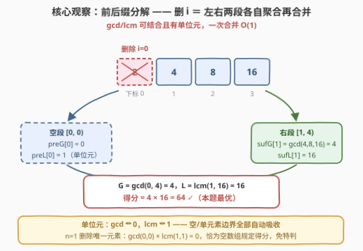
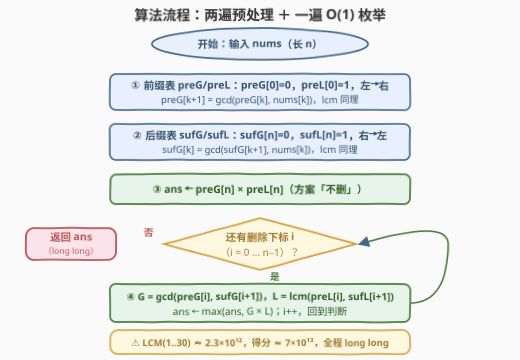
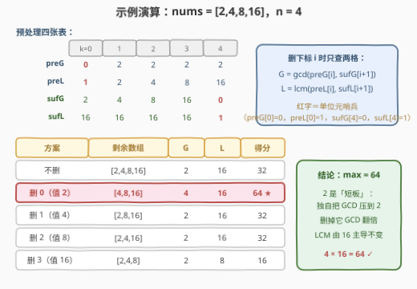

# LeetCode 数组的最大因子得分 题解

## 1. 题目概述

- **标题 / 题号**：数组的最大因子得分（#3334，medium）
- **链接**：https://leetcode.cn/problems/find-the-maximum-factor-score-of-array/
- **难度**：中等
- **标签**：数组、数学、数论、最小公倍数、前后缀分解

**题意**：给你一个整数数组 `nums`。**因子得分**定义为数组所有元素的**最小公倍数**（LCM）与**最大公约数**（GCD）的**乘积**。

在**最多**移除一个元素的情况下，返回 `nums` 的**最大因子得分**。

注意，单个数字的 LCM 和 GCD 都是其本身，而**空数组**的因子得分为 0。

**示例 1**：

```text
输入：nums = [2,4,8,16]
输出：64
解释：移除数字 2 后，剩余元素的 GCD 为 4，LCM 为 16，因此最大因子得分为 4 * 16 = 64。
```

**示例 2**：

```text
输入：nums = [1,2,3,4,5]
输出：60
解释：无需移除任何元素即可获得最大因子得分 60。
```

**示例 3**：

```text
输入：nums = [3]
输出：9
```

**约束**：

- $1 \le \text{nums.length} \le 100$
- $1 \le \text{nums}[i] \le 30$

> 💡 **读题关键**：① 「最多移除一个」= 在「不删」和「删下标 $i$（$n$ 种）」共 $n+1$ 个方案里取最大；② 因子得分只与剩余元素的**多重集合**有关，与顺序无关；③ 值域 $\le 30$ 看着人畜无害，但 $\mathrm{lcm}(1,\dots,30) \approx 2.33\times10^{12}$——**LCM 与得分都会溢出 32 位整数**，C++ 必须开 `long long`。

## 2. 解题思路

### 2.1 暴力思路：$n+1$ 个方案，每个 $O(n)$ 重算

最直接的做法：枚举「不删」以及删除每个下标 $i$，对每个方案从头扫一遍剩余数组算出 GCD 与 LCM：

```cpp
for (int i = 0; i <= n; ++i) {          // i == n 表示不删
    long long g = 0, l = 1;
    for (int j = 0; j < n; ++j)
        if (j != i) { g = gcd(g, nums[j]); l = lcm(l, nums[j]); }
    ans = max(ans, g * l);
}
```

总代价 $O(n^2)$（准确说是 $O(n^2\log U)$，$U$ 为值域）。$n \le 100$ 时约 $10^4$ 步，轻松通过——**暴力本身就是合法标程**。但每个方案都在重复算几乎相同的 gcd/lcm：删下标 $i$ 与删 $i+1$ 的两个方案，前 $i$ 个元素的聚合结果完全一样却被重算。消除这种重复，正是**前后缀分解**的用武之地。

### 2.2 核心观察：gcd/lcm 可结合、有单位元 → 前后缀分解

**gcd 和 lcm 都是可结合、可交换的二元运算，且各自拥有单位元**：

$$\gcd(0, x) = x, \qquad \mathrm{lcm}(1, x) = x$$

于是「删除下标 $i$ 后全数组的聚合」可以拆成**左段 $[0, i)$ 与右段 $(i, n)$ 各自聚合，再合并一次**：

$$G_i = \gcd\big(\text{preG}[i],\ \text{sufG}[i+1]\big), \qquad L_i = \mathrm{lcm}\big(\text{preL}[i],\ \text{sufL}[i+1]\big)$$

其中前缀、后缀表一遍线性递推即可（以 gcd 为例，$\text{preG}[0] = 0$，$\text{preG}[k+1] = \gcd(\text{preG}[k],\ \text{nums}[k])$；后缀对称，$\text{sufG}[n] = 0$）。这样 $n+1$ 个方案的每一个都从 $O(n)$ 降到 $O(1)$。



> 💡 **单位元顺手解决了所有边界**：
>
> - 删除首元素：$\text{preG}[0] = 0$、$\text{preL}[0] = 1$ 与右段合并，右段结果原样通过；
> - $n = 1$ 时删除唯一元素：$G = \gcd(0, 0) = 0$，$L = \mathrm{lcm}(1,1) = 1$，得分 $0 \times 1 = 0$——**恰好就是题目规定的空数组得分**，无需任何特判。
>
> 这正是代数里**幺半群**（可结合 + 单位元）的好处：边界由单位元自然吸收。sum 的 0、max 的 $-\infty$、按位与的全 1，都是同一招。

> ⚠️ **溢出是本题主坑**：值域虽只有 $1\sim30$，但 $\mathrm{lcm}(1,\dots,30) = 16\cdot27\cdot25\cdot7\cdot11\cdot13\cdot17\cdot19\cdot23\cdot29 = 2\,329\,089\,562\,800 \approx 2.33\times10^{12}$，已超 `int32`；得分还要再乘 GCD（可达 $\approx 7\times10^{13}$）。C++ 中聚合过程与最终得分都必须用 `long long`（Python 天然大整数无此虑）。

### 2.3 算法流程：两遍预处理 + 一遍枚举

$$\underbrace{\text{preG},\ \text{preL}}_{\text{左→右一遍}} \;\to\; \underbrace{\text{sufG},\ \text{sufL}}_{\text{右→左一遍}} \;\to\; \underbrace{\text{ans} = \text{preG}[n]\times\text{preL}[n]}_{\text{不删}} \;\to\; \underbrace{\text{枚举删} i}_{O(1)\ \text{each}} \;\to\; \max$$



### 2.4 示例演算

以示例 1 `nums = [2,4,8,16]` 走完全流程：



1. **前缀表**：`preG = [0,2,2,2,2]`，`preL = [1,2,4,8,16]`；
2. **后缀表**：`sufG = [2,4,8,16,0]`，`sufL = [16,16,16,16,1]`；
3. **不删**：$G=2$，$L=16$，得分 $32$；
4. **枚举删除**（合并左右段，见上图表格）：删 2 → $4\times16=64$；删 4 → $2\times16=32$；删 8 → $2\times16=32$；删 16 → $2\times8=16$；
5. **取最大**：$\max(32, 64, 32, 32, 16) = 64$ ✓。

直觉解释：`2` 是「木桶最短板」——它独自把 GCD 压到 2；删掉它后 GCD 翻倍到 4，而 LCM 由 16 主导不受影响，得分最大化。

## 3. 参考代码

### C++

```cpp
class Solution {
  public:
    long long maxScore(vector<int>& nums) {
        int n = nums.size();
        vector<long long> preG(n + 1), preL(n + 1), sufG(n + 2), sufL(n + 2);

        preG[0] = 0;  preL[0] = 1;                    // 单位元：gcd→0，lcm→1
        for (int i = 0; i < n; ++i) {
            preG[i + 1] = gcd(preG[i], nums[i]);
            preL[i + 1] = lcm(preL[i], nums[i]);
        }
        sufG[n] = 0;  sufL[n] = 1;
        for (int i = n - 1; i >= 0; --i) {
            sufG[i]     = gcd(sufG[i + 1], nums[i]);
            sufL[i]     = lcm(sufL[i + 1], nums[i]);
        }

        long long ans = preG[n] * preL[n];            // 方案①：不删
        for (int i = 0; i < n; ++i)                   // 方案②：删下标 i
            ans = max(ans, gcd(preG[i], sufG[i + 1]) * lcm(preL[i], sufL[i + 1]));
        return ans;
    }
};
```

### Python

```python
class Solution:
    def maxScore(self, nums: List[int]) -> int:
        n = len(nums)
        pre_g = [0] * (n + 1)          # 单位元：gcd→0，lcm→1
        pre_l = [1] * (n + 1)
        for i, x in enumerate(nums):
            pre_g[i + 1] = gcd(pre_g[i], x)
            pre_l[i + 1] = lcm(pre_l[i], x)
        suf_g = [0] * (n + 2)
        suf_l = [1] * (n + 2)
        for i in range(n - 1, -1, -1):
            suf_g[i] = gcd(suf_g[i + 1], nums[i])
            suf_l[i] = lcm(suf_l[i + 1], nums[i])

        ans = pre_g[n] * pre_l[n]      # 方案①：不删
        for i in range(n):             # 方案②：删下标 i
            ans = max(ans, gcd(pre_g[i], suf_g[i + 1]) * lcm(pre_l[i], suf_l[i + 1]))
        return ans
```

> 💡 **实现细节**：① `std::gcd` / `std::lcm` 需要 C++17（`<numeric>`），`math.gcd` / `math.lcm` 需要 Python 3.9+，LeetCode 环境均满足；② 后缀表开到 `n + 2` 是为了让 `suf[i + 1]` 在 $i = n-1$ 时也能直接访问哨兵 `suf[n]`；③ 答案初值取「不删」方案，循环只处理「删一个」，逻辑互不重叠。

## 4. 复杂度分析

| 维度 | 复杂度 | 说明 |
|------|--------|------|
| 时间复杂度 | $O(n \log U)$ | 两遍预处理 + 一遍枚举，每步至多 4 次 gcd/lcm；$U \le 30$ 时 $\log U \le 5$，实际就是线性 |
| 空间复杂度 | $O(n)$ | `preG/preL/sufG/sufL` 四张表，各 $n+1$ 或 $n+2$ 个元素 |
| 暴力对照 | $O(n^2 \log U)$ | $n \le 100$ 时约 $10^4$ 步也能过；前后缀版在 $n$ 放大到 $10^6$ 时依然线性 |

实测：三组官方样例 $64 / 60 / 9$ ✓；与暴力 $O(n^2)$ 对拍随机数据（$n \le 12$，$\text{nums}[i] \le 30$）20000 组全部一致；极端数据 `[1..30] × 3 + [30]×10`（$n = 100$）得分 $2.33\times10^{12}$，`long long` 安然无恙。

## 5. 扩展：幺半群上的「除自身以外」与素因子视角

**任意幺半群聚合都能套同一模板。** 前后缀分解并不关心聚合具体是什么，只要**可结合 + 有单位元**即可：sum（单位元 0）、max（$-\infty$）、按位与（全 1）、按位或（0）、字符串哈希拼接、甚至矩阵乘法，全都能 $O(n)$ 回答「去掉位置 $i$ 后的聚合」。区别在于：[238. 除自身以外数组的乘积](../0201-0300/238_除自身以外数组的乘积.md) 的乘法在**非零元素**意义下有逆元（除法），于是可以再省掉后缀表做到 $O(1)$ 额外空间滚动；而 gcd/lcm **没有逆元**（由 $\gcd$ 反推不出被合并的数），只能老老实实存显式后缀表——这也是为什么 238 是「进阶 $O(1)$ 空间」而本题不硬求空间。

**值域 $\le 30$ 的替代路线：枚举「删的值」而非下标。** 因子得分只依赖剩余元素的多重集合，同值元素删哪个都一样——而值域只有 30 种，所以只需枚举至多 30 种「删的值」。进一步用**素因子视角**：$\le 30$ 的素数只有 10 个，LCM 由每个素数的**最大出现幂次**决定，GCD 由**最小出现幂次**决定；维护每个「素数， 幂次」的最大值与次大值归属，删一个元素时只有该元素贡献的那些「最大值」需要被次大值顶替。这条路线看似绕，却是「删除至多 $k$ 个元素」这类 follow-up 的敲门砖——前后缀只能隔离一个缺口，而素因子表可以同时掩护 $k$ 个删除。

## 6. 面试要点

1. **为什么 LCM 必须用 `long long`？**

   - 值域虽只有 $1\sim30$，但 $\mathrm{lcm}(1,\dots,30) \approx 2.33\times10^{12}$ 已超 `int32`（约 $2.1\times10^9$）上限三个数量级；最终得分还要乘上 GCD，可达 $\approx 7\times10^{13}$。**「元素小」不等于「聚合值小」**，LCM 是乘法级膨胀。

2. **单位元分别是什么？如何消掉边界特判？**

   - $\gcd$ 的单位元是 $0$（$\gcd(0,x)=x$），$\mathrm{lcm}$ 的单位元是 $1$。前缀表以 $0/1$ 起步、后缀表以 $0/1$ 收尾，删除首/尾元素时空段自动「透明」；$n=1$ 删除唯一元素得 $\gcd(0,0)\times\mathrm{lcm}(1,1)=0$，与「空数组得分为 0」的规定天然吻合。

3. **和 238「除自身以外数组的乘积」是什么关系？**

   - 同为「去掉位置 $i$ 后的聚合」的前后缀分解模板。差异在于乘法（模意义/非零时）有逆元可除，能优化到 $O(1)$ 额外空间；gcd/lcm 无逆元，必须保留显式后缀表，时间同为 $O(n)$。

4. **$O(n^2)$ 暴力就能过，为什么还要写 $O(n)$？**

   - 一是模式价值：把聚合换成任何幺半群运算，模板原样复用；二是扩展性：$n$ 提到 $10^6$ 时暴力 $10^{12}$ 步必死，前后缀版依旧线性；三是面试叙事——先给暴力再给优化，正好展示「发现重复计算 → 用预处理消灭」的思维链。

5. **「最多移除一个」包含哪些方案？初值怎么设？**

   - 共 $n+1$ 个：不删 + 删每个下标。答案初值取「不删」的得分（前后缀表直接给出 $\text{preG}[n]\times\text{preL}[n]$），保证 $n=1$ 时至少有 $x^2$ 可选；删除方案只会让空数组（仅当 $n=1$）得 0，被 $\max$ 自然淘汰。

## 同类练习题

| # | 题目 | 与本题的关联 |
|---|------|-------------|
| 238 | [除自身以外数组的乘积](https://leetcode.cn/problems/product-of-array-except-self/)（[站内题解](../0201-0300/238_除自身以外数组的乘积.md)） | 前后缀分解母题，对照「有逆元可除 → $O(1)$ 空间」与本题「无逆元 → 显式后缀表」 |
| 3312 | [查询排序后的最大公约数](https://leetcode.cn/problems/sorted-gcd-pair-queries/)（[站内题解](../3301-3400/3312_查询排序后的最大公约数.md)） | gcd 的值域统计姊妹题——数对数不动、gcd 取值数得动的规模对比思想 |
| 2447 | [最大公因数等于 K 的子数组数目](https://leetcode.cn/problems/number-of-subarrays-with-gcd-equal-to-k/)（[站内题解](../2401-2500/2447_最大公因数等于K的子数组数目.md)） | 子数组 gcd 的增量维护，练熟「加一个元素 gcd 只减不增」的单调性 |
| 2654 | [使数组所有元素变成 1 的最少操作次数](https://leetcode.cn/problems/minimum-number-of-operations-to-make-all-array-elements-equal-to-1/)（[站内题解](../2601-2700/2654_使数组所有元素变成1的最少操作次数.md)） | gcd 场景下的子数组最短/操作数问题，gcd 应用型综合 |
| 1819 | [序列中不同最大公约数的数目](https://leetcode.cn/problems/number-of-different-subsequences-gcds/)（[站内题解](../1801-1900/1819_序列中不同最大公约数的数目.md)） | 子序列 gcd 能取多少种值，值域筛视角的进阶练习 |
