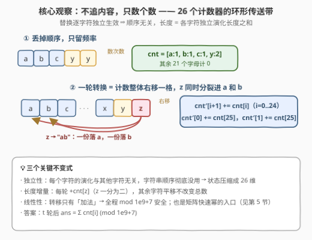
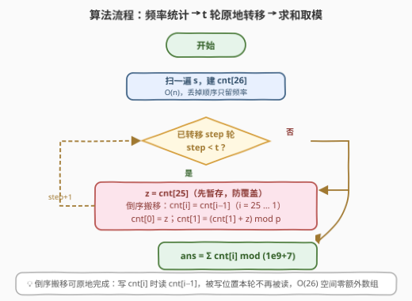
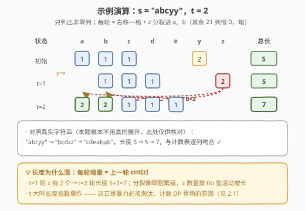

# LeetCode 字符串转换后的长度 I 题解

- **关联**：3337（版本 II）是本题的数据加强版（$t$ 放大到 $10^9$），本文的 $O(26t)$ 计数模拟需升级为矩阵快速幂（见第 5 节）

## 1. 题目概述

- **标题 / 题号**：字符串转换后的长度 I（#3335，medium）
- **链接**：https://leetcode.cn/problems/total-characters-in-string-after-transformations-i/
- **难度**：中等
- **标签**：哈希表、数学、字符串、动态规划、计数

**题意**：给你一个字符串 `s` 和一个整数 `t`，表示要执行的**转换**次数。每次**转换**需要根据以下规则替换字符串 `s` 中的每个字符：

- 如果字符是 `'z'`，则将其替换为字符串 `"ab"`；
- 否则，将其替换为字母表中的**下一个**字符（`'a'` → `'b'`，`'b'` → `'c'`，依此类推）。

返回**恰好**执行 $t$ 次转换后得到的字符串的**长度**。由于答案可能非常大，返回其对 $10^9 + 7$ 取余的结果。

**示例 1**：

```text
输入：s = "abcyy", t = 2
输出：7
解释："abcyy" → "bcdzz" → "cdeabab"，最终长度为 7。
```

**示例 2**：

```text
输入：s = "azbk", t = 1
输出：5
解释："azbk" → "babcl"，最终长度为 5。
```

**约束**：

- $1 \le \textit{s.length} \le 10^5$
- `s` 仅由小写英文字母组成
- $1 \le t \le 10^5$

> 💡 **读题关键**：① 替换是**逐字符独立**的——每个字符变成什么只取决于它自己，与其他字符无关；② `'z'` 是唯一「一分为二」的字符，也是长度增长的**唯一来源**；③ 要的是**长度**而非字符串本身——这是「不必真模拟」的最大暗示；④ 版本 I 的 $t \le 10^5$ 允许 $O(26t)$ 逐轮模拟，但姊妹题 [3337. 版本 II](https://leetcode.cn/problems/total-characters-in-string-after-transformations-ii/)把 $t$ 放大到 $10^9$，逼你上矩阵快速幂。

## 2. 解题思路

### 2.1 暴力思路：真把字符串滚 $t$ 轮

最直觉的做法是每轮重建字符串：遍历 `s`，`'z'` 拼上 `"ab"`，其余字符加一：

```python
class Solution:
    def lengthAfterTransformations(self, s: str, t: int) -> int:
        for _ in range(t):
            s = ''.join('ab' if c == 'z' else chr(ord(c) + 1) for c in s)
        return len(s) % (10**9 + 7)
```

小 $t$ 完全正确，问题出在**长度的增长方式**：每轮长度增量恰为当前 `'z'` 的个数，而 `'z'` 的产生像细胞分裂——一个 `'z'` 走完一圈（26 轮）回来变成**两个**潜在的 `'z'` 工厂。单个 `'z'` 的长度序列是 $1, 2, 2, \ldots, 2, 3, \ldots$，增长率是**斐波那契型**的（记号见第 5 节：$G(j) = G(j-26) + G(j-25)$）。粗算一下：$t = 100$ 时长度已超过 $10^{20}$；$t = 10^5$ 时长度约有 $10^{8000}$ 位——内存与时间双双爆炸，第 10 轮之后这方案就基本宣告死亡。

> ⚠️ **暴力真正的死因不是「慢」而是「状态本身天文数字」**。优化方向因此非常明确：**别存字符串，存能推出长度的最小信息**。

### 2.2 核心观察：字符独立 ⇒ 26 个计数器就够了



**观察一：顺序无关**。替换规则逐字符独立，两个字符无论谁前谁后，演化结果互不干扰。最终长度 = 各字符独立演化后的长度之和。于是字符串可以**压缩成 26 维频率向量** $\textit{cnt}[0..25]$（`cnt[i]` = 字母 $i$ 的出现次数），$O(n)$ 一次统计即可。

**观察二：一轮转换 = 计数环形右移一格 + z 分裂**。非 `'z'` 字母统一「进一格」，对应 $\textit{cnt}$ 整体右移；`'z'` 一分为二，一份进 `'a'`、一份进 `'b'`。写成转移方程：

$$\textit{cnt}'[i+1] \mathrel{+}= \textit{cnt}[i] \ (i = 0..24), \qquad \textit{cnt}'[0] \mathrel{+}= \textit{cnt}[25], \quad \textit{cnt}'[1] \mathrel{+}= \textit{cnt}[25]$$

**观察三：长度增量 = 上一轮 cnt[25]**。右移不改变总量，唯有 `'z'` 分裂让总数每轮恰好增加 $\textit{cnt}[25]$。这个不变式同时解释了 2.1 的爆炸增长与本题答案的取模必要性。

这本质上是一个**26 维线性递推 DP**：状态是频率向量，转移是固定的线性映射，跑 $t$ 轮后求和。因为只有加法，全程 $\bmod\ 10^9+7$ 安全无坑。

### 2.3 算法流程图



三步走：① 扫一遍 `s` 建频率；② 循环 $t$ 次，每次**暂存** `z = cnt[25]` 后倒序搬移 `cnt[i] = cnt[i-1]`（$i$ 从 25 到 1），再 `cnt[0] = z`、`cnt[1] += z`；③ 求和取模输出。倒序搬移保证**原地**完成——写 `cnt[i]` 时读 `cnt[i-1]`，被覆盖的位置本轮不再被读。

### 2.4 示例演算



以 $\textit{s} = \text{"abcyy"},\ t = 2$ 走完全流程（只列非零列）：

| 状态 | a | b | c | d | e | y | z | 总长 |
|------|---|---|---|---|---|---|---|------|
| 初始 | 1 | 1 | 1 | – | – | 2 | – | 5 |
| $t=1$ | – | 1 | 1 | 1 | – | – | 2 | 5 |
| $t=2$ | **2** | **2** | 1 | 1 | 1 | – | – | **7** |

- 第 1 轮：`y` 右移成 `z`，`a b c` 进成 `b c d`，无分裂，总长不变（5）；
- 第 2 轮：`z×2` 分裂进 `a` 和 `b`（表中加粗），其余继续右移，总长 $5 + 2 = 7$ ✓。

与真实字符串 `"abcyy" → "bcdzz" → "cdeabab"` 逐列吻合；示例 2（`"azbk"`，$t=1$）：`z` 分裂使总长 $4 + 1 = 5$ ✓。注意本题从头到尾**不需要**真的展开字符串——演算表里的每一格都是计数器，不是字符。

## 3. 参考代码

### C++

```cpp
class Solution {
  public:
    int lengthAfterTransformations(string s, int t) {
        constexpr long long MOD = 1'000'000'007;
        long long cnt[26] = {0};
        for (char c : s) ++cnt[c - 'a'];          // ① 频率压缩：丢顺序
        while (t--) {
            long long z = cnt[25];                // 暂存 z，防搬移覆盖
            for (int i = 25; i >= 1; --i)         // ② 倒序整体右移一格
                cnt[i] = cnt[i - 1];
            cnt[0] = z;                           // ③ z 分裂：一份进 a
            cnt[1] = (cnt[1] + z) % MOD;          //    另一份进 b
        }
        long long ans = 0;
        for (int i = 0; i < 26; ++i) ans = (ans + cnt[i]) % MOD;
        return (int)ans;
    }
};
```

### Python

```python
class Solution:
    def lengthAfterTransformations(self, s: str, t: int) -> int:
        MOD = 10**9 + 7
        cnt = [0] * 26
        for c in s:                               # ① 频率压缩：丢顺序
            cnt[ord(c) - 97] += 1
        for _ in range(t):
            z = cnt[25]                           # 暂存 z 的个数
            for i in range(25, 0, -1):            # ② 倒序整体右移一格
                cnt[i] = cnt[i - 1]
            cnt[0] = z                            # ③ z 分裂：一份进 a
            cnt[1] = (cnt[1] + z) % MOD           #    另一份进 b
        return sum(cnt) % MOD
```

> 💡 **实现细节**：① 暂存 `z` 必须放在搬移**之前**，否则 `cnt[25]` 先被 `cnt[24]` 覆盖就拿不到旧值了；② 倒序循环（$i$ 从 25 递减到 1）实现原地搬移——写 `cnt[i]` 读 `cnt[i-1]`，被写位置本轮不再被读，无需辅助数组；③ `cnt[1]` 是唯一「搬移 + 分裂」叠加的位置，注意用 `+=`；④ 中间量每轮取模，`long long` / Python 大整数都不会溢出。

实测：两组官方示例分别得 $7 / 5$；与字符串暴力对拍随机数据（$|s| \le 8$、$t \le 60$）3000 组全部一致；极限数据（$|s| = 10^5$ 全 `'z'`、$t = 10^5$）Python 约 0.1 s，$O(26t)$ 名副其实。

## 4. 复杂度分析

| 维度 | 复杂度 | 说明 |
|------|--------|------|
| 时间复杂度 | $O(n + 26t)$ | 频率统计 $O(n)$；每轮转移固定 26 步，共 $t$ 轮；$n = t = 10^5$ 时约 $2.7 \times 10^6$ 次操作 |
| 空间复杂度 | $O(26)$ | 一个频率数组，倒序搬移原地完成，常数空间 |
| 暴力对照 | $O(L_t)$ | $L_t$ 为最终长度，fib 型指数增长（$t = 10^5$ 时上万位十进制数），不可行 |

## 5. 扩展：$t \le 10^9$ 时的矩阵快速幂（通往 3337 的路）

[3337. 字符串转换后的长度 II](https://leetcode.cn/problems/total-characters-in-string-after-transformations-ii/)把 $t$ 放大到 $10^9$，$O(26t)$ 逐轮模拟失效。好在 2.2 的转移是**固定线性映射**，天然适配矩阵幂：构造 $26 \times 26$ 转移矩阵 $M$（$M[i+1][i] = 1$（$0 \le i \le 24$），$M[0][25] = M[1][25] = 1$，其余为 0），则

$$\textit{cnt}_t = M^t \cdot \textit{cnt}_0, \qquad \textit{ans} = \mathbf{1}^\top M^t\, \textit{cnt}_0 \bmod (10^9+7)$$

用快速幂计算 $M^t$：矩阵平方 $O(26^3)$、共 $O(\log t)$ 次，总计约 $26^3 \times 30 \approx 5 \times 10^5$ 次乘加，瞬间完成。向量只在二进制位为 1 时左乘当前矩阵（$O(26^2)$）：

```python
class Solution:
    def lengthAfterTransformations(self, s: str, t: int) -> int:
        MOD = 10**9 + 7

        def mat_mul(A, B):                        # 26×26 矩阵乘
            return [[sum(row[k] * B[k][j] for k in range(26)) % MOD
                     for j in range(26)] for row in A]

        def vec_mul(v, M):                        # 列向量左乘：v' = M·v
            return [sum(M[j][k] * v[k] for k in range(26)) % MOD for j in range(26)]

        M = [[0] * 26 for _ in range(26)]
        for i in range(25):
            M[i + 1][i] = 1                       # 非 z：进一格
        M[0][25] = M[1][25] = 1                   # z → "ab"

        cnt = [0] * 26
        for c in s:
            cnt[ord(c) - 97] += 1
        while t:                                  # 快速幂：cnt ← M^t · cnt
            if t & 1:
                cnt = vec_mul(cnt, M)
            M = mat_mul(M, M)
            t >>= 1
        return sum(cnt) % MOD
```

（此代码同时是 3335 的解法，两题只差数据范围。）

另一个漂亮的视角：**单字符长度是「跳步斐波那契」**。字符编号 $i$ 经 $t$ 轮后的长度只依赖 $j = i + t$：$j < 26$ 时恒为 1；越过 `'z'` 后满足 $G(j) = G(j-26) + G(j-25)$（`'z'` 分裂出的 `'a'`、`'b'` 分别还差 25、24 步回到 `'z'` 附近展开）。$G$ 正是步长拉长的 fib——这解释了 2.1 的指数爆炸，也说明「长度增长」本质上是组合计数里最经典的线性递推。

## 6. 面试要点

1. **为什么可以丢掉字符串顺序，只留 26 个计数？**

   - 替换规则**逐字符独立**：每个字符变成什么只由它自己决定，与其他字符及位置无关；最终长度 = 各字符独立演化长度之和。于是状态从 $O(L)$ 的字符串压缩到 $O(26)$ 的频率向量。这是所有「只问长度 / 只问计数」类模拟题的通用降维起手式。

2. **每轮长度增量是多少？为什么说增长是斐波那契型？**

   - 增量恰为上一轮 $\textit{cnt}[25]$：右移不改变总数，唯 `'z'` 一分为二。而 `'z'` 的供给来自 26 轮前后的分裂回灌，单字符长度满足 $G(j) = G(j-26) + G(j-25)$——fib 把「+1 岁生一个」改成「走完 26 步生一个」，增长率从 $\varphi$ 略降但仍是指数级，所以 $t = 10^5$ 时暴力必死。

3. **倒序搬移为什么能原地完成？哪里最容易写错？**

   - 循环 `for i in range(25, 0, -1): cnt[i] = cnt[i-1]` 写 `cnt[i]` 读 `cnt[i-1]`，每个被覆盖的位置本轮不再被读，无需辅助数组。两个经典坑：**暂存 `z` 必须在搬移前**（否则旧 `cnt[25]` 被 `cnt[24]` 覆盖）；`cnt[1]` 是搬移与分裂的**叠加位**，要 `+=` 而非赋值。

4. **什么时候必须上矩阵快速幂？复杂度怎么算？**

   - $t$ 上到 $10^6 \sim 10^9$ 量级（如 3337 的 $t \le 10^9$），逐轮的 $O(26t)$ 失效。转移是固定线性映射 → $\textit{cnt}_t = M^t \textit{cnt}_0$，矩阵快速幂 $O(26^3 \log t) \approx 5 \times 10^5$。实现坑：向量是**列向量**，更新方向是 $v' = M v$（左乘），写成 $v^\top M$ 会让转置悄悄混进来——本文验证时就踩过这个坑。

5. **取模有哪些注意点？答案会不会因为取模丢信息？**

   - 转移只含加法与乘法，全程取模合法；C++ 用 `long long` 且每轮取模防溢出（两个 $< 10^9$ 的数相加不超 $2 \times 10^9$，`int` 会炸）。题目只要长度对 $10^9+7$ 的余数，中间无需保留真实值——这正是「计数 DP + 取模」的标准玩法。

## 同类练习题

| # | 题目 | 与本题的关联 |
|---|------|-------------|
| 3337 | [字符串转换后的长度 II](https://leetcode.cn/problems/total-characters-in-string-after-transformations-ii/) | 本题加强版（$t \le 10^9$），第 5 节的矩阵快速幂代码可直接提交，验证你真的吃透了线性转移 |
| 70 | [爬楼梯](https://leetcode.cn/problems/climbing-stairs/)（[站内题解](../0001-0100/70_爬楼梯.md)） | 最经典的 fib 线性递推，感受「$O(n)$ 递推 → $O(\log n)$ 矩阵幂」的最小案例 |
| 509 | [斐波那契数](https://leetcode.cn/problems/fibonacci-number/)（[站内题解](../0501-0600/509_斐波那契数.md)） | 一维 DP 入门；本题单字符长度递推 $G(j) = G(j-26) + G(j-25)$ 就是它的「跳 26 步」版 |
| 1137 | [第 N 个泰波那契数](https://leetcode.cn/problems/n-th-tribonacci-number/) | 三阶线性递推，练习「状态向量 × 转移矩阵」的手感，为矩阵快速幂打底 |
| 790 | [多米诺和托米诺平铺](https://leetcode.cn/problems/domino-and-tromino-tiling/) | 线性递推 + 快速幂思想的经典应用场景（铺砖计数），与本题同属「线性映射跑 $t$ 步」家族 |
