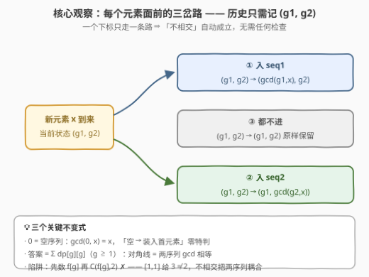
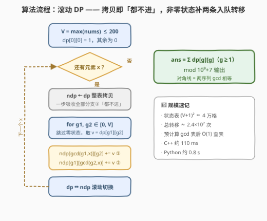
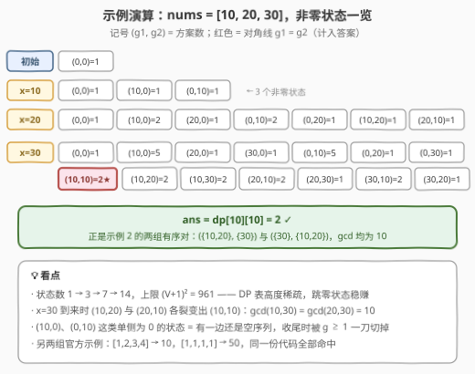

# 最大公约数相等的子序列数量

- **题目名称**：最大公约数相等的子序列数量
- **链接**：[3336. 最大公约数相等的子序列数量](https://leetcode.cn/problems/find-the-number-of-subsequences-with-equal-gcd/)
- **难度**：困难
- **标签**：数组、数学、动态规划、数论、最大公约数

## 1. 题目概述

给你一个整数数组 `nums`。请统计所有满足以下条件的**非空**子序列对 `(seq1, seq2)` 的数量：

- 子序列 `seq1` 和 `seq2` **不相交**，即 `nums` 中不存在同时出现在两个序列中的**下标**；
- `seq1` 元素的 GCD 等于 `seq2` 元素的 GCD。

返回满足条件的子序列对总数对 $10^9 + 7$ 取余的结果。

**示例 1**：

```text
输入：nums = [1,2,3,4]
输出：10
解释：GCD 相等（均为 1）的不相交子序列对共 10 组，
     如 ([1,2,3,4], [1,2,3,4]) 中两个方括号各取互补的下标子集。
```

**示例 2**：

```text
输入：nums = [10,20,30]
输出：2
解释：([10,20,30], [10,20,30]) 与 ([10,20,30], [10,20,30])——
     两组都是「一个取 {0,1}，另一个取 {2}」，GCD 均为 10。
```

**示例 3**：

```text
输入：nums = [1,1,1,1]
输出：50
```

**约束条件**：

- $1 \le \textit{nums.length} \le 200$
- $1 \le \textit{nums[i]} \le 200$

> 💡 **读题关键**：① `(seq1, seq2)` 是**有序对**——示例 2 输出的两条互为镜像，说明两序列是两个不同的「桶」，交换算新的一对；② 不相交约束落在**下标**上，值可以重复出现（示例 3 的四个 `1`）；③ 值域 $\le 200$ 意味着任何子集的 GCD 也 $\le 200$——**状态天然有界**，这正是 DP 可行的门票。

---

## 2. 解题思路

### 2.1 暴力思路：枚举每个下标的三种归属

子序列对等价于给每个下标打标签：**入 seq1 / 入 seq2 / 都不进**，共 $3^n$ 种归属方案，每种再花 $O(n)$ 算两个 GCD 验证。$n = 200$ 时 $3^{200} \approx 10^{95}$，宇宙原子数都不够用。

即使退一步用「枚举 seq1 子集、再枚举不相交的 seq2」，也是 $3^n$ 的另一件外衣。组合爆炸的根源在于**把「选了哪些下标」当成了状态**——而验证条件只关心每个序列的 GCD，与具体选法无关。优化方向因此非常明确：**只记 GCD，丢掉下标细节**。

### 2.2 核心观察：每个元素面前的「三岔路」——联合 DP



**观察一：不相交 ⟺ 每个下标独立三选一**。`(seq1, seq2)` 合法当且仅当每个下标至多属于一个序列。于是「构造一对序列」就是**逐元素决策**：拿到 `x`，要么放进 seq1、要么放进 seq2、要么都不放。一个下标只走一条路，**不相交约束被决策模型天然吸收，无需任何额外检查**。

**观察二：唯一需要记住的历史是 $(g_1, g_2)$**。两个序列各自的元素集合是冗余信息——影响后续的只有它们**当前的 GCD**。定义

$$dp[g_1][g_2] = \text{已处理的元素中，seq1 的 GCD 为 } g_1 \text{、seq2 的 GCD 为 } g_2 \text{ 的归属方案数}$$

新来一个元素 $x$ 时，每个旧状态**裂变出三个新状态**：

$$dp'[g_1][g_2] \mathrel{+}= dp[g_1][g_2] \quad (\text{都不进})$$
$$dp'[\gcd(g_1, x)][g_2] \mathrel{+}= dp[g_1][g_2] \quad (\text{入 seq1})$$
$$dp'[g_1][\gcd(g_2, x)] \mathrel{+}= dp[g_1][g_2] \quad (\text{入 seq2})$$

**观察三：用 $0$ 编码空序列，$\gcd(0, x) = x$ 免特判**。初始 $dp[0][0] = 1$（两序列皆空）；「空序列装入第一个元素」的转移 $\gcd(0,x) = x$ 恰好是数学惯例，无需任何 if 分支。终止时非空要求排除 $g = 0$，答案为

$$\textit{ans} = \sum_{g=1}^{V} dp[g][g] \bmod (10^9+7)$$

**对角线** $g_1 = g_2$ 正是「两序列 GCD 相等」，妙极。

> ⚠️ **一个诱人的错误捷径**：先单序列 DP 求出「GCD 恰为 $g$ 的子序列数」$f[g]$，再算 $\sum_g \binom{f[g]}{2}$。**错在不相交**——两个独立挑出的子序列可能共享下标，而扣除共享部分需要知道交集的 GCD，计数无法解耦。反例 `nums = [1,1]`：$f[1] = 3$，$\binom{3}{2} = 3 \ne 2$（合法对只有两个「各拿一个 1」）。不相交约束把两个序列**耦合**在一起，联合 DP 是绕不开的。

### 2.3 算法流程图



四步走：① 初始化 $(V+1)^2$ 的状态表，$dp[0][0] = 1$；② 逐元素处理，先把 `dp` 整表拷贝到 `ndp`（一步吸收全部「都不进」分支）；③ 双重循环枚举非零状态，补上两条「入队」转移；④ 全部处理完，累加对角线 $dp[g][g]$（$g \ge 1$）取模输出。滚动地在 `dp` / `ndp` 间切换，空间只需一张表。

### 2.4 示例演算



以 $\textit{nums} = [10, 20, 30]$（示例 2）走完全程，只列**非零状态**（记号 $(g_1, g_2) = \text{方案数}$）：

| 处理元素 | 非零状态 |
|----------|----------|
| 初始 | $(0,0) = 1$ |
| $x=10$ | $(0,0){=}1,\ (10,0){=}1,\ (0,10){=}1$ —— 3 个 |
| $x=20$ | $(0,0){=}1,\ (10,0){=}2,\ (20,0){=}1,\ (0,10){=}2,\ (0,20){=}1,\ (10,20){=}1,\ (20,10){=}1$ —— 7 个 |
| $x=30$ | $(0,0){=}1,\ (10,0){=}5,\ (20,0){=}1,\ (30,0){=}1,\ (0,10){=}5,\ (0,20){=}1,\ (0,30){=}1,\ \mathbf{(10,10){=}2},\ (10,20){=}2,\ (10,30){=}2,\ (20,10){=}2,\ (20,30){=}1,\ (30,10){=}2,\ (30,20){=}1$ —— 14 个 |

- 关键一步：$x=30$ 到来时，$(10,20)$ 裂变出 $(\gcd(10,30), \gcd(20,30)) = (10,10)$ ★，$(20,10)$ 同样裂变出 $(10,10)$ ★——**对角线上落进 2 个方案**，正是「一个序列取 $\{10,20\}$、另一个取 $\{30\}$」的两种有序分法；
- 最终 $\textit{ans} = dp[10][10] = 2$ ✓，与示例 2 吻合；
- 顺带验证：$[1,2,3,4] \to 10$、$[1,1,1,1] \to 50$，两组官方示例同样命中。

> 💡 注意状态数的增长：$1 \to 3 \to 7 \to 14$，离上限 $(V+1)^2 = 961$ 差得远——**实际 DP 表高度稀疏**，跳过零状态既是正确性上无关紧要的剪枝，也是 Python 提速的免费午餐。

---

## 3. 参考代码

### C++

```cpp
class Solution {
  public:
    int subsequencePairCount(vector<int>& nums) {
        constexpr long long MOD = 1'000'000'007;
        int V = *max_element(nums.begin(), nums.end());
        vector<vector<long long>> dp(V + 1, vector<long long>(V + 1, 0));
        dp[0][0] = 1;                                  // 两序列皆空
        for (int x : nums) {
            vector<vector<long long>> ndp(dp);         // ③ 整表拷贝 = 都不进
            for (int g1 = 0; g1 <= V; ++g1)
                for (int g2 = 0; g2 <= V; ++g2) {
                    long long v = dp[g1][g2];
                    if (!v) continue;                  // 只碰非零状态
                    ndp[gcd(g1, x)][g2] = (ndp[gcd(g1, x)][g2] + v) % MOD;  // ① 入 seq1
                    ndp[g1][gcd(g2, x)] = (ndp[g1][gcd(g2, x)] + v) % MOD;  // ② 入 seq2
                }
            dp.swap(ndp);                              // 滚动切换
        }
        long long ans = 0;
        for (int g = 1; g <= V; ++g)                   // 对角线且排除空序列
            ans = (ans + dp[g][g]) % MOD;
        return (int)ans;
    }
};
```

### Python

```python
class Solution:
    def subsequencePairCount(self, nums: List[int]) -> int:
        MOD = 10 ** 9 + 7
        V = max(nums)
        # 预计算 gcd 查表：G[a][b] = gcd(a, b)，消除循环内函数调用
        G = [[math.gcd(a, b) for b in range(V + 1)] for a in range(V + 1)]
        dp = [[0] * (V + 1) for _ in range(V + 1)]
        dp[0][0] = 1                                   # 两序列皆空
        for x in nums:
            gx = G[x]                                  # 当前行：gx[g] = gcd(x, g)
            ndp = [row[:] for row in dp]               # ③ 整表拷贝 = 都不进
            for g1 in range(V + 1):
                row = dp[g1]
                for g2 in range(V + 1):
                    v = row[g2]
                    if v:
                        ndp[gx[g1]][g2] = (ndp[gx[g1]][g2] + v) % MOD  # ① 入 seq1
                        ndp[g1][gx[g2]] = (ndp[g1][gx[g2]] + v) % MOD  # ② 入 seq2
            dp = ndp                                   # 滚动切换
        return sum(dp[g][g] for g in range(1, V + 1)) % MOD
```

> 💡 **实现细节**：① 「都不进」分支用**整表拷贝**一步吸收——`vector` 拷贝构造 / `[row[:] for row in dp]`，比循环里写三行加法清爽得多；② $\gcd(0, x) = x$ 是 `std::gcd` 与 `math.gcd` 共同遵守的惯例，「空序列装入第一个元素」零特判；③ $\gcd(g, x) = g$（$g \mid x$）时转移落回原格，与拷贝值正常累加，无冲突；④ Python 版预计算 $201 \times 201$ 的 gcd 表并缓存行引用，把 $8 \times 10^6$ 次转移压到 1 秒内；⑤ 两个 $< 10^9$ 的数相加不超 $2 \times 10^9$，C++ 必须 `long long` 收尾再取模。

实测：三组官方示例分别得 $10 / 2 / 50$；与 $3^n$ 暴力枚举对拍随机数据（$n \le 8$、值域 $\le 12$）3000 组全部一致；C++ 与 Python 双实现交叉对拍大规模随机数据（$n = 200$、$V = 200$）30 组一致；极限数据 C++ 约 110 ms，Python 约 0.8 s。

---

## 4. 复杂度分析

| 维度 | 复杂度 | 说明 |
|------|--------|------|
| 时间复杂度 | $O(n \cdot V^2 \cdot \log V)$ | 每个元素扫 $(V+1)^2 \approx 4 \times 10^4$ 个状态，两条入队转移各做一次欧几里得 $\gcd$（$O(\log V)$）；$n = V = 200$ 时约 $2 \times 10^8$ 次基本位运算，实测 110 ms |
| 时间（查表优化） | $O(n \cdot V^2)$ | 预计算 $201 \times 201$ gcd 表后转移降为 $O(1)$ 查表，总量 $\approx 2.4 \times 10^7$，Python 也能 1 s 内通过 |
| 空间复杂度 | $O(V^2)$ | 两张 $(V+1)^2$ 的滚动表（C++ 可只留一张半：`swap` 释放旧表），$V \le 200 \Rightarrow$ 约 $4 \times 10^4$ 个 `long long` |
| 暴力对照 | $O(3^n \cdot n)$ | 枚举全部归属方案，$n = 200$ 时天文数字，不可行 |

---

## 5. 扩展：值域甜区与 gcd 状态 DP 的边界

**为什么 $V \le 200$ 是甜区？** 本解的状态数是 $V^2$ 量级，$V = 200$ 时约 $4 \times 10^4$，乘上 $n = 200$ 恰好卡在 $10^7 \sim 10^8$ 的可计算区间。一旦值域放开，$V^2$ 立刻失控——对比姊妹题 [1819. 序列中不同最大公约数的数目](https://leetcode.cn/problems/number-of-different-subsequences-gcds/)：$V \le 2 \times 10^5$，$V^2 = 4 \times 10^{10}$ 直接爆炸，那里改用「按 $g$ 从大到小、只沿倍数链转移」的单序列思路。**「状态维度取自值域」的 DP，先算 $V^{(\text{状态里 gcd 的个数})}$ 估规模**，是判断能否下手的第一步。

**常数优化三连**：① 预计算 gcd 表（本文 Python 版已用）；② 只遍历非零状态（`if (v)` 剪枝，演算表可见前期状态极少）；③ 把行引用、`gcd` 表行提前缓存到循环外，减少下标与属性查找。

**有序对 vs 无序对**：本文 DP 的两个「桶」天然有序，直接得到有序对计数。若题目改要无序对 $\{S_1, S_2\}$：因两序列非空且不相交，必有 $S_1 \ne S_2$，故无序数 = 有序数 $/ \, 2$（模意义下乘 $2^{-1}$ 的费马小定理逆元即可）。

---

## 6. 面试要点

1. **为什么不能先算「GCD 恰为 $g$ 的子序列数」$f[g]$，再用 $\sum_g \binom{f[g]}{2}$？**

   - 不相交约束把两个子序列**耦合**在一起：独立挑出的两个子序列可能共享下标，而「扣除共享」需要交集的 GCD 信息，计数无法解耦成乘积。最小反例 `[1,1]`：$f[1] = 3$（两个单元素 + 一个双元素子序列），$\binom{3}{2} = 3$，但合法对只有 2。教训：**带「不相交/不重叠」约束的双对象计数，默认上联合 DP**。

2. **状态里为什么用 $0$ 编码空序列？$\gcd(0, x) = x$ 省在哪里？**

   - $g = 0$ 既是自然的「还没装任何元素」标记，又借数学惯例 $\gcd(0, x) = x$ 让「空 → 非空」的首个元素装入走同一条转移公式，零 if 分支。收尾时 $g \ge 1$ 一刀切掉空序列，边界干净利落。同类手法见子序列 gcd/异或/和类 DP。

3. **「都不进」分支为什么可以用整表拷贝？**

   - 该分支对状态的影响是恒等映射：$dp'[g_1][g_2] \mathrel{+}= dp[g_1][g_2]$ 对**所有**状态成立。先把 `dp` 整表拷贝成 `ndp`，剩下两条入队转移以「增量」补进去即可。这比每个状态写三行加法更不易错，也是「转移 = 恒等 + 增量」的通用写法。

4. **复杂度怎么估？Python 会不会超时，怎么救？**

   - 状态 $(V+1)^2$、每元素扫一遍、每状态两次 gcd：$O(n V^2 \log V) \approx 2 \times 10^8$（C++ 百毫秒级）。Python 的救法：预计算 $201 \times 201$ gcd 表把 $\log$ 因子换成查表、循环内缓存行引用与局部变量、跳过零状态——三招下来 $2.4 \times 10^7$ 次纯加法/取模，1 秒内通过。

5. **最终答案为什么取对角线？有序对和无序对在这里有什么区别？**

   - $dp[g][g]$ 表示两序列 GCD 相等的方案，$g \ge 1$ 排除空序列，$\sum_g dp[g][g]$ 即答案。DP 中 seq1/seq2 是两个可区分的桶，天然数出**有序对**——与示例 2 的镜像计数吻合；若要无序对，除以 2（模 $10^9+7$ 下用逆元）。

---

## 7. 同类练习题

- [1819. 序列中不同最大公约数的数目](https://leetcode.cn/problems/number-of-different-subsequences-gcds/)：单序列 gcd 状态 DP 经典题，但值域 $2 \times 10^5$ 逼你放弃 $V^2$ 状态表，改走倍数链——正好体会本题「值域甜区」的边界在哪里
- [2447. 最大公因数等于 K 的子数组数目](https://leetcode.cn/problems/number-of-subarrays-with-gcd-equal-to-k/)：**连续**子数组版 gcd DP，对照感受「子数组右端点推进时 gcd 单调不增」与「子序列三岔路决策」两种状态设计
- [1994. 好子集的数目](https://leetcode.cn/problems/the-number-of-good-subsets/)：子序列 + 数论状态（素因子掩码）计数 DP，与本题同属「值域小 ⇒ 数论状态可枚举」家族
- [97. 交错字符串](https://leetcode.cn/problems/interleaving-string/)（[站内题解](../0001-0100/97_交错字符串.md)）：双序列联合 DP 的最小案例——每个字符二选一归属，本题是把「二选一」扩成「三选一」再加一层 gcd 状态
- [1071. 字符串的最大公因子](https://leetcode.cn/problems/greatest-common-divisor-of-strings/)：gcd 概念热身，理解「最大公因数为何既能除整数也能除字符串」的数学结构
