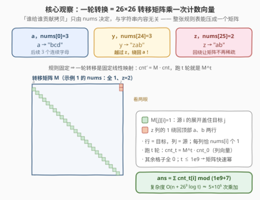
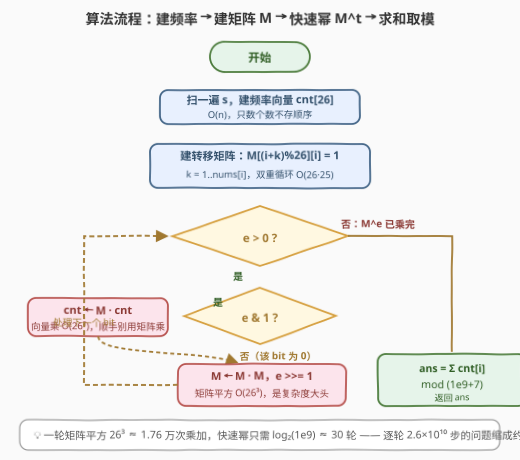
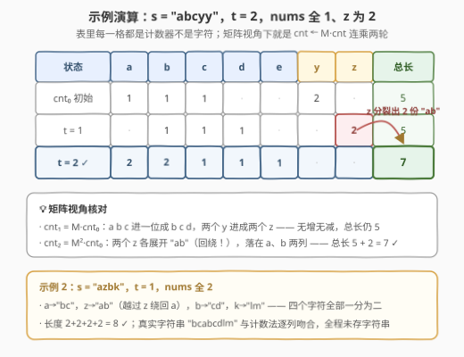

# 字符串转换后的长度 II

- **题目名称**：字符串转换后的长度 II
- **链接**：[3337. 字符串转换后的长度 II](https://leetcode.cn/problems/total-characters-in-string-after-transformations-ii/)
- **难度**：困难
- **标签**：哈希表、数学、字符串、动态规划、计数
- **关联**：[3335. 字符串转换后的长度 I](../3301-3400/3335_字符串转换后的长度I.md) 是本题在 `nums` 全 1（`z` 为 2）时的特例；其 $O(26t)$ 计数模拟在本题的 $t \le 10^9$ 下失效，必须升级为**矩阵快速幂**

## 1. 题目概述

给你一个由小写英文字母组成的字符串 `s`，一个整数 `t` 表示要执行的**转换**次数，以及一个长度为 26 的数组 `nums`。每次**转换**需要根据以下规则替换字符串 `s` 中的每个字符：

- 将 `s[i]` 替换为字母表中后续的 `nums[s[i] - 'a']` 个**连续**字符。例如 `s[i] = 'a'` 且 `nums[0] = 3`，则 `'a'` 转换为 `"bcd"`；
- 如果转换超过了 `'z'`，则**回绕**到字母表开头。例如 `s[i] = 'y'` 且 `nums[24] = 3`，则 `'y'` 转换为 `"zab"`。

返回**恰好**执行 $t$ 次转换后得到的字符串的**长度**。由于答案可能非常大，返回其对 $10^9 + 7$ 取余的结果。

**示例 1**：

```text
输入：s = "abcyy", t = 2, nums = [1,1,...,1,2]   # 前 25 个全 1，nums[25] = 2
输出：7
解释："abcyy" → "bcdzz" → "cdeabab"，最终长度为 7。
```

**示例 2**：

```text
输入：s = "azbk", t = 1, nums = [2,2,...,2]      # 全部为 2
输出：8
解释："azbk" → "bcabcdlm"，最终长度为 8。
```

**约束条件**：

- $1 \le \textit{s.length} \le 10^5$
- `s` 仅由小写英文字母组成
- $1 \le t \le 10^9$
- $\textit{nums.length} = 26$
- $1 \le \textit{nums}[i] \le 25$

> 💡 **读题关键**：① 替换仍然**逐字符独立**——3335 的「压缩成 26 个计数器」思想完全保留；② 与版本 I 的本质区别有两处：展开规则从「进一位 / z 分裂」泛化为**每个字母展开任意长度的连续段**（还带回绕），且 $t$ 从 $10^5$ 放大到 $10^9$；③ $1 \le \textit{nums}[i] \le 25$ 保证每个字母**严格前进**且一轮内至多覆盖 25 个目标格——矩阵每列恰有 $\textit{nums}[i]$ 个 1；④ 官方 hints 直接点题：把转换建模成矩阵乘法，用快速幂加速。

---

## 2. 解题思路

### 2.1 暴力思路：计数模拟也扛不住了

[3335](../3301-3400/3335_字符串转换后的长度I.md) 的经验告诉我们真模拟字符串必死，正确姿势是维护 26 维频率向量 $\textit{cnt}$，每轮做一次固定转移：

$$\textit{cnt}'[(i+k) \bmod 26] \mathrel{+}= \textit{cnt}[i], \qquad k = 1, \ldots, \textit{nums}[i]$$

每轮转移的代价是 $O\!\left(\sum_i \textit{nums}[i]\right) \le 26 \times 25 = 650$ 次加法。版本 I 的 $t \le 10^5$ 时总共 $2.6 \times 10^6$ 步，轻松通过；但本题 $t \le 10^9$，总步数达 $6.5 \times 10^{11}$——**转移本身已经很便宜，轮数太多才是死因**。至于真模拟字符串，长度按谱半径指数膨胀（单字符每轮最多变 25 个），$t$ 轮后是天文数字，更不必考虑。

> ⚠️ **暴力真正的死因是「轮数维度」而非「单轮代价」**。逐轮优化已经到头（单轮 $O(26)$ 级别），必须想办法**跳过中间轮次**——把 $t$ 从线性因子搬进指数里。

### 2.2 核心观察：固定线性转移 ⇒ 矩阵快速幂



**观察一：字符串仍可压缩成 26 维频率向量**。替换逐字符独立，最终长度 = 各字符独立演化长度之和。$O(n)$ 统计频率，字符串本体从此不再需要。

**观察二：一轮转换是 26 维线性映射，且矩阵只由 `nums` 决定**。「谁给谁贡献一个拷贝」与字符串内容、轮次都无关：源字母 $i$ 的每个拷贝恰好产生 $k = 1.. \textit{nums}[i]$ 各一份目标字母 $(i+k) \bmod 26$。把这张固定的贡献表写成 $26 \times 26$ **转移矩阵** $M$（行 = 目标，列 = 源）：

$$M[(i+k) \bmod 26][i] = 1, \qquad i = 0..25,\ k = 1..\textit{nums}[i]$$

则一轮转换就是一次矩阵–向量乘法 $\textit{cnt}' = M \cdot \textit{cnt}$（$\textit{cnt}$ 视为列向量）。

**观察三：跑 $t$ 轮 = 算 $M^t$，快速幂把 $t$ 塞进指数**。

$$\textit{cnt}_t = M^t \cdot \textit{cnt}_0, \qquad \textit{ans} = \sum_{i=0}^{25} \textit{cnt}_t[i] \bmod (10^9+7)$$

矩阵乘法满足结合律，用**快速幂**只需 $O(\log t) \approx 30$ 次矩阵平方。对照 2.1：逐轮 $650 \times 10^9 \approx 6.5 \times 10^{11}$ 步 → 矩阵幂 $26^3 \times 30 \approx 5.3 \times 10^5$ 次乘加，**快了六个数量级**。

> 💡 **为什么版本 I 不用矩阵也行**？示例 1 的 `nums`（全 1、`z` 为 2）恰好就是 3335 的规则——$M$ 只有 27 个非零元，退化为「右移 + 分裂」。本题把 `nums` 泛化后矩阵才真正登场，但「固定线性映射」这一本质从未改变。

### 2.3 算法流程图



四步走：① 扫 `s` 建频率向量 `cnt[26]`；② 双重循环构造 `M`（每列填 `nums[i]` 个 1）；③ 对 $e = t$ 做快速幂——二进制位为 1 时 `cnt ← M·cnt`（向量乘 $O(26^2)$），然后 `M ← M·M`（矩阵平方 $O(26^3)$，复杂度大头），`e >>= 1`；④ 求和取模输出。

### 2.4 示例演算



以示例 1（$\textit{s} = \text{"abcyy"},\ t = 2$，`nums` 全 1、`z` 为 2）走完全流程（只列非零列）：

| 状态 | a | b | c | d | e | y | z | 总长 |
|------|---|---|---|---|---|---|---|------|
| $\textit{cnt}_0$ | 1 | 1 | 1 | – | – | 2 | – | 5 |
| $t=1$ | – | 1 | 1 | 1 | – | – | 2 | 5 |
| $t=2$ | **2** | **2** | 1 | 1 | 1 | – | – | **7** |

- 第 1 轮 $\textit{cnt}_1 = M \cdot \textit{cnt}_0$：`a b c` 进一位，两个 `y` 进成两个 `z`，无增无减；
- 第 2 轮 $\textit{cnt}_2 = M^2 \cdot \textit{cnt}_0$：两个 `z` 各展开 `"ab"`（**回绕**落到表头 `a`、`b` 两列，表中加粗），总长 $5 + 2 = 7$ ✓。

示例 2（`"azbk"`，$t=1$，`nums` 全 2）：四个字符全部一分为二（`a→bc`、`z→ab`、`b→cd`、`k→lm`），长度 $4 \times 2 = 8$ ✓。两例全程只动计数器，与真实字符串 `"cdeabab"` / `"bcabcdlm"` 逐列吻合。

---

## 3. 参考代码

### C++

```cpp
class Solution {
  public:
    int lengthAfterTransformations(string s, int t, vector<int>& nums) {
        constexpr long long MOD = 1'000'000'007;
        using Mat = array<array<long long, 26>, 26>;

        auto mul = [&](const Mat& A, const Mat& B) {          // C = A·B，ikj 序
            Mat C{};
            for (int i = 0; i < 26; ++i)
                for (int k = 0; k < 26; ++k) {
                    if (!A[i][k]) continue;                   // 稀疏跳过
                    for (int j = 0; j < 26; ++j)
                        C[i][j] = (C[i][j] + A[i][k] * B[k][j]) % MOD;
                }
            return C;
        };

        Mat M{};                                              // ① 转移矩阵
        for (int i = 0; i < 26; ++i)
            for (int k = 1; k <= nums[i]; ++k)
                M[(i + k) % 26][i] = 1;                       // 源 i 贡献目标 (i+k)%26

        long long cnt[26] = {0};
        for (char c : s) ++cnt[c - 'a'];                      // ② 频率压缩

        auto vecMul = [&](const Mat& A, long long* v) {       // v ← A·v（列向量左乘）
            long long w[26];
            for (int i = 0; i < 26; ++i) {
                long long x = 0;
                for (int k = 0; k < 26; ++k)
                    x = (x + A[i][k] * v[k]) % MOD;
                w[i] = x;
            }
            for (int i = 0; i < 26; ++i) v[i] = w[i];
        };

        long long e = t;                                      // ③ 快速幂：cnt ← M^t·cnt
        while (e) {
            if (e & 1) vecMul(M, cnt);
            M = mul(M, M);
            e >>= 1;
        }
        long long ans = 0;
        for (int i = 0; i < 26; ++i) ans = (ans + cnt[i]) % MOD;   // ④ 求和取模
        return (int)ans;
    }
};
```

### Python

```python
class Solution:
    def lengthAfterTransformations(self, s: str, t: int, nums: List[int]) -> int:
        MOD = 10**9 + 7
        N = 26

        def mat_mul(A, B):                       # ikj 序 + 稀疏跳过
            C = [[0] * N for _ in range(N)]
            for i in range(N):
                Ai, Ci = A[i], C[i]
                for k in range(N):
                    a = Ai[k]
                    if a:
                        Bk = B[k]
                        for j in range(N):
                            Ci[j] = (Ci[j] + a * Bk[j]) % MOD
            return C

        M = [[0] * N for _ in range(N)]          # ① 转移矩阵
        for i in range(N):
            for k in range(1, nums[i] + 1):
                M[(i + k) % N][i] = 1            # 源 i 贡献目标 (i+k)%26

        cnt = [0] * N
        for c in s:                              # ② 频率压缩
            cnt[ord(c) - 97] += 1

        def vec_mul(A, v):                       # v' = A·v（列向量左乘）
            return [sum(A[i][k] * v[k] for k in range(N)) % MOD
                    for i in range(N)]

        e = t                                    # ③ 快速幂：cnt ← M^t·cnt
        while e:
            if e & 1:
                cnt = vec_mul(M, cnt)
            M = mat_mul(M, M)
            e >>= 1
        return sum(cnt) % MOD                    # ④ 求和取模
```

> 💡 **实现细节**：① 矩阵约定「行 = 目标、列 = 源」，$\textit{cnt}'[j] = \sum_i M[j][i] \cdot \textit{cnt}[i]$，即**列向量左乘** $v' = Mv$——约定反了（写成 $v^\top M$）答案也对不了，两种方向别混用；② C++ 矩阵乘**内层每次累加后立即取模**：单项乘积已达 $10^{18}$ 量级，26 项累加会撑爆 `long long`（$\approx 9.2 \times 10^{18}$），不能攒到最后统一取模；③ 二进制位为 1 时只做 $O(26^2)$ 的**向量乘**而非矩阵乘，$O(26^3)$ 的矩阵平方每轮固定一次，别把向量也走矩阵乘的重量级；④ `nums[i] ≤ 25` 保证每列至多 25 个 1、且不存在自环（不前进），矩阵恒有意义。

实测：两组官方示例分别得 $7 / 8$；与逐轮计数模拟对拍随机数据（$|s| \le 8$、$t \le 60$、`nums` 随机）各 3000 组（Python 与 C++ 双语言）全部一致；极限数据（$|s| = 10^5$ 全 `'z'`、`nums` 全 25、$t = 10^9$）Python 约 0.07 s。

---

## 4. 复杂度分析

| 维度 | 复杂度 | 说明 |
|------|--------|------|
| 时间复杂度 | $O(n + 26^3 \log t)$ | 频率统计 $O(n)$；矩阵平方 $O(26^3) \approx 1.76 \times 10^4$ 次乘加/轮，快速幂 $\lceil \log_2 t \rceil \le 30$ 轮，向量乘 $O(26^2 \log t)$ 是小头，总计约 $5.3 \times 10^5$ 次乘加 |
| 空间复杂度 | $O(26^2)$ | 两个 $26 \times 26$ 矩阵（当前底数与结果），常数级 |
| 暴力对照 | $O(n + 26 \cdot 25 \cdot t)$ | 逐轮计数模拟 $6.5 \times 10^{11}$ 次操作（$t = 10^9$），超时六个数量级 |

---

## 5. 扩展：还能更快吗

**Cayley–Hamilton 优化到 $O(26^2 \log t)$**。任何 $26 \times 26$ 矩阵 $M$ 都满足自己的特征多项式 $p(x)$（$x^{26}$ 次首一多项式）。于是 $M^t = M^t \bmod p(M)$——先算多项式 $x^t \bmod p(x)$（系数至多 26 个，多项式乘法 $O(26^2)$，快速幂 $O(26^2 \log t)$），再把结果线性组合 $\sum_j c_j M^j$（预存 26 个矩阵幂）。理论上把矩阵乘 $O(26^3)$ 降为多项式乘 $O(26^2)$。本题 $26^3 \log t \approx 5 \times 10^5$ 已绰绰有余，此法属于「追求极致」的加分项，在 $d$ 上千的线性递推（如某些 AC 自动机上匹配计数）里才是刚需。

**工程侧的小招**：Python 速度紧张时可用 `numpy`（`object` dtype 精确大整数，或 `int64` 分段取模防溢出），矩阵乘交给 BLAS；C++ 可把 `array` 换成裸二维数组并按行缓存友好排布。但 26 维实在太小，纯手写三重循环已是最稳的选择。

另一个视角的呼应：3335 里单字符长度满足「跳步斐波那契」$G(j) = G(j-26) + G(j-25)$；本题的 `nums` 把步长谱彻底打散，但「长度序列是线性递推」的本质不变——矩阵幂正是线性递推的通用加速器。

---

## 6. 面试要点

1. **版本 I 的计数模拟为什么在本题失效？问题出在哪个维度？**

   - 单轮转移已经便宜到 $O(\sum \textit{nums}[i]) \le 650$ 次加法，但 $t \le 10^9$ 让总步数到 $6.5 \times 10^{11}$。死因是**轮数维度**，不是单轮代价。出路是利用结合律把 $t$ 搬进指数：$\textit{cnt}_t = M^t \textit{cnt}_0$，快速幂 $O(26^3 \log t) \approx 5 \times 10^5$。识别「固定线性转移 + 巨大步数」这一信号是本题的核心考点。

2. **转移矩阵怎么构造？行列各是什么含义？**

   - 约定行 = 目标、列 = 源：$M[(i+k)\%26][i] = 1$（$k = 1..\textit{nums}[i]$），每列恰 $\textit{nums}[i]$ 个 1，其余全 0。一轮转换即列向量左乘 $\textit{cnt}' = M\,\textit{cnt}$。矩阵只由 `nums` 决定，与 `s` 和轮次无关——「固定」是能用快速幂的前提。行/列约定反过来（转置矩阵配行向量）同样正确，但两种方向不能混用。

3. **C++ 实现最容易踩的坑是什么？**

   - **矩阵乘内层的溢出**：单项 $A[i][k] \cdot B[k][j]$ 可达 $(10^9)^2 = 10^{18}$，26 项累加超 `long long` 上限 $\approx 9.2 \times 10^{18}$，必须**每次累加后立即取模**，不能攒到最后。其次是方向坑：向量是列向量，更新写 $v' = Mv$（左乘），手滑写成 $v^\top M$ 就全错。最后，`nums[i] ≥ 1` 保证无自环、`≤ 25` 保证不覆盖整圈，构造矩阵时 `(i + k) % 26` 的回绕别忘。

4. **快速幂循环里，向量什么时候乘进去？为什么不做「结果矩阵 × 底数矩阵」？**

   - 标准 `while (e)` 循环：`e & 1` 时 `cnt ← M·cnt`（$O(26^2)$ 向量乘），随后 `M ← M·M`（$O(26^3)$）并右移。等价做法是维护结果矩阵 `res = M^t` 最后乘向量，但那样要做矩阵×矩阵的乘入（$O(26^3)$/位）；把向量乘进循环省掉这些矩阵乘，总代价从 $O(2 \cdot 26^3 \log t)$ 降到 $O(26^3 \log t + 26^2 \log t)$。

5. **取模合法吗？答案会不会丢信息？**

   - 转移只含加法与乘法，对加、乘封闭的同余运算全程合法；题目只要长度对 $10^9+7$ 的余数，中间无需保留真实值。注意答案可能巨大（单字符一轮最多变 25 个，指数膨胀），**必须**取模而非可选。Python 大整数天然安全，C++ 靠 `long long` + 逐步取模。

---

## 7. 同类练习题

- [3335. 字符串转换后的长度 I](https://leetcode.cn/problems/total-characters-in-string-after-transformations-i/)（[站内题解](../3301-3400/3335_字符串转换后的长度I.md)）：本题的前身，`nums` 全 1、`z` 为 2 的特例，$t \le 10^5$ 允许 $O(26t)$ 计数模拟——先做它再回来，能完整体会「逐轮 → 矩阵幂」的升级动机
- [1220. 统计元音字母序列的数目](https://leetcode.cn/problems/count-vowels-permutation/)：只有 5 个状态的转移图，矩阵快速幂的最佳入门练手题（$5 \times 5$ 手算都不费劲）
- [552. 学生出勤记录 II](https://leetcode.cn/problems/student-attendance-record-ii/)：状态机 DP + 矩阵快速幂的经典组合，练习「状态转移图 → 转移矩阵」的翻译
- [70. 爬楼梯](https://leetcode.cn/problems/climbing-stairs/)（[站内题解](../0001-0100/70_爬楼梯.md)）：最经典的 fib 线性递推，从 $O(n)$ 递推到 $O(\log n)$ 矩阵幂的最小案例，本题在 26 维上的同理
- [790. 多米诺和托米诺平铺](https://leetcode.cn/problems/domino-and-tromino-tiling/)：线性递推 + 快速幂思想的计数场景，与本题同属「线性映射跑 $t$ 步」家族
