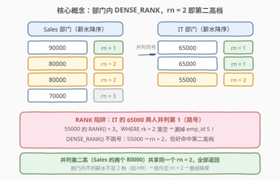
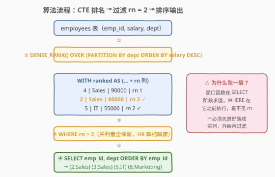
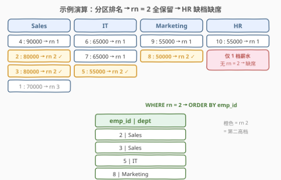

# LeetCode 第二高的薪水 II 题解

- **关联**：[176. 第二高的薪水](https://leetcode.cn/problems/second-highest-salary/)（[站内题解](../0101-0200/176_第二高的薪水.md)）是本题的「全局单值」前传——176 求全表第二高的**一个数**（不足返回 `NULL`），本题求每个部门第二高档的**一组员工**

## 1. 题目概述

- **标题 / 题号**：第二高的薪水 II（#3338，medium）
- **链接**：https://leetcode.cn/problems/second-highest-salary-ii/
- **难度**：中等
- **标签**：数据库、SQL、窗口函数、DENSE_RANK、分组排名、分组 Top-K

> ⚠️ 本题为 LeetCode 付费题，题意描述根据官方示例用例与外部资料重建，可能与官方题面有出入。

**表结构**：`employees`

| 列名 | 类型 |
|------|------|
| emp_id | int |
| salary | int |
| dept | varchar |

- `emp_id` 是这张表的唯一主键。
- 每行包含一名雇员的 ID、薪水和部门。

**目标**：编写一个解决方案，找到**每个部门中薪水第二高**的雇员。如果**多名雇员并列**第二高，结果中要**包含所有**拿该薪水的雇员。返回结果表以 `emp_id` **升序**排序。

**示例 1**：

```text
输入：employees 表
+--------+--------+-----------+
| emp_id | salary | dept      |
+--------+--------+-----------+
| 1      | 70000  | Sales     |
| 2      | 80000  | Sales     |
| 3      | 80000  | Sales     |
| 4      | 90000  | Sales     |
| 5      | 55000  | IT        |
| 6      | 65000  | IT        |
| 7      | 65000  | IT        |
| 8      | 50000  | Marketing |
| 9      | 55000  | Marketing |
| 10     | 55000  | HR        |
+--------+--------+-----------+

输出：
+--------+-----------+
| emp_id | dept      |
+--------+-----------+
| 2      | Sales     |
| 3      | Sales     |
| 5      | IT        |
| 8      | Marketing |
+--------+-----------+
```

**解释**：

- **销售部门**：最高薪水 $90000$（emp_id: 4），第二高的薪水为 $80000$（emp_id: 2, 3）——两个薪水为 $80000$ 的雇员**都被包含**。
- **IT 部门**：最高薪水 $65000$（emp_id: 6, 7）并列，第二高的薪水为 $55000$（emp_id: 5）——只有 emp_id 为 5 的雇员被包含。
- **市场部门**：最高薪水 $55000$（emp_id: 9），第二高的薪水为 $50000$（emp_id: 8）——雇员 8 被包含。
- **人力资源部门**：只有一名雇员，部门内薪水不足两档，**没有第二高**，故不出现在结果中。

**约束**：

- `emp_id` 为表主键，行唯一。
- 「第二高」按部门内**不同薪水值**（去重后）降序取第 2 档；同档并列者**全部返回**。
- 部门内不同薪水不足 2 档时，该部门**不产生任何输出行**（对照 176 返回 `NULL`，本题是行集合语义，缺档即缺席）。
- 结果按 `emp_id` 全局升序排序，输出列为 `emp_id`、`dept`。

> 💡 **审题关键**：① **分组**——按 `dept` 各算各的第二高，不是全表一个；② **去重档位**——Sales 的 $80000$ 出现两次，占的都是「第 2 档」这一档，两人都要；③ **并列最高会挤掉档位号**——IT 的最高 $65000$ 有两人并列，此时第二档 $55000$ 的 `RANK` 排名是 3 不是 2，这正是必须用 `DENSE_RANK` 的原因（见 2.2）；④ **缺档不出现**——HR 不输出行而非输出 `NULL`，与 176 的标量语义不同。

## 2. 解题思路

### 2.1 暴力思路：每部门两层 MAX 子查询

「第二高」的朴素定义：**小于部门最高薪的最大薪水**。于是对每一行雇员，用相关子查询问三件事：

```text
for row in employees:
    max1 = SELECT MAX(salary) WHERE dept = row.dept        # 部门最高
    max2 = SELECT MAX(salary) WHERE dept = row.dept
                               AND salary < max1           # 严格小于最高的最大 = 第二高档
    if row.salary == max2: emit (emp_id, dept)
```

逻辑正确（部门只有一档时 `max2 = NULL`，`salary = NULL` 为 UNKNOWN，行自然被过滤），但每行都要重算两个相关子查询聚合，$O(n^2)$ 的扫描在面试白板上也只是及格分。问题的本质是：**每个雇员都需要知道自己薪水在本部门的「档位号」**——这正是排名窗口函数的本职。

### 2.2 核心观察：DENSE_RANK 分组排名，rn = 2 即第二高档



把题意逐条翻译成 SQL 机制：

| 题意要求 | SQL 机制 | 语义 |
|----------|----------|------|
| 「每个部门」 | `PARTITION BY dept` | 窗口分区，各算各的排名 |
| 「薪水降序的第 2 档」 | `DENSE_RANK() OVER (... ORDER BY salary DESC)` | 并列同号、**不跳号**的密集排名 |
| 「并列第二高全部返回」 | `WHERE rn = 2` | 同档多行共享同一个 `rn = 2` |
| 「按 emp_id 升序」 | `ORDER BY emp_id` | 外层输出排序 |

形式化地，设部门 $d$ 内**互异**薪水降序为 $v_1 > v_2 > \dots > v_k$，则

$$
\mathrm{rn}(e) \;=\; \left| \{\, v \in \mathrm{distinct}(\text{salary}_d) : v > e.\text{salary} \,\} \right| + 1
$$

「第二高」即 $\mathrm{rn}(e) = 2$——薪水恰好比本部门一档值小的那些雇员。

> ⚠️ **为什么必须 `DENSE_RANK`，`RANK` 和 `ROW_NUMBER` 都会错？** 用示例数据当反例：
>
> - **`ROW_NUMBER`（错：漏并列者）**——Sales 的两个 $80000$ 会被强行编号 2、3，`rn = 2` 只命中一人，漏掉另一个。并列必须同号，`ROW_NUMBER` 直接排除。
> - **`RANK`（错：最高薪并列时跳号）**——IT 的 $65000$ 两人并列 `rk = 1`，则 $55000$ 的 `RANK` 是 **3**（跳过 2），`WHERE rk = 2` 落空，**漏掉 emp_id 5**。`RANK` 语义是「并列同号 + 跳号」，档位号会被前面的并列挤走。
> - **`DENSE_RANK`（对：并列同号 + 不跳号）**——IT 的 $65000 \to 1, 1$，$55000 \to 2$。「第 2 档」这个**档位序号**只有密集排名才保得住。
>
> 一句话：**Top-K 档位问题（取第 K 高的所有行）必须 `DENSE_RANK`**——这与 [185. 部门工资前三高的所有员工](https://leetcode.cn/problems/department-top-three-salaries/)（[站内题解](../0101-0200/185_部门工资前三高的所有员工.md)）是同一个考点。

> 💡 **与 176 的语义分野**：176 求全局第二高的**单个标量值**，不足两档时用 `NULL` 兜底（聚合函数天然返回 `NULL`）；本题求每个部门第二高档的**行集合**，不足两档的部门直接缺席（`WHERE rn = 2` 过滤掉整组）。同为「Second Highest」，输出形态一个像 `MAX()`，一个像窗口过滤——先判输出形态，再选工具。

### 2.3 算法流程图



**逻辑执行步骤**：

| 步骤 | 子句 | 作用 |
|------|------|------|
| ① | `WITH ranked AS (...)` | 子查询包一层：窗口函数在 `SELECT` 阶段求值，`WHERE` 看不到它的别名，必须借 CTE 落盘再过滤 |
| ② | `DENSE_RANK() OVER (PARTITION BY dept ORDER BY salary DESC)` | 每行打上「本部门薪水降序的密集档位号」`rn` |
| ③ | `WHERE rn = 2` | 只留第二高档的行（并列者天然全保留） |
| ④ | `SELECT emp_id, dept` + `ORDER BY emp_id` | 投影两列，按 `emp_id` 全局升序输出 |

> ⚠️ **窗口函数不能写在 `WHERE` 里**：SQL 的逻辑求值顺序是 `FROM → WHERE → GROUP BY → HAVING → SELECT(窗口在此求值) → ORDER BY`，`WHERE` 先于窗口函数执行，此时 `rn` 尚不存在。新手常见错误 `WHERE DENSE_RANK(...) OVER (...) = 2` 会直接报错，正确姿势是 CTE / 子查询包一层，外层再过滤。

### 2.4 示例演算

以示例 1 的 10 行数据走一遍完整流程：



**第一步**：`PARTITION BY dept ORDER BY salary DESC`，每行得到 `rn`：

| dept | emp_id | salary | rn（DENSE_RANK） |
|------|--------|--------|------|
| Sales | 4 | 90000 | 1 |
| Sales | 2 | 80000 | **2** |
| Sales | 3 | 80000 | **2** |
| Sales | 1 | 70000 | 3 |
| IT | 6 | 65000 | 1 |
| IT | 7 | 65000 | 1 |
| IT | 5 | 55000 | **2** |
| Marketing | 9 | 55000 | 1 |
| Marketing | 8 | 50000 | **2** |
| HR | 10 | 55000 | 1 |

**第二步**：`WHERE rn = 2`——Sales 命中 emp_id 2、3（并列同号），IT 命中 emp_id 5，Marketing 命中 emp_id 8；**HR 只有 1 档薪水，`rn` 最大为 1，整组缺席**。

**第三步**：`ORDER BY emp_id` 升序 → 输出 `(2, Sales)、(3, Sales)、(5, IT)、(8, Marketing)`，与预期一致。

> 💡 **对照验尸 `RANK` 版本**：IT 部门下 `RANK` 给 $65000 \to 1, 1$、$55000 \to 3$（跳过 2），`WHERE rk = 2` 一行都捞不到，emp_id 5 凭空消失——这就是 2.2 强调必须 `DENSE_RANK` 的实证。Sales 部门下 `RANK` 给 $90000 \to 1$、$80000 \to 2, 2$、$70000 \to 4$，恰好也命中 2、3，所以 **`RANK` 的错误是隐性的**：Sales 能过、IT 才翻车，不构造「最高薪并列」的用例根本测不出来。

## 3. 参考代码

### MySQL（解法 A：`DENSE_RANK` 窗口函数，推荐）

```sql
# Write your MySQL query statement below
WITH ranked AS (
    SELECT
        emp_id,
        dept,
        DENSE_RANK() OVER (
            PARTITION BY dept
            ORDER BY salary DESC
        ) AS rn
    FROM employees
)
SELECT emp_id, dept
FROM ranked
WHERE rn = 2
ORDER BY emp_id;
```

> 💡 **写法要点**：
> - `PARTITION BY dept`：按部门分区，各算各的排名；没有它就退化成 176/177 的全局排名。
> - `DENSE_RANK` 而非 `RANK`/`ROW_NUMBER`：并列同号 + 不跳号，保证「第二高档」恒为 `rn = 2`（见 2.2 反例）。
> - CTE 包一层：窗口函数在 `SELECT` 阶段求值，`WHERE` 必须写在外层。
> - 缺档部门（如 HR）的组内不存在 `rn = 2`，被 `WHERE` 自然过滤，无需任何特判——「行集合」语义下缺席就是正确行为。

### MySQL（解法 B：两层 MAX 相关子查询，无窗口函数版）

```sql
# Write your MySQL query statement below
SELECT e.emp_id, e.dept
FROM employees e
WHERE e.salary = (
    SELECT MAX(e2.salary)              -- 第二高档 = 严格小于部门最高的最大薪水
    FROM employees e2
    WHERE e2.dept = e.dept
      AND e2.salary < (
          SELECT MAX(e3.salary)        -- 部门最高
          FROM employees e3
          WHERE e3.dept = e.dept
      )
)
ORDER BY e.emp_id;
```

> 💡 **兜底逻辑藏在 `NULL` 里**：HR 这类只有一档薪水的部门，中层子查询返回 `NULL`，而 `salary = NULL` 的比较结果是 `UNKNOWN`，该部门所有行被静默过滤——恰好是「缺档不出现」的语义。此写法兼容 MySQL 5.x 等不支持窗口函数的老引擎，代价是相关子查询可能被优化器展开为多次扫描，$O(n^2)$ 风险高于解法 A。

### Python（pandas）

```python
import pandas as pd

def second_highest_salary(employees: pd.DataFrame) -> pd.DataFrame:
    employees = employees.assign(
        rn=employees.groupby('dept')['salary'].rank(method='dense', ascending=False)
    )
    result = employees.loc[employees['rn'] == 2, ['emp_id', 'dept']]
    return result.sort_values('emp_id').reset_index(drop=True)
```

> 💡 **pandas 对照**：
> - `groupby('dept')['salary'].rank(method='dense', ascending=False)` 一句即等价 `DENSE_RANK() OVER (PARTITION BY dept ORDER BY salary DESC)`——`groupby` 充当 `PARTITION BY`，`ascending=False` 充当 `DESC`，`method='dense'` 保证并列同号不跳号。
> - `.rank()` 是**变换（transform）类**操作：返回与原表等长的列，不折叠行——正是窗口函数「保粒度、附信息」的 pandas 对应物。
> - `.loc[rn == 2, ['emp_id', 'dept']]` 即 `WHERE rn = 2` + 投影两列；`sort_values('emp_id')` 对齐 `ORDER BY emp_id`。
> - 函数签名按 LeetCode Pandas 模板惯例命名（付费题模板不可见），提交时以实际模板为准。

## 4. 复杂度分析

| 维度 | 复杂度 | 说明 |
|------|--------|------|
| **时间复杂度** | $O(n \log n)$ | 窗口函数需按 `(dept, salary DESC)` 分区排序 $O(n \log n)$；`WHERE rn = 2` 过滤 $O(n)$；输出排序 `ORDER BY emp_id` $O(n \log n)$，总计仍为 $O(n \log n)$ |
| **空间复杂度** | $O(n)$ | CTE `ranked` 中间结果与原表同阶（每行附加一个 `rn` 列） |

> - $n$ 为 `employees` 表行数。解法 B 的相关子查询在最坏情况下退化到 $O(n^2)$（每行触发两次全表聚合），解法 A 是渐进更优的写法。
> - 输出规模最坏 $O(n)$（全员同薪以外的极端构造下，第二高档可容纳 $n-1$ 人），无法避免，属问题固有复杂度。

## 5. 扩展：排名三兄弟在「取第 K 档」上的分野

### 5.1 同一份数据，三种排名

用本题 IT 部门（薪水 $65000, 65000, 55000$）看三个函数的分野：

| emp_id | salary | `ROW_NUMBER()` | `RANK()` | `DENSE_RANK()` |
|--------|--------|----------------|----------|----------------|
| 6 | 65000 | 1 | 1 | 1 |
| 7 | 65000 | **2** | 1 | 1 |
| 5 | 55000 | 3 | **3** | **2** ✓ |

- `ROW_NUMBER`：强行唯一（1, 2, 3），`WHERE rn = 2` 命中 emp_id 7——把并列最高者误当第二高，**语义全错**。
- `RANK`：并列同号但跳号（1, 1, 3），`WHERE rk = 2` 一无所获——**第二档被挤走**。
- `DENSE_RANK`：并列同号且不跳号（1, 1, 2），`WHERE rn = 2` 恰好命中第二高档——**唯一正确**。

> 💡 **通用判据**：取「每组前 K **档**」的全部行（Top-K by distinct value）→ `DENSE_RANK` + `rn <= K`；取「每组前 K **行**」（强行唯一）→ `ROW_NUMBER`；「并列要占坑、名次要跳号」的体育式排名 → `RANK`（如 [178. 分数排名](https://leetcode.cn/problems/rank-scores/) 的「并列同号、下一名跳号」）。

### 5.2 变体：若缺档部门要返回 NULL 怎么改

本题 HR 缺席即可；但若题目改成「输出每个部门的第二高薪水**值**，不足两档的部门显示 `NULL`」（即 176 的分组版），把「行过滤」换成「分组聚合 + 条件聚合」：

```sql
SELECT
    dept,
    MAX(CASE WHEN rn = 2 THEN salary END) AS second_salary
FROM (
    SELECT dept, salary,
           DENSE_RANK() OVER (PARTITION BY dept ORDER BY salary DESC) AS rn
    FROM employees
) t
GROUP BY dept;
```

`MAX(CASE WHEN rn = 2 THEN salary END)` 在 HR 组内恒为 `NULL`（组内没有 `rn = 2` 的行），`GROUP BY` 又保证每个部门占一行——「行集合」语义就翻转为「标量 + `NULL` 兜底」语义。同一套排名 CTE，外层换个壳就是另一道题，这正是窗口函数题的模块化魅力。

## 6. 面试要点

1. **为什么必须用 `DENSE_RANK`，`RANK` 和 `ROW_NUMBER` 分别错在哪？**

   > `ROW_NUMBER` 强行唯一编号，Sales 两个并列的 $80000$ 会被编成 2、3，只命中一人（漏并列者）；`RANK` 并列同号但**跳号**，IT 部门最高薪 $65000$ 两人并列 `rk = 1` 后，$55000$ 的 `RANK` 是 3，`WHERE rk = 2` 落空（漏第二档）。`DENSE_RANK` 并列同号且不跳号，第二高档恒为 `rn = 2`。注意 `RANK` 的错误是**隐性**的——只在「最高薪并列」的部门翻车，Sales 部门照样能过，测试数据没构造出这种部门就发现不了。

2. **部门内不足两档薪水时，本题和 176 分别怎么表现？为什么？**

   > 176 是标量语义——聚合 `MAX` 在空集上返回 `NULL`，于是「无第二高」输出一行 `NULL`。本题是行集合语义——`WHERE rn = 2` 把整组过滤掉，缺档部门直接缺席（HR 不出现在结果中）。两种行为都「正确」，只是输出形态不同：一个像聚合函数，一个像过滤器。改写时先看题目要「一个值」还是「一组行」。

3. **窗口函数能不能直接写进 `WHERE`？为什么必须包一层 CTE？**

   > 不能。SQL 逻辑求值顺序为 `FROM → WHERE → GROUP BY → HAVING → SELECT → ORDER BY`，窗口函数在 `SELECT` 阶段求值，晚于 `WHERE`——执行 `WHERE` 时 `rn` 还不存在，直接引用会报「未知列」。正确姿势是 CTE / 派生表先算 `rn` 落成实列，外层再 `WHERE rn = 2`。同理，窗口函数也不能出现在 `GROUP BY`/`HAVING` 里。

4. **`PARTITION BY dept` 和 `GROUP BY dept` 有什么本质区别？**

   > `GROUP BY` **折叠**行：每组压成一行，丢失行级信息（emp_id 没了）；`PARTITION BY` **保持**行数：每行带上自己分区的计算结果（rn），行级粒度原封不动。本题要输出到具体雇员，必须保粒度，所以用窗口函数；只有 5.2 变体（输出每部门一个值）才轮到 `GROUP BY`。

5. **不用窗口函数，如何求「每个部门的第二高档」？**

   > 套路是「剥一层取一层」：第二高档 = `MAX(salary)` 且 `salary < 部门MAX(salary)`，即相关子查询嵌两层 `MAX`（见 3 解法 B）。缺档部门的内层 `MAX` 返回 `NULL`，`salary = NULL` 为 `UNKNOWN`，行被自然过滤，无需特判。此写法兼容老引擎，但相关子查询有 $O(n^2)$ 风险；等价改写还有「自连接 + `COUNT(DISTINCT)` 严格大于计数」：`e.salary` 满足「本部门比它大的不同薪水数 = 1」即为第二高档。

> 💡 **一句话总结**：3338 是「**分组 Top-K 档**」的招牌题——`DENSE_RANK() OVER (PARTITION BY dept ORDER BY salary DESC)` 打上密集档位号，`WHERE rn = 2` 一网捞尽并列第二高的所有员工，缺档部门自动缺席。最大陷阱是 `RANK` 在「最高薪并列」时跳号漏人（IT 部门即反例）；最大考点是窗口函数必须 CTE 包一层再过滤。与 176（全局标量 + `NULL`）、184（分组 Top-1）、185（分组 Top-3）构成完整的「第 K 高」光谱。

## 同类练习题

| # | 题目 | 与本题的关联 |
|---|------|-------------|
| 176 | [第二高的薪水](https://leetcode.cn/problems/second-highest-salary/)（[站内题解](../0101-0200/176_第二高的薪水.md)） | 本题前传——全局第二高的**单个值** + `NULL` 兜底，对照本题「每部门**一组行** + 缺档缺席」，辨析标量语义与行集合语义 |
| 184 | [部门工资最高的员工](https://leetcode.cn/problems/department-highest-salary/)（[站内题解](../0101-0200/184_部门工资最高的员工.md)） | 分组 Top-1——把 `rn = 2` 收紧为 `rn = 1`，本题的退化基线 |
| 185 | [部门工资前三高的所有员工](https://leetcode.cn/problems/department-top-three-salaries/)（[站内题解](../0101-0200/185_部门工资前三高的所有员工.md)） | 分组 Top-3——`rn <= 3` 区间过滤，`DENSE_RANK` 同款考点，做完工龄档位直觉更稳 |
| 177 | [第N高的薪水](https://leetcode.cn/problems/nth-highest-salary/)（[站内题解](../0101-0200/177_第N高的薪水.md)） | 全局第 N 高泛化——无 `PARTITION BY` 的排名过滤，对比理解分区维度的作用 |
| 178 | [分数排名](https://leetcode.cn/problems/rank-scores/)（[站内题解](../0101-0200/178_分数排名.md)） | 三兄弟的语义定义题——`RANK` 跳号 vs `DENSE_RANK` 密集，搞懂它就搞懂本题为什么不能换 `RANK` |
