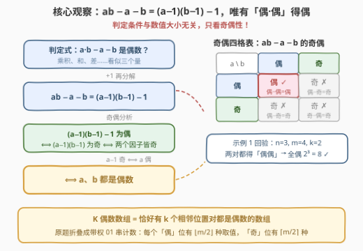
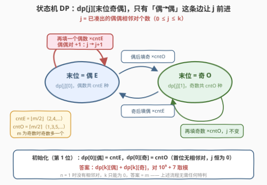
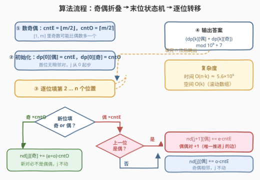
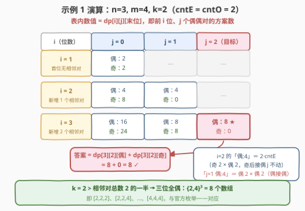

# 查找K偶数数组的数量

- **题目名称**：查找K偶数数组的数量
- **链接**：[3339. 查找 K 偶数数组的数量](https://leetcode.cn/problems/find-the-number-of-k-even-arrays/)
- **难度**：中等
- **标签**：动态规划、计数、数学、奇偶性

## 1. 题目概述

> ⚠️ 本题为 LeetCode 付费题，题意描述根据官方示例用例与 hints 重建，可能与官方题面有出入。

给定三个整数 `n`、`m` 和 `k`。

一个长度为 `n` 的数组 `arr` 被称为 **K 偶数**（K-Even）的，如果它**恰好**有 `k` 个下标 $i$（$0 \le i \lt n - 1$）满足：

- $(\text{arr}[i] \times \text{arr}[i+1]) - \text{arr}[i] - \text{arr}[i+1]$ 是**偶数**。

返回所有元素均在 $[1, m]$ 范围内的 **K 偶数** 数组的数量。由于答案可能很大，返回其对 $10^9 + 7$ 取模的结果。

**示例 1**：

```text
输入：n = 3, m = 4, k = 2
输出：8
解释：8 个满足条件的 2 偶数数组为：
[2,2,2], [2,2,4], [2,4,2], [2,4,4],
[4,2,2], [4,2,4], [4,4,2], [4,4,4]
```

**示例 2**：

```text
输入：n = 5, m = 1, k = 0
输出：1
解释：唯一的 0 偶数数组是 [1,1,1,1,1]。
```

**示例 3**：

```text
输入：n = 7, m = 7, k = 5
输出：5832
```

**约束条件**：

- $1 \le n \le 750$
- $0 \le k \le n - 1$
- $1 \le m \le 1000$

> 💡 **读题关键**：① 判定式 $ab - a - b$ 里又有乘又有减，看着唬人，但**奇偶性只依赖两个操作数的奇偶**——先做代数化简再分类讨论；② 「恰好 $k$ 个」是计数 DP 的经典维度（对照「至多/恰好」转化家族）；③ 答案取模 $10^9+7$ 说明方案数是天文数字，**绝不能枚举数组**，必须把每个位置折叠成「奇/偶」两种身份；④ $n \le 750$、$k \le n-1$ 的规模恰好容纳 $O(nk)$ 的双维 DP。

---

## 2. 解题思路

### 2.1 暴力思路：枚举数组不可行

最朴素的做法是枚举 $[1,m]^n$ 里的每个数组，逐对检查判定式：代价 $O(n \cdot m^n)$，$n=750$、$m=1000$ 时连枚举奇偶模式（$2^{750}$ 种）都不可能。但这个「暴力不可行」的事实本身就在提示：**判定条件必然可以折叠到极小的状态空间上**。小数据下（$n \le 6$）暴力程序仍有价值——它可以充当对拍器，用来验证后续 DP 与组合公式的正确性。

### 2.2 核心观察：判定条件折叠为「相邻偶偶对」

判定式做一步**因式分解**：

$$ab - a - b = (a-1)(b-1) - 1$$

于是「$ab - a - b$ 为偶」等价于「$(a-1)(b-1)$ 为奇」，而**乘积为奇当且仅当两个因子都是奇数**，即 $a-1$ 与 $b-1$ 皆奇，也就是——

> **$a$ 与 $b$ 都是偶数。**

用奇偶四格表穷举验证（$ab - a - b$ 的奇偶）：

| $a$ | $b$ | $ab$ | $a+b$ | $ab - a - b$ | 为偶？ |
|-----|-----|------|-------|--------------|--------|
| 偶  | 偶  | 偶   | 偶    | 偶 − 偶 = 偶 | ✅ |
| 偶  | 奇  | 偶   | 奇    | 偶 − 奇 = 奇 | ❌ |
| 奇  | 偶  | 偶   | 奇    | 偶 − 奇 = 奇 | ❌ |
| 奇  | 奇  | 奇   | 偶    | 奇 − 偶 = 奇 | ❌ |



所以原问题等价于：**数出「恰好有 $k$ 个相邻位置对都是偶数」的数组个数**。用示例 1 回验：$m=4$ 时偶数有 $\{2,4\}$ 共 2 个；$k=2$ 意味着 $(a_0,a_1)$、$(a_1,a_2)$ 两对都得是偶偶，即三位全偶，$2^3 = 8$ ✓，与官方枚举完全一致。

进一步折叠：每个位置只剩「**偶** / **奇**」两种身份，取值个数分别为

$$\text{cntE} = \lfloor m/2 \rfloor \;(\text{偶数 } 2,4,\dots), \qquad \text{cntO} = m - \lfloor m/2 \rfloor = \lceil m/2 \rceil \;(\text{奇数 } 1,3,5,\dots)$$

注意 $[1,m]$ 中奇数个数**不少于**偶数个数（$m$ 为奇数时恰好多一个），别想当然地对半分。

### 2.3 算法流程：末位奇偶状态机 DP

「偶偶对」什么时候 +1？当且仅当**新填的数是偶数且上一位也是偶数**。这是典型的**末位状态依赖**——只要把「上一位的奇偶」写进状态，后效性即被消除：

**状态定义**：$\text{dp}[i][j][p]$ = 前 $i$ 个位置已填好、已凑出 $j$ 个偶偶相邻对、第 $i$ 位奇偶性为 $p$（$0$ = 偶，$1$ = 奇）的方案数。

**转移**（枚举第 $i+1$ 位填什么）：

- **填奇数**（$\text{cntO}$ 种）：新对 $(\text{末位}, \text{奇})$ 不可能是偶偶 → $j$ 不动：

$$\text{dp}[i+1][j][1] \mathrel{+}= \text{cntO} \cdot \big(\text{dp}[i][j][0] + \text{dp}[i][j][1]\big)$$

- **填偶数**（$\text{cntE}$ 种）：上一位是奇 → $j$ 不动；上一位是偶 → 偶偶对 +1：

$$\text{dp}[i+1][j][0] \mathrel{+}= \text{cntE} \cdot \text{dp}[i][j][1], \qquad \text{dp}[i+1][j+1][0] \mathrel{+}= \text{cntE} \cdot \text{dp}[i][j][0]$$

**初始化**：$\text{dp}[1][0][0] = \text{cntE}$，$\text{dp}[1][0][1] = \text{cntO}$（首位无相邻对，$j$ 恒为 0）。

**答案**：$\text{dp}[n][k][0] + \text{dp}[n][k][1] \pmod{10^9+7}$。



> 💡 **这是一个两状态自动机**：把「末位奇偶」看作节点，「填奇 / 填偶」看作带权重的边，只有「偶 → 偶」这条边让计数器 $j$ 前进。这正是一切「计数状态机 DP」的通用形状——[790. 多米诺和托米诺平铺](../0701-0800/790_多米诺和托米诺平铺.md) 的「末列形态」、[935. 骑士拨号器](../0901-1000/935_骑士拨号器.md) 的「当前键位」都是同一个模式。



> ⚠️ **溢出是 C++ 主坑**：$\text{cntE}, \text{cntO} \le 1000$ 而 $\text{dp}$ 值 $< 10^9+7$，乘积可达 $10^{12}$，超出 `int32` 上限三个数量级——中间量必须用 `long long`，且「先取模、再相乘、乘完再取模」。

### 2.4 示例演算

以示例 1（$n=3$，$m=4$，$k=2$，$\text{cntE} = \text{cntO} = 2$）逐位填表：



1. **$i = 1$**（首位）：$j=0$ 处 偶：2、奇：2（首位各自身份的取值数）；
2. **$i = 2$**（新增 1 个相邻对）：$j=0$ 处 偶：$2\times2=4$（奇→偶）、奇：$(2+2)\times2=8$（填奇）；$j=1$ 处 偶：$2\times2=4$（**偶→偶**，唯一推进 $j$ 的边）；
3. **$i = 3$**（新增第 2 个相邻对）：$j=0$ 处 偶：$8\times2=16$、奇：$(4+8)\times2=24$；$j=1$ 处 偶：$0\times2+4\times2=8$、奇：$(4+0)\times2=8$；$j=2$ 处 偶：$4\times2=8$（$i=2$ 时 $j=1$ 的偶 $4$ 再接一个偶）、奇：0；
4. **汇总**：$\text{dp}[3][2][\text{偶}] + \text{dp}[3][2][\text{奇}] = 8 + 0 = 8$ ✓。

直觉核对：$k=2$ 就是全部两对相邻都是偶偶 → 三位全偶，$\{2,4\}^3$ 恰好 $8$ 个数组。

---

## 3. 参考代码

### C++

```cpp
class Solution {
  public:
    int countOfArrays(int n, int m, int k) {
        constexpr long long MOD = 1'000'000'007LL;
        long long cntE = m / 2, cntO = m - m / 2;   // [1,m] 中偶数 / 奇数个数
        // dp[j][p]：已填到第 i 位，凑出 j 个偶偶对，末位奇偶为 p
        vector<array<long long, 2>> dp(k + 1);
        dp[0][0] = cntE;                            // 首位填偶
        dp[0][1] = cntO;                            // 首位填奇
        for (int i = 2; i <= n; ++i) {
            vector<array<long long, 2>> nd(k + 1);
            for (int j = 0; j <= k; ++j) {
                long long e = dp[j][0], o = dp[j][1];
                if (e == 0 && o == 0) continue;
                nd[j][1] = (nd[j][1] + (e + o) % MOD * cntO) % MOD;  // 填奇：j 不动
                nd[j][0] = (nd[j][0] + o * cntE) % MOD;              // 奇→偶：j 不动
                if (j + 1 <= k)
                    nd[j + 1][0] = (nd[j + 1][0] + e * cntE) % MOD;  // 偶→偶：j+1
            }
            dp = move(nd);
        }
        return (dp[k][0] + dp[k][1]) % MOD;
    }
};
```

### Python

```python
class Solution:
    def countOfArrays(self, n: int, m: int, k: int) -> int:
        MOD = 10**9 + 7
        cnt_e, cnt_o = m // 2, m - m // 2            # [1,m] 中偶 / 奇个数
        dp = [[0, 0] for _ in range(k + 1)]          # dp[j][p]：j 个偶偶对，p=末位偶/奇
        dp[0][0], dp[0][1] = cnt_e, cnt_o
        for _ in range(2, n + 1):
            nd = [[0, 0] for _ in range(k + 1)]
            for j in range(k + 1):
                e, o = dp[j]
                if e == 0 and o == 0:
                    continue
                nd[j][1] = (nd[j][1] + (e + o) * cnt_o) % MOD        # 填奇：j 不动
                nd[j][0] = (nd[j][0] + o * cnt_e) % MOD              # 奇→偶：j 不动
                if j + 1 <= k:
                    nd[j + 1][0] = (nd[j + 1][0] + e * cnt_e) % MOD  # 偶→偶：j+1
            dp = nd
        return (dp[k][0] + dp[k][1]) % MOD
```

> 💡 **实现细节**：① `dp` 只依赖上一层，用「新表 + `move`」滚动即可 $O(k)$ 空间；由于「偶→偶」的贡献方向是 $j \to j+1$（**从低往高**），也可以单表**倒序枚举 $j$** 就地更新；② $j+1 > k$ 的转移直接剪掉——$j$ 只增不减，超出 $k$ 的状态永远回不来；③ $m=1$（全奇）、$n=1$（无相邻对，$k$ 只能为 0）等边界全部被状态机自然吸收，**无需特判**；④ 也可写成记忆化搜索 `dfs(i, j, p)`，状态与含义完全同构。

---

## 4. 复杂度分析

| 维度 | 复杂度 | 说明 |
|------|--------|------|
| 时间复杂度 | $O(n \cdot k)$ | 双重循环（位置 $i$ × 计数 $j$），每次转移 $O(1)$；$n, k \le 750$ 时约 $5.6 \times 10^5$ 次转移 |
| 空间复杂度 | $O(k)$ | 滚动数组只保留相邻两层，每层 $k+1$ 个双格状态 |
| 暴力对照 | $O(n \cdot m^n)$ | 枚举全部数组；即使折叠成奇偶模式也有 $2^n$ 种，$n = 750$ 时不可行 |

实测：三组官方样例 $8 / 1 / 5832$ ✓；与 $O(n \cdot m^n)$ 暴力在 $n \le 8$、$m \le 6$ 的全部 $(n, m, k)$ 组合下对拍一致；极端规模 $n = k + 1 = 750$、$m = 1000$ 瞬时出解（模意义下结果 $333434247$）。

---

## 5. 扩展：组合闭式与矩阵快速幂

**闭式一击：按「偶数游程」拆组合数。** 把奇偶模式串里的偶数切成 $r$ 段极大连续游程，长度分别为 $L_1, \dots, L_r$，则偶偶对总数为 $\sum (L_t - 1) = j - r$（$j$ 为偶数总个数）。令其等于 $k$ 得 $r = j - k$，于是按「先放哪 $j$ 个偶数位，再分游程与缝隙」三步计数：

$$\text{ans} = [k=0]\cdot \text{cntO}^{\,n} + \sum_{j=\max(1,\,k+1)}^{n} \binom{j-1}{r-1}\binom{n-j+1}{r}\,\text{cntE}^{\,j}\,\text{cntO}^{\,n-j}, \qquad r = j - k$$

其中 $\binom{j-1}{r-1}$ 把 $j$ 个偶数分成 $r$ 个非空游程，$\binom{n-j+1}{r}$ 把 $n-j$ 个奇数放进 $r+1$ 个缝隙（内部缝隙至少 1 个隔开游程）；$[k=0]$ 项对应「一个偶数都没有」的模式。用示例 3 验证（$n=7$，$m=7$，$\text{cntE}=3$，$\text{cntO}=4$）：仅 $j=6$ 项非零，$r=1$，$\binom{5}{0}\binom{2}{1} \cdot 3^6 \cdot 4^1 = 5832$ ✓。复杂度 $O(n)$（配合快速幂）或线性预处理阶乘后 $O(n)$，但实现细节比 DP 多、边界易错——**面试先交 DP，闭式作为加分项**。

**$n$ 巨大时的矩阵快速幂。** 本题 $n \le 750$ 无此需求，但转移「填奇 / 填偶、$j$ 是否 +1」是固定线性变换，状态向量共 $2(k+1)$ 维。若 $n$ 放大到 $10^{18}$，可把转移写成 $2(k+1) \times 2(k+1)$ 的矩阵做快速幂，复杂度 $O\big((2k)^3 \log n\big)$——这正是 [935. 骑士拨号器](https://leetcode.cn/problems/knight-dialer/) 的标准升级路线。

---

## 6. 面试要点

1. **判定式 $ab - a - b$ 怎么化简？**

   - 因式分解 $ab - a - b = (a-1)(b-1) - 1$；乘积为奇 ⟺ 两因子皆奇 ⟺ $a, b$ 皆偶。也可以直接列奇偶四格表穷举验证。核心意识：**涉及乘、加、减的奇偶判定，先把代数式整形再分类**，别被表面复杂度吓住。

2. **为什么状态必须带「上一位的奇偶」？**

   - 偶偶对是否 +1 由「新位 × 上一位」共同决定，只看新位无法定夺——这是后效性。把末位奇偶收进状态后，转移只依赖当前状态，问题变成两节点带权自动机上的路径计数。同构经典：790 平铺的末列形态、935 拨号器的当前键位。

3. **cntE 和 cntO 分别是多少？为什么不是各一半？**

   - $[1, m]$ 中偶数有 $\lfloor m/2 \rfloor$ 个、奇数有 $\lceil m/2 \rceil$ 个，$m$ 为奇数时奇数恰好多一个（$1$ 开头 $m$ 结尾）。特别地 $m = 1$ 时 $\text{cntE} = 0$，「偶→偶」边权重为 0，DP 自动退化出「只有全奇数组」——**边界被权重自然吸收，无需特判**。

4. **C++ 实现有哪些坑？**

   - $\text{cntE} \times \text{dp}$ 值可达 $1000 \times (10^9+6) \approx 10^{12}$，超 `int32`；用 `long long` 存状态并在每次乘加后取模。另外「先 `(e + o) % MOD` 再乘」这种细节能防住三个数连乘的极端溢出。

5. **还能更快吗？**

   - DP 的 $O(nk)$ 已是「显式逐位构造」规模下界；要再降需换视角——组合闭式 $O(n)$，或 $n$ 超大时矩阵快速幂 $O\big((2k)^3 \log n\big)$。面试中主动提这两条升级路线，比背出它们更能体现设计能力。

---

## 7. 同类练习题

- [2222. 选择建筑的方案数](https://leetcode.cn/problems/number-of-ways-to-select-buildings/)（[站内题解](../2201-2300/2222_选择建筑的方案数.md)）：同为 01 串上带相邻约束的计数，前缀状态 DP 的姊妹题
- [3130. 找出所有稳定的二进制数组 II](https://leetcode.cn/problems/find-all-possible-stable-binary-arrays-ii/)（[站内题解](../3101-3200/3130_找出所有稳定的二进制数组II.md)）：二进制数组计数 DP，「上一位放了什么」决定转移的进阶练习
- [2533. 好二进制字符串的数量](https://leetcode.cn/problems/number-of-good-binary-strings/)（[站内题解](../2501-2600/2533_好二进制字符串的数量.md)）：按「追加一段 0 / 一段 1」推进的计数状态机，与本题「填奇 / 填偶」转移同构
- [790. 多米诺和托米诺平铺](https://leetcode.cn/problems/domino-and-tromino-tiling/)（[站内题解](../0701-0800/790_多米诺和托米诺平铺.md)）：「末位形态」决定转移的经典计数 DP 母题
- [935. 骑士拨号器](https://leetcode.cn/problems/knight-dialer/)（[站内题解](../0901-1000/935_骑士拨号器.md)）：固定转移图上的路径计数，练矩阵快速幂升级路线
