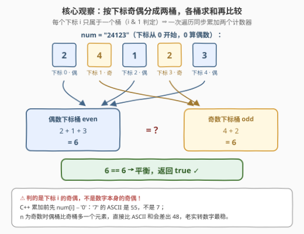
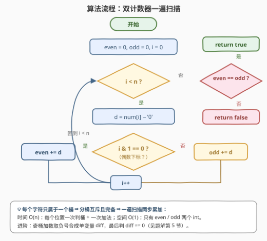
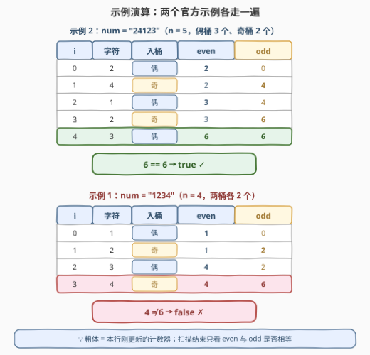

# LeetCode 检查平衡字符串 题解

## 1. 题目概述

- **标题 / 题号**：检查平衡字符串（#3340，easy）
- **链接**：https://leetcode.cn/problems/check-balanced-string/
- **难度**：简单
- **标签**：字符串、数组、一次遍历、奇偶分桶

**题意**：给你一个仅由数字 0 - 9 组成的字符串 `num`。如果**偶数下标**处的数字之和等于**奇数下标**处的数字之和，则认为该数字字符串是一个**平衡字符串**。

如果 `num` 是平衡字符串，返回 `true`；否则返回 `false`。

**示例 1**：

```text
输入：num = "1234"
输出：false
解释：偶数下标处的数字之和为 1 + 3 = 4，奇数下标处的数字之和为 2 + 4 = 6。
     由于 4 不等于 6，num 不是平衡字符串。
```

**示例 2**：

```text
输入：num = "24123"
输出：true
解释：偶数下标处的数字之和为 2 + 1 + 3 = 6，奇数下标处的数字之和为 4 + 2 = 6。
     由于两者相等，num 是平衡字符串。
```

**约束**：

- $2 \le \text{num.length} \le 100$
- `num` 仅由数字 0 - 9 组成

> 💡 **读题关键**：① 「偶数下标」判的是**下标 $i$** 的奇偶，**不是数字本身的奇偶**——`num[0]` 永远进偶桶（0 也是偶数）；② 两桶各是 $\lceil n/2 \rceil$ 与 $\lfloor n/2 \rfloor$ 个元素，只需**求和比较**，无需存储分桶结果；③ 数据规模 $n \le 100$，和至多 $50 \times 9 = 450$，`int` 毫无压力——本题考的是**写得干净**，不是算得快。

## 2. 解题思路

### 2.1 朴素思路：切片两次求和

最省事的做法（Python）是隔位切片，各扫一遍求和再比较：

```python
sum(map(int, num[::2])) == sum(map(int, num[1::2]))
```

正确性显然，但拆开看有两个小浪费：**两次遍历**同一段字符串，且切片各拷贝出一份 $O(n)$ 的临时串。$n \le 100$ 时无所谓，但既然每个字符**只属于一个桶**，一遍扫描就能同时喂饱两个累加器——这是签到题里最值得展示的一步优化。

### 2.2 核心观察：下标奇偶是天然的二分桶 → 双计数器一遍扫



三条观察：

**观察一：分桶互斥且完备。** 每个下标 $i$ 要么满足 $i \bmod 2 = 0$（进偶桶 `even`），要么进奇桶 `odd`，没有第三个去处，也不会重复入桶。所以一次遍历里做一次二选一即可，两桶同步累加：

$$\text{even} = \sum_{i \bmod 2 = 0} \text{num}[i], \qquad \text{odd} = \sum_{i \bmod 2 = 1} \text{num}[i]$$

**观察二：判奇偶用 $i \,\&\, 1$。** 取二进制最低位，与 $i \bmod 2$ 等价，位运算免去除法，也是竞赛写法的肌肉记忆。

**观察三：字符必须减 `'0'` 再累加。** 字符串里存的是 ASCII 码（`'7'` 是 55 不是 7），C++ 写 `num[i] - '0'`，Python 写 `int(ch)`。

> ⚠️ **两个高频翻车点**：
>
> - **桶判错对象**：把「偶数下标」写成「数字为偶数」（`num[i] % 2`）——示例 1 的 `"1234"` 恰好两个条件都不平衡，乍看测不出错，换 `"24123"` 立刻翻车；
> - **省掉 `- '0'` 直接比 ASCII 和**：设 $k$ 为桶内元素个数，ASCII 和 $=$ 数字和 $+ 48k$。$n$ 为**偶数**时两桶等大，$48k$ 两边抵消，直接比恰好成立；$n$ 为**奇数**时偶桶多一个，两边差出 48，直接比就错。抖这个机灵必须先判 $n$ 的奇偶，老实转换最稳。

### 2.3 算法流程图



`even`、`odd` 双计数器清零，$i$ 从 0 扫到 $n-1$：取 $d = \text{num}[i] - '0'$，按 $i \,\&\, 1$ 分桶累加；扫描结束后比较 `even == odd` 即得答案。一次线性扫描，两个整型变量。

### 2.4 示例演算



以示例 2 `"24123"` 走一遍（$n=5$，偶桶 3 个、奇桶 2 个）：

1. $i=0$，`'2'` → 偶桶，`even = 2`；
2. $i=1$，`'4'` → 奇桶，`odd = 4`；
3. $i=2$，`'1'` → 偶桶，`even = 3`；
4. $i=3$，`'2'` → 奇桶，`odd = 6`；
5. $i=4$，`'3'` → 偶桶，`even = 6`；
6. 比较：$6 = 6$ → 返回 `true` ✓。

再以示例 1 `"1234"` 复核：偶桶 $1+3=4$，奇桶 $2+4=6$，$4 \ne 6$ → 返回 `false` ✓。

## 3. 参考代码

### C++

```cpp
class Solution {
  public:
    bool isBalanced(string num) {
        int even = 0, odd = 0;                     // 偶数下标和 / 奇数下标和
        for (int i = 0; i < (int)num.size(); ++i)
            (i & 1 ? odd : even) += num[i] - '0';  // 按下标奇偶二选一入桶
        return even == odd;
    }
};
```

### Python

```python
class Solution:
    def isBalanced(self, num: str) -> bool:
        even = odd = 0
        for i, ch in enumerate(num):
            if i & 1:
                odd += int(ch)      # 奇数下标
            else:
                even += int(ch)     # 偶数下标
        return even == odd


# 写法二：隔位切片，一行收工（两次遍历 + O(n) 切片空间）
class Solution:
    def isBalanced(self, num: str) -> bool:
        return sum(map(int, num[::2])) == sum(map(int, num[1::2]))
```

> 💡 **实现细节**：① 三目 `(i & 1 ? odd : even) += d` 把 if/else 压成一行，分桶意图一目了然；② 切片写法务必带 `map(int, ...)`——`sum("1234"[::2])` 累加的是 ASCII 码（见 2.2 的 ⚠️）；③ Python 的 `i & 1` 与 `i % 2` 等价，`enumerate` 同时拿下标与字符，最省事。

## 4. 复杂度分析

| 维度 | 复杂度 | 说明 |
|------|--------|------|
| 时间 | $O(n)$ | 一次线性扫描，每个位置做一次判桶 + 一次加法 |
| 空间 | $O(1)$ | 只维护 `even` / `odd` 两个计数器（切片写法需 $O(n)$ 临时串） |
| 数据规模 | $\le 450$ | $n \le 100$，单桶至多 50 个数字、每个 $\le 9$，`int` 绰绰有余 |

## 5. 扩展：一个计数器行不行？

把奇桶的加数**加负号**，两个计数器就能压成一个**带符号差值**：

$$\text{diff} = \sum_{i \bmod 2 = 0} \text{num}[i] \;-\; \sum_{i \bmod 2 = 1} \text{num}[i], \qquad \text{平衡} \iff \text{diff} = 0$$

```cpp
int diff = 0;
for (int i = 0; i < (int)num.size(); ++i)
    diff += (i & 1 ? -1 : 1) * (num[i] - '0');
return diff == 0;
```

本题里这只是省一个变量的抖机灵，但「**用正负号把两类计数压成一个量**」是个通用的建模手法：[525. 连续数组](https://leetcode.cn/problems/contiguous-array/) 把 0 记作 $-1$，从而使「0 与 1 个数相等」变成「前缀和为 0」；本题把奇桶记作 $-d$，把「两桶相等」变成「差值为 0」。凡是要判**两类东西数量/总和相等**的场景，都值得先想一步「能不能合成一个带符号的量」。

## 6. 面试要点

1. **「偶数下标」和「偶数数字」怎么区分？`num[0]` 进哪个桶？**

   - 判的是下标 $i$ 的奇偶：`i & 1 == 0` 进偶桶，与 `num[i]` 的数值无关。下标从 0 开始，0 是偶数，所以第一个字符永远进偶桶。

2. **C++ 为什么必须 `num[i] - '0'`？有没有办法省掉？**

   - 字符串存的是 ASCII 码，直接累加得到的是 $48k + \text{数字和}$。若 $n$ 为偶数，两桶元素个数相同，$48k$ 两边抵消，直接比也成立；$n$ 为奇数时偶桶多一个，直接比会差 48。省转换必须先按 $n$ 奇偶特判，不如老实减 `'0'` 稳妥。

3. **`i & 1` 和 `i % 2` 有区别吗？**

   - 非负整数上完全等价，位运算更快。差异出现在**负数**：C++ 中 `-3 % 2 == -1` 而 `-3 & 1 == 1`，本题 $i$ 非负无此坑，但写通用代码时要心里有数。

4. **一遍扫描和切片两次求和，差别在哪？**

   - 渐进复杂度同为 $O(n)$，差别是常数与空间：双计数器一遍扫 + $O(1)$ 空间；切片两遍扫 + 各一份 $O(n)$ 临时串。数据小都行，但面试叙事上「先给朴素、再指出每字符只属一桶、合并成一遍」是标准的优化思维链。

5. **能否只用一个变量？判什么条件？**

   - 可以：奇桶加数取负号做带符号累加 `diff`，最终判 `diff == 0`，等价于两桶和相等（见第 5 节，与 525 连续数组的「0 记 −1」同源）。

## 同类练习题

| # | 题目 | 与本题的关联 |
|---|------|-------------|
| 922 | [按奇偶排序数组 II](https://leetcode.cn/problems/sort-array-by-parity-ii/)（[站内题解](../0901-1000/922_按奇偶排序数组II.md)） | 同样是「下标奇偶」分桶，升级为值与下标双重奇偶约束下的原地交换 |
| 2535 | [数组元素和与数字和的绝对差](https://leetcode.cn/problems/difference-between-element-sum-and-digit-sum-of-an-array/)（[站内题解](../2501-2600/2535_数组元素和与数字和的绝对差.md)） | 两类求和作差的同构签到题，练「分类累加再比较」 |
| 2894 | [分类求和并作差](https://leetcode.cn/problems/divisible-and-non-divisible-sums-difference/)（[站内题解](../2801-2900/2894_分类求和并作差.md)） | 按整除性分类求和作差，与本题的分桶求和模板完全同构 |
| 1295 | [统计位数为偶数的数字](https://leetcode.cn/problems/find-numbers-with-even-number-of-digits/)（[站内题解](../1201-1300/1295_统计位数为偶数的数字.md)） | 一次遍历条件计数的基础模板，注意这里判的是**数值**性质 |
| 2652 | [倍数求和](https://leetcode.cn/problems/sum-multiples/) | 条件过滤求和的最简形态，可与本题对照「过滤型」与「分桶型」两类一遍扫描 |
