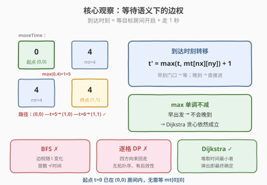
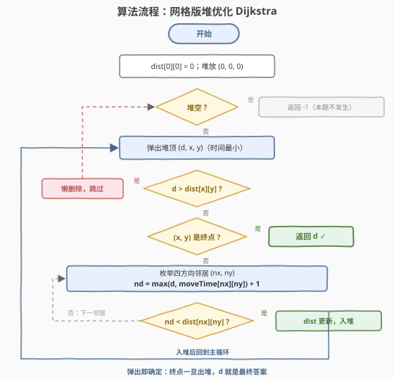
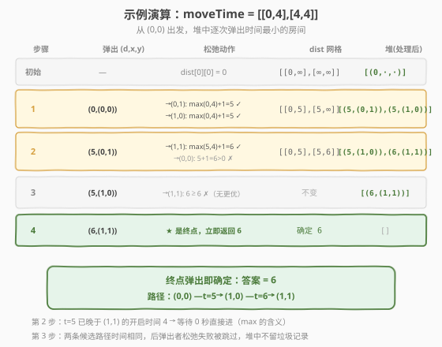

# LeetCode 到达最后一个房间的最少时间 I 题解

- **关联**：3342 是本题升级版（移动耗时在 1 秒 / 2 秒间交替）

## 1. 题目概述

- **标题 / 题号**：到达最后一个房间的最少时间 I（#3341，medium）
- **链接**：https://leetcode.cn/problems/find-minimum-time-to-reach-last-room-i/
- **难度**：中等
- **标签**：图、最短路径、Dijkstra、堆/优先队列、矩阵

**题意**：地窖中有 $n \times m$ 个房间，呈网格状分布。给定二维数组 `moveTime`，其中 `moveTime[i][j]` 表示房间 $(i, j)$ **开启并可达**所需的最小秒数。你在时刻 $t = 0$ 从房间 $(0, 0)$ 出发，每次可以移动到**相邻**（有公共边）的一个房间，移动本身耗时 1 秒。

> 💡 **移动语义的精确表述**：若你在时刻 $t$ 位于房间 $(i, j)$，移动到相邻房间 $(nx, ny)$，则**到达时刻**为
> $$t' = \max\bigl(t,\ \text{moveTime}[nx][ny]\bigr) + 1$$
> 即：人到了门口，还得等房间开启（等到 `moveTime[nx][ny]` 时刻），再花 1 秒走进去。求到达 $(n-1, m-1)$ 的最少时间。

**示例 1**：

```text
输入：moveTime = [[0,4],[4,4]]
输出：6
解释：t=4 从 (0,0) 移动到 (1,0)，花费 1 秒；t=5 从 (1,0) 移动到 (1,1)，花费 1 秒。
```

**示例 2**：

```text
输入：moveTime = [[0,0,0],[0,0,0]]
输出：3
解释：所有房间即刻开启，沿 (0,0)→(1,0)→(1,1)→(1,2) 走 3 步即 3 秒。
```

**示例 3**：

```text
输入：moveTime = [[0,1],[1,2]]
输出：3
```

**约束**：

- `2 <= n == moveTime.length <= 50`
- `2 <= m == moveTime[i].length <= 50`
- `0 <= moveTime[i][j] <= 10^9`

## 2. 解题思路

### 2.1 暴力思路：为什么 BFS / 逐格 DP 都不行？

第一反应是"网格 + 相邻移动 = BFS"。若**等效边权恒为 1**，BFS 按层扩展，层数即最短时间（如[腐烂的橘子](../0901-1000/994_腐烂的橘子.md)）。但本题到达时刻是 $\max(t, \text{moveTime}[nx][ny]) + 1$——**取决于出发时刻 $t$**：早到门口要干等，晚到反而"无缝衔接"。于是"步数少"≠"时间少"，BFS 的分层假设被破坏。

逐格 DP（类似[最小路径和](https://leetcode.cn/problems/minimum-path-sum/)）也不行：`dist[i][j]` 想从左/上转移，但网格允许四个方向来回走，格子间**没有拓扑序**；且到达时间依赖整条路径的等待历史，具有**后效性**。

暴力枚举所有路径则是指数级。正确姿势是把每个房间看成一个节点、把"等待 + 移动"看成一条边，跑**最短路**——题目 hints 也只有一句：*Use shortest path algorithms.*

### 2.2 核心观察：时间依赖边权下的 Dijkstra



把房间建成图上的节点，相邻房间之间连双向边。关键的转移方程：

$$t' = \max\bigl(t,\ \text{moveTime}[nx][ny]\bigr) + 1$$

> ⚠️ 这个"边权"**不是静态正数**，而是出发时刻 $t$ 的函数！经典 Dijkstra 的正确性证明似乎只覆盖静态边权，那还能用吗？

**能。** 记转移函数 $f(t) = \max(t, c) + 1$（$c$ 为目标房间的开启时间），它关于 $t$ **单调不减**——由此得到一条朴素而关键的性质：

> 💡 **早出发，不晚到**：从同一房间出发，任何"更早"的出发时刻，走任意后续路径，到达任何房间的时刻都不会更晚。

于是 Dijkstra 的贪心不变量依然成立：每次从堆中取出**当前时间最小**的房间 $u$ 时，`dist[u]` 已是最终最优值——因为任何其它到达 $u$ 的路径，必然途经某个仍在堆中（时间 $\geq$ `dist[u]`）的中间房间，由"早出发不晚到"，绕行只会更晚。换句话说，**等待不会带来收益**，与静态非负边权的情形一样，"绕远路"不可能反超。

算法骨架：

- `dist[0][0] = 0`（起点时刻 0 已在房间内，**无需等 `moveTime[0][0]`**，等待只发生在"进入"目标房间时）
- 最小堆存放 `(时间, x, y)`，每次弹出时间最小者
- 对四个方向的邻居 $(nx, ny)$ 松弛：$nd = \max(d, \text{moveTime}[nx][ny]) + 1$，若 $nd < \text{dist}[nx][ny]$ 则更新并入堆
- **弹出终点 $(n-1, m-1)$ 时即可返回**——Dijkstra 的"弹出即确定"性质

### 2.3 算法流程图



### 2.4 示例演算

以示例 1 `moveTime = [[0,4],[4,4]]` 为例：



| 步骤 | 弹出 (d, 房间) | 松弛动作 | dist 网格 | 堆（处理后） |
|------|---------------|---------|-----------|--------------|
| 初始 | — | dist[0][0]=0 | [[0,∞],[∞,∞]] | [(0,(0,0))] |
| 1 | (0,(0,0)) | →(0,1): max(0,4)+1=5；→(1,0): max(0,4)+1=5 | [[0,5],[5,∞]] | [(5,(0,1)),(5,(1,0))] |
| 2 | (5,(0,1)) | →(1,1): max(5,4)+1=6；→(0,0): 6>0 ✗ | [[0,5],[5,6]] | [(5,(1,0)),(6,(1,1))] |
| 3 | (5,(1,0)) | →(1,1): 6≥6 ✗；→(0,0): ✗ | 不变 | [(6,(1,1))] |
| 4 | (6,(1,1)) | **是终点，返回 6** | — | — |

注意第 2 步：从 $(0,1)$ 出发时 $t=5$ 已**晚于** $(1,1)$ 的开启时间 4，等待 0 秒直接进——这正是 `max` 的含义。最终答案 `6`。

## 3. 参考代码

### C++

```cpp
class Solution {
  public:
    int minTimeToReach(vector<vector<int>>& moveTime) {
        int n = moveTime.size(), m = moveTime[0].size();
        const int INF = INT_MAX / 2;
        vector<vector<int>> dist(n, vector<int>(m, INF));
        dist[0][0] = 0;

        // 最小堆：(到达时间, x, y)
        priority_queue<tuple<int,int,int>, vector<tuple<int,int,int>>, greater<>> pq;
        pq.push({0, 0, 0});

        const int dx[4] = {-1, 1, 0, 0};
        const int dy[4] = {0, 0, -1, 1};

        while (!pq.empty()) {
            auto [d, x, y] = pq.top(); pq.pop();
            if (d > dist[x][y]) continue;          // 懒删除：过期记录
            if (x == n - 1 && y == m - 1) return d; // 弹出即确定
            for (int k = 0; k < 4; ++k) {
                int nx = x + dx[k], ny = y + dy[k];
                if (nx < 0 || nx >= n || ny < 0 || ny >= m) continue;
                int nd = max(d, moveTime[nx][ny]) + 1;   // 等待 + 移动
                if (nd < dist[nx][ny]) {
                    dist[nx][ny] = nd;
                    pq.push({nd, nx, ny});
                }
            }
        }
        return -1;  // 网格四连通，实际不会到达
    }
};
```

> 💡 **会溢出吗？** 最短路径至多 $n + m - 2 = 98$ 步，总时间 $\leq \max(\text{moveTime}) + 98 < 10^9 + 10^2$，`int` 足够；若不放心可整体换 `long long`。

### Python

```python
class Solution:
    def minTimeToReach(self, moveTime: List[List[int]]) -> int:
        n, m = len(moveTime), len(moveTime[0])
        INF = float('inf')
        dist = [[INF] * m for _ in range(n)]
        dist[0][0] = 0

        pq = [(0, 0, 0)]  # (到达时间, x, y)
        while pq:
            d, x, y = heapq.heappop(pq)
            if d > dist[x][y]:            # 懒删除：过期记录
                continue
            if x == n - 1 and y == m - 1: # 弹出即确定
                return d
            for nx, ny in ((x - 1, y), (x + 1, y), (x, y - 1), (x, y + 1)):
                if 0 <= nx < n and 0 <= ny < m:
                    nd = max(d, moveTime[nx][ny]) + 1   # 等待 + 移动
                    if nd < dist[nx][ny]:
                        dist[nx][ny] = nd
                        heapq.heappush(pq, (nd, nx, ny))
        return -1
```

## 4. 复杂度分析

| 维度 | 复杂度 | 说明 |
|------|--------|------|
| 时间复杂度 | $O(nm \log(nm))$ | 每个房间至多被松弛 $O(nm)$ 次入堆（实际远少），每次堆操作 $O(\log(nm))$；网格边数为 $O(nm)$ |
| 空间复杂度 | $O(nm)$ | `dist` 数组与堆 |

> 💡 本题 $n, m \leq 50$，节点至多 2500 个，非常宽裕。若把网格推广到大图，这套"网格 Dijkstra"模板（743 的邻接表换成四方向枚举）依然直接可用。

## 5. 扩展：升级版 3342 与其它变体

- **[3342. 到达最后一个房间的最少时间 II](https://leetcode.cn/problems/find-minimum-time-to-reach-last-room-ii/)**：移动耗时不再是恒定 1 秒，而是从 $(x, y)$ 出发时按 $(x+y)$ 的奇偶**交替取 1 / 2 秒**。转移方程改为
  $$nd = \max\bigl(d,\ \text{moveTime}[nx][ny]\bigr) + \bigl((x + y) \bmod 2 + 1\bigr)$$
  模板一个字符都不用多改——移动耗时只依赖出发格子的奇偶，依然是出发时刻与位置的确定性函数，Dijkstra 的单调性论证原封不动。
- **"最小化路径最大值"型**（如 [778. 水位上升的泳池中游泳](https://leetcode.cn/problems/swim-in-rising-water/)、[1631. 最小体力消耗路径](https://leetcode.cn/problems/path-with-minimum-effort/)）：把"路径总和最短"换成"路径上瓶颈最小"，仍是 Dijkstra，只是松弛时取 $\max$ 而非求和——本题的 $\max(d, \text{moveTime})$ 已经带了一点这种"瓶颈"味道。

## 6. 面试要点

1. **为什么 BFS 不适用？**

   - BFS 的正确性依赖"所有边权相等，层数 = 距离"。本题等效边权 $\max(t, c) + 1$ 随出发时刻变化：先到门口要等待，后到反而直接进。"步数最少的路径"未必"时间最早"，分层扩展得到错误答案。

2. **边权依赖出发时间，Dijkstra 为什么仍然正确？**

   - 转移函数 $f(t) = \max(t, c) + 1$ 关于 $t$ 单调不减，保证"早出发不晚到"。于是弹出堆顶（当前时间最小）的房间时，其它候选路径都还要经过时间更大的中间状态，不可能反超——贪心不变量与静态非负边权时一致。

3. **为什么不能用逐格 DP（如最小路径和）？**

   - 网格允许四方向移动，格子间没有拓扑序，无法保证计算 `dist[i][j]` 时其依赖的邻居已最优；到达时间依赖整条路径的等待历史，具有后效性。最短路算法正是消除后效性的标准手段（"已确定集合 + 堆"提供了拓扑序）。

4. **起点 `moveTime[0][0] > 0` 时要不要等待？**

   - 不用。$t=0$ 时人已在 $(0,0)$ 房间内，"开启时间"只约束**进入**该房间的时刻；`dist[0][0] = 0` 直接入堆即可（本题数据保证逻辑上等价，但语义上不要混淆）。

5. **为什么弹出终点就能立即返回？**

   - Dijkstra 每次弹出的节点其 `dist` 已是最终最优值（含懒删除过滤后），终点一旦弹出即确定，无需等堆空。这是常见的小优化；不加这个判断、跑完整个堆后读 `dist[n-1][m-1]` 也正确。

6. **堆里的过期记录怎么处理？**

   - 懒删除：弹出时若 `d > dist[x][y]` 说明是旧记录，`continue` 跳过。同一房间可能有多条记录共存于堆中，不影响正确性，复杂度仍为 $O(nm \log(nm))$。

## 同类练习题

| # | 题目 | 与本题的关联 |
|---|------|-------------|
| 3342 | [到达最后一个房间的最少时间 II](https://leetcode.cn/problems/find-minimum-time-to-reach-last-room-ii/) | 本题升级版，移动耗时按格子奇偶交替 1/2 秒，松弛公式加一个奇偶项即可 |
| 743 | [网络延迟时间](https://leetcode.cn/problems/network-delay-time/) | 堆优化 Dijkstra 模板题（邻接表版），本题是其网格版 |
| 1631 | [最小体力消耗路径](https://leetcode.cn/problems/path-with-minimum-effort/) | 松弛时取边权差最大值而非求和，"瓶颈最短"型 Dijkstra |
| 778 | [水位上升的泳池中游泳](https://leetcode.cn/problems/swim-in-rising-water/) | 最小化路径上最大值，Dijkstra / 二分 + BFS / 并查集三种视角 |
| 1102 | [得分最高的路径](https://leetcode.cn/problems/path-with-maximum-minimum-value/) | 最大化路径最小值，778 的镜像问题（最大化瓶颈） |
