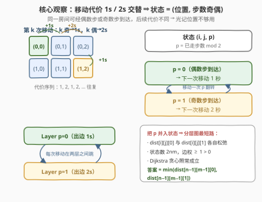
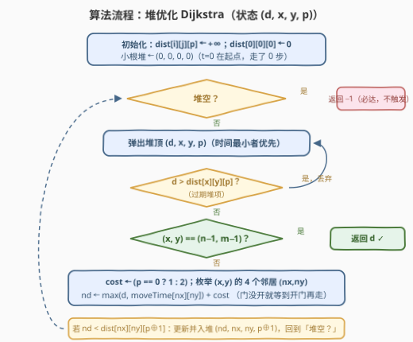
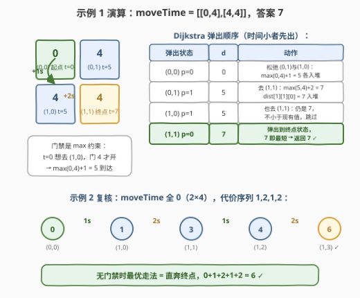

# LeetCode 到达最后一个房间的最少时间 II 题解

## 1. 题目概述

- **标题 / 题号**：到达最后一个房间的最少时间 II（#3342，medium）
- **链接**：https://leetcode.cn/problems/find-minimum-time-to-reach-last-room-ii/
- **难度**：中等
- **标签**：图、数组、矩阵、最短路、堆（优先队列）

**题意**：有一个地窖，地窖中有 $n \times m$ 个房间，呈网格状分布。给定二维数组 `moveTime`，其中 `moveTime[i][j]` 表示**在这个时刻以后**你才可以**开始**往这个房间**移动**。你在时刻 $t = 0$ 从房间 $(0, 0)$ 出发，每次可以移动到**相邻**的一个房间（共享一条水平或垂直的边）。在相邻房间之间移动需要的时间为：**第一次花费 1 秒，第二次花费 2 秒，第三次花费 1 秒，第四次花费 2 秒……如此往复**。

返回到达房间 $(n-1, m-1)$ 所需的**最少**时间。

**示例 1**：

```text
输入：moveTime = [[0,4],[4,4]]
输出：7
解释：t == 4 时从 (0,0) 移动到 (1,0)（等门开 + 花费 1 秒）；
     t == 5 时从 (1,0) 移动到 (1,1)（花费 2 秒）。
```

**示例 2**：

```text
输入：moveTime = [[0,0,0,0],[0,0,0,0]]
输出：6
解释：无门禁限制，直奔终点，移动代价 1 + 2 + 1 + 2 = 6。
```

**示例 3**：

```text
输入：moveTime = [[0,1],[1,2]]
输出：4
```

**约束**：

- $2 \le n = \text{moveTime.length} \le 750$
- $2 \le m = \text{moveTime}[i].\text{length} \le 750$
- $0 \le \text{moveTime}[i][j] \le 10^9$

> 💡 **读题关键**：① `moveTime[i][j]` 约束的是**开始移动进该房间的时刻**——门没开就在门口等，等待本身不花"移动次数"，也不改变步数奇偶；② 与上一版（3341）唯一的区别是**移动代价不再恒为 1**，而是 1、2、1、2 交替——这打破了「BFS 层层扩散 = 最短路」的性质，也打破了「最短路只由位置决定」的直觉；③ $n, m \le 750$，状态数至多 $2 \times 750 \times 750 \approx 1.1 \times 10^6$，堆优化 Dijkstra 刚好落在舒适区；④ 时间上界约 $10^9 + 2(n+m) \approx 10^9 + 3000$，`int` 勉强装得下，但建议 `long long` 求稳。

## 2. 解题思路

### 2.1 暴力思路：枚举所有路径

最直接的想法是 DFS 枚举从 $(0,0)$ 到 $(n-1, m-1)$ 的所有路径，对每条路径按顺序模拟「等门 + 交替代价」算出总时间取最小。

问题在于路径数量是**指数级**的：网格上允许上下左右四个方向（可以绕路换步数奇偶！），即使只考虑单调向右下的路径也有 $\binom{n+m-2}{n-1}$ 条，$n = m = 750$ 时是天文数字。

> 💡 值得注意的是「绕路」在本题**不是显然亏的**：绕一格会多花 1~2 秒，但把总步数的奇偶翻过来，可能让最后一段从 2 秒变 1 秒、或避开一扇很晚才开的门。这种「后续代价依赖历史」的性质，正是需要**扩充状态**的信号。

### 2.2 核心观察：奇偶分层 Dijkstra



三条观察把问题引向**分层图最短路**：

**观察一：等待不亏，门禁是一个 `max` 约束。** 在时刻 $t$ 位于 $(i,j)$，想移动到 $(nx,ny)$：门开时刻是 $\text{moveTime}[nx][ny]$，出发时刻取 $\max(t, \text{moveTime}[nx][ny])$，再花代价 $\text{cost}$ 走完这一步，到达时刻为

$$\text{nd} = \max\bigl(t,\ \text{moveTime}[nx][ny]\bigr) + \text{cost}$$

等待发生在"门口"，不消耗移动次数、不改变奇偶，所以无需为"等待"单独建状态。

**观察二：转移代价取决于步数奇偶，位置信息不够用。** 第 $k$ 次移动（$k$ 从 1 起）花费 $k$ 为奇数时 1 秒、偶数时 2 秒。于是「位于 $(i,j)$、时刻 $t$」并不能决定下一步代价——**经由偶数步还是奇数步到达 $(i,j)$，才是完整信息**。把 $p = k \bmod 2$（已走步数的奇偶）并入状态，得到三元组 $(i, j, p)$：

- $p = 0$（偶数步到达）→ 下一次移动花 **1 秒**；
- $p = 1$（奇数步到达）→ 下一次移动花 **2 秒**；
- 每移动一次，$p$ 翻转：$p \to p \oplus 1$。

这相当于把网格**复制成两层**：第 0 层出边权 1、第 1 层出边权 2，所有边都在两层之间跳。

**观察三：边权恒正，Dijkstra 贪心成立。** 每条转移边代价 $\ge 1 > 0$，分层图上仍是**正权最短路**，堆优化 Dijkstra 直接套用：每个状态 $(i,j,p)$ 的 `dist` 只会被最终确定一次，弹出即最优。

> ⚠️ **两个高频翻车点**：
>
> - **只按位置开 `dist[i][j]`**：同一房间第一次到达（比如奇数步、后续代价 1 秒）未必是全局最优——另一条偶数步路径到达更晚，但后续每步省 1 秒，可能反超。两个奇偶状态必须**各自独立**松弛。
> - **忘记终点取两层最小值**：答案是 $\min(\text{dist}[n-1][m-1][0],\ \text{dist}[n-1][m-1][1])$，弹堆时哪个终点状态先出堆哪个就是答案（见流程图的提前返回）。

### 2.3 算法流程图



初始化 $\text{dist}[i][j][p] \leftarrow +\infty$，$\text{dist}[0][0][0] \leftarrow 0$（出发时走了 0 步，偶数），小根堆压入 $(0, 0, 0, 0)$。循环弹出堆顶 $(d, x, y, p)$：过期项（$d > \text{dist}[x][y][p]$）直接丢弃；若 $(x,y)$ 是终点，$d$ 即答案；否则取 $\text{cost} = (p = 0\ ?\ 1 : 2)$，对四个邻居计算 $\text{nd} = \max(d, \text{moveTime}[nx][ny]) + \text{cost}$，若优于 $\text{dist}[nx][ny][p \oplus 1]$ 则松弛并入堆。

### 2.4 示例演算



以示例 1 `moveTime = [[0,4],[4,4]]` 走一遍：

1. 弹出 $((0,0), p{=}0, d{=}0)$：两个邻居门都在 4 开，$\max(0,4)+1 = 5$，压入 $((0,1),1,5)$ 与 $((1,0),1,5)$；
2. 弹出 $((0,1), p{=}1, d{=}5)$：去 $(1,1)$ 需 $\max(5,4)+2 = 7$，$\text{dist}[1][1][0] = 7$ 入堆；
3. 弹出 $((1,0), p{=}1, d{=}5)$：同样算出 7，不小于现有值，跳过；
4. 弹出 $((1,1), p{=}0, d{=}7)$：是终点 → 返回 **7** ✓。

示例 2 `moveTime` 全 0 复核：门禁不设防，最优走法是直奔终点，时间线 $0 \xrightarrow{1s} 1 \xrightarrow{2s} 3 \xrightarrow{1s} 4 \xrightarrow{2s} 6$，返回 **6** ✓。示例 3 `[[0,1],[1,2]]$：$(0,0) \to (0,1)$ 得 $\max(0,1)+1=2$，再 $\to (1,1)$ 得 $\max(2,2)+2=4$ ✓。

## 3. 参考代码

### C++

```cpp
class Solution {
  public:
    int minTimeToReach(vector<vector<int>>& moveTime) {
        int n = moveTime.size(), m = moveTime[0].size();
        const long long INF = LLONG_MAX / 2;
        // dist[i][j][p]：位于 (i,j) 且已走步数奇偶为 p 时的最早到达时刻
        vector<vector<array<long long, 2>>> dist(
            n, vector<array<long long, 2>>(m, {INF, INF}));

        priority_queue<tuple<long long, int, int, int>,
                       vector<tuple<long long, int, int, int>>,
                       greater<>> pq;
        dist[0][0][0] = 0;                    // t=0 在起点，已走 0 步（偶）
        pq.emplace(0, 0, 0, 0);

        const int dx[] = {-1, 1, 0, 0}, dy[] = {0, 0, -1, 1};
        while (!pq.empty()) {
            auto [d, x, y, p] = pq.top();
            pq.pop();
            if (d > dist[x][y][p]) continue;  // 过期堆项，丢弃
            if (x == n - 1 && y == m - 1) return (int)d;

            int cost = (p == 0 ? 1 : 2);      // 偶步后下一次 1s，奇步后下一次 2s
            for (int k = 0; k < 4; ++k) {
                int nx = x + dx[k], ny = y + dy[k];
                if (nx < 0 || nx >= n || ny < 0 || ny >= m) continue;
                long long nd = max(d, (long long)moveTime[nx][ny]) + cost;
                if (nd < dist[nx][ny][p ^ 1]) {      // 步数奇偶翻转
                    dist[nx][ny][p ^ 1] = nd;
                    pq.emplace(nd, nx, ny, p ^ 1);
                }
            }
        }
        return -1;  // 网格必达，不会执行到这
    }
};
```

### Python

```python
from heapq import heappush, heappop
from typing import List

class Solution:
    def minTimeToReach(self, moveTime: List[List[int]]) -> int:
        n, m = len(moveTime), len(moveTime[0])
        INF = float('inf')
        dist = [[[INF, INF] for _ in range(m)] for _ in range(n)]
        dist[0][0][0] = 0                       # t=0 在起点，已走 0 步（偶）
        pq = [(0, 0, 0, 0)]                     # (时间, x, y, 步数奇偶)

        while pq:
            d, x, y, p = heappop(pq)
            if d > dist[x][y][p]:               # 过期堆项，丢弃
                continue
            if x == n - 1 and y == m - 1:
                return d

            cost = 1 if p == 0 else 2           # 偶步后下一次 1s，奇步后下一次 2s
            for nx, ny in ((x - 1, y), (x + 1, y), (x, y - 1), (x, y + 1)):
                if 0 <= nx < n and 0 <= ny < m:
                    nd = max(d, moveTime[nx][ny]) + cost
                    if nd < dist[nx][ny][p ^ 1]:    # 步数奇偶翻转
                        dist[nx][ny][p ^ 1] = nd
                        heappush(pq, (nd, nx, ny, p ^ 1))
        return -1
```

> 💡 **实现细节**：① `p ^ 1` 一行完成奇偶翻转，比 `1 - p` 更有位运算味也更快；② 弹出到终点状态即可**提前返回**——Dijkstra 弹出即最优，无需把两层终点都跑完；③ `d > dist[x][y][p]` 的过期判断是惰性删除写法，允许同一状态多次入堆；④ 起点状态是 $p = 0$（走了 0 步），别顺手初始化成 1。

## 4. 复杂度分析

| 维度 | 复杂度 | 说明 |
|------|--------|------|
| 时间 | $O(nm \log(nm))$ | 状态数 $2nm$，每状态 4 条出边，每次松弛一次堆操作 $O(\log(nm))$；$n=m=750$ 时约 $10^6$ 级状态，轻松通过 |
| 空间 | $O(nm)$ | `dist` 数组 $2nm$ 个 `long long` + 堆内至多同阶元素 |
| 值域 | $\le 10^9 + 3000$ | 最坏全程等门 $10^9$，再加至多 $(n+m)$ 步、每步 $\le 2$ 秒；`int` 险够、`long long` 稳妥 |

## 5. 扩展：步数奇偶 ≡ (i+j) 奇偶，状态可以压回二维

一个漂亮的观察：**从 $(0,0)$ 出发，每移动一步，$i + j$ 的奇偶必然翻转**。走 $k$ 步到达 $(i,j)$ 时有

$$k \equiv i + j \pmod 2$$

即**到达任意房间的步数奇偶被位置唯一决定**（无论路径怎么绕、怎么等门——等待不移动、不改步数）。于是「下一步代价」不需要额外维度，直接由出发格算出：

$$\text{cost} = \begin{cases} 1, & (i + j) \bmod 2 = 0 \\ 2, & (i + j) \bmod 2 = 1 \end{cases}$$

从 $(i,j)$ 出发的边权只看 $(i+j)$ 的奇偶，状态压回 $(i,j)$ 二维，`dist[i][j]` 即普通网格 Dijkstra：

```cpp
int cost = (x + y) % 2 == 0 ? 1 : 2;   // 步数奇偶 ≡ (i+j) 奇偶
```

用示例 2 验证：$(0,0)$ 和为 0 → 第一步 1s；$(1,0)$ 和为 1 → 2s；$(1,1)$ 和为 2 → 1s……与 $1,2,1,2$ 完全吻合。

> ⚠️ 这个压维**依赖「每步必须走到相邻格」这一几何性质**。若题目改为允许原地等待算一步、或代价规律更复杂（比如 1,2,3 循环），$(i+j)$ 就定不住步数了，必须回到 2.2 的显式分层（1,2,3 循环则需三维状态 $p \in \{0,1,2\}$）。面试中建议**先讲分层版（通用、稳），再甩出压维观察（加分项）**。

## 6. 面试要点

1. **为什么不能只用 `dist[i][j]` 做 Dijkstra？**

   - 下一步的代价（1s 还是 2s）由**已走步数的奇偶**决定，而同一房间可以经两种奇偶的路径到达。只记位置会丢信息：先到的奇偶状态未必通向全局最优。把奇偶 $p$ 并入状态、两层独立松弛，状态才"自包含"——这是「Dijkstra 的状态必须涵盖所有影响未来代价的历史」的教科书例子。

2. **等待需要建「等待边」或额外状态吗？**

   - 不需要。门禁是 $\max(t, \text{moveTime}[nx][ny])$：在门口等到门开再走，等待不消耗移动次数、不改变奇偶，直接并入转移公式即可。若显式建「原地等 1 秒」的边反而引入零/负收益环，画蛇添足。

3. **Dijkstra 在这里为什么正确？**

   - 分层图上每条边代价 $\ge 1 > 0$，是标准**正权最短路**；堆顶弹出的状态其 `dist` 已最优（弹出即定案），所以弹到终点状态可以立刻返回，不必跑完全图。

4. **与 3341（每次移动恒 1 秒）的本质区别是什么？**

   - 恒 1 秒时边权相等，BFS 层层扩散即最短路，`dist[i][j]` 一维即可；交替 1/2 秒后边权不等且依赖历史，BFS 失效，必须 Dijkstra + 奇偶状态（或利用 $(i+j)$ 奇偶压维）。**「边权退化成 1」是从 Dijkstra 降级到 BFS 的分水岭**。

5. **有什么溢出 / 边界坑？**

   - $\text{moveTime} \le 10^9$，答案上界约 $10^9 + 2(n+m)$：`int` 险够但接近上限，C++ 用 `long long` 内部计算、返回时转 `int` 最稳。另注意起点 `dist[0][0][0] = 0`（0 步，偶），终点答案在两层里取小——用提前返回写法天然规避。

## 同类练习题

| # | 题目 | 与本题的关联 |
|---|------|-------------|
| 3341 | [到达最后一个房间的最少时间 I](https://leetcode.cn/problems/find-minimum-time-to-reach-last-room-i/)（[站内题解](../3301-3400/3341_到达最后一个房间的最少时间I.md)） | 本题基础版，移动恒 1 秒，练「max 门禁 + 网格最短路」骨架 |
| 743 | [网络延迟时间](https://leetcode.cn/problems/network-delay-time/)（[站内题解](../0701-0800/743_网络延迟时间.md)） | 堆优化 Dijkstra 的模板题，本题的图论地基 |
| 1631 | [最小体力消耗路径](https://leetcode.cn/problems/path-with-minimum-effort/) | 网格 Dijkstra 最小化「路径上边权最大值」，转移同样是 max 结构 |
| 778 | [水位上升的泳池中游泳](https://leetcode.cn/problems/swim-in-rising-water/) | 与 1631 同构，Dijkstra 价值函数从"总时长"换成"瓶颈值" |
| 407 | [接雨水 II](https://leetcode.cn/problems/trapping-rain-water-ii/) | Dijkstra 处理 max 约束的另一形态，多源注入的思路值得对照 |
