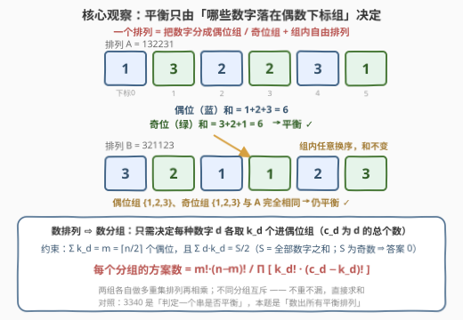
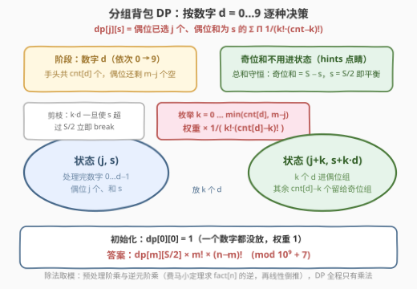
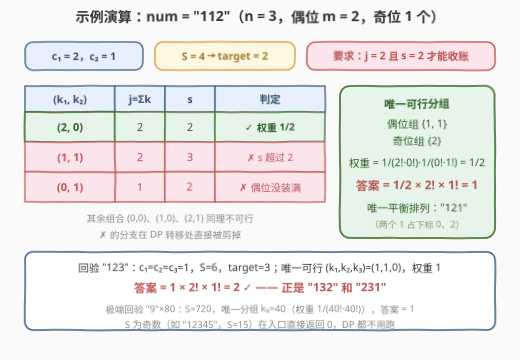

# 统计平衡排列的数目

- **题目名称**：统计平衡排列的数目
- **链接**：[3343. 统计平衡排列的数目](https://leetcode.cn/problems/count-number-of-balanced-permutations/)
- **难度**：困难
- **标签**：数学、动态规划、组合数学、计数 DP

## 1. 题目概述

给你一个数字字符串 `num`。如果一个数字字符串的**奇数位下标**的数字之和与**偶数位下标**的数字之和相等，那么称这个数字字符串是**平衡的**。

请你返回 `num` 的**不同排列**中，**平衡**字符串的数目。由于答案可能很大，请将答案对 $10^9 + 7$ **取余**后返回。

一个字符串的**排列**指的是将字符串中的字符打乱顺序后连接得到的字符串。

**示例 1**：

```text
输入：num = "123"
输出：2
解释：num 的不同排列包括 "123"、"132"、"213"、"231"、"312" 和 "321"。
      其中 "132" 和 "231" 是平衡的（下标从 0 开始，偶位 1+2 = 奇位 3）。所以答案为 2。
```

**示例 2**：

```text
输入：num = "112"
输出：1
解释：num 的不同排列包括 "112"、"121" 和 "211"。只有 "121" 是平衡的。
```

**示例 3**：

```text
输入：num = "12345"
输出：0
解释：num 的所有排列都是不平衡的（数字总和 15 为奇数）。
```

**约束条件**：

- $2 \le \text{num.length} \le 80$
- `num` 中只包含数字 `'0'` 到 `'9'`

> 💡 **读题关键**：① 下标从 **0** 开始，「偶位 / 奇位」按位置奇偶划分，与数字本身的奇偶无关——相邻题 [3340. 检查平衡字符串](https://leetcode.cn/problems/check-balanced-string/) 是「判定一个串」，本题是「数出所有串」；② $n \le 80$ 意味着排列数可达 $80! \approx 7 \times 10^{118}$，**枚举排列完全不可行**；③ 平衡条件只约束两组下标上的**和**，不约束组内顺序——顺序是冗余自由度，计数时可以「先分组、再乘排列数」；④ 「不同排列」+ 重复数字 ⇒ **多重集排列**（除以各数字阶乘去重），这是 [47. 全排列 II](https://leetcode.cn/problems/permutations-ii/) 去重陷阱的计数版；⑤ 全部数字之和 $S$ 为奇数时两组和不可能相等，入口即返回 0。

---

## 2. 解题思路

### 2.1 暴力思路：枚举排列不可行

最朴素的做法是 `next_permutation` 或递归枚举所有排列、逐个判定平衡。但 $n \le 80$ 时排列总数是 $80!$ 量级；即便数字有重复、去重后的**不同**排列也可能极多——如 `"0123456789"` 重复 8 次构成的长度 80 串，不同排列数约 $80!/(8!)^{10} \approx 10^{73}$。结论：**必须放弃「逐位置填」的视角，改用整体分组的组合计数**。小数据下（$n \le 8$）的暴力程序仍有价值——充当对拍器，验证组合公式与 DP 的正确性。

### 2.2 核心观察：把「数排列」折叠成「数分组 + 多重集排列」

记 $n = \text{len}(\text{num})$，偶数下标（$0, 2, 4, \dots$）共 $m = \lceil n/2 \rceil$ 个，奇数下标共 $n - m = \lfloor n/2 \rfloor$ 个；设数字 $d$ 出现 $c_d$ 次，全部数字之和为 $S$。

**第一步：平衡条件收紧为「偶位组和 = $S/2$」。** 两组之和相加恒为 $S$，故「两组相等」⟺ 「偶位组和 = 奇位组和 = $S/2$」。$S$ 为奇数时无解，直接返回 0（示例 3 的由来）。

**第二步：顺序是冗余的。** 一个排列是否平衡，只取决于**哪些数字（多重集）落在偶位组**，组内怎么排、奇位组内怎么排都不改变两组的和。

**第三步：固定分组后数排列——多重集排列。** 设数字 $d$ 中有 $k_d$ 个进偶位组（$0 \le k_d \le c_d$），则该分组对应的**不同**排列数为「偶位组的 $m$ 个位置放 $\{k_d\}$ 这堆数字」乘「奇位组的 $n-m$ 个位置放 $\{c_d - k_d\}$ 这堆数字」，即两组多重集排列数相乘：

$$\frac{m!}{\prod_d k_d!} \times \frac{(n-m)!}{\prod_d (c_d - k_d)!}$$

**第四步：不同分组互斥，直接求和。** 两个不同的 $(k_d)$ 分组产生的排列互不相同（某个数字在偶位 / 奇位的归属不同），因此：

$$\text{ans} \;=\; \sum_{\substack{\sum_d k_d = m \\ \sum_d d \cdot k_d = S/2}} \frac{m!\,(n-m)!}{\prod_d k_d!\,(c_d - k_d)!} \pmod{10^9+7}$$



> ⚠️ **为什么不能「逐位置填数」做计数 DP？** 从左往右逐位填、状态记「已填数字和」，同一个最终排列会被数很多次——两个相同的 `1` 在第 0、2 位互换填入次序，产生两条不同转移路径却对应同一个串。按多重集分组计数则天然无重复：方案由「每种数字取几个」唯一决定。**计数 DP 遇到「排列 + 重复元素」，先想分组，再想逐位。**

### 2.3 算法流程：按数字种类滚动的分组背包 DP

直接枚举向量 $(k_0, \dots, k_9)$ 组合爆炸，但注意它天然是**逐数字决策**的结构——正是分组背包的形状：

**状态定义**：$\text{dp}[j][s]$ = 已处理完前若干种数字，偶位组已选 $j$ 个数字、偶位组和为 $s$ 时，$\sum \prod_d \frac{1}{k_d!\,(c_d - k_d)!}$ 的部分和（把因子拆进转移，避免最后除大数）。

**转移**（处理数字 $d$，枚举 $k$ 个进偶位组）：

$$\text{ndp}[j+k]\,[s + k \cdot d] \mathrel{+}= \text{dp}[j][s] \cdot \frac{1}{k!\,(c_d - k)!}, \qquad 0 \le k \le \min(c_d,\ m - j)$$

**初始化**：$\text{dp}[0][0] = 1$；**答案**：$\text{dp}[m][S/2] \times m! \times (n-m)! \bmod (10^9+7)$。

三个工程要点：

1. **除法取模**：模 $p = 10^9+7$ 为质数，用**费马小定理**求 $\text{fact}[n]^{p-2}$ 得逆元，再线性倒推出整张逆元阶乘表 $\text{invFact}$，DP 全程只剩乘法。
2. **两个剪枝**：$k \le m - j$（偶位装不下更多）；$s + k \cdot d > S/2$ 时随 $k$ 单调递增（$d \ge 1$），直接 `break`。
3. **奇位和不用进状态**（官方 hints 的点睛之笔）：总和守恒，奇位和 $= S - s$；只要求 $s = S/2$，奇位自动也是 $S/2$——状态维度砍掉一维。



### 2.4 示例演算

以 `num = "112"` 走完整流程：$c_1 = 2$，$c_2 = 1$，$S = 4$，$S$ 为偶数，$\text{target} = 2$，偶位 $m = 2$、奇位 $1$ 个。

- **$d = 0$**（$c_0 = 0$）：$k$ 只能取 0，$\text{dp}[0][0] = 1$ 原地不动；
- **$d = 1$**（$c_1 = 2$）：从 $(0,0)$ 出发枚举 $k = 0,1,2$：
  - $k=0 \to (0,0)$，权重 $\times \frac{1}{0!\,2!} = \frac{1}{2}$；
  - $k=1 \to (1,1)$，权重 $\times \frac{1}{1!\,1!} = 1$；
  - $k=2 \to (2,2)$，权重 $\times \frac{1}{2!\,0!} = \frac{1}{2}$；
- **$d = 2$**（$c_2 = 1$）：对每个状态枚举 $k = 0,1$，其中 $(1,1)$ 取 $k=1$ 得 $s = 3 > 2$ 被 `break` 剪掉，$(2,2)$ 取 $k=0$（把 2 留给奇位组，权重 $\times \frac{1}{0!\,1!}$）是唯一通向终点的路；
- **收尾**：$\text{dp}[2][2] = \frac{1}{2}$，答案 $= \frac{1}{2} \times 2! \times 1! = 1$ ✓——正是 `"121"`（两个 1 占下标 0、2）。



再用 `"123"` 回验：$S = 6$，$\text{target} = 3$，唯一可行分组 $(k_1, k_2, k_3) = (1,1,0)$，权重 1，答案 $= 2! \times 1! = 2$ ✓（`"132"` 与 `"231"`）。极端情形 `"9"×80`：$S = 720$，唯一分组 $k_9 = 40$，权重 $\frac{1}{40!\,40!}$，答案恰为 1（唯一排列自身平衡）。

---

## 3. 参考代码

### C++

```cpp
class Solution {
  public:
    int countBalancedPermutations(string num) {
        constexpr long long MOD = 1'000'000'007LL;
        int n = num.size();
        array<int, 10> cnt{};
        int S = 0;
        for (char c : num) {
            cnt[c - '0']++;
            S += c - '0';
        }
        if (S % 2) return 0;                      // 总和为奇：两组和不可能相等
        int target = S / 2;
        int m = (n + 1) / 2;                      // 偶数下标（0,2,…）的个数

        vector<long long> fact(n + 1), invFact(n + 1);
        fact[0] = 1;
        for (int i = 1; i <= n; ++i) fact[i] = fact[i - 1] * i % MOD;
        long long base = fact[n], e = MOD - 2, inv = 1;   // 费马小定理求逆元
        while (e) {
            if (e & 1) inv = inv * base % MOD;
            base = base * base % MOD;
            e >>= 1;
        }
        invFact[n] = inv;
        for (int i = n; i >= 1; --i) invFact[i - 1] = invFact[i] * i % MOD;

        // dp[j][s]：偶位已选 j 个、偶位和 s 的 Σ Π 1/(k!·(cnt−k)!)
        vector<vector<long long>> dp(m + 1, vector<long long>(target + 1, 0));
        dp[0][0] = 1;
        for (int d = 0; d < 10; ++d) {
            vector<vector<long long>> ndp(m + 1, vector<long long>(target + 1, 0));
            for (int j = 0; j <= m; ++j)
                for (int s = 0; s <= target; ++s) {
                    long long v = dp[j][s];
                    if (!v) continue;
                    int kmax = min(cnt[d], m - j);
                    for (int k = 0; k <= kmax; ++k) {
                        int ns = s + k * d;
                        if (ns > target) break;   // d≥1 时随 k 单调，直接剪
                        ndp[j + k][ns] = (ndp[j + k][ns]
                            + v * invFact[k] % MOD * invFact[cnt[d] - k]) % MOD;
                    }
                }
            dp = move(ndp);
        }
        return dp[m][target] * fact[m] % MOD * fact[n - m] % MOD;
    }
};
```

### Python

```python
class Solution:
    def countBalancedPermutations(self, num: str) -> int:
        MOD = 10**9 + 7
        n = len(num)
        cnt = [0] * 10
        for ch in num:
            cnt[ord(ch) - 48] += 1
        S = sum(d * cnt[d] for d in range(10))
        if S % 2:
            return 0                              # 总和为奇：无解
        target = S // 2
        m = (n + 1) // 2                          # 偶数下标（0,2,…）的个数

        fact = [1] * (n + 1)                      # 阶乘 + 逆元阶乘
        for i in range(1, n + 1):
            fact[i] = fact[i - 1] * i % MOD
        inv_fact = [1] * (n + 1)
        inv_fact[n] = pow(fact[n], MOD - 2, MOD)
        for i in range(n, 0, -1):
            inv_fact[i - 1] = inv_fact[i] * i % MOD

        dp = [[0] * (target + 1) for _ in range(m + 1)]
        dp[0][0] = 1
        for d in range(10):
            ndp = [[0] * (target + 1) for _ in range(m + 1)]
            for j in range(m + 1):
                for s in range(target + 1):
                    v = dp[j][s]
                    if v == 0:
                        continue
                    for k in range(min(cnt[d], m - j) + 1):
                        ns = s + k * d
                        if ns > target:
                            break                 # d≥1 时随 k 单调，直接剪
                        ndp[j + k][ns] = (ndp[j + k][ns]
                            + v * inv_fact[k] % MOD * inv_fact[cnt[d] - k]) % MOD
            dp = ndp

        return dp[m][target] * fact[m] % MOD * fact[n - m] % MOD
```

> 💡 **实现细节**：① 权重 $\frac{1}{k!\,(c_d-k)!}$ 在转移时**就地乘入**，终点再统一乘回 $m!\,(n-m)!$——若把方案数直接放进 DP 值，中间会不断除阶乘，取模下无法整除；② `dp` 只依赖上一层，两张表交替 + `move` 即可滚动，空间省掉数字维度；③ `cnt[d] = 0` 时 $k$ 只能取 0、权重为 $\frac{1}{0!\,0!} = 1$，状态原地保留，**无需特判**；④ 前导零无需处理——统计的是字符串排列，不是数值。

---

## 4. 复杂度分析

| 维度 | 复杂度 | 说明 |
|------|--------|------|
| 时间复杂度 | $O\big(\frac{n}{2} \cdot \frac{S}{2} \cdot (n + 10)\big)$ | 状态 $(j, s)$ 共 $\le \frac{n+2}{2} \cdot (\frac{S}{2}+1)$ 个，转移枚举 $k$ 的总次数为 $\sum_d (c_d + 1) = n + 10$；$n = 80$ 时约 $1.3 \times 10^6$ 次，另有 $O(n)$ 阶乘预处理 |
| 空间复杂度 | $O\big(\frac{n}{2} \cdot \frac{S}{2}\big)$ | 滚动数组只保留相邻两层，约 $41 \times 361$ 个状态 |
| 暴力对照 | $O(n \cdot n!)$ | 枚举全部排列；去重后最坏仍有约 $10^{73}$ 个不同排列，不可行 |

实测：三组官方样例 $2 / 1 / 0$ ✓；与 `itertools.permutations` 去重暴力在 $n \le 8$ 的 400 组随机串下对拍全对；极端用例 `"0"×80`、`"9"×80`（答案均为 1，唯一排列自身平衡）与 74 位混合串均瞬时出解。

---

## 5. 扩展：EGF 视角与两类变体

**指数生成函数（EGF）视角。** 把 DP 的逐因子展开写成生成函数，答案即

$$\text{ans} = m!\,(n-m)! \cdot [x^m\, y^{S/2}] \prod_{d=0}^{9} \left( \sum_{k=0}^{c_d} \frac{x^k\, y^{d \cdot k}}{k!\,(c_d - k)!} \right)$$

每个数字 $d$ 对应一个因子，$x$ 记偶位个数、$y$ 记偶位和——本题 DP 正是「逐因子乘开、只保留 $y$ 的指数 $\le S/2$ 的项」。这一视角在**多个独立多重集做带权组合**时普遍适用，是计数 DP 与组合数学的桥梁。

**变体一：差为 $t$ 的「准平衡」。** 若把条件改成「偶位和 − 奇位和 $= t$」，只需把终点从 $s = S/2$ 改为 $s = (S + t)/2$（$S + t$ 为奇则无解），其余一行不改——「总和守恒消掉一维状态」的红利依旧。

**变体二：数字互不相同时的退化。** 若保证所有数字两两不同（$c_d \le 1$，$n \le 10$），分组退化为「从 $n$ 个数里选 $m$ 个进偶位」，公式变成单纯组合数求和 $\sum \binom{n}{m} \cdot [\text{和为 } S/2]$，可直接背包。对照 [805. 数组的均值分割](https://leetcode.cn/problems/split-array-with-same-average/)：那里值域无限、只能对「选或不选」做 meet-in-the-middle；本题值域只有 10 种数字，才能把「选哪些」折叠成「各选几个」的轻量计数 DP——**值域小，就按值域建状态**。

---

## 6. 面试要点

1. **为什么不能逐位置填数做 DP？**

   - 相同数字在不同时刻填入会走出不同转移路径、得到同一个排列，同一排列被重复计数，去重极难。改用「分组视角」：方案由「每种数字取几个进偶位组」唯一决定，不同分组互斥，**不重不漏**。口诀：计数 DP 遇到「排列 + 重复元素」，先想分组，再想逐位。

2. **除法取模怎么处理？**

   - 模 $p = 10^9 + 7$ 是质数，费马小定理 $a^{p-2} \equiv a^{-1}$；先算 $\text{fact}[n]$ 的逆元，再由 $\text{invFact}[i-1] = \text{invFact}[i] \times i$ 线性倒推出整张逆元阶乘表。更稳的写法是把 $\frac{1}{k!\,(c_d-k)!}$ 作为**转移权重**就地乘入，终点统一乘回 $m!\,(n-m)!$。

3. **为什么奇位和不用进状态？**

   - 总和守恒：奇位和 $= S - s$ 恒成立，要求 $s = S/2$ 时奇位自动相等。这也是官方 hints 的第 4 条——**能用全局守恒消掉的维度，绝不做状态**。

4. **前导零、`cnt[d]=0` 这些边界要特判吗？**

   - 都不用。统计的是字符串排列，`"011"` 之类的串完全合法；`cnt[d] = 0` 时 $k$ 只能取 0、权重为 1，DP 自然吸收。唯一真正的特判是 $S$ 为奇数时返回 0，它同时省掉了整场 DP。

5. **状态为什么是 $(j, s)$ 两维？规模多大？**

   - $j \in [0, \lceil n/2 \rceil]$、$s \in [0, S/2]$，配合「数字种类」作阶段；转移总量 $\sum_d (c_d+1) = n + 10$，总复杂度 $O\big(\frac{n}{2} \cdot \frac{S}{2} \cdot (n+10)\big) \approx 10^6$。设计依据是**值域只有 10 种数字**——按值计数才能把指数级的选择折叠成「各取几个」。

---

## 7. 同类练习题

- [494. 目标和](https://leetcode.cn/problems/target-sum/)（[站内题解](../0401-0500/494_目标和.md)）：给每个数字分配 ± 号使总和达标——「分两组」计数的一维简化版，体会「选择即分组」
- [1467. 两个盒子中球的颜色数相同的概率](https://leetcode.cn/problems/probability-of-a-two-boxes-having-the-same-number-of-distinct-balls/)（[站内题解](../1401-1500/1467_两个盒子中球的颜色数相同的概率.md)）：同为「多重集分两组 + 逐色枚举取多少」的计数骨架，与本题 DP 结构几乎同构
- [805. 数组的均值分割](https://leetcode.cn/problems/split-array-with-same-average/)（[站内题解](../0801-0900/805_数组的均值分割.md)）：把数分成等（平均）和两组的判定版；值域无限只能 meet-in-the-middle，对照本题「值域小 → 按值建状态」
- [1830. 使字符串有序的最少操作次数](https://leetcode.cn/problems/minimum-number-of-operations-to-make-string-sorted/)（[站内题解](../1801-1900/1830_使字符串有序的最少操作次数.md)）：多重集排列的排名（康托尔展开推广），练阶乘逆元与重复数字去重
- [2954. 统计感冒序列的数目](https://leetcode.cn/problems/count-the-number-of-infection-sequences/)（[站内题解](../2901-3000/2954_统计感冒序列的数目.md)）：带重复计数陷阱的序列计数，与本题互为「排列去重」思路的印证
