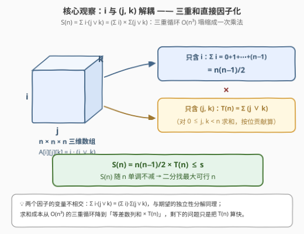
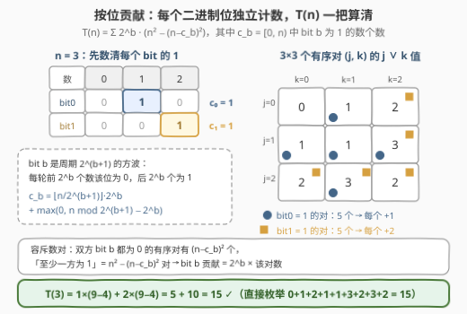
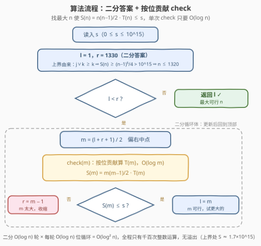
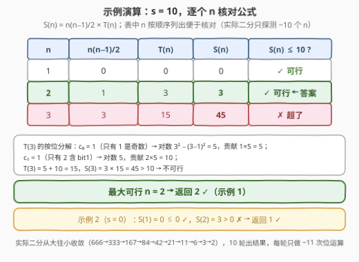

# LeetCode 最大尺寸数组 题解

## 1. 题目概述

- **标题 / 题号**：最大尺寸数组（#3344，medium）
- **链接**：https://leetcode.cn/problems/maximum-sized-array/
- **难度**：中等
- **标签**：位运算、二分查找、按位贡献、二分答案

> ⚠️ 本题为 LeetCode 付费题，题意描述根据官方示例用例与 hints 重建，可能与官方题面有出入。

**题意**：给定一个整数 `s`。令 `A` 为一个 `n × n × n` 的三维数组，其中每个元素定义为：

- `A[i][j][k] = i * (j OR k)`，其中 `0 <= i, j, k < n`，`OR` 表示按位或。

返回使数组 `A` 中**所有元素的和**不超过 `s` 的**最大的** `n`。

**示例 1**：

```text
输入：s = 10
输出：2
解释：n = 2 时，i = 0 的一层全为 0；i = 1 的层里 A[1][0][1] = A[1][1][0] = A[1][1][1] = 1·(j∨k) = 1，
     其余为 0，总和 = 3 ≤ 10。
     而 n = 3 时总和 = 45 > 10，故最大 n = 2。
```

**示例 2**：

```text
输入：s = 0
输出：1
解释：n = 1 时数组唯一元素 A[0][0][0] = 0·(0∨0) = 0，总和 0 ≤ 0，即为最大。
```

**约束**：

- $0 \le s \le 10^{15}$

> 💡 **读题关键**：① 被求和的每一项是两个因子的乘积，其中 **$i$ 与 $(j,k)$ 完全解耦**——这是全题的题眼；② $s$ 高达 $10^{15}$，但总和随 $n$ **五次方**增长（下界 $(n-1)^5/4$，实测约 $0.4\,n^5$），所以答案只有 $10^3$ 量级（$s = 10^{15}$ 时 $n = 1196$），这决定了「定上界 + 二分」的打法；③ $n = 1$ 时总和恒为 0，任何 $s \ge 0$ 的答案都至少是 1，二分下界从 1 起步即可。

## 2. 解题思路

### 2.1 暴力思路：逐个 n 现算总和

最直接的做法：从 $n = 1$ 开始，对每个 $n$ 用三重循环现算 $S(n) = \sum_{i,j,k} i\cdot(j\lor k)$，一旦 $S(n) > s$ 就返回 $n-1$：

- 单个 $n$ 的求和是 $O(n^3)$；
- 答案本身可达 1196，从头累加到答案的总代价是 $O(n^4) \approx 2\times 10^{12}$，直接超时。

两个显然的优化方向：**总和 $S(n)$ 关于 $n$ 单调不减**（新增一层下标只会加进非负项）→ 可以**二分答案**；单次求和别用三重循环 → 把 $S(n)$ **解析地**算出来。前者是套路，后者才是本题的难点与亮点。

### 2.2 核心观察：乘法分离 + 按位贡献



**观察一：$i$ 与 $(j,k)$ 解耦，三重和直接因子化。**

$$S(n) \;=\; \sum_{i=0}^{n-1}\sum_{j=0}^{n-1}\sum_{k=0}^{n-1} i\cdot(j\lor k) \;=\; \Big(\sum_{i=0}^{n-1} i\Big)\cdot\Big(\sum_{j=0}^{n-1}\sum_{k=0}^{n-1} (j\lor k)\Big) \;=\; \frac{n(n-1)}{2}\cdot T(n)$$

被求和的每一项是**变量不相交的两个因子的乘积**——一个只含 $i$，另一个只含 $(j,k)$，于是求和可以各自进行再相乘（与期望的**独立性分解**同理）。三重循环坍缩成「一个等差数列和 × 一个二维和」，剩下的问题只是把 $T(n)$ 算快。

**观察二：$T(n)$ 按二进制位拆贡献。**

$(j \lor k)$ 的每个二进制位**互不干扰**：bit $b$ 为 $(j\lor k)$ 贡献 $2^b$，当且仅当 $j$、$k$ 中**至少一个**的 bit $b$ 是 1。设 $c_b$ 为 $[0, n)$ 中 bit $b$ 为 1 的数个数，用**容斥**数对数：

- 双方 bit $b$ 都为 0 的有序对 $(j, k)$ 恰有 $(n - c_b)^2$ 个；
- 所以「至少一方为 1」的对数是 $n^2 - (n - c_b)^2$。

$$T(n) \;=\; \sum_{b \ge 0} 2^b\cdot\big(n^2 - (n - c_b)^2\big)$$

**观察三：$c_b$ 有 $O(1)$ 封闭公式。** $[0, n)$ 的 bit $b$ 是周期为 $2^{b+1}$ 的**方波**——每轮前 $2^b$ 个数该位是 0、后 $2^b$ 个数该位是 1：

$$c_b \;=\; \Big\lfloor \frac{n}{2^{b+1}} \Big\rfloor\cdot 2^b \;+\; \max\!\big(0,\; n \bmod 2^{b+1} - 2^b\big)$$



以 $n = 3$ 验证（与直接枚举九个 $j \lor k$ 值 $0+1+2+1+1+3+2+3+2 = 15$ 对照）：

- bit 0：$c_0 = 1$（只有 1 是奇数），对数 $= 3^2 - (3-1)^2 = 5$，贡献 $1 \times 5 = 5$；
- bit 1：$c_1 = 1$（只有 2 含 bit 1），对数 $= 3^2 - (3-1)^2 = 5$，贡献 $2 \times 5 = 10$；
- $T(3) = 5 + 10 = 15$ ✓。

于是「一次 check」的成本从 $O(n^3)$ 降到 $O(\log n)$（$n \le 1330$ 时至多 11 位）。

**观察四：$S(n)$ 单调不减，二分最大可行 $n$。** $S(1) = 0 \le s$ 对一切 $s \ge 0$ 成立；$n$ 变大时新增项全部非负。要找「$S(n) \le s$ 的最大 $n$」，标准**二分答案**即可。

**上界怎么定？** 由 $j \lor k \ge k$（或只会置位、不会削位），得 $T(n) \ge \sum_j \sum_k k = \dfrac{n^2(n-1)}{2}$，于是

$$S(n) \;\ge\; \frac{n(n-1)}{2}\cdot\frac{n^2(n-1)}{2} \;\ge\; \frac{(n-1)^5}{4}$$

当 $n \ge 1321$ 时 $(n-1)^5/4 \ge 1320^5/4 \approx 1.002\times 10^{15} > 10^{15} \ge s$，故答案 $\le 1320$，二分上界取 1330 绰绰有余——该处 $S(1330) \approx 1.7\times 10^{15}$，连同所有中间量都在 `long long` 范围内，无溢出之虞。

### 2.3 算法流程图



`l = 1, r = 1330` 起步，每轮取**偏右中点** $m = \lfloor(l+r+1)/2\rfloor$，用观察一~三在 $O(\log m)$ 内算出 $S(m)$：$S(m) \le s$ 则 $l = m$（$m$ 可行，试更大的），否则 $r = m - 1$；$l = r$ 时收敛到最大可行 $n$。二分 $O(\log n)$ 轮 × 每轮 $O(\log n)$ 的位循环，全程只有千百次整数运算。

### 2.4 示例演算



以 $s = 10$ 走一遍（实际二分只从大往小探测约 10 个 $n$，这里顺序列出便于核对公式）：

| $n$ | $n(n-1)/2$ | $T(n)$ | $S(n)$ = 乘积 | $S(n) \le 10$？ |
|-----|-----------|--------|--------------|----------------|
| 1   | 0         | 0      | 0            | ✓ |
| 2   | 1         | 3      | 3            | ✓ |
| 3   | 3         | 15     | 45           | ✗ |

最大可行 $n = 2$，返回 2 ✓（与示例 1 一致）。示例 2 的 $s = 0$：$S(1) = 0 \le 0$ 而 $S(2) = 3 > 0$，返回 1 ✓。

## 3. 参考代码

### C++

```cpp
class Solution {
    // T(n) = Σ_{0<=j,k<n} (j | k)：按位贡献，O(log n)
    long long sumOR(int n) {
        long long t = 0;
        for (int b = 0; (1 << b) < n; ++b) {
            long long period = 1LL << (b + 1), half = 1LL << b;
            long long c = n / period * half + max(0LL, n % period - half);
            t += half * ((long long)n * n - (n - c) * (n - c));
        }
        return t;
    }
  public:
    int maxSizedArray(long long s) {
        int l = 1, r = 1330;                        // (n-1)^5/4 > 1e15 ⇒ 答案 ≤ 1320
        while (l < r) {
            int m = (l + r + 1) / 2;                // 偏右中点：找最大可行
            if ((long long)m * (m - 1) / 2 * sumOR(m) <= s)
                l = m;
            else
                r = m - 1;
        }
        return l;
    }
};
```

### Python

```python
class Solution:
    def maxSizedArray(self, s: int) -> int:
        def sum_or(n: int) -> int:                  # T(n) = Σ (j|k)，按位贡献
            t, b = 0, 0
            while (1 << b) < n:
                period, half = 1 << (b + 1), 1 << b
                c = n // period * half + max(0, n % period - half)
                t += half * (n * n - (n - c) ** 2)
                b += 1
            return t

        l, r = 1, 1330                              # (n-1)^5/4 > 1e15 ⇒ 答案 ≤ 1320
        while l < r:
            m = (l + r + 1) // 2                    # 偏右中点：找最大可行
            if m * (m - 1) // 2 * sum_or(m) <= s:
                l = m
            else:
                r = m - 1
        return l
```

> 💡 **实现细节**：① 二分用**偏右中点** $(l+r+1)/2$ 并配 $r = m - 1$，专治「找最大可行」——写成 $(l+r)/2$ 配 $l = m$ 会死循环；② 循环条件是 `(1 << b) < n` 而非 `<=`：$2^b \ge n$ 的位在 $[0, n)$ 里恒为 0，$c_b = 0$、贡献为 0，直接不枚举；③ `max(0, ...)` 必不可少——`n % period` 可能落在方波**前半段**（该位全 0），此时 $n \bmod 2^{b+1} - 2^b$ 为负，代表不足一个完整「后半段」；④ C++ 中 $m(m-1)/2 \cdot T(m)$ 的中间最大值约 $1.8 \times 10^{15}$，`long long` 安全。

## 4. 复杂度分析

| 维度 | 复杂度 | 说明 |
|------|--------|------|
| 时间 | $O(\log^2 n)$ | 二分 $O(\log n)$ 轮 × 每轮 check 枚举 $O(\log n)$ 个二进制位（$n \le 1330$ 时约 11 位，全程千次级运算） |
| 空间 | $O(1)$ | 常数个变量，无预处理数组 |
| 数值范围 | 中间值 $\le 1.8\times 10^{15}$ | 二分上界 1330 处 $S \approx 1.7\times 10^{15}$，`long long`（上限 $9.2\times 10^{18}$）安全 |

## 5. 扩展：O(n²) 预处理 + 二分

不熟悉按位贡献也有更「无脑」的落地方式：先把所有 $T(m)$（$m \le 1330$）预处理出来，再二分。递推的关键是 OR 的**对称性**：从 $T(n-1)$ 到 $T(n)$，新增的是下标 $t = n-1$ 的「一层」——对 $(t, k)$、$(j, t)$ 与对角 $(t, t)$：

- 对角项 $(t, t)$：贡献 $t$（因为 $t \lor t = t$）；
- 对称对 $(t, j)$ 与 $(j, t)$：各贡献 $t \lor j$，合计 $2\,(t \lor j)$。

$$T(n) \;=\; T(n-1) \;+\; \underbrace{(n-1)}_{\text{对角}} \;+\; 2\sum_{j=0}^{n-2}\big((n-1)\lor j\big)$$

预处理总代价 $O(n^2)$（$n = 1330$ 时约 88 万次运算，静态初始化一次），之后每个 $s$ 一次 $O(\log n)$ 二分：

```cpp
const int MX = 1331;
long long T[MX];                                   // T[m] = Σ_{0<=j,k<m} (j|k)
auto init = [] {
    for (int m = 1; m < MX; ++m) {
        long long add = m - 1;                     // 对角项 (m-1, m-1)
        for (int j = 0; j < m - 1; ++j)
            add += 2LL * ((m - 1) | j);            // 对称对 (m-1, j) 与 (j, m-1)
        T[m] = T[m - 1] + add;
    }
    return 0;
}();

class Solution {
  public:
    int maxSizedArray(long long s) {
        int l = 1, r = 1330;
        while (l < r) {
            int m = (l + r + 1) / 2;
            if ((long long)m * (m - 1) / 2 * T[m] <= s)
                l = m;
            else
                r = m - 1;
        }
        return l;
    }
};
```

两版对比：预处理版胜在**直观**（对称性减半枚举，不需要想清楚每个 bit 的容斥），按位版胜在**快而省**（$O(\log^2 n)$、$O(1)$ 空间、无全局状态）。面试里先讲透观察一的因子化，再任选一条落地即可拿满。

## 6. 面试要点

1. **为什么三重和能直接拆成两个因子的乘积？**

   被求和项 $i\cdot(j\lor k)$ 的两个因子**变量不相交**：$\sum i\cdot(j\lor k) = \big(\sum i\big)\cdot\big(\sum (j\lor k)\big)$，是「分组独立时和的乘积 = 乘积的和」的标准变形（同期望的独立性分解 $E[XY] = E[X]E[Y]$）。拆完一侧是等差数列求和，另一侧 $T(n)$ 才是真正要算的东西。

2. **$T(n)$ 怎么在 $O(\log n)$ 内算出来？**

   按位贡献 + 容斥：bit $b$ 贡献 $2^b \cdot (n^2 - (n-c_b)^2)$，其中 $c_b$ 是 $[0, n)$ 中该位为 1 的个数（方波封闭公式），位数只有 $\lceil \log_2 n \rceil$ 个。核心是把「数对上 OR 的**值**之和」转成「每个 bit 上数对的**个数** × 位权」。

3. **二分的上界怎么定？中间值会不会溢出？**

   由 $j \lor k \ge k$ 得 $S(n) \ge (n-1)^5/4$，令其超过 $10^{15}$ 解得答案 $\le 1320$，上界取 1330；该处 $S \approx 1.7\times 10^{15}$，中间量都在 `long long` 内。若把上界随手开成 $10^5$ 量级，check 的中间乘积会溢出——**上界要贴着证明走**，不能拍脑袋。

4. **为什么可以二分？单调性严格吗？**

   $S(n)$ 单调**不减**即可：$n$ 增大时求和指标集扩大、新增项全非负。又因 $S(1) = 0 \le s$ 恒成立，可行域非空，$l = 1$ 起步必然收敛到最大可行 $n$。

5. **除了二分还能怎么定位答案？**

   线性扫描也行：$T(n)$ 有 $O(n)$ 的增量递推（见第 5 节），从 $n=1$ 扫到首次超标的 $n-1$，总代价 $O(n^2)$；或每个 $n$ 都用按位公式现算，线性扫总代价 $O(n\log n)$。数据规模下三者都能过，**讲清单调性与因子化**才是得分点。

## 同类练习题

| # | 题目 | 与本题的关联 |
|---|------|-------------|
| 1835 | [所有数对按位与结果的异或和](https://leetcode.cn/problems/find-xor-sum-of-all-pairs-bitwise-and/)（[站内题解](../1801-1900/1835_所有数对按位与结果的异或和.md)） | 同为「全体数对按位运算之和」，用分配律把 $O(nm)$ 个数对塌缩成两个线性量，与本题观察一同源 |
| 891 | [子序列宽度之和](https://leetcode.cn/problems/sum-of-subsequence-widths/)（[站内题解](../0801-0900/891_子序列宽度之和.md)） | 贡献法经典——不枚举子序列，而是数每个元素作为最大/最小值的次数，思想同「按位贡献」 |
| 2044 | [统计按位或能得到最大值的子集数目](https://leetcode.cn/problems/count-number-of-maximum-bitwise-or-subsets/)（[站内题解](../2001-2100/2044_统计按位或能得到最大值的子集数目.md)） | 围绕「按位或」的枚举与最值，练 OR 的位级直觉 |
| 875 | [爱吃香蕉的珂珂](https://leetcode.cn/problems/koko-eating-bananas/)（[站内题解](../0801-0900/875_爱吃香蕉的珂珂.md)） | 二分答案 + $O(n)$ check 的模板题，本题二分外壳与其完全同构 |
| 410 | [分割数组的最大值](https://leetcode.cn/problems/split-array-largest-sum/)（[站内题解](../0401-0500/410_分割数组的最大值.md)） | 二分答案的进阶形态——值域上的单调谓词 + 贪心验证 |
