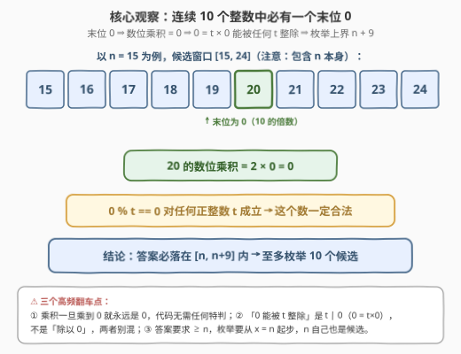
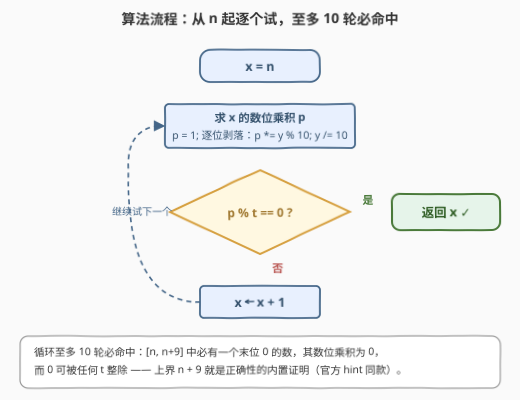
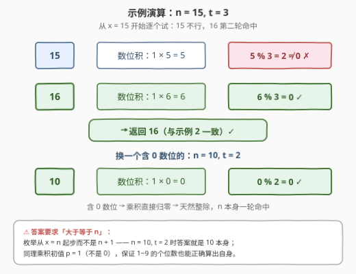

# LeetCode 最小可整除数位乘积 I 题解

- **关联**：与 [3348. 最小可整除数位乘积 II](https://leetcode.cn/problems/smallest-divisible-digit-product-ii/) 同源——本题 $n \le 100$，靠「连续 10 个数必含末位 0」暴力枚举即可；3348 把候选数改成**必须无零**的超长数字串（长度 $10^5$），堵死「乘积归零」的捷径，逼出质因子构造法（见第 5 节）

## 1. 题目概述

- **标题 / 题号**：最小可整除数位乘积 I（#3345，easy）
- **链接**：https://leetcode.cn/problems/smallest-divisible-digit-product-i/
- **难度**：简单
- **标签**：数学、枚举、数位

**题意**：给你两个整数 `n` 和 `t`。请你返回**大于等于** `n` 的**最小**整数，且该整数的**各数位之积**能被 `t` 整除。

**示例 1**：

```text
输入：n = 10, t = 2
输出：10
解释：10 的数位乘积为 0，可以被 2 整除，所以它是大于等于 10 且满足题目要求的最小整数。
```

**示例 2**：

```text
输入：n = 15, t = 3
输出：16
解释：16 的数位乘积为 6，可以被 3 整除，所以它是大于等于 15 且满足题目要求的最小整数。
```

**约束**：

- $1 \le n \le 100$
- $1 \le t \le 10$

> 💡 **读题关键**：① 「各数位之积」是逐位**相乘**（不是相加），一旦某位是 0 整个乘积就归零；② **0 能被任何正整数整除**（$0 = t \times 0$），这是本题最锋利的观察；③ 答案要求「大于**等于** $n$」，$n$ 本身就是第一个候选；④ 数据规模极小（$n \le 100,\ t \le 10$），考点是**看出枚举上界**，不是写复杂算法。

## 2. 解题思路

### 2.1 朴素思路：从 n 起逐个试

从 $x = n$ 开始，对每个 $x$ 逐位求积 $p$，判断 $p \bmod t = 0$ 是否成立，成立即返回。写法上一分钟就能搞定，唯一的疑虑是：**这个循环要转到什么时候？** 没有上界证明，心里就没底——万一某个 $t$ 永远凑不出来呢？

### 2.2 核心观察：连续 10 个整数必含末位 0 → 枚举上界 n + 9



三条观察环环相扣：

**观察一（抽屉原理）：任意连续 10 个整数中，恰好有一个是 10 的倍数。** 窗口 $[n, n+9]$ 长度恰为 10，末位 $0 \sim 9$ 各出现一次，其中恰有一个末位为 0。

**观察二：末位为 0 ⇒ 数位乘积为 0。** $20 = 2 \times 10$，其数位乘积 $2 \times 0 = 0$；乘到 0 之后无论再乘什么都保持 0。

**观察三：0 能被任何正整数整除。** 按整除的定义，$t \mid p \iff \exists k \in \mathbb{Z},\ p = kt$，取 $k = 0$ 知 $t \mid 0$ 对一切 $t \ge 1$ 成立——代码里表现为 `0 % t == 0` 恒为真。

三条合起来：**答案一定落在 $[n, n+9]$ 内**，至多枚举 10 个候选数，每个候选只需 3 位以内的逐位乘法。这也正是官方 hint「You have to check at most 10 numbers」的含义——不是「实测大约 10 个」，而是**有证明的硬上界**。

> ⚠️ **三个高频翻车点**：
>
> - **乘积含 0 不用特判**：`p` 一旦乘到 0 就永远是 0，`p % t == 0` 自然通过，不要画蛇添足写 `if p == 0` 分支；
> - **别混淆「被 0 整除」和「整除 0」**：本题是 $t \mid 0$（合法），不是 $p \div 0$（非法）；
> - **枚举起点是 $n$ 不是 $n+1$**：示例 1 中 $n = 10$ 自身就是答案。

### 2.3 算法流程图



$x$ 从 $n$ 出发：先求 $x$ 的数位乘积 $p$（`p = 1` 起步，`y = x` 逐位剥落 `p *= y % 10; y /= 10`）；若 $p \bmod t = 0$ 立即返回 $x$，否则 $x$ 加一试下一个。循环体至多执行 10 次——上界 $n + 9$ 本身就是正确性证明的一部分。

### 2.4 示例演算



**示例 2（$n=15,\ t=3$）**：

1. $x = 15$：数位积 $1 \times 5 = 5$，$5 \bmod 3 = 2 \ne 0$，跳过；
2. $x = 16$：数位积 $1 \times 6 = 6$，$6 \bmod 3 = 0$ ✓，返回 $16$。

**示例 1（$n=10,\ t=2$）**：$x = 10$：数位积 $1 \times 0 = 0$，$0 \bmod 2 = 0$ ✓，一轮命中，返回 $10$——这正是观察二、三的现场演示：含 0 数位的数天然满足任何 $t$。

再验证一个极端：$n = 99,\ t = 10$：$99 \to 81$（$81 \bmod 10 = 1$✗），$100 \to 0$ ✓，返回 $100$，恰好用满 $n+9 = 108$ 的窗口内第一个末位 0 数。

## 3. 参考代码

### C++

```cpp
class Solution {
  public:
    int smallestNumber(int n, int t) {
        for (int x = n; x <= n + 9; ++x) {      // 上界 n+9：[n, n+9] 必含末位 0 的数
            int p = 1;
            for (int y = x; y > 0; y /= 10)     // 逐位剥落累乘（x ≥ 1，至少进一轮）
                p *= y % 10;                    // 乘到 0 后保持 0，无需特判
            if (p % t == 0) return x;           // 0 % t == 0 恒真，含 0 数位直接命中
        }
        return -1;                              // 逻辑上不可达，防御式返回
    }
};
```

### Python

```python
class Solution:
    def smallestNumber(self, n: int, t: int) -> int:
        for x in range(n, n + 10):              # [n, n+9]，上界来自 2.2 的观察
            p = 1
            for ch in str(x):
                p *= int(ch)                    # 乘到 0 就锁死为 0
            if p % t == 0:
                return x


# 写法二：一行收工（math.prod 做数位累乘）
from math import prod

class Solution:
    def smallestNumber(self, n: int, t: int) -> int:
        return next(x for x in range(n, n + 10) if prod(map(int, str(x))) % t == 0)
```

> 💡 **实现细节**：① 循环上界写死 $n + 9$ 而不是无限循环——把正确性证明「编译」进代码，若日后约束变化会越界报错而非静默死循环；② 数位积初值 `p = 1`（乘法单位元），配合 $x \ge 1$ 保证个位数也能算出自身；③ `prod(map(int, str(x)))` 里 `int` 直接吃单个字符，比 `int(ch)` 切字符串更紧凑。

## 4. 复杂度分析

| 维度 | 复杂度 | 说明 |
|------|--------|------|
| 时间 | $O(1)$ | 至多 10 个候选，每个至多 3 位（$x \le 109$），总计 $\le 30$ 次乘法与取模 |
| 空间 | $O(1)$ | 只用常数个整型变量（Python 字符串写法另需 $O(\log x)$ 临时串） |
| 数据规模 | $\le 729$ | 数位积理论上界 $9 \times 9 \times 9$，`int` 毫无压力 |

## 5. 扩展：质因子视角与 3348（Hard）

**为什么偏偏是 $t \le 10$？** 单个数位 $\le 9$，所以**非零**数位乘积做质因子分解，因子只能出自 $\{2, 3, 5, 7\}$；而 $1 \le t \le 10$ 的质因子恰好也只有 $\{2, 3, 5, 7\}$（$10 = 2 \times 5$ 封顶）。两边质因子「同源」，才保证了不靠归零也能凑出整除。若 $t$ 含大于 7 的质因子（如 $t = 11$），非零乘积**永远**不可能被 $t$ 整除，唯一的出路就是数位积为 0——即找 $\ge n$ 的最小「含 0 数」。

**3348（Hard）堵死了归零捷径。** 它把条件改成「候选数必须是**无零**数字」（数位 $1 \sim 9$），$n$ 变成长度 $10^5$ 的数字字符串，$t \le 10^{14}$。此时：

1. $t$ 必须只含质因子 $2, 3, 5, 7$，否则直接返回 `"-1"`（对应示例 3 的 $t = 26 = 2 \times 13$）；
2. 把 $t$ 分解为 $2^a \, 3^b \, 5^c \, 7^d$，用**最少的数位**凑出这些质因子幂（$8 = 2^3$、$9 = 3^2$、$5$、$7$ 各自是「性价比最高」的载体）；
3. 从 $num$ 的**最长公共前缀之后**贪心构造：前缀能保留就保留（保证最小），后缀按剩余质因子需求放尽量小的数位；同长度构造不出就升位补齐。

本题的暴力枚举在 3348 里彻底失效（$10^5$ 位数字连「加一」都是 $O(L)$），但**「数位乘积的质因子只有 2、3、5、7」**这条观察贯穿两题——简单题里看似无用的洞察，正是困难题的钥匙。

## 6. 面试要点

1. **凭什么至多检查 10 个数？**

   - 任意连续 10 个整数恰有一个是 10 的倍数（末位为 0），其数位乘积为 0；而 0 能被任何正整数整除（$0 = t \times 0$）。所以答案 $\le n + 9$，枚举窗口 $[n, n+9]$ 必命中。

2. **数位乘积为 0 算「能被整除」吗？**

   - 算。整除定义 $t \mid p \iff \exists k,\ p = kt$，$p = 0$ 时取 $k = 0$ 即成立；代码层面 `0 % t == 0` 为真。注意区分「$t$ 整除 0」（合法）与「除以 0」（非法）两个方向。

3. **循环写成无限循环还是带上界 $n+9$？**

   - 都正确。带上界把「为什么必然终止」写进了代码，是防御式编程；无限循环依赖推理保证出口，一旦约束改动（比如 $t$ 出现非法值）可能失控。面试叙事上推荐带上界 + 一句理由。

4. **数位乘积会不会溢出？**

   - 本题 $x \le 109$，非零乘积上界 $9 \times 9 \times 9 = 729$，`int` 绰绰有余。一般地，$K$ 位无零数的乘积上界 $9^K$，位数多时增长很快（这正是 3348 用字符串而不用数值的原因之一），但本题完全无需担心。

5. **如果把 $t$ 的范围放开会怎样？**

   - $t$ 含大于 7 的质因子（如 11、13）时，非零数位乘积永远不满足，答案退化为「$\ge n$ 的最小含 0 数」；$t$ 只含 2/3/5/7 时仍可由数位凑出，但可能需要更多位数——这组讨论正是 3348 的主战场（见第 5 节）。

## 同类练习题

| # | 题目 | 与本题的关联 |
|---|------|-------------|
| 3348 | [最小可整除数位乘积 II](https://leetcode.cn/problems/smallest-divisible-digit-product-ii/) | Hard 进阶版——禁 0 数位 + $10^5$ 位超长数字串，暴力枚举升级为质因子贪心构造 |
| 1281 | [整数的各位积和之差](https://leetcode.cn/problems/subtract-the-product-and-sum-of-digits-of-an-integer/)（[站内题解](../1201-1300/1281_整数各位积和之差.md)） | 数位乘积的基础模板题，练「逐位剥落」手感 |
| 2269 | [找到一个数字的 K 美丽值](https://leetcode.cn/problems/find-the-k-beauty-of-a-number/)（[站内题解](../2201-2300/2269_找到一个数字的K美丽值.md)） | 数位子串值 + 整除判定，滑窗取数的另一形态 |
| 2520 | [统计能整除数字的位数](https://leetcode.cn/problems/count-the-digits-that-divide-a-number/)（[站内题解](../2501-2600/2520_统计能整除数字的位数.md)） | 整除方向反转（数位整除原数），对照「原数整除数位积」的本题 |
| 728 | [自除数](https://leetcode.cn/problems/self-dividing-numbers/) | 数位枚举 + 整除判定的经典老题，注意其对数位 0 的处理方式恰好与本题相反 |
