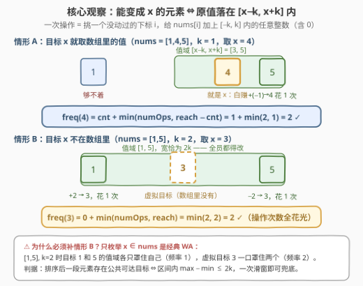
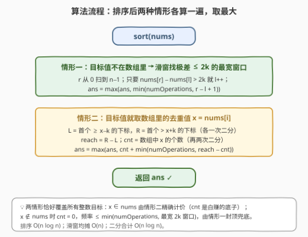
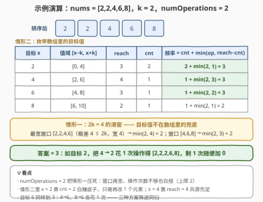

# LeetCode 执行操作后元素的最高频率 I 题解

- **关联**：与 [3347. 执行操作后元素的最高频率 II](https://leetcode.cn/problems/maximum-frequency-of-an-element-after-performing-operations-ii/) 同源——本题 $nums[i] \le 10^5$ 还留了「值域计数」的活路；3347（Hard）把值域放开到 $10^9$，逼你用本文「排序 + 2k 窗口 + 二分」的纯比较方案（见第 5 节）

## 1. 题目概述

- **标题 / 题号**：执行操作后元素的最高频率 I（#3346，medium）
- **链接**：https://leetcode.cn/problems/maximum-frequency-of-an-element-after-performing-operations-i/
- **难度**：中等
- **标签**：数组、排序、二分查找、滑动窗口

**题意**：给你一个整数数组 `nums` 和两个整数 `k` 和 `numOperations`。你必须对 `nums` 执行操作 `numOperations` 次，每次操作中你可以：

- 选择一个下标 `i`，要求它在之前的操作中**没有被选择过**（每个下标至多被操作一次）；
- 将 `nums[i]` 增加范围 $[-k, k]$ 中的一个整数。

执行完所有操作后，返回 `nums` 中出现**频率最高**元素的出现次数。

**示例 1**：

```text
输入：nums = [1,4,5], k = 1, numOperations = 2
输出：2
解释：nums[1] 加 0，nums[2] 加 -1，数组变为 [1, 4, 4]，最高频率 2。
```

**示例 2**：

```text
输入：nums = [5,11,20,20], k = 5, numOperations = 1
输出：2
解释：两个 20 本来就相等，唯一一次操作加 0 即可，最高频率 2。
```

**约束**：

- $1 \le \text{nums.length} \le 10^5$
- $1 \le \text{nums}[i] \le 10^5$
- $0 \le k \le 10^5$
- $0 \le \text{numOperations} \le \text{nums.length}$

> 💡 **读题关键**：① 每次操作加的是 $[-k,k]$ 内的**任意整数**（包括 0）——「加 0」意味着一次操作可以是值不变的白操作；② 必须**恰好**执行 `numOperations` 次，但由于加 0 合法、且 `numOperations ≤ n` 保证名额够，「恰好」不构成额外约束；③ 操作的对象是**下标**而非值，两个值相同的元素是两个独立名额；④ 要求的是「某元素出现次数」的全局最大值，与具体是哪个值无关。

## 2. 解题思路

### 2.1 朴素思路：枚举目标值，逐个数

最终的最高频率，一定是某个「目标值 $x$」在操作全部落地后的出现次数。固定 $x$，能到多高一目了然：

- 原本就等于 $x$ 的元素**白赚**，一次操作都不用花（记 $\mathrm{cnt}[x]$ 个）；
- 原值落在 $[x-k,\ x+k]$ 内的**其它**元素，各花一次操作就能改成 $x$（这样的元素共 $\text{reach}(x) - \mathrm{cnt}[x]$ 个）；
- 每个下标至多被操作一次，有效改动总数不超过 $\text{numOperations}$。

$$\text{freq}(x) = \mathrm{cnt}[x] + \min\big(\text{numOperations},\ \text{reach}(x) - \mathrm{cnt}[x]\big)$$

其中 $\text{reach}(x)$ 为值域 $[x-k,\ x+k]$ 内的元素个数。朴素实现：$x$ 从 $\min(\text{nums})-k$ 枚举到 $\max(\text{nums})+k$，每个候选扫一遍数组，总计 $O(Vn)$；本题 $V$ 可达 $3\times 10^5$、$n$ 可达 $10^5$，直接爆炸。

> ⚠️ **更隐蔽的坑**：只在 `nums` 里挑目标值是**错的**。反例 `nums = [1,5], k = 2`：目标 1 或 5 的值域各只罩住自己，频率 1；而虚拟目标 3 的值域 $[1,5]$ 一口罩住两个元素，两次操作后频率 2。**最优目标值可能不在原数组中**——这正是本题把「二分 + 滑窗」一起挂进标签的原因。

### 2.2 核心观察：值域 $[x-k, x+k]$ 与两档目标



先把上面的公式证死（对任意整数 $x$）：

**上界**：最终等于 $x$ 的元素 = 「原本就是 $x$ 且没被改走」+「被改成 $x$ 的」。前者至多 $\mathrm{cnt}[x]$ 个；后者每一个都消耗一次操作（≤ numOperations 个），且其原值必须落在 $[x-k, x+k]$ 内且 $\ne x$（≤ $\text{reach} - \mathrm{cnt}$ 个）。

**可达**：取 $m = \min(\text{numOperations},\ \text{reach} - \mathrm{cnt})$，挑 $m$ 个「值在 $[x-k,x+k]$ 且 $\ne x$」的元素各改成 $x$（增量恰在 $[-k,k]$ 内）；若还有剩余操作，找没用过的下标**加 0** 消化即可——$0 \in [-k,k]$ 合法，且 $\text{numOperations} \le n$ 保证名额够。所以「必须恰好执行」不是坑。

于是答案 $= \max_x \text{freq}(x)$，剩下的问题是把无穷多个整数 $x$ 削成两类有限枚举：

- **情形 A（$x \in \text{nums}$）**：排序后值域 $[x-k, x+k]$ 对应连续区间，用 `lower_bound(x−k)` 与 `upper_bound(x+k)` 两次二分求出 $\text{reach}$，再两次二分求 $\mathrm{cnt}$，直接代入公式。至多 $n$ 个去重候选。
- **情形 B（$x \notin \text{nums}$）**：此时 $\mathrm{cnt} = 0$，$\text{freq}(x) = \min(\text{numOperations},\ \text{reach}(x))$。注意「被 $[x-k,x+k]$ 罩住的那批元素」在排序数组里是**一段连续区间**，且区间内 $\max - \min \le 2k$；反过来，排序数组里任何极差 $\le 2k$ 的窗口 $[l, r]$，都能找到整数目标罩住它——候选区间 $[\text{nums}[r]-k,\ \text{nums}[l]+k]$ 非空（由极差 $\le 2k$ 保证），必含整数。所以这一档的最优值 $= \min(\text{numOperations},\ \text{最宽 } 2k \text{ 窗口})$，一次滑动窗口搞定。

> 💡 **两档不会互相漏**：情形 A 枚举的 $\text{freq}(x) \ge \min(\text{numOperations},\ \text{reach}(x))$ 恒成立（若 $\text{numOperations} \ge \text{reach}-\mathrm{cnt}$ 则左边 $= \text{reach}$；否则左边 $= \mathrm{cnt}+\text{numOperations} \ge \text{numOperations}$）。所以即使某个「窗口解」的最优目标恰好也是数组内的值，情形 A 也早已把它算到了。

### 2.3 算法流程图



整体三步走：**排序**统一值序；**情形一**滑窗维护极差 $\le 2k$ 的最宽窗口，拿 $\min(\text{numOperations},\ \text{窗口宽})$ 兜底；**情形二**枚举数组内去重值 $x$，二分算 $\text{reach}$ 与 $\mathrm{cnt}$，拿 $\mathrm{cnt} + \min(\text{numOperations},\ \text{reach}-\mathrm{cnt})$ 精确计价。全程只做「排序 + 比较 + 二分」，与值域大小无关——这一点在第 5 节会成为通行证。

### 2.4 示例演算



**官方示例 1（`nums = [1,4,5], k = 1, numOperations = 2`）**：

1. 情形 A：$x=1$：值域 $[0,2]$ 只罩住自己 → $1+\min(2,0)=1$；$x=4$：值域 $[3,5]$ 罩住 $\{4,5\}$ → $1+\min(2,1)=2$；$x=5$：同理 $\{4,5\}$ → $2$；
2. 情形 B：$2k=2$ 的最宽窗口 $\{4,5\}$（极差 1）宽 2 → $\min(2,2)=2$；
3. 答案 $2$ ✓（官方操作把 5 改成 4，第二次操作加 0 消化）。

**官方示例 2（`nums = [5,11,20,20], k = 5, numOperations = 1`）**：

1. 情形 A：$x=20$：值域 $[15,25]$ 罩住 $\{20,20\}$，$\mathrm{cnt}=2$ → $2+\min(1,0)=2$；$x=5$、$x=11$ 均为 1；
2. 情形 B：极差 $\le 10$ 的窗口 $\{11,20,20\}$ 宽 3 → $\min(1,3)=1$；
3. 答案 $2$ ✓（`cnt` 是白赚的底子，操作次数不够也不亏）。

**再拆一个全面例子（`nums = [2,2,4,6,8], k = 2, numOperations = 2`，见上图）**：情形二里 $x=2/4/6$ 三条路都通向 3——$x=2$ 靠 $\mathrm{cnt}=2$ 的底子（把 4 改成 2 只花 1 次）；$x=4$ 靠 $\text{reach}=4$ 的兵源（把两个 2 各改成 4 恰好花 2 次）；$x=6$ 把 4 和 8 各改一次。而情形一最宽窗口宽 4，却被 $\text{numOperations}=2$ 压死在 2——**窗口再宽，没有操作次数也是白搭**。

## 3. 参考代码

### C++

```cpp
class Solution {
  public:
    int maxFrequency(vector<int>& nums, int k, int numOperations) {
        sort(nums.begin(), nums.end());
        int n = nums.size(), ans = 0;

        // 情形一：目标值不在数组中 —— 排序后维护极差 ≤ 2k 的最宽窗口
        for (int l = 0, r = 0; r < n; ++r) {
            while (nums[r] - nums[l] > 2 * k) ++l;          // 左端收缩
            ans = max(ans, min(numOperations, r - l + 1));  // 全靠操作次数撑
        }

        // 情形二：目标值 x 就取数组里的值（相邻相等只算一次）
        for (int i = 0; i < n; ++i) {
            if (i > 0 && nums[i] == nums[i - 1]) continue;
            int x = nums[i];
            int L = lower_bound(nums.begin(), nums.end(), x - k) - nums.begin();
            int R = upper_bound(nums.begin(), nums.end(), x + k) - nums.begin();
            int cnt = upper_bound(nums.begin(), nums.end(), x)
                    - lower_bound(nums.begin(), nums.end(), x);
            ans = max(ans, cnt + min(numOperations, R - L - cnt));
        }
        return ans;
    }
};
```

### Python

```python
from bisect import bisect_left, bisect_right

class Solution:
    def maxFrequency(self, nums: List[int], k: int, numOperations: int) -> int:
        nums.sort()
        n = len(nums)
        ans = 0

        # 情形一：目标值不在数组中 —— 极差 ≤ 2k 的最宽窗口
        l = 0
        for r in range(n):
            while nums[r] - nums[l] > 2 * k:
                l += 1
            ans = max(ans, min(numOperations, r - l + 1))

        # 情形二：目标值取数组里的去重值，二分算 reach 与 cnt
        for i, x in enumerate(nums):
            if i and nums[i] == nums[i - 1]:
                continue
            L, R = bisect_left(nums, x - k), bisect_right(nums, x + k)
            cnt = bisect_right(nums, x) - bisect_left(nums, x)
            ans = max(ans, cnt + min(numOperations, R - L - cnt))
        return ans
```

> 💡 **实现细节**：① `bisect_left(x−k)` 与 `bisect_right(x+k)` 的组合恰好是闭区间 $[x-k, x+k]$ 的双边界定；② 情形二的去重只是省时间，不去重也不影响正确性；③ 想省掉二分：目标值递增 ⇒ 两个边界都单调右移，可换成三指针均摊 $O(n)$；④ 本题 $x \pm k \le 2\times 10^5$，`int` 无压力；3347（值域 $10^9$）时 C++ 需把极差与 $x \pm k$ 换成 `long long`，Python 无感。

## 4. 复杂度分析

| 维度 | 复杂度 | 说明 |
|------|--------|------|
| 时间 | $O(n \log n)$ | 排序 $O(n\log n)$；情形一滑窗每个元素至多进出窗口各一次，均摊 $O(n)$；情形二至多 $n$ 个去重目标 × 3 组二分 $O(\log n)$ |
| 空间 | $O(1)$ | 原地排序（Python 的 Timsort 另需 $O(n)$ 辅助），只含常数个指针/变量 |
| 值域 | $1 \le \text{nums}[i] \le 10^5$ | 值域有限大才留了第 5 节「值域计数」的活路；3347 值域 $10^9$，只剩本文的比较型解法 |

## 5. 扩展：值域计数法与 3347（Hard）

**值域计数法（本题的值域特权）**：因为 $1 \le \text{nums}[i] \le 10^5$，可以开值域数组 $\mathrm{cnt}[v]$ 统计频数，再做前缀和 $S$，则 $\text{reach}(x) = S[\min(x+k,\ V)] - S[\max(x-k,1)-1]$、$\mathrm{cnt}[x]$ 直接查表。只需枚举 $x \in [\min(\text{nums}),\ \max(\text{nums})]$：对区间外的 $x$，把它拉回最近的极值点，值域只会罩得更全、$\mathrm{cnt}$ 还可能白赚，频率不降。总复杂度 $O(V + n)$。但 $V$ 是 $10^5$ 级才可开数组——**3347 把值域放到 $10^9$，这条路直接报废**。

**3347（Hard）**：$1 \le \text{nums}[i] \le 10^9$、$0 \le k \le 10^9$。本文解法只做「排序 + 比较 + 二分」，与值域无关——Python 代码一字不改直接通过；C++ 需把窗口极差与 $x \pm k$ 三处换成 `long long`（$10^9 + 10^9$ 溢出 `int`）。标签里的「二分查找」正是为此留的伏笔。

**与 1838 / 2968 的对照**：那两题的操作代价按「距离」计价（总预算 $k$，每 ±1 花一块钱），最优目标落在窗口**中位数**上，需要前缀和 $O(1)$ 估算改造成本；本题操作代价按「次数」计价（一次操作可在 $\pm k$ 内任意瞬移），只需数窗口内元素个数，与距离无关。同是「滑窗 + 目标值」，计价方式不同 ⇒ 窗口条件与更新公式完全不同。

## 6. 面试要点

1. **为什么「必须恰好执行 numOperations 次」不是坑？**

   - 每次操作可以加 0（$0 \in [-k,k]$），且约束保证 $\text{numOperations} \le n$，总能找到没用过的下标消化多余操作。所以只需关心「至多 numOperations 次有效改动」，公式按上界写即可。

2. **为什么最优目标值可以不在数组里？怎么兜住？**

   - `nums = [1,5], k = 2`：任何数组内目标的频率只有 1，虚拟目标 3 的值域 $[1,5]$ 同时罩住两个元素，频率 2。判据：排序后一段元素存在公共可达目标 ⇔ 区间内 $\max - \min \le 2k$；用「极差 ≤ 2k 的最宽滑窗 + $\min(\text{numOperations},\ \text{宽})$」兜底。

3. **窗口条件为什么是 $2k$ 而不是 $k$？**

   - 目标 $x$ 的覆盖半径是 $k$（左右各 $k$），能同时被罩住的元素极差上限自然是 $2k$。写成 $k$ 是本题最常见的手滑错误，会把 `[1,5], k=2` 这类用例判成 1。

4. **cnt 与 reach 怎么高效计算？**

   - 排序后 `lower_bound(x−k)` / `upper_bound(x+k)` 定出闭区间，相减得 reach；`upper_bound(x)` 减 `lower_bound(x)` 得 cnt。因目标值递增时两个边界都单调右移，也可换三指针做到均摊 $O(n)$。

5. **本题与 1838/2968 的本质区别是什么？**

   - 计价方式：1838/2968 按**距离**计价（总预算），最优目标是窗口中位数，需前缀和算成本；本题按**次数**计价（每次可 ±k 内任意跳），只需数窗口元素个数。约束模型不同，滑窗条件与更新公式随之完全不同——面试里能主动点破这一层，是加分项。

## 同类练习题

| # | 题目 | 与本题的关联 |
|---|------|-------------|
| 3347 | [执行操作后元素的最高频率 II](https://leetcode.cn/problems/maximum-frequency-of-an-element-after-performing-operations-ii/)（[站内题解](../3301-3400/3347_执行操作后元素的最高频率II.md)） | Hard 同款——值域放开到 $10^9$，本文解法原样通过（C++ 注意 `long long`），值域计数法彻底失效 |
| 1838 | [最高频元素的频数](https://leetcode.cn/problems/frequency-of-the-most-frequent-element/)（[站内题解](../1801-1900/1838_最高频元素的频数.md)） | 预算按「距离」计价的孪生题——$k$ 次每步 +1，中位数 + 前缀和滑窗 |
| 2968 | [执行操作使频率分数最大](https://leetcode.cn/problems/apply-operations-to-maximize-frequency-score/)（[站内题解](../2901-3000/2968_执行操作使频率分数最大.md)） | ±1 每步计价的总预算版，与 1838 同骨架的最小代价改造 |
| 1984 | [学生分数的最小差值](https://leetcode.cn/problems/minimum-difference-between-highest-and-lowest-of-k-scores/)（[站内题解](../1901-2000/1984_学生分数的最小差值.md)） | 排序 + 定长滑窗的极差视角最小化对偶，练「排序后窗口」手感 |
