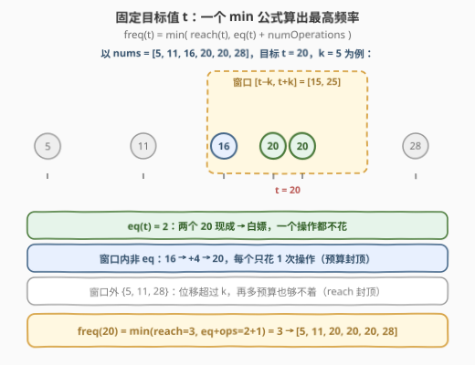
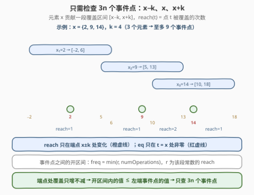
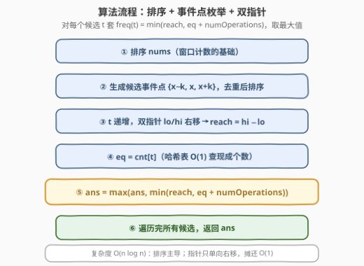
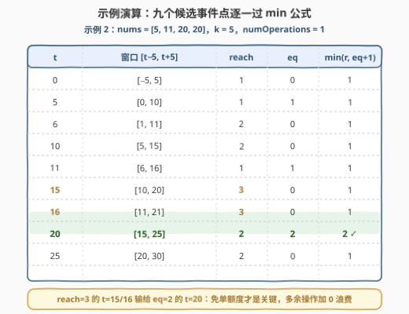

# 执行操作后元素的最高频率 II

- **题目名称**：执行操作后元素的最高频率 II
- **链接**：[3347. 执行操作后元素的最高频率 II](https://leetcode.cn/problems/maximum-frequency-of-an-element-after-performing-operations-ii/)
- **难度**：困难
- **标签**：数组、排序、二分查找、滑动窗口、枚举
- **关联**：与 [3346. 执行操作后元素的最高频率 I](https://leetcode.cn/problems/maximum-frequency-of-an-element-after-performing-operations-i/) 题面一字不差——I 把 $nums[i]$、$k$ 压到 $10^5$，可以开值域数组用差分线性扫；II 把两者放大到 $10^9$，值域爆炸，逼出「排序 + 事件点枚举 + 双指针/二分」的离散化打法（见第 5 节）

## 1. 题目概述

给你一个整数数组 `nums` 和两个整数 `k` 和 `numOperations`。你必须对 `nums` 执行操作 `numOperations` 次，每次操作中可以：

- 选择一个下标 `i`，它在之前的操作中**没有**被选择过；
- 将 `nums[i]` 增加范围 $[-k, k]$ 中的一个整数。

执行完所有操作后，返回 `nums` 中出现**频率最高**元素的出现次数（频率 = 该元素在数组中出现的次数）。

**示例 1**：

```text
输入：nums = [1,4,5], k = 1, numOperations = 2
输出：2
解释：将 nums[1] 增加 0，nums[2] 增加 -1，nums 变为 [1, 4, 4]。
```

**示例 2**：

```text
输入：nums = [5,11,20,20], k = 5, numOperations = 1
输出：2
解释：将 nums[1] 增加 0（两个 20 本来就免费凑成一对，操作加 0 浪费掉即可）。
```

**约束条件**：

- $1 \le nums.length \le 10^5$
- $1 \le nums[i] \le 10^9$
- $0 \le k \le 10^9$
- $0 \le numOperations \le nums.length$

> 💡 **读题关键**：① 操作**必须做满** `numOperations` 次，但每次可以加 $0$——「恰好」实际等价于「至多」（见 2.1）；② 每个下标至多被选一次，所以一个元素的总位移是**单个** $[-k,k]$ 内的整数，不能分多次累积挪动；③ 求的是「众数的重数」，不是众数本身。

---

## 2. 解题思路

### 2.1 朴素思路：翻译题意 + 枚举目标值

**第一步，把操作语义翻译干净。** 每次操作挑一个没用过的下标、加一个 $[-k,k]$ 内的整数。加 $0$ 合法，且约束保证 $numOperations \le n$（永远有新鲜下标可供「浪费」），于是：

$$\text{必须执行恰好 } numOperations \text{ 次} \iff \text{至多挑选 } numOperations \text{ 个元素，各自一次性位移} \le k$$

**第二步，固定目标值 $t$ 推公式。** 设最终想让尽量多的元素等于 $t$：

- $eq(t)$：**已经等于** $t$ 的元素个数——白嫖，一个操作都不花；
- $reach(t)$：落在 $[t-k,\ t+k]$ 内的元素个数——窗口内的其他元素各花**恰好一次**操作即可挪到 $t$；

$$freq(t) = \min\big(reach(t),\ eq(t) + numOperations\big)$$

「$reach$ 封顶」防的是窗口内本来就没那么多候选；「$eq + numOperations$ 封顶」防的是操作预算不足。答案就是 $\max_t freq(t)$。

**第三步，卡壳的地方。** $t$ 的合法范围约 $[1-10^9,\ 2\times10^9]$，有二十亿个整数候选，逐一枚举直接爆炸——这正是 II 与 I 的分水岭（I 的值域只有 $10^5$，开个数组扫过去就完事）。

### 2.2 核心观察：最优 $t$ 只需在 $3n$ 个「事件点」里找



把每个元素 $x$ 看成数轴上的一段**覆盖区间** $[x-k,\ x+k]$：目标 $t$ 落在区间里 $\iff$ $x$ 能一步挪到 $t$。于是 $reach(t)$ 就是点 $t$ 被这 $n$ 段区间覆盖的次数。



随着 $t$ 从左往右滑动，$reach(t)$ 只在 $t$ **越过某个区间端点** $x-k$（一段覆盖开始）或 $x+k$（一段覆盖结束）时发生变化；而 $eq(t)$ 只在 $t$ 恰好**等于**某个 $x$ 时非零。所以数轴被至多 $3n$ 个**事件点**

$$\mathcal{E} = \{x-k,\ x,\ x+k \mid x \in nums\}$$

切成若干段。在相邻事件点之间的**开区间**内：$reach$ 是常数 $r$，$eq = 0$，此时 $freq = \min(r,\ numOperations)$。而把 $t$ 挪到该段左边的事件点 $e$ 上：闭区间 $[x-k, x+k]$ 在端点处仍然计入，覆盖次数只增不减（$reach(e) \ge r$），且 $eq(e) \ge 0$，所以

$$freq(e) \ \ge\ \min(reach(e),\ eq(e)+numOperations)\ \ge\ \min(r,\ numOperations)\ =\ freq(\text{开区间内任一点})$$

> 💡 **结论**：开区间里的值永远不超过其左端事件点处的值，因此**只需检查 $3n$ 个候选 $\{x-k, x, x+k\}$**，取最大即可。这也正是官方 hint「The optimal values to check are nums[i]−k, nums[i], and nums[i]+k」的含义——不是经验技巧，是有覆盖论证撑腰的硬结论。

### 2.3 算法流程图



排序 $nums$（窗口计数的基础）→ 生成 $3n$ 个候选事件点并去重排序 → 候选值递增，用**双指针** $lo/hi$ 单向右移维护「落在 $[t-k, t+k]$ 内的元素」对应排序数组的连续区间 $[lo, hi)$，$reach = hi - lo$；$eq$ 用哈希表 $O(1)$ 查 → 套 $\min$ 公式更新答案。整体 $O(n \log n)$。

### 2.4 示例演算



**示例 2（nums = [5,11,20,20], k = 5, numOperations = 1）**：排序后 `[5, 11, 20, 20]`，候选事件点去重后为 `0, 5, 6, 10, 11, 15, 16, 20, 25`：

| $t$ | 窗口 $[t-5, t+5]$ | 命中元素 | $reach$ | $eq$ | $\min(reach,\ eq+1)$ |
|------|------------------|----------|---------|------|----------------------|
| 0 | $[-5, 5]$ | {5} | 1 | 0 | 1 |
| 5 | $[0, 10]$ | {5} | 1 | 1 | 1 |
| 6 | $[1, 11]$ | {5,11} | 2 | 0 | 1 |
| 10 | $[5, 15]$ | {5,11} | 2 | 0 | 1 |
| 11 | $[6, 16]$ | {11} | 1 | 1 | 1 |
| 15 | $[10, 20]$ | {11,20,20} | 3 | 0 | 1 |
| 16 | $[11, 21]$ | {11,20,20} | 3 | 0 | 1 |
| **20** | $[15, 25]$ | {20,20} | 2 | **2** | **2** ✓ |
| 25 | $[20, 30]$ | {20,20} | 2 | 0 | 1 |

答案 **2**：$t=20$ 时两个现成的 20 免单，唯一一次操作加 $0$ 浪费掉——「恰好 = 至多」的现场演示。注意 $t=15/16$ 处 $reach$ 高达 3，但窗口里没有任何数等于 15/16，预算只有 1，只能兑现 1 个：**$reach$ 高未必赢，$eq$ 才是免单额度**。

**示例 1（nums = [1,4,5], k = 1, numOperations = 2）**：$t=4$ 时窗口 $[3,5]$ 命中 {4,5}，$reach=2$，$eq=1$，$\min(2, 3) = 2$ ✓。

---

## 3. 参考代码

### C++（排序 + 事件点枚举 + 二分）

```cpp
class Solution {
  public:
    int maxFrequency(vector<int>& nums, int k, int numOperations) {
        sort(nums.begin(), nums.end());
        int n = nums.size();

        // 3n 个候选事件点：x-k / x / x+k（x±k 均在 int 范围内）
        vector<int> cands;
        cands.reserve(3LL * n);
        for (int x : nums) {
            cands.push_back(x - k);
            cands.push_back(x);
            cands.push_back(x + k);
        }
        sort(cands.begin(), cands.end());
        cands.erase(unique(cands.begin(), cands.end()), cands.end());

        int ans = 0;
        for (int t : cands) {
            long long lo = (long long)t - k;   // t+k 最大 3e9，必须先转 long long 防溢出
            long long hi = (long long)t + k;
            int reach = upper_bound(nums.begin(), nums.end(), hi)    // 窗口内元素个数
                      - lower_bound(nums.begin(), nums.end(), lo);
            int eq = upper_bound(nums.begin(), nums.end(), (long long)t)
                   - lower_bound(nums.begin(), nums.end(), (long long)t);
            ans = max(ans, min(reach, eq + numOperations));
        }
        return ans;
    }
};
```

### Python（写法一：候选 + 双指针扫窗口）

```python
from collections import Counter

class Solution:
    def maxFrequency(self, nums: List[int], k: int, numOperations: int) -> int:
        nums.sort()
        n = len(nums)
        cnt = Counter(nums)

        # 3n 个候选事件点，去重后排序
        cands = sorted({x - k for x in nums} | set(nums) | {x + k for x in nums})

        ans = 0
        lo = hi = 0                        # 窗口 [t-k, t+k] 对应排序数组的连续区间 [lo, hi)
        for t in cands:                    # t 递增 → 两个指针都只单向右移，摊还 O(1)
            while lo < n and nums[lo] < t - k:
                lo += 1
            while hi < n and nums[hi] <= t + k:
                hi += 1
            ans = max(ans, min(hi - lo, cnt.get(t, 0) + numOperations))
        return ans
```

### Python（写法二：候选 + bisect，更短）

```python
from bisect import bisect_left, bisect_right
from collections import Counter

class Solution:
    def maxFrequency(self, nums: List[int], k: int, numOperations: int) -> int:
        nums.sort()
        cnt = Counter(nums)
        ans = 0
        for x in nums:
            for t in (x - k, x, x + k):    # 不去重也不影响正确性，只是多算几轮
                reach = bisect_right(nums, t + k) - bisect_left(nums, t - k)
                ans = max(ans, min(reach, cnt.get(t, 0) + numOperations))
        return ans
```

> 💡 **实现细节**：① C++ 里 $t+k$ 最大 $3\times10^9$ 超出 `int`，窗口边界务必先转 `long long`（候选 $x\pm k$ 本身 $\le 2\times10^9$ 尚在 `int` 内，但很贴边）；② Python 无溢出问题，写法一用双指针把每组查询做成摊还 $O(1)$，比写法二的 $O(\log n)$ 二分快一截；③ 候选不去重只是浪费几轮重复计算，正确性不受影响——追求速度才需要 `set` 去重。

---

## 4. 复杂度分析

| 维度 | 复杂度 | 说明 |
|------|--------|------|
| 时间 | $O(n \log n)$ | 排序 $O(n\log n)$；$3n$ 个候选去重排序 $O(n\log n)$；双指针整体单向移动 $O(n)$（二分写法则为 $O(n\log n)$，同阶） |
| 空间 | $O(n)$ | 候选数组 + `Counter` 哈希表 |
| 数据规模 | $3\times10^5$ 个候选 | 值域 $10^9$ 被离散化为 $3n$ 个事件点，复杂度与值域大小**完全解耦**——这正是从 I 到 II 唯一的考点 |

---

## 5. 扩展：3346（I 版）的值域差分 & 覆盖模型的一家子

**3346 与本题题面完全相同**，唯一区别是 $nums[i], k \le 10^5$：

- **I 可以开值域数组**：对每个 $x$ 执行 `diff[x-k] += 1; diff[x+k+1] -= 1` 记录覆盖次数的前缀差分，再配一个 `eq[]` 数组，然后线性扫过整个值域逐点套 $\min$ 公式——$O(n + V)$，$V = 2\times10^5$；
- **II 值域放大到 $10^9$**，数组开不下，于是隐式的「值域格点」显式化为 $3n$ 个事件点，差分扫描升级为排序 + 双指针/二分。**两题共享同一个「区间覆盖端点」模型，差别只在离散化手段。**

另一个等价视角：$x$ 能一步挪到 $t\ \iff\ t \in [x-k, x+k]$；固定窗口看，排序后一段连续元素 $nums[i..j]$ **能聚到同一个值** $\iff$ $nums[j] - nums[i] \le 2k$（取 $t \in [nums[j]-k,\ nums[i]+k]$ 内任一整数，该区间非空）。所以 $reach$ 也可以用**宽度 $2k$ 的滑动窗口**来数——这正是标签里 Sliding Window 的来历。但注意：只数窗口长度会漏掉 $eq$ 免单的部分（示例 2 里两个现成的 20 一分钱不花），所以必须配上 $\min(reach,\ eq + numOperations)$ 的修正，这也是本题区别于普通滑窗计数题的陷阱所在。

---

## 6. 面试要点

1. **「必须执行恰好 numOperations 次」要不要特判？**

   - 不用。每次操作可以加 $0$，且约束保证 $numOperations \le n$，总有没用过的下标可以拿来浪费；所以「恰好」$\iff$「至多」。若 $numOperations > n$ 则必须全选，但这被约束排除了。

2. **为什么候选目标只需 $\{x-k, x, x+k\}$ 三个事件点？**

   - $reach(t)$ 是 $n$ 段区间 $[x-k, x+k]$ 对点 $t$ 的覆盖计数，只在区间端点处变化；$eq(t)$ 只在 $t = x$ 处非零。相邻事件点之间的开区间上 $freq = \min(r,\ numOperations)$，而其左端事件点处的覆盖计数 $\ge r$、$eq \ge 0$，故开区间内的值不会超过事件点处的值。

3. **$\min(reach,\ eq + numOperations)$ 的两个封顶分别防什么？**

   - $reach$ 防的是「预算够但窗口内候选不足」；$eq + numOperations$ 防的是「窗口内候选够但预算不足」。窗口外的元素再多预算也够不着，$eq$ 部分则完全免费。

4. **和 1838（最高频元素的频数）有什么区别？**

   - 1838 每次操作只能给某个元素 $+1$，把一个元素挪 $d$ 要花 $d$ 次操作，预算全局共享，窗口判定要用前缀和；本题每个元素至多被操作一次、一步挪 $\le k$，判定退化为「是否落在 $[t-k, t+k]$」，但要叠加 $eq$ 免单修正。

5. **实现上有什么溢出/边界坑？**

   - C++ 中 $t + k$ 最大 $3\times10^9$ 溢出 `int`，窗口边界要转 `long long`；候选 $x - k$ 可能为负（最小约 $-10^9$），$x + k$ 可达 $2\times10^9$；$k = 0$ 时窗口塌缩成一个点，答案退化为「现成众数重数与 $\min(众数重数, 1 + numOperations)$ 的最大值」。

---

## 7. 同类练习题

- [3346. 执行操作后元素的最高频率 I](https://leetcode.cn/problems/maximum-frequency-of-an-element-after-performing-operations-i/)：同题小数据版，值域压到 $10^5$ 可开数组差分扫，对照体会「离散化」的必要性
- [1838. 最高频元素的频数](https://leetcode.cn/problems/frequency-of-the-most-frequent-element/)（[站内题解](../1801-1900/1838_最高频元素的频数.md)）：$+1$ 操作 + 全局预算共享，排序滑窗 + 前缀和判定，本题的「连续挪动」亲戚
- [2968. 执行操作使频率分数最大](https://leetcode.cn/problems/apply-operations-to-maximize-frequency-score/)（[站内题解](../2901-3000/2968_执行操作使频率分数最大.md)）：Hard 同家族——操作预算 + 滑窗 + 中位数贪心，最优目标取窗口中位数
- [2009. 使数组连续的最少操作数](https://leetcode.cn/problems/minimum-number-of-operations-to-make-array-continuous/)（[站内题解](../2001-2100/2009_使数组连续的最少操作数.md)）：去重 + 排序 + 滑窗数「能保留的元素」，同样是「枚举最终形态 + 窗口判定」范式
