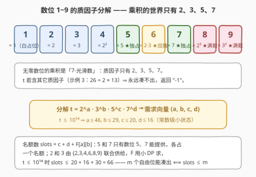
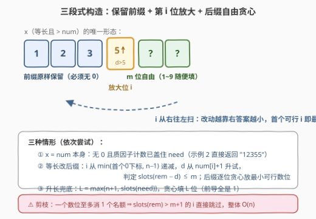
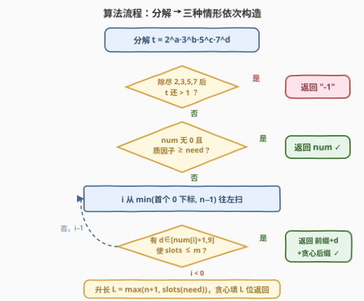
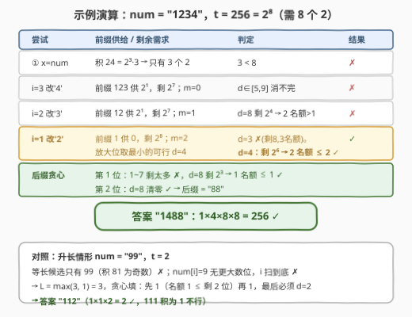

# 最小可整除数位乘积 II

- **题目名称**：最小可整除数位乘积 II
- **链接**：[3348. 最小可整除数位乘积 II](https://leetcode.cn/problems/smallest-divisible-digit-product-ii/)
- **难度**：困难
- **标签**：贪心、数论、字符串、构造
- **关联**：与 [3345. 最小可整除数位乘积 I](https://leetcode.cn/problems/smallest-divisible-digit-product-i/)（[站内题解](3345_最小可整除数位乘积I.md)）同源——I 版靠「乘积归零」的十连窗口暴力收工；II 版**禁 0 数位** + 长度 $2 \times 10^5$ 的数字串 + $t \le 10^{14}$，把捷径全部堵死，逼出「质因子需求 + 保留前缀 + 后缀贪心」的数位构造全套。

## 1. 题目概述

给你一个字符串 `num`，表示一个**正**整数，同时给你一个整数 `t`。

如果一个整数**没有**任何数位是 0，那么我们称这个整数是**无零**数字。

请你返回一个字符串，这个字符串对应的整数是**大于等于** `num` 的**最小无零**整数，且**各数位之积**能被 `t` 整除。如果不存在这样的数字，请你返回 `"-1"`。

**示例 1**：

```text
输入：num = "1234", t = 256
输出："1488"
解释：大于等于 1234 且数位乘积能被 256 整除的最小无零整数是 1488，
     它的数位乘积为 1×4×8×8 = 256。
```

**示例 2**：

```text
输入：num = "12355", t = 50
输出："12355"
解释：12355 已经是无零且数位乘积能被 50 整除的整数，它的数位乘积为 150。
```

**示例 3**：

```text
输入：num = "11111", t = 26
输出："-1"
解释：不存在大于等于 11111 且数位乘积能被 26 整除的无零整数。
```

**约束条件**：

- $2 \le \text{num.length} \le 2 \times 10^5$
- `num` 只包含 `'0'` 到 `'9'` 之间的数字（**可以含 0**，但无前导 0）
- $1 \le t \le 10^{14}$

> 💡 **读题关键**：① 数位只能是 $1 \sim 9$（禁 0），于是数位乘积做质因子分解，**因子只能出自 $\{2,3,5,7\}$**——这是全题的命门；② `num` 自身可能含 0（此时 $x = \text{num}$ 直接非法），而**答案允许比 num 更长**；③ $n$ 达 $2 \times 10^5$，连「加一」都是 $O(L)$，一切必须是线性扫；④ $t \le 10^{14}$，幂次有硬上界（$v_2 \le 46,\ v_3 \le 29,\ v_5 \le 20,\ v_7 \le 16$），后面会反复用到。

---

## 2. 解题思路

### 2.1 I 版的暴力为什么彻底失效

[3345](3345_最小可整除数位乘积I.md) 的做法是：任意连续 10 个整数必有一个末位 0，其数位乘积为 0，而 0 能被任何 $t$ 整除，所以答案落在 $[n, n+9]$ 里。本题一句话就把这条路焊死：**候选数必须无零**。于是：

- 乘积不再能「归零作弊」，必须老老实实用 $1 \sim 9$ 的数位**凑出** $t$ 的全部质因子；
- `num` 长度 $2 \times 10^5$，逐个 $+1$ 枚举连边都摸不到（一次进位就是 $O(L)$）；
- 答案可能离 `num` 极远：`num = "99"`、$t = 2^{46}$ 时，答案是一个 **16 位数**。

所以必须**换范式**：不枚举数值，而是像「下一个排列」那样，**直接在数位串上构造**。

### 2.2 核心观察一：乘积的质因子只能来自 {2, 3, 5, 7}



把 $1 \sim 9$ 逐个分解：$1$、$2$、$3$、$4=2^2$、$5$、$6=2\cdot3$、$7$、$8=2^3$、$9=3^2$。**无零数位的乘积是 7-光滑数**（所有质因子 $\le 7$）。由唯一分解定理：

- 若 $t$ 含 $2,3,5,7$ 之外的质因子（如示例 3 的 $26 = 2 \times 13$），**永远无解**，直接返回 `"-1"`；
- 否则把 $t$ 写成 $t = 2^a \, 3^b \, 5^c \, 7^d$，问题变成：**数位乘积至少含有 $a$ 个 2、$b$ 个 3、$c$ 个 5、$d$ 个 7**。记这个四元组需求为 $\text{need} = (a, b, c, d)$。由 $t \le 10^{14}$ 知 $a \le 46,\ b \le 29,\ c \le 20,\ d \le 16$——**需求是个常数级的小状态**。

注意分工：**5 和 7 是「独占名额」**——含质因子 5 的数位只有 5，含 7 的只有 7；而 2 和 3 可以由 $2,3,4,6,8,9$ 联合供给，其中 $6 = 2 \times 3$ 能一箭双雕。

### 2.3 核心观察二：「名额」——凑出剩余需求最少要几个数位

构造时要不停地回答一个判定问题：**还剩 $m$ 个自由数位，能否凑出剩余需求 $r = (a,b,c,d)$？**

先给工具：设 $F[a][b]$ = 凑出 $a$ 个 2、$b$ 个 3 所需的**最少数位个数**，用一个小 DP 预处理（状态只有 $50 \times 34$，转移只有 6 个数位）：

$$F[a][b] = 1 + \min_{d \in \{2,3,4,6,8,9\}} F\big[(a - c_2(d))^+\big]\big[(b - c_3(d))^+\big]$$

其中 $c_2(d), c_3(d)$ 是数位 $d$ 提供的 2/3 的个数（$c_2(8)=3$、$c_3(9)=2$、$c_2(6)=c_3(6)=1$ 等）。**必须跳过 $(c_2, c_3) = (0,0)$ 的无进展转移，否则状态会自引用**（这是本题最隐蔽的实现坑）。

> ⚠️ **为什么不能直接用公式** $\max(\lceil a/3 \rceil, \lceil b/2 \rceil)$？反例：需求 $(a,b) = (1,2)$（$t$ 含 $2 \cdot 3^2 = 18$）。公式给出 1，但**不存在数位 $= 18$**，一个数位要么最多 3 个 2、要么最多 2 个 3，不能兼得；实际要 2 个名额（$9 + 2$）。名额是**共享资源**，2 与 3 的供给互相挤占，只能用 DP 精确算。

于是「剩余需求 $r$ 最少要几个数位」（下称**名额数** $\text{slots}(r)$）：

$$\text{slots}(a,b,c,d) = c + d + F[a][b]$$

（5、7 各自独占名额，直接数个数；2、3 共享，交给 $F$。）判定就变成一行：**$m$ 个自由位能凑出 $r$ $\iff$ $\text{slots}(r) \le m$**。$t \le 10^{14}$ 时 $\text{slots} \le 20 + 16 + F[46][29] = 20 + 16 + 30 = 66$，是常数级。

### 2.4 核心观察三：保留最长前缀，从右往左找「放大位」



任何**等长**且 $> \text{num}$ 的候选 $x$，都可以唯一描述为：存在位置 $i$，使得 $x[0..i-1] = \text{num}[0..i-1]$（**前缀原样保留**）、$x[i] > \text{num}[i]$（**第 $i$ 位放大**）、$x[i+1..n-1]$ 完全自由（**后缀随便填 $1 \sim 9$**）。加上 $x = \text{num}$ 本身，等长情形就枚举完了。

三个「最小性」层层递进：

1. **$i$ 越大答案越小**：$x$ 与 `num` 的公共前缀越长，在第一个不同位上 $x$ 的取值越小（$x[i] > \text{num}[i]$ 但 $x[i+1\ldots]$ 随便取 1）。所以 **从右往左扫，首个可行位置即最优**；
2. **固定 $i$，取最小的可行放大数字 $d \in [\text{num}[i]+1, 9]$**：对每个 $d$ 判定一次 $\text{slots}(\text{rem} - d) \le m$（$m = n-1-i$ 是后缀自由位数，rem 是扣除保留前缀贡献后的剩余需求）；
3. **后缀逐位贪心**：从左到右每位从 $1$ 试到 $9$，取最小的、使得**填完后不变式 $\text{slots} \le \text{剩余位数}$ 依然成立**的数字。不变式在，结尾必能清零需求（$d=1$ 白占位，真正的需求由后面的 $8/9/5/7/6$ 扛）。

> ⚠️ **前缀含 0 怎么办**：$x$ 的每一位都必须非零，所以**保留的前缀必须无 0**。若 `num` 第一个 0 在下标 $fz$，则 $i$ 的扫描上界是 $\min(fz, n-1)$——位置 $fz$ 本身可以被「放大」成非零数位，但更右的位置全被这个 0 拖死。

**升长兜底**：等长全失败时，答案比 `num` 长。最小长度 $L = \max(n+1, \text{slots}(\text{need}))$——长度 $n+1$ 保证严格大于 `num`（`num` 无前导零），名额数保证凑得齐；用同一个逐位贪心从左填 $L$ 位即得最小值（前导全是 1，真正的需求压在尾部）。

一个漂亮的剪枝：**一个数位至多消掉 1 个名额**（$8$ 供 3 个 2 恰好折 1 名额；$5$、$7$ 各折 1；没有数位能同时折 $F$ 和 $c/d$）。所以 $\text{slots}(\text{rem}) > m + 1$ 的位置 $i$ 不必进内层循环，整体仍是 $O(n)$。

### 2.5 算法流程图



### 2.6 示例演算



**示例 1（`num = "1234"`, $t = 256 = 2^8$）**，需求 $(8,0,0,0)$：

1. **情形① $x = \text{num}$**：积 $= 1 \times 2 \times 3 \times 4 = 24 = 2^3 \cdot 3$，2 只有 3 个 $< 8$ ✗；
2. **$i = 3$（改 '4'）**：前缀 `123` 供 $2^1$，剩 $2^7$；后面 $m=0$ 个自由位，$d \in [5,9]$ 无法清零 ✗；
3. **$i = 2$（改 '3'）**：前缀 `12` 供 $2^1$，剩 $2^7$；$m=1$，最好的 $d=8$ 消 3 个还剩 4 个 → 需 2 名额 $> 1$ ✗；
4. **$i = 1$（改 '2'）**：前缀 `1` 供 0，剩 $2^8$；$m=2$：$d=3$ 剩 8（3 名额 $>2$）✗；$d=4$ 剩 $2^6$ → **2 名额 $\le 2$ ✓**；
5. **后缀贪心填 2 位**：第 1 位试 $1 \sim 7$ 都剩得太多（名额 $> 1$），$d=8$ 剩 $2^3$（1 名额 $\le 1$）✓；第 2 位 $d=8$ 清零 ✓ → **`"1488"`**。

验证：$1 \times 4 \times 8 \times 8 = 256$ ✓，且 $1488 \ge 1234$ ✓。

**升长例子（`num = "99"`, $t = 2$）**：等长候选只有 99，积 81 是奇数 ✗；$i=1$、$i=0$ 的 `num[i]` 都是 9，没有更大的数位 ✗ → 等长无解。$L = \max(3, 1) = 3$，贪心填：`"112"`（$1 \times 1 \times 2 = 2$ ✓；111 积为 1 不行，112 正是答案）。

---

## 3. 参考代码

### C++

```cpp
class Solution {
  public:
    string smallestNumber(string num, long long t) {
        // 观察一：分解 t = 2^a · 3^b · 5^c · 7^d，含其它质因子则无解
        const int PR[4] = {2, 3, 5, 7};
        int need[4] = {0, 0, 0, 0};
        for (int i = 0; i < 4; ++i)
            while (t % PR[i] == 0) { t /= PR[i]; ++need[i]; }
        if (t != 1) return "-1";                        // 示例 3：26 = 2 × 13

        const int D2[10] = {0, 0, 1, 0, 2, 0, 1, 0, 3, 0}; // 数位提供 2 的个数
        const int D3[10] = {0, 0, 0, 1, 0, 0, 1, 0, 0, 2}; // 数位提供 3 的个数

        // 观察二：F[a][b] = 凑 a 个 2、b 个 3 的最少名额（小 DP，状态 50×34）
        int F[50][34];
        for (int a = 0; a < 50; ++a)
            for (int b = 0; b < 34; ++b) {
                if (!a && !b) { F[a][b] = 0; continue; }
                int best = INT_MAX;
                for (int d : {2, 3, 4, 6, 8, 9}) {
                    int na = max(0, a - D2[d]), nb = max(0, b - D3[d]);
                    if (na == a && nb == b) continue;   // ⚠️ 无进展转移会自引用！
                    best = min(best, 1 + F[na][nb]);
                }
                F[a][b] = best;
            }
        auto slots = [&](const int* r) { return r[2] + r[3] + F[r[0]][r[1]]; };
        auto sub = [&](int* r, int d) {                 // 需求 r 减去数位 d 的贡献
            r[0] = max(0, r[0] - D2[d]);
            r[1] = max(0, r[1] - D3[d]);
            r[2] = max(0, r[2] - (d == 5));
            r[3] = max(0, r[3] - (d == 7));
        };
        auto fill = [&](int* r, int m) {                // 后缀逐位贪心：不变式 slots ≤ 剩余位数
            string s;
            for (int j = m; j >= 1; --j)
                for (int d = 1; d <= 9; ++d) {
                    int nr[4] = {r[0], r[1], r[2], r[3]};
                    sub(nr, d);
                    if (slots(nr) <= j - 1) {
                        s += char('0' + d);
                        memcpy(r, nr, sizeof nr);
                        break;
                    }
                }
            return s;
        };

        int n = num.size();
        // 情形①：x = num 本身（无 0 且质因子已够）
        int allc[4] = {0, 0, 0, 0};
        bool zero = false;
        for (char ch : num) {
            int d = ch - '0';
            if (d == 0) { zero = true; break; }
            allc[0] += D2[d]; allc[1] += D3[d];
            allc[2] += (d == 5); allc[3] += (d == 7);
        }
        if (!zero && allc[0] >= need[0] && allc[1] >= need[1] &&
                     allc[2] >= need[2] && allc[3] >= need[3])
            return num;

        // 情形②：等长。保留前缀 num[0..i-1] 必须无 0 → i 上界是首个 0 的下标
        size_t fzp = num.find('0');
        int fz = (fzp == string::npos) ? n : (int)fzp;
        int hi = min(fz, n - 1);
        vector<array<int, 4>> pre(hi + 1);              // pre[i]：前缀的质因子计数
        for (int i = 1; i <= hi; ++i) {
            int d = num[i - 1] - '0';
            pre[i] = pre[i - 1];
            pre[i][0] += D2[d]; pre[i][1] += D3[d];
            pre[i][2] += (d == 5); pre[i][3] += (d == 7);
        }
        for (int i = hi; i >= 0; --i) {                 // 观察三：i 从右往左，首个可行即最优
            int rem[4];
            for (int k = 0; k < 4; ++k) rem[k] = max(0, need[k] - pre[i][k]);
            int m = n - 1 - i;                          // 第 i 位之后的自由位数
            if (slots(rem) > m + 1) continue;           // 一位至多消 1 名额，剪枝
            for (int d = num[i] - '0' + 1; d <= 9; ++d) {
                int r[4] = {rem[0], rem[1], rem[2], rem[3]};
                sub(r, d);
                if (slots(r) <= m)
                    return num.substr(0, i) + char('0' + d) + fill(r, m);
            }
        }

        // 情形③：升长兜底，L = max(n+1, 名额数)，同一个贪心从左填
        int r[4] = {need[0], need[1], need[2], need[3]};
        return fill(r, max(n + 1, slots(r)));
    }
};
```

### Python

```python
class Solution:
    def smallestNumber(self, num: str, t: int) -> str:
        # 观察一：分解 t；含 >7 的质因子直接无解
        need = [0, 0, 0, 0]
        for i, p in enumerate((2, 3, 5, 7)):
            while t % p == 0:
                t //= p
                need[i] += 1
        if t != 1:
            return "-1"

        D2 = (0, 0, 1, 0, 2, 0, 1, 0, 3, 0)   # 数位提供 2 的个数
        D3 = (0, 0, 0, 1, 0, 0, 1, 0, 0, 2)   # 数位提供 3 的个数

        # 观察二：F[a][b] = 凑 a 个 2、b 个 3 的最少名额
        F = [[0] * 34 for _ in range(50)]
        for a in range(50):
            for b in range(34):
                if a == 0 and b == 0:
                    continue
                best = float('inf')
                for d in (2, 3, 4, 6, 8, 9):
                    na, nb = max(0, a - D2[d]), max(0, b - D3[d])
                    if (na, nb) != (a, b):    # ⚠️ 跳过无进展转移，防自引用
                        best = min(best, 1 + F[na][nb])
                F[a][b] = best

        def slots(r):                          # 剩余需求的最少名额
            return r[2] + r[3] + F[r[0]][r[1]]

        def sub(r, d):                         # 需求减去数位 d 的贡献
            return (max(0, r[0] - D2[d]), max(0, r[1] - D3[d]),
                    max(0, r[2] - (d == 5)), max(0, r[3] - (d == 7)))

        def fill(r, m):                        # 逐位贪心，保持 slots ≤ 剩余位数
            out = []
            for j in range(m, 0, -1):
                for d in range(1, 10):
                    nr = sub(r, d)
                    if slots(nr) <= j - 1:
                        out.append(str(d))
                        r = nr
                        break
            return ''.join(out)

        n = len(num)
        # 情形①：x = num 本身
        if '0' not in num:
            c = [0, 0, 0, 0]
            for ch in num:
                d = ord(ch) - 48
                c[0] += D2[d]; c[1] += D3[d]; c[2] += d == 5; c[3] += d == 7
            if all(c[k] >= need[k] for k in range(4)):
                return num

        # 情形②：等长，i 从（首个 0 下标与 n-1 的较小者）往左扫
        fz = num.find('0')
        hi = n - 1 if fz == -1 else fz         # 保留前缀必须无 0
        pre = [(0, 0, 0, 0)]
        for i in range(hi):
            d = ord(num[i]) - 48
            p = pre[-1]
            pre.append((p[0] + D2[d], p[1] + D3[d],
                        p[2] + (d == 5), p[3] + (d == 7)))

        for i in range(hi, -1, -1):            # i 越大答案越小 → 从右往左
            rem = tuple(max(0, need[k] - pre[i][k]) for k in range(4))
            m = n - 1 - i
            if slots(rem) > m + 1:             # 一位至多消 1 名额，剪枝
                continue
            for d in range(ord(num[i]) - 47, 10):          # num[i]+1 .. 9
                r = sub(rem, d)
                if slots(r) <= m:
                    return num[:i] + str(d) + fill(r, m)

        # 情形③：升长兜底
        L = max(n + 1, slots(tuple(need)))
        return fill(tuple(need), L)
```

> 💡 **实现细节**：① `F` 表里 `(na, nb) == (a, b)` 的转移（如纯 2 需求选数位 3）必须跳过——它在 DP 途中会引用尚未计算、初值为 0 的自身，把 $F[5][0]$ 算成 1，这是本题最容易翻车的点；② 需求做减法后要**与 0 取 max**：前缀「超额」的质因子不能存进后缀；③ `slots(rem) > m + 1` 的剪枝不只是常数优化，它保证了从右往左扫描的整体均摊 $O(n)$；④ 三种情形共用的 `fill` 是同一个贪心——升长情形就是「前缀为空、放大位也不存在」的退化版。

---

## 4. 复杂度分析

| 维度 | 复杂度 | 说明 |
|------|--------|------|
| 时间 | $O(n + \log t)$ | 分解 $t$ 为 $O(\log t)$；`F` 表预处理 $50 \times 34 \times 6$ 为常数；情形① 前缀统计、情形② 从右向左扫（剪枝后内层命中即返回）、`fill` 逐位 9 选 1，合计线性 |
| 空间 | $O(n)$ | 前缀质因子计数数组 `pre`（长度 $n+1$）；改为从右向左滚动增删可降到 $O(1)$，此处取可读性 |
| 答案长度 | $\max(n+1,\ 66)$ 以内 | 等长为 $n$；升长时 $L = \max(n+1, \text{slots}(\text{need}))$，而 $\text{slots} \le 20 + 16 + 30 = 66$（$t \le 10^{14}$） |
| 数据规模 | 需求四元组 $\le (46, 29, 20, 16)$ | 由 $t \le 10^{14}$ 锁死，`F` 表只需 $50 \times 34$ |

---

## 5. 扩展：数位构造的「下一个更大」家族

本题的骨架——**「保留最长合法前缀 + 找到放大位 + 后缀重排/贪心」**——是数位构造题的通用范式，值得串起来记：

| 题目 | 前缀合法性 | 放大位 | 后缀怎么填 |
|------|-----------|--------|-----------|
| [31. 下一个排列](https://leetcode.cn/problems/next-permutation/) | 非降后缀 | 后缀中刚大于它的数 | 剩余数位升序 |
| [738. 单调递增的数字](https://leetcode.cn/problems/monotone-increasing-digits/) | 递增前缀 | 减 1 | 全部重置为 9 |
| 本题 3348 | 无 0 且质因子够 | $d \in [\text{num}[i]+1, 9]$ 逐个试 | 贪心放最小数位，保持名额不变式 |

另一个视角：本题也可以用**数位 DP** 求「$\ge \text{num}$ 的最小可行数」，状态 $(\text{pos}, \text{tight}, \text{need 四元组})$——但 `need` 直接塞状态会爆炸，本质还是要先把需求压缩成「名额数」这一定长小状态，绕了一圈又回到同一观察。这也说明：**Hard 题的难点常常不在框架，而在把「可行性」压缩成一个可判定的不变式**。

最后与 [3345](3345_最小可整除数位乘积I.md) 首尾呼应：I 版的关键洞察是「乘积含 0 则归零、0 被一切整除」，II 版禁掉 0 后，剩下的洞察「**数位乘积与 $t$ 的质因子同源于 $\{2,3,5,7\}$**」反而从陪衬变成了主菜——简单题里看似只值一句解释的观察，正是困难题的钥匙。

---

## 6. 面试要点

1. **为什么 $t$ 含大于 7 的质因子就直接返回 `"-1"`？**

   - 无零数位 $\in \{1,\dots,9\}$，每个数位的质因子都 $\le 7$，所以乘积是 7-光滑数；由唯一分解定理，7-光滑数不可能被含 11、13 等质因子的 $t$ 整除。对应示例 3 的 $t = 26 = 2 \times 13$。

2. **为什么 $i$ 从右往左扫、首个可行位置就是最优？**

   - 等长且 $> \text{num}$ 的 $x$ 与 `num` 的**公共前缀越长**，$x$ 越小：设 $i_1 > i_2$ 是两个放大位，则 $x_1$ 在 $i_2$ 处仍等于 `num[i₂]`，而 $x_2[i_2] > \text{num}[i_2]$，故 $x_1 < x_2$。固定 $i$ 后再取最小放大数字 $d$、后缀逐位贪心，三层嵌套的最小性合起来就是全局最小。

3. **可行性判定为什么不能用「每位至多供 3 个 2、2 个 3」的容量公式？**

   - 名额是共享的：需求 $(1, 2)$（含 $2 \cdot 3^2$）按容量公式 1 位就「够」，但不存在数位 $= 18$。正确做法是 DP 出最少名额 $F[a][b]$，5 和 7 因为只有数位 5、7 能提供而各占 $c$、$d$ 个名额，总名额 $= c + d + F[a][b]$。实现时注意跳过零贡献转移，防止 DP 自引用。

4. **`num` 含 0 时要注意什么？**

   - $x = \text{num}$ 直接非法；等长情形保留的前缀必须无 0，所以放大位 $i$ 的上界是**第一个 0 的下标**（把那个 0 本身改成非零数位是允许的，其右侧的位因前缀含 0 全部作废）。

5. **答案最长会有多长？为什么会超过 $n + 1$？**

   - $L = \max(n+1, \text{slots}(\text{need}))$。$t \le 10^{14}$ 时名额至多 66，所以一般就是 $n$ 或 $n+1$；但当 `num` 很短而 $t$ 很「重」时会被名额顶爆——如 `num = "99"`、$t = 2^{46}$：等长无解（9 无法放大），$n + 1 = 3$ 又装不下 16 个名额（16 个 8），答案是 16 位数 `111…14888…8` 一类。

---

## 7. 同类练习题

- [3345. 最小可整除数位乘积 I](https://leetcode.cn/problems/smallest-divisible-digit-product-i/)（[站内题解](3345_最小可整除数位乘积I.md)）：本题的简单版，靠「含 0 归零」十连窗口暴力；对照体会「禁 0」如何逼出质因子构造
- [738. 单调递增的数字](https://leetcode.cn/problems/monotone-increasing-digits/)（[站内题解](../0701-0800/738_单调递增的数字.md)）：同款「保留最长合法前缀 + 放大位减一 + 后缀重置」的数位构造模板
- [2375. 根据模式串构造最小数字](https://leetcode.cn/problems/construct-smallest-number-from-di-string/)（[站内题解](../2301-2400/2375_根据模式串构造最小数字.md)）：逐位贪心 + 可行性不变式（回溯兜底），与本题后缀填充同思想
- [670. 最大交换](https://leetcode.cn/problems/maximum-swap/)（[站内题解](../0601-0700/670_最大交换.md)）：数位贪心构造的对照题——求「一次交换能得到的最大」，与本题求最小互为镜像
- [31. 下一个排列](https://leetcode.cn/problems/next-permutation/)（[站内题解](../0001-0100/31_下一个排列.md)）：「下一个更大」数位构造家族的鼻祖，本题的「放大位 + 后缀重构」正是它的推广
