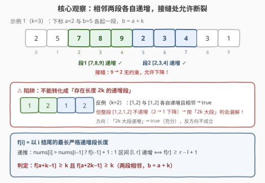
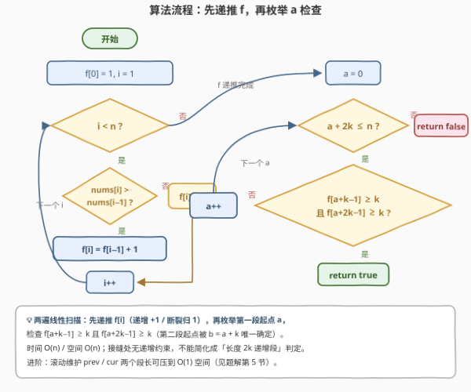
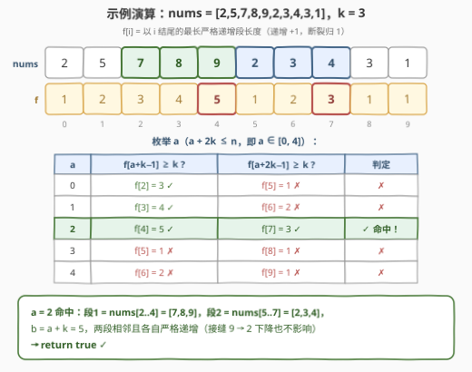

# LeetCode 检测相邻递增子数组 I 题解

## 1. 题目概述

- **标题 / 题号**：检测相邻递增子数组 I（#3349，easy）
- **链接**：https://leetcode.cn/problems/adjacent-increasing-subarrays-detection-i/
- **难度**：简单
- **标签**：数组、一次遍历、递增段

**题意**：给你一个由 $n$ 个整数组成的数组 `nums` 和一个整数 $k$，请你确定是否存在**两个相邻**且长度为 $k$ 的**严格递增**子数组。具体来说，需要检查是否存在从下标 $a$ 和 $b$（$a < b$）开始的两个子数组，并满足下述全部条件：

- `nums[a..a+k-1]` 和 `nums[b..b+k-1]` 都是**严格递增**的；
- 两个子数组**相邻**，即 $b = a + k$。

如果可以找到这样的两个子数组，返回 `true`；否则返回 `false`。

**示例 1**：

```text
输入：nums = [2,5,7,8,9,2,3,4,3,1], k = 3
输出：true
解释：下标 2 开始的 [7,8,9] 与下标 5 开始的 [2,3,4] 都严格递增，
     且 5 = 2 + 3，两段相邻，故返回 true。
```

**示例 2**：

```text
输入：nums = [1,2,3,4,4,4,4,5,6,7], k = 5
输出：false
```

**约束**：

- $2 \le \text{nums.length} \le 100$
- $1 \le 2k \le \text{nums.length}$
- $-1000 \le \text{nums}[i] \le 1000$

> 💡 **读题关键**：① 「相邻」指两段**首尾拼接**（$b = a+k$），第二段起点被第一段起点**唯一确定**——候选只有 $O(n)$ 对，不是 $O(n^2)$ 对；② 题目**只要求两段各自严格递增**，对**接缝处** `nums[a+k-1]` 与 `nums[a+k]` 的大小关系**没有任何约束**（这正是本题最大的陷阱，见 2.2）；③ $n \le 100$ 暴力可过，但一遍线性扫描才是正解——进阶版 [3350](https://leetcode.cn/problems/adjacent-increasing-subarrays-detection-ii/) 里 $n$ 达到 $2 \times 10^5$。

## 2. 解题思路

### 2.1 朴素思路：枚举起点，逐段验证

最直接的做法：枚举第一段起点 $a \in [0, n-2k]$（第二段起点随之确定为 $a+k$），写一个辅助函数从左到右扫一遍，分别验证 `nums[a..a+k-1]` 与 `nums[a+k..a+2k-1]` 是否严格递增：

```cpp
bool ok(vector<int>& nums, int l, int r) {          // [l, r] 是否严格递增
    for (int i = l + 1; i <= r; ++i)
        if (nums[i] <= nums[i - 1]) return false;
    return true;
}

bool hasIncreasingSubarrays(vector<int>& nums, int k) {
    int n = nums.size();
    for (int a = 0; a + 2 * k <= n; ++a)
        if (ok(nums, a, a + k - 1) && ok(nums, a + k, a + 2 * k - 1))
            return true;
    return false;
}
```

正确性显然。复杂度 $O(nk)$，本题 $n \le 100$、$k \le 50$，至多 $5000$ 次比较，稳过。但注意每个下标会被**反复**扫到——同一个位置 $i$ 可能同时落在多个候选窗口里，被验证多遍。既然「从哪儿开始递增」只取决于**前面的连续段有多长**，这个信息完全可以**预处理一次**，让每次区间判定降到 $O(1)$。

### 2.2 核心观察：以 $i$ 结尾的最长递增段 $f[i]$



**观察一：定义 $f[i]$ = 以 $i$ 结尾的最长严格递增连续段长度。** 转移是一行的事：

$$f[i] = \begin{cases} f[i-1] + 1, & \text{nums}[i] > \text{nums}[i-1] \\ 1, & \text{ otherwise} \end{cases}$$

它把「区间 $[l, r]$ 是否严格递增」压缩成**一次比较**：

$$[l, r] \text{ 严格递增} \iff f[r] \ge r - l + 1$$

——若以 $r$ 结尾的递增段能一路延伸回 $l$（甚至更左），区间自然递增；反之若 $f[r] < r-l+1$，说明中途某处断裂，区间必然不递增。

**观察二：候选只有 $O(n)$ 个。** 相邻约束 $b = a + k$ 把第二段起点钉死，枚举 $a$ 即枚举整对子数组。代入观察一，「第一段 `[a, a+k-1]` 递增且第二段 `[a+k, a+2k-1]` 递增」等价于：

$$f[a+k-1] \ge k \quad \text{且} \quad f[a+2k-1] \ge k$$

> ⚠️ **最大陷阱：千万别转化成「存在长度 $2k$ 的严格递增段」。** 两个相邻子数组拼起来确实是连续区间 $[a, a+2k-1]$，很容易让人以为「两段各自递增」等价于「拼起来的 $2k$ 大段整体递增」——**错**！整体递增额外要求接缝处 $\text{nums}[a+k-1] < \text{nums}[a+k]$，而题目没有这条约束。反例：`nums = [1,2,1,2], k = 2`，`[1,2]` 与 `[1,2]` 两段各自递增且相邻，答案是 `true`；但整个数组不递增（$2 \to 1$ 下降），按「$2k$ 大段」判会**漏解**。方向务必记清：「$2k$ 大段递增」⇒ 答案 `true`（拆两半即可），但反过来不成立。

### 2.3 算法流程图



两遍线性扫描：第一遍从左到右递推 $f$ 数组（比较相邻元素决定延续或归 1）；第二遍枚举第一段起点 $a$，检查 $f[a+k-1] \ge k$ 与 $f[a+2k-1] \ge k$ 是否同时成立，任一 $a$ 命中即返回 `true`，否则 `false`。

### 2.4 示例演算



以示例 1 `nums = [2,5,7,8,9,2,3,4,3,1], k = 3` 走一遍：

1. **递推 $f$**：相邻严格递增则 $+1$，断裂归 $1$，得 $f = [1,2,3,4,5,1,2,3,1,1]$（下标 5 处 $9 \to 2$ 断裂、下标 8 处 $4 \to 3$ 断裂）；
2. **枚举 $a$**（$a + 2k \le n$，即 $a \in [0,4]$）：
   - $a=0$：$f[2]=3 \ge 3$ ✓，但 $f[5]=1 < 3$ ✗；
   - $a=1$：$f[3]=4 \ge 3$ ✓，但 $f[6]=2 < 3$ ✗；
   - $a=2$：$f[4]=5 \ge 3$ ✓，且 $f[7]=3 \ge 3$ ✓ → **命中！**
3. $a=2$ 对应第一段 `nums[2..4] = [7,8,9]`、第二段 `nums[5..7] = [2,3,4]`，与示例解释一致 → 返回 `true` ✓。

再复核示例 2 `nums = [1,2,3,4,4,4,4,5,6,7], k = 5`：$f = [1,2,3,4,1,1,1,2,3,4]$，唯一候选 $a=0$ 需 $f[4] \ge 5$ 且 $f[9] \ge 5$，实际 $f[4]=1$（$4 \to 4$ 相等即断裂，**严格递增不容相等**）→ 返回 `false` ✓。

## 3. 参考代码

### C++

```cpp
class Solution {
  public:
    bool hasIncreasingSubarrays(vector<int>& nums, int k) {
        int n = nums.size();
        vector<int> f(n, 1);                    // f[i]: 以 i 结尾的最长严格递增段长度
        for (int i = 1; i < n; ++i)
            if (nums[i] > nums[i - 1]) f[i] = f[i - 1] + 1;

        for (int a = 0; a + 2 * k <= n; ++a)    // 第一段起点 a，第二段起点固定为 a+k
            if (f[a + k - 1] >= k && f[a + 2 * k - 1] >= k)
                return true;
        return false;
    }
};
```

### Python

```python
class Solution:
    def hasIncreasingSubarrays(self, nums: List[int], k: int) -> bool:
        n = len(nums)
        f = [1] * n                          # f[i]: 以 i 结尾的最长严格递增段长度
        for i in range(1, n):
            if nums[i] > nums[i - 1]:
                f[i] = f[i - 1] + 1

        return any(f[a + k - 1] >= k and f[a + 2 * k - 1] >= k
                   for a in range(n - 2 * k + 1))
```

> 💡 **实现细节**：① 循环条件写 `a + 2 * k <= n`（第二段结尾 $a+2k-1 \le n-1$ 的等价变形），免去 off-by-one；② 严格递增用 `>` 比较，`>=` 会把相等误判为递增（示例 2 正是在相等处断裂）；③ 检查条件也可以合并成 $\min\bigl(f[a+k-1],\, f[a+2k-1]\bigr) \ge k$，语义相同。

## 4. 复杂度分析

| 维度 | 复杂度 | 说明 |
|------|--------|------|
| 时间 | $O(n)$ | 第一遍递推 $f$、第二遍枚举 $a$，各一次线性扫描 |
| 空间 | $O(n)$ | $f$ 数组；可压缩到 $O(1)$（见第 5 节） |
| 数据规模 | $n \le 100$ | 暴力 $O(nk)$ 也能过；进阶版 3350 中 $n \le 2 \times 10^5$，线性解直接复用 |

## 5. 扩展：$O(1)$ 空间——在断裂处检查前后两段

存下整个 $f$ 数组是为了随机访问「$k$ 步之前」的值；但换个视角可以完全去掉数组。维护**两个**滚动量：`cur` = 以当前下标结尾的递增段长度，`prev` = 上一段（最近一次断裂前）的长度。答案为 `true` 当且仅当出现下列情形之一：

- **同段够长**：`cur ≥ 2k` —— 一整段递增里任取连续两半，各自递增且天然相邻；
- **跨缝配对**：`prev ≥ k` 且 `cur ≥ k` —— 断裂处左边段的尾部 $k$ 个与右边段（新段）的头部 $k$ 个恰好拼成一对。断裂时新段起点 $s$ 恰是旧段结尾 $s-1$ 的下一格，取第一段为 $[s-k, s-1]$（旧段尾部）、第二段为 $[s, s+k-1]$（新段头部），两段相邻且各自递增。

```cpp
class Solution {
  public:
    bool hasIncreasingSubarrays(vector<int>& nums, int k) {
        int prev = 0, cur = 0;
        for (int i = 0; i < (int)nums.size(); ++i) {
            if (i > 0 && nums[i] > nums[i - 1]) ++cur;   // 延续当前递增段
            else { prev = cur; cur = 1; }                 // 断裂：旧段长度存入 prev
            if (cur >= 2 * k || (prev >= k && cur >= k)) return true;
        }
        return false;
    }
};
```

一遍扫描、两个整型。进阶版 [3350. 检测相邻递增子数组 II](https://leetcode.cn/problems/adjacent-increasing-subarrays-detection-ii/) 把 $n$ 放大到 $2 \times 10^5$ 并改问「最大可行的 $k$」，本题的 $f$ 数组 / 段长分析正是那里二分或直接统计的基础。

## 6. 面试要点

1. **为什么不能把问题转化成「存在长度 $2k$ 的严格递增子数组」？**

   - 「$2k$ 大段递增」⇒ 答案 `true`（拆成两半各自递增），是**充分**条件；但题目不要求接缝处 `nums[a+k-1] < nums[a+k]`，反例 `[1,2,1,2], k=2` 答案是 `true` 而不存在长度 4 的递增段。方向搞反会**漏解**。

2. **$f[i]$ 怎么定义和转移？如何用它 $O(1)$ 判定任意区间递增？**

   - $f[i]$ = 以 $i$ 结尾的最长严格递增连续段长度；`nums[i] > nums[i-1]` 时 $f[i] = f[i-1]+1$，否则归 1。$[l, r]$ 严格递增 $\iff f[r] \ge r-l+1$。

3. **为什么枚举 $a$ 而不用枚举 $(a, b)$ 对？复杂度差在哪？**

   - 相邻约束 $b = a+k$ 把 $b$ 唯一确定，候选从 $O(n^2)$ 对降为 $O(n)$ 个；再用 $f$ 把每段 $O(k)$ 的逐位验证压成 $O(1)$ 比较，总体 $O(n^2 k) \to O(n)$。

4. **`a` 的合法范围怎么写才不出 off-by-one？**

   - 第二段结尾 $a+2k-1 \le n-1 \iff a \le n-2k \iff a + 2k \le n$。约束 $2k \le n$ 保证至少存在一个候选 $a=0$，两遍扫描边界天然安全。

5. **不使用额外数组怎么做？**

   - 维护 `cur`（当前段长）与 `prev`（上一段长）：断裂时 `prev = cur, cur = 1`；任一时刻 `cur ≥ 2k`（同段拆两半）或 `prev ≥ k && cur ≥ k`（跨缝配对）即返回 `true`，见第 5 节。

## 同类练习题

| # | 题目 | 与本题的关联 |
|---|------|-------------|
| 3350 | [检测相邻递增子数组 II](https://leetcode.cn/problems/adjacent-increasing-subarrays-detection-ii/) | 本题进阶版，$n \le 2 \times 10^5$ 且改求最大 $k$，暴力失效，必须沿用线性段长分析 |
| 674 | [最长连续递增序列](https://leetcode.cn/problems/longest-continuous-increasing-subsequence/)（[站内题解](../0601-0700/674_最长连续递增序列.md)） | $f[i]$ 递推的母题，只需求 $\max f[i]$ |
| 485 | [最大连续 1 的个数](https://leetcode.cn/problems/max-consecutive-ones/)（[站内题解](../0401-0500/485_最大连续1的个数.md)） | 同款「满足则 +1、断裂归 1」的段长计数器最简形态 |
| 845 | [数组中的最长山脉](https://leetcode.cn/problems/longest-mountain-in-array/)（[站内题解](../0801-0900/845_数组中的最长山脉.md)） | 递增段 + 递减段拼合成山，段结构分析的进阶练习 |
| 978 | [最长湍流子数组](https://leetcode.cn/problems/longest-turbulent-subarray/)（[站内题解](../0901-1000/978_最长湍流子数组.md)） | 比较符号交替时同时维护「升结尾 / 降结尾」两个段长量 |
