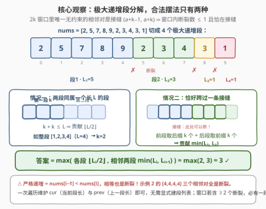
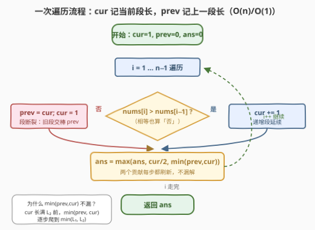
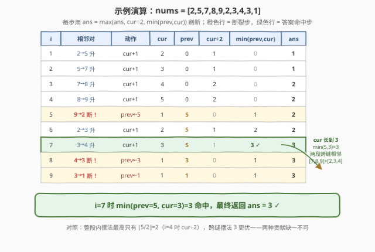

# 检测相邻递增子数组 II

- **题目名称**：检测相邻递增子数组 II
- **链接**：[3350. 检测相邻递增子数组 II](https://leetcode.cn/problems/adjacent-increasing-subarrays-detection-ii/)
- **难度**：中等
- **标签**：数组、二分查找、一次遍历
- **关联**：与 [3349. 检测相邻递增子数组 I](https://leetcode.cn/problems/adjacent-increasing-subarrays-detection-i/) 同源——I 是**判定版**（给 $n$ 组询问 $(a, k)$ 逐个回答 yes/no），II 把判定升级成**求最大可行 $k$**，规模也从 $n \le 100$ 放大到 $2 \times 10^5$，逼出「极大递增段分解」的 $O(n)$ 解法（见第 5 节）

## 1. 题目概述

给你一个由 $n$ 个整数组成的数组 `nums`，请找出 $k$ 的**最大值**，使得存在**两个相邻**且长度为 $k$ 的**严格递增**子数组。具体来说，需要检查是否存在从下标 $a$ 和 $b$（$a < b$）开始的两个子数组，并满足下述全部条件：

- 子数组 `nums[a..a+k-1]` 和 `nums[b..b+k-1]` 都是**严格递增**的；
- 两个子数组必须**相邻**，即 $b = a + k$。

返回 $k$ 的最大可能值。

**示例 1**：

```text
输入：nums = [2,5,7,8,9,2,3,4,3,1]
输出：3
解释：[7,8,9]（下标 2 起）与 [2,3,4]（下标 5 起）都严格递增，且 5 = 2 + 3 相邻。
```

**示例 2**：

```text
输入：nums = [1,2,3,4,4,4,4,5,6,7]
输出：2
解释：[1,2]（下标 0 起）与 [3,4]（下标 2 起）相邻且各自严格递增；k=3 不行。
```

**约束条件**：

- $2 \le nums.length \le 2 \times 10^5$
- $-10^9 \le nums[i] \le 10^9$

> 💡 **读题关键**：① $b = a + k$ 意味着两段**背靠背**拼成一个长 $2k$ 的窗口，窗口中间那条相邻对 $(a+k-1,\ a+k)$ 是**唯一不受递增约束**的位置——两段之间允许「断崖下跌」；② **严格递增**要求 $nums[i-1] < nums[i]$，**相等也算断裂**（示例 2 的 `[4,4,4,4]` 三个相邻对全是断裂，这正是它答案只有 2 的原因）；③ $n \ge 2$ 保证 $k = 1$ 恒成立（两个单元素子数组天然严格递增），答案至少为 1，不会返回 0。

---

## 2. 解题思路

### 2.1 暴力思路：枚举 a 与 k 逐对检查

最直接的做法：枚举左段起点 $a$ 和长度 $k$（$2k \le n$），逐个元素验证 `nums[a..a+k-1]` 与 `nums[a+k..a+2k-1]` 是否都严格递增，取可行的最大 $k$。单次验证 $O(k)$，总体 $O(n^2)$ 起步；$n = 2 \times 10^5$ 时约 $4 \times 10^{10}$ 次比较，必然超时。需要的是把「递增性检查」从逐元素降维成**逐段**。

### 2.2 核心观察：极大递增段分解 → 答案只有两种摆法



把数组沿「断裂处」（$nums[i] \ge nums[i+1]$ 的位置）切成若干**极大严格递增段**（run），第 $i$ 段长度记为 $L_i$。关键论证只有一句话：

> 长度 $2k$ 的窗口里有 $2k-1$ 条相邻对，其中唯一允许断裂的是接缝 $(a+k-1,\ a+k)$，**其余相邻对全部必须递增**。因此合法窗口内部的断裂数 $\le 1$，且若有断裂，它必须**恰好落在接缝上**。

于是答案只有两种来源：

**情况一（窗口不含断裂）：两段同属一个极大递增段。** 设该段长为 $L$，需要 $2k \le L$，贡献

$$k = \left\lfloor \frac{L}{2} \right\rfloor$$

（第一段取段内前 $k$ 个，第二段紧随其后——段内每对都递增，天然合法。）

**情况二（断裂恰在接缝）：两段跨过相邻两段的接缝。** 设接缝两侧段长为 $L_1, L_2$，第一段只能取 $L_1$ 的**后缀**（最多延伸到接缝前），第二段只能取 $L_2$ 的**前缀**，贡献

$$k = \min(L_1, L_2)$$

两种来源取全局最大即为答案。**为什么窗口含 $\ge 2$ 个断裂不用讨论？** 断裂只能出现在 $2k-1$ 条相邻对中的非接缝位置；若有 2 个断裂，由鸽笼原理它们分落两段内部（或同一段内），无论哪种，至少一段子数组内部含断裂、不严格递增，非法。

### 2.3 算法流程图



无需显式建段列表：一次遍历维护 `cur`（**当前**递增段已扫过的长度）与 `prev`（**上一段**的完整长度），每一步同步刷新两个贡献：

- `cur / 2` —— 情况一，当前段「自给自足」能对半切出的 $k$；
- `min(prev, cur)` —— 情况二，跨过 `prev` 与 `cur` 之间接缝的 $k$。

**`min(prev, cur)` 每步都算不会漏**：`prev` 固定时，`min(prev, cur)` 随 `cur` 单调不减，在 `cur` 长满 $L_2$ 时恰好取到 $\min(L_1, L_2)$；之后 `cur` 归 1（`prev` 接棒换新接缝），旧的接缝已按同样方式在它「活着」的每一步被检查过。

### 2.4 示例演算



**示例 1（`[2,5,7,8,9,2,3,4,3,1]`）**：段长依次为 $5, 3, 1, 1$。

- 情况一贡献：$\lfloor 5/2 \rfloor = 2$，$\lfloor 3/2 \rfloor = 1$；
- 情况二贡献：$\min(5,3) = 3$，$\min(3,1) = 1$，$\min(1,1) = 1$；
- 答案 $= \max(2, 1, 3, 1, 1) = 3$ ✓，对应 `[7,8,9]` + `[2,3,4]` 跨缝摆法。

**示例 2（`[1,2,3,4,4,4,4,5,6,7]`）**：段长依次为 $4, 1, 1, 4$。

- 情况一贡献：$\lfloor 4/2 \rfloor = 2$（首段与末段各一次）；
- 情况二贡献：$\min(4,1) = 1$（三次）；
- 答案 $= 2$ ✓——中间三个 `4` 把数组切得稀碎，跨缝摆法全部退化，只能靠单段对半切。

---

## 3. 参考代码

### C++

```cpp
class Solution {
  public:
    int maxIncreasingSubarrays(vector<int>& nums) {
        int n = nums.size();
        int ans = 0, cur = 1, prev = 0;          // cur：当前递增段长度；prev：上一段长度
        for (int i = 1; i < n; ++i) {
            if (nums[i] > nums[i - 1]) {
                ++cur;                           // 严格递增：段延续
            } else {
                prev = cur;                      // 断裂（含相等）：旧段交棒 prev
                cur = 1;
            }
            ans = max({ans, cur / 2, min(prev, cur)});
        }
        return ans;                              // n ≥ 2 保证 ans ≥ 1
    }
};
```

### Python

```python
class Solution:
    def maxIncreasingSubarrays(self, nums: List[int]) -> int:
        ans, prev, cur = 0, 0, 1
        for i in range(1, len(nums)):
            if nums[i] > nums[i - 1]:
                cur += 1                         # 段延续
            else:
                prev, cur = cur, 1               # 断裂：prev 接棒
            ans = max(ans, cur // 2, min(prev, cur))
        return ans
```

> 💡 **实现细节**：① 断裂条件是 `nums[i] > nums[i-1]` 的**否定**，即 $nums[i] \le nums[i-1]$——相等与下跌同样处理，千万别写成 `<` 方向弄反；② 初始 `prev = 0` 使首个接缝贡献 $\min(0, cur) = 0$，自动屏蔽「数组前面没有段」的假接缝；③ 两段贡献合并在一句 `max` 里每步刷新，省去「段结束后再回头看」的后处理。

---

## 4. 复杂度分析

| 维度 | 复杂度 | 说明 |
|------|--------|------|
| 时间 | $O(n)$ | 单趟扫描，每个下标常数次比较与 `max`/`min` |
| 空间 | $O(1)$ | 只用 `ans / cur / prev` 三个整型变量，不建段列表 |
| 数据规模 | $n \le 2 \times 10^5$ | $O(n^2)$ 暴力约 $4 \times 10^{10}$ 次操作超时，$O(n)$（或第 5 节 $O(n \log n)$）轻松通过 |

---

## 5. 扩展：二分答案 + O(n) 判定（官方 hint 的思路）

官方 hint 提示「Can we use binary search?」。**可行性关于 $k$ 单调**：若 $k$ 可行，取可行摆法 $(a, k)$，令第一段砍头、第二段去尾得到 $(a+1,\ k-1)$——两段仍是各自严格递增子数组的子段，且 $b' = a+1+(k-1) = a+k$ 相邻性保持，故 $k-1$ 也可行。单调性成立 ⇒ 可二分。

判定 $k$ 是否可行只需 $O(n)$：预处理 `up[i]` = 从 $i$ 开始的严格递增段长度（从右往左递推），则

$$check(k) \iff \exists a,\ up[a] \ge k \ \wedge\ up[a+k] \ge k$$

```python
class Solution:
    def maxIncreasingSubarrays(self, nums: List[int]) -> int:
        n = len(nums)
        up = [1] * n                              # up[i]：从 i 开始的严格递增段长度
        for i in range(n - 2, -1, -1):
            if nums[i] < nums[i + 1]:
                up[i] = up[i + 1] + 1

        def check(k: int) -> bool:                # O(n) 判定
            return any(up[a] >= k and up[a + k] >= k for a in range(n - 2 * k + 1))

        lo, hi = 1, n // 2                        # 两段共 2k ≤ n
        while lo < hi:
            mid = (lo + hi + 1) // 2
            if check(mid):
                lo = mid
            else:
                hi = mid - 1
        return lo
```

时间 $O(n \log n)$、空间 $O(n)$，比一次遍历慢一个量级，但「二分答案 + 线性判定」是面试中极具推广价值的范式（单调性证明往往是考点本身）。**回头看 3349（判定版）**：它每组询问 $(a, k)$ 就是本题的 `check` 一次调用，直接用 `up` 数组 $O(1)$ 回答每组询问——II 的分解观察完全覆盖 I。

---

## 6. 面试要点

1. **为什么两段只可能「同属一段」或「恰好跨一条缝」？**

   - $2k$ 窗口共 $2k-1$ 条相邻对，仅接缝 $(a+k-1,\ a+k)$ 免检；若窗口含 $\ge 2$ 个断裂，鸽笼知至少一段内部含断裂，非法。故断裂数 $\le 1$，且为 1 时必在接缝上。

2. **两种摆法的贡献公式是怎么来的？**

   - 同段：$2k \le L \Rightarrow \lfloor L/2 \rfloor$；跨缝：第一段是 $L_1$ 的后缀、第二段是 $L_2$ 的前缀 $\Rightarrow \min(L_1, L_2)$。注意第一段不能「伸进」下一段——接缝前必须断。

3. **一次遍历里 `min(prev, cur)` 每步刷新，凭什么不漏 $\min(L_1, L_2)$？**

   - `cur` 从 1 长到 $L_2$ 的过程中，`min(prev, cur)` 单调爬升，`cur` 到达 $L_2$ 那步恰好取到 $\min(L_1, L_2)$；无需等段结束再补算。

4. **二分答案的单调性如何证明？**

   - $k$ 可行 ⇒ 第一段砍头、第二段去尾得 $k-1$ 的合法摆法（子段保持严格递增，$b = a+k$ 不变），故 $k-1$ 可行；谓词单调，二分合法。

5. **「严格递增」里相等怎么处理？举一个反面例子。**

   - $nums[i] = nums[i-1]$ 视为断裂（条件写 $nums[i] > nums[i-1]$ 才延续）。示例 2 中 `[4,4,4,4]` 若误把相等当延续，会算出长为 7 的假段、得出错误答案 3（正确为 2）。

---

## 7. 同类练习题

- [3349. 检测相邻递增子数组 I](https://leetcode.cn/problems/adjacent-increasing-subarrays-detection-i/)：判定版姊妹题——每组询问就是本题 `check` 的单次调用，用 `up` 数组 $O(1)$ 作答
- [674. 最长连续递增序列](https://leetcode.cn/problems/longest-continuous-increasing-subsequence/)（[站内题解](../0601-0700/674_最长连续递增序列.md)）：单个极大递增段长度的裸模板，本题的「地基」
- [978. 最长湍流子数组](https://leetcode.cn/problems/longest-turbulent-subarray/)（[站内题解](../0901-1000/978_最长湍流子数组.md)）：升一段降一段的交替 run 扫描，同款 cur/prev 维护手感
- [2414. 最长的字母序连续子字符串的长度](https://leetcode.cn/problems/length-of-the-longest-alphabetical-continuous-substring/)（[站内题解](../2401-2500/2414_最长的字母序连续子字符串的长度.md)）：run 分解思想在字符串上的翻版
- [875. 爱吃香蕉的珂珂](https://leetcode.cn/problems/koko-eating-bananas/)（[站内题解](../0801-0900/875_爱吃香蕉的珂珂.md)）：二分答案 + $O(n)$ 验证的经典范式，与第 5 节同套路
