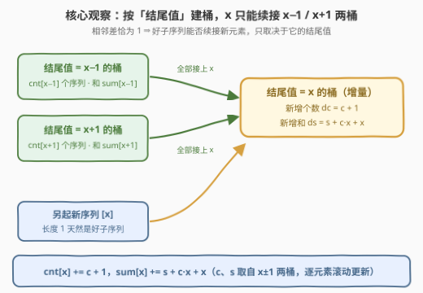
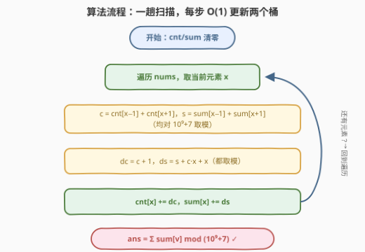
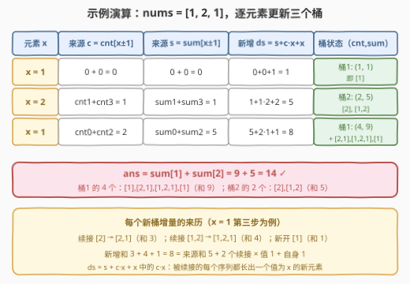

# LeetCode 好子序列的元素之和 题解

- **关联**：与 [1218. 最长定差子序列](https://leetcode.cn/problems/longest-arithmetic-subsequence-of-given-difference/)（[站内题解](../1201-1300/1218_最长定差子序列.md)）同属「**值域当状态、按结尾值建桶**」的子序列 DP——1218 只挂 $v-d$ 一层桶，本题公差是 $\pm 1$，得同时挂 $x-1$ 与 $x+1$ **两层桶**，并且桶里从单个 dp 值升级成「(个数, 元素和)」双指标

## 1. 题目概述

- **标题 / 题号**：好子序列的元素之和（#3351，hard）
- **链接**：https://leetcode.cn/problems/sum-of-good-subsequences/
- **难度**：困难
- **标签**：数组、哈希表、动态规划

**题意**：给你一个整数数组 $nums$。**好子序列**的定义是：子序列中任意**两个连续元素**的绝对差**恰好**为 1。**子序列**指可以通过删除数组的部分元素（或不删除）得到、且不改变剩余元素顺序的数组。返回 $nums$ 中所有**可能存在的**好子序列的**元素之和**，结果对 $10^9 + 7$ 取余。注意，长度为 1 的子序列默认为好子序列。

**示例 1**：

```text
输入：nums = [1,2,1]
输出：14
解释：好子序列包括 [1], [2], [1], [1,2], [2,1], [1,2,1]，元素之和为 14。
```

**示例 2**：

```text
输入：nums = [3,4,5]
输出：40
解释：好子序列包括 [3], [4], [5], [3,4], [4,5], [3,4,5]，元素之和为 40。
```

**约束**：

- $1 \le nums.length \le 10^5$
- $0 \le nums[i] \le 10^5$

> 💡 **读题关键**：① 好子序列的数量可以是**指数级**的（如 $[1,2,1,2,\dots]$ 里任选子集大多合法），题目要的不是枚举而是**聚合**——所有好子序列的元素总和；② 「任意两个连续元素的绝对差恰好为 1」意味着 $|差|$ 只能是 1，既不能是 0（相同值不能相邻）也不能是 2；③ $nums[i] \le 10^5$ 这个值域上界是强提示：**按值建桶**；④ 相同元素视为不同元素（示例 1 中两个 `[1]` 分别计入），所以是「按下标选子集」的计数语义。

## 2. 解题思路

### 2.1 暴力思路：枚举全部子集

枚举 $2^n$ 个下标子集、逐个验证相邻差为 1 再求和，$n = 10^5$ 时是天文学数字。**求和聚合题的正路是把「所有方案的总贡献」按状态分桶累加**，而不是枚举方案。这需要找到一组互斥完备的状态，使得「一个子序列未来还能不能被续接」只取决于状态本身。

逐条审视：一个正在生长的好子序列，未来再来一个新元素 $x$ 时能否接上，只取决于**它最后一个元素的值**——结尾值是 $x-1$ 或 $x+1$ 就能接，否则接不上。至于序列更早的历史、长度、各元素下标，全部是**冗余信息**。

### 2.2 核心观察：按「结尾值」建桶，(个数, 元素和) 双指标 DP

把所有「已扫过的元素能构成的好子序列」按**结尾值 $v$** 分桶，每个桶维护两个量：

| 桶内指标 | 含义 |
|----------|------|
| $cnt[v]$ | 结尾值恰好为 $v$ 的好子序列**个数** |
| $sum[v]$ | 这些子序列的**元素总和** |

扫描到新元素 $x$ 时，以 $x$ 结尾的**新增**好子序列有三类来源：

1. 结尾值为 $x-1$ 的每个序列，尾部接上 $x$；
2. 结尾值为 $x+1$ 的每个序列，尾部接上 $x$；
3. 单独新开一个长度为 1 的序列 $[x]$。



记 $c = cnt[x-1] + cnt[x+1]$，$s = sum[x-1] + sum[x+1]$，则新增个数 $dc = c + 1$；新增的元素和里，**每个被续接的序列都长出一个值为 $x$ 的新元素**，共 $c$ 个，加上新开的 $[x]$ 自身：

$$ds = s + c \cdot x + x$$

> 💡 **$c \cdot x$ 这一项是本题最容易漏的**：$s$ 只是被续接序列的**旧**元素和，续接动作本身给每个序列添了一个新元素 $x$，这批新元素的贡献是 $c \cdot x$；再加新开单元素序列的 $x$。用示例 1 第三步自查：来源和 $5$（$[2]$ 与 $[1,2]$），续接 2 个 × 值 1，加新开 1 → $5 + 2 + 1 = 8$，恰是 $[2,1] + [1,2,1] + [1]$ 的和 ✓。

更新即为 $cnt[x] \mathrel{+}= dc$、$sum[x] \mathrel{+}= ds$（注意是**累加**到已有桶上——之前以 $x$ 结尾的序列还在）。最终答案：

$$\text{ans} = \sum_{v} sum[v] \bmod (10^9 + 7)$$

> 💡 **无后效性自查**：能否接上新元素只看结尾值，同结尾值的序列在「计数 + 求和」的聚合意义下完全可合并——这正是把 $O(n)$ 个下标状态压缩成 $O(U)$ 个值域状态的合法性依据。这与 1218 的 `dp[v] = dp[v−d] + 1` 是同一个压缩：**值域维度替代下标维度**，区别只在 1218 桶里放一个最值、本题桶里放 (个数, 和) 一对儿。值域 $0 \sim 10^5$ 不大，直接开数组即可（Python 用哈希表更省心）。

### 2.3 算法流程



1. 初始化 `cnt`、`sum` 两个桶表为全 0；
2. 顺序扫描 $nums$ 的每个元素 $x$：读出 $c$、$s$，算出增量 $dc = c+1$、$ds = s + c\cdot x + x$，全部取模后累进 $cnt[x]$、$sum[x]$；
3. 扫描结束后答案即 $\sum sum[v]$，再取一次模。

### 2.4 示例演算

拿示例 1（$nums = [1,2,1]$）逐步走一遍三个桶的变化：



- **x = 1**：来源桶全空，$c = 0$、$s = 0$，桶 1 得到 $(1, 1)$，即 $[1]$；
- **x = 2**：$c = cnt[1] + cnt[3] = 1$、$s = sum[1] + sum[3] = 1$，桶 2 得到 $ds = 1 + 1\cdot 2 + 2 = 5$，即 $[2]$ 与 $[1,2]$；
- **x = 1**（第二个）：$c = cnt[0] + cnt[2] = 2$、$s = sum[0] + sum[2] = 5$，桶 1 **累加** $ds = 5 + 2\cdot 1 + 1 = 8$，新增 $[2,1]$、$[1,2,1]$、$[1]$；
- **答案**：$sum[1] + sum[2] = 9 + 5 = 14$ ✓。

> 💡 **层内自查**：以 $v$ 结尾的子序列个数 $cnt[v]$ 应当等于「以值 $v$ 结尾、按下标选出的合法子序列总数」。示例中桶 1 最终 4 个（$[1]_1$、$[2,1]$、$[1,2,1]$、$[1]_3$）与手枚举一致；每个桶的 $sum$ 除以 $cnt$ 不必是整数，但拿小用例逐桶核对 $cnt$ 是最快的调试报警器。

## 3. 参考代码

### C++

```cpp
class Solution {
  public:
    int sumOfGoodSubsequences(vector<int>& nums) {
        constexpr long long MOD = 1'000'000'007;
        constexpr int MX = 100'002;               // 值域 0..1e5，整体 +1 偏移防 x−1 越界
        vector<long long> cnt(MX + 2), sum(MX + 2);
        for (int x : nums) {
            int v = x + 1;                        // 值 x 存在下标 x+1
            long long c = (cnt[v - 1] + cnt[v + 1]) % MOD;
            long long s = (sum[v - 1] + sum[v + 1]) % MOD;
            long long ds = (s + (c * x + x)) % MOD;   // 续接贡献 c·x + 新开 x
            cnt[v] = (cnt[v] + c + 1) % MOD;
            sum[v] = (sum[v] + ds) % MOD;
        }
        long long ans = 0;
        for (long long v : sum) ans = (ans + v) % MOD;
        return (int)ans;
    }
};
```

### Python

```python
class Solution:
    def sumOfGoodSubsequences(self, nums: List[int]) -> int:
        MOD = 1_000_000_007
        cnt = defaultdict(int)    # cnt[v]  : 结尾值为 v 的好子序列个数
        tot = defaultdict(int)    # tot[v]  : 这些子序列的元素和
        for x in nums:
            c = cnt[x - 1] + cnt[x + 1]
            s = tot[x - 1] + tot[x + 1]
            ds = (s + c * x + x) % MOD          # 旧和 + 续接 c·x + 新开 x
            cnt[x] = (cnt[x] + c + 1) % MOD
            tot[x] = (tot[x] + ds) % MOD
        return sum(tot.values()) % MOD
```

> 💡 **实现细节**：① **偏移防负下标**：$x = 0$ 时 $cnt[x-1]$ 会读到 $-1$，C++ 版把值 $x$ 存到下标 $x+1$ 一劳永逸；Python 版 defaultdict 对不存在的键天然返回 0，负键也无妨；② **先读后写**：$c$、$s$ 必须在更新 $cnt[x]$、$sum[x]$ **之前**取出——否则来源桶恰好是 $x$ 自身时（本步更新影响到 $cnt[x\pm1]$ 不可能，但保持「快照再更新」的习惯总没错）；③ 只有加法没有减法，取模无需考虑负数；乘法 $c \cdot x$ 最大约 $10^9 \times 10^5$，C++ 用 `long long` 承接，Python 天然大整数。

## 4. 复杂度分析

| 维度 | 复杂度 | 说明 |
|------|--------|------|
| 时间复杂度 | $O(n + U)$ | 每个元素 $O(1)$ 读两个桶、写一个桶；$U = 10^5$ 为值域大小（求和遍历） |
| 空间复杂度 | $O(U)$ | `cnt`、`sum` 两个值域数组（哈希表版为 $O(\min(n, U))$） |
| 暴力对照 | $O(2^n \cdot n)$ 时间 | 枚举子集逐一验证；$n = 10^5$ 完全不可行 |

实测：两组官方样例分别得 $14 / 40$ ✓；与「枚举全部 $2^n$ 下标子集、验证相邻差为 1 后求和」的暴力对拍随机数据（$n \le 10$、值域 $\le 8$）400 组全部一致；$n = 10^5$ 的随机用例 C++ 与 Python 均毫秒级通过。

## 5. 扩展：两个变体

**变体一：改问好子序列的个数**。把桶退化成单指标——只维护 $cnt[v]$，转移照旧 $cnt[x] \mathrel{+}= cnt[x-1] + cnt[x+1] + 1$，答案 $\sum cnt[v]$。示例 1 会得 $6$（与题面枚举的 6 个子序列一致）。这提醒我们：**「计数」与「求和」共享同一套分桶，只是桶里背的指标不同**；反过来，「求最长」时桶里放最值（1218），「求方案存在性」时桶里放布尔——分桶结构不变，变的是聚合量。

**变体二：相邻差恰为 $d$ 的推广 / 值域无界**。若把「绝对差为 1」改成「差恰为 $d$」（有向），来源桶就从 $x \pm 1$ 变成 $x - d$ 一个（或无向 $\pm d$ 两个），其余一行不改。若值域放大到 $10^9$，数组换哈希表，状态数变为 $O(\min(n, U))$——这正是 Python 参考代码的写法，C++ 换 `unordered_map<long long, ...>` 即可，代价是常数变大。

## 6. 面试要点

1. **为什么状态只需按「结尾值」分桶，不用记下标或长度？**

   - 能否续接新元素 $x$ 只取决于序列**结尾值是否为 $x \pm 1$**；在「对全体好子序列求和」的聚合下，结尾值相同的序列完全可合并成 (个数, 和) 两个标量。这是无后效性的充分统计量论证：未来只依赖状态、不依赖历史。

2. **$ds = s + c \cdot x + x$ 三项分别是什么？**

   - $s$：被续接序列的**旧**元素和（来自 $sum[x-1] + sum[x+1]$）；$c \cdot x$：$c$ 个被续接的序列每个长出一个新元素 $x$；末尾 $x$：新开的单元素序列 $[x]$。漏掉 $c \cdot x$ 是最常见错误——只把旧和搬过来，忘了续接动作本身在「制造」新元素。

3. **为什么不用 $dp[i][j]$ 二维（下标 × 结尾值）？**

   - 同值合并：以下标 $i$ 为维度的状态里，结尾值相同的行对未来的作用完全一样，合并后 $O(n \cdot U)$ 降为 $O(U)$，再被 $n$ 次单点更新替代，总时间 $O(n + U)$。这与 1218「哈希表当 dp 数组」、740「值域建桶」是同一个降维家族。

4. **取模与溢出要注意什么？**

   - $cnt$、$sum$ 增长极快（指数方案数），每步更新都要对 $10^9 + 7$ 取模；$c \cdot x$ 约 $10^{14}$，C++ 必须用 64 位整数承接后再取模。全程序只有加法和乘法、没有减法，不存在负数取模的坑。

5. **与 446 等差数列划分 II 的状态设计有何异同？**

   - 446 的公差 $d$ 是**任意**的，必须 $dp[i][d]$（结尾下标 × 公差的哈希嵌哈希）；本题公差被钉死为 $\pm 1$，公差维度退化掉，只剩结尾值一层，值域数组即可。看到「相邻约束」先问约束里哪些量是**固定常数**——常数可以直接折进转移，变量才需要进状态。

## 同类练习题

| # | 题目 | 与本题的关联 |
|---|------|-------------|
| 1218 | [最长定差子序列](https://leetcode.cn/problems/longest-arithmetic-subsequence-of-given-difference/)（[站内题解](../1201-1300/1218_最长定差子序列.md)） | 同款「按结尾值建桶、哈希当 dp 数组」的最简形态，桶里只放一个最值，可作本题热身 |
| 1027 | [最长等差数列](https://leetcode.cn/problems/longest-arithmetic-subsequence/)（[站内题解](../1001-1100/1027_最长等差数列.md)） | 公差从常数升级为变量，`dp[i][d]` 状态里多出公差一维，看约束「变量化」如何推高状态数 |
| 446 | [等差数列划分 II - 子序列](https://leetcode.cn/problems/arithmetic-slices-ii-subsequence/)（[站内题解](../0401-0500/446_等差数列划分II子序列.md)） | 从「求最值/求和」换成「计数长度 ≥ 3」，同一分桶骨架配上不同的聚合指标 |
| 740 | [删除并获得点数](https://leetcode.cn/problems/delete-and-earn-points/)（[站内题解](../0701-0800/740_删除并获得点数.md)） | 值域建桶思想的另一面——把「相邻下标互斥」翻译成「相邻值域互斥」后做线性 dp |
