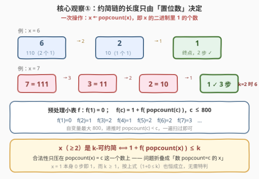
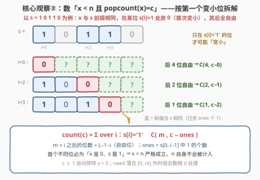
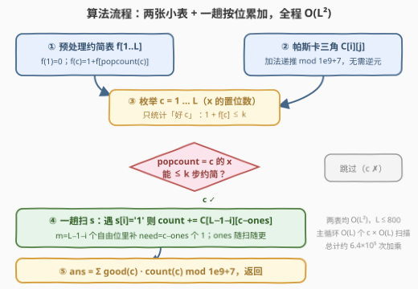
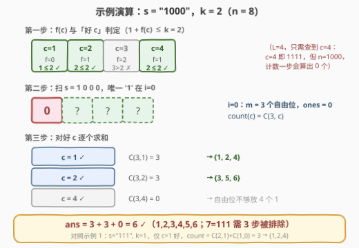

# 统计小于N的K可约简整数

- **题目名称**：统计小于 N 的 K 可约简整数
- **链接**：[3352. 统计小于 N 的 K 可约简整数](https://leetcode.cn/problems/count-k-reducible-numbers-less-than-n/)
- **难度**：困难
- **标签**：数学、字符串、动态规划、组合数学、数位 DP

## 1. 题目概述

给你一个**二进制**字符串 `s`，它表示数字 `n` 的二进制形式；同时给你一个整数 `k`。

如果整数 `x` 可以通过**最多 `k` 次**下述操作约简到 `1`，则称 `x` 为 **k-可约简** 整数：

- 将 `x` 替换为其二进制表示中的**置位数**（即值为 `1` 的位，`popcount(x)`）。

例如 `6 = "110"`：一次操作后变为 `2`（两个置位），再操作一次变为 `1`——共 2 次。

返回**小于 `n` 的正整数**中有多少个是 k-可约简整数。答案对 $10^9 + 7$ 取余。

**示例 1**：

```text
输入：s = "111", k = 1
输出：3
解释：n = 7。小于 7 的 1-可约简整数有 1、2 和 4。
```

**示例 2**：

```text
输入：s = "1000", k = 2
输出：6
解释：n = 8。小于 8 的 2-可约简整数有 1、2、3、4、5 和 6。
```

**示例 3**：

```text
输入：s = "1", k = 3
输出：0
解释：小于 n = 1 的正整数不存在。
```

**约束条件**：

- $1 \le \text{s.length} \le 800$
- `s` 中没有前导零
- `s` 仅由字符 `'0'` 和 `'1'` 组成
- $1 \le k \le 5$

> 💡 **读题关键**：① $n$ 以**二进制串**给出且长达 800 位（约 $10^{241}$），**数值不可求、更不可枚举**，一切计数必须落在「位」上；② 操作链 $x \to \text{popcount}(x) \to \cdots \to 1$ 的第二步起数值骤缩——$x < 2^{800}$ 的置位数至多 800，而 $\le 800$ 的数的置位数至多 10，**链极短**；③ $k \le 5$ 与「链极短」相呼应，判定表只需开到 800；④ 「小于 $n$ 的正整数」= 严格小于，$n$ 自身不计入、$x = 0$ 不计入；⑤ 一个数可不可约简**只由它的置位数决定**——这是把「数整数的性质」折叠成「数置位数」的钥匙。

---

## 2. 解题思路

### 2.1 暴力思路：从 1 枚举到 n−1 完全不可行

最直接的做法是把 $1 \sim n-1$ 每个数模拟一遍约简链、数出合法者。但 $n$ 可达 $2^{800}$，枚举量天文数字；即便按置位数分桶，也得先知道每个桶里有多少个小于 $n$ 的数。结论：**必须放弃「逐个数」，改为「按二进制位组合计数」**。小数值范围（$n \le 2^{20}$）的暴力程序仍有价值——充当对拍器，验证组合计数公式正确（本文代码已对拍 2800+ 组随机用例，全部一致）。

### 2.2 核心观察①：可约简性只由 popcount 决定

定义 $f(v)$ = 把 $v$ 约简到 $1$ 所需的操作数：

$$f(1) = 0, \qquad f(v) = 1 + f\big(\text{popcount}(v)\big) \ (v \ge 2)$$

那么对任意 $x \ge 2$，$x$ 的约简链是 $x \to \text{popcount}(x) \to \cdots$，即

$$x \text{ 是 k-可约简} \iff 1 + f\big(\text{popcount}(x)\big) \le k$$

**判定只压在 $c = \text{popcount}(x)$ 这一个数上**！而 $x < 2^{800} \Rightarrow c \le 800$，且递推 $f(c) = 1 + f(\text{popcount}(c))$ 中 $\text{popcount}(c) < c$，一张长度 801 的小表一遍递推即得。

> ⚠️ **$x = 1$ 要特判吗？** 不用。$x=1$ 本身 0 步即为 1，恒可约简；而按公式 $1 + f(\text{popcount}(1)) = 1 + f(1) = 1 \le k$（题设 $k \ge 1$）同样恒成立——公式天然把 $x=1$ 归入 $c=1$ 桶且判定为真，两条路径结论一致。

顺带一个惊人的小结论：$c \le 800$ 时 $f(c) \le 4$（要到 $f=4$ 需置位数 $\ge 7$ 的 $c$，最小 $c=127$；而 $f=5$ 需要 $c \ge 2^{127}-1$，远超 800），所以 **$k = 5$ 时任何正整数都可约简**，答案恒为 $(n-1) \bmod (10^9+7)$。



### 2.3 核心观察②：数「x < n 且 popcount(x) = c」——按第一个变小位拆组合数

剩下的任务是：对每个「好 $c$」（$1 + f(c) \le k$），数出 $1 \le x < n$ 中恰有 $c$ 个置位者的个数 $\text{count}(c)$。这是二进制数位计数的经典套路（母题见 [233. 数字 1 的个数](https://leetcode.cn/problems/number-of-digit-one/)）：

$x < n$（且同为 800 位以内、无前导零顾虑——二进制下首位必为 1）⟺ $x$ 与 $s$ 存在**第一个不同位** $i$，此前缀完全相同，且该位必是「$x_i = 0$、$s_i = 1$」（$x$ 更小）。于是：

- 前缀 $s[0..i-1]$ 照抄，其中已有 $\text{ones}$ 个 1；
- 第 $i$ 位放 $0$（该位只在 $s_i = 1$ 处可行）；
- 后面 $m = L - 1 - i$ 位**完全自由**，要从中再选 $\text{need} = c - \text{ones}$ 个 1。

每个可行 $x$ 的「第一个变小位」唯一，**不重不漏**：

$$\text{count}(c) \;=\; \sum_{\substack{i :\, s_i = \text{'1'}}} \binom{L-1-i}{\,c - \text{ones}(i)\,} \qquad (\text{越界的 need 按 } 0 \text{ 处理})$$

$c \ge 1$ 自动排除 $x = 0$；「严格小于」由拆解方式天然保证（$n$ 自身永远进不了任何一个分支）。组合数用**帕斯卡三角** $O(L^2)$ 递推，全程只有模加法，**不需要逆元**。



### 2.4 算法流程

三段式流水线，$L = |s| \le 800$：

1. **递推小表 $f$**：$f(1) = 0$，$f(c) = 1 + f[\text{popcount}(c)]$，$c \le L$；
2. **帕斯卡三角** $C[i][j] \bmod (10^9+7)$，$i, j \le L$；
3. **枚举 $c$ 求和**：好 $c$（$1 + f(c) \le k$）才处理；一趟扫 $s$，遇 `'1'` 位累加 $C[m][\text{need}]$，答案为 $\sum_c \text{count}(c) \bmod (10^9+7)$。



### 2.5 示例演算

以 `s = "1000", k = 2`（$n = 8$）走全程：

- **第一步（好 c）**：$f(1)=0, f(2)=1, f(3)=2, f(4)=1$；判定 $1+f(c) \le 2$ ⟹ $c = 1, 2, 4$ 好，$c = 3$ 坏；
- **第二步（扫描）**：$s$ 唯一的 `'1'` 在 $i = 0$，$m = 3$、$\text{ones} = 0$，$\text{count}(c) = \binom{3}{c}$；
- **第三步（求和）**：$c=1$：$\binom{3}{1} = 3$（即 $1, 2, 4$）；$c=2$：$\binom{3}{2} = 3$（即 $3, 5, 6$）；$c=4$：$\binom{3}{4} = 0$（自由位不够）；
- **答案** $= 3 + 3 + 0 = 6$ ✓。$7 = 111$ 需 3 步被正确排除。



再用 `s = "111", k = 1` 回验：仅 $c = 1$ 好；$i=0$：$\binom{2}{1} = 2$，$i=1$：$\text{ones}=1$，$\binom{1}{0} = 1$，$i=2$：need 为负跳过 ⟹ $2 + 1 = 3$ ✓（即 $1, 2, 4$）。`s = "1"`：唯一 `'1'` 在 $i=0$，$m = 0$，一切 $c \ge 1$ 的 need 均 $> 0$，答案 0 ✓。

---

## 3. 参考代码

### C++

```cpp
class Solution {
  public:
    int countKReducibleNumbers(string s, int k) {
        constexpr long long MOD = 1'000'000'007LL;
        int L = s.size();

        // 表一：f[c] = 把 c 约简到 1 的操作数（popcount(c) < c，从小到大一遍递推）
        vector<int> f(L + 1, 0);
        for (int c = 2; c <= L; ++c)
            f[c] = 1 + f[__builtin_popcount(c)];

        // 表二：帕斯卡三角，只需模加法
        vector<vector<long long>> C(L + 1, vector<long long>(L + 1, 0));
        for (int i = 0; i <= L; ++i)
            for (int j = 0; j <= i; ++j)
                C[i][j] = j ? (C[i - 1][j - 1] + C[i - 1][j]) % MOD : 1;

        long long ans = 0;
        for (int c = 1; c <= L; ++c) {           // 枚举 popcount(x) = c
            if (1 + f[c] > k) continue;          // 坏 c：该桶整体不合法，跳过
            long long cnt = 0;                   // [1, n-1] 中 popcount=c 的个数
            int ones = 0;
            for (int i = 0; i < L; ++i) {
                if (s[i] != '1') continue;       // 首个变小位只能出现在 s 的 1 上
                int m = L - 1 - i;               // 该位放 0，后面 m 位自由
                int need = c - ones;             // 还需补的 1 个数
                if (0 <= need && need <= m)
                    cnt = (cnt + C[m][need]) % MOD;
                ones++;                          // 前缀里又锁定一个 1
            }
            ans = (ans + cnt) % MOD;
        }
        return ans;
    }
};
```

### Python

```python
class Solution:
    def countKReducibleNumbers(self, s: str, k: int) -> int:
        MOD = 10**9 + 7
        L = len(s)

        # 表一：f[c] = 把 c 约简到 1 的操作数
        f = [0] * (L + 1)
        for c in range(2, L + 1):
            f[c] = 1 + f[c.bit_count()]

        # 表二：帕斯卡三角
        C = [[0] * (L + 1) for _ in range(L + 1)]
        for i in range(L + 1):
            C[i][0] = 1
            for j in range(1, i + 1):
                C[i][j] = (C[i - 1][j - 1] + C[i - 1][j]) % MOD

        ans = 0
        for c in range(1, L + 1):                # 枚举 popcount(x) = c
            if 1 + f[c] > k:                     # 坏 c：整桶跳过
                continue
            cnt = 0                              # [1, n-1] 中 popcount=c 的个数
            ones = 0
            for i, ch in enumerate(s):
                if ch != '1':                    # 首个变小位只能在 s 的 1 上
                    continue
                m = L - 1 - i                    # 后面 m 位自由
                need = c - ones
                if 0 <= need <= m:
                    cnt = (cnt + C[m][need]) % MOD
                ones += 1
            ans = (ans + cnt) % MOD
        return ans
```

> 💡 **实现细节**：① `f` 的自变量只需到 $L$——$x < 2^L$ 的置位数至多 $L$，800 一到即封顶；② `need < 0`（前缀 1 已超额）与 `need > m`（自由位不够）都要跳过，二者合一为区间判断；③ `ones` 只在遇到 `'1'` 时自增，因为它是「前缀中 1 的个数」而非下标；④ 组合数表理论上可压成一维滚动，但 $801 \times 801$ 个 `int` 约占 2.6 MB，二维更直白；⑤ 二进制串首位必为 `1`，**无前导零问题**，这是对比十进制数位 DP（如 [902](https://leetcode.cn/problems/numbers-atmost-n-given-digit-set/)）最省心的地方。

---

## 4. 复杂度分析

| 维度 | 复杂度 | 说明 |
|------|--------|------|
| 时间复杂度 | $O(L^2)$ | 帕斯卡三角 $O(L^2)$；主循环 $L$ 个 $c \times O(L)$ 扫描 = $O(L^2)$；$L = 800$ 时约 $6.4 \times 10^5$ 次模加法，毫秒级 |
| 空间复杂度 | $O(L^2)$ | 帕斯卡三角 $801 \times 801$（约 65 万项）是唯一大头；$f$ 表 $O(L)$ |
| 暴力对照 | $O(n \cdot \log\log n)$ | $n$ 高达 $2^{800} \approx 10^{241}$，任何逐数枚举都不可行 |

实测：三组官方样例 $3 / 6 / 0$ ✓；与逐数模拟暴力在 $n \le 2^{14}$、$k \in [1,5]$ 的 2800+ 组随机用例下对拍全对；800 位全 `1` 串（$n = 2^{800} - 1$）瞬时出解。

---

## 5. 扩展：数位 DP 的通用视角与「k = 5」退化

**通用视角：** 本题的「枚举 $c$ + 组合数」其实是数位 DP 的一种**展开形态**。标准写法是 $\text{dp}(i, c, \text{tight})$：从高位到低位填 $x$，记已填 1 的个数、是否仍与 $s$ 贴合，转移每位两种选择，最后对好 $c$ 求和。当**约束只有 popcount 一个维度**时，把 tight 路径逐位展开就得到本文的组合数公式——每个 `'1'` 位对应「在此处脱离贴合」的完整子树，其贡献是单个 $\binom{m}{\text{need}}$。若约束复杂化（如「不允许连续 1」，见 [600](https://leetcode.cn/problems/non-negative-integers-without-consecutive-ones/)），子树贡献不再是裸组合数，就得回到逐位 DP。

**k = 5 的退化：** 由 $f(c) \le 4\ (c \le 800)$ 知 $k = 5$ 时所有正整数均可约简，答案退化为 $(n - 1) \bmod (10^9 + 7)$——$n$ 本身可能 $\equiv 0$，需按 $O(L)$ 大数取模算 $n \bmod p$ 再减 1 补模。这提示我们拿到题先**估判定表的值域与深度上界**，常常直接读出平凡档位。

**变体：** 若把「$< n$」改成「$\le n$」，在答案上补判 $n$ 自身（$\text{popcount}(n)$ 是否好 $c$）即可；若改成「$[l, r]$ 区间计数」，用 $count(r) - count(l-1)$ 的前缀相减，二进制下 $l - 1$ 的串同样好求。

---

## 6. 面试要点

1. **为什么可约简性只由 popcount 决定？**

   - 约简链 $x \to \text{popcount}(x) \to \cdots$ 的**第二步起**完全由首个置位数 $c$ 接管；$x \ge 2$ 的判定式是 $1 + f(\text{popcount}(x)) \le k$。$x = 1$ 虽是 0 步，但 $k \ge 1$ 时按公式也恒真，无需特判。于是 800 位巨数的合法性折叠成 $[1, 800]$ 内的一张小布尔表。

2. **怎么数「严格小于 n 且 popcount = c」？不重不漏的依据？**

   - 按**第一个不同位**拆解：前缀照抄、该位 $1 \to 0$（只在 $s_i = 1$ 处可能变小）、后缀 $m$ 位自由选 $\binom{m}{c - \text{ones}}$。每个 $x < n$ 的首个不同位唯一，且该位必为「$x$ 是 0、$s$ 是 1」，故互斥且完备；$n$ 自身与 $x=0$ 天然落在拆解之外。

3. **为什么用帕斯卡三角而不用阶乘 + 逆元？**

   - $L \le 800$，三角表只有 65 万项、纯模加法；阶乘逆元在 $q \binom{m}{\text{need}}$ 类变形（多重集、带权重）时才必要。**能用加法递推就别动乘法逆元**，代码更短、常数更小。

4. **`ones` 的语义是什么？为什么遇 '1' 才自增？**

   - `ones` 是「已照抄前缀中 1 的个数」，即脱离贴合之前锁定的置位数；它只在扫过 $s_i = 1$ 时增加。`need = c - ones` 表示自由位还要补几个 1，越界（负或超 $m$）贡献为 0。

5. **若 k 给到 5 以上、或 s 长到 10^5，会发生什么？**

   - $k \ge 5$：$c \le 800$ 时 $f(c) \le 4$，全体正整数都可约简，答案退化为 $(n-1) \bmod p$。$L = 10^5$：帕斯卡三角 $O(L^2)$ 内存爆掉，改用**线性预处理阶乘 + 费马小定理逆元**求 $\binom{m}{\text{need}}$，整体 $O(L \log p)$；本题 $L \le 800$ 正是出题人留的「加法就够」甜区。

---

## 7. 同类练习题

- [233. 数字 1 的个数](https://leetcode.cn/problems/number-of-digit-one/)（[站内题解](../0201-0300/233_数字1的个数.md)）：「按位贡献 + 组合数」数小于 n 的数位形态，本题核心观察②的十进制母题
- [600. 不含连续 1 的非负整数](https://leetcode.cn/problems/non-negative-integers-without-consecutive-ones/)：二进制串上逐位数位 DP 的标准形——当约束不再能折叠成裸组合数时回到 tight/less 两态 DP
- [902. 最大为 N 的数字组合](https://leetcode.cn/problems/numbers-atmost-n-given-digit-set/)（[站内题解](../0901-1000/902_最大为N的数字组合.md)）：受限候选集下「小于 N」的组合计数，对照本题「候选集 = 全部二进制位」
- [1012. 至少有 1 位重复的数字](https://leetcode.cn/problems/numbers-with-repeated-digits/)（[站内题解](../1001-1100/1012_至少有1位重复的数字.md)）：正难则反数小于 n 的特殊数，含前导零处理，可对比本题二进制无前导零的简化
- [3333. 找到初始输入字符串 II](https://leetcode.cn/problems/find-the-original-typed-string-ii/)（[站内题解](../3301-3400/3333_找到初始输入字符串II.md)）：近期邻居，同为「组合计数 + 容斥/前缀和」压维思想在长约束下的运用
