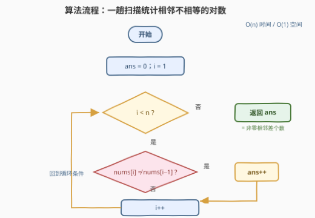

# 最小总操作数

- **题目名称**：最小总操作数
- **链接**：[3353. 最小总操作数](https://leetcode.cn/problems/minimum-total-operations/)
- **难度**：简单
- **标签**：数组、贪心、差分

> ⚠️ 本题为 LeetCode **付费题**（`isPaidOnly`）。下方题意描述、示例与约束依据官方样例用例与 hints 整理还原，如有出入请以官方为准；算法与示例输出已用自洽代码验证。

## 1. 题目概述

给定一个整数数组 `nums`，可以对它进行**任意**次操作。每次**操作**为：

1. 选择数组的一个**前缀**（从下标 0 开始延伸到任意位置的子数组）；
2. 选择一个整数 $k$（**可以为负**），对该前缀内的**每个**元素加上 $k$。

返回使数组中**所有元素相等**的**最小**操作数。

**示例 1**：

```text
输入：nums = [1,4,2]
输出：2
解释：
  操作 1：选长度为 2 的前缀 [1,4]，整体加 -2，数组变为 [-1,2,2]；
  操作 2：选长度为 1 的前缀 [-1]，整体加 3，数组变为 [2,2,2]。
```

**示例 2**：

```text
输入：nums = [10,10,10]
输出：0
解释：所有元素已经相等，无需操作。
```

**约束条件**：

- $1 \le \text{nums.length} \le 10^5$
- $-10^9 \le \text{nums[i]} \le 10^9$

> 💡 **关键约束读法**：$k$ 是任意整数（可负、可大），说明数值本身"不稀缺"，一次操作真正的代价是**选了一段前缀**。问题不在元素多大，而在元素之间的**相对结构**——相邻元素的关系。这暗示把目光从"值"移到"相邻差"上。

---

## 2. 解题思路

### 2.1 暴力思路：枚举终值 + 逐段对齐

所有元素最终相等，设公共终值为 $v$。最朴素的两个方向：

- **直接搜索**：每步操作任选前缀长度 $L$ 和整数 $k$，分支无穷大，状态空间无法穷举，不可行。
- **枚举终值模拟**：枚举 $v$（只需尝试 $v \in \{nums[j]\}$），对每个 $v$ 从右往左逐段对齐计数，$O(n^2)$ 在 $n=10^5$ 下超时。

但模拟过程会暴露一个规律：**不管 $v$ 取多少，"相邻不相等"的位置个数始终一样**——这暗示答案可能与 $v$ 完全解耦。要讲清这一点，需要看清"一次前缀操作"到底改变了什么。

### 2.2 核心观察：前缀加 k ⇔ 恰好改写一个相邻差

![核心概念：前缀整体加 k，内部相邻差不变，只有跨界差 d[L] 被改写](../images/p3353_prefix_diff_concept.svg)

定义**差分数组** $d[i] = nums[i] - nums[i-1]$（$1 \le i \le n-1$）。两个关键事实：

**事实一：全等 ⇔ 所有相邻差为零，与终值 $v$ 无关。**

$$
\text{所有元素相等} \iff d[i] = 0 \ \forall i
$$

无论最终公共值是几，只要每对相邻元素相等即可。终值从问题中被彻底消去。

**事实二：对长度为 $L$ 的前缀整体加 $k$，恰好只改写一个差分 $d[L]$。**

- **内部相邻对** $(i-1,\ i)$（$i \le L-1$）：两端**同时** $+k$，差不变；
- **跨界相邻对** $(L-1,\ L)$：只有左端 $+k$，故 $d[L] \leftarrow d[L] - k$；
- **全长前缀**（$L = n$）：所有元素同加，任何差都不变——对"使全等"毫无帮助，**永远不选**。

于是「最小操作数」有了干净的双向夹逼：

- **下界**：$d[i]$ 只受长度恰为 $i$ 的前缀操作影响（其他长度的操作碰不到它），若 $d[i] \ne 0$ 则至少需要一次长度为 $i$ 的操作；不同 $i$ 对应不同操作，故操作数 $\ge$ 非零差的个数。
- **构造**：对每个非零的 $d[L]$，执行一次「前缀长 $L$、$k = d[L]$」的操作即可将其归零，且不影响其他差分；顺序随意。操作数 $=$ 非零差的个数，达到下界。

$$
\text{ans} = \#\{\, i \in [1, n-1] : nums[i] \ne nums[i-1] \,\}
$$

> 💡 **官方 hint「你会去改最后一个元素吗？」的解读**：最优方案只选长度 $\le n-1$ 的前缀，$nums[n-1]$ 全程未被加过——最后一个元素**永远不用动**，最终公共值就是 $nums[n-1]$。示例 1 中两步操作后全变成 $2$，正是原数组的末尾元素。

### 2.3 算法流程图



```text
1. ans = 0
2. for i = 1 .. n-1:
3.     if nums[i] != nums[i-1]: ans = ans + 1
4. return ans
```

### 2.4 示例演算

![示例演算：nums=[1,4,2] 两次操作依次把 d[2]、d[1] 归零](../images/p3353_example_walkthrough.svg)

以 `nums = [1,4,2]` 为例，差分数组 $d = [3,\ -2]$，有两个非零差，故答案为 $2$。官方解释的两步操作恰好就是构造方案：

| 阶段 | 前缀操作 | 数组变化 | 差分数组 |
|------|----------|----------|----------|
| 初始 | — | $[1,4,2]$ | $[3,\ -2]$ |
| 操作 1 | 长 2 前缀，$k=-2$（即 $k=d[2]$） | $[-1,2,2]$ | $[3,\ 0]$ |
| 操作 2 | 长 1 前缀，$k=3$（即 $k=d[1]$） | $[2,2,2]$ | $[0,\ 0]$ |

每一步恰好把一个非零差归零且不动其他差；两步后全等，终值 $2 = nums[2]$ 从未被修改。`[10,10,10]` 的差分全零，答案 $0$。

---

## 3. 参考代码

### C++

```cpp
class Solution {
public:
    int minOperations(vector<int>& nums) {
        int ans = 0;
        for (int i = 1; i < (int)nums.size(); ++i) {
            ans += nums[i] != nums[i - 1];
        }
        return ans;
    }
};
```

### Python

```python
from itertools import pairwise


class Solution:
    def minOperations(self, nums: List[int]) -> int:
        return sum(a != b for a, b in pairwise(nums))
```

> 💡 **实现要点**：只比较相邻元素、不关心具体数值，天然无溢出问题（$-10^9 \le nums[i] \le 10^9$ 也只需比较判等）。Python 用 `itertools.pairwise` 免去切片 `nums[1:]` 的 $O(n)$ 额外空间。

---

## 4. 复杂度分析

| 维度 | 复杂度 | 说明 |
|------|--------|------|
| 时间 | $O(n)$ | 一趟扫描，每个相邻对 $O(1)$ 判等 |
| 空间 | $O(1)$ | 只维护计数器，差分概念只需心算，无需真实建数组 |
| 对照：枚举终值模拟 | $O(n^2)$ | $n$ 个候选终值 × 每次 $O(n)$ 逐段对齐，$n=10^5$ 超时 |

---

## 5. 扩展：操作语义决定"差分足迹"

本题的精髓是：**一次操作在差分数组上的足迹，直接决定最小操作数**。改变操作语义，答案形态随之改变：

| 操作语义 | 差分足迹 | 答案形态 | 代表题 |
|----------|----------|----------|--------|
| 前缀整体 $\pm k$ | 恰好 $1$ 个差分 $d[L]$ | 非零差分个数 | 本题 3353 |
| 单个元素 $+1$ | $1$ 个元素自身 | 贪心从左往右抬高 | 1827 |
| 任意子数组 $+1$ | $2$ 个差分端点 $d[l]{+}1,\ d[r{+}1]{-}1$ | $nums[0] + \sum \max(0, d[i])$ | 1526 |
| 全体 $+1$ 或单个 $+1$ | 全体或单点 | 逆向"除 2 / 减 1"按位摊还 | 1558 |

例如 1526（子数组 $+1$ 版）：一次操作同时落子在两个差分端点，从全 $0$ 数组"长出"目标差分，正差必须逐个产出、负差靠后续正差回收，答案即为**正差之和**（含首元素）。这套"先看操作在差分上踩了哪些点"的分析法，是这一家族题目的通用钥匙。

---

## 6. 面试要点

1. **为什么答案与最终公共值 $v$ 无关？**

   > 全等 $\iff$ 所有相邻差为零，这是对"相对结构"的刻画，不含任何绝对值信息；$v$ 只影响"全体平移"，而全长前缀平移对相邻差毫无作用。所以最小操作数只由非零相邻差的个数决定。

2. **一次前缀加 $k$ 到底改变了什么？**

   > 长为 $L$ 的前缀加 $k$：内部相邻对两端同加、差不变；唯一跨界对 $(L-1, L)$ 只有左端变化，故 $d[L] \leftarrow d[L] - k$。一次操作恰好改写一个差分；$L=n$ 的全长操作一个差都改不了，纯浪费。

3. **下界如何证明？构造如何达到？**

   > $d[i]$ 只能被长度恰为 $i$ 的前缀操作改写——每种长度"专属"一个差分。非零 $d[i]$ 至少消耗一次长度 $i$ 的操作，不同 $i$ 互不复用，故操作数 $\ge$ 非零差个数；对每个非零 $d[L]$ 取 $k=d[L]$ 一次归零即达到该界。

4. **官方 hint「永远不会改最后一个元素」怎么理解？**

   > 有用的操作长度至多 $n-1$，前缀永远不覆盖 $nums[n-1]$，它全程不动；结束时所有元素都等于它。反过来，任何覆盖末尾元素的操作必是全长前缀，改不了任何相邻差，属于无用功。

5. **若把"前缀"换成"任意子数组"或"单点"，答案会变成什么？**

   > 单点 $+1$：足迹是元素自身，从左往右贪心（1827）；任意子数组 $+1$：足迹是两个差分端点，答案为首元素加正差和（1526）。先问"操作在差分上踩了几个点"，答案形态就出来了。

> 💡 **一句话总结**：前缀整体加 $k$ 在差分视角下是"单点改写"，全等 ⇔ 差分全零，故最小操作数就是**相邻不相等的对数**——一趟扫描 $O(n)/O(1)$。

---

## 7. 同类练习题

- [1827. 最少操作使数组递增](https://leetcode.cn/problems/minimum-operations-to-make-the-array-increasing/)（[题解](../1801-1900/1827_最少操作使数组递增.md)）：操作改为"单个元素 +1"，足迹从差分退化为元素自身，从左往右贪心抬高，对照体会操作粒度对解法的影响
- [1526. 形成目标数组的子数组最少增加次数](https://leetcode.cn/problems/minimum-number-of-increments-on-subarrays-to-form-a-target-array/)（[题解](../1501-1600/1526_形成目标数组的子数组最少增加次数.md)）：操作改为"任意子数组 +1"，一次操作踩两个差分端点，答案 = 首元素 + 正差累加，是本题最强的镜像题
- [1558. 得到目标数组的最少函数调用次数](https://leetcode.cn/problems/minimum-numbers-of-function-calls-to-make-target-array/)（[题解](../1501-1600/1558_得到目标数组的最少函数调用次数.md)）：操作是"全体 +1 / 单点 +1"的组合，逆向"除 2 / 减 1"摊还计数，同样围绕"一次操作影响哪些位置"做文章
