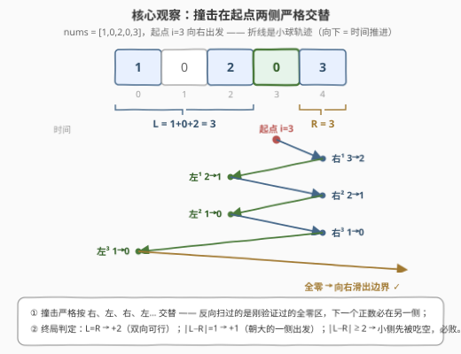
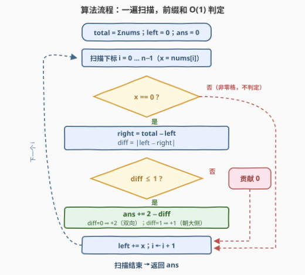
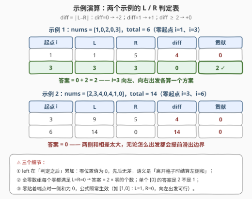

# 使数组元素等于零

- **题目名称**：使数组元素等于零
- **链接**：[3354. 使数组元素等于零](https://leetcode.cn/problems/make-array-elements-equal-to-zero/)
- **难度**：简单
- **标签**：数组、前缀和、模拟
- **关联**：题号紧挨着的 [3355. 零数组变换 I](https://leetcode.cn/problems/zero-array-transformation-i/) / [3356. 零数组变换 II](https://leetcode.cn/problems/zero-array-transformation-ii/) 玩的是前缀和的逆运算（差分）；本题则把前缀和藏进「弹球往哪边先出发」的判定里，一行扫描收工

## 1. 题目概述

给你一个整数数组 `nums`。开始时，选择一个满足 `nums[curr] == 0` 的起始位置 `curr`，并选择一个移动**方向**：向左或者向右。此后，你需要重复下面的过程：

- 如果 `curr` 超过范围 `[0, n - 1]`，过程结束；
- 如果 `nums[curr] == 0`，沿当前方向继续移动：向右移则**递增** `curr`，向左移则**递减** `curr`；
- 如果 `nums[curr] > 0`：将 `nums[curr]` 减 1，**反转**移动方向（向左变向右，反之亦然），沿新方向移动一步。

如果在结束整个过程后，`nums` 中的所有元素都变为 0，则认为选出的初始位置和移动方向**有效**。返回可能的有效选择方案数目。

**示例 1**：

```text
输入：nums = [1,0,2,0,3]
输出：2
解释：选择 curr = 3 并向左移动、或 curr = 3 并向右移动，两种方案最终都能把数组清零。
```

**示例 2**：

```text
输入：nums = [2,3,4,0,4,1,0]
输出：0
解释：不存在有效的选择方案。
```

**约束条件**：

- $1 \le n \le 100$
- $0 \le nums[i] \le 100$
- 至少存在一个元素 $i$ 满足 $nums[i] = 0$

> 💡 **读题关键**：① 小球撞到正数就「−1 并立刻掉头」，像在数组里来回弹跳的**弹球**；② 过程**只在越界时结束**——全零之后小球会一路滑出边界自然终止，不存在「卡住」的情况；③ 起点只能选零位置、方向二选一，至多 $2n$ 个候选；④ 官方 hint 直说「数据很小，直接模拟」，但本题其实藏着一步 $O(n)$ 的前缀和判定——两种写法都值得会，面试叙事先给 $O(n)$ 更漂亮。

---

## 2. 解题思路

### 2.1 朴素思路：枚举起点，逐帧模拟

最直接的写法：枚举每个零位置 $\times$ 两个方向（至多 $2n$ 种组合），每次复制一份 `nums`，按题意逐帧演到越界，最后检查是否全零。

数据规模也给了底气：**每次撞击让总和 $S = \sum nums$ 恰好减少 1**，而相邻两次撞击之间小球至多滑过 $n$ 个零格子，所以单次模拟至多 $O(n \cdot S)$ 步。$n \le 100$、$S \le 10^4$ 时约 $10^6$ 步，再乘 $2n$ 次模拟——理论最坏偏大但实测数据很弱（官方本来就是让你模拟）。不过，既然过程结构如此规整，完全可以不做任何模拟，一遍扫描直接数出答案。

### 2.2 核心观察：撞击在起点两侧严格交替 → 前缀和一遍扫描



三个观察环环相扣：

**观察一（撞击交替）**：从零位置 $i$ 向右出发，第一次撞击必是 $i$ 右侧**最近**的正数（中间全是零）；撞击后掉头向左，而反向要扫过的第一段恰好是刚才验证过的全零区，所以第二次撞击必落在 $i$ 左侧最近的正数上。归纳下去：**撞击严格按「右、左、右、左……」交替发生**（向左出发则从左起）。换言之，小球每去一侧就啃掉那一侧的一个单位，两侧轮流被消耗。

**观察二（唯一的失败模式）**：过程只会以一种方式失败——小球朝某侧运动、而该侧已被**吃空**，于是直接越界出局，此时另一侧还有剩余。两侧的消耗必须严丝合缝地「咬合」到终局。

**观察三（判定条件）**：设 $L$ 为 $i$ 左侧元素和、$R$ 为 $i$ 右侧元素和。向右出发的吃序是 右¹、左¹、右²、左²……，归纳可知：**向右出发成功 $\iff R = L$ 或 $R = L + 1$**；对称地，**向左出发成功 $\iff L = R$ 或 $L = R + 1$**。

直觉版理解：最后一次撞击要么收在右侧（此后向左滑出，右多吃了一个，$R = L+1$），要么收在左侧（此后向右滑出，$R = L$）。差一旦达到 2，小的一侧会先被吃空，轮到它再「挨撞」时小球已经飞出边界，大的一侧却还剩着——必败。

合并成一行代码：$diff = |L - R|$，$diff \le 1$ 时该起点贡献 $2 - diff$ 个方案（$diff = 0$ 双向可行，$diff = 1$ 只能朝**大的一侧**出发）。

> ⚠️ **三个高频翻车点**：
>
> - **别把判定写成只看一侧和**——成败取决于两侧和的**差**，单看 $L$ 或 $R$ 毫无意义；
> - **方向别记反**：$R = L + 1$ 时可行的是**向右**出发（先啃大的一侧），写反恰好把答案算成对的减 1；
> - **全零数组**：每个零位置都满足 $L = R = 0$，各贡献 2 个方案，别漏乘。

### 2.3 算法流程图



一遍扫描：先求 `total`，随后滚动维护前缀和 `left`；遇到零位置就现算 `right = total − left`，按 $2 - |L - R|$ 累加答案。前缀和在这里的角色是**免掉每个起点重新求两侧和的二重循环**——把 $O(n^2)$ 压成 $O(n)$。

### 2.4 示例演算



**示例 1** `nums = [1,0,2,0,3]`（$total = 6$）：

1. 起点 $i = 1$：$L = 1$，$R = 5$，$diff = 4 \ge 2$ → 0 个方案；
2. 起点 $i = 3$：$L = 3$，$R = 3$，$diff = 0$ → **2 个方案**（向左、向右出发都行，正是示例解释里列出的两条轨迹）。

**示例 2** `nums = [2,3,4,0,4,1,0]`（$total = 14$）：

1. 起点 $i = 3$：$L = 9$，$R = 5$，$diff = 4$ → 0；
2. 起点 $i = 6$：$L = 14$，$R = 0$，$diff = 14$ → 0。

答案 $0$ ✓。再补两个边界：`nums = [0]` 唯一的零满足 $L = R = 0$，向左向右都成功，答案 2；全零数组则**每个零位置各贡献 2**。

---

## 3. 参考代码

### C++

```cpp
class Solution {
  public:
    int countValidSelections(vector<int>& nums) {
        int total = accumulate(nums.begin(), nums.end(), 0);
        int left = 0, ans = 0;
        for (int x : nums) {
            if (x == 0) {                        // 零起点：right = total - left
                int diff = abs(left - (total - left));
                if (diff <= 1) ans += 2 - diff;   // diff=0 → +2；diff=1 → +1
            }
            left += x;                           // 滚动维护左侧和（前缀和）
        }
        return ans;
    }
};
```

### Python

```python
class Solution:
    def countValidSelections(self, nums: List[int]) -> int:
        total, left, ans = sum(nums), 0, 0
        for x in nums:
            if x == 0:                           # 零起点，现算两侧和
                diff = abs(left - (total - left))
                if diff <= 1:
                    ans += 2 - diff              # diff=0 → +2；diff=1 → +1
            left += x                            # 前缀和滚动前进
        return ans


# 写法二：暴力模拟（官方 hint 背书，可用于交叉验证公式）
class Solution:
    def countValidSelections(self, nums: List[int]) -> int:
        n = len(nums)

        def ok(start: int, d: int) -> bool:
            a, curr, dirn = nums[:], start, d
            while 0 <= curr < n:
                if a[curr] == 0:
                    curr += dirn                 # 零：沿原方向滑行
                else:
                    a[curr] -= 1                 # 正数：-1、掉头、走一步
                    dirn = -dirn
                    curr += dirn
            return not any(a)                    # 越界后检查是否全零

        return sum(ok(i, d) for i, x in enumerate(nums)
                   if x == 0 for d in (1, -1))
```

> 💡 **实现细节**：① `left` 在判定**之后**累加——零位置本身值为 0，先后无差，但「离开格子时结算左侧和」语义更直白；② `ans += 2 - diff` 隐含 $diff \le 1$ 的前提，`if` 不能省；③ 模拟写法里 `nums[:]` 的拷贝不可省——每次模拟都要从原始数组出发；④ 两种写法可以互相对拍，公式有一步推理错了，随机数据立刻现形。

---

## 4. 复杂度分析

| 维度 | 复杂度 | 说明 |
|------|--------|------|
| 时间 | $O(n)$ | 一遍扫描，每个零位置 $O(1)$ 判定 |
| 空间 | $O(1)$ | 只用 `total` / `left` / `ans` 三个变量 |
| 暴力对照 | $O(n^2 \cdot S)$ | 单次模拟 $\le$ 撞击 $S$ 次 $\times$ 相邻撞击间滑行 $\le n$ 格；$S \le 10^4$，实际数据远弱于此 |

---

## 5. 扩展：交替引理的严格证明与「何时敢用模拟」

**引理（交替性）**：从零位置 $i$ 出发，撞击发生的侧别（相对 $i$）严格交替。

**证明**（归纳）：向右出发时，第一次撞击在 $i$ 右侧最近正数 $r_1$，且 $i+1 \dots r_1-1$ 全为零。设某次撞击发生在右侧位置 $r > i$，掉头向左：从 $r-1$ 向左扫过的格子若仍在 $i$ 右侧，它们在上一次向右扫过时是零、此后只减不增，故第一个撞上的正数（若存在）必在 $i$ 左侧。对称地，左侧撞击后下一个必在右侧。若一路扫到底都没有正数，则越界出局，交替序列自然终止。$\blacksquare$

**判定条件的核算**：向右出发的吃序为 右¹左¹右²左²……设终局共右吃 $a$ 次、左吃 $b$ 次，则 $|a - b| \le 1$（交替）。全零要求 $a = R$、$b = L$。若最后一次撞击是左吃（此后向右滑出），吃序完整配对，$a = b$，即 $R = L$；若最后一次是右吃（此后向左滑出），$a = b + 1$，即 $R = L + 1$。反过来，$R = L$ 或 $R = L+1$ 时按交替吃序一路啃到底，中途轮到的侧别总有存量（小的一侧每次都在被补给轮次），不会提前越界，故恰好成功。$\blacksquare$

**何时敢用模拟**：单次模拟的步数 $=$ 撞击数 $+$ 滑行格数 $\le S + (S+1)\,n$（相邻两次撞击之间至多滑过整条数组）。$n \le 100$、$S \le 10^4$ 给出单次约 $10^6$ 步的**宽松上界**；注意「撞满 $S$ 次」与「每次滑满 $n$ 格」很难同时达成——质量堆在两端才滑得远，但那样撞击次数就少了。所以实测远快于上界，官方 hint 才敢推荐模拟。一般地，看到 $n \le 100$ 量级的「过程模拟」题，先估「状态总量 × 单步代价」，再决定模拟还是找结构。

**前缀和的配角地位**：本题标签里的 Prefix Sum 只体现在 `left` 的滚动维护与 `right = total − left` 的经典配套（与 724 中心下标同款手法）；真正的主菜是对弹跳过程的结构观察——**把一个动力学过程压缩成一个代数判别式**，这才是值得记的套路。

---

## 6. 面试要点

1. **凭什么撞击一定左右交替？**

   - 撞击后掉头，反向扫过的第一段恰好是来时刚验证过的全零区，所以下一个正数必然越过起点、落在另一侧；对每次撞击归纳即得交替性（严格证明见第 5 节引理）。

2. **两侧和差 2 以上为什么必败？**

   - 交替消耗意味着任意时刻两侧已吃次数至多差 1。小的一侧先被吃空后，轮到它挨撞时小球直接越界出局，大的一侧还有剩余，「全零」目标落空。

3. **暴力模拟会不会超时？**

   - 单次模拟 $\le S$ 次撞击、相邻撞击间至多滑 $n$ 格，宽松上界 $O(n \cdot S)$；$n \le 100$、$S \le 10^4$ 时约 $10^6$ 步/次，且上界很难取满，官方数据下稳过。面试里先给 $O(n)$ 判定、再提模拟作交叉验证，叙事更完整。

4. **前缀和在这题里起什么作用？**

   - 一遍扫描滚动维护 `left`，`right = total − left` 现算，把「每个零位置重新求两侧和」从 $O(n^2)$ 降到 $O(n)$——与 724 寻找数组的中心下标是同一套手法。

5. **有哪些边界要留心？**

   - 全零数组每个零位置 $L = R = 0$，各贡献 2；单个 `[0]` 的答案是 2 不是 1；零贴着端点时某一侧和为 0，公式照常生效（如 `[1,0]`：$L=1, R=0$，向左出发可行）。

---

## 7. 同类练习题

- [724. 寻找数组的中心下标](https://leetcode.cn/problems/find-pivot-index/)（[站内题解](../0701-0800/724_寻找数组的中心下标.md)）：左侧和 == 右侧和的前缀和判定，与本题 L/R 视角同源
- [303. 区域和检索 - 数组不可变](https://leetcode.cn/problems/range-sum-query-immutable/)（[站内题解](../0301-0400/303_区域和检索 - 数组不可变.md)）：前缀和模板题，`right = total − left` 的基本功
- [1706. 球会落何处](https://leetcode.cn/problems/where-will-the-ball-fall/)（[站内题解](../1701-1800/1706_球会落何处.md)）：弹球 + 反弹的纯模拟近亲，对照体会「能找结构就别逐帧演」
- [3355. 零数组变换 I](https://leetcode.cn/problems/zero-array-transformation-i/)：题号相邻的姐妹题，前缀和的逆运算——差分数组，把「区间减 1」批量处理
