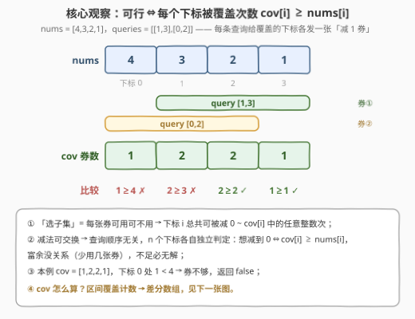
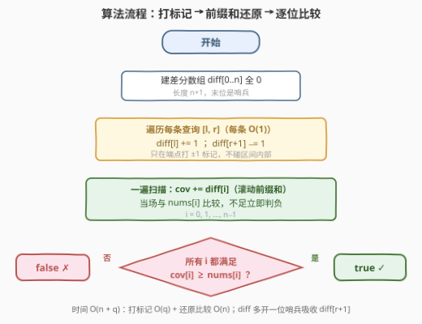
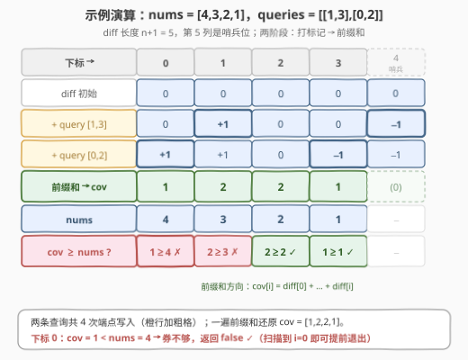

# LeetCode 零数组变换 I 题解

- **关联**：与 [3354. 使数组元素等于零](https://leetcode.cn/problems/make-array-elements-equal-to-zero/)（[站内题解](../3301-3400/3354_使数组元素等于零.md)）题号相邻：那题把前缀和藏进弹球判定，本题则直接考它的逆运算——**差分数组**；进阶版 [3356. 零数组变换 II](https://leetcode.cn/problems/zero-array-transformation-ii/) 再加 `val` 与「最少处理几条」

## 1. 题目概述

- **标题 / 题号**：零数组变换 I（#3355，medium）
- **链接**：https://leetcode.cn/problems/zero-array-transformation-i/
- **难度**：中等
- **标签**：数组、差分数组、前缀和

**题意**：给定长度为 $n$ 的整数数组 `nums` 和二维数组 `queries`，其中 `queries[i] = [l_i, r_i]`。

对于每个查询 `queries[i]`：

- 在 `nums` 的下标范围 $[l_i, r_i]$ 内选择一个下标**子集**；
- 将选中的每个下标对应的元素值**减 1**。

**零数组**是指所有元素都等于 0 的数组。如果在按顺序处理所有查询后，可以将 `nums` 转换为**零数组**，则返回 `true`，否则返回 `false`。

**示例 1**：

```text
输入：nums = [1,0,1], queries = [[0,2]]
输出：true
解释：处理查询 [0,2] 时选下标子集 {0, 2}，两处各减 1，数组变为 [0,0,0]。
```

**示例 2**：

```text
输入：nums = [4,3,2,1], queries = [[1,3],[0,2]]
输出：false
解释：无论怎么选子集，下标 0 只被查询 [0,2] 覆盖一次，最多减到 3，到不了 0。
```

**约束**：

- $1 \le nums.length \le 10^5$
- $0 \le nums[i] \le 10^5$
- $1 \le queries.length \le 10^5$
- $queries[i].length = 2$
- $0 \le l_i \le r_i < nums.length$

> 💡 **读题关键**：① 「选子集」意味着每条查询对范围内每个下标**最多减 1、也可以不减**——既不强制全选，也不会减超过 1；② 查询虽然按顺序处理，但减法可交换、且每步选择完全自由，**顺序对可行性毫无影响**；③ 判定可行性**不需要构造具体方案**，只需算出每个下标的「可减次数上限」再逐位比较——这是差分数组的标准场景（官方 hint 也直说了）。

## 2. 解题思路

### 2.1 朴素思路：逐条查询区间扫描

最直接的写法：对每条查询 $[l, r]$，循环 $l \dots r$ 把覆盖的下标挨个处理，最后检查能否全零。单条查询代价 $O(n)$，总量 $O(n \cdot q)$——$n, q \le 10^5$ 时约 $10^{10}$ 次操作，必然超时。

瓶颈很清楚：**查询改的是一整段区间，我们却逐格去碰**。只要把「区间批量修改」的信息压到端点上，就能把每条查询的代价降到 $O(1)$。

### 2.2 核心观察：把「过程可行性」压缩成「覆盖次数比较」



三个观察环环相扣：

**观察一（每位独立、顺序无关）**：下标 $i$ 的终值只取决于它总共被减了几次，而减法可交换，查询的处理顺序不改变「每个下标能被减多少次」这个集合。于是 $n$ 个下标可以**各自独立判定**。

**观察二（上限即覆盖数）**：设 $cov_i$ 为覆盖下标 $i$ 的查询条数（$l \le i \le r$ 的查询数）。每条覆盖 $i$ 的查询对它贡献「至多减 1、可不减」，所以下标 $i$ 总共可被减 $0 \sim cov_i$ 中的**任意整数次**。要恰好减到零，条件就是：

$$cov_i \ge nums[i] \quad \forall i$$

富余没关系（少选几张「减 1 券」即可），不足则无解。

**观察三（区间覆盖计数 → 差分）**：$cov$ 正是经典的「区间打点计数」：每条查询 $[l, r]$ 让 $diff[l] \mathrel{+}= 1$、$diff[r+1] \mathrel{-}= 1$，再一遍前缀和还原。前缀和的逆运算，把 $O(n \cdot q)$ 压成 $O(n + q)$。

> ⚠️ **三个高频翻车点**：
>
> - **判定别写成 $cov_i = nums[i]$**——子集可以少选，覆盖富余照样能精确减到零，条件是 $\ge$ 不是 $=$；
> - **`diff` 要开 $n+1$ 长度**——$r$ 最大取 $n-1$，$r+1$ 需要哨兵位，否则越界；
> - **别真去模拟「每步选哪个子集」**——可行性判定只需比较覆盖数，构造方案是另一回事（而且一定构造得出来：每个下标任选 $nums[i]$ 张覆盖它的券用掉即可）。

### 2.3 算法流程图



两阶段：**打标记**（遍历查询，端点 $O(1)$ 写入）→ **还原比较**（一遍扫描滚动前缀和，当场与 `nums[i]` 比较，不够立即返回 `false`）。滚动变量 `cov` 代替整个前缀和数组，判定也可以提前退出。

### 2.4 示例演算



**示例 2** `nums = [4,3,2,1]`，`queries = [[1,3],[0,2]]`（`diff` 长度 5）：

1. 初始 `diff = [0,0,0,0,0]`；
2. 处理 `[1,3]`：`diff[1] += 1`，`diff[4] -= 1` → `[0,+1,0,0,−1]`；
3. 处理 `[0,2]`：`diff[0] += 1`，`diff[3] -= 1` → `[+1,+1,0,−1,−1]`；
4. 前缀和还原 `cov = [1,2,2,1]`；
5. 逐位比较：$1 \ge 4$？否 → **下标 0 覆盖不足，返回 `false`** ✓。

**示例 1** `nums = [1,0,1]`，`queries = [[0,2]]`：`diff = [+1,0,0,−1]`，$cov = [1,1,1] \ge [1,0,1]$ 全部满足 → `true` ✓。

再补一个边界：若 `nums[i] = 0`，该位天然满足（券一张不用也行）；全零数组配合任意查询恒为 `true`。

## 3. 参考代码

### C++

```cpp
class Solution {
  public:
    bool isZeroArray(vector<int>& nums, vector<vector<int>>& queries) {
        int n = nums.size();
        vector<int> diff(n + 1);                 // 多开一位哨兵，r+1 不越界
        for (auto& q : queries) {
            diff[q[0]]++;
            diff[q[1] + 1]--;
        }
        int cov = 0;                             // 滚动前缀和
        for (int i = 0; i < n; i++) {
            cov += diff[i];
            if (cov < nums[i]) return false;     // 覆盖次数不够，当场判负
        }
        return true;
    }
};
```

### Python

```python
class Solution:
    def isZeroArray(self, nums: List[int], queries: List[List[int]]) -> bool:
        n = len(nums)
        diff = [0] * (n + 1)                     # 哨兵位：吸收 diff[r+1]
        for l, r in queries:
            diff[l] += 1
            diff[r + 1] -= 1
        cov = 0
        for i, x in enumerate(nums):
            cov += diff[i]
            if cov < x:                          # 券不够，减不到 0
                return False
        return True
```

> 💡 **实现细节**：① `diff` 长度必须是 $n+1$——第 2.2 节翻车点之二；② 用滚动变量 `cov` 而非整个前缀和数组，边还原边比较，第一位不足立即返回，平均更快；③ 查询只写端点两格，与区间长度无关，这正是差分的全部价值。

## 4. 复杂度分析

| 维度 | 复杂度 | 说明 |
|------|--------|------|
| 时间 | $O(n + q)$ | 打标记 $O(q)$ + 前缀和比较 $O(n)$ |
| 空间 | $O(n)$ | 差分数组（含一位哨兵），前缀和用滚动变量 |
| 暴力对照 | $O(n \cdot q)$ | 每条查询逐格扫描，$n, q \le 10^5$ 时约 $10^{10}$，必超时 |

## 5. 扩展：3356 零数组变换 II —— 二分查询条数

进阶版 [3356](https://leetcode.cn/problems/zero-array-transformation-ii/) 把查询改成 `queries[i] = [l_i, r_i, val_i]`（选中子集每处减 `val_i`，同样可不选），并问**最少处理前多少条查询**能把数组清零。

单调性是钥匙：处理的查询越多，每个下标的覆盖总量只增不减，可行性随 $k$ 单调（可行 $\Rightarrow$ 可行）。于是**二分** $k$，每次用与本题完全相同的差分判定做 `check`（只是 `diff[l] += val`）：

```python
def check(k):                       # 只用前 k 条查询，能否清零？
    diff = [0] * (n + 1)
    for l, r, v in queries[:k]:
        diff[l] += v
        diff[r + 1] -= v
    cov = 0
    return all((cov := cov + d) >= x for d, x in zip(diff, nums))
# 在 [0, q] 上二分找最小可行 k，总复杂度 O((n + q) log q)
```

进一步还有 $O(n + q)$ 做法（按序双指针推进 $k$，利用判定单调性省掉二分），感兴趣的读者可以自行推导。本题正是这一系列的判定内核：**差分还原覆盖量，逐位与目标比较**。

## 6. 面试要点

1. **为什么查询的处理顺序无关紧要？**

   - 每条查询对覆盖下标的贡献是「至多减 1、可不减」，减法可交换；下标 $i$ 能被减的总次数集合只由覆盖它的查询**集合**决定，与先后次序无关，$n$ 个下标可独立判定。

2. **为什么判定条件是 $cov_i \ge nums[i]$ 而不是相等？**

   - 「选子集」给了放弃的权利：覆盖富余时每个下标只动用恰好 $nums[i]$ 张「减 1 券」即可精确归零；反之覆盖不足则无解。上限够用就行。

3. **差分数组为什么能 $O(1)$ 处理一条区间查询？**

   - 前缀和的逆运算：$diff[l] \mathrel{+}= 1$、$diff[r+1] \mathrel{-}= 1$ 只在端点打标记，之后一遍前缀和自动在 $[l, r]$ 上「长出」这段增量、在 $r+1$ 之后自动抵消。

4. **`diff` 为什么要开 $n+1$ 的长度？**

   - $r$ 最大为 $n-1$，$r+1 = n$ 需要一个哨兵位落点；多开一位免去边界特判，是差分数组的固定手筋。

5. **本题的数据范围在卡哪种写法？**

   - $n, q \le 10^5$：暴力逐格 $O(n \cdot q) \approx 10^{10}$ 必超时；差分 $O(n + q)$ 约 $2 \times 10^5$ 次线性扫描，轻松通过。看到「区间批量修改 + 最后统一查询」的结构，应条件反射地想到差分。

## 同类练习题

| # | 题目 | 与本题的关联 |
|---|------|-------------|
| 3356 | [零数组变换 II](https://leetcode.cn/problems/zero-array-transformation-ii/) | 本题进阶版，查询带 `val` 且求最少处理条数，二分 + 同款差分判定 |
| 1109 | [航班预订统计](https://leetcode.cn/problems/corporate-flight-bookings/)（[站内题解](../1101-1200/1109_航班预订统计.md)） | 差分数组模板题，区间加值 + 前缀和还原 |
| 1094 | [拼车](https://leetcode.cn/problems/car-pooling/)（[站内题解](../1001-1100/1094_拼车.md)） | 差分统计各站点乘客数，判定全程不超载，同款「还原后逐位比较」 |
| 1893 | [检查是否区域内所有整数都被覆盖](https://leetcode.cn/problems/check-if-all-the-integers-in-a-range-are-covered/)（[站内题解](../1801-1900/1893_检查是否区域内所有整数都被覆盖.md)） | 区间覆盖计数 + 逐位可行性判定，与本题结构互为镜像 |
