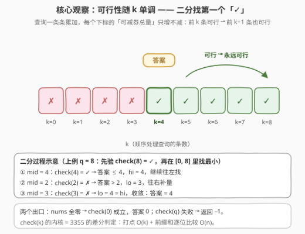
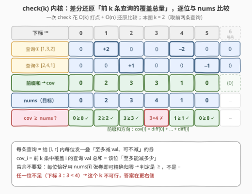
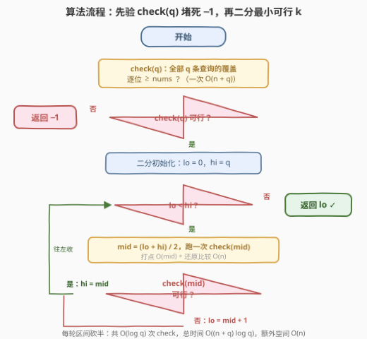
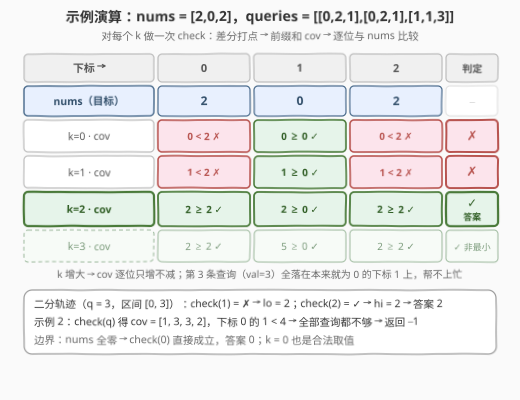

# 零数组变换 II

- **题目名称**：零数组变换 II
- **链接**：[3356. 零数组变换 II](https://leetcode.cn/problems/zero-array-transformation-ii/)
- **难度**：中等
- **标签**：数组、双指针、二分查找、前缀和（差分）
- **关联**：[3355. 零数组变换 I](https://leetcode.cn/problems/zero-array-transformation-i/)（[站内题解](../3301-3400/3355_零数组变换I.md)）是本题的判定内核——`val` 退化为 1、只问可行性；本题把「减 1 券」升级成「减 val 券」，再问**最少处理前多少条**，于是外面多套一层二分。3355 结尾埋的伏笔在此兑现

## 1. 题目概述

给你一个长度为 $n$ 的整数数组 `nums` 和一个二维数组 `queries`，其中 `queries[i] = [l_i, r_i, val_i]`。

每个 `queries[i]` 表示在 `nums` 上执行以下操作：

- 将 `nums` 中 $[l_i, r_i]$ 范围内的**每个**下标对应的元素值**最多**减少 $val_i$；
- 每个下标减少的数值可以**独立**选择（可以不减）。

**零数组**是指所有元素都等于 0 的数组。

返回 $k$ 可以取到的**最小非负**值，使得在**顺序**处理前 $k$ 个查询后，`nums` 变成**零数组**。如果不存在这样的 $k$，则返回 -1。

**示例 1**：

```text
输入：nums = [2,0,2], queries = [[0,2,1],[0,2,1],[1,1,3]]
输出：2
解释：处理前 2 条查询：第 1 条各减 [1,0,1] 得 [1,0,1]，第 2 条再各减 [1,0,1] 得 [0,0,0]，
     已是零数组；第 3 条查询（val=3）根本用不上。
```

**示例 2**：

```text
输入：nums = [4,3,2,1], queries = [[1,3,2],[0,2,1]]
输出：-1
解释：下标 0 只被第 2 条查询覆盖，至多减 1，4 − 1 = 3 > 0，永远到不了 0。
```

**约束条件**：

- $1 \le nums.length \le 10^5$
- $0 \le nums[i] \le 5 \times 10^5$
- $1 \le queries.length \le 10^5$
- $queries[i].length = 3$
- $0 \le l_i \le r_i < nums.length$
- $1 \le val_i \le 5$

> 💡 **读题关键**：① 每条查询对区间内每位是「至多减 `val`、可不减」的**独立**操作——正是 3355 的「减 1 券」换成「减 val 券」，减法总量可以在 $[0, \text{覆盖总量}]$ 里任取；② 问的是「前 $k$ 条」的**最小** $k$——「前缀 + 最小」的组合是二分答案的标准信号；③ 可行性判定**不需要构造具体方案**，逐位比较覆盖总量即可；④ 别漏两个出口：`nums` 本身全零时答案是 $k = 0$，全部查询都不够时返回 $-1$。

---

## 2. 解题思路

### 2.1 朴素思路：逐个 k 全量判定

最直接的写法：$k$ 从 $0$ 到 $q$ 逐个试，每个 $k$ 用一遍 3355 的差分判定（打点 $O(k)$ + 前缀和还原比较 $O(n)$），第一个可行的 $k$ 即答案。总代价 $\sum_{k=0}^{q}(n+k) = O(nq + q^2)$——$n, q \le 10^5$ 时约 $10^{10}$，必超时。若换成逐格模拟每条查询，更是 $O(n \cdot q)$ 起步。

瓶颈很清楚：**$k$ 与 $k+1$ 的覆盖只差一条查询的贡献，我们却把整个判定推倒重算**。浪费的正是「查询只增不减」的单调性。

### 2.2 核心观察：单调性 + 差分判定



三个观察环环相扣：

**观察一（每位独立、上限即覆盖和）**：与 3355 同构。前 $k$ 条查询中，每条覆盖下标 $i$ 的查询给该位一张「至多减 $val_j$、可不减」的券。由于各券独立、取值连续，下标 $i$ 总共可减 $0 \sim cov_i(k)$ 中的**任意整数**，其中

$$cov_i(k) = \sum_{j \le k,\; l_j \le i \le r_j} val_j$$

于是**前 $k$ 条查询可行 $\iff cov_i(k) \ge nums[i]$ 对所有 $i$ 成立**——富余没关系（少用几张券），不足则无解。

**观察二（k 单调）**：$k$ 变大只会新增查询、券只增不减，所以 $cov_i(k)$ 对每个 $i$ 都随 $k$ 单调不减——**可行 $\Rightarrow$ 可行**。可行性是 $[0, q]$ 上的单调布尔序列，二分找第一个「可行」即可，$O(\log q)$ 次判定代替 $q + 1$ 次。

**观察三（check 用差分）**：给定 $k$，$cov(\cdot)$ 就是「区间加 `val` 的打点计数」：对前 $k$ 条查询做 $diff[l_j] \mathrel{+}= val_j$、$diff[r_j + 1] \mathrel{-}= val_j$，再一遍前缀和还原，逐位与 `nums` 比较——一次 `check` 花 $O(n + k)$，与 3355 的判定完全同款，只是 $\pm 1$ 换成 $\pm val$。



> ⚠️ **三个高频翻车点**：
>
> - **别把二分边界写成 $[1, q]$**——`nums` 本身全零时答案是 $k = 0$，`lo` 必须从 0 起步；
> - **$-1$ 要在二分外先验**——先跑一次 `check(q)`，失败直接返回 $-1$，别把无解语义混进二分循环；
> - **判定仍是 $\ge$ 不是 $=$**——覆盖富余照样能精确归零（每位恰好用 `nums[i]` 张券），与 3355 同一个坑。

### 2.3 算法流程图



两阶段：**先验** `check(q)` 堵死 $-1$ 出口（若连全部查询都不够，更大的 $k$ 也不会更够）；随后在 $[0, q]$ 上标准二分左边界——`check(mid)` 可行则 `hi = mid`（答案 $\le$ mid，往左找更小的），不可行则 `lo = mid + 1`（mid 条不够，加量），`lo == hi` 时收敛到最小可行 $k$。

### 2.4 示例演算



**示例 1** `nums = [2,0,2]`，`queries = [[0,2,1],[0,2,1],[1,1,3]]`（`diff` 长度 4）：

1. $k = 0$：$cov = [0,0,0]$，下标 0 的 $0 < 2$ → ✗（`nums` 非全零，$k=0$ 不行）；
2. $k = 1$：第 1 条打点 `diff[0]+=1, diff[3]-=1`，$cov = [1,1,1]$，下标 0 的 $1 < 2$ → ✗；
3. $k = 2$：第 2 条同款打点，$cov = [2,2,2] \ge [2,0,2]$ 逐位满足 → ✓，**答案 2**；
4. $k = 3$：第 3 条 `[1,1,3]` 让 $cov = [2,5,2]$，也可行但**非最小**——它的 val=3 全堆在本来就为 0 的下标 1 上，帮不上忙。

二分轨迹（$q = 3$，区间 $[0,3]$）：`check(1)` ✗ → `lo = 2`；`check(2)` ✓ → `hi = 2`；`lo == hi` → 返回 2 ✓。

**示例 2** `nums = [4,3,2,1]`，`queries = [[1,3,2],[0,2,1]]`：先验 `check(2)`，$cov = [1,3,3,2]$，下标 0 的 $1 < 4$ → 全部查询都不够 → **返回 $-1$** ✓。

---

## 3. 参考代码

### C++

```cpp
class Solution {
  public:
    int minZeroArray(vector<int>& nums, vector<vector<int>>& queries) {
        int n = nums.size(), q = queries.size();

        auto check = [&](int k) -> bool {          // 只用前 k 条查询，能否清零？
            vector<int> diff(n + 1);               // 多开一位哨兵，r+1 不越界
            for (int i = 0; i < k; i++) {
                diff[queries[i][0]] += queries[i][2];
                diff[queries[i][1] + 1] -= queries[i][2];
            }
            long long cov = 0;                     // 滚动前缀和
            for (int i = 0; i < n; i++) {
                cov += diff[i];
                if (cov < nums[i]) return false;   // 券不够，当场判负
            }
            return true;
        };

        if (!check(q)) return -1;                  // 全部查询都不够 → 无解
        int lo = 0, hi = q;                        // k=0 对应「nums 已全零」
        while (lo < hi) {
            int mid = lo + (hi - lo) / 2;
            if (check(mid)) hi = mid;              // mid 可行 → 更小可能存在
            else lo = mid + 1;                     // mid 不够 → 至少 mid+1 条
        }
        return lo;
    }
};
```

### Python

```python
class Solution:
    def minZeroArray(self, nums: List[int], queries: List[List[int]]) -> int:
        n, q = len(nums), len(queries)

        def check(k: int) -> bool:                 # 只用前 k 条查询，能否清零？
            diff = [0] * (n + 1)                   # 哨兵位吸收 diff[r+1]
            for l, r, val in queries[:k]:
                diff[l] += val
                diff[r + 1] -= val
            cov = 0                                # 滚动前缀和
            for i, x in enumerate(nums):
                cov += diff[i]
                if cov < x:                        # 券不够，减不到 0
                    return False
            return True

        if not check(q):                           # 全部查询都不够 → 无解
            return -1
        lo, hi = 0, q                              # k=0 对应「nums 已全零」
        while lo < hi:
            mid = (lo + hi) // 2
            if check(mid):
                hi = mid                           # 往左找更小的可行 k
            else:
                lo = mid + 1                       # mid 不够，加量
        return lo
```

> 💡 **实现细节**：① `check` 里只取 `queries[:k]` 前缀，`diff` 开 $n+1$ 长度——与 3355 同款手筋；② 用滚动变量 `cov` 边还原边比较，第一位不足立即返回；③ 先验 `check(q)` 把 $-1$ 挡在二分之外，二分循环里只需处理「找左边界」一种语义，不易写错；④ $\sum val \le 5 \times 10^5$，`int` 足够，`cov` 用 `long long` 是防御性写法。

---

## 4. 复杂度分析

| 维度 | 复杂度 | 说明 |
|------|--------|------|
| 时间 | $O((n + q) \log q)$ | $\lceil \log_2 q \rceil + 1$ 次 `check`，每次打点 $O(k) \le O(q)$ + 还原比较 $O(n)$；$n = q = 10^5$ 时约 $3.4 \times 10^6$ 步 |
| 空间 | $O(n)$ | 差分数组（含一位哨兵），前缀和用滚动变量 |
| 暴力对照 | $O(nq + q^2)$ | 逐个 $k$ 全量判定，$\sum_{k=0}^{q}(n + k) \approx 10^{10}$，必超时 |

---

## 5. 扩展：k 单调推进的单遍扫描——省掉二分的重复打点

3355 题解结尾埋过一句「按序双指针推进 $k$」的伏笔，这里兑现成可运行的做法。

**关键事实**：答案 $k^\ast = \max_i k_i$，其中 $k_i$ 是让下标 $i$ 满足覆盖所需的**最小前缀长度**。扫描下标 $i = 0 \dots n-1$ 时维护「已承诺的前缀」$k$（只增不减），配合两个堆：

- **活动堆**（按 $r$ 的小根堆）：$j \le k$、$l_j \le i \le r_j$ 的查询，堆内 `val` 之和就是 $cov_k(i)$；扫过 $i$ 时弹出 $r < i$ 的过期查询（永久失效）；
- **待解锁堆**（按 $j$ 的小根堆）：已经进场（$l_j \le i$）但 $j > k$、还没被前缀承诺的查询。

每个下标 $i$：先让 $l = i$ 的查询进场（$j \le k$ 直接入活动堆，否则进待解锁堆），再过期清理；若 $cov < nums[i]$ 就 `k += 1` 并把待解锁堆中 $j \le k$ 的查询搬进活动堆，直到够用——或 $k$ 到 $q$ 仍不够则返回 $-1$。

```python
class Solution:
    def minZeroArray(self, nums: List[int], queries: List[List[int]]) -> int:
        n, q = len(nums), len(queries)
        enter = [[] for _ in range(n)]             # 按左端点分桶
        for j, (l, r, v) in enumerate(queries, 1):
            enter[l].append((j, r, v))

        pending, active = [], []                   # 按 j / 按 r 的小根堆
        sum_val, k = 0, 0                          # 活动堆 val 之和；已承诺前缀
        for i in range(n):
            for j, r, v in enter[i]:               # 新进场：看是否已被前缀覆盖
                if j <= k:
                    if r >= i:
                        heapq.heappush(active, (r, v)); sum_val += v
                else:
                    heapq.heappush(pending, (j, r, v))
            while active and active[0][0] < i:     # 过期：r < i 永久失效
                _, v = heapq.heappop(active); sum_val -= v
            while sum_val < nums[i]:               # 券不够：前缀 k 向右扩张
                if k == q:
                    return -1
                k += 1
                while pending and pending[0][0] <= k:
                    _, r, v = heapq.heappop(pending)
                    if r >= i:
                        heapq.heappush(active, (r, v)); sum_val += v
        return k
```

**均摊分析**：$k$ 全程只增不减，至多 $q$ 次 `+= 1`；每条查询至多经历「进场 → 待解锁 → 活动 → 过期」各一次，堆操作总数 $O(n + q)$，总时间 $O((n + q) \log q)$——与二分版同阶，但**数组只扫一遍**，免去了 $\log q$ 次全量打点；代价是要小心「查询进场早于前缀承诺」的时序（这正是待解锁堆存在的意义，也是最易写错的一步）。

**一个易被忽略的等价性**：贪心模拟「每条查询尽量多减」得到的数组恰是 $\max(0,\; nums[i] - cov_i(k))$——因为每位独立、每券可少用，所以「最优模拟」与「覆盖总量比较」殊途同归。这也解释了为什么判定不需要构造方案：方案总是存在（每位恰好用 $nums[i]$ 张券）。

---

## 6. 面试要点

1. **为什么可行性对 $k$ 单调？**

   - 新增查询只会给覆盖区间内的每位**加**券，从不没收；每位又能选择不用券，所以 $cov_i(k)$ 随 $k$ 只增不减，可行 $\Rightarrow$ 可行——$[0, q]$ 上的单调布尔序列，二分找第一个 `true`。

2. **为什么「前 $k$ 条可行 $\iff cov_i(k) \ge nums[i]$」？**

   - 各券独立且取值连续，每位可减 $0 \sim cov_i(k)$ 中任意整数：富余时恰好用 $nums[i]$ 张券精确归零，不足时无解。与 3355 的判定一字不差，只是 $\pm 1$ 变 $\pm val$。

3. **二分的边界和 $-1$ 怎么处理？**

   - `lo` 从 0 起步——`nums` 全零时答案是 0；先验 `check(q)`，失败返回 $-1$，成功再二分——把无解语义挡在循环外，循环里只剩「找左边界」。

4. **一次 check 的代价是多少，总复杂度呢？**

   - 打点 $O(k)$ + 前缀和还原比较 $O(n)$；二分 $\lceil \log_2 q \rceil + 1$ 次，总 $O((n+q) \log q)$，$10^5$ 量级下约几百万步。

5. **还有别的写法吗？**

   - 有：利用「$k$ 单调不减」做单遍扫描（第 5 节）——按下标扫 + 按 $r$ 的活动堆 + 按 $j$ 的待解锁堆，均摊 $O((n+q) \log q)$ 但只扫一遍；面试先讲二分版（结构简单、不易错），再提扫描版展示对单调性的更深利用。

---

## 7. 同类练习题

- [3355. 零数组变换 I](https://leetcode.cn/problems/zero-array-transformation-i/)（[站内题解](../3301-3400/3355_零数组变换I.md)）：本题的判定内核——差分还原覆盖量、逐位与目标比较，可行性判定版
- [875. 爱吃香蕉的珂珂](https://leetcode.cn/problems/koko-eating-bananas/)（[站内题解](../0801-0900/875_爱吃香蕉的珂珂.md)）：二分答案 + $O(n)$ 验证函数，同款「单调谓词找首个可行」
- [410. 分割数组的最大值](https://leetcode.cn/problems/split-array-largest-sum/)（[站内题解](../0401-0500/410_分割数组的最大值.md)）：二分答案 + 贪心验证的困难版，验证函数从差分换成贪心划分
- [1109. 航班预订统计](https://leetcode.cn/problems/corporate-flight-bookings/)（[站内题解](../1101-1200/1109_航班预订统计.md)）：差分数组模板——区间加值 + 前缀和还原，`check` 的原型
- [1893. 检查是否区域内所有整数都被覆盖](https://leetcode.cn/problems/check-if-all-the-integers-in-a-range-are-covered/)（[站内题解](../1801-1900/1893_检查是否区域内所有整数都被覆盖.md)）：区间覆盖计数 + 逐位可行性判定，与 `check` 的结构互为镜像
