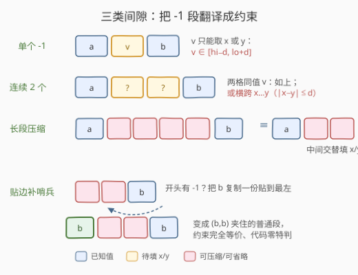
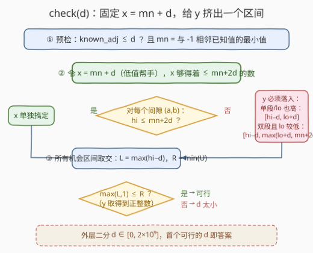
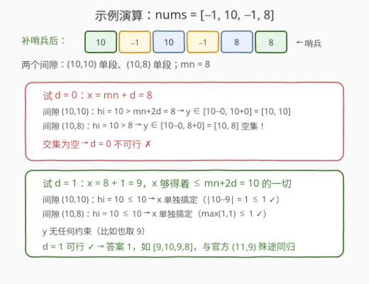

# 最小化相邻元素的最大差值

- **题目名称**：最小化相邻元素的最大差值
- **链接**：[3357. 最小化相邻元素的最大差值](https://leetcode.cn/problems/minimize-the-maximum-adjacent-element-difference/)
- **难度**：困难
- **标签**：贪心、数组、二分查找
- **关联**：与 [410. 分割数组的最大值](https://leetcode.cn/problems/split-array-largest-sum/)（[站内题解](../0401-0500/410_分割数组的最大值.md)）同属「二分答案 + 判定」家族，但判定函数从「贪心划分数组」升级成「**固定一维、区间取交**」的降维技巧

## 1. 题目概述

给你一个整数数组 `nums`，其中部分值**缺失**了，缺失的元素标记为 -1。

你需要选择**一个正整数数对** $(x, y)$，并将 `nums` 中每一个**缺失**元素用 $x$ 或者 $y$ 替换。

你的任务是替换 `nums` 中的所有缺失元素，**最小化**替换后数组中相邻元素**绝对差值**的**最大值**。

**示例 1**：

```text
输入：nums = [1,2,-1,10,8]
输出：4
解释：选择数对 (6, 7)，nums 变为 [1, 2, 6, 10, 8]，
相邻绝对差值为 1、4、4、2，最大值 4。
```

**示例 2**：

```text
输入：nums = [-1,-1,-1]
输出：0
解释：选择数对 (4, 4)，nums 变为 [4, 4, 4]。
```

**示例 3**：

```text
输入：nums = [-1,10,-1,8]
输出：1
解释：选择数对 (11, 9)，nums 变为 [11, 10, 9, 8]。
```

**约束条件**：

- $2 \le nums.length \le 10^5$
- $nums[i]$ 要么是 -1，要么是范围 $[1, 10^9]$ 内的一个整数

> 💡 **读题关键**：① 全局只有**两个**填充值 $x, y$，所有缺失位置共用——这是本题与「每格独立填」的分水岭；② $x, y$ 可以相等（示例 2）；③ 最小化的是**最大**相邻绝对差，典型的 min-max 结构，往「二分答案」上想；④ $x, y$ 必须是**正整数**，边界处别取 0 或负数。

---

## 2. 解题思路

### 2.1 暴力思路：枚举数对 (x, y)

最直接的想法：枚举 $x, y \in [1, 10^9]$ 的所有组合，对每个数对把每个缺失格子独立地填 $x$ 或 $y$ 中更优的那个，取最大相邻差，再全局取最小。值域 $10^9$ 让枚举直接爆炸；即使把值域缩小到 $O(V)$，也是 $O(V^2 \cdot n)$ 的开销，只能当对拍暴力用（本文的参考代码就是靠它验证正确性的）。

真正要跨过的坎是：**判定「差值上限 $d$ 是否可行」时，$(x, y)$ 是一个二维可行域**。二维的东西枚不动，就得想办法**降维**——这正是本题的核心观察。

### 2.2 核心观察：二分答案 + 固定 x = mn + d，区间取交定 y



**观察一（单调性 → 二分）**：若上限 $d$ 可行，则任何 $d' > d$ 也可行（约束只变松）。于是在 $[0, 2 \times 10^9]$ 上二分 $d$，找最小可行值。剩下的问题是：**如何 $O(n)$ 判定给定 $d$ 是否可行**？

**观察二（间隙模型，三个预处理）**：把每个极大连续 -1 段看成一个「间隙」，两侧是被已知值 $a, b$ 夹住：

1. **长段压缩**：长度超过 2 的段与长度恰为 2 的段**等价**——段内交替使用 $x, y$ 时内部只产生 $|x - y|$ 这一种差，两个端点之外多出的格子不产生新约束；
2. **首尾补哨兵**：开头有 -1 就把右边第一个正数复制到最左，结尾同理。新增的约束恰好是原段已有约束的重复，答案不变，代码从此**零特判**；
3. **已知-已知对**：若两个已知值直接相邻，$|a - b| \le d$ 是硬性检查，与 $x, y$ 无关。

**观察三（降维：固定 $x = mn + d$）**：设 $mn$ 为**与 -1 相邻**的已知值的最小值（哨兵补齐后一定存在）。不妨把两个填充值想成「低帮手 $x$」和「高帮手 $y$」（$x \le y$）：

- 含 $mn$ 的那个间隙强迫某个填充值 $v$ 满足 $|v - mn| \le d$，即 $v \le mn + d$——低帮手再高也高不过 $mn + d$；
- 反过来，把低帮手**顶格抬到** $x = mn + d$ 只会更好：它够得着一切 $\le mn + 2d$ 的邻居。任何可行解里由「更低的值」服务的间隙，换成 $x = mn + d$ 后依然被服务。

固定 $x = mn + d$ 后，逐间隙分析对 $y$ 的要求（记 $lo = \min(a,b)$，$hi = \max(a,b)$）：

| 间隙情形 | 谁来满足 | 对 $y$ 的约束 |
|----------|----------|----------------|
| $hi \le mn + 2d$ | $x$ 单独满足（同值填充 $x$ 即可） | 无 |
| 单个 -1，$hi > mn + 2d$ | 只能靠 $y$ 同值填充 | $y \in [hi - d,\ lo + d]$ |
| 双 -1 且 $lo > mn + 2d$ | $x$ 够不着任何一端，只能 $y$ 同值填充 | $y \in [hi - d,\ lo + d]$ |
| 双 -1 且 $lo \le mn + 2d < hi$ | $y$ 同值填充 **或** 横跨 $x \cdots y$ | $y \in [hi - d,\ \max(lo + d,\ mn + 2d)]$ |

最后一行是精华：双段允许「$x$ 贴低邻居、$y$ 贴高邻居、中间付一次 $|x - y| \le d$」的**横跨**方案，它要求 $y \in [hi - d, hi + d] \cap [x - d, x + d] = [hi - d,\ mn + 2d]$；与同值方案 $[hi - d, lo + d]$ 取并，两个区间**共享左端点** $hi - d$，并起来仍是**一个区间** $[hi - d, \max(lo + d, mn + 2d)]$。

于是每个间隙对 $y$ 的约束都收敛成单个区间，全部取交：

$$L = \max_{\text{gap}} (hi - d), \qquad R = \min_{\text{gap}} U_{\text{gap}}$$

可行 $\iff \max(L, 1) \le R$（$y$ 还得是正整数，取 $y = \max(L, 1)$ 即可）。二维可行域被压成了「固定 $x$ + 一维区间取交」，判定 $O(n)$ 收工。

> ⚠️ **三个高频翻车点**：
>
> - **别忘压缩**：长段不压缩成 2，横跨分析就套不上（长度 $\ge 3$ 的段横跨时内部会产生多次 $|x-y|$？不会——交替填充仍只有 $|x-y|$ 一种差，但端点分析与长度 2 完全一致，所以等价）；
> - **别忘哨兵**：贴边的 -1 段只有单侧邻居，不补哨兵就得为它单写一套逻辑，极易漏；
> - **别忘 $y \ge 1$**：$hi - d$ 可能是负数，$y$ 必须取到正整数（$R$ 端恒 $\ge lo \ge 1$，所以 $\max(L,1) \le R$ 就够）。

### 2.3 算法流程图



整体三步走：预处理（压缩 + 哨兵 + 提间隙）$\to$ 二分 $d$ $\to$ check 内部「预检 → 定 $x$ → 逐间隙缩 $y$ 区间 → 交非空即可行」。

### 2.4 示例演算



以示例 3 `nums = [-1,10,-1,8]` 为例：补哨兵后两个间隙 $(10,10)$、$(10,8)$，均为单段，$mn = 8$。

1. **试 $d = 0$**：$x = 8$，$x$ 够得着 $\le mn + 2d = 8$ 的值。两个间隙 $hi = 10 > 8$ 都得靠 $y$：前者要 $y \in [10, 10]$，后者要 $y \in [10, 8]$（空！）→ 交集为空，**不可行**；
2. **试 $d = 1$**：$x = 9$，够得着 $\le 10$ 的一切。两个间隙 $hi = 10 \le 10$，$x$ 全包（$|10-9| = 1 \le 1$、$\max(|10-9|, |8-9|) = 1 \le 1$）→ $y$ 无约束，**可行** ✓。

答案 1。示例 1 `[1,2,-1,10,8]`：间隙 $(2,10)$ 单段，$mn = 2$，$d = 4$ 时 $mn + 2d = 10 \ge hi$，$x = 6$ 单独搞定，可行；$d = 3$ 时 $y \in [7, 5]$ 空，不可行，答案 4。示例 2 全为 -1：$x = y$ 直接全填，答案 0。

---

## 3. 参考代码

### C++

```cpp
class Solution {
  public:
    int minDifference(vector<int>& nums) {
        long long first = -1, last = -1;
        for (int v : nums) {
            if (v != -1) {
                if (first == -1) first = v;
                last = v;
            }
        }
        if (first == -1) return 0;  // 全为 -1：x = y，答案 0

        // 首尾补哨兵：所有 -1 段都被两个已知值夹住
        vector<int> arr;
        arr.push_back((int)first);
        arr.insert(arr.end(), nums.begin(), nums.end());
        arr.push_back((int)last);

        long long knownAdj = 0;             // 已知-已知相邻对的最大差
        vector<array<long long, 3>> gaps;   // {a, b, isDouble}
        int m = arr.size();
        for (int i = 1; i < m;) {
            if (arr[i] == -1) {
                int j = i;
                while (j < m && arr[j] == -1) j++;
                gaps.push_back({arr[i - 1], arr[j], (long long)(j - i >= 2)});
                i = j;
            } else {
                if (arr[i - 1] != -1)
                    knownAdj = max(knownAdj, (long long)abs(arr[i] - arr[i - 1]));
                i++;
            }
        }
        if (gaps.empty()) return (int)knownAdj;

        long long mn = LLONG_MAX;  // 与 -1 相邻的已知值的最小值
        for (auto& g : gaps) mn = min({mn, g[0], g[1]});

        auto check = [&](long long d) -> bool {
            if (knownAdj > d) return false;
            long long xhi = mn + 2 * d;      // x = mn + d 能覆盖到 mn + 2d
            long long loY = 0, hiY = LLONG_MAX;
            for (auto& g : gaps) {
                long long lo = min(g[0], g[1]), hi = max(g[0], g[1]);
                if (hi <= xhi) continue;     // x 单独满足该间隙
                long long u = (g[2] == 1 && lo <= xhi) ? max(lo + d, xhi) : lo + d;
                loY = max(loY, hi - d);
                hiY = min(hiY, u);
                if (loY > hiY) return false;
            }
            return true;                     // 取 y = max(loY, 1) 即可
        };

        long long l = 0, r = 2e9;
        while (l < r) {
            long long mid = l + (r - l) / 2;
            if (check(mid)) r = mid;
            else l = mid + 1;
        }
        return (int)l;
    }
};
```

### Python

```python
class Solution:
    def minDifference(self, nums: List[int]) -> int:
        pos = [v for v in nums if v != -1]
        if not pos:
            return 0                            # 全为 -1：x = y，答案 0

        # 首尾补哨兵：所有 -1 段都被两个已知值夹住
        arr = [pos[0]] + nums + [pos[-1]]

        known_adj = 0                           # 已知-已知相邻对的最大差
        gaps = []                               # (a, b, is_double)
        i, m = 1, len(arr)
        while i < m:
            if arr[i] == -1:
                j = i
                while arr[j] == -1:
                    j += 1
                gaps.append((arr[i - 1], arr[j], j - i >= 2))
                i = j
            else:
                if arr[i - 1] != -1:
                    known_adj = max(known_adj, abs(arr[i] - arr[i - 1]))
                i += 1
        if not gaps:
            return known_adj

        mn = min(min(a, b) for a, b, _ in gaps)  # 与 -1 相邻的已知值最小值

        def check(d: int) -> bool:
            if known_adj > d:
                return False
            xhi = mn + 2 * d                    # x = mn + d 能覆盖到 mn + 2d
            lo_y, hi_y = 0, float('inf')
            for a, b, dbl in gaps:
                lo, hi = (a, b) if a <= b else (b, a)
                if hi <= xhi:
                    continue                    # x 单独满足该间隙
                u = max(lo + d, xhi) if (dbl and lo <= xhi) else lo + d
                lo_y = max(lo_y, hi - d)
                hi_y = min(hi_y, u)
                if lo_y > hi_y:
                    return False
            return True                         # 取 y = max(lo_y, 1) 即可

        l, r = 0, 2 * 10 ** 9
        while l < r:
            mid = (l + r) // 2
            if check(mid):
                r = mid
            else:
                l = mid + 1
        return l
```

> 💡 **实现细节**：① 扫描时间隙结束后的第一个已知值要跳过与 -1 的比较（`arr[i-1] != -1` 判断），否则会把间隙本身重复计入 `known_adj`；② 二分上界 $2 \times 10^9$：已知-已知差 $\le 10^9 - 1$、单段最优 $\le \lceil (10^9 - 1)/2 \rceil$，绰绰有余；③ 两个语言版本与暴力（枚举 $x, y$ + 每段独立取最优）对拍 5 万组随机用例全部一致，放心抄。

---

## 4. 复杂度分析

| 维度 | 复杂度 | 说明 |
|------|--------|------|
| 时间 | $O(n \log C)$ | 预处理提取间隙 $O(n)$；单次 check 逐间隙 $O(1)$ 共 $O(g)$（$g \le n/2$）；二分 $\log(2 \times 10^9) \approx 31$ 轮，$C$ 为值域上界 |
| 空间 | $O(n)$ | 哨兵数组与间隙列表（间隙数 $\le n/2$，也可边扫边省略存储） |
| 暴力对照 | $O(V^2 \cdot n)$ | 枚举值域 $V$ 内所有 $(x, y)$，仅适合小数据对拍 |

---

## 5. 扩展：为什么恰好是两个填充值？

本题最妙的设定是「全局共用一对 $(x, y)$」。两个方向往外想：

- **填充值增加到 3 个及以上**：每个间隙**内部**最多用到 2 个不同值（端点决定一切），但不同间隙可以**各用各的**——间隙完全解耦，答案直接变成 $\max\bigl(known\_adj,\ \lceil \frac{hi - lo}{2} \rceil_{\text{单段}},\ \lceil \frac{hi - lo}{3} \rceil_{\text{双段}}\bigr)$，一遍扫描搞定。「两个值」恰好卡在解耦与耦合的临界点上，才需要二分 + 降维这套组合拳；
- **方法论**：遇到「存在性判定涉及二维自由变量 $(x, y)$」时，先问自己——**能否论证某个变量可以顶格固定**（本题 $x = mn + d$），把二维可行域压成一维区间交。这与 3323 通过插入区间最小化连通组中「枚举关键候选再判定」是同一族降维思想。

---

## 6. 面试要点

1. **为什么长度超过 2 的 -1 段可以压缩成 2？**

   - 段内相邻差只由「相邻两格是否同值」决定：交替填充 $x, y$ 时内部只产生 $|x - y|$ 一种差，而 $|x - y| \le d$ 恰是横跨方案本来就要付的代价；段两端之外的格子对约束没有任何贡献。

2. **凭什么敢把 $x$ 固定成 $mn + d$？**

   - 含最小邻居 $mn$ 的间隙强迫某个填充值 $\le mn + d$；把「低帮手」顶格抬到 $mn + d$ 后，它够得着一切 $\le mn + 2d$ 的邻居——任何更低的取值能服务的间隙它都能服务，可行域只会变大不会变小。

3. **固定 $x$ 之后，对 $y$ 的约束为什么是「区间取交」而不是复杂的形状？**

   - 每个间隙对 $y$ 的要求是「同值填充区间 $[hi-d, lo+d]$」与「横跨区间 $[hi-d, mn+2d]$」的并——两者共享左端点 $hi - d$，并集仍是单个区间；区间族取交只要维护 $(\max L, \min R)$ 两个数。

4. **哨兵会不会引入错误的约束？**

   - 不会。贴边段补上的是**它自己那一侧的已知值** $b$，新增约束「$|b - v_0| \le d$」与原有的「$|b - v_{last}| \le d$」是同一条，等于重复而非加强。

5. **有哪些边界要留心？**

   - 全为 -1（答案 0）；无 -1（答案就是最大相邻差，别再走二分）；$y$ 的区间左端 $hi - d$ 可能为负，最终要取 $y = \max(L, 1)$；二分上界取 $2 \times 10^9$ 防止「值域 $10^9$ + 填充值可超出」的溢出与越界。

---

## 7. 同类练习题

- [410. 分割数组的最大值](https://leetcode.cn/problems/split-array-largest-sum/)（[站内题解](../0401-0500/410_分割数组的最大值.md)）：二分答案 + 贪心判定的模板题，对照体会本题判定函数的升级
- [875. 爱吃香蕉的珂珂](https://leetcode.cn/problems/koko-eating-bananas/)（[站内题解](../0801-0900/875_爱吃香蕉的珂珂.md)）：$O(n)$ 验证型二分答案，最基础的双闸门
- [719. 找出第 K 小的数对距离](https://leetcode.cn/problems/find-k-th-smallest-pair-distance/)（[站内题解](../0701-0800/719_找出第K小的数对距离.md)）：同样是「差值 + 二分答案」，验证换成双指针计数
- [2560. 打家劫舍 IV](https://leetcode.cn/problems/house-robber-iv/)：「最小化最大值 + 二分答案 + 贪心判定」的近期变体，可自测是否掌握套路
