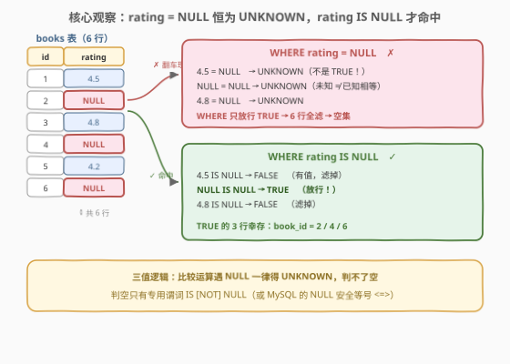
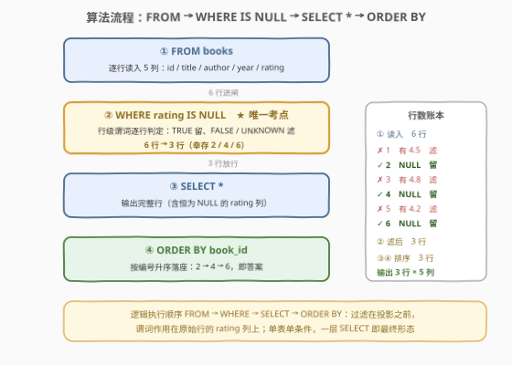
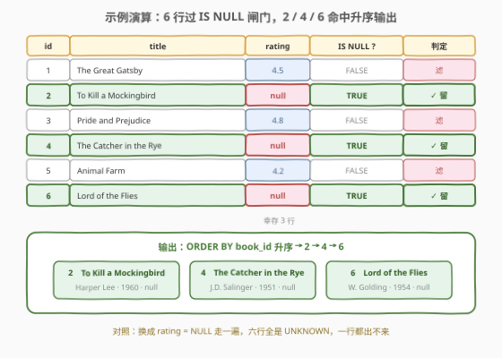

# LeetCode 评分为 NULL 的图书 题解

## 1. 题目概述

- **标题 / 题号**：评分为 NULL 的图书（#3358，easy）
- **链接**：https://leetcode.cn/problems/books-with-null-ratings/
- **难度**：简单
- **标签**：数据库、SQL、NULL 处理、三值逻辑、`IS NULL`、NULL 安全等号、pandas `isna`、LeetCode 锁题

> ⚠️ 本题为 LeetCode 付费题（锁题），官方题面在 GraphQL 接口中 `translatedContent` 返回 `null`。题意描述根据官方示例用例（`jsonExampleTestcases`）、建表语句（`metaData`）与官方 pandas 函数名 `find_unrated_books` 重建，可能与官方题面有出入。**输出列（是否含恒为 NULL 的 `rating` 列）与「按 `book_id` 升序」为按同族题惯例的推断**，提交时以官方判定为准。

**表结构**：`books`

```sql
CREATE TABLE books (
    book_id        INT,
    title          VARCHAR(255),
    author         VARCHAR(100),
    published_year INT,
    rating         DECIMAL(3, 1)   -- 可为 NULL：尚未评分
);
```

每行记录一本图书：编号 `book_id`、书名 `title`、作者 `author`、出版年 `published_year` 与评分 `rating`（一位小数）。**`rating` 为 `NULL` 表示该书尚未获得评分**。

**目标**：编写一个解决方案，找出**所有尚未评分**（`rating IS NULL`）的图书，返回完整行，按 `book_id` **升序**排列。

**示例 1**：

```text
输入：books 表
+---------+----------------------+----------------+-----------------+--------+
| book_id | title                | author         | published_year  | rating |
+---------+----------------------+----------------+-----------------+--------+
| 1       | The Great Gatsby     | F. Scott       | 1925            | 4.5    |
| 2       | To Kill a Mockingbird| Harper Lee     | 1960            | null   |
| 3       | Pride and Prejudice  | Jane Austen    | 1813            | 4.8    |
| 4       | The Catcher in the Rye| J.D. Salinger | 1951            | null   |
| 5       | Animal Farm          | George Orwell  | 1945            | 4.2    |
| 6       | Lord of the Flies    | William Golding| 1954            | null   |
+---------+----------------------+----------------+-----------------+--------+

输出：
+---------+----------------------+----------------+-----------------+--------+
| book_id | title                | author         | published_year  | rating |
+---------+----------------------+----------------+-----------------+--------+
| 2       | To Kill a Mockingbird| Harper Lee     | 1960            | null   |
| 4       | The Catcher in the Rye| J.D. Salinger | 1951            | null   |
| 6       | Lord of the Flies    | William Golding| 1954            | null   |
+---------+----------------------+----------------+-----------------+--------+
```

**解释**：

- **2 / 4 / 6**：`rating` 为 `null` → 尚未评分 → 输出（按 `book_id` 升序）；
- **1 / 3 / 5**：`rating` 分别为 `4.5` / `4.8` / `4.2` → 已评分 → 不输出。

**约束条件**（付费题，按建表语句与示例重建）：

- `book_id` 是这张表的主键；
- `title`、`author`、`published_year` 均非空，只有 `rating` 允许 `NULL`；
- 判题数据规模小。

> 💡 **审题关键**：整道题只有一句话——「`rating` 为 `NULL` 的行留下」。全部考点浓缩在**怎么写这个判空条件**：`WHERE rating = NULL` 是初学者第一反应，却在 SQL 里**一行都选不出来**；唯一正确的行级写法是谓词 `rating IS NULL`（或 NULL 安全等号 `rating <=> NULL`）。这是 [584. 寻找用户推荐人](../0501-0600/584_寻找用户推荐人.md)「`NULL` 三值逻辑」母题的镜像版：584 考「`!=` 会漏掉 NULL 行」，本题考「`=` 根本捞不到 NULL 行」。

## 2. 解题思路

### 2.1 暴力思路：应用层逐行判空（与 `= NULL` 的经典翻车现场）

最直觉的「暴力」是把整张表拉回程序里，逐行判空收集、再排序输出：

```text
result = []
for row in books:            # 全表拉回应用层
    if row.rating is None:   # 判空
        result.append(row)   # 收集
result.sort(by=book_id)      # 排序
```

它当然正确——但把声明式一条 `SELECT ... WHERE` 就能说清的事搬出了数据库：多拉了不需要的行（3/6 的行注定被扔掉）、多写了一圈循环与排序样板。

而 SQL 侧更常见的「暴力翻车」是这句：

```sql
SELECT * FROM books WHERE rating = NULL;   -- ✗ 返回空集！
```

`rating = NULL` 不是语法错误，却**永远一行都选不出**——它不是「恰好不对」，而是**三值逻辑下的恒非真**。这不是实现瑕疵，是 SQL 的语义设计（见 2.2）。

> ⚠️ 暴力的启示：本题的难点从来不在「扫描—过滤—排序」的流程，而在「判空」这一个谓词的写法。把 `NULL` 当成一个「可以拿来比较的值」，是 SQL 里最古老、最高频的坑——584 的 `referee_id != 2` 漏行与本题的 `rating = NULL` 空集，是同一枚硬币的两面。

### 2.2 核心观察：NULL 三值逻辑——`=` 判不了空，只有谓词能



SQL 的比较运算结果是**三值逻辑**：`TRUE` / `FALSE` / `UNKNOWN`。`NULL` 的语义是「**未知值**」而不是「一个具体的值」，所以：

| 观察 | 内容 | 带来的做法 |
|------|------|-----------|
| **`NULL` 参与比较恒 `UNKNOWN`** | `rating = NULL`、`rating <> NULL`、`rating < 5` 遇到 `rating` 为 `NULL` 时结果都是 `UNKNOWN`——「未知值等于 4.5 吗？」答案是「不知道」，不是「否」 | 任何 `=`/`<>`/`<`/`>` 形态的判空尝试都不可靠 |
| **`WHERE` 只放行 `TRUE`** | `UNKNOWN` 与 `FALSE` 同样被当作「不满足」过滤掉 | `WHERE rating = NULL` 六行全部出局，返回**空集**——示例里 3 个 `NULL` 行一个都进不来 |
| **判空必须用专用谓词** | `IS NULL` / `IS NOT NULL` 是把「是不是未知」当作**可直接判定的命题**，返回 `TRUE`/`FALSE`，绕开三值逻辑 | `WHERE rating IS NULL` 一击命中 2/4/6 三行 |

三条观察合起来，整道题坍缩成一条谓词：

```sql
WHERE rating IS NULL
```

> 💡 **为什么 SQL 要这样设计？** 若 `NULL = NULL` 返回 `TRUE`，两个「未知」就被断言相等——但「我不知道的值」未必等于另一个「我不知道的值」（两个人的未知年龄不必相同）。Codd 发明关系模型时故意让 `NULL` 的比较落在第三个真值 `UNKNOWN` 上，让「未知」诚实地传播。代价就是：**问「是不是未知」必须用专门的谓词，不能借用等号**。

### 2.3 算法流程图



| 步骤 | SQL 片段 | 作用 | 示例数据流 |
|------|----------|------|-----------|
| ① 行源 | `FROM books` | 逐行读入 5 列 | 6 行 |
| ② 行级过滤 | `WHERE rating IS NULL` | 只留 `rating` 未知的行 | 6 行 → 3 行（book_id 2/4/6） |
| ③ 投影 | `SELECT *` | 输出完整行（含恒为 `NULL` 的 `rating` 列） | 3 行 × 5 列 |
| ④ 排序 | `ORDER BY book_id` | 按编号升序 | 2 → 4 → 6 |

> 💡 **逻辑执行顺序**是 `FROM → WHERE → SELECT → ORDER BY`：过滤发生在投影**之前**，判空谓词作用在原始行的 `rating` 列上；`ORDER BY` 最后落座。若把判空挪到 `SELECT` 之后（例如外层包一层再筛），语义等价但白白多了一层样板——单表单条件，一层 SELECT 就是最终形态。

### 2.4 示例演算



| book_id | title | rating | `rating IS NULL` ? | 判定 |
|---------|-------|--------|--------------------|------|
| 1 | The Great Gatsby | 4.5 | `FALSE`（有值） | 滤 |
| **2** | To Kill a Mockingbird | `null` | `TRUE` | **留** ✓ |
| 3 | Pride and Prejudice | 4.8 | `FALSE` | 滤 |
| **4** | The Catcher in the Rye | `null` | `TRUE` | **留** ✓ |
| 5 | Animal Farm | 4.2 | `FALSE` | 滤 |
| **6** | Lord of the Flies | `null` | `TRUE` | **留** ✓ |

两步收尾：

- **第 ① 步**（WHERE）：6 行过闸，恰好 3 行 `rating` 为 `NULL`（2/4/6）放行，3 行已评分（1/3/5）被滤；
- **第 ② 步**（ORDER BY）：幸存 3 行按 `book_id` 升序落座 → `2 → 4 → 6`，即示例输出。

> 💡 **交换验证**：若误写 `WHERE rating = NULL`，同一张表现在走 `= NULL` 管道——六行全部得到 `UNKNOWN`，`WHERE` 一个都不放行，输出空集。对照走一遍就能看清：`IS NULL` 与 `= NULL` 的差别不是「写法偏好」，而是「能不能选出东西」的差别。

## 3. 参考代码

### SQL（解法 A：`IS NULL` 谓词，推荐）

```sql
# Write your MySQL query statement below
SELECT *
FROM books
WHERE rating IS NULL
ORDER BY book_id;
```

> 💡 **写法要点**：
> - **判空只有谓词**：`IS NULL` 是行级谓词，直接返回 `TRUE`/`FALSE`，不经过三值逻辑的 `UNKNOWN` 分支；
> - **`SELECT *` 返回完整行**：付费题输出列以官方为准——若官方仅要求 `book_id, title, author, published_year` 四列（裁掉恒为 `NULL` 的 `rating` 列），把 `*` 换成显式列清单即可，判空与排序逻辑不变；若官方允许任意顺序，`ORDER BY book_id` 可删；
> - **无聚合、无连接**：单表单条件，「过滤 + 投影 + 排序」三段一条 SELECT 说完。

### SQL（解法 B：NULL 安全等号 `<=>` 及其跨方言等价写法）

```sql
# Write your MySQL query statement below
SELECT *
FROM books
WHERE rating <=> NULL      -- MySQL 专属：NULL 安全等号
ORDER BY book_id;
```

> 💡 **解法 B 的取舍**：
> - `<=>`（NULL 安全等于，spaceship）把「两边都是 `NULL`」判为 `TRUE`，其余行为同 `=`——`rating <=> NULL` 与 `rating IS NULL` 完全等价，是 MySQL 里唯一能用**等号形态**判空的写法；
> - 各方言对照：PostgreSQL / SQL 标准是 `rating IS NOT DISTINCT FROM NULL`；MySQL 还有函数式 `ISNULL(rating)`（SQL Server 同名但**只接 1 个参数**、用法一致）；Oracle 惯用 `rating IS NULL`；
> - 三种形态语义重合，**首选仍是 `IS NULL`**——它最短、全平台通用、且向读代码的人明示「这里在判空」；`<=>` 的真正价值在 `ON a.id <=> b.id` 这类**连接条件里两侧都可能为 `NULL`** 的场景（`=` 会让这些行静默失配）。

### Python（pandas）

```python
import pandas as pd


def find_unrated_books(books: pd.DataFrame) -> pd.DataFrame:
    return books[books["rating"].isna()].sort_values("book_id").reset_index(drop=True)
```

> 💡 **pandas 对照**（函数名 `find_unrated_books` 取自官方 `metaData`，付费题中难得的官方签名）：
> - 判空用 `isna()`（同义 `isnull()`），它对 `NaN`/`None`/`NaT` 统一返回 `True`——对应 SQL 的 `IS NULL` 谓词；
> - **同样的坑**：`books["rating"] == None` 选不出行——pandas 里 `NaN` 参与任何 `==` 比较也得 `False`，与 SQL 的 `= NULL` 空集异曲同工；判空必须走 `isna()`；
> - 布尔索引即 `WHERE`，`sort_values("book_id")` 即 `ORDER BY`，无 `GROUP BY` 无 `JOIN`，一行主干对一行 SQL。

## 4. 复杂度分析

设 $n$ 为 `books` 行数，$k$ 为 `rating` 为 `NULL` 的行数。

| 维度 | 复杂度 | 说明 |
|------|--------|------|
| **时间（扫描过滤）** | $O(n)$ | 逐行求值 `rating IS NULL`，每行 $O(1)$；无聚合无连接 |
| **时间（排序）** | $O(k \log k)$ | 仅对 $k$ 个幸存行按 `book_id` 排序；若 `book_id` 为主键走索引序，可退化到 $O(k)$ |
| **空间** | $O(k)$ | 结果集即答案本身规模；谓词求值 $O(1)$ 辅助空间 |
| **扫描次数** | 1 次 | 单表单条件，一遍扫完；2.1 应用层暴力同样 $O(n)$，但多传输 $n-k$ 行注定丢弃的数据 |

> ⚠️ SQL 复杂度取决于执行计划：`rating` 列若有索引，`IS NULL` 在 MySQL 中可走索引（`NULL` 会被 B+ 树索引，`IS NULL` 被当作「查 `NULL` 值」的等值定位）；无索引则全表扫描，代价即一遍线性扫描。面试中说明「行级谓词一遍线性扫描 + 主键排序」即可。

## 5. 扩展：判空写法全家福与「缺失即命中」反连接

### 5.1 `NULL` 的一题多写：判空、补空、数空

围绕「`rating` 可能为 `NULL`」的一族操作，各有专用工具：

| 意图 | 写法 | 说明 |
|------|------|------|
| **判空**（本题） | `rating IS NULL` | 行级谓词，全平台唯一标准答案 |
| 判空（等号形态） | `rating <=> NULL` | MySQL 专属 NULL 安全等号 |
| **补空**（给默认值） | `IFNULL(rating, 0)` / `COALESCE(rating, 0)` | `COALESCE` 是标准、可接多参数依次回退；[176. 第二高的薪水](../0101-0200/176_第二高的薪水.md) 与 [3338. 第二高的薪水 II](3338_第二高的薪水II.md) 用 `IFNULL(...)` 把「查无此行」包成一行 `NULL` 输出 |
| **数空**（数 `NULL` 行数） | `COUNT(*) - COUNT(rating)` | 聚合函数**跳过 `NULL`**：`COUNT(rating)` 只数非空值，差值即 `NULL` 行数——本题若改问「多少本书未评分」，`SELECT COUNT(*) - COUNT(rating) FROM books` 一条可得 |
| **排序中的 `NULL` 位置** | `ORDER BY ISNULL(rating), rating` | MySQL 升序默认 `NULL` 最小、排最前；PostgreSQL 默认排最后——`ISNULL(rating)` 作首键（0/1）可跨库钉死 `NULL` 位置 |

### 5.2 「缺失即命中」：`IS NULL` 的反连接家族

本题是 `IS NULL` 的**单表版**；更常见的进阶形态是「**在 A 表里、但 B 表里查无对应**」——「缺失」要靠连接后右表的 `NULL` 显形：

- [577. 员工奖金](../0501-0600/577_员工奖金.md)：`LEFT JOIN` 后 `bonus IS NULL`——没奖金的员工，右表列全为 `NULL`；
- [1581. 进店却未进行过交易的顾客](../1501-1600/1581_进店却未进行过交易的顾客.md)：`LEFT JOIN transactions` 后判空，再 `GROUP BY + COUNT` 数「逛了没买」的次数。

> ⚠️ **`NOT IN` 遇 `NULL` 塌陷**：反连接也可写成 `WHERE id NOT IN (SELECT ... FROM b)`，但只要子查询结果里**含一个 `NULL`**，`NOT IN` 对所有行返回 `UNKNOWN`——**一行都出不来**（584 三值逻辑的集合版放大）。安全写法是 `NOT EXISTS` 或 `LEFT JOIN ... IS NULL`，这也是面试里「`NOT IN` vs `NOT EXISTS`」的标准答案。

## 6. 面试要点

1. **为什么 `WHERE rating = NULL` 返回空集而不是 3 行 `NULL`？**

   > SQL 是三值逻辑：`NULL` 表示「未知值」，`NULL = NULL` 的结果是 `UNKNOWN` 而非 `TRUE`（两个未知不必相等）；`WHERE` 只放行 `TRUE`，`UNKNOWN` 与 `FALSE` 一样被过滤。所以 `rating = NULL` 对每一行都选不出来，返回空集。判空唯一标准写法是谓词 `rating IS NULL`（或 MySQL 的 `rating <=> NULL`）。

2. **`IS NULL` 与 `<=>` 有什么区别？什么时候必须用 `<=>`？**

   > `IS NULL` 是标准谓词、全平台通用，只判单侧是否为 `NULL`；`<=>` 是 MySQL 的 NULL 安全等号，两侧都为 `NULL` 时返回 `TRUE`，其余同 `=`。单侧判空两者等价；当**两侧都可能为 `NULL`** 的比较——典型是 `JOIN ... ON a.col <=> b.col`——只能用 `<=>`：普通 `=` 会让 `NULL` 对 `NULL` 的行静默失配。

3. **怎么统计「未评分的图书有多少本」？为什么不能 `COUNT(rating)`？**

   > 聚合函数跳过 `NULL`：`COUNT(rating)` 只数非 `NULL` 的行，`COUNT(*)` 数所有行——所以 `COUNT(*) - COUNT(rating)` 恰好是 `rating` 为 `NULL` 的行数；或先 `WHERE rating IS NULL` 再 `COUNT(*)`。同理 `AVG(rating)` / `SUM(rating)` 也天然忽略 `NULL` 行（不是按 0 计）。

4. **`ORDER BY rating` 时 `NULL` 行排在哪？怎么固定它的位置？**

   > 标准未定义，各家默认不同：MySQL/SQL Server 升序时 `NULL` **最小、排最前**，PostgreSQL/Oracle 默认排最后。要跨库钉死位置，加首键 `ORDER BY rating IS NULL, rating`（`NULL` 行的谓词值为 1，被压到非 `NULL` 行之后）——本题输出按 `book_id` 排序，不涉及此坑，但属于同一考点的一体两面。

5. **`NOT IN` 子查询里混入 `NULL` 会发生什么？怎么避免？**

   > `x NOT IN (1, 2, NULL)`：当 `x` 不等于 1、2 时，结果不是 `TRUE` 而是 `x <> NULL` 的 `UNKNOWN`——`NOT IN` 恒非真，整个查询返回空集。避免方式：`NOT EXISTS` 子查询、或 `LEFT JOIN ... WHERE b.id IS NULL` 反连接；MySQL 也可 `NOT IN (SELECT ... WHERE col IS NOT NULL)` 先剔除 `NULL`。

> 💡 **一句话总结**：3358 = 584 三值逻辑母题的镜像练习——584 考「`!=` 会漏 `NULL`」，本题考「`=` 捞不到 `NULL`」；答案只有一条谓词 `WHERE rating IS NULL`，外加 `ORDER BY book_id` 收尾。判空用谓词、数空用 `COUNT(*)−COUNT(col)`、补空用 `COALESCE`、反连接防 `NOT IN` 塌陷——一族 `NULL` 工具一次配齐。

## 同类练习题

| # | 题目 | 与本题的关联 |
|---|------|-------------|
| 584 | [寻找用户推荐人](https://leetcode.cn/problems/find-customer-referee/)（[站内题解](../0501-0600/584_寻找用户推荐人.md)） | `NULL` 三值逻辑最小母题——`referee_id != 2` 会漏掉 `NULL` 行，与本题「`= NULL` 捞不到 `NULL`」互为镜像 |
| 577 | [员工奖金](https://leetcode.cn/problems/employee-bonus/)（[站内题解](../0501-0600/577_员工奖金.md)） | `LEFT JOIN` 后 `bonus IS NULL`——单表判空升级为「缺失即命中」的反连接判空 |
| 1581 | [进店却未进行过交易的顾客](https://leetcode.cn/problems/customer-who-visited-but-did-not-make-any-transactions/)（[站内题解](../1501-1600/1581_进店却未进行过交易的顾客.md)） | 反连接 + `GROUP BY` 计数——判空谓词在聚合场景的组合应用 |
| 608 | [树节点](https://leetcode.cn/problems/tree-node/) | `p_id IS NULL` 判根、`IS NOT NULL` 判叶——同一对谓词的分类应用 |
| 183 | [从不订购的客户](https://leetcode.cn/problems/customers-who-never-order/) | `LEFT JOIN ... IS NULL` 反连接原型题，可与 `NOT IN` 的 `NULL` 塌陷坑对照 |
