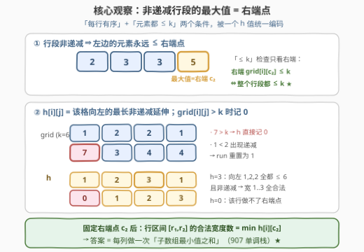
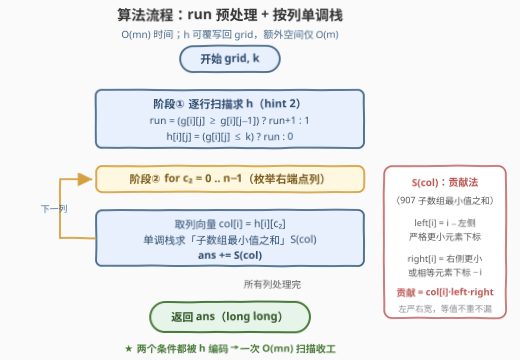
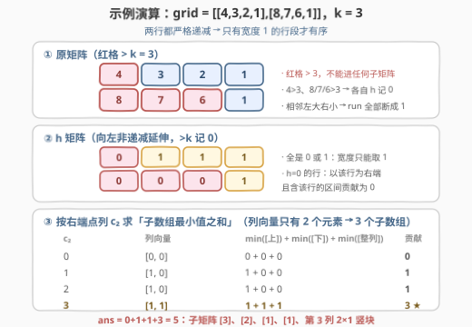

# 查找最大元素不超过 K 的有序子矩阵

- **题目名称**：查找最大元素不超过 K 的有序子矩阵
- **链接**：[3359. 查找最大元素不超过 K 的有序子矩阵 🔒](https://leetcode.cn/problems/find-sorted-submatrices-with-maximum-element-at-most-k/)
- **难度**：困难
- **标签**：栈、数组、矩阵、单调栈

## 1. 题目概述

> ⚠️ 本题为 LeetCode **付费题**（`isPaidOnly`），官方题面在 GraphQL 接口中 `translatedContent` 返回 `null`。下方题意描述、示例与约束依据官方示例用例（`jsonExampleTestcases`）、官方 hints（「Use monotonic stack」「Store for each element `grid[i][j]`, the longest increasing subarray of `grid[i]` ending at index `j`」）与函数签名 `countSubmatrices(grid, k) -> long` 整理还原，可能与官方题面有出入；算法与示例输出已用自洽代码（暴力对拍 3000 组随机数据）验证。

给定一个 $m \times n$ 的整数矩阵 `grid` 和一个整数 $k$。

如果一个子矩阵（矩阵中**连续若干行 × 连续若干列**围成的矩形区域）的**每一行从左到右都按非递减顺序排序**（允许相等），则称该子矩阵为**有序**子矩阵。

请统计并返回 `grid` 中满足以下两个条件的**非空**子矩阵的数目：

1. 该子矩阵是**有序**的（每一行非递减）；
2. 该子矩阵中的**最大元素不超过 $k$**。

**示例 1**：

```text
输入：grid = [[4,3,2,1],[8,7,6,1]], k = 3
输出：5
解释：两行都严格递减，宽度 ≥ 2 的行段必然含逆序 → 只统计宽度 1 的竖条；
     再扣除元素 > 3 的格子（4、8、7、6）：
     行 0 的 [3]、[2]、[1]，行 1 的 [1]，以及第 3 列的 2×1 竖块 [[1],[1]]，共 5 个。
```

**示例 2**：

```text
输入：grid = [[1,1,1],[1,1,1],[1,1,1]], k = 1
输出：36
解释：所有元素相等 → 每一行段都非递减（相等也算），且最大元素 1 ≤ k；
     行区间 6 种 × 列区间 6 种 = 36，即全部子矩阵。
```

**示例 3**：

```text
输入：grid = [[1]], k = 1
输出：1
```

**约束条件**（付费题，按返回类型 `long` 与题意推断重建）：

- $1 \le m, n \le 1000$（当 $m = n = 1000$ 且元素全同时，答案达 $\left(\frac{1000 \times 1001}{2}\right)^2 \approx 2.5 \times 10^{11}$，超出 `int` 范围，正是返回 `long` 的原因）
- $1 \le \text{grid}[i][j] \le 10^9$，$1 \le k \le 10^9$

> 💡 **审题关键**：两个条件看似独立——「每行有序」是结构约束，「最大元素 ≤ k」是数值约束。但**非递减**这个方向把它们焊在了一起：**行段的最大值必然出现在最右端**。于是「整个子矩阵 ≤ k」被改写成「每行的右端点 ≤ k」，全题的枢纽就在这一步。

---

## 2. 解题思路

### 2.1 暴力思路：四重枚举 + 逐格检查

最直觉的做法：枚举子矩形的四条边 $(r_1, r_2, c_1, c_2)$，共 $O(m^2 n^2)$ 个候选，每个再花 $O(mn)$ 检查「每行非递减 + 全部 ≤ k」——总计 $O(m^3 n^3)$，$m = n = 1000$ 时天文数字；即便用固定左上角、增量扩展的技巧把检查降到 $O(1)$，$O(m^2 n^2) \approx 10^{12}$ 依然不可行。

必须换视角：**不枚举子矩阵，而是把两个条件压成一个数，让每个子矩阵被「右端点」唯一索引**。

### 2.2 核心观察：非递减行段的最大值 = 右端点



**观察一（耦合枢纽）：行段非递减 ⇒ 左边元素永远 ≤ 右端点。**

固定子矩阵的右端点列 $c_2$ 与行区间 $[r_1, r_2]$，行 $i$ 的段 $[c_1, c_2]$ 非递减时，段内最大值就是 $\text{grid}[i][c_2]$。于是：

$$\text{整段} \le k \iff \text{grid}[i][c_2] \le k$$

「≤ k 检查」从 $O(w)$ 降到 $O(1)$——只需看每行的右端格子。反过来说，若段内藏着某个 $> k$ 的元素，非递减性会把它「顶」到右端，使右端也 $> k$，自动露馅。

**观察二（官方 hint 2）：定义 $h[i][j]$ = 行 $i$ 以 $j$ 结尾的最长非递减延伸长度；$\text{grid}[i][j] > k$ 时记 $h[i][j] = 0$。**

$$
h[i][j] = \begin{cases} 0 & \text{grid}[i][j] > k \\ \text{以 } j \text{ 结尾的最长非递减 run} & \text{否则} \end{cases}
$$

一个精妙的自洽性：若 $\text{grid}[i][j] \le k$，则该 run 内的所有元素 $\le \text{grid}[i][j] \le k$（非递减！），**run 内不需要再检查任何数值**。$h$ 一个数同时编码了两个条件：

- 行 $i$ 的段 $[c_2 - w + 1,\ c_2]$ 有序且全部 $\le k$ $\iff$ $w \le h[i][c_2]$；
- $h = 0$ 的行：该格 $> k$，以它为右端（或包含它）的行段全部非法。

**观察三（按右端点分解）：固定右端点列 $c_2$ 与行区间 $[r_1, r_2]$，合法宽度数 = 区间内 $h$ 的最小值。**

宽度 $w$ 合法 $\iff$ 每一行都满足 $w \le h[i][c_2]$ $\iff$ $w \le \min_{r_1 \le i \le r_2} h[i][c_2]$。宽度可取 $1 \dots \min h$，每个宽度唯一对应一个左端点 $c_1 = c_2 - w + 1$，互不相同、不重不漏。于是：

$$
\text{ans} = \sum_{c_2 = 0}^{n-1}\ \sum_{0 \le r_1 \le r_2 < m} \min_{r_1 \le i \le r_2} h[i][c_2]
$$

内层求和正是 [907. 子数组的最小值之和](../0901-1000/907_子数组的最小值之和.md)——**把矩阵的每一列看成一根柱状图，对每根柱状图求「所有纵向子数组的最小值之和」**。这就是官方 hint 1「Use monotonic stack」的落点，也与相似题 [85. 最大矩形](../0001-0100/85_最大矩形.md) 共享同一套直方图骨架。

### 2.3 算法流程图



两个阶段，均为线性扫描：

1. **预处理 $h$**（hint 2）：逐行从左到右扫，维护游程 `run`——`grid[i][j] < grid[i][j-1]`（出现递减）则重置为 1，否则 +1；`grid[i][j] > k` 则 $h$ 记 0，否则记 `run`。
2. **按右端点列求和**（hint 1）：对每列 $c_2$ 取列向量 $\text{col}[i] = h[i][c_2]$，用 907 的**贡献法**单调栈求 $\sum \min$：$left[i]$ 为 $i$ 到左侧**严格更小**元素的距离，$right[i]$ 为 $i$ 到右侧**更小或相等**元素的距离，贡献 $= \text{col}[i] \times left[i] \times right[i]$（左严右宽，等值不重不漏），累加进 `ans`。

### 2.4 示例演算



以示例 1 `grid = [[4,3,2,1],[8,7,6,1]]`，$k = 3$ 为例：

**第一步（求 $h$）**：两行都严格递减，`run` 处处为 1；再按「$> k$ 记 0」过滤：

| grid | h |
|------|---|
| $\begin{bmatrix}4 & 3 & 2 & 1 \\ 8 & 7 & 6 & 1\end{bmatrix}$ | $\begin{bmatrix}0 & 1 & 1 & 1 \\ 0 & 0 & 0 & 1\end{bmatrix}$ |

**第二步（逐列求「子数组最小值之和」）**：每列只有 2 个元素、3 个纵向子数组：

| $c_2$ | 列向量 | $\min[$上$]$ + $\min[$下$]$ + $\min[$整列$]$ | 贡献 |
|-------|--------|----------------------------------------------|------|
| 0 | $[0, 0]$ | $0 + 0 + 0$ | 0 |
| 1 | $[1, 0]$ | $1 + 0 + 0$ | 1 |
| 2 | $[1, 0]$ | $1 + 0 + 0$ | 1 |
| 3 | $[1, 1]$ | $1 + 1 + 1$ | 3 |

**答案** $= 0 + 1 + 1 + 3 = 5$ ✓，对应子矩阵 $[3]$、$[2]$、$[1]$（行 0）、$[1]$（行 1）、第 3 列的 $2 \times 1$ 竖块。

> 💡 **顺带验证示例 2**（全 1 矩阵，$k=1$）：每行 run 为 $[1,2,3]$，故 $h$ 三行全为 $[1,2,3]$；三列向量 $[1,1,1]$、$[2,2,2]$、$[3,3,3]$ 的子数组 min 之和分别为 $6 \times 1$、$6 \times 2$、$6 \times 3$（3 个元素共 6 个子数组），总计 $6 + 12 + 18 = 36$ ✓。

---

## 3. 参考代码

### C++

```cpp
class Solution {
  public:
    long long countSubmatrices(vector<vector<int>>& grid, int k) {
        int m = grid.size(), n = grid[0].size();
        // 阶段①：h[i][j] = 以 j 结尾的最长非递减延伸；>k 记 0
        vector<vector<int>> h(m, vector<int>(n));
        for (int i = 0; i < m; ++i) {
            int run = 0;
            for (int j = 0; j < n; ++j) {
                run = (j == 0 || grid[i][j] < grid[i][j - 1]) ? 1 : run + 1;
                h[i][j] = grid[i][j] <= k ? run : 0;
            }
        }

        // 阶段②：按右端点列，单调栈求「子数组最小值之和」（907 贡献法）
        long long ans = 0;
        vector<int> col(m), left(m), right(m);
        for (int j = 0; j < n; ++j) {
            for (int i = 0; i < m; ++i) col[i] = h[i][j];

            stack<int> st;                        // left[i]：到左侧第一个严格更小的距离
            for (int i = 0; i < m; ++i) {
                while (!st.empty() && col[st.top()] >= col[i]) st.pop();
                left[i] = i - (st.empty() ? -1 : st.top());
                st.push(i);
            }
            while (!st.empty()) st.pop();         // right[i]：到右侧第一个更小或相等的距离
            for (int i = m - 1; i >= 0; --i) {
                while (!st.empty() && col[st.top()] > col[i]) st.pop();
                right[i] = (st.empty() ? m : st.top()) - i;
                st.push(i);
            }
            for (int i = 0; i < m; ++i)
                ans += 1LL * col[i] * left[i] * right[i];
        }
        return ans;
    }
};
```

### Python

```python
class Solution:
    def countSubmatrices(self, grid: List[List[int]], k: int) -> int:
        m, n = len(grid), len(grid[0])
        # 阶段①：h[i][j] = 以 j 结尾的最长非递减延伸；>k 记 0
        h = [[0] * n for _ in range(m)]
        for i in range(m):
            run = 0
            for j in range(n):
                run = 1 if (j == 0 or grid[i][j] < grid[i][j - 1]) else run + 1
                h[i][j] = run if grid[i][j] <= k else 0

        # 阶段②：按右端点列，单调栈求「子数组最小值之和」（907 贡献法）
        ans = 0
        for j in range(n):
            col = [h[i][j] for i in range(m)]
            left, right = [0] * m, [0] * m
            st = []                               # left：到左侧第一个严格更小的距离
            for i in range(m):
                while st and col[st[-1]] >= col[i]:
                    st.pop()
                left[i] = i - (st[-1] if st else -1)
                st.append(i)
            st = []                               # right：到右侧第一个更小或相等的距离
            for i in range(m - 1, -1, -1):
                while st and col[st[-1]] > col[i]:
                    st.pop()
                right[i] = (st[-1] if st else m) - i
                st.append(i)
            ans += sum(c * l * r for c, l, r in zip(col, left, right))
        return ans
```

> 💡 **实现要点**：
> - **返回类型必须是 `long long` / Python 天然大整数**：$m = n = 1000$ 全同值时答案约 $2.5 \times 10^{11}$，`int` 会静默溢出；C++ 中贡献式务必先 `1LL *` 转型再乘。
> - **run 的重置条件**是 `grid[i][j] < grid[i][j-1]`（出现严格递减才断），相等要续接——「非递减」允许相等，示例 2 的全 1 矩阵正卡这一点。
> - **空间可压到 $O(m)$**：$h$ 算完后原矩阵不再需要，可用一个标量暂存左邻原值、把 $h$ 直接覆写回 `grid`；栈与列向量本身只要 $O(m)$。

---

## 4. 复杂度分析

| 维度 | 复杂度 | 说明 |
|------|--------|------|
| 时间 | $O(mn)$ | 阶段① 逐格 $O(1)$ 递推；阶段② 每列单调栈均摊 $O(m)$（每元素至多入栈出栈各一次），$n$ 列合计 $O(mn)$ |
| 空间 | $O(mn)$ | $h$ 矩阵；若覆写回 `grid` 则降至 $O(m)$（列向量 + 单调栈） |
| 对照：四重枚举暴力 | $O(m^3 n^3)$ | $O(m^2 n^2)$ 个子矩阵 × $O(mn)$ 逐格检查，$m=n=1000$ 时约 $10^{18}$ |
| 对照：增量枚举 | $O(m^2 n^2)$ | 固定左上角增量扩展，仍约 $10^{12}$，不可行 |

---

## 5. 扩展：直方图单调栈家族的「转置镜像」

本题与 [1504. 统计全 1 子矩形](../1501-1600/1504_统计全1子矩形.md) 是同一骨架的**互为转置**——1504 逐行构建**纵向**高度直方图（向上连续 1 的个数），按「底边所在行」计数；本题逐列取**横向**延伸直方图（向左非递减的长度），按「右端点所在列」计数。两者最终都坍缩到同一个一维子问题：$\sum_{\text{子数组}} \min$（907）。

| 题目 | 「柱子」是什么 | 直方图方向 | 单调栈结算目标 |
|------|---------------|-----------|----------------|
| [84. 柱状图中最大的矩形](../0001-0100/84_柱状图中最大的矩形.md) | 给定高度 | 一维 | $\max$ 面积 |
| [85. 最大矩形](../0001-0100/85_最大矩形.md) | 纵向连续 1 | 逐行 | $\max$ 面积 |
| 1504 全 1 子矩形计数 | 纵向连续 1 | 逐行 | $\sum \min$（计数） |
| [907. 子数组的最小值之和](../0901-1000/907_子数组的最小值之和.md) | 元素本身 | 一维 | $\sum \min$ |
| **3359 本题** | **横向非递减延伸 $h$** | **逐列** | $\sum \min$（计数） |

本题在这家族里的增量是**条件耦合**：1504 的「全 1」条件天然可被高度 0 表达；而本题「每行有序 + 全部 ≤ k」两个条件靠「非递减行段最大值 = 右端」这个观察合并进同一个 $h$。若把定义改成**行非递增有序**，则最大值钉在**左端**——应改按左端点列枚举、$h$ 改为「向右非递减延伸」，整套代码镜像翻转即可；但若同时要求**行和列都有序**，两个方向的约束相互纠缠，按列独立分解的思路就失效了，需要另起炉灶。

---

## 6. 面试要点

1. **「每行有序」和「最大元素 ≤ k」两个条件是怎么耦合的？**

   > 行段非递减 ⇒ 段内最大值 = 最右端元素。于是对固定右端点 $c_2$ 的子矩阵，「所有元素 ≤ k」等价于「每行的 $\text{grid}[i][c_2] \le k$」——数值约束被结构约束搬运到了右端一列上，检查成本从整个矩阵降到每行一个格子。

2. **$h$ 数组的定义是什么？$h = 0$ 意味着什么？**

   > $h[i][j]$ = 行 $i$ 以 $j$ 结尾的最长非递减 run 长度，$\text{grid}[i][j] > k$ 时记 0。$h = 0$ 表示该行不能以 $j$ 为右端点（元素超 $k$）；在纵向 min 里它会拖垮包含该行的整个行区间（min = 0 → 贡献 0），恰好把「含超限元素的子矩阵」全部排除，无需单独处理。

3. **为什么固定右端点 $c_2$ 后，一个行区间的贡献恰是 $\min h$？**

   > 行区间 $[r_1, r_2]$ 合法要求每行宽度 $w \le h[i][c_2]$，即 $w \le \min h$；宽度取 $1 \dots \min h$ 中每个值时左端点 $c_1 = c_2 - w + 1$ 唯一确定，故贡献恰为 $\min h$ 个。对行区间求和就得到「列向量的子数组最小值之和」。

4. **单调栈求 $\sum \min$ 时，左右边界为什么一侧严格、一侧非严格？**

   > 处理等值重复：若两侧都取「严格更小」，同时包含两个等值最小元的子数组会被重复计数；左边界弹 $\ge$（留严格更小）、右边界弹 $>$（留更小或相等），每个子数组只被其中一个等值元素管辖，不重不漏。这是 907 的经典细节。

5. **为什么返回类型是 `long` 而不是 `int`？什么时候溢出？**

   > 子矩阵总数上界为 $\frac{m(m+1)}{2} \cdot \frac{n(n+1)}{2}$。$m = n = 1000$ 且元素全同（且 $\le k$）时约 $2.5 \times 10^{11}$，超出 32 位 `int` 上限 $2.1 \times 10^9$。C++ 必须用 `long long`，且贡献式先转型再乘。

6. **和 1504（统计全 1 子矩形）相比，本题难在哪里？**

   > 骨架同为「直方图 + $\sum \min$ 计数」，但 1504 的柱高（连续 1 个数）是现成定义；本题需要自己**造出柱高 $h$**——洞察到非递减行段的最大值在右端，才能把「有序」与「≤ k」两个条件压进同一个游程长度里，再想到按右端点列（而不是按行）做直方图分解。方向选择错了（按行），条件就无法解耦。

> 💡 **一句话总结**：行有序把每行的最大值钉在右端，于是 $k$ 只查右端；横向游程 $h$ 一个数编码「有序 + ≤ k」，按右端点列拎出直方图后，答案就是每列的「子数组最小值之和」——907 的单调栈贡献法收尾，$O(mn)$ 一次扫描。

---

## 7. 同类练习题

- [907. 子数组的最小值之和](https://leetcode.cn/problems/sum-of-subarray-minimums/)（[站内题解](../0901-1000/907_子数组的最小值之和.md)）：本题每列的核心子问题母题，单调栈贡献法 + 左严右宽去重细节全在这里
- [1504. 统计全 1 子矩形](https://leetcode.cn/problems/count-submatrices-with-all-ones/)（[站内题解](../1501-1600/1504_统计全1子矩形.md)）：同骨架的「转置镜像」——纵向直方图按底边行计数，对照体会方向选择的由来
- [85. 最大矩形](https://leetcode.cn/problems/maximal-rectangle/)（[站内题解](../0001-0100/85_最大矩形.md)）：官方相似题，直方图单调栈求最大面积的招牌应用
- [84. 柱状图中最大的矩形](https://leetcode.cn/problems/largest-rectangle-in-histogram/)（[站内题解](../0001-0100/84_柱状图中最大的矩形.md)）：整个家族的一维原点，找「左右第一个更小」的单调栈模板
- [2104. 子数组范围和](https://leetcode.cn/problems/sum-of-subarray-ranges/)：907 的进阶变体，同时贡献计数最大值与最小值，巩固「按元素结算管辖范围」的思路
