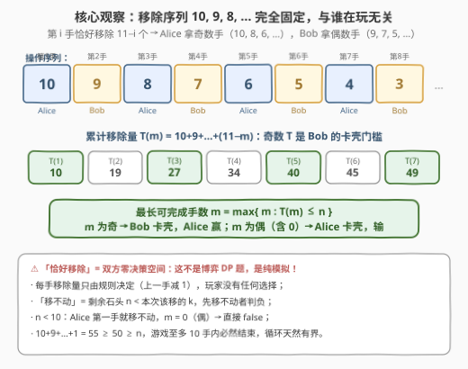
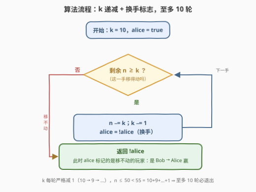
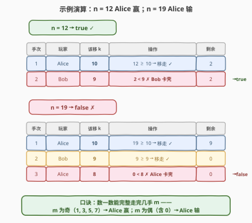
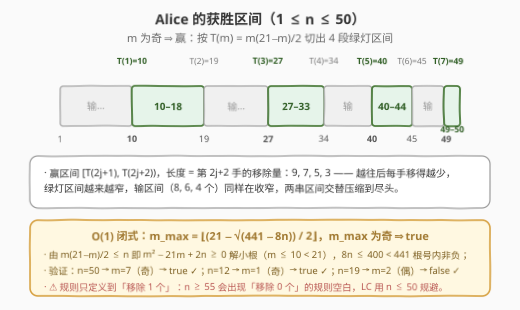

# 移除石头游戏

- **题目名称**：移除石头游戏
- **链接**：[3360. 移除石头游戏](https://leetcode.cn/problems/stone-removal-game/)
- **难度**：简单
- **标签**：数学、模拟、博弈

## 1. 题目概述

Alice 和 Bob 玩一个游戏：两人轮流从一堆石头中移除石头，Alice 先操作，规则如下：

- Alice 在第一次操作中移除**恰好** 10 个石头；
- 接下来的每次操作中，每位玩家移除的石头数**恰好**为另一位玩家上一次操作的石头数减 1。

第一位无法进行操作的玩家输掉游戏。给你一个正整数 $n$ 表示一开始石头的数目，如果 Alice 赢得游戏，请返回 `true`，否则返回 `false`。

**示例 1**：

```text
输入：n = 12
输出：true
解释：Alice 第一次操作移除 10 个石头，剩下 2 个石头给 Bob；
     Bob 无法移除 9 个石头，所以 Alice 赢得游戏。
```

**示例 2**：

```text
输入：n = 1
输出：false
解释：Alice 无法移除 10 个石头，所以 Alice 输掉游戏。
```

**约束条件**：

- $1 \le n \le 50$

> 💡 **读题关键**：① 「恰好移除」意味着**双方都没有任何决策空间**——第 $i$ 手移多少完全由规则定死（$10, 9, 8, \dots$），所以这不是博弈 DP / 搜索题，而是**纯模拟**；② 「无法操作」= 剩余石头数小于本手该移的数量，先移不动者判负；③ $10+9+\dots+1 = 55 \ge 50$，游戏至多 10 手内必然结束，怎么写都不会超时。

---

## 2. 解题思路

### 2.1 朴素思路：照题意逐手模拟

最直接的做法是把游戏过程原样「演」一遍：维护三个量——剩余石头 $n$、本手该移的数量 $k$（初始 10）、轮到谁（初始 Alice）。每手判断 $n \ge k$ 是否成立：成立则 $n \gets n-k$、$k \gets k-1$、换手；不成立则当前玩家判负。由于双方都无决策，整局游戏的过程是**唯一确定**的，模拟即正解——官方 hint 也明说「数据范围小到暴力可行」。

### 2.2 核心观察：操作序列固定 → 胜负等价于「最长可完成手数的奇偶」



三条观察：

**观察一：移除序列与「谁在玩」无关。** 第 $i$ 手恰好移除 $11-i$ 个：第 1 手 10 个、第 2 手 9 个、第 3 手 8 个……Alice 拿到第 $1, 3, 5, \dots$ 手（移 $10, 8, 6, \dots$），Bob 拿到第 $2, 4, 6, \dots$ 手（移 $9, 7, 5, \dots$）。游戏没有分支，胜负由 $n$ 唯一决定。

**观察二：胜负 = 最长可完成手数 $m$ 的奇偶。** 设前 $m$ 手的累计移除量为

$$T(m) = 10 + 9 + \dots + (11-m) = \frac{m(21-m)}{2},$$

则最长可完成手数 $m = \max\{\, m : T(m) \le n \,\}$。第 $m+1$ 手的玩家「移不动」而判负：**$m$ 为偶数（含 0）时轮到 Alice → Alice 输；$m$ 为奇数时轮到 Bob → Alice 赢**。

**观察三：循环天然有界。** $k$ 每轮严格减 1，而 $n \le 50 < 55 = T(10)$，模拟循环至多 10 轮，实打实的 $O(1)$。

> ⚠️ **边界**：$n < 10$ 时 Alice 第一手就移不动，$m = 0$（偶）→ 直接 `false`。这就是为什么 $n = 1 \sim 9$ 全部输出 `false`，而 $n = 10$ 是最小获胜点——手里必须至少攒够 10 颗石头才开得了局。

### 2.3 算法流程图



$k$ 初始 10、`alice` 标志初始 `true`（下一个该操作的人是 Alice）；每轮判 $n \ge k$：成立则扣减 $n$、$k$ 自减 1、`alice` 翻转（换手），回到判定；不成立则循环终止——此时 `alice` 标记的正是「轮到却移不动」的玩家，返回 `!alice`。

### 2.4 示例演算



- **$n = 12$**：Alice 移 10（剩 2）→ Bob 该移 9 但只剩 2，卡壳 → `true`；
- **$n = 19$**：Alice 移 10（剩 9）→ Bob 移 9（剩 0）→ Alice 该移 8 但只剩 0，卡壳 → `false`；
- **$n = 50$**（约束上界）：$10/9/8/7/6/5$ 六手走完（累计 45，剩 5）→ Alice 移 4（剩 1）→ Bob 该移 3 但只剩 1 → `true`。第 7 手收尾，$m = 7$ 为奇数，与观察二完全吻合。

---

## 3. 参考代码

### C++

```cpp
class Solution {
  public:
    bool canAliceWin(int n) {
        int k = 10;          // 本手该移除的数量：10, 9, 8, ...
        bool alice = true;   // 当前是否轮到 Alice 操作
        while (n >= k) {     // 这手移得动才继续
            n -= k;
            --k;
            alice = !alice;  // 换手
        }
        return !alice;       // 轮到 Bob 移不动 → Alice 赢
    }
};
```

### Python

```python
class Solution:
    def canAliceWin(self, n: int) -> bool:
        k, alice = 10, True
        while n >= k:
            n -= k
            k -= 1
            alice = not alice
        return not alice


# 写法二：不设换手标志，直接数能完整走完几手，判奇偶
class Solution:
    def canAliceWin(self, n: int) -> bool:
        m = total = 0
        for k in range(10, 0, -1):
            if total + k > n:
                break
            total += k
            m += 1
        return m & 1 == 1
```

> 💡 **实现细节**：① `return !alice` 的含义——退出循环时 `alice` 标记的是「轮到却移不动」的玩家，若那是 Bob（`alice == false`）则 Alice 赢，即返回 `not alice`；$n = 1$ 时循环一次都不进，`alice` 仍为 `true` → 返回 `false`，边界天然正确；② 写法二把「换手」抽象成「数手数 $m$ 判奇偶」，两种写法完全等价，都源于观察二；③ 千万别把「恰好」脑补成「至多」——本题没有任何选择余地，一旦允许少拿就直接变成另一道题了。

---

## 4. 复杂度分析

| 维度 | 复杂度 | 说明 |
|------|--------|------|
| 时间 | $O(1)$ | 循环至多 10 轮（$T(10) = 55 \ge 50 \ge n$），常数次整数运算 |
| 空间 | $O(1)$ | 只维护 $n$、$k$、`alice` 三个变量 |
| 数据规模 | $n \le 50$ | 操作序列至多 10 手，任何写法都绰绰有余 |

---

## 5. 扩展：获胜区间与 O(1) 闭式



由观察二，Alice 的获胜条件「$m$ 为奇数」可以展开为一串**左闭右开区间** $[T(2j+1),\; T(2j+2))$：

$$[10, 19) \;\cup\; [27, 34) \;\cup\; [40, 45) \;\cup\; [49, 52)$$

在 $n \le 50$ 的约束下即 $[10,18] \cup [27,33] \cup [40,44] \cup [49,50]$。注意绿灯区间长度 $9, 7, 5, 3$ 逐段收窄——因为相邻门槛 $T(2j+2)-T(2j+1)$ 恰是第 $2j+2$ 手的移除量，越往后每手移得越少。

把判定压成一行闭式：$m(21-m) \le 2n$ 即 $m^2 - 21m + 2n \ge 0$，取小根（$m \le 10 < 21$）得 $m \le \frac{21 - \sqrt{441-8n}}{2}$，于是

$$m_{\max} = \left\lfloor \frac{21 - \sqrt{441 - 8n}}{2} \right\rfloor, \qquad \text{Alice 赢} \iff m_{\max} \text{ 为奇数}.$$

```python
import math

class Solution:
    def canAliceWin(self, n: int) -> bool:
        m = (21 - math.isqrt(441 - 8 * n)) // 2   # 候选值：isqrt 向下取整，可能偏大 1
        if m * (21 - m) > 2 * n:                  # 校正一步：T(m) > n 则回退
            m -= 1
        return m & 1 == 1
```

两个实现细节：① $8n \le 400 < 441$，根号内恒非负；② `isqrt(441-8n)` 是对 $\sqrt{441-8n}$ **向下取整**，$21 - \lfloor\sqrt{x}\rfloor$ 可能比 $21 - \sqrt{x}$ 大，导致候选 $m$ 偏大 1（如 $n=6$ 时算出 1，实际 $m=0$），所以要用定义式 $T(m) \le n$ 回验一次。验证：$n=50 \to m=7$（奇）→ `true` ✓，$n=19 \to m=2$（偶）→ `false` ✓。

> ⚠️ **规则的天花板**：闭式只在 $n \le 54$（$m \le 9$）内无歧义——移除量只定义到第 10 手的「1 个」，$n \ge 55$ 会出现「下一手移除 0 个」的规则空白（移 0 个算不算操作？）。LeetCode 用 $n \le 50$ 的约束恰好规避了这段灰色地带；面试中主动指出这一点是很好的加分项。

---

## 6. 面试要点

1. **为什么这题不需要博弈 DP 或 sg 函数？**

   - 因为双方**均无决策空间**：每手移除量被规则唯一确定为 $10, 9, 8, \dots$，游戏轨迹唯一，不存在「最优策略」问题。只有当玩家能从多个合法操作中选择时（如 877 石子游戏可以从任一端取），才需要 Minimax / 区间 DP / sg 函数。

2. **循环为什么至多 10 轮？会不会死循环？**

   - $k$ 每轮严格减 1（$10 \to 9 \to \dots$），循环变量单调递减；且 $n \le 50 < 55 = T(10)$，最多走完 10 手后必然 $n < k$ 退出。单调变化的循环变量天然保证终止。

3. **`return !alice` 为什么是对的？初始值为什么这样设？**

   - `alice` 标记「下一个该操作的人」，Alice 先手所以初始 `true`；退出循环时该玩家移不动而判负，若他是 Bob（`alice == false`）则 Alice 赢，即返回 `not alice`。$n < 10$ 时循环一次都不进，直接返回 `false`，无需特判。

4. **如果 n 的上界放大，你的解法还成立吗？**

   - 在 $n \le 54$ 内，循环版仍是 $O(1)$、闭式版一步算出；$n \ge 55$ 后规则出现「移除 0 个」的空白（第 11 手该移 $1-1=0$ 个），需要先和面试官澄清规则——「移除 0 个是否算有效操作」「是否停止递减」——再谈算法。主动暴露边界比闷头假设更专业。

5. **Alice 获胜区间的间隔有什么规律？为什么？**

   - 赢区间 $[T(2j+1), T(2j+2))$ 长度为 $9, 7, 5, 3$（= 第 $2j+2$ 手的移除量），夹在中间的输区间长度 $8, 6, 4$ 同样递减：越往后每手移得越少，两个门槛靠得越近，胜负切换越来越快，直到规则尽头。

---

## 7. 同类练习题

- [292. Nim 游戏](https://leetcode.cn/problems/nim-game/)（[站内题解](../0201-0300/292_Nim游戏.md)）：巴什博弈原型，先手必胜当且仅当 $n \bmod 4 \ne 0$——同款「胜负由 $n$ 唯一决定、找规律即正解」
- [1025. 除数博弈](https://leetcode.cn/problems/divisor-game/)（[站内题解](../1001-1100/1025_除数博弈.md)）：胜负只依赖 $n$ 的奇偶（偶数则先手赢），规律判定型博弈的极简版
- [877. 石子游戏](https://leetcode.cn/problems/stone-game/)（[站内题解](../0801-0900/877_石子游戏.md)）：同名的「真博弈」——玩家可自由决策取哪端，需要区间 DP + Minimax，正好对照本题的「零决策纯模拟」
- [486. 预测赢家](https://leetcode.cn/problems/predict-the-winner/)（[站内题解](../0401-0500/486_预测赢家.md)）：博弈 DP 标准入门，净得分差递推，与 877 同模板
- [2029. 石子游戏 IX](https://leetcode.cn/problems/stone-game-ix/)（[站内题解](../2001-2100/2029_石子游戏IX.md)）：博弈 + 分类讨论 + 模拟，练「把规则逐字走透」的功夫
