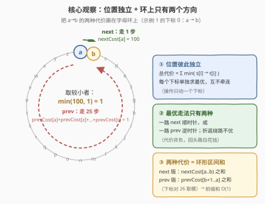
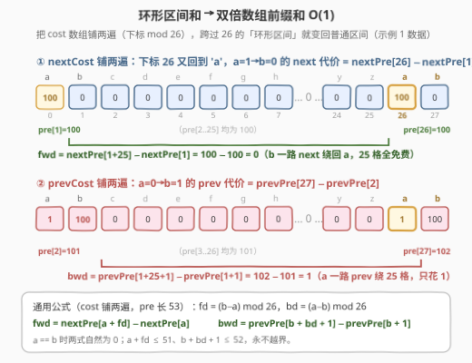
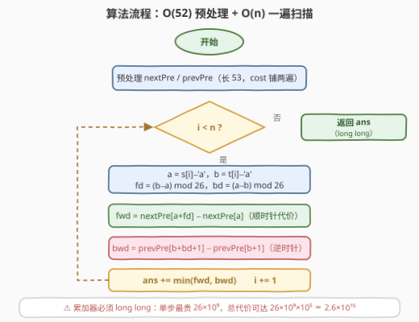
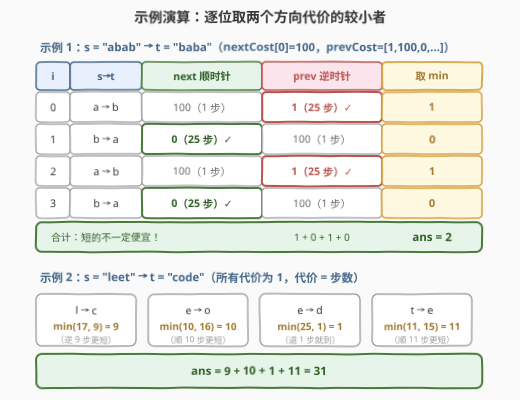

# LeetCode 两个字符串的切换距离 题解

- **关联**：[2515. 到目标字符串的最短距离](https://leetcode.cn/problems/shortest-distance-to-target-string-in-a-circular-array/)（[站内题解](../2501-2600/2515_到目标字符串的最短距离.md)）是本题「每步代价恒为 1」的退化版——那里两方向**步数**取 min，这里两方向**代价和**取 min

## 1. 题目概述

- **标题 / 题号**：两个字符串的切换距离（#3361，medium）
- **链接**：https://leetcode.cn/problems/shift-distance-between-two-strings/
- **难度**：中等
- **标签**：数组、字符串、前缀和

**题意**：给你两个长度相同的字符串 `s` 和 `t`，以及两个长度为 26 的整数数组 `nextCost` 和 `previousCost`。

一次操作中，你可以选择 `s` 中的一个下标 $i$，执行以下操作**之一**：

- 将 `s[i]` 切换为字母表中的**下一个**字母（`'z'` 切换后得到 `'a'`），代价为 `nextCost[j]`，其中 $j$ 是**切换前** `s[i]` 在字母表中的下标；
- 将 `s[i]` 切换为字母表中的**上一个**字母（`'a'` 切换后得到 `'z'`），代价为 `previousCost[j]`，其中 $j$ 同样是切换前 `s[i]` 的下标。

**切换距离**定义为将 `s` 变为 `t` 的**最少**操作代价总和。请你返回从 `s` 到 `t` 的切换距离。

**示例 1**：

```text
输入：s = "abab", t = "baba",
     nextCost = [100,0,0,...,0], previousCost = [1,100,0,...,0]
输出：2
解释：下标 0、2 把 'a' 向后绕 25 步变 'b'，各花 1；下标 1、3 把 'b' 向前绕 25 步变 'a'，各花 0。
```

**示例 2**：

```text
输入：s = "leet", t = "code", nextCost = [1]*26, previousCost = [1]*26
输出：31
解释：l→c 逆走 9 步，e→o 顺走 10 步，e→d 逆走 1 步，t→e 顺走 11 步，合计 9+10+1+11 = 31。
```

**约束**：

- $1 \le s.length = t.length \le 10^5$
- `s` 和 `t` 都只包含小写英文字母
- $nextCost.length = previousCost.length = 26$
- $0 \le nextCost[i], previousCost[i] \le 10^9$

> 💡 **读题关键**：① 一次操作只动**一个**下标、方向二选一——不同下标之间毫无耦合，可以逐位独立求最优再求和；② 代价挂在**出发字母**上（不是到达字母）：从 `'a'` 向后一步付的是 `previousCost[0]`；③ 两个方向都能**绕环**（`z→a` / `a→z`），所以从 `a` 到 `b` 顺、逆两个方向都存在一条完整路径；④ 代价上限 $26 \times 10^9$、总和上限约 $2.6 \times 10^{15}$——**必须用 64 位整数**。

## 2. 解题思路

### 2.1 朴素思路：逐位沿环走步累加

每次操作只影响一个下标，所以总答案就是每个下标的最优代价之和。对单个下标，设出发字母为 $a$、目标字母为 $b$（均为 $0 \sim 25$ 的下标），最直接的写法是**模拟走环**：从 $a$ 出发一路 `next` 累加 `nextCost` 直到撞到 $b$，再一路 `prev` 累加 `previousCost` 直到撞到 $b$，取两者较小值。每个方向至多走 25 步，总量 $O(26n) \approx 2.6 \times 10^6$，复杂度上其实能过。

问题在于：每个位置都在重复做「沿环求一段和」，而这段和本质上是一个**环形区间和**——起点 $a$、终点 $b$ 一旦给定，区间就完全确定，与位置无关。同一个环形区间和被反复手搓，正是前缀和要消灭的重复计算；而且逐步 `% 26` 的绕环边界（`z` 接 `a`）也是典型的下标错位重灾区。

### 2.2 核心观察：位置独立 + 环上只有两个方向



三个观察环环相扣：

**观察一（位置独立）**：操作只动一个下标，各下标的最优变换互不影响，于是

$$ans = \sum_{i} \min\big(\,\text{cost}(s[i] \to t[i])\,\big)$$

问题被拆成 $n$ 个同构的「单字母对」子问题，每个子问题只依赖 $(a, b)$ 两个 0～25 的下标。

**观察二（最优走法只有两种）**：把 26 个字母看成一个**环**，从 $a$ 到 $b$ 的任意一条不回头路径，要么一路 `next`（顺时针），要么一路 `prev`（逆时针）——分别对应环上两段互补的弧。折返、绕圈只会重复付费（代价非负，见第 5 节的严格证明）。于是单字母对的代价就是两个**环形区间和**的较小值：

$$\text{fwd} = \sum_{k \in [a,\, b) \bmod 26} nextCost[k] \qquad \text{bwd} = \sum_{k \in [b+1,\, a] \bmod 26} previousCost[k]$$

> ⚠️ **两个方向的付费区间不对称**：`next` 方向付费的是**出发字母序列** $a, a+1, \dots, b-1$（半开区间 $[a, b)$，到达 $b$ 不付费）；`prev` 方向付费的是 $a, a-1, \dots, b+1$（即闭区间 $[b+1, a]$，同样到达 $b$ 不付费）。这正是「代价挂在出发字母上」的直接推论。

**观察三（环形区间和 → 双倍数组前缀和）**：把 cost 数组**铺两遍**成长度 52 的双倍数组（下标对 26 取模），任何跨过 `z→a` 接缝的环形区间都变成双倍数组上的普通区间，一次作差 $O(1)$ 得到区间和：



记 $f = (b - a + 26) \bmod 26$（顺时针步数），$p = (a - b + 26) \bmod 26$（逆时针步数），则

$$\text{fwd} = nextPre[a + f] - nextPre[a] \qquad \text{bwd} = prevPre[b + p + 1] - prevPre[b + 1]$$

其中 `nextPre` / `prevPre` 是对应双倍数组的前缀和（长 53）。$a = b$ 时 $f = p = 0$，两式**自然为 0**，无需特判；下标上界 $a + f \le 51$、$b + p + 1 \le 52$，永不越界。

> ⚠️ **三个高频翻车点**：
>
> - **付费区间端点记错**——`prev` 方向是 $[b+1,\, a]$ 不是 $[b, a)$，也不是 $[b, a]$（到站不买票）；写代码时直接背公式 $\text{bwd} = prevPre[b + p + 1] - prevPre[b + 1]$，对齐「半开区间作差」的前缀和惯例；
> - **累加器用 `int`**——单步最贵 $26 \times 10^9$ 已爆 `int`，总和约 $2.6 \times 10^{15}$，C++ 必须 `long long`；
> - **绕环判断手写分支**（`if (a < b) ... else ...`）——两条分支四段区间极易写串，双倍数组一举消灭所有分支。

### 2.3 算法流程图



两阶段：先 $O(52)$ 预处理两张双倍前缀和表；再一遍扫描 `s`、`t`，每个位置算出 $f, p$ 后两次作差取 `min` 累加。全程无分支、无取模循环。

### 2.4 示例演算



**示例 1** `s = "abab" → t = "baba"`，`nextCost[0] = 100` 其余为 0，`previousCost = [1, 100, 0, …]`：

1. 下标 0：$a=0 \to b=1$。顺走 1 步付 `nextCost[0] = 100`；逆走 25 步付 `previousCost[0] + previousCost[25] + \dots + previousCost[2] = 1 + 0 = 1$ → 取 **1**；
2. 下标 1：$a=1 \to b=0$。顺走 25 步付 `nextCost[1..25] = 0`；逆走 1 步付 `previousCost[1] = 100` → 取 **0**；
3. 下标 2、3 与下标 0、1 相同 → 再加 $1 + 0$；
4. 合计 $1 + 0 + 1 + 0 = \mathbf{2}$ ✓。

> 💡 **直觉陷阱**：顺走只要 1 步却要价 100，逆走 25 步反而只要 1——**步数少 ≠ 代价小**，代价由沿途字母的费率决定，这正是本题不能只看「最短步数」（2515 的做法）而必须算两段区间和的原因。

**示例 2** `s = "leet" → t = "code"`，所有费率为 1（代价退化为步数）：

| 变换 | 顺时针 $f$ | 逆时针 $p$ | 取 min |
|------|-----------|-----------|--------|
| l→c | 17 | 9 | 9 |
| e→o | 10 | 16 | 10 |
| e→d | 25 | 1 | 1 |
| t→e | 11 | 15 | 11 |

合计 $9 + 10 + 1 + 11 = \mathbf{31}$ ✓。

## 3. 参考代码

### C++

```cpp
class Solution {
  public:
    long long shiftDistance(string s, string t, vector<int>& nextCost, vector<int>& previousCost) {
        long long nextPre[53] = {0}, prevPre[53] = {0};   // 双倍数组前缀和，pre[k+1] = pre[k] + cost[k%26]
        for (int k = 0; k < 52; k++) {
            nextPre[k + 1] = nextPre[k] + nextCost[k % 26];
            prevPre[k + 1] = prevPre[k] + previousCost[k % 26];
        }
        long long ans = 0;
        for (int i = 0; i < (int)s.size(); i++) {
            int a = s[i] - 'a', b = t[i] - 'a';
            int f = (b - a + 26) % 26;                    // 顺时针步数
            int p = (a - b + 26) % 26;                    // 逆时针步数
            long long fwd = nextPre[a + f] - nextPre[a];          // nextCost[a..b) 之和
            long long bwd = prevPre[b + p + 1] - prevPre[b + 1];  // prevCost[b+1..a] 之和
            ans += min(fwd, bwd);
        }
        return ans;
    }
};
```

### Python

```python
class Solution:
    def shiftDistance(self, s: str, t: str, nextCost: List[int], previousCost: List[int]) -> int:
        next_pre = [0] * 53                      # 双倍数组前缀和，pre[k+1] = pre[k] + cost[k%26]
        prev_pre = [0] * 53
        for k in range(52):
            next_pre[k + 1] = next_pre[k] + nextCost[k % 26]
            prev_pre[k + 1] = prev_pre[k] + previousCost[k % 26]

        ans = 0
        for x, y in zip(s, t):
            a, b = ord(x) - 97, ord(y) - 97
            f, p = (b - a) % 26, (a - b) % 26    # 顺 / 逆时针步数（Python % 恒非负）
            fwd = next_pre[a + f] - next_pre[a]          # nextCost[a..b) 之和
            bwd = prev_pre[b + p + 1] - prev_pre[b + 1]  # prevCost[b+1..a] 之和
            ans += min(fwd, bwd)
        return ans
```

> 💡 **实现细节**：① 前缀数组开长 53（双倍 52 格 + `pre[0]` 哨兵），`k % 26` 自动铺第二遍，不需要显式拼接；② $a = b$ 时 $f = p = 0$，两个公式自然得 0，省掉特判；③ C++ 里 `(b - a + 26) % 26` 的 `+26` 防负数取模（Python 的 `%` 恒非负可省）；④ 累加器 `long long`，见 2.2 的溢出分析。

## 4. 复杂度分析

| 维度 | 复杂度 | 说明 |
|------|--------|------|
| 时间 | $O(n + 26)$ | 预处理两张前缀和各 52 次累加；主循环每个位置 $O(1)$（两次作差 + 一次 `min`），$n = 10^5$ 时约十万次基本运算 |
| 空间 | $O(1)$ | 两张长 53 的前缀和表（与 $n$ 无关），其余只用常数变量 |
| 暴力对照 | $O(26n)$ | 逐位沿环两个方向各走至多 25 步，$\approx 2.6 \times 10^6$ 也能过，但每位重复求区间和且 `% 26` 边界易错；前缀和版把每位降到两次作差 |

## 5. 扩展：为什么折返一定不优？——26 个点的最短路视角

### 5.1 严格证明：最优走法必是「一路单调」

**观察二**断言「折返、绕圈不优」，这里给出严格论证。把环展开成整数线 $\mathbb{Z}$（字母 = 位置 $\bmod 26$），任何一种把 $a$ 变成 $b$ 的操作序列，对应整数线上一条从 $a$ 的某个代表点出发、以 $\pm 1$ 步行走的路径，终点落在 $b$ 的某个代表点上；每个 $+1$ 步在位置 $z$ 付费 $nextCost[z \bmod 26]$，$-1$ 步付费 $previousCost[z \bmod 26]$，且**所有费率非负**。

1. **去折返**：若路径在某处「先右后左」（或反之），路径上必出现两次经过同一整数点的一段闭合往返——把这段裁掉，两端点不变、代价只减不增（裁掉的部分代价 $\ge 0$）。故存在一条**单调**路径不劣于原路径；
2. **去绕圈**：单调向右的路径从代表点 $a$ 走到代表点 $b + 26k$（$k \ge 0$），代价是双倍数组上一段长为 $f + 26k$ 的区间和——比恰好在 $k = 0$ 时多付 $k$ 整圈 `nextCost`，非负；单调向左同理。

所以最优代价 $= \min(\text{顺时针一圈到 } b,\ \text{逆时针一圈到 } b)$，即 2.2 的两个环形区间和取 `min`。∎

### 5.2 26×26 代价表：换个更「查表」的写法

既然单字母对的代价只依赖 $(a, b)$，也可以 $O(26^2)$ 预处理全表：对每个起点向两个方向各扫 25 步，边走边累加取 `min`，主循环直接查表。

```python
class Solution:
    def shiftDistance(self, s: str, t: str, nextCost: List[int], previousCost: List[int]) -> int:
        INF = float('inf')
        cost = [[INF] * 26 for _ in range(26)]
        for i in range(26):
            cost[i][i] = 0                          # 出发即到达，代价 0
            acc, j = 0, i                           # 顺时针扫 25 步，边走边累加
            for _ in range(25):
                acc += nextCost[j]
                j = (j + 1) % 26
                cost[i][j] = min(cost[i][j], acc)
            acc, j = 0, i                           # 逆时针扫 25 步
            for _ in range(25):
                acc += previousCost[j]
                j = (j - 1) % 26
                cost[i][j] = min(cost[i][j], acc)
        return sum(cost[ord(x) - 97][ord(y) - 97] for x, y in zip(s, t))
```

复杂度 $O(26^2 + n)$，与前缀和版同数量级；好处是把「单对代价」彻底封装成查表，主循环更傻。

### 5.3 最短路视角

把字母看成 26 个节点的图：$j \to (j+1) \bmod 26$ 连一条权 $nextCost[j]$ 的边，$j \to (j-1+26) \bmod 26$ 连一条权 $previousCost[j]$ 的边，则单字母对代价就是 $a$ 到 $b$ 的**最短路**。本题边权非负且只有 $\pm 1$ 两种走法（5.1 的证明），最短路退化为两弧取 `min`；但若题面加料——比如允许「一次跳 $k$ 格」的第三种操作——两弧枚举就失效，而 Dijkstra（26 点 52 边，或 78 边）依然一行不改地给出正确答案。这是「先识别特例、再备好通解」的典型例子。

## 6. 面试要点

1. **为什么各下标可以独立求最优？**

   - 一次操作只作用于一个下标，且总代价是各操作代价之和——目标 `t` 逐位给出，没有跨位约束。总最优 $= \sum$ 各位最优，直接拆解。

2. **为什么只考虑「一路 next」和「一路 prev」两种走法？混合方向会不会更便宜？**

   - 不会。所有费率非负：把环展开成整数线，任何折返包含一段闭合往返，裁掉后代价只减不增；单调走法里多绕整圈也只多付非负的一整圈费率。故最优 $= \min(\text{顺弧}, \text{逆弧})$（第 5.1 节完整证明）。

3. **`prev` 方向的代价区间怎么确定？为什么公式是 `prevPre[b+p+1] − prevPre[b+1]`？**

   - 代价挂在**出发字母**上：从 $a$ 逆行到 $b$，付费字母是 $a, a-1, \dots, b+1$，按升序重排就是环形闭区间 $[b+1, a]$；在双倍数组上以 $b+1$ 为左端点、长度恰为 $p$ 的区间前缀和作差即得。对齐前缀和「左闭右开」惯例就是 $prevPre[(b+1) + p] - prevPre[b+1]$。

4. **双倍数组前缀和解决什么？相比手写分支判断好在哪？**

   - 环形区间和的痛点是「跨过 `z→a` 接缝要拆两段」。把数组铺两遍后任何环形区间都是普通区间，一次作差 $O(1)$；顺带消灭了 `a < b` / `a > b` 的分支和 `% 26` 循环，$a = b$ 时公式自然为 0。这是 918（环形子数组）一脉相承的「拆环成链」手筋。

5. **有哪些数值与边界坑？复杂度多少？**

   - 单步费率至多 $10^9$、单字母对至多 $26 \times 10^9$、总和约 $2.6 \times 10^{15}$——C++ 用 `long long`，前缀和本身也要用 64 位累加；时间 $O(n + 26)$、空间 $O(1)$（两张长 53 的表）。

## 同类练习题

| # | 题目 | 与本题的关联 |
|---|------|-------------|
| 2515 | [到目标字符串的最短距离](https://leetcode.cn/problems/shortest-distance-to-target-string-in-a-circular-array/)（[站内题解](../2501-2600/2515_到目标字符串的最短距离.md)） | 本题「每步代价为 1」的退化版——环上两方向步数取 min，对照理解「步数最短 ≠ 代价最小」 |
| 1652 | [拆炸弹](https://leetcode.cn/problems/defuse-the-bomb/)（[站内题解](../1601-1700/1652_拆炸弹.md)） | 环形数组 + 前缀和，同款「环上区间和用取模 / 双倍处理」的基本功 |
| 918 | [环形子数组的最大和](https://leetcode.cn/problems/maximum-sum-circular-subarray/)（[站内题解](../0901-1000/918_最大环形子数组和.md)） | 环形数组「拆环成链」范式的招牌题，双倍数组手筋的出处 |
| 303 | [区域和检索 - 数组不可变](https://leetcode.cn/problems/range-sum-query-immutable/)（[站内题解](../0301-0400/303_区域和检索 - 数组不可变.md)） | 一维前缀和母题，`pre[r] − pre[l]` 两次作差的源头 |
| 796 | [旋转字符串](https://leetcode.cn/problems/rotate-string/)（[站内题解](../0701-0800/796_旋转字符串.md)） | 环上位移的字符串视角（`s+s` 判旋转），与本题「字母环两方向可达」互为补充 |
