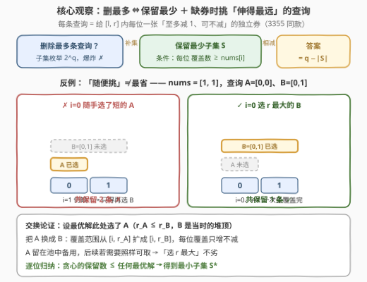
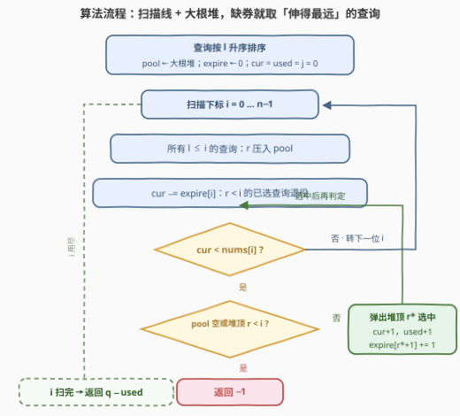
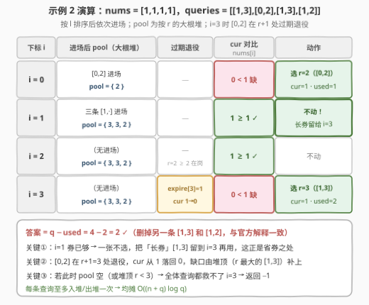

# 零数组变换 III

- **题目名称**：零数组变换 III
- **链接**：[3362. 零数组变换 III](https://leetcode.cn/problems/zero-array-transformation-iii/)
- **难度**：中等
- **标签**：贪心、数组、排序、堆（优先队列）、前缀和（差分）
- **关联**：[3355. 零数组变换 I](https://leetcode.cn/problems/zero-array-transformation-i/)（[站内题解](../3301-3400/3355_零数组变换I.md)）给出判定内核、[3356. 零数组变换 II](https://leetcode.cn/problems/zero-array-transformation-ii/)（[站内题解](../3301-3400/3356_零数组变换II.md)）把「前缀」玩到头；本题换问法——删**任意**子集、删到最多，前缀单调性失效，二分退场，换**扫描线 + 大根堆**贪心登场

## 1. 题目概述

给你一个长度为 $n$ 的整数数组 `nums` 和一个二维数组 `queries`，其中 `queries[i] = [l_i, r_i]`。

每个 `queries[i]` 表示对 `nums` 的以下操作：

- 将 `nums` 中下标在 $[l_i, r_i]$ 范围内的**每个**元素**最多**减少 1；
- 范围内每个元素减少的值相互**独立**（可以不减）。

**零数组**指的是所有元素都等于 0 的数组。

请你返回**最多**可以从 `queries` 中删除多少个元素，使得剩下的元素仍然能将 `nums` 变为**零数组**。如果无法将 `nums` 变为零数组，返回 -1。

**示例 1**：

```text
输入：nums = [2,0,2], queries = [[0,2],[0,2],[1,1]]
输出：1
解释：删除 queries[2] 后，剩下两条 [0,2] 各给下标 0、2 减 1，恰好清零。
```

**示例 2**：

```text
输入：nums = [1,1,1,1], queries = [[1,3],[0,2],[1,3],[1,2]]
输出：2
解释：可以删除 queries[2] 和 queries[3]。
```

**示例 3**：

```text
输入：nums = [1,2,3,4], queries = [[0,3]]
输出：-1
解释：下标 1 至多被覆盖 1 次 < 2，nums 无法变成零数组。
```

**约束条件**：

- $1 \le nums.length \le 10^5$
- $0 \le nums[i] \le 10^5$
- $1 \le queries.length \le 10^5$
- $queries[i].length = 2$
- $0 \le l_i \le r_i < nums.length$

> 💡 **读题关键**：① 每条查询仍是 3355/3356 的「区间减 1 券」，只是 val 恒为 1；② 问法从「最少处理前 $k$ 条」变成「删**任意**子集、删到最多」——3356 依赖的前缀单调性荡然无存，二分彻底失效；③ 「删最多」取补集就是「保留最少」：选出**最小**的查询子集 $S$，使每位 $i$ 被 $S$ 覆盖的次数 $\ge nums[i]$，答案即 $q - |S|$。

---

## 2. 解题思路

### 2.1 朴素思路：枚举删除子集 / 「随便挑」的陷阱

最直接的想法：枚举删除哪些查询——$q$ 条查询有 $2^q$ 个子集（$q \le 10^5$），每个还要 $O(n+q)$ 差分判定，双重爆炸，不可行。

退一步：不枚举了，从左到右逐位补缺口，每位缺 1 张券就**随便**找一条还能覆盖它的查询选上？**会翻车**：

```text
nums = [1,1]，queries = [[0,0],[0,1]]
i=0 缺 1 张：随手选 [0,0] → i=1 仍缺 → 只得再选 [0,1] → 保留 2 条
             若选 [0,1]  → i=0、i=1 一次覆盖完      → 保留 1 条
```

同样的需求，选法不同保留数不同——**「随便挑」能保证可行，但不保证最省**。这正是贪心选择特征的经典信号：局部选择需要一个明确的优先级。

### 2.2 核心观察：补集转化 + 扫描线 +「伸得最远」贪心



三个观察环环相扣：

**观察一（删最多 $\iff$ 保留最少）**：答案 $= q - |S^\ast|$，其中 $S^\ast$ 是满足「每位覆盖数 $\ge nums[i]$」的**最小**查询子集。可行性判据与 3355 一字不差：每条查询给 $[l, r]$ 内每位一张「至多减 1、可不减」的独立券，富余无害（少用几张即可精确归零），故可行 $\iff \text{cov}_i \ge nums[i]$。

**观察二（扫描线维护供需）**：按下标 $i$ 从左到右扫，两个量随时可 $O(1)$ 更新：

- **供给**：已选且仍在岗的查询数 `cur`——选中 $(l, r)$ 时在 `expire[r+1]` 打点，扫到下一位时 `cur -= expire[i]`，$r < i$ 的已选查询自动退役（差分打点，不用真删）；
- **候选**：所有 $l \le i$ 且未选用的查询，把 $r$ 压进**大根堆** `pool`——堆顶永远是最「伸得最远」的那条。

**观察三（缺券时弹 $r$ 最大者）**：当 `cur < nums[i]`，从 `pool` 弹出堆顶 $r^\ast$ 选中即可。正确性用**交换论证**：设某最优解在此时选了 $A$（$r_A \le r_B$，$B$ 是当前堆顶），把 $A$ 换成 $B$：$B$ 覆盖 $[i, r_B] \supseteq [i, r_A]$，每位覆盖只增不减；$A$ 留在池中，后续若需要仍可取用。故「选 $r$ 最大」不劣，逐位归纳得贪心保留数 $\le$ 最优。



> ⚠️ **三个高频翻车点**：
>
> - **堆顶 $r < i$ 时整个 `pool` 都已过期**（大根堆顶是最大者，它都够不着 $i$，别人更够不着）——此时仍缺券，直接返回 $-1$，别继续弹；
> - **$-1$ 不需要预先特判**：「池空或堆顶过期仍缺」$\iff$ 全体查询对 $i$ 的覆盖 $< nums[i]$（$l > i$ 的查询更不可能覆盖 $i$），贪心过程中自然暴露、暴露得更早；
> - **选中的查询别忘在 $r+1$ 打过期点**，否则 `cur` 虚高，后面会误判「不缺」。

### 2.3 算法流程

一句话：**排序 → 逐位扫描 → 进场（$r$ 入大根堆）→ 退役（差分扣减）→ 缺券则弹「伸得最远」的 → 扫完返回 $q - used$**。每条查询至多入堆、出堆一次，全流程均摊 $O((n+q)\log q)$。

### 2.4 示例演算



**示例 2** `nums = [1,1,1,1]`，`queries = [[1,3],[0,2],[1,3],[1,2]]`（按 $l$ 排序后 $[0,2],[1,3],[1,3],[1,2]$）：

1. $i=0$：`[0,2]` 进场，`pool={2}`；`cur=0 < 1` → 弹堆顶 $r=2$ 选中 `[0,2]`：`cur=1`，`used=1`，`expire[3]+=1`；
2. $i=1$：三条 `[1,·]` 进场，`pool={3,3,2}`；`cur=1 \ge 1` **不动**——长券 `[1,3]` 留给后面，这是省券的关键一步；
3. $i=2$：无进场、无过期（`[0,2]` 的 $r=2 \ge 2$ 仍在岗）；`cur=1 \ge 1` 不动；
4. $i=3$：`expire[3]=1` → `[0,2]` 退役，`cur=0 < 1` → 弹堆顶 $r=3$ 选中 `[1,3]`：`cur=1`，`used=2`；
5. 答案 $= 4 - 2 = \mathbf{2}$，删掉的恰是另一条 `[1,3]` 和 `[1,2]`，与官方解释一致 ✓。

**示例 1** `nums = [2,0,2]`：$i=0$ 需 2 张，连弹两条 `[0,2]`（`used=2`）；后面所有需求被这两条全覆盖 → $3-2=\mathbf{1}$ ✓。

**示例 3** `nums = [1,2,3,4]`：$i=0$ 选中唯一的 `[0,3]`（`used=1`）；$i=1$ 需 2 但 `pool` 已空 → **返回 $-1$** ✓。

---

## 3. 参考代码

### C++

```cpp
class Solution {
  public:
    int maxRemoval(vector<int>& nums, vector<vector<int>>& queries) {
        int n = nums.size(), q = queries.size();
        sort(queries.begin(), queries.end());          // 查询按 l 升序排序

        priority_queue<int> pool;                      // 已进场未选的查询，按 r 的大根堆
        vector<int> expire(n + 1);                     // 过期打点：选中 (l,r) 则 expire[r+1]+=1
        int cur = 0, used = 0, j = 0;
        for (int i = 0; i < n; i++) {
            while (j < q && queries[j][0] <= i)        // l ≤ i 的查询全部进场
                pool.push(queries[j++][1]);
            cur -= expire[i];                          // r < i 的已选查询退役
            while (cur < nums[i]) {                    // 覆盖不足 → 挑「伸得最远」的
                if (pool.empty() || pool.top() < i)    // 堆顶都过期 = 全池过期
                    return -1;
                int r = pool.top(); pool.pop();
                cur += 1;
                expire[r + 1] += 1;
                used++;
            }
        }
        return q - used;
    }
};
```

### Python

```python
class Solution:
    def maxRemoval(self, nums: List[int], queries: List[List[int]]) -> int:
        n, q = len(nums), len(queries)
        queries.sort()                                 # 查询按 l 升序排序

        pool = []                                      # 已进场未选的查询，按 r 的大根堆（负号模拟）
        expire = [0] * (n + 1)                         # 过期打点
        cur = used = j = 0
        for i, need in enumerate(nums):
            while j < q and queries[j][0] <= i:        # l ≤ i 的查询全部进场
                heapq.heappush(pool, -queries[j][1])
                j += 1
            cur -= expire[i]                           # r < i 的已选查询退役
            while cur < need:                          # 覆盖不足 → 挑「伸得最远」的
                if not pool or -pool[0] < i:           # 堆顶都过期 = 全池过期
                    return -1
                r = -heapq.heappop(pool)
                cur += 1
                expire[r + 1] += 1
                used += 1
        return q - used
```

> 💡 **实现细节**：① `pool` 只存 $r$——$l$ 信息用完即弃（排序 + 指针 $j$ 保证进场时机）；② 过期用差分打点而非再开一个小根堆，$O(1)$ 完成「批量退役」；③ `pool.top() < i` 与 `pool.empty()` 合并判断，二者都意味着「没有任何未选查询能覆盖 $i$」；④ 本题每条查询面值恒为 1，`cur` 就是覆盖计数，无溢出风险。

---

## 4. 复杂度分析

| 维度 | 复杂度 | 说明 |
|------|--------|------|
| 时间 | $O((n + q) \log q)$ | 排序 $O(q \log q)$；每条查询至多入堆/出堆一次 $O(q \log q)$；扫描与差分退役 $O(n + q)$；$n = q = 10^5$ 时约 $4 \times 10^6$ 步 |
| 空间 | $O(n + q)$ | 大根堆 $O(q)$ + 过期差分数组 $O(n)$ |
| 暴力对照 | $O(2^q \cdot (n + q))$ | 枚举删除子集再逐个判定，$q = 10^5$ 时天文数字 |

---

## 5. 扩展：区间任选的「无限制版」——闭式公式 1526

如果查询不限于给定集合、每次操作可在**任意** $[l, r]$ 上减 1，最少操作数有闭式答案：

$$\sum_{i=0}^{n-1} \max(0,\; nums[i] - nums[i-1]) \qquad (nums[-1] = 0)$$

这就是 [1526. 形成目标数组的子数组最少增加次数](https://leetcode.cn/problems/minimum-number-of-increments-on-subarrays-to-form-a-target-array/)（[站内题解](../1501-1600/1526_形成目标数组的子数组最少增加次数.md)）。直觉：一次操作是一段「高度为 1 的平台」，从左到右看，$nums$ 每次「升高」都得新开一条平台叠上去，「下降」只需让部分平台提前收尾。

本题正是 1526 的**区间受限版**：平台不能任意延伸，只能从给定查询里挑，闭式公式失效，退化为扫描线 + 大根堆。反过来，1526 的贪心也可看作本题贪心的极限情形——「堆顶 $r^\ast$」退化为「下一个上升沿所在位置」。两题对照着讲，「为什么贪心选最长」的直觉会非常扎实。

另一个值得对照的近亲是 3356 第 5 节的**单遍扫描 + 双堆**（活动堆/待解锁堆）：那套结构里「按 $r$ 的活动堆 + 过期弹出」与本题的 `pool + expire` 同宗——本题相当于把「前缀承诺 $k$」的约束摘掉后，只剩一个按 $r$ 的大根堆直接取用，反而更简单。

---

## 6. 面试要点

1. **为什么 3356 的二分在这里失效？**

   - 二分依赖「前 $k$ 条」的前缀结构以及可行性对 $k$ 的单调性；本题允许删除**任意**子集，保留哪些没有前缀性可言，可行集合不构成单调布尔序列。必须改问「最小保留子集」，转向贪心。

2. **贪心为什么每次弹 $r$ 最大的？**

   - 交换论证：把最优解中此时选中的短查询 $A$ 换成堆顶长查询 $B$，覆盖集从 $[i, r_A]$ 扩成 $[i, r_B]$ 只增不减，$A$ 留在池中备用不损失任何可能性；逐位归纳得贪心保留数不超过最优。

3. **$-1$ 的判定为什么不用提前 check 全体查询？**

   - 缺券且「池空或堆顶 $r < i$」时：$l \le i$ 的查询已全部进场并用尽（能覆盖 $i$ 的都已选中计入 `cur`），$l > i$ 的查询不可能覆盖 $i$——即全体查询对 $i$ 的总覆盖 $< nums[i]$，当场返回 $-1$ 与预先 `check(q)` 等价，且暴露得更早。

4. **「已选查询的退役」怎么 $O(1)$ 维护？**

   - 选中 $(l, r)$ 时 `expire[r+1] += 1`，扫描到每位先 `cur -= expire[i]`。等价写法是另开一个按 $r$ 的小根堆 `active` 弹出 $r < i$ 者——差分数组更轻，也避免了双堆代码。

5. **本题和 3355/3356 合起来看，系列在考什么？**

   - 同一个「区间减 1 券」世界观的三连问：**可行性判定**（3355，差分）→ **最少前缀**（3356，二分）→ **最多删除**（3362，贪心 + 堆）。每问一层，数据结构与不变式就换一套——这是面试官很爱的「一题三吃」递进结构。

---

## 7. 同类练习题

- [3355. 零数组变换 I](https://leetcode.cn/problems/zero-array-transformation-i/)（[站内题解](../3301-3400/3355_零数组变换I.md)）：系列判定内核——差分还原覆盖量逐位比较，本题可行性的理论根基
- [3356. 零数组变换 II](https://leetcode.cn/problems/zero-array-transformation-ii/)（[站内题解](../3301-3400/3356_零数组变换II.md)）：前缀版「最少处理几条」的二分解，与本题对照体会「前缀单调 vs 任意子集」的方法分野
- [1526. 形成目标数组的子数组最少增加次数](https://leetcode.cn/problems/minimum-number-of-increments-on-subarrays-to-form-a-target-array/)（[站内题解](../1501-1600/1526_形成目标数组的子数组最少增加次数.md)）：区间任选的无限制版，正增量求和闭式解，本题贪心的极限退化
- [2406. 将区间分为最少组数](https://leetcode.cn/problems/divide-intervals-into-minimum-number-of-groups/)（[站内题解](../2401-2500/2406_将区间分为最少组数.md)）：同款「按左端点扫描 + 右端点堆」骨架，最小堆回收方向的镜像应用
