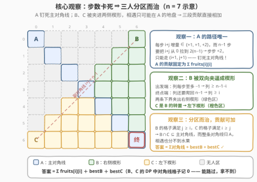
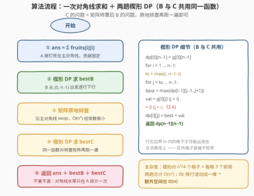
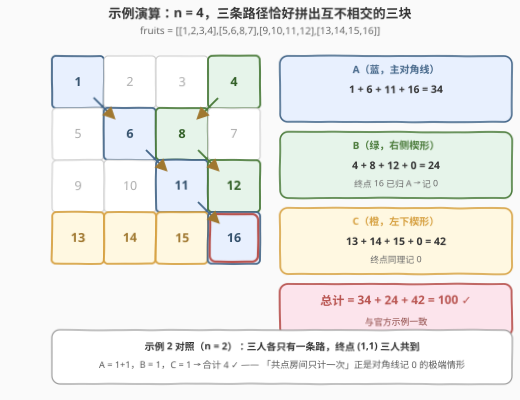

# 最多可收集的水果数目

- **题目名称**：最多可收集的水果数目
- **链接**：[3363. 最多可收集的水果数目](https://leetcode.cn/problems/find-the-maximum-number-of-fruits-collected/)
- **难度**：困难
- **标签**：数组、动态规划、矩阵
- **关联**：[741. 摘樱桃](https://leetcode.cn/problems/cherry-pickup/)（[站内题解](../0701-0800/741_摘樱桃.md)）代表「多人路径求和」的另一流派——相交伤得分时把所有人编码进同一状态同步推进；本题恰好相反，**步数卡死**把三人硬性分进三块互不相干的地盘，相交只发生在 A 的主场，从而可分解为三个独立 DP

## 1. 题目概述

一个游戏由 $n \times n$ 个房间网格状排布组成。给定二维整数数组 `fruits`，`fruits[i][j]` 表示房间 $(i, j)$ 中的水果数目。三个小朋友**一开始**分别从角落房间 $(0, 0)$、$(0, n-1)$ 和 $(n-1, 0)$ 出发。

每位小朋友都会**恰好移动 $n-1$ 次**，并到达房间 $(n-1, n-1)$：

- 从 $(0, 0)$ 出发的小朋友（下称 **A**）：从 $(i, j)$ 可到达 $(i+1, j+1)$、$(i+1, j)$ 和 $(i, j+1)$ 之一（如果存在）；
- 从 $(0, n-1)$ 出发的小朋友（下称 **B**）：从 $(i, j)$ 可到达 $(i+1, j-1)$、$(i+1, j)$ 和 $(i+1, j+1)$ 之一（如果存在）；
- 从 $(n-1, 0)$ 出发的小朋友（下称 **C**）：从 $(i, j)$ 可到达 $(i-1, j+1)$、$(i, j+1)$ 和 $(i+1, j+1)$ 之一（如果存在）。

小朋友到达一个房间时会收集其中**所有**水果；两个及以上小朋友进入同一房间时，水果只被收集**一次**。请返回三人总共**最多**可以收集多少个水果。

**示例 1**：

```text
输入：fruits = [[1,2,3,4],[5,6,8,7],[9,10,11,12],[13,14,15,16]]
输出：100
解释：A 走 (0,0)→(1,1)→(2,2)→(3,3)，B 走 (0,3)→(1,2)→(2,3)→(3,3)，
     C 走 (3,0)→(3,1)→(3,2)→(3,3)。
     共收集 1+6+11+16 + 4+8+12 + 13+14+15 = 100。
```

**示例 2**：

```text
输入：fruits = [[1,1],[1,1]]
输出：4
解释：三人唯一的目的地都是 (1,1)，四个房间各收一次，共 4。
```

**约束条件**：

- $2 \le n = fruits.length = fruits[i].length \le 1000$
- $0 \le fruits[i][j] \le 1000$

> 💡 **读题关键**：① 「**恰好** $n-1$ 步」不是废话，而是全题的题眼——步数被卡死意味着每个小朋友的每一步都必须"有效推进"，三个人能走的格子范围被大幅压缩；② 三人移动规则各不相同，但都朝右下方"斜着挤"向 $(n-1, n-1)$；③ 同一房间的水果只算一次，所以**路径重叠的去重**是本题的核心难点。

---

## 2. 解题思路

### 2.1 朴素思路：枚举路径组合 / 「各自最优再相加」的陷阱

最直接的想法是枚举三人的路径组合：每人约 $3^{n-1}$ 条路径，$n \le 1000$ 时是天文数字，不可行。

退一步：既然路径求和是加法，能否对三人**分别**求「单人最优路径和」再直接相加？**会翻车**——三人的可行区域本来就可能重叠（示例 2 中三人终点相同），各自最优的三条路径完全可能踩进同一个高分房间，直接相加就重复计数了。

「多人路径求和」问题有一个保底的重型解法：把所有人的位置编码进同一 DP 状态同步推进（如 741/1463 的 $dp[step][x_1][x_2]$）。但那需要三人**在同一时间轴上同步移动**——本题 B 按行推进、C 按列推进，方向根本不同步，同状态编码写起来极其别扭。正确姿势是先做结构分析：**重叠到底可能发生在哪里？**

### 2.2 核心观察：步数卡死 ⇒ 三人分区而治



四个观察环环相扣：

**观察一（A 的路径唯一）**：A 从 $(0,0)$ 出发恰好 $n-1$ 步到 $(n-1, n-1)$。三种走法对 $i+j$ 的增量分别是 $+2$（斜走）、$+1$、$+1$；起点 $i+j=0$，终点 $i+j = 2(n-1)$，$n-1$ 步的增量总和**最大**也就 $2(n-1)$——必须步步取 $+2$，即只能走 $(i+1, j+1)$。A 被**钉死在主对角线上**，贡献固定为 $\sum_i fruits[i][i]$，与其他两人零互动。

**观察二（B 被双向夹逼进楔形）**：B 的三种走法行号都 $+1$，列号变化 $\in \{-1, 0, +1\}$，即 B 每行恰好经过一个格子 $(i, b_i)$。两条硬约束分别从起点和终点夹过来：

- **出发端**：列从 $n-1$ 出发，每步至多左移 1 → 第 $i$ 行时 $b_i \ge n-1-i$（不越过**副对角线** $i+j = n-1$）；
- **终点端**：还剩 $n-1-i$ 步要把列爬回 $n-1$，每步至多右移 1 → $b_i \ge n-1-(n-1-i) = i$（不越过**主对角线** $j = i$）。

两条下界合起来 $b_i \ge \max(i,\ n-1-i)$：B 活在主、副对角线夹出的**右侧楔形**里。

**观察三（C 是 B 的转置）**：C 列号每步 $+1$、行号变化 $\in \{-1, 0, +1\}$。把矩阵沿主对角线转置后，C 的三种走法与 B 逐条重合（$(i-1,j+1) \to$ 转置 $(j+1, i-1)$ 即"行 $+1$、列 $-1$"，其余同理）。所以 C 活在镜像的**左下楔形**里，最优解与 B 共用同一个 DP 函数。

**观察四（分区而治，贡献可加）**：B 的所有格子满足 $j \ge i$，C 的所有格子满足 $i \ge j$，二者相遇只能是 $i = j$——**B 与 C 的交集 ⊆ 主对角线**。而整条主对角线都是 A 的必经之路，水果早已归 A：B、C 就算踩上去也分不到半颗。于是三人路径并集的求和可以干净地拆开：

$$\text{answer} \;=\; \underbrace{\sum_{i=0}^{n-1} fruits[i][i]}_{\text{A，路径唯一}} \;+\; \underbrace{\text{bestB}}_{\text{B 的楔形 DP}} \;+\; \underbrace{\text{bestC}}_{\text{C 的楔形 DP}}$$

其中 B、C 的 DP 把**对角线格子的价值记 0**——路过合法，但水果是 A 的。

> ⚠️ **「对角线记 0」≠「对角线禁走」**：B、C 仍可能路过甚至**必须**路过对角线——终点 $(n-1, n-1)$ 本身就在对角线上，禁止进入直接无解。记 0 恰好表达"能路过、拿不到"。
>
> ⚠️ **两条下界缺一不可**：只看出发端会误以为 B 能溜达到左下角；只看终点端会漏掉副对角线的限制。B 的可行格子集合是两个约束的**交集**（楔形），DP 时按行左边界 $lo = \max(i,\ n-1-i)$ 枚举即可，区外格子根本不会出现在任何合法路径上。

### 2.3 算法流程



一句话：**对角线求和 → B 跑一趟楔形 DP → 矩阵原地转置 → 同一函数再跑一趟得 C → 三段相加返回**。

楔形 DP（B 与 C 共用）按行推进：

- 初始 $dp[0][n-1] = fruits[0][n-1]$（B 的起点，$n \ge 2$ 时必不在对角线上）；
- 第 $i$ 行只枚举 $j \in [\max(i,\ n-1-i),\ n-1]$，转移从上一行 $j-1, j, j+1$ 三列取最大；
- 格子价值 $val = fruits[i][j]$（$j > i$ 时）或 $0$（$j = i$ 时，归 A）；
- 答案取 $dp[n-1][n-1]$（终点在对角线上，计 0，但它只是"收尾"，价值早已在前面的行里拿完）。

### 2.4 示例演算



**示例 1**（$n = 4$）：三人路径恰好落在互不相交的三块：

1. **A（主对角线）**：$1 + 6 + 11 + 16 = 34$；
2. **B（右侧楔形）**：路径 $(0,3) \to (1,2) \to (2,3) \to (3,3)$，收 $4 + 8 + 12 + 0 = 24$——终点 $16$ 已归 A，对 B 记 0；
3. **C（左下楔形）**：路径 $(3,0) \to (3,1) \to (3,2) \to (3,3)$，收 $13 + 14 + 15 + 0 = 42$；
4. 总计 $34 + 24 + 42 = \mathbf{100}$ ✓，与官方解释一致。

**示例 2**（$n = 2$）：三人都只有一条路且终点同为 $(1,1)$：$A = 1+1$，$B = 1$，$C = 1$，合计 $\mathbf{4}$ ✓——「共点房间只计一次」正是"对角线记 0"的极端情形。

---

## 3. 参考代码

### C++

```cpp
class Solution {
  public:
    int maxCollectedFruits(vector<vector<int>>& fruits) {
        int n = fruits.size(), ans = 0;
        for (int i = 0; i < n; i++) ans += fruits[i][i];   // A：被迫走主对角线
        ans += dpUpper(fruits);                            // B：右侧楔形 DP
        for (int i = 0; i < n; i++)                        // 原地转置，C = B 的转置版
            for (int j = i + 1; j < n; j++)
                swap(fruits[i][j], fruits[j][i]);
        ans += dpUpper(fruits);                            // C：左下楔形 DP
        return ans;
    }

  private:
    int dpUpper(vector<vector<int>>& g) {                  // 从 (0, n-1) 出发的楔形 DP
        int n = g.size();
        vector<int> dp(n, -1), ndp(n);                     // -1 = 不可达（水果非负，可当哨兵）
        dp[n - 1] = g[0][n - 1];
        for (int i = 1; i < n; i++) {
            fill(ndp.begin(), ndp.end(), -1);
            int lo = max(i, n - 1 - i);                    // 第 i 行楔形左边界
            for (int j = lo; j < n; j++) {
                int best = -1;
                for (int jj = j - 1; jj <= j + 1; jj++)    // 上一行三列取最大
                    if (0 <= jj && jj < n && dp[jj] >= 0)
                        best = max(best, dp[jj]);
                if (best >= 0)
                    ndp[j] = best + (j > i ? g[i][j] : 0); // 对角线归 A，记 0
            }
            swap(dp, ndp);
        }
        return dp[n - 1];
    }
};
```

### Python

```python
class Solution:
    def maxCollectedFruits(self, fruits: List[List[int]]) -> int:
        n = len(fruits)

        def dp_upper(g):                              # 从 (0, n-1) 出发的楔形 DP
            n = len(g)
            dp = [-1] * n                             # -1 = 不可达（水果非负，可当哨兵）
            dp[n - 1] = g[0][n - 1]
            for i in range(1, n):
                ndp = [-1] * n
                for j in range(max(i, n - 1 - i), n):  # 楔形左边界 lo = max(i, n-1-i)
                    best = max((dp[jj] for jj in (j - 1, j, j + 1)
                                if 0 <= jj < n and dp[jj] >= 0), default=-1)
                    if best >= 0:
                        ndp[j] = best + (g[i][j] if j > i else 0)  # 对角线记 0
                dp = ndp
            return dp[n - 1]

        ans = sum(fruits[i][i] for i in range(n))      # A：被迫走主对角线
        ans += dp_upper(fruits)                        # B：右侧楔形
        ans += dp_upper([list(r) for r in zip(*fruits)])  # C：转置后同款 DP
        return ans
```

> 💡 **实现细节**：① 楔形内每个格子都必然在某个合法路径上（起点可达 + 终点可回两个条件恰好就是两条下界），所以 `-1` 哨兵只会出现在区外，不会误伤；② dp 按行滚动成一维，额外空间 $O(n)$；③ C 直接复用 B 的函数——转置一次，胜过把三方向走法再写一遍；④ 水果非负，`-1` 才能兼作哨兵；若题目改成可能为负，需换 `INT_MIN` 并配可达标记。

---

## 4. 复杂度分析

| 维度 | 复杂度 | 说明 |
|------|--------|------|
| 时间 | $O(n^2)$ | A 求和 $O(n)$；每个楔形约 $n^2/4$ 个格子（$\sum_i \big(n - \max(i, n-1-i)\big) \approx n^2/4$），每格 3 个前驱，两趟合计约 $1.5 n^2$ 次操作，$n = 1000$ 时约 $1.5 \times 10^6$ 步 |
| 空间 | $O(n)$ 额外 | dp 按行滚动成一维；转置原地完成（不计输入矩阵） |
| 暴力对照 | $O(3^{3(n-1)})$ | 枚举三人路径组合；即使退化为「各自最优再相加」也会因重复计数而出错，错不在快慢在正确性 |

---

## 5. 扩展：多人路径求和的两派——同状态编码 vs 分区而治

「多人在网格上各走一条路径、共享格子只计一次」是一整类问题，解法分两派：

- **同状态编码派（741 / 1463）**： walkers 同步移动（同一步数轴、同方向），任意相交都可能"抢水果"，必须把所有人的位置编码进同一状态 $dp[step][x_1][x_2]$，同格时只计一次。[741. 摘樱桃](https://leetcode.cn/problems/cherry-pickup/)（[站内题解](../0701-0800/741_摘樱桃.md)）是"去程 + 回程"伪装成两人，[1463. 摘樱桃 II](https://leetcode.cn/problems/cherry-pickup-ii/)（[站内题解](../1401-1500/1463_摘樱桃II.md)）是两台机器人同层推进，均为 $O(n^3)$。
- **分区而治派（本题）**：先证明相交**不伤得分**（相交只会发生在某人独占的地盘），于是分解成若干个 $O(n^2)$ 的单人 DP。

口诀：**相交伤得分 → 同状态编码；相交不伤得分 → 分解独立 DP**。

顺带一提：本题的分解完全依赖"恰好 $n-1$ 步"这一条件。若把它放宽成"至多 $n-1$ 步"或"任意步数走到终点"，A 不再被钉死在主对角线，三区分解随之崩塌，就得退回 741 式的重型 DP——条件里看似人畜无害的四个字，恰恰是整道题能够 $O(n^2)$ 收场的全部前提。

---

## 6. 面试要点

1. **为什么 A 的路径唯一？**

   - 记 $i+j$ 为"进度"：起点 0、终点 $2(n-1)$、步数 $n-1$，而每步增量至多 $+2$，总增量上界 $2(n-1)$ 恰被取等——每一步都必须是斜走 $(i+1, j+1)$，即主对角线。

2. **B 的楔形两条下界分别从哪来？少一条会怎样？**

   - 出发端：列从 $n-1$ 出发每步至多左移 1，得 $b_i \ge n-1-i$（副对角线侧）；终点端：剩 $n-1-i$ 步要爬回列 $n-1$ 每步至多右移 1，得 $b_i \ge i$（主对角线侧）。只看出发端会误判 B 可达左下角，只看终点端会漏掉副对角线限制；楔形是二者交集。

3. **为什么 B、C 的 DP 可以完全独立、直接相加？**

   - B 的格子恒满足 $j \ge i$，C 恒满足 $i \ge j$，交集 ⊆ 主对角线；而主对角线整条被 A 独占且必走。把对角线在 B、C 的 DP 中记 0，三段相加不重不漏。

4. **对角线格子为什么记 0 而不是禁止进入？**

   - 终点 $(n-1, n-1)$ 本身就在对角线上，禁走直接无解；记 0 精确表达"能路过、水果归 A"。B/C 路过对角线格子在最优解中可能真实发生（作为中转），DP 会自动权衡。

5. **与 741/1463 的本质区别是什么？**

   - 相交是否伤害得分、以及 walkers 方向是否同步。741/1463 相交必伤得分（且方向同步、可同状态编码），只能 $O(n^3)$ 硬扛；本题相交不伤得分（都发生在 A 的地盘），可分解成三个 $O(n^2)$。

---

## 7. 同类练习题

- [741. 摘樱桃](https://leetcode.cn/problems/cherry-pickup/)（[站内题解](../0701-0800/741_摘樱桃.md)）：多人路径求和的「同状态编码」代表作，与本题「分区而治」互为镜像，两派对照着看收货最大
- [1463. 摘樱桃 II](https://leetcode.cn/problems/cherry-pickup-ii/)（[站内题解](../1401-1500/1463_摘樱桃II.md)）：两机器人同层推进 $dp[r][c_1][c_2]$，同格只计一次的标准写法
- [931. 下降路径最小和](https://leetcode.cn/problems/minimum-falling-path-sum/)（[站内题解](../0901-1000/931_下降路径最小和.md)）：单人逐行下行、相邻三列转移——正是本题 B 的楔形 DP 骨架（最小化版、无区域限制）
- [1289. 下降路径最小和 II](https://leetcode.cn/problems/minimum-falling-path-sum-ii/)（[站内题解](../1201-1300/1289_下降路径最小和II.md)）：下行 DP 的"下一行任选列"变体，体会转移集合的设计自由度
- [2435. 矩阵中和能被 K 整除的路径](https://leetcode.cn/problems/paths-in-matrix-whose-sum-is-divisible-by-k/)（[站内题解](../2401-2500/2435_矩阵中和能被K整除的路径.md)）：网格路径 DP 叠加附加维度（模 K）的计数版，展示"给 DP 状态加维度"的通用手法
