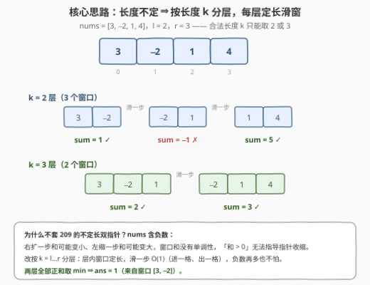
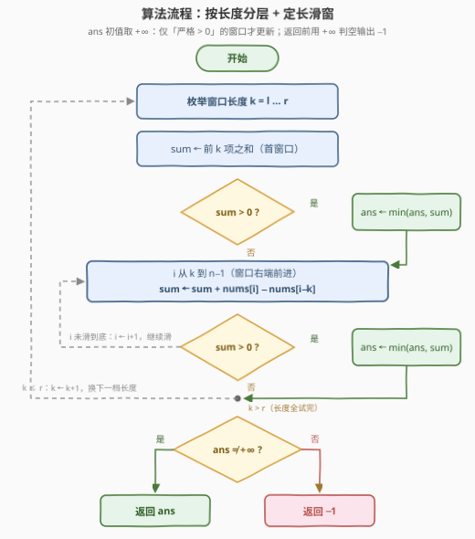
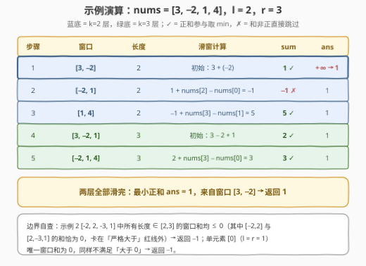

# 最小正和子数组

- **题目名称**：最小正和子数组
- **链接**：[3364. 最小正和子数组](https://leetcode.cn/problems/minimum-positive-sum-subarray/)
- **难度**：简单
- **标签**：数组、前缀和、滑动窗口
- **关联**：[209. 长度最小的子数组](https://leetcode.cn/problems/minimum-size-subarray-sum/) 玩的是「全正数 + 不定长滑窗」，[862. 和至少为 K 的最短子数组](https://leetcode.cn/problems/shortest-subarray-with-sum-at-least-k/) 是「含负数 + 前缀和单调队列」；本题恰好卡在两者之间——数组含负数、但只求长度限制在 $[l, r]$ 内的最小正和，$n \le 100$ 让「按长度分层」成为最顺手的一刀

## 1. 题目概述

给你一个整数数组 `nums` 和**两个**整数 `l` 和 `r`。你的任务是找到一个长度在 `l` 和 `r` 之间（**包含**）且和**大于 0** 的**子数组**的**最小**和。

返回满足条件的子数组的**最小**和。如果不存在这样的子数组，则返回 -1。

**子数组**是数组中的一个连续**非空**元素序列。

**示例 1**：

```text
输入：nums = [3, -2, 1, 4], l = 2, r = 3
输出：1
解释：长度在 [2, 3] 且和大于 0 的子数组有 [3,-2]=1、[1,4]=5、[3,-2,1]=2、[-2,1,4]=3，最小正和为 1。
```

**示例 2**：

```text
输入：nums = [-2, 2, -3, 1], l = 2, r = 3
输出：-1
解释：不存在长度在 [2, 3] 之间且和大于 0 的子数组。
```

**示例 3**：

```text
输入：nums = [1, 2, 3, 4], l = 2, r = 4
输出：3
解释：子数组 [1, 2] 的长度为 2，和为 3，是所有正和中最小的。
```

**约束条件**：

- $1 \le n \le 100$
- $1 \le l \le r \le n$
- $-1000 \le nums[i] \le 1000$

> 💡 **读题关键**：① 长度是「$[l, r]$ 内**任取**」，不是恰好 $l$ 或 $r$，中间每一档都是合法候选；② 「和**大于 0**」是严格正——和恰为 $0$ 的子数组不算数，这个细节直接决定 ans 哨兵不能取 0；③ $n \le 100$ 意味着 $O(n^2)$ 甚至 $O(n^3)$ 都能过（官方 hint 也直说「数据很小，挨个查」），但面试里要能讲清「为什么 209 的滑窗套路在这里失效」；④ 求的是**最小正和**，不是最短长度、也不是最大和。

---

## 2. 解题思路

### 2.1 朴素思路：枚举所有子数组

最直接的写法：二重循环枚举起点 $i$、终点 $j$，检查长度 $j - i + 1 \in [l, r]$ 后对区间重新求和，$O(n^3)$；用前缀和 $P$（$P[j] - P[i]$ 即区间和）把「求和」降到 $O(1)$，整体 $O(n^2)$。$n \le 100$ 时连 $O(n^3)$ 都只有 $10^6$ 量级，稳过。

不过「每个窗口反复求和」这层重复劳动是可以省的——**固定长度**的窗口滑动时，右边进一个元素、左边出一个元素，和的变化量 $O(1)$ 就能算出来。

### 2.2 核心观察：不定长 ⇒ 按长度分层 + 定长滑窗



三个观察环环相扣：

**观察一（分层降维）**：长度自由区间 $[l, r]$ 可以拆成 $r - l + 1$ 个**定长**子问题：$k = l$ 层、$k = l+1$ 层、……、$k = r$ 层。每个子问题里所有窗口同长，相邻窗口只差「右边进一个、左边出一个」，滑动一步 $O(1)$ 修正和，不必反复求和。总复杂度 $O(n \cdot (r - l + 1)) \le O(n^2)$，空间 $O(1)$。

**观察二（负数毁掉单调性）**：为什么不能像 209 那样双指针不定长滑窗？209 的正确性依赖**全正数**：右端扩张和严格变大、左端收缩和严格变小，于是「和 $\ge target$ 就收缩、否则扩张」的指针移动是安全的。本题数组含负数——右扩一步和可能**变小**，左缩一步和可能**变大**，「和 > 0」不再随窗口伸缩单调成立，双指针失去方向感。而定长滑窗不需要任何单调性，只做机械的「进一格出一格」，负数再多也无所谓。

**观察三（严格正 + 哨兵）**：合法答案必须**严格大于 0**，和恰为 0 的窗口要跳过。相应地，`ans` 的哨兵要取 $+\infty$（C++ 用 `INT_MAX`、Python 用 `float('inf')`），最后仍为哨兵才返回 $-1$——哨兵若取 0，既无法区分「没找到」，又会把「和为 0」误当候选。

> ⚠️ **三个高频翻车点**：
>
> - **滑窗更新漏了 $k$**：正确写法是 `sum += nums[i] - nums[i-k]`（右端推进到 $i$、左端离开 $i-k$），写成 `nums[i] - nums[i-1]` 就把窗口长度悄悄改成了 2；
> - **把 $[l, r]$ 当成「长度只能取 $l$ 或 $r$」**：中间每一档长度都是合法候选；
> - **`ans` 用 0 当初值**：见观察三，0 在本题是「非法值」，当哨兵会把「没有答案」误判成「答案是 0」。

### 2.3 算法流程图



外层 `k` 从 $l$ 到 $r$ 逐层推进；每层先算首窗口和，再让右端 $i$ 从 $k$ 扫到 $n-1$，每滑一步就地在 $O(1)$ 内修正 `sum`，遇正和更新 `ans`。两层循环走完，`ans` 仍是哨兵就输出 $-1$。

### 2.4 示例演算



**示例 1** `nums = [3, -2, 1, 4]，l = 2, r = 3`：

1. $k = 2$ 层：首窗口 $[3, -2]$ 和为 1（正），`ans` 从 $+\infty$ 落到 1；滑一步到 $[-2, 1]$ 和为 $-1$，跳过；再滑到 $[1, 4]$ 和为 5，不比 1 小；
2. $k = 3$ 层：$[3, -2, 1]$ 和为 2、$[-2, 1, 4]$ 和为 3，都大于 1。

答案 $1$ ✓。再补两个边界：示例 2 `[-2, 2, -3, 1]` 中所有长度 $\in [2, 3]$ 的窗口和均 $\le 0$——其中 $[-2, 2]$ 与 $[2, -3, 1]$ 的和**恰好为 0**，正卡在「严格大于」的红线外——两层滑完 `ans` 仍是 $+\infty$，返回 $-1$；单元素 `[0]`（$l = r = 1$）唯一窗口和为 0，同样返回 $-1$。

---

## 3. 参考代码

### C++

```cpp
class Solution {
  public:
    int minimumSumSubarray(vector<int>& nums, int l, int r) {
        int n = nums.size(), ans = INT_MAX;
        for (int k = l; k <= r; k++) {                    // 按长度分层：k = l … r
            int sum = accumulate(nums.begin(), nums.begin() + k, 0);
            if (sum > 0) ans = min(ans, sum);             // 首窗口
            for (int i = k; i < n; i++) {                 // 定长滑窗：右端进，左端出
                sum += nums[i] - nums[i - k];
                if (sum > 0) ans = min(ans, sum);
            }
        }
        return ans == INT_MAX ? -1 : ans;
    }
};
```

### Python

```python
class Solution:
    def minimumSumSubarray(self, nums: List[int], l: int, r: int) -> int:
        n, ans = len(nums), float('inf')
        for k in range(l, r + 1):                          # 按长度分层
            s = sum(nums[:k])                              # 首窗口
            if s > 0:
                ans = min(ans, s)
            for i in range(k, n):                          # 滑一步：进一格出一格
                s += nums[i] - nums[i - k]
                if s > 0:
                    ans = min(ans, s)
        return -1 if ans == float('inf') else ans


# 写法二：前缀和二重循环（同阶 O(n·(r−l+1))，更好想也更难写错）
class Solution:
    def minimumSumSubarray(self, nums: List[int], l: int, r: int) -> int:
        n = len(nums)
        pre = [0] * (n + 1)                                # pre[j] = nums[0..j-1] 之和
        for i, x in enumerate(nums):
            pre[i + 1] = pre[i] + x
        ans = float('inf')
        for i in range(n - l + 1):                         # 终点 j 只在 [i+l, i+r] 里取
            for j in range(i + l, min(i + r, n) + 1):
                s = pre[j] - pre[i]
                if s > 0:
                    ans = min(ans, s)
        return -1 if ans == float('inf') else ans
```

> 💡 **实现细节**：① 两层循环的次序（先长度后位置 / 先位置后长度）都可以，复杂度同为 $O(n(r-l+1))$；② `accumulate` / `sum(nums[:k])` 只在每层开头做一次，之后全是 $O(1)$ 增量；③ 返回前必须判哨兵，把 `INT_MAX` / `inf` 原样返回是典型 WA。

---

## 4. 复杂度分析

| 维度 | 复杂度 | 说明 |
|------|--------|------|
| 时间 | $O(n \cdot (r - l + 1)) \le O(n^2)$ | 每档长度一遍线性滑窗；$n \le 100$ 稳过 |
| 空间 | $O(1)$ | 定长滑窗只滚动一个 `sum`（前缀和写法为 $O(n)$） |
| 暴力对照 | $O(n^3)$ | 无前缀和时每个 $(i, j)$ 重新求和；$n \le 100$ 也能过，但面试应主动给出上表的两层写法 |

---

## 5. 扩展：$n$ 放大到 $10^5$ 怎么办——前缀和 + 有序集合

定长分层的 $O(n^2)$ 在 $n \le 100$ 下绰绰有余，但数组放大到 $10^5$ 就必须换武器。把子数组和写成前缀和之差：$sum(i..j) = P[j] - P[i]$，其中 $P[0] = 0$。目标变成：

$$\min \{\, P[j] - P[i] \;:\; j - i \in [l,\, r],\; P[j] - P[i] > 0 \,\}$$

对固定的右端点 $j$，差为正且尽量小 $\iff$ 在下标窗口 $i \in [j-r,\, j-l]$ 中取**严格小于 $P[j]$ 的最大** $P[i]$——被减数越大差越小，但不能碰到 $P[j]$，否则差非正。这正是「滑动窗口内的前驱查询」：把窗口里的 $P$ 值装进有序集合，每来一个新 $j$ 就二分找前驱。Java 用 `TreeMap.floorKey(pre[j] - 1)`，Python 用 `SortedList` + `bisect_left`：

```python
from sortedcontainers import SortedList

class Solution:
    def minimumSumSubarray(self, nums: List[int], l: int, r: int) -> int:
        n = len(nums)
        pre = [0]
        for x in nums:
            pre.append(pre[-1] + x)
        ans = float('inf')
        win = SortedList()                          # 窗口内 { P[i] : i ∈ [j−r, j−l] }
        for j in range(1, n + 1):
            if j - l >= 0:
                win.add(pre[j - l])                 # i = j−l 恰好合法，进入窗口
            if j - r - 1 >= 0:
                win.remove(pre[j - r - 1])          # i = j−r−1 已过期，移出窗口
            pos = win.bisect_left(pre[j])           # 严格小于 P[j] 的最大前驱
            if pos > 0:
                ans = min(ans, pre[j] - win[pos - 1])
        return -1 if ans == float('inf') else ans
```

进出窗口的时机值得咂摸：处理右端点 $j$ **之前**，先把 $i = j - l$ 放进来（它对应的子数组长度恰好压线 $l$）、把 $i = j - r - 1$ 请出去（长度将超出 $r$）。本题与 862（和至少为 K 的最短子数组）是同族——都是「前缀和 + 窗口内查结构」：862 的条件是「$\ge K$」的下界型，可以用**单调队列**弹头优化到 $O(n)$；本题要的是「严格小于的最大前驱」，有序集合二分 $O(n \log n)$ 最直接。

---

## 6. 面试要点

1. **为什么不能套 209 的双指针滑窗？**

   - 209 的全正数保证窗口和随右扩单调增、随左缩单调减，指针移动有方向感；本题含负数，右扩和可能变小、左缩和可能变大，「和 > 0」不再单调成立，双指针无法决策。定长滑窗不依赖单调性，只做机械的进一格出一格。

2. **「按长度分层」优化的本质是什么？**

   - 把不定长区间拆成 $r - l + 1$ 个定长子问题，层内相邻窗口只差两个元素，和的更新从 $O(k)$ 降为 $O(1)$，总复杂度 $O(n(r-l+1)) \le O(n^2)$。

3. **`ans` 为什么初始化为 $+\infty$ 而不是 0？**

   - 合法答案必须严格大于 0；哨兵取 0 既无法区分「没找到」（应返回 $-1$），又可能与「窗口和为 0」混淆。返回前判哨兵输出 $-1$。

4. **和恰好等于 0 的窗口怎么处理？**

   - 不合法，直接跳过——题目要求「大于 0」是严格不等号；这也是 `if (sum > 0)` 不能写成 `>=` 的原因（示例 2 里 $[-2, 2]$ 与 $[2, -3, 1]$ 的和恰为 0，就是专门埋的这个坑）。

5. **数据放大到 $10^5$ 怎么办？**

   - 前缀和改写为「窗口内找严格小于 $P[j]$ 的最大 $P[i]$」，用有序集合维护 $[j-r, j-l]$ 内的前缀和做前驱查询，$O(n \log n)$；与 862 的单调队列同族（见第 5 节）。

---

## 7. 同类练习题

- [209. 长度最小的子数组](https://leetcode.cn/problems/minimum-size-subarray-sum/)（[站内题解](../0201-0300/209_长度最小的子数组.md)）：全正数的不定长滑窗，对照体会「单调性」这一前提在 3364 如何失效
- [862. 和至少为 K 的最短子数组](https://leetcode.cn/problems/shortest-subarray-with-sum-at-least-k/)（[站内题解](../0801-0900/862_和至少为K的最短子数组.md)）：含负数时前缀和 + 单调队列的标准解，第 5 节扩展的近亲
- [53. 最大子数组和](https://leetcode.cn/problems/maximum-subarray/)（[站内题解](../0001-0100/53_最大子数组和.md)）：子数组和家族的另一极——Kadane 求最大，对照本题求最小正和
- [974. 和可被 K 整除的子数组](https://leetcode.cn/problems/subarray-sums-divisible-by-k/)（[站内题解](../0901-1000/974_和可被K整除的子数组.md)）：$P[j] - P[i]$ 的同余变形，前缀和组合条件的另一种打开方式
- [918. 环形子数组的最大和](https://leetcode.cn/problems/maximum-sum-circular-subarray/)（[站内题解](../0901-1000/918_最大环形子数组和.md)）：Kadane 的环形变体，把子数组和问题玩出花
