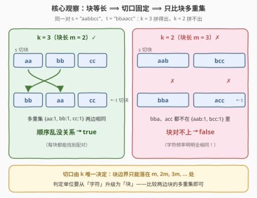
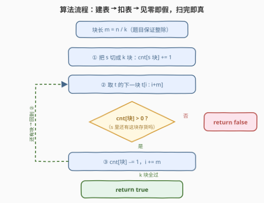
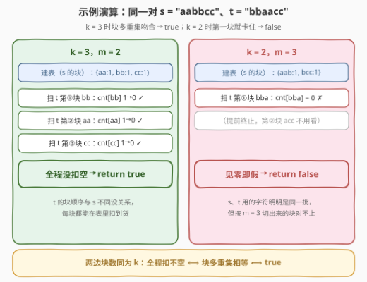

# 重排子字符串以形成目标字符串

- **题目名称**：重排子字符串以形成目标字符串
- **链接**：[3365. 重排子字符串以形成目标字符串](https://leetcode.cn/problems/rearrange-k-substrings-to-form-target-string/)
- **难度**：中等
- **标签**：哈希表、字符串、计数
- **关联**：[30. 串联所有单词的子串](https://leetcode.cn/problems/substring-with-concatenation-of-all-words/)（[站内题解](../0001-0100/30_串联所有单词的子串.md)）把「等长块 + 词频不变式」玩到极致；本题是同一世界观的**判定版**——不滑窗、不找位置，只问两边的块多重集是否恰好相等

## 1. 题目概述

给你两个字符串 `s` 和 `t`（题目保证它们**互为字母异位词**），以及一个整数 `k`。

判断：能否把 `s` **分割成 $k$ 个等长的子字符串**，然后**重排这些子字符串**（块内字符顺序不能动，块与块之间任意换序），并以任意顺序连接，使结果恰好等于 `t`？可以返回 `true`，否则 `false`。

**示例 1**：

```text
输入：s = "abcd", t = "cdab", k = 2
输出：true
解释：s 切成 ["ab", "cd"]，重排为 ["cd", "ab"]，连接得 "cdab" = t。
```

**示例 2**：

```text
输入：s = "aabbcc", t = "bbaacc", k = 3
输出：true
解释：s 切成 ["aa", "bb", "cc"]，重排为 ["bb", "aa", "cc"]，连接得 "bbaacc" = t。
```

**示例 3**：

```text
输入：s = "aabbcc", t = "bbaacc", k = 2
输出：false
解释：s 只能切成 ["aab", "bcc"]（等长切分唯一定死），无论怎么排都拼不出 "bbaacc"。
```

**约束条件**：

- $1 \le s.length = t.length = n \le 2 \times 10^5$
- $1 \le k \le n$，且 $n$ 能被 $k$ 整除
- `s`、`t` 仅由小写英文字母组成，且保证互为字母异位词

> 💡 **读题关键**：① 切法没有选择余地——$k$ 个块**等长**，块长 $m = n/k$，切口只能落在 $0, m, 2m, \dots$；② 重排是**块级**操作，块是刚性整体、内部不可拆；③ 题目虽保证字符级频率相同（异位词），但这**不等于**块级能对上——示例 3 就是现成反例。

---

## 2. 解题思路

### 2.1 朴素思路：枚举全排列 / 「异位词直接 true」陷阱

最直接的做法：枚举 $k$ 个块的全排列，每种排列拼接后与 `t` 比对。共 $k!$ 种排列、每种比对 $O(n)$，而 $k$ 可达 $2 \times 10^5$——$k!$ 是天文数字，不可行。

另一个直觉陷阱：题目都保证 `s`、`t` 互为字母异位词了，那字符随便挪总能拼出来，直接 `return true`？**示例 3 打脸**：两边字符频率完全相同，但 $k=2$ 时 `s` 的块 $\{aab, bcc\}$ 与 `t` 的块 $\{bba, acc\}$ 一个都对不上。字符级频率信息在「块刚性」约束下全部失效——**判定粒度必须从字符升级为块**。

### 2.2 核心观察：块等长 ⟹ 切口固定 ⟹ 比块多重集



三个观察环环相扣：

**观察一（切口固定）**：$k$ 个块等长，每块长 $m = n/k$。无论按什么顺序拼接这 $k$ 个块，结果串的块边界**只能**落在 $0, m, 2m, \dots, n$——与把 `t` 按 $m$ 切分的切口完全重合。换言之，「重排块再拼接」这件看似自由的事情，唯一的自由度就是块的顺序。

**观察二（判定等价）**：可拼成 $t$ $\iff$ 「`s` 按 $m$ 切出的 $k$ 块」与「`t` 按 $m$ 切出的 $k$ 块」作为**多重集**相等。

- **充分性**：多重集相等 ⟹ 存在置换 $\sigma$ 使 `s` 的第 $\sigma(i)$ 块恰等于 `t` 的第 $i$ 块，按此顺序拼接即得 $t$；
- **必要性**：若某个排列拼成了 $t$，由观察一（切口对齐），该排列的第 $i$ 块必须逐字符等于 `t` 的第 $i$ 块，即 `t` 的块恰好是 `s` 的块的一个排列。

**观察三（哈希计数判多重集相等）**：`s` 的块逐个入哈希表 $+1$，`t` 的块逐个 $-1$；一旦某个键的计数被扣到 $0$ 以下还要扣 ⟺ `t` 中该块比 `s` 中多 ⟹ 立即 `false`。扫完全程没扣空 ⟹ `true`——两边块数同为 $k$，计数总和回到 $0$ 且全程无负，只可能每键归零，即多重集相等。

### 2.3 算法流程



一句话：**定块长 → `s` 建表 → `t` 扣表 → 见零即假，扫完即真**。全程只有线性扫描 + 均摊 $O(1)$ 的哈希操作。

### 2.4 示例演算



同一对 `s = "aabbcc"`、`t = "bbaacc"`，两种 $k$ 走向完全不同：

- **$k=3$（$m=2$）**：`s` 建表 $\{aa{:}1,\ bb{:}1,\ cc{:}1\}$；扫 `t` 的块 $bb \to 0\ ✓$、$aa \to 0\ ✓$、$cc \to 0\ ✓$，全程没扣空 → **true**；
- **$k=2$（$m=3$）**：`s` 建表 $\{aab{:}1,\ bcc{:}1\}$；`t` 第一块 $bba$ 计数为 $0$ → **false**，提前终止。

再补两个边界直觉（算法无需特判，天然正确）：

- **$k=1$**：整个串就是唯一一块，重排毫无效果，答案即 $s == t$——如 $s=$ "ab"、$t=$ "ba" 互为异位词，但 $k=1$ 时是 **false**；
- **$k=n$**：块退化为单字符，异位词保证 ⟹ 字符多重集相等 ⟹ 恒 **true**。

---

## 3. 参考代码

### C++

```cpp
class Solution {
  public:
    bool isPossibleToRearrange(string s, string t, int k) {
        int n = s.size(), m = n / k;
        unordered_map<string, int> cnt;
        for (int i = 0; i < n; i += m)                 // s 的块逐个 +1 建表
            cnt[s.substr(i, m)]++;
        for (int i = 0; i < n; i += m)
            if (cnt[t.substr(i, m)]-- == 0)            // 扣之前就是 0 → t 这块没货
                return false;
        return true;                                    // 扫完没扣空 → 多重集相等
    }
};
```

### Python

```python
class Solution:
    def isPossibleToRearrange(self, s: str, t: str, k: int) -> bool:
        m = len(s) // k
        cnt = Counter(s[i:i + m] for i in range(0, len(s), m))   # s 的块建表
        for i in range(0, len(t), m):
            block = t[i:i + m]
            if cnt[block] == 0:                                   # 见零即假
                return False
            cnt[block] -= 1
        return True                                               # 扫完即真
```

> 💡 **实现细节**：① C++ 里 `cnt[key]-- == 0` 是「先取旧值比较、再自减」，判 false 与自减一次完成；② `substr` 共拷贝 $n$ 个字符，总量线性，无压力；③ Python 直接用 `Counter` 生成器一行建表；④ 判定顺序「先查再减」最稳，先减再判 `< 0` 也对，二者等价。

---

## 4. 复杂度分析

| 维度 | 复杂度 | 说明 |
|------|--------|------|
| 时间 | $O(n)$ | 切 `s`、扫 `t` 各遍历 $n$ 个字符；哈希操作均摊 $O(1)$，$n = 2\times 10^5$ 轻松通过 |
| 空间 | $O(n)$ | 哈希表最多存 $k$ 个块、合计 $n$ 个字符 |
| 暴力对照 | $O(k! \cdot n)$ | 枚举块的全排列逐一拼接比对，$k = 2\times 10^5$ 时天文数字 |

---

## 5. 扩展：块内也允许重排的变体

面试官常追问：如果把问法放宽成「块与块之间只需**互为异位词**」（拼接前允许打乱每个块内部的字符），怎么做？

只需把哈希键换成「块内部排序后的结果」——相当于先给每块发一张**规范化身份证**，再套本题模板：

```python
key = ''.join(sorted(block))    # C++: sort(block.begin(), block.end())
```

对照感受差异：$s=$ "abcd"、$t=$ "badc"、$k=2$——原问法下 `t` 的块是 $\{ba, dc\}$，与 $\{ab, cd\}$ 不等 → false；变体下排序成 $\{ab, cd\}$ 对 $\{ab, cd\}$ → true。复杂度从 $O(n)$ 升到 $O(n \log m)$（每块排序）。

再往前一步的推广就是 [30. 串联所有单词的子串](https://leetcode.cn/problems/substring-with-concatenation-of-all-words/)（[站内题解](../0001-0100/30_串联所有单词的子串.md)）：在**长串**里滑窗查找「等长词块的任意排列」，判定内核（词频不变式）与本题完全同源，只是多了 $w$ 个 offset 的滑窗组织。

---

## 6. 面试要点

1. **为什么只比块多重集就充分必要？**

   - 切口固定：$k$ 个块等长 ⟹ 任何拼接方案的边界只能落在 $m$ 的倍数处，与 `t` 按 $m$ 切分重合。于是「拼成 $t$」⟺「存在置换使 `s` 的第 $\sigma(i)$ 块 = `t` 的第 $i$ 块」⟺ 两边块多重集相等。

2. **题目保证了异位词，为什么还不能直接返回 true？**

   - 异位词只约束**字符级**频率；块是刚性整体、内部不可拆。示例 3 字符频率全同，但 $k=2$ 时块 $\{aab, bcc\}$ 与 $\{bba, acc\}$ 配不上 → false。

3. **「见零即假」的判定顺序有讲究吗？**

   - 先查后减（`cnt[b] == 0` 则 false）或先减后判（`--cnt[b] < 0` 则 false）等价；核心不变式都是「`t` 中某块数量一旦超过 `s`，立即出局」。

4. **为什么扫完不用再检查表里有没有剩的正计数（`s` 多 `t` 少）？**

   - 两边块数同为 $k$：计数向量总和为 $0$，若存在正计数则必有负计数，与「全程无负」矛盾；故全程不扣空 ⟹ 每键归零 ⟹ 多重集相等。

5. **$k=1$ 与 $k=n$ 两个极端边界的答案是什么？**

   - $k=1$：唯一一块、重排无效，答案即 $s == t$（"ab" vs "ba" → false）；$k=n$：块退化为单字符，异位词保证恒 true。算法无需特判，两种情况都自然覆盖。

---

## 7. 同类练习题

- [242. 有效的字母异位词](https://leetcode.cn/problems/valid-anagram/)：字符级频率计数模板，本题把计数单位从「字符」升级为「等长块」
- [30. 串联所有单词的子串](https://leetcode.cn/problems/substring-with-concatenation-of-all-words/)（[站内题解](../0001-0100/30_串联所有单词的子串.md)）：等长单词块 + 词频不变式 + offset 分类，本题判定版的滑窗查找强化版
- [438. 找到字符串中所有字母异位词](https://leetcode.cn/problems/find-all-anagrams-in-a-string/)（[站内题解](../0401-0500/438_找到字符串中所有字母异位词.md)）：定长窗口 + 频率匹配，「窗口多重集比较」的同款思维
- [187. 重复的DNA序列](https://leetcode.cn/problems/repeated-dna-sequences/)（[站内题解](../0101-0200/187_重复的DNA序列.md)）：定长子串哈希计数的底层技巧，本题块键哈希的直接来源
- [3146. 两个字符串的排列差](https://leetcode.cn/problems/permutation-difference-between-two-strings/)（[站内题解](../3101-3200/3146_两个字符串的排列差.md)）：同为「字符定位 + 哈希下标」的字符串签到家族，可对照速刷
